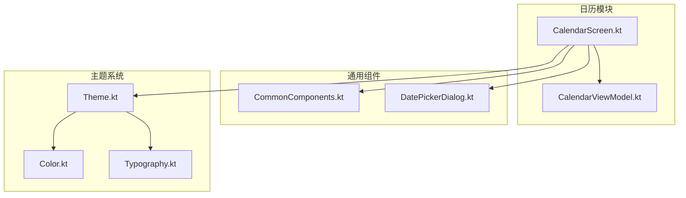
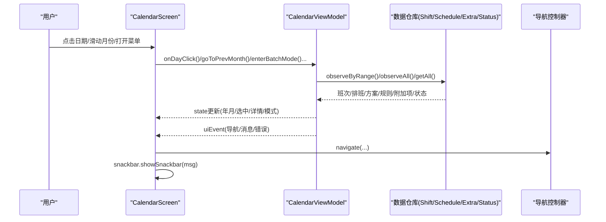
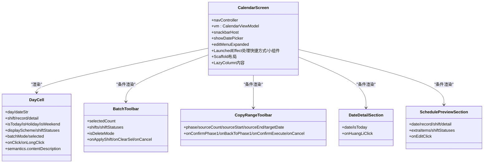
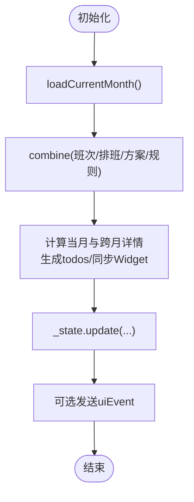
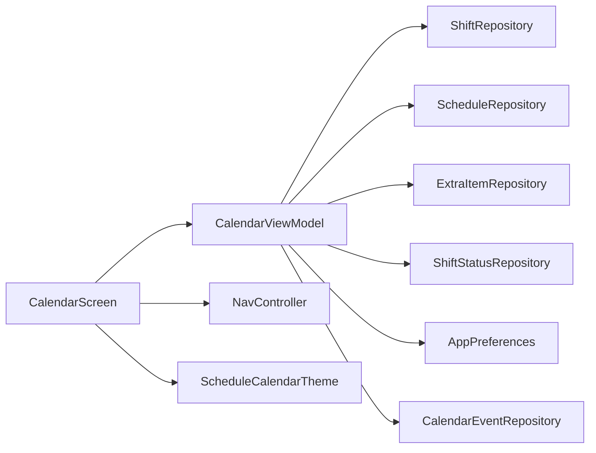

# View层实现

<cite>
**本文引用的文件**   
- [CalendarScreen.kt](file://app/src/main/java/com/schedulecalendar/app/ui/calendar/CalendarScreen.kt)
- [CalendarViewModel.kt](file://app/src/main/java/com/schedulecalendar/app/ui/calendar/CalendarViewModel.kt)
- [CommonComponents.kt](file://app/src/main/java/com/schedulecalendar/app/ui/component/CommonComponents.kt)
- [DatePickerDialog.kt](file://app/src/main/java/com/schedulecalendar/app/ui/component/DatePickerDialog.kt)
- [Theme.kt](file://app/src/main/java/com/schedulecalendar/app/ui/theme/Theme.kt)
- [Color.kt](file://app/src/main/java/com/schedulecalendar/app/ui/theme/Color.kt)
- [Typography.kt](file://app/src/main/java/com/schedulecalendar/app/ui/theme/Typography.kt)
</cite>

## 目录
1. [简介](#简介)
2. [项目结构](#项目结构)
3. [核心组件](#核心组件)
4. [架构总览](#架构总览)
5. [详细组件分析](#详细组件分析)
6. [依赖关系分析](#依赖关系分析)
7. [性能与可访问性](#性能与可访问性)
8. [故障排查指南](#故障排查指南)
9. [结论](#结论)

## 简介
本文件聚焦于View层的Jetpack Compose实现，围绕声明式UI设计模式、组合函数组织、状态提升与响应式更新机制展开。重点解析 CalendarScreen 的架构与交互流程，说明自定义组件封装与复用策略（CommonComponents），并阐述主题系统与Material Design 3的实现细节。文末提供最佳实践建议，涵盖副作用处理、性能优化与可访问性支持。

## 项目结构
View层采用按功能域划分的包结构：
- calendar：日历主界面与视图模型
- component：通用UI组件与对话框
- theme：主题、颜色与字体
- navigation/detail/hours/settings等：其他页面（本文不深入）

图表来源
- [CalendarScreen.kt:1-120](file://app/src/main/java/com/schedulecalendar/app/ui/calendar/CalendarScreen.kt#L1-L120)
- [CalendarViewModel.kt:104-132](file://app/src/main/java/com/schedulecalendar/app/ui/calendar/CalendarViewModel.kt#L104-L132)
- [CommonComponents.kt:38-166](file://app/src/main/java/com/schedulecalendar/app/ui/component/CommonComponents.kt#L38-L166)
- [DatePickerDialog.kt:191-303](file://app/src/main/java/com/schedulecalendar/app/ui/component/DatePickerDialog.kt#L191-L303)
- [Theme.kt:49-76](file://app/src/main/java/com/schedulecalendar/app/ui/theme/Theme.kt#L49-L76)
- [Color.kt:1-43](file://app/src/main/java/com/schedulecalendar/app/ui/theme/Color.kt#L1-L43)
- [Typography.kt:9-20](file://app/src/main/java/com/schedulecalendar/app/ui/theme/Typography.kt#L9-L20)

章节来源
- [CalendarScreen.kt:1-120](file://app/src/main/java/com/schedulecalendar/app/ui/calendar/CalendarScreen.kt#L1-L120)
- [CalendarViewModel.kt:104-132](file://app/src/main/java/com/schedulecalendar/app/ui/calendar/CalendarViewModel.kt#L104-L132)
- [CommonComponents.kt:38-166](file://app/src/main/java/com/schedulecalendar/app/ui/component/CommonComponents.kt#L38-L166)
- [DatePickerDialog.kt:191-303](file://app/src/main/java/com/schedulecalendar/app/ui/component/DatePickerDialog.kt#L191-L303)
- [Theme.kt:49-76](file://app/src/main/java/com/schedulecalendar/app/ui/theme/Theme.kt#L49-L76)
- [Color.kt:1-43](file://app/src/main/java/com/schedulecalendar/app/ui/theme/Color.kt#L1-L43)
- [Typography.kt:9-20](file://app/src/main/java/com/schedulecalendar/app/ui/theme/Typography.kt#L9-L20)

## 核心组件
- CalendarScreen：日历主界面，负责顶部导航栏、星期标题行、日历网格、批量/复制/删除工具栏、日期详情与排班预览、纪念日与日程展示、弹窗与侧滑切换月份等。
- CalendarViewModel：暴露不可变状态流与事件通道，聚合数据源（班次、排班、显示方案、规则、附加项、状态等），计算当月详情与待办，处理用户操作（打卡、批量、复制、跳转等）。
- CommonComponents：通用UI元素，如顶部栏、颜色选择器、统计卡片、时间选择输入框、IME自适应输入框等。
- DatePickerDialog：滚轮年月/年月日选择器，用于快速跳转到指定日期或月份。
- Theme/Color/Typography：Material 3主题配置，包含动态取色、静态色板与字体样式。

章节来源
- [CalendarScreen.kt:74-120](file://app/src/main/java/com/schedulecalendar/app/ui/calendar/CalendarScreen.kt#L74-L120)
- [CalendarViewModel.kt:52-102](file://app/src/main/java/com/schedulecalendar/app/ui/calendar/CalendarViewModel.kt#L52-L102)
- [CommonComponents.kt:38-166](file://app/src/main/java/com/schedulecalendar/app/ui/component/CommonComponents.kt#L38-L166)
- [DatePickerDialog.kt:191-303](file://app/src/main/java/com/schedulecalendar/app/ui/component/DatePickerDialog.kt#L191-L303)
- [Theme.kt:49-76](file://app/src/main/java/com/schedulecalendar/app/ui/theme/Theme.kt#L49-L76)

## 架构总览
CalendarScreen遵循“状态提升+单向数据流”的Compose最佳实践：
- ViewModel通过StateFlow暴露当前月数据、显示方案、选中日期、批量/复制/删除模式等；
- Screen订阅状态流，使用collectAsStateWithLifecycle在生命周期内收集；
- 用户交互触发ViewModel方法，内部执行数据变更与副作用（通知、同步Widget、刷新日历等）；
- UI事件通过Channel从ViewModel下发到Screen，驱动Snackbar、导航等副作用。

图表来源
- [CalendarScreen.kt:74-130](file://app/src/main/java/com/schedulecalendar/app/ui/calendar/CalendarScreen.kt#L74-L130)
- [CalendarViewModel.kt:134-246](file://app/src/main/java/com/schedulecalendar/app/ui/calendar/CalendarViewModel.kt#L134-L246)

章节来源
- [CalendarScreen.kt:74-130](file://app/src/main/java/com/schedulecalendar/app/ui/calendar/CalendarScreen.kt#L74-L130)
- [CalendarViewModel.kt:134-246](file://app/src/main/java/com/schedulecalendar/app/ui/calendar/CalendarViewModel.kt#L134-L246)

## 详细组件分析

### CalendarScreen 组件
- 组合函数组织
  - 顶层入口：CalendarScreen(navController, vm)，负责LaunchedEffect处理快捷方式与小组件导航、订阅uiEvent、构建Scaffold与LazyColumn内容。
  - 子组件：DayCell（单元格）、BatchToolbar（批量工具栏）、CopyRangeToolbar（复制工具栏）、DateDetailSection（日期详情）、SchedulePreviewSection（排班预览）、AnniversaryEventSection（纪念日与日程）。
  - 弹窗：WheelDatePickerDialog（年月滚轮）、YearMonthPickerDialog（公历/农历四列滚动选择）。
- 状态提升与响应式更新
  - 通过vm.state.collectAsStateWithLifecycle获取不可变状态，所有UI分支由state驱动。
  - 月份切换使用AnimatedContent配合目标状态编码为整数，实现平滑过渡。
- 用户交互与事件分发
  - 手势：detectHorizontalDragGestures实现左右滑动切换月份。
  - 点击/长按：DayCell.onLongClick进入详情页；onDayClick根据模式（普通/批量/复制/删除）分派不同逻辑。
  - 菜单：编辑菜单下拉项触发进入批量/复制/删除模式或跳转显示方案。
  - 事件：uiEvent统一处理导航与提示。
- 无障碍支持
  - DayCell使用semantics.contentDescription生成可读描述，包含日期、班次、农历、节假日、是否今天等信息。

图表来源
- [CalendarScreen.kt:74-120](file://app/src/main/java/com/schedulecalendar/app/ui/calendar/CalendarScreen.kt#L74-L120)
- [CalendarScreen.kt:624-965](file://app/src/main/java/com/schedulecalendar/app/ui/calendar/CalendarScreen.kt#L624-L965)
- [CalendarScreen.kt:969-1165](file://app/src/main/java/com/schedulecalendar/app/ui/calendar/CalendarScreen.kt#L969-L1165)
- [CalendarScreen.kt:1240-1329](file://app/src/main/java/com/schedulecalendar/app/ui/calendar/CalendarScreen.kt#L1240-L1329)
- [CalendarScreen.kt:1766-1981](file://app/src/main/java/com/schedulecalendar/app/ui/calendar/CalendarScreen.kt#L1766-L1981)
- [CalendarScreen.kt:1987-2145](file://app/src/main/java/com/schedulecalendar/app/ui/calendar/CalendarScreen.kt#L1987-L2145)

章节来源
- [CalendarScreen.kt:74-120](file://app/src/main/java/com/schedulecalendar/app/ui/calendar/CalendarScreen.kt#L74-L120)
- [CalendarScreen.kt:624-965](file://app/src/main/java/com/schedulecalendar/app/ui/calendar/CalendarScreen.kt#L624-L965)
- [CalendarScreen.kt:969-1165](file://app/src/main/java/com/schedulecalendar/app/ui/calendar/CalendarScreen.kt#L969-L1165)
- [CalendarScreen.kt:1240-1329](file://app/src/main/java/com/schedulecalendar/app/ui/calendar/CalendarScreen.kt#L1240-L1329)
- [CalendarScreen.kt:1766-1981](file://app/src/main/java/com/schedulecalendar/app/ui/calendar/CalendarScreen.kt#L1766-L1981)
- [CalendarScreen.kt:1987-2145](file://app/src/main/java/com/schedulecalendar/app/ui/calendar/CalendarScreen.kt#L1987-L2145)

### CalendarViewModel 状态与事件
- 状态模型
  - CalendarUiState集中管理年月、班次/状态列表、排班记录、显示方案、每日详情、待办、批量/复制/删除模式、选中日期、纪念日与日程事件等。
- 数据聚合与计算
  - loadCurrentMonth使用combine聚合多个数据源，计算跨月填充日期详情，生成todos，更新state并同步Widget与日历小部件。
- 用户操作
  - 月份切换、今日跳转、日期点击、打卡补录、加班确认/忽略、批量应用/删除、复制排班（范围/整月）、规则应用等。
- 事件通道
  - uiEvent为Channel，承载导航与消息/错误事件，供Screen消费。

图表来源
- [CalendarViewModel.kt:134-246](file://app/src/main/java/com/schedulecalendar/app/ui/calendar/CalendarViewModel.kt#L134-L246)

章节来源
- [CalendarViewModel.kt:52-102](file://app/src/main/java/com/schedulecalendar/app/ui/calendar/CalendarViewModel.kt#L52-L102)
- [CalendarViewModel.kt:134-246](file://app/src/main/java/com/schedulecalendar/app/ui/calendar/CalendarViewModel.kt#L134-L246)
- [CalendarViewModel.kt:326-376](file://app/src/main/java/com/schedulecalendar/app/ui/calendar/CalendarViewModel.kt#L326-L376)
- [CalendarViewModel.kt:552-793](file://app/src/main/java/com/schedulecalendar/app/ui/calendar/CalendarViewModel.kt#L552-L793)

### 自定义组件封装与复用（CommonComponents）
- 通用UI元素
  - ScheduleTopBar：带返回按钮与动作的顶部栏。
  - ShiftColorDot/ColorPicker：班次颜色圆点与两行18色选择器。
  - StatCard：信息统计卡片。
  - MonthNavigator：月份切换导航。
  - SettingRow/NumericSettingRow：设置项行与数字输入行。
  - TimePickerField/ExpandableTimePicker：时间选择输入框，支持外部控制对话框或内部对话框。
  - ImeAdaptiveOutlinedTextField：IME自适应输入框，自动滚动避免软键盘遮挡。
- 复用策略
  - 将高频使用的UI片段抽取为独立@Composable，参数化行为与样式，便于在不同页面复用。
  - 对复杂交互（如时间选择）提供两种模式：自包含对话框与外部控制回调，适配LazyColumn等场景。

章节来源
- [CommonComponents.kt:38-166](file://app/src/main/java/com/schedulecalendar/app/ui/component/CommonComponents.kt#L38-L166)
- [CommonComponents.kt:181-341](file://app/src/main/java/com/schedulecalendar/app/ui/component/CommonComponents.kt#L181-L341)
- [CommonComponents.kt:355-443](file://app/src/main/java/com/schedulecalendar/app/ui/component/CommonComponents.kt#L355-L443)

### 日期选择器（DatePickerDialog）
- WheelDatePickerDialog：年/月滚轮选择，紧凑布局，最大宽度屏幕85%。
- WheelFullDatePickerDialog：年/月/日三列滚轮，支持固定最大天数（如农历场景）。
- 交互与状态
  - 使用remember维护snapped值，滚动结束时更新；当月份变化导致天数缩小时自动收窄日。
  - 确认时进行边界约束，确保合法日期。

章节来源
- [DatePickerDialog.kt:191-303](file://app/src/main/java/com/schedulecalendar/app/ui/component/DatePickerDialog.kt#L191-L303)
- [DatePickerDialog.kt:33-186](file://app/src/main/java/com/schedulecalendar/app/ui/component/DatePickerDialog.kt#L33-L186)

### 主题系统与Material Design 3
- 主题入口
  - ScheduleCalendarTheme：根据系统深色模式与Android版本决定使用动态色板或静态色板，注入Typography。
- 颜色定义
  - Color.kt定义主色、辅色、中性色、语义色、节假日/休息色、班次预设颜色。
- 字体样式
  - Typography.kt定义headline/title/body/label各级样式，统一字号与行高。

章节来源
- [Theme.kt:49-76](file://app/src/main/java/com/schedulecalendar/app/ui/theme/Theme.kt#L49-L76)
- [Color.kt:1-43](file://app/src/main/java/com/schedulecalendar/app/ui/theme/Color.kt#L1-L43)
- [Typography.kt:9-20](file://app/src/main/java/com/schedulecalendar/app/ui/theme/Typography.kt#L9-L20)

## 依赖关系分析
- 组件耦合
  - CalendarScreen强依赖CalendarViewModel的状态与事件，弱依赖导航控制器与主题。
  - DayCell仅依赖传入的数据与回调，无全局状态，具备良好可测试性与复用性。
- 外部依赖
  - 数据仓库：ShiftRepository、ScheduleRepository、ExtraItemRepository、ShiftStatusRepository等。
  - 偏好设置：AppPreferences（显示方案、排序、计薪配置等）。
  - 日历事件：CalendarEventRepository（纪念日与日程）。
- 潜在循环依赖
  - 当前结构清晰，未见循环引用；ViewModel仅依赖仓库与偏好，Screen仅消费状态与事件。

图表来源
- [CalendarViewModel.kt:104-132](file://app/src/main/java/com/schedulecalendar/app/ui/calendar/CalendarViewModel.kt#L104-L132)
- [CalendarScreen.kt:74-120](file://app/src/main/java/com/schedulecalendar/app/ui/calendar/CalendarScreen.kt#L74-L120)

章节来源
- [CalendarViewModel.kt:104-132](file://app/src/main/java/com/schedulecalendar/app/ui/calendar/CalendarViewModel.kt#L104-L132)
- [CalendarScreen.kt:74-120](file://app/src/main/java/com/schedulecalendar/app/ui/calendar/CalendarScreen.kt#L74-L120)

## 性能与可访问性
- 性能优化
  - LazyColumn与AnimatedContent结合，减少不必要的重组与绘制。
  - 月份切换使用整数编码目标状态，避免对象重建开销。
  - 跨月填充日期详情预计算，避免重复查询。
  - collectJob在切月时取消旧协程，防止collector累积泄漏。
- 可访问性
  - DayCell使用semantics.contentDescription生成完整描述，包括日期、班次、农历、节假日、是否今天等。
  - 图标与按钮提供contentDescription，便于读屏器识别。
- 副作用处理
  - LaunchedEffect用于一次性副作用（处理快捷方式、小组件导航、IME滚动）。
  - Channel传递一次性UI事件，避免状态污染。

章节来源
- [CalendarScreen.kt:84-130](file://app/src/main/java/com/schedulecalendar/app/ui/calendar/CalendarScreen.kt#L84-L130)
- [CalendarScreen.kt:295-317](file://app/src/main/java/com/schedulecalendar/app/ui/calendar/CalendarScreen.kt#L295-L317)
- [CalendarScreen.kt:667-677](file://app/src/main/java/com/schedulecalendar/app/ui/calendar/CalendarScreen.kt#L667-L677)
- [CalendarViewModel.kt:123-132](file://app/src/main/java/com/schedulecalendar/app/ui/calendar/CalendarViewModel.kt#L123-L132)

## 故障排查指南
- 常见问题
  - 月份切换闪烁：检查是否在切换时清空了过多状态；当前实现不清除旧数据以避免闪烁。
  - IME遮挡输入框：使用ImeAdaptiveOutlinedTextField，或在LazyColumn中通过onFocused回调处理滚动。
  - 时间选择器状态丢失：在LazyColumn中使用ExpandableTimePicker的外部控制模式，避免内部对话框状态问题。
- 定位方法
  - 观察uiEvent中的消息/错误，确认业务逻辑是否正确执行。
  - 打印collectJob生命周期，确保切月时旧协程被正确取消。

章节来源
- [CommonComponents.kt:355-443](file://app/src/main/java/com/schedulecalendar/app/ui/component/CommonComponents.kt#L355-L443)
- [CalendarViewModel.kt:123-132](file://app/src/main/java/com/schedulecalendar/app/ui/calendar/CalendarViewModel.kt#L123-L132)

## 结论
CalendarScreen以清晰的组合函数分层、严格的状态提升与响应式更新机制，实现了复杂的日历交互与批量操作。CommonComponents提供了高复用的UI元素，DatePickerDialog增强了日期选择的体验。主题系统基于Material 3，兼顾动态取色与静态色板，保证一致的品牌视觉。整体架构具备良好的可维护性与扩展性，同时注重性能与可访问性，符合现代Compose开发的最佳实践。