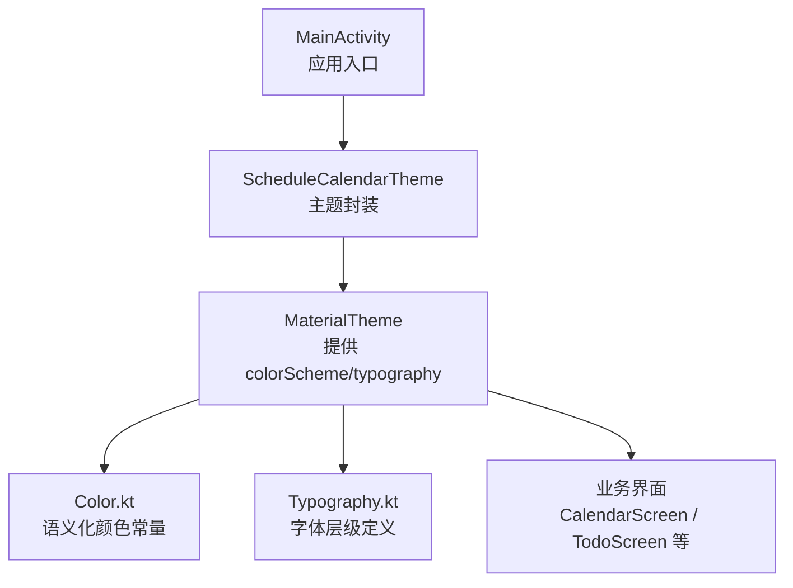
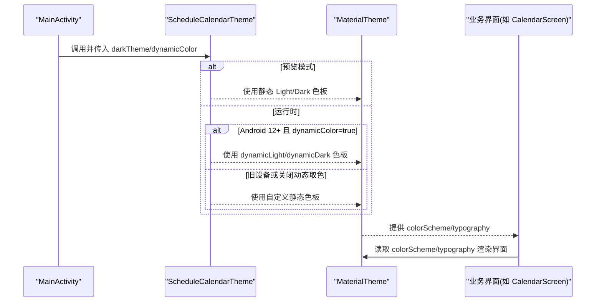
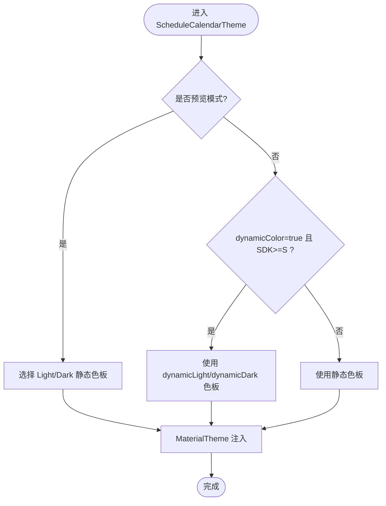
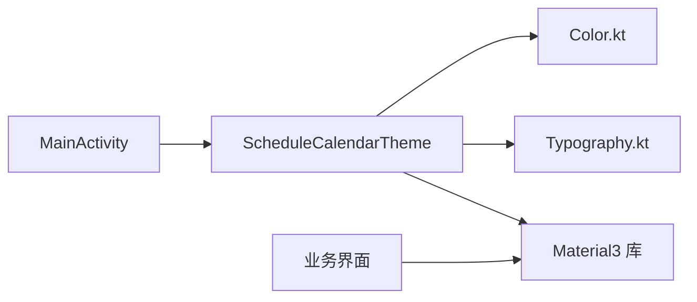

# 主题系统实现

<cite>
**本文引用的文件**   
- [Color.kt](file://app/src/main/java/com/schedulecalendar/app/ui/theme/Color.kt)
- [Typography.kt](file://app/src/main/java/com/schedulecalendar/app/ui/theme/Typography.kt)
- [Theme.kt](file://app/src/main/java/com/schedulecalendar/app/ui/theme/Theme.kt)
- [MainActivity.kt](file://app/src/main/java/com/schedulecalendar/app/MainActivity.kt)
- [CalendarScreen.kt](file://app/src/main/java/com/schedulecalendar/app/ui/calendar/CalendarScreen.kt)
- [TodoScreen.kt](file://app/src/main/java/com/schedulecalendar/app/ui/todo/TodoScreen.kt)
</cite>

## 目录
1. [简介](#简介)
2. [项目结构](#项目结构)
3. [核心组件](#核心组件)
4. [架构总览](#架构总览)
5. [详细组件分析](#详细组件分析)
6. [依赖关系分析](#依赖关系分析)
7. [性能与可维护性](#性能与可维护性)
8. [故障排查指南](#故障排查指南)
9. [结论](#结论)
10. [附录：主题定制指南](#附录主题定制指南)

## 简介
本文件系统化梳理了应用中的 Material Design 3 主题实现，涵盖颜色系统、字体排版规范、形状设计以及 ScheduleCalendarTheme 的主题配置。文档重点说明动态取色（Material You）与深色模式适配策略、语义化颜色命名与使用场景、字体层次结构与样式定义，并提供扩展新配色方案、修改字体与实现品牌化主题的实践建议，帮助团队在一致性与可维护性的前提下进行主题定制。

## 项目结构
主题相关代码集中在 ui/theme 包中，由 MainActivity 作为入口包裹整个应用树，从而将主题注入到所有 Compose 节点。

图表来源
- [MainActivity.kt:55-64](file://app/src/main/java/com/schedulecalendar/app/MainActivity.kt#L55-L64)
- [Theme.kt:49-75](file://app/src/main/java/com/schedulecalendar/app/ui/theme/Theme.kt#L49-L75)
- [Color.kt:1-43](file://app/src/main/java/com/schedulecalendar/app/ui/theme/Color.kt#L1-L43)
- [Typography.kt:9-19](file://app/src/main/java/com/schedulecalendar/app/ui/theme/Typography.kt#L9-L19)

章节来源
- [MainActivity.kt:55-64](file://app/src/main/java/com/schedulecalendar/app/MainActivity.kt#L55-L64)
- [Theme.kt:49-75](file://app/src/main/java/com/schedulecalendar/app/ui/theme/Theme.kt#L49-L75)

## 核心组件
- 颜色系统（Color.kt）
  - 主色调：绿色系（Green700/Green600/Green100/Green50）
  - 辅助色：蓝色（Blue600/Blue100）
  - 中性色：灰阶（Gray900~Gray50）
  - 语义色：错误/警告/黑白（RedError/OrangeWarn/White/Black）
  - 业务专用：节假日/休息（HolidayRed/RestGray）
  - 班次预设色板：ShiftPresetColors（18色，高区分度）
- 字体排版（Typography.kt）
  - 标题层级：headlineLarge/Medium/Small
  - 次级标题：titleLarge/Medium
  - 正文层级：bodyLarge/Medium/Small
  - 标签层级：labelSmall
- 主题装配（Theme.kt）
  - 浅色/深色静态色板
  - Android 12+ 动态取色（Material You）
  - Preview 模式回退至静态色板
  - 统一注入 MaterialTheme(colorScheme, typography)

章节来源
- [Color.kt:6-42](file://app/src/main/java/com/schedulecalendar/app/ui/theme/Color.kt#L6-L42)
- [Typography.kt:9-19](file://app/src/main/java/com/schedulecalendar/app/ui/theme/Typography.kt#L9-L19)
- [Theme.kt:12-47](file://app/src/main/java/com/schedulecalendar/app/ui/theme/Theme.kt#L12-L47)
- [Theme.kt:49-75](file://app/src/main/java/com/schedulecalendar/app/ui/theme/Theme.kt#L49-L75)

## 架构总览
主题装配流程从 Activity 的 setContent 开始，通过 ScheduleCalendarTheme 选择并注入 colorScheme 与 typography，随后各页面通过 MaterialTheme.colorScheme 与 MaterialTheme.typography 消费主题。

图表来源
- [MainActivity.kt:55-64](file://app/src/main/java/com/schedulecalendar/app/MainActivity.kt#L55-L64)
- [Theme.kt:49-75](file://app/src/main/java/com/schedulecalendar/app/ui/theme/Theme.kt#L49-L75)

## 详细组件分析

### 颜色系统（Color.kt）
- 命名规范
  - 主/辅色采用“色名+明度等级”（如 Green700、Blue600），便于在不同对比度场景中复用。
  - 中性色以 Gray 前缀+明度等级表示，覆盖深到浅的完整灰阶。
  - 语义色以用途命名（RedError、OrangeWarn），强调状态表达而非具体色值。
  - 业务专用色（HolidayRed、RestGray）用于特定领域语义。
  - 班次预设色板 ShiftPresetColors 为字符串列表，便于在数据层直接解析为 Color。
- 使用场景
  - 主色调用于关键交互元素（按钮、选中态、强调信息）。
  - 辅助色用于次要强调、链接、图标着色等。
  - 中性色用于背景、边框、次要文本与分割线。
  - 语义色用于错误、警告、成功等反馈。
  - 业务专用色用于日历/排班领域的特殊标记（节假日、休息）。
- 复杂度与性能
  - 颜色常量均为一次性实例化，无额外计算开销。
  - 班次预设色板为字符串集合，建议在首次使用时缓存解析结果以避免重复转换。

章节来源
- [Color.kt:6-42](file://app/src/main/java/com/schedulecalendar/app/ui/theme/Color.kt#L6-L42)

### 字体排版（Typography.kt）
- 层级结构
  - 标题：headlineLarge/Medium/Small，字号递减，字重逐步降低。
  - 次级标题：titleLarge/Medium，用于卡片标题、分组标题等。
  - 正文：bodyLarge/Medium/Small，满足不同密度信息的阅读需求。
  - 标签：labelSmall，用于小尺寸标注、辅助信息。
- 行高与可读性
  - 行高按字号比例设置，保证中文阅读体验与视觉节奏。
- 使用建议
  - 优先使用 MaterialTheme.typography 对应样式，避免硬编码 fontSize/fontWeight。
  - 对需要强调的文本可在现有样式基础上叠加 fontWeight，但保持层级清晰。

章节来源
- [Typography.kt:9-19](file://app/src/main/java/com/schedulecalendar/app/ui/theme/Typography.kt#L9-L19)

### 主题装配（Theme.kt）
- 静态色板
  - LightColors：面向浅色模式的 primary/secondary/background/surface 等映射。
  - DarkColors：面向深色模式的对应映射，注意 on* 与容器色的对比度调整。
- 动态取色（Material You）
  - 当 dynamicColor=true 且系统版本 >= S 时，使用 dynamicLightColorScheme/dynamicDarkColorScheme 从系统壁纸提取主题色。
- Preview 兼容
  - 在 LocalInspectionMode 下回退到静态色板，避免预览环境崩溃。
- 注入方式
  - 通过 MaterialTheme(colorScheme = colors, typography = Typography, content = content) 统一注入。

图表来源
- [Theme.kt:49-75](file://app/src/main/java/com/schedulecalendar/app/ui/theme/Theme.kt#L49-L75)

章节来源
- [Theme.kt:12-47](file://app/src/main/java/com/schedulecalendar/app/ui/theme/Theme.kt#L12-L47)
- [Theme.kt:49-75](file://app/src/main/java/com/schedulecalendar/app/ui/theme/Theme.kt#L49-L75)

### 主题在界面中的使用
- 入口包裹
  - MainActivity 在 setContent 中包裹 ScheduleCalendarTheme，确保全局主题生效。
- 界面消费
  - CalendarScreen 与 TodoScreen 广泛使用 MaterialTheme.colorScheme 与 MaterialTheme.typography 进行渲染，包括背景、前景、容器、边框、标签等。
  - 形状方面大量使用 RoundedCornerShape 构建圆角卡片、标签、徽章等。

章节来源
- [MainActivity.kt:55-64](file://app/src/main/java/com/schedulecalendar/app/MainActivity.kt#L55-L64)
- [CalendarScreen.kt:801-812](file://app/src/main/java/com/schedulecalendar/app/ui/calendar/CalendarScreen.kt#L801-L812)
- [CalendarScreen.kt:1917-1940](file://app/src/main/java/com/schedulecalendar/app/ui/calendar/CalendarScreen.kt#L1917-L1940)
- [CalendarScreen.kt:2155-2162](file://app/src/main/java/com/schedulecalendar/app/ui/calendar/CalendarScreen.kt#L2155-L2162)
- [TodoScreen.kt:513-540](file://app/src/main/java/com/schedulecalendar/app/ui/todo/TodoScreen.kt#L513-L540)
- [TodoScreen.kt:1242-1276](file://app/src/main/java/com/schedulecalendar/app/ui/todo/TodoScreen.kt#L1242-L1276)

## 依赖关系分析
- 模块内依赖
  - MainActivity 依赖 ScheduleCalendarTheme。
  - ScheduleCalendarTheme 依赖 Color.kt 与 Typography.kt。
  - 业务界面依赖 MaterialTheme 提供的 colorScheme 与 typography。
- 外部依赖
  - Compose Material3 提供 MaterialTheme、colorScheme、typography、RoundedCornerShape 等能力。
  - 系统 API 用于判断动态取色支持（Build.VERSION.SDK_INT）。

图表来源
- [MainActivity.kt:55-64](file://app/src/main/java/com/schedulecalendar/app/MainActivity.kt#L55-L64)
- [Theme.kt:49-75](file://app/src/main/java/com/schedulecalendar/app/ui/theme/Theme.kt#L49-L75)
- [Color.kt:1-43](file://app/src/main/java/com/schedulecalendar/app/ui/theme/Color.kt#L1-L43)
- [Typography.kt:9-19](file://app/src/main/java/com/schedulecalendar/app/ui/theme/Typography.kt#L9-L19)

章节来源
- [MainActivity.kt:55-64](file://app/src/main/java/com/schedulecalendar/app/MainActivity.kt#L55-L64)
- [Theme.kt:49-75](file://app/src/main/java/com/schedulecalendar/app/ui/theme/Theme.kt#L49-L75)

## 性能与可维护性
- 性能
  - 动态取色仅在首次创建主题时执行，后续通过 state 传递，不会造成频繁重建。
  - 静态色板在 Preview 与降级路径中使用，避免不必要的系统调用。
- 可维护性
  - 颜色与字体集中管理，新增或修改只需更新 theme 包内文件。
  - 语义化命名提升可读性与一致性，减少硬编码带来的维护成本。
  - 形状与间距在界面层尽量复用，避免散落各处导致风格不一致。

[本节为通用指导，不直接分析具体文件]

## 故障排查指南
- 预览模式下崩溃
  - 现象：在 Compose Preview 中启用 dynamicColor 导致崩溃。
  - 原因：预览环境缺少 Activity Context，无法获取系统动态色板。
  - 解决：当前实现已在 LocalInspectionMode 下回退到静态色板；若仍异常，请检查是否在非预览环境误用预览分支逻辑。
- 动态取色未生效
  - 现象：低版本设备或 dynamicColor=false 时未出现动态色。
  - 原因：仅 Android 12+ 支持动态取色；参数 dynamicColor 被设置为 false。
  - 解决：确认 Build.VERSION.SDK_INT >= S 且 dynamicColor=true。
- 颜色对比度不足
  - 现象：深色模式下某些 on* 颜色对比度不够。
  - 原因：静态色板映射不当或未遵循 WCAG 对比度要求。
  - 解决：调整 DarkColors 中对应 on* 与容器色，确保可读性。

章节来源
- [Theme.kt:49-75](file://app/src/main/java/com/schedulecalendar/app/ui/theme/Theme.kt#L49-L75)

## 结论
本项目基于 Material Design 3 构建了完整的主题体系：通过语义化颜色常量、清晰的字体层级与统一的形状风格，结合动态取色与深色模式适配，实现了良好的视觉一致性与用户体验。主题装配集中于 ScheduleCalendarTheme，配合 MainActivity 的全局包裹，使得业务界面可以稳定地消费主题资源。遵循本文的定制与维护建议，可高效扩展新的配色方案与品牌化主题。

[本节为总结性内容，不直接分析具体文件]

## 附录：主题定制指南

### 扩展新的颜色方案
- 步骤
  - 在 Color.kt 中新增一组语义化颜色常量（主/辅/中性/语义/业务专用）。
  - 在 Theme.kt 中新增对应的 LightColors/DarkColors 映射，并在 ScheduleCalendarTheme 中提供切换入口（例如通过参数或用户偏好）。
  - 在业务界面中通过 MaterialTheme.colorScheme 消费新颜色，避免硬编码。
- 注意事项
  - 保持命名一致性与语义明确，避免引入过多同义别名。
  - 校验对比度，尤其是深色模式下的 on* 颜色。

章节来源
- [Color.kt:6-42](file://app/src/main/java/com/schedulecalendar/app/ui/theme/Color.kt#L6-L42)
- [Theme.kt:12-47](file://app/src/main/java/com/schedulecalendar/app/ui/theme/Theme.kt#L12-L47)

### 修改字体样式
- 步骤
  - 在 Typography.kt 中调整对应层级的 TextStyle（fontSize、fontWeight、lineHeight）。
  - 如需引入自定义字体，可在项目中添加字体资源并通过 TextStyle 指定 fontFamily。
- 注意事项
  - 保持层级清晰，避免过度差异化导致视觉混乱。
  - 关注多语言与数字显示的可读性。

章节来源
- [Typography.kt:9-19](file://app/src/main/java/com/schedulecalendar/app/ui/theme/Typography.kt#L9-L19)

### 实现品牌化主题
- 步骤
  - 定义品牌主色与辅助色，替换 Color.kt 中的主/辅色常量。
  - 在 Theme.kt 中调整 Light/Dark 色板映射，确保容器色与 on* 色符合品牌调性。
  - 在界面中统一使用 MaterialTheme.colorScheme，必要时为品牌元素增加专属样式（如品牌圆角、阴影）。
- 注意事项
  - 品牌色需兼顾无障碍对比度。
  - 谨慎使用高饱和色彩，避免影响可读性与视觉疲劳。

章节来源
- [Color.kt:6-42](file://app/src/main/java/com/schedulecalendar/app/ui/theme/Color.kt#L6-L42)
- [Theme.kt:12-47](file://app/src/main/java/com/schedulecalendar/app/ui/theme/Theme.kt#L12-L47)

### 形状系统设计建议
- 统一圆角策略
  - 小标签/徽章：2-4dp
  - 卡片/面板：8-12dp
  - 大容器/弹窗：12dp 以上
- 参考实现
  - 日历与待办界面广泛使用 RoundedCornerShape 构建一致的圆角风格。

章节来源
- [CalendarScreen.kt:801-812](file://app/src/main/java/com/schedulecalendar/app/ui/calendar/CalendarScreen.kt#L801-L812)
- [CalendarScreen.kt:1917-1940](file://app/src/main/java/com/schedulecalendar/app/ui/calendar/CalendarScreen.kt#L1917-L1940)
- [CalendarScreen.kt:2155-2162](file://app/src/main/java/com/schedulecalendar/app/ui/calendar/CalendarScreen.kt#L2155-L2162)
- [TodoScreen.kt:513-540](file://app/src/main/java/com/schedulecalendar/app/ui/todo/TodoScreen.kt#L513-L540)
- [TodoScreen.kt:1242-1276](file://app/src/main/java/com/schedulecalendar/app/ui/todo/TodoScreen.kt#L1242-L1276)