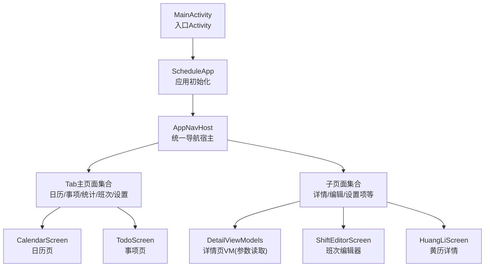
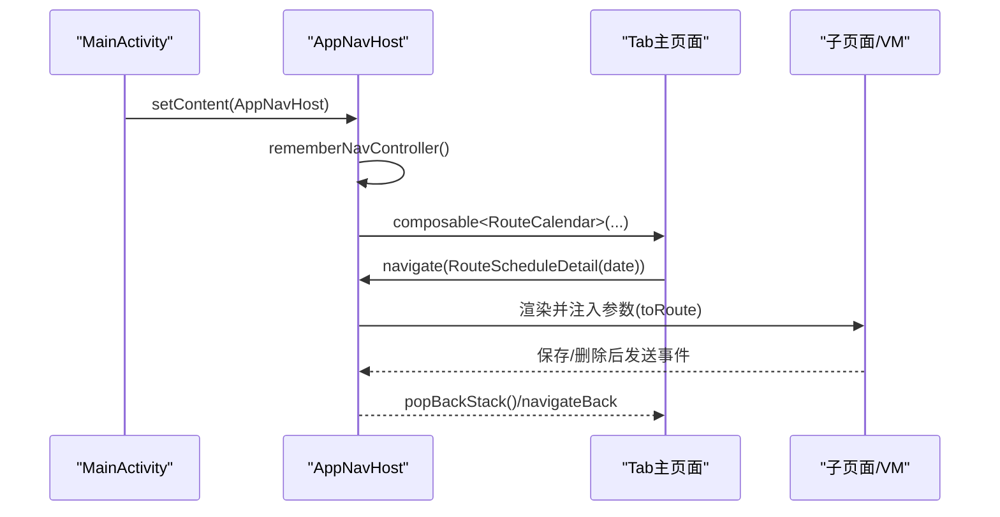
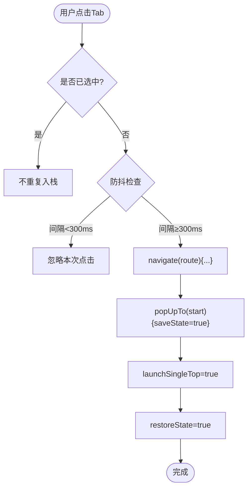
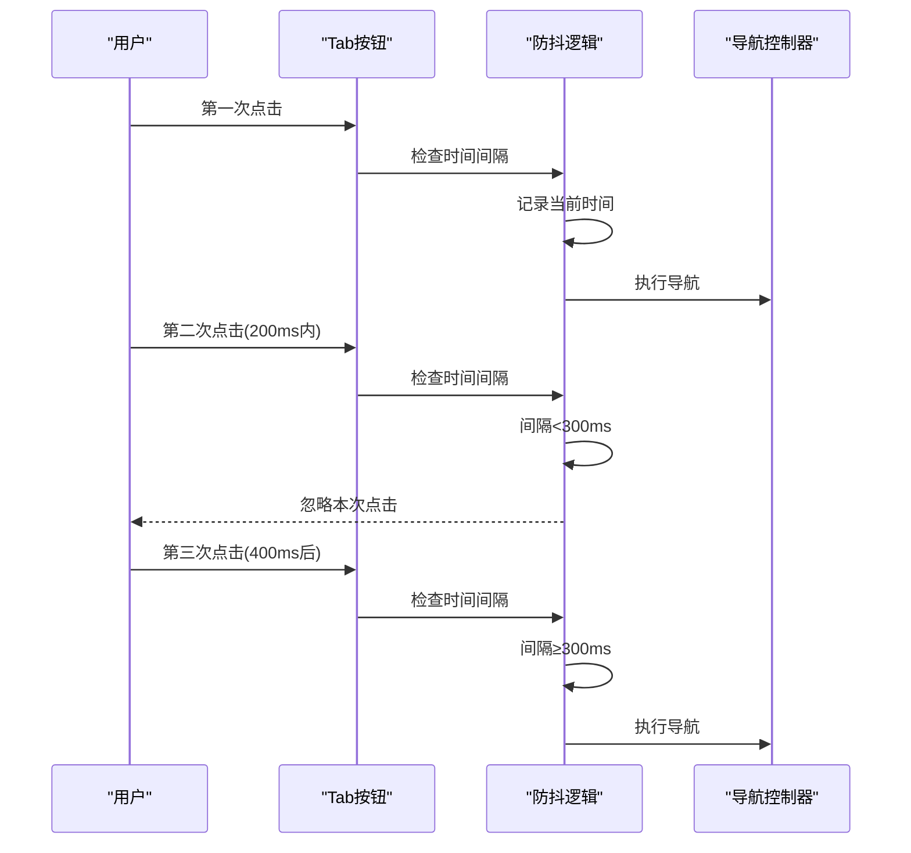
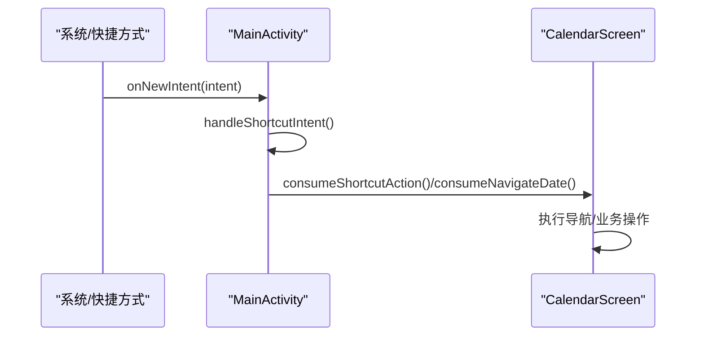
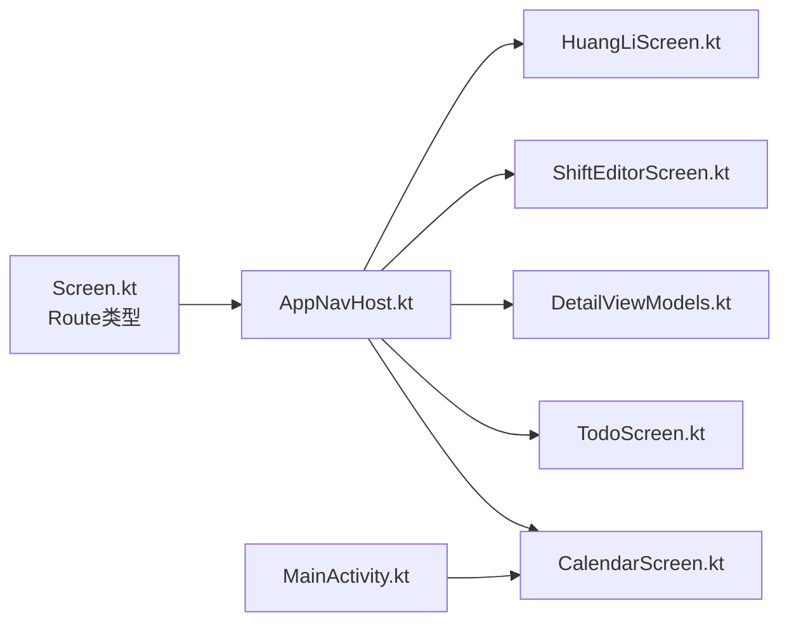

# 导航系统架构

<cite>
**本文引用的文件**
- [AppNavHost.kt](file://app/src/main/java/com/schedulecalendar/app/ui/navigation/AppNavHost.kt)
- [Screen.kt](file://app/src/main/java/com/schedulecalendar/app/ui/navigation/Screen.kt)
- [MainActivity.kt](file://app/src/main/java/com/schedulecalendar/app/MainActivity.kt)
- [CalendarScreen.kt](file://app/src/main/java/com/schedulecalendar/app/ui/calendar/CalendarScreen.kt)
- [TodoScreen.kt](file://app/src/main/java/com/schedulecalendar/app/ui/todo/TodoScreen.kt)
- [DetailViewModels.kt](file://app/src/main/java/com/schedulecalendar/app/ui/detail/DetailViewModels.kt)
- [ShiftEditorScreen.kt](file://app/src/main/java/com/schedulecalendar/app/ui/shifts/ShiftEditorScreen.kt)
- [HuangLiScreen.kt](file://app/src/main/java/com/schedulecalendar/app/ui/calendar/HuangLiScreen.kt)
</cite>

## 更新摘要
**所做更改**
- 在AppNavHost.kt中新增了导航防抖机制，防止快速连续点击导致的重复导航操作
- 添加了lastNavClickTime变量和navDebounceIntervalMs常量（300ms）
- 实现了点击时间验证逻辑，优化导航性能和用户体验
- 更新了底部导航栏的点击处理逻辑，增加了防抖保护

## 目录
1. [简介](#简介)
2. [项目结构](#项目结构)
3. [核心组件](#核心组件)
4. [架构总览](#架构总览)
5. [详细组件分析](#详细组件分析)
6. [依赖关系分析](#依赖关系分析)
7. [性能与可维护性](#性能与可维护性)
8. [故障排查指南](#故障排查指南)
9. [结论](#结论)
10. [附录：最佳实践清单](#附录最佳实践清单)

## 简介
本文件围绕应用中的 Navigation Compose 导航体系进行系统化梳理，重点覆盖以下方面：
- AppNavHost 的路由配置管理与 Tab 根页面控制
- Screen 枚举（实际为可序列化路由类型）的类型安全路由定义
- 页面间跳转逻辑：参数传递、返回处理、状态保持
- 导航栈管理策略：单例页面、任务栈控制、深度链接支持
- Route 常量设计模式：路径模板、参数验证与类型转换
- 嵌套导航、条件路由与导航动画配置的最佳实践
- 导航的可测试性与调试技巧：状态监控与错误处理策略
- **新增**：导航防抖机制，防止快速连续点击导致的重复导航操作

## 项目结构
导航相关代码集中在 ui.navigation 包中，并通过各功能模块的 Screen 调用 NavController 完成跳转。整体采用"类型安全路由 + SavedStateHandle 反序列化"的模式，配合 NavHost 集中声明式注册。



图表来源
- [AppNavHost.kt:54-132](file://app/src/main/java/com/schedulecalendar/app/ui/navigation/AppNavHost.kt#L54-L132)
- [Screen.kt:1-34](file://app/src/main/java/com/schedulecalendar/app/ui/navigation/Screen.kt#L1-L34)
- [MainActivity.kt:41-65](file://app/src/main/java/com/schedulecalendar/app/MainActivity.kt#L41-L65)

章节来源
- [AppNavHost.kt:54-132](file://app/src/main/java/com/schedulecalendar/app/ui/navigation/AppNavHost.kt#L54-L132)
- [Screen.kt:1-34](file://app/src/main/java/com/schedulecalendar/app/ui/navigation/Screen.kt#L1-L34)
- [MainActivity.kt:41-65](file://app/src/main/java/com/schedulecalendar/app/MainActivity.kt#L41-L65)

## 核心组件
- 路由类型定义（Screen.kt）：使用 @Serializable object/data class 表示无参/有参路由，作为类型安全的"Route 常量"。
- 导航宿主（AppNavHost.kt）：集中声明所有 composable<RouteX>() 注册，提供底部 Tab 切换与子页面导航。
- 页面与 VM（CalendarScreen/TodoScreen/DetailViewModels/ShiftEditorScreen/HuangLiScreen）：通过 navController.navigate(RouteX(...)) 发起跳转；在目标页面或 VM 中使用 toRoute<T>() 从 SavedStateHandle 读取参数。

章节来源
- [Screen.kt:1-34](file://app/src/main/java/com/schedulecalendar/app/ui/navigation/Screen.kt#L1-L34)
- [AppNavHost.kt:91-130](file://app/src/main/java/com/schedulecalendar/app/ui/navigation/AppNavHost.kt#L91-L130)
- [CalendarScreen.kt:114-126](file://app/src/main/java/com/schedulecalendar/app/ui/calendar/CalendarScreen.kt#L114-L126)
- [TodoScreen.kt:94-96](file://app/src/main/java/com/schedulecalendar/app/ui/todo/TodoScreen.kt#L94-L96)
- [DetailViewModels.kt:62-70](file://app/src/main/java/com/schedulecalendar/app/ui/detail/DetailViewModels.kt#L62-L70)
- [ShiftEditorScreen.kt:37-41](file://app/src/main/java/com/schedulecalendar/app/ui/shifts/ShiftEditorScreen.kt#L37-L41)
- [HuangLiScreen.kt:34-37](file://app/src/main/java/com/schedulecalendar/app/ui/calendar/HuangLiScreen.kt#L34-L37)

## 架构总览
导航体系以 AppNavHost 为中心，将"Tab 根页面"和"子页面"统一纳入 NavHost 管理。Tab 切换时通过 popUpTo(startDestination) + launchSingleTop + restoreState 实现"单例+状态保持"。子页面通过类型安全路由传递参数，并在目标页面或 ViewModel 中反序列化为强类型对象。



图表来源
- [AppNavHost.kt:54-132](file://app/src/main/java/com/schedulecalendar/app/ui/navigation/AppNavHost.kt#L54-L132)
- [CalendarScreen.kt:124-126](file://app/src/main/java/com/schedulecalendar/app/ui/calendar/CalendarScreen.kt#L124-L126)
- [DetailViewModels.kt:204-222](file://app/src/main/java/com/schedulecalendar/app/ui/detail/DetailViewModels.kt#L204-L222)

## 详细组件分析

### 路由类型定义（Screen.kt）
- 无参路由使用 @Serializable object，如 RouteCalendar、RouteSettings 等，保证编译期唯一性与零开销。
- 有参路由使用 @Serializable data class，字段即路径参数，天然具备类型约束与默认值能力。
- 优点：
  - 类型安全：避免字符串拼接错误与遗漏参数。
  - 可读性强：Route 类名即意图表达。
  - 易于扩展：新增页面只需新增一个 Route 类并在 AppNavHost 注册。

章节来源
- [Screen.kt:6-33](file://app/src/main/java/com/schedulecalendar/app/ui/navigation/Screen.kt#L6-L33)

### 导航宿主与 Tab 管理（AppNavHost.kt）
- 使用 rememberNavController() 创建单一控制器，结合 currentBackStackEntryAsState() 判断当前目的地，动态显示/隐藏底部栏。
- Tab 点击导航策略：
  - popUpTo(startDestination) + saveState=true：清空到起始目的地的栈并保留状态。
  - launchSingleTop=true：防止重复入栈。
  - restoreState=true：恢复上次离开时的 UI 状态。
- 子页面注册：全部使用 composable<RouteX>() 形式，参数通过 backStackEntry.toRoute<RouteX>() 获取。

**更新** 新增了导航防抖机制，防止快速连续点击导致的重复导航操作



图表来源
- [AppNavHost.kt:76-84](file://app/src/main/java/com/schedulecalendar/app/ui/navigation/AppNavHost.kt#L76-L84)

章节来源
- [AppNavHost.kt:54-132](file://app/src/main/java/com/schedulecalendar/app/ui/navigation/AppNavHost.kt#L54-L132)

### 导航防抖机制（新增）
**新增功能** AppNavHost.kt 中实现了完整的导航防抖机制，有效防止快速连续点击导致的性能问题：

- **防抖变量**：`lastNavClickTime` 使用 `mutableLongStateOf(0L)` 追踪上次点击时间
- **防抖间隔**：`navDebounceIntervalMs = 300L` 设置最小点击间隔为300毫秒
- **时间验证**：每次点击时检查 `now - lastNavClickTime < navDebounceIntervalMs`
- **智能过滤**：已选中的 Tab 直接跳过，未满足防抖条件的点击被忽略



图表来源
- [AppNavHost.kt:76-110](file://app/src/main/java/com/schedulecalendar/app/ui/navigation/AppNavHost.kt#L76-L110)

### 页面跳转与参数传递
- 日历页跳转到日程详情：
  - 触发点：长按日期单元格或通过菜单进入。
  - 参数：日期字符串，封装为 RouteScheduleDetail(date)。
- 事项页跳转到日程详情：
  - 触发点：待办列表项点击。
  - 参数：同上。
- 工时明细页：
  - 触发点：工时列表项点击。
  - 参数：年、月、类型（type），封装为 RouteHoursDetail(year, month, type)。
- 班次编辑器：
  - 触发点：班次列表项点击。
  - 参数：可选 shiftId，用于区分新增/编辑。

章节来源
- [CalendarScreen.kt:472-474](file://app/src/main/java/com/schedulecalendar/app/ui/calendar/CalendarScreen.kt#L472-L474)
- [CalendarScreen.kt:568-570](file://app/src/main/java/com/schedulecalendar/app/ui/calendar/CalendarScreen.kt#L568-L570)
- [TodoScreen.kt:94-96](file://app/src/main/java/com/schedulecalendar/app/ui/todo/TodoScreen.kt#L94-L96)
- [ShiftsScreen.kt:73](file://app/src/main/java/com/schedulecalendar/app/ui/shifts/ShiftsScreen.kt#L73)

### 参数读取与类型转换
- 在目标页面或 ViewModel 中，通过 SavedStateHandle.toRoute<RouteX>() 将参数反序列化为强类型对象。
- 示例：
  - ScheduleDetailViewModel：从 savedState 读取 date。
  - HoursDetailViewModel：读取 year、month、type，并将 type 字符串映射为 HoursDetailType 枚举。
  - ShiftEditorScreen：从 backStackEntry 读取 shiftId，决定加载数据还是新建。
  - HuangLiScreen：从 backStackEntry 读取 date，若为空则回退到当天。

```mermaid
classDiagram
class ScheduleDetailViewModel {
+state : StateFlow
+uiEvent : Flow
-date : String
+load()
+save()
}
class HoursDetailViewModel {
+state : StateFlow
-year : Int
-month : Int
-typeStr : String
+load()
}
class ShiftEditorScreen {
+navController : NavController
-shiftId : String?
}
class HuangLiScreen {
+navController : NavController
-date : String
}
ScheduleDetailViewModel --> "读取" : "toRoute<RouteScheduleDetail>"
HoursDetailViewModel --> "读取" : "toRoute<RouteHoursDetail>"
ShiftEditorScreen --> "读取" : "toRoute<RouteShiftEditor>"
HuangLiScreen --> "读取" : "toRoute<RouteHuangLi>"
```

图表来源
- [DetailViewModels.kt:62-70](file://app/src/main/java/com/schedulecalendar/app/ui/detail/DetailViewModels.kt#L62-L70)
- [DetailViewModels.kt:269-280](file://app/src/main/java/com/schedulecalendar/app/ui/detail/DetailViewModels.kt#L269-L280)
- [ShiftEditorScreen.kt:37-41](file://app/src/main/java/com/schedulecalendar/app/ui/shifts/ShiftEditorScreen.kt#L37-L41)
- [HuangLiScreen.kt:34-37](file://app/src/main/java/com/schedulecalendar/app/ui/calendar/HuangLiScreen.kt#L34-L37)

章节来源
- [DetailViewModels.kt:62-70](file://app/src/main/java/com/schedulecalendar/app/ui/detail/DetailViewModels.kt#L62-L70)
- [DetailViewModels.kt:269-280](file://app/src/main/java/com/schedulecalendar/app/ui/detail/DetailViewModels.kt#L269-L280)
- [ShiftEditorScreen.kt:37-41](file://app/src/main/java/com/schedulecalendar/app/ui/shifts/ShiftEditorScreen.kt#L37-L41)
- [HuangLiScreen.kt:34-37](file://app/src/main/java/com/schedulecalendar/app/ui/calendar/HuangLiScreen.kt#L34-L37)

### 返回处理与状态保持
- 返回处理：
  - 详情页 VM 保存成功后发送 NavigateBack 事件，UI 层监听并调用 popBackStack()。
  - 编辑器页面保存成功也通过事件驱动返回。
- 状态保持：
  - Tab 切换使用 saveState/restoreState 组合，确保回到原 Tab 时保留滚动位置、选择态等。
  - 子页面参数持久化由 SavedStateHandle 自动负责。

章节来源
- [DetailViewModels.kt:204-222](file://app/src/main/java/com/schedulecalendar/app/ui/detail/DetailViewModels.kt#L204-L222)
- [ShiftEditorScreen.kt:43-50](file://app/src/main/java/com/schedulecalendar/app/ui/shifts/ShiftEditorScreen.kt#L43-L50)
- [AppNavHost.kt:76-84](file://app/src/main/java/com/schedulecalendar/app/ui/navigation/AppNavHost.kt#L76-L84)

### 任务栈与单例策略
- 单例 Tab：通过 launchSingleTop + popUpTo(startDestination) 保证每个 Tab 仅存在一个实例，且不会重复压栈。
- 子页面：常规 push 行为，支持多层级嵌套（例如从日历进入详情，再进入其他设置）。

章节来源
- [AppNavHost.kt:76-84](file://app/src/main/java/com/schedulecalendar/app/ui/navigation/AppNavHost.kt#L76-L84)

### 深度链接与外部入口
- MainActivity 接收外部 Intent（快捷方式、小组件点击），解析 action 与额外参数，存入 pendingShortcutAction/pendingNavigateDate。
- 页面启动后通过 LaunchedEffect 消费这些标记，执行相应导航或业务动作（如打卡、跳转到指定月份并选中日期）。



图表来源
- [MainActivity.kt:67-89](file://app/src/main/java/com/schedulecalendar/app/MainActivity.kt#L67-89)
- [CalendarScreen.kt:84-119](file://app/src/main/java/com/schedulecalendar/app/ui/calendar/CalendarScreen.kt#L84-L119)

章节来源
- [MainActivity.kt:67-89](file://app/src/main/java/com/schedulecalendar/app/MainActivity.kt#L67-89)
- [CalendarScreen.kt:84-119](file://app/src/main/java/com/schedulecalendar/app/ui/calendar/CalendarScreen.kt#L84-L119)

### 导航动画与可见性控制
- 底部栏显隐：根据当前目的地是否在 Tab 列表中，使用 AnimatedVisibility + slideInVertically/slideOutVertically 控制出现/消失动画。
- 日历月份切换：使用 AnimatedContent 实现左右滑入/淡入淡出过渡。

章节来源
- [AppNavHost.kt:64-68](file://app/src/main/java/com/schedulecalendar/app/ui/navigation/AppNavHost.kt#L64-L68)
- [CalendarScreen.kt:329-346](file://app/src/main/java/com/schedulecalendar/app/ui/calendar/CalendarScreen.kt#L329-L346)

## 依赖关系分析
- AppNavHost 依赖所有被注册的 Screen 与 Route 类型。
- 各 Screen 依赖 NavController 与自身 ViewModel。
- ViewModel 依赖 SavedStateHandle 与领域/数据层仓库。
- 外部入口通过 Activity 与页面间的回调方法解耦。



图表来源
- [Screen.kt:1-34](file://app/src/main/java/com/schedulecalendar/app/ui/navigation/Screen.kt#L1-L34)
- [AppNavHost.kt:91-130](file://app/src/main/java/com/schedulecalendar/app/ui/navigation/AppNavHost.kt#L91-L130)
- [MainActivity.kt:41-65](file://app/src/main/java/com/schedulecalendar/app/MainActivity.kt#L41-L65)

章节来源
- [Screen.kt:1-34](file://app/src/main/java/com/schedulecalendar/app/ui/navigation/Screen.kt#L1-L34)
- [AppNavHost.kt:91-130](file://app/src/main/java/com/schedulecalendar/app/ui/navigation/AppNavHost.kt#L91-L130)
- [MainActivity.kt:41-65](file://app/src/main/java/com/schedulecalendar/app/MainActivity.kt#L41-L65)

## 性能与可维护性
- 类型安全路由减少运行时错误，提升可维护性。
- 使用 SavedStateHandle 自动持久化参数，降低手动状态同步成本。
- Tab 状态保持避免重建与重算，提高交互流畅度。
- **新增** 导航防抖机制有效防止快速连续点击导致的性能问题，提升用户体验。
- 建议：
  - 对复杂参数尽量拆分为多个小字段，便于未来扩展与校验。
  - 对深层嵌套页面考虑引入命名图（Nested Graph）以提升可读性。
  - 对导航事件统一通过 Flow/Channel 传递，避免直接耦合。

## 故障排查指南
- 常见问题
  - 参数丢失或类型不匹配：检查 Route 类字段是否与 navigate 构造一致，确认 toRoute<T>() 使用的泛型正确。
  - 重复入栈导致状态错乱：确认 Tab 导航是否启用 launchSingleTop 与 popUpTo(startDestination)。
  - 外部入口未生效：检查 Activity 的 onNewIntent 是否被调用，LaunchedEffect 是否正确消费 pending 标记。
  - **新增** 导航防抖相关问题：检查 lastNavClickTime 变量是否正确更新，navDebounceIntervalMs 设置是否合理。
- 调试技巧
  - 打印当前目的地：navController.currentBackStackEntry?.destination?.route。
  - 观察参数反序列化：在 toRoute<T>() 处断点，确认 SavedStateHandle 内容。
  - 事件流追踪：在 VM 的 uiEvent 发送/收集处打日志，定位返回与错误处理链路。
  - **新增** 防抖调试：在 onClick 中添加日志输出，检查点击时间间隔是否符合预期。

章节来源
- [AppNavHost.kt:56-60](file://app/src/main/java/com/schedulecalendar/app/ui/navigation/AppNavHost.kt#L56-L60)
- [DetailViewModels.kt:204-222](file://app/src/main/java/com/schedulecalendar/app/ui/detail/DetailViewModels.kt#L204-L222)
- [MainActivity.kt:67-89](file://app/src/main/java/com/schedulecalendar/app/MainActivity.kt#L67-89)

## 结论
本项目采用类型安全路由与 SavedStateHandle 的组合，实现了清晰、可维护、可扩展的导航体系。通过统一的 AppNavHost 管理路由与 Tab 状态，结合事件驱动的返回处理与外部入口消费，保证了良好的用户体验与健壮性。**新增的导航防抖机制进一步提升了应用的稳定性和用户体验，有效防止了快速连续点击导致的性能问题**。建议在后续迭代中继续完善嵌套导航与导航动画的统一规范，并补充更完善的导航监控与埋点。

## 附录：最佳实践清单
- 路由设计
  - 无参用 object，有参用 data class，字段即参数，必要时提供默认值。
  - 对复杂参数进行分片，避免超长字符串。
- 跳转与返回
  - 使用 Flow/Channel 传递导航事件，避免跨层直接调用。
  - 返回统一通过 popBackStack() 或 navigateBack()。
  - **新增** 在高频点击场景下使用防抖机制，防止重复操作。
- 状态保持
  - Tab 使用 saveState/restoreState，子页面依赖 SavedStateHandle。
- 动画与体验
  - 底部栏显隐使用 AnimatedVisibility + 滑动动画。
  - 列表/卡片切换使用 AnimatedContent 增强过渡。
- 可测试性与调试
  - 为关键导航路径编写单元测试（模拟 NavController 与 SavedStateHandle）。
  - 使用导航状态监控输出日志，快速定位问题。
  - **新增** 为防抖逻辑添加测试用例，验证不同时间间隔下的行为。