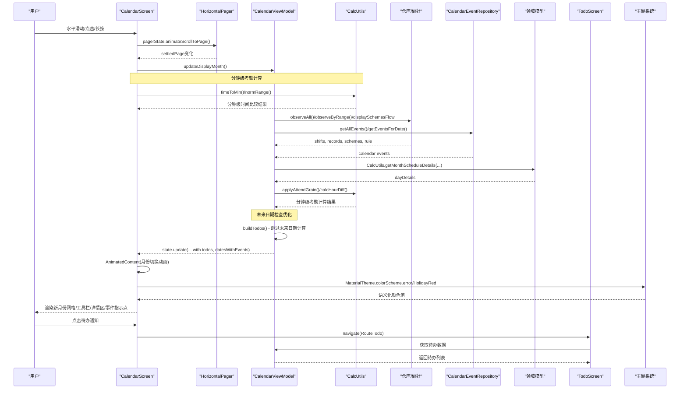
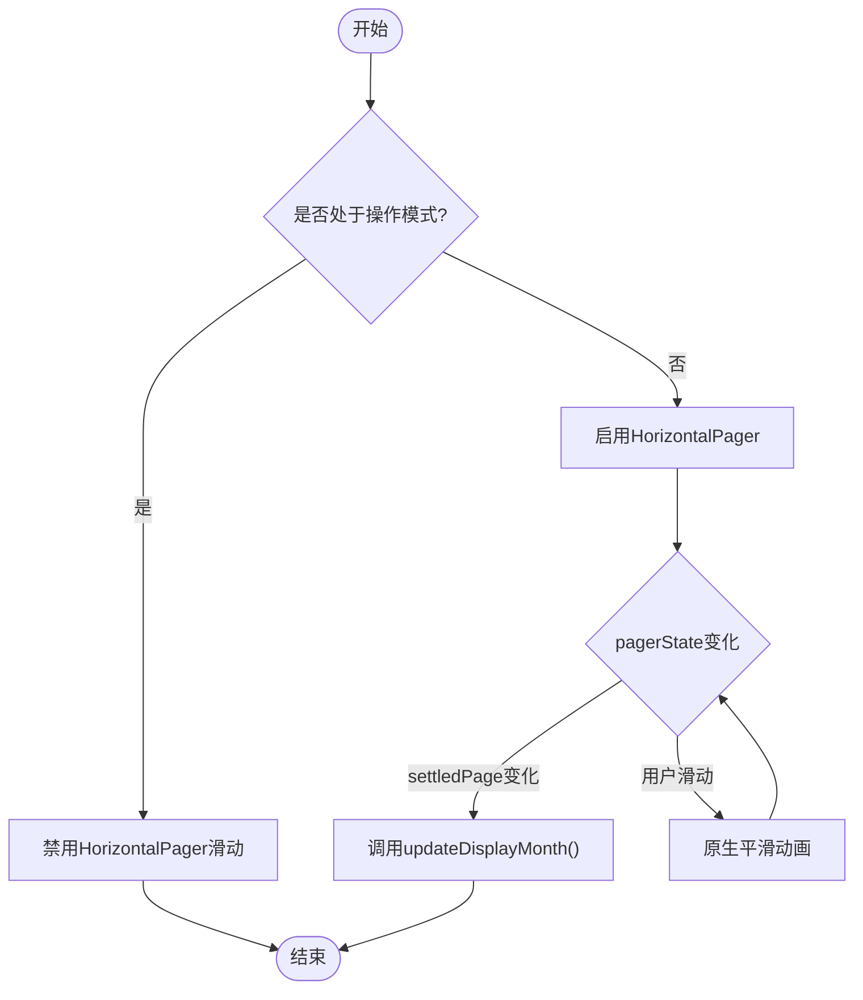
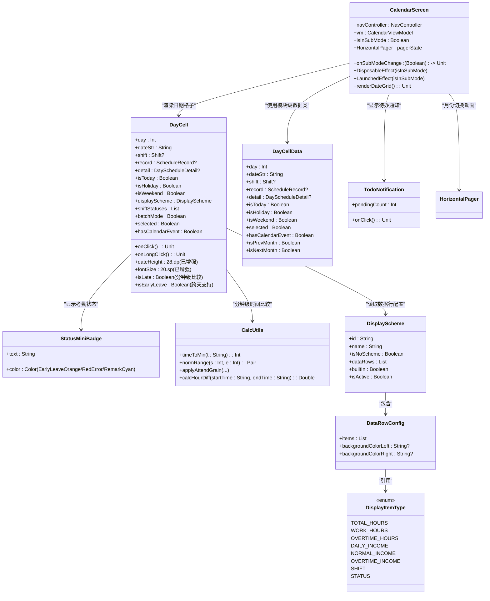
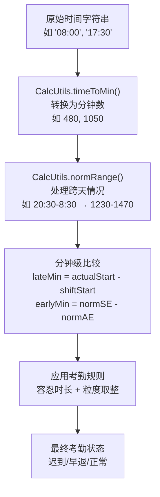
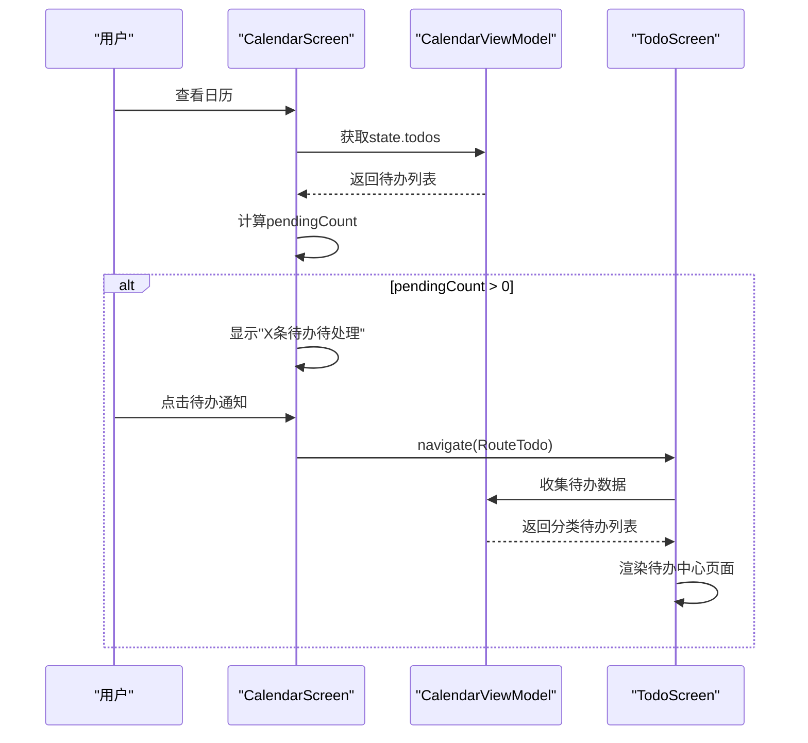
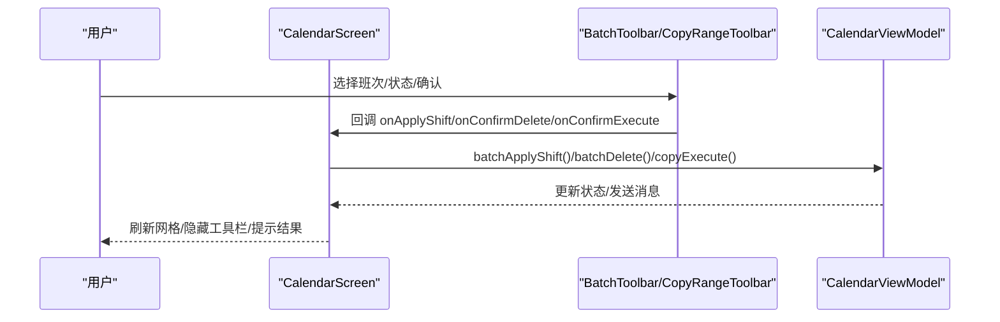
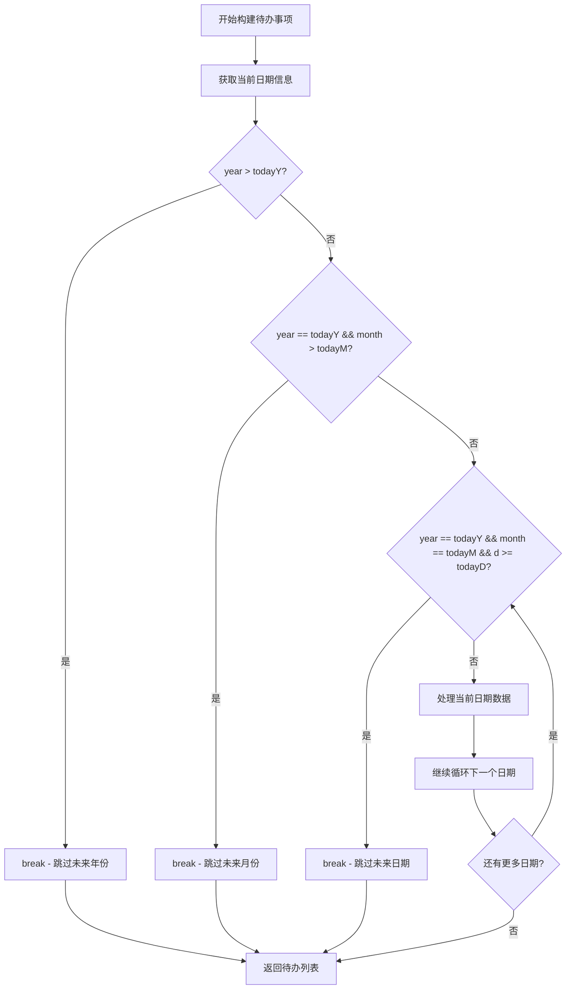
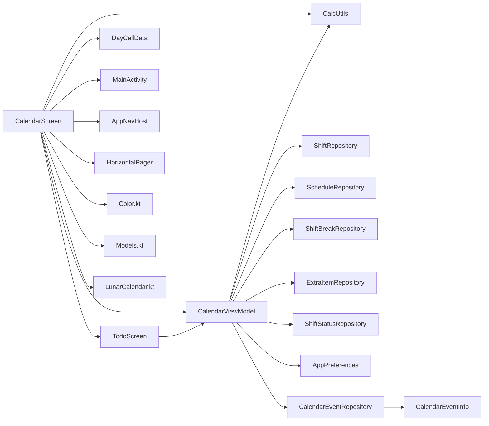

# 日历主界面组件

<cite>
**本文引用的文件**   
- [CalendarScreen.kt](file://app/src/main/java/com/schedulecalendar/app/ui/calendar/CalendarScreen.kt)
- [CalendarViewModel.kt](file://app/src/main/java/com/schedulecalendar/app/ui/calendar/CalendarViewModel.kt)
- [MainActivity.kt](file://app/src/main/java/com/schedulecalendar/app/MainActivity.kt)
- [AppNavHost.kt](file://app/src/main/java/com/schedulecalendar/app/ui/navigation/AppNavHost.kt)
- [TodoScreen.kt](file://app/src/main/java/com/schedulecalendar/app/ui/todo/TodoScreen.kt)
- [Screen.kt](file://app/src/main/java/com/schedulecalendar/app/ui/navigation/Screen.kt)
- [CalendarEventRepository.kt](file://app/src/main/java/com/schedulecalendar/app/data/calendar/CalendarEventRepository.kt)
- [LunarCalendar.kt](file://app/src/main/java/com/schedulecalendar/app/domain/model/LunarCalendar.kt)
- [Models.kt](file://app/src/main/java/com/schedulecalendar/app/domain/model/Models.kt)
- [CalcUtils.kt](file://app/src/main/java/com/schedulecalendar/app/domain/model/CalcUtils.kt)
- [Color.kt](file://app/src/main/java/com/schedulecalendar/app/ui/theme/Color.kt)
</cite>

## 更新摘要
**变更内容**   
- **性能优化**：在CalendarViewModel.kt中添加了未来日期检查逻辑，当年份与当前年份匹配时，跳过处理超出当前月份的未来日期，提升日历导航性能
- **UI样式优化**：Today按钮边框和内容颜色统一使用MaterialTheme.colorScheme.error，提升视觉一致性
- **状态徽章标准化**：早退、迟到、备注状态徽章采用标准化语义颜色（EarlyLeaveOrange、RedError、RemarkCyan）
- **选中状态高亮**：统一使用HolidayRed作为选中状态的强调色，确保视觉一致性
- **可访问性改进**：交互元素尺寸从32dp增加到48dp，符合无障碍设计标准
- **主题色彩系统**：完善语义化颜色定义，提升整体用户体验

## 目录
1. [简介](#简介)
2. [项目结构](#项目结构)
3. [核心组件](#核心组件)
4. [架构总览](#架构总览)
5. [详细组件分析](#详细组件分析)
6. [依赖关系分析](#依赖关系分析)
7. [性能与优化](#性能与优化)
8. [故障排查指南](#故障排查指南)
9. [结论](#结论)
10. [附录：Compose最佳实践示例路径](#appendixcompose最佳实践示例路径)

## 简介
本文件聚焦于日历主界面组件 CalendarScreen 的架构设计与实现细节，涵盖以下方面：
- Scaffold 布局结构与顶部导航栏（年月选择、返回今天、编辑菜单）
- 双向状态通信机制，实现子模式状态的实时同步
- 待办通知系统与红色文字指示器
- 星期标题行固定显示和日历网格的动态渲染
- DayCell 组件的视觉状态管理（选中、今天、节假日、周末）、班次信息展示与农历信息展示
- **重大更新** 考勤计算逻辑重大改进：迟到早退检测算法从字符串比较升级为分钟级精确比较，支持跨天班次正确处理
- UI增强：优化的日期显示尺寸（28dp高度，20sp字体）提升可读性
- 日历事件指示器和考勤状态徽章功能
- 批量操作模式的 UI 实现（批量选择工具栏、复制排班工具栏和删除模式的用户交互）
- **全新架构** 基于HorizontalPager的月份切换动画效果，提供原生级别的流畅体验
- 手势处理机制（水平滑动切换月份、长按进入详情页面和点击事件分发）
- Compose 最佳实践：状态提升、动画过渡效果和性能优化策略
- **最新优化** Today按钮边框和内容颜色统一使用MaterialTheme.colorScheme.error，状态徽章采用标准化语义颜色，交互元素尺寸提升至48dp
- **性能优化** 未来日期检查逻辑：当年份与当前年份匹配时，跳过处理超出当前月份的未来日期，显著提升日历导航性能

## 项目结构
日历主界面位于 ui.calendar 包中，包含：
- CalendarScreen：UI 层，负责布局、交互与子组件组合，**已集成分钟级考勤计算逻辑并采用HorizontalPager架构**
- CalendarViewModel：状态与业务逻辑，负责数据加载、月份切换、批量/复制/删除操作，**新增未来日期检查优化**
- MainActivity：应用主活动，管理全局状态和返回键行为
- AppNavHost：导航宿主，协调各页面间的状态同步
- TodoScreen：待办中心页面，提供完整的待办事项管理功能
- domain.model：领域模型与工具（DisplayScheme、Shift、ScheduleRecord、LunarCalendar、CalcUtils 等）
- data.calendar：日历事件仓库，提供系统日历事件的读写操作
- ui.theme：主题色彩系统，定义语义化颜色常量

```mermaid
graph TB
subgraph "UI层"
CS["CalendarScreen<br/>Scaffold + HorizontalPager + renderDateGrid<br/>分钟级考勤计算"]
DC["DayCell<br/>日期格子28dp高度，20sp字体<br/>分钟级迟到早退检测"]
BT["BatchToolbar<br/>批量/删除工具栏"]
CT["CopyRangeToolbar<br/>复制排班工具栏"]
DD["DateDetailSection<br/>日期详情"]
SP["SchedulePreviewSection<br/>排班预览"]
AE["AnniversaryEventSection<br/>纪念日与日程"]
SB["StatusMiniBadge<br/>状态徽章"]
TN["TodoNotification<br/>待办通知指示器"]
TS["TodoScreen<br/>待办中心页面"]
HP["HorizontalPager<br/>原生月份切换动画"]
end
subgraph "状态与逻辑"
VM["CalendarViewModel<br/>State/Flow/操作<br/>分钟级加班计算<br/>未来日期检查优化"]
CER["CalendarEventRepository<br/>日历事件仓库"]
MA["MainActivity<br/>全局状态管理"]
ANH["AppNavHost<br/>导航与状态同步"]
CU["CalcUtils<br/>分钟级时间比较<br/>跨天班次支持"]
end
subgraph "领域模型"
MS["Models.kt<br/>DisplayScheme/Shift/ScheduleRecord"]
LC["LunarCalendar.kt<br/>农历/黄历计算"]
CEI["CalendarEventInfo<br/>日历事件信息"]
TD["TodoItem/TodoType<br/>待办事项模型"]
DCC["DayCellData<br/>模块级数据类"]
AC["AttendConfig<br/>考勤规则配置"]
end
subgraph "主题系统"
TH["Color.kt<br/>语义化颜色定义<br/>EarlyLeaveOrange/RedError/RemarkCyan"]
MT["MaterialTheme<br/>colorScheme.error<br/>HolidayRed/Green700"]
end
CS --> VM
CS --> DC
CS --> BT
CS --> CT
CS --> DD
CS --> SP
CS --> AE
CS --> SB
CS --> TN
CS --> MS
CS --> LC
CS --> DCC
CS --> MA
CS --> ANH
CS --> CU
CS --> HP
CS --> TH
CS --> MT
VM --> CER
VM --> CEI
VM --> TD
VM --> CU
VM --> AC
TS --> VM
```



**图表来源**
- [CalendarScreen.kt:73-81](file://app/src/main/java/com/schedulecalendar/app/ui/calendar/CalendarScreen.kt#L73-L81)
- [CalendarScreen.kt:224-684](file://app/src/main/java/com/schedulecalendar/app/ui/calendar/CalendarScreen.kt#L224-L684)
- [CalendarScreen.kt:88-222](file://app/src/main/java/com/schedulecalendar/app/ui/calendar/CalendarScreen.kt#L88-L222)
- [CalendarScreen.kt:716-1102](file://app/src/main/java/com/schedulecalendar/app/ui/calendar/CalendarScreen.kt#L716-L1102)
- [CalendarViewModel.kt:104-247](file://app/src/main/java/com/schedulecalendar/app/ui/calendar/CalendarViewModel.kt#L104-L247)
- [MainActivity.kt:70-79](file://app/src/main/java/com/schedulecalendar/app/MainActivity.kt#L70-L79)
- [AppNavHost.kt:73-74](file://app/src/main/java/com/schedulecalendar/app/ui/navigation/AppNavHost.kt#L73-L74)
- [TodoScreen.kt:67-201](file://app/src/main/java/com/schedulecalendar/app/ui/todo/TodoScreen.kt#L67-201)
- [CalendarEventRepository.kt:28-40](file://app/src/main/java/com/schedulecalendar/app/data/calendar/CalendarEventRepository.kt#L28-L40)
- [CalcUtils.kt:20-34](file://app/src/main/java/com/schedulecalendar/app/domain/model/CalcUtils.kt#L20-L34)
- [Models.kt:124-141](file://app/src/main/java/com/schedulecalendar/app/domain/model/Models.kt#L124-L141)
- [Color.kt:24-44](file://app/src/main/java/com/schedulecalendar/app/ui/theme/Color.kt#L24-L44)

章节来源
- [CalendarScreen.kt:73-81](file://app/src/main/java/com/schedulecalendar/app/ui/calendar/CalendarScreen.kt#L73-81)
- [CalendarScreen.kt:224-684](file://app/src/main/java/com/schedulecalendar/app/ui/calendar/CalendarScreen.kt#L224-684)
- [CalendarViewModel.kt:104-247](file://app/src/main/java/com/schedulecalendar/app/ui/calendar/CalendarViewModel.kt#L104-247)

## 核心组件
- CalendarScreen：**重大更新** 采用HorizontalPager替代自定义手势检测，提供原生级别的月份切换动画；通过AnimatedContent实现月份切换动画；在LazyColumn中动态渲染日历网格；**集成分钟级考勤计算逻辑，确保迟到早退检测准确性**。
- DayCell：**重大更新** 封装单格子的视觉状态（选中、今天、节假日、周末）、农历文本、班次与附加状态标签、数据项行（按 DisplayScheme 配置）。**迟到早退检测算法已升级为分钟级精确比较，支持跨天班次正确处理**。更新日期显示尺寸为28dp高度和20sp字体，显著提升可读性。
- StatusMiniBadge：小型状态徽章组件，用于显示早退("早")、迟到("迟")、备注("注")等考勤状态。**已采用标准化语义颜色：EarlyLeaveOrange、RedError、RemarkCyan**。
- TodoNotification：待办通知指示器组件，在顶部导航栏显示红色文字提示。
- BatchToolbar / CopyRangeToolbar：分别用于批量应用/删除与复制排班的两阶段交互。
- DateDetailSection / SchedulePreviewSection / AnniversaryEventSection：提供日期详情、排班预览与纪念日/日程展示。
- TodoScreen：完整的待办中心页面，支持分类查看和处理各种待办事项。
- CalendarViewModel：维护 CalendarUiState，提供月份切换、日期点击、批量/复制/删除等操作，并通过 Flow 暴露状态与事件。**已集成分钟级加班检测和确认逻辑，新增未来日期检查优化**。
- MainActivity：管理全局状态和返回键行为。
- AppNavHost：协调各页面间的状态同步。
- **CalcUtils**：**新增** 提供分钟级时间比较工具方法，包括 timeToMin、normRange、applyAttendGrain 等核心算法。
- **DayCellData**：模块级数据类，用于封装日期格子的完整数据信息，提升代码组织结构。
- **HorizontalPager**：**全新组件** 提供平滑的月份切换动画和内置触摸处理。
- **主题系统**：Color.kt定义了语义化颜色常量，包括EarlyLeaveOrange、RedError、RemarkCyan等状态徽章颜色，以及HolidayRed、Green700等主题色。

**章节来源**
- [CalendarScreen.kt:224-684](file://app/src/main/java/com/schedulecalendar/app/ui/calendar/CalendarScreen.kt#L224-684)
- [CalendarScreen.kt:88-222](file://app/src/main/java/com/schedulecalendar/app/ui/calendar/CalendarScreen.kt#L88-222)
- [CalendarScreen.kt:716-1102](file://app/src/main/java/com/schedulecalendar/app/ui/calendar/CalendarScreen.kt#L716-L1102)
- [CalendarScreen.kt:1104-1466](file://app/src/main/java/com/schedulecalendar/app/ui/calendar/CalendarScreen.kt#L1104-L1466)
- [CalendarScreen.kt:1900-2369](file://app/src/main/java/com/schedulecalendar/app/ui/calendar/CalendarScreen.kt#L1900-L2369)
- [CalendarViewModel.kt:104-247](file://app/src/main/java/com/schedulecalendar/app/ui/calendar/CalendarViewModel.kt#L104-L247)
- [MainActivity.kt:70-79](file://app/src/main/java/com/schedulecalendar/app/MainActivity.kt#L70-L79)
- [AppNavHost.kt:73-74](file://app/src/main/java/com/schedulecalendar/app/ui/navigation/AppNavHost.kt#L73-L74)
- [TodoScreen.kt:67-201](file://app/src/main/java/com/schedulecalendar/app/ui/todo/TodoScreen.kt#L67-201)
- [Color.kt:24-44](file://app/src/main/java/com/schedulecalendar/app/ui/theme/Color.kt#L24-L44)

## 架构总览
整体采用"UI 层 + ViewModel + 领域模型"的分层设计：
- UI 层仅持有可观察状态并触发 ViewModel 方法
- ViewModel 聚合仓库与偏好设置，计算当月数据与跨月填充数据，更新 State
- 领域模型提供显示方案、班次、记录、农历/节假日信息等基础数据
- 日历事件仓库集成，支持系统日历事件的读取和显示
- 待办事项管理系统，提供完整的待办处理流程
- **CalcUtils 提供统一的分钟级时间比较算法，确保考勤计算的准确性和一致性**
- **DayCellData**：模块级数据类统一管理日期格子数据结构，提升代码可维护性
- **HorizontalPager**：提供原生级别的月份切换动画和手势处理
- **主题系统**：提供语义化颜色定义，确保UI一致性和可访问性
- **未来日期检查优化**：在buildTodos方法中添加智能日期过滤，避免不必要的未来日期计算



**图表来源**
- [CalendarScreen.kt:487-550](file://app/src/main/java/com/schedulecalendar/app/ui/calendar/CalendarScreen.kt#L487-550)
- [CalendarScreen.kt:510-525](file://app/src/main/java/com/schedulecalendar/app/ui/calendar/CalendarScreen.kt#L510-525)
- [CalendarScreen.kt:298-317](file://app/src/main/java/com/schedulecalendar/app/ui/calendar/CalendarScreen.kt#L298-317)
- [CalendarScreen.kt:329-346](file://app/src/main/java/com/schedulecalendar/app/ui/calendar/CalendarScreen.kt#L329-346)
- [CalendarScreen.kt:96-109](file://app/src/main/java/com/schedulecalendar/app/ui/calendar/CalendarScreen.kt#L96-109)
- [AppNavHost.kt:112](file://app/src/main/java/com/schedulecalendar/app/ui/navigation/AppNavHost.kt#L112)
- [MainActivity.kt:70-79](file://app/src/main/java/com/schedulecalendar/app/MainActivity.kt#L70-L79)
- [CalendarViewModel.kt:134-247](file://app/src/main/java/com/schedulecalendar/app/ui/calendar/CalendarViewModel.kt#L134-L247)
- [CalendarViewModel.kt:412-450](file://app/src/main/java/com/schedulecalendar/app/ui/calendar/CalendarViewModel.kt#L412-L450)
- [CalendarEventRepository.kt:157-205](file://app/src/main/java/com/schedulecalendar/app/data/calendar/CalendarEventRepository.kt#L157-L205)
- [Models.kt:143-207](file://app/src/main/java/com/schedulecalendar/app/domain/model/Models.kt#L143-L207)
- [TodoScreen.kt:67-201](file://app/src/main/java/com/schedulecalendar/app/ui/todo/TodoScreen.kt#L67-201)
- [CalcUtils.kt:61-113](file://app/src/main/java/com/schedulecalendar/app/domain/model/CalcUtils.kt#L61-L113)

## 详细组件分析

### CalendarScreen 布局与交互
- Scaffold 顶部栏
  - 左侧显示"年+月"，点击弹出滚轮日期选择器
  - 待办提醒红色小字："X条待办待处理"，点击跳转到待办中心
  - **更新** 右侧"今天"按钮在非当前月或选中非今天时显示，**边框和内容颜色统一使用MaterialTheme.colorScheme.error**，提升视觉一致性
  - 编辑菜单下拉项：显示方案、批量排班、复制排班、删除排班
- 双向状态通信机制
  - onSubModeChange回调参数，支持父组件订阅子模式状态变化
  - LaunchedEffect监听isInSubMode状态变化，通过回调向上层传播
  - DisposableEffect同步状态到MainActivity的calendarSubModeActive属性
  - 确保父组件能立即获知日历子模式的进入/退出状态
- 星期标题行固定显示
  - 使用 Row 渲染"一~日"，周末颜色高亮，置于 TopAppBar 下方且不被滚动
- **全新架构** 日历网格
  - 外层 Column 包裹，wrapContentHeight 自适应高度
  - **使用 HorizontalPager 替代自定义手势检测**，提供原生级别的平滑切换动画
  - **高度插值系统**：根据当前和相邻月份的行数动态计算容器高度，实现无缝过渡
  - **pagerState 管理**：初始页码500，支持无限左右滑动
  - **状态同步**：LaunchedEffect监听pagerState.settledPage变化，调用vm.updateDisplayMonth()
  - **userScrollEnabled控制**：在批量/复制/删除模式下禁用水平滑动
  - **renderDateGrid函数**：提取为独立函数，提高代码复用性和可维护性
- 批量/复制/删除工具栏
  - 根据 state 中的 batchMode/copyMode/deleteMode 条件渲染对应工具栏
- 详情与预览区域
  - 非批量/复制/删除模式下显示 DateDetailSection、SchedulePreviewSection、AnniversaryEventSection

**章节来源**
- [CalendarScreen.kt:224-684](file://app/src/main/java/com/schedulecalendar/app/ui/calendar/CalendarScreen.kt#L224-684)
- [CalendarScreen.kt:487-550](file://app/src/main/java/com/schedulecalendar/app/ui/calendar/CalendarScreen.kt#L487-550)
- [CalendarScreen.kt:510-525](file://app/src/main/java/com/schedulecalendar/app/ui/calendar/CalendarScreen.kt#L510-525)
- [CalendarScreen.kt:88-222](file://app/src/main/java/com/schedulecalendar/app/ui/calendar/CalendarScreen.kt#L88-222)
- [CalendarScreen.kt:554-651](file://app/src/main/java/com/schedulecalendar/app/ui/calendar/CalendarScreen.kt#L554-651)

#### 手势处理流程（已重构）


**图表来源**
- [CalendarScreen.kt:487-550](file://app/src/main/java/com/schedulecalendar/app/ui/calendar/CalendarScreen.kt#L487-550)
- [CalendarScreen.kt:510-525](file://app/src/main/java/com/schedulecalendar/app/ui/calendar/CalendarScreen.kt#L510-525)

### DayCell 组件设计
- **重大更新** 考勤计算逻辑重大改进：迟到早退检测算法从字符串比较升级为分钟级精确比较
  - **迟到检测**：使用 `CalcUtils.timeToMin(record.actualStartTime) > CalcUtils.timeToMin(shift.startTime)` 进行分钟级比较
  - **早退检测**：使用 `CalcUtils.normRange` 函数支持跨天班次的正确比较，确保跨天班次场景下的准确性
  - **与工时报表一致**：考勤状态检测逻辑与 calcMonthHours 中的计算逻辑保持完全一致
- **UI增强**：日期显示区域高度从20dp增加到28dp，字体大小从18sp调整到20sp，显著提升可读性和视觉呈现效果
- 视觉状态优先级
  - 选中 > 今天 > 有班次背景 > 透明
  - **更新** 文字色：选中深红(HolidayRed) > 今天深绿(Green700) > 节假日红色(HolidayRed) > 周末半透明红(HolidayRed) > 默认 onSurface
  - 农历文本色：选中浅红(HolidayRed) > 今天浅绿(Green700) > 默认 onSurfaceVariant
- 考勤状态徽章
  - StatusMiniBadge 组件显示早退("早")、迟到("迟")、备注("注")状态
  - **更新** 垂直排列在日期数字左侧，使用不同颜色区分状态类型：**早退使用EarlyLeaveOrange、迟到使用RedError、备注使用RemarkCyan**
  - **分钟级精度**：状态徽章的显示基于精确的分钟级比较，避免字符串比较导致的错误
- 日历事件指示器
  - 在日期数字底部显示圆形指示点，表示该日期有日程或纪念日
  - 使用 MaterialTheme.colorScheme.tertiary 颜色，3.5dp 大小
- 农历与节假日
  - 使用 LunarCalendar.getLunarDayText 获取农历文本
  - 法定节假日名称优先显示，其次节气/民俗节日/官方纪念日/国际节假日/普通农历
  - 右上角徽章：休/补标识
- 班次与附加状态
  - 根据 DisplayScheme.dataRows 配置，最多三行数据项
  - SHIFT/STATUS 行使用实际绑定颜色背景与自动对比文字色
  - 其他类型行支持左右独立背景色
- 无障碍描述
  - 组合日期、班次、农历、今天/节假日/周末、打卡状态等信息



**图表来源**
- [CalendarScreen.kt:224-684](file://app/src/main/java/com/schedulecalendar/app/ui/calendar/CalendarScreen.kt#L224-684)
- [CalendarScreen.kt:88-222](file://app/src/main/java/com/schedulecalendar/app/ui/calendar/CalendarScreen.kt#L88-222)
- [CalendarScreen.kt:716-1102](file://app/src/main/java/com/schedulecalendar/app/ui/calendar/CalendarScreen.kt#L716-L1102)
- [Models.kt:143-207](file://app/src/main/java/com/schedulecalendar/app/domain/model/Models.kt#L143-L207)
- [CalcUtils.kt:20-34](file://app/src/main/java/com/schedulecalendar/app/domain/model/CalcUtils.kt#L20-L34)
- [Color.kt:41-43](file://app/src/main/java/com/schedulecalendar/app/ui/theme/Color.kt#L41-L43)

**章节来源**
- [CalendarScreen.kt:224-684](file://app/src/main/java/com/schedulecalendar/app/ui/calendar/CalendarScreen.kt#L224-684)
- [CalendarScreen.kt:88-222](file://app/src/main/java/com/schedulecalendar/app/ui/calendar/CalendarScreen.kt#L88-222)
- [CalendarScreen.kt:716-1102](file://app/src/main/java/com/schedulecalendar/app/ui/calendar/CalendarScreen.kt#L716-L1102)
- [CalendarScreen.kt:715-730](file://app/src/main/java/com/schedulecalendar/app/ui/calendar/CalendarScreen.kt#L715-L730)
- [CalendarScreen.kt:797-800](file://app/src/main/java/com/schedulecalendar/app/ui/calendar/CalendarScreen.kt#L797-L800)
- [CalendarScreen.kt:835-843](file://app/src/main/java/com/schedulecalendar/app/ui/calendar/CalendarScreen.kt#L835-L843)
- [CalendarScreen.kt:860-871](file://app/src/main/java/com/schedulecalendar/app/ui/calendar/CalendarScreen.kt#L860-L871)
- [LunarCalendar.kt:69-72](file://app/src/main/java/com/schedulecalendar/app/domain/model/LunarCalendar.kt#L69-L72)
- [Models.kt:143-207](file://app/src/main/java/com/schedulecalendar/app/domain/model/Models.kt#L143-L207)
- [CalcUtils.kt:20-34](file://app/src/main/java/com/schedulecalendar/app/domain/model/CalcUtils.kt#L20-L34)
- [Color.kt:41-43](file://app/src/main/java/com/schedulecalendar/app/ui/theme/Color.kt#L41-L43)

### 考勤计算逻辑重大改进

#### 分钟级时间比较算法
**重大更新** 考勤计算逻辑已从字符串比较升级为分钟级精确比较，主要改进包括：

1. **迟到检测算法升级**
   - **旧方式**：字符串直接比较 `"HH:mm"` 格式
   - **新方式**：使用 `CalcUtils.timeToMin()` 转换为分钟数进行比较
   - **优势**：避免字符串比较的字典序问题，确保数学意义上的时间先后判断

2. **早退检测算法改进**
   - **跨天班次支持**：使用 `CalcUtils.normRange()` 函数处理跨天班次场景
   - **统一比较逻辑**：与工时报表（calcMonthHours）中的计算逻辑保持一致
   - **准确性保证**：正确处理如 20:30-8:30 这样的跨天班次早退检测

3. **统一的计算框架**
   - **CalcUtils.timeToMin**：将 "HH:mm" 字符串转换为分钟数（0-1439）
   - **CalcUtils.normRange**：规范化时间范围，跨天时 end += 1440
   - **CalcUtils.applyAttendGrain**：应用考勤规则（粒度取整+容忍时长）



**图表来源**
- [CalcUtils.kt:20-34](file://app/src/main/java/com/schedulecalendar/app/domain/model/CalcUtils.kt#L20-L34)
- [CalcUtils.kt:61-113](file://app/src/main/java/com/schedulecalendar/app/domain/model/CalcUtils.kt#L61-L113)

#### 具体实现细节

**迟到检测实现**（CalendarScreen.kt:717-720）
```kotlin
// 迟到：与工时报表（calcMonthHours）逻辑一致，简单分钟比较
val isLate = record?.actualStartTime != null && shift?.startTime != null &&
    record.actualStartTime.isNotBlank() && shift.startTime.isNotBlank() &&
    CalcUtils.timeToMin(record.actualStartTime) > CalcUtils.timeToMin(shift.startTime)
```

**早退检测实现**（CalendarScreen.kt:721-730）
```kotlin
// 早退：使用 normRange 支持跨天比较，与 calcMonthHours 一致
val isEarlyLeave = record?.actualEndTime != null && shift?.endTime != null &&
    record.actualEndTime.isNotBlank() && shift.endTime.isNotBlank() &&
    shift.startTime.isNotBlank() &&
    run {
        val sS = CalcUtils.timeToMin(shift.startTime)
        val (_, normSE) = CalcUtils.normRange(sS, CalcUtils.timeToMin(shift.endTime))
        val (_, normAE) = CalcUtils.normRange(sS, CalcUtils.timeToMin(record.actualEndTime))
        normSE - normAE > 0
    }
```

**考勤规则应用**（CalcUtils.kt:61-113）
```kotlin
fun applyAttendGrain(
    actualStart: String?,
    actualEnd: String?,
    shiftStart: String,
    shiftEnd: String,
    ignoreEarlyArrival: Boolean,
    ignoreLateLeave: Boolean,
    cfg: AttendConfig
): Pair<String, String> {
    val grain    = cfg.overtimeGranMin
    val lateTol  = cfg.lateToleranceMin
    val earlyTol = cfg.earlyLeaveToleranceMin
    
    // 早到处理：以粒度向下取整
    if (diff > 0) {
        val earlyOtMin = (floor(diff.toDouble() / grain) * grain).toInt()
        effectiveStart = if (earlyOtMin > 0) minutesToTime(sS - earlyOtMin) else shiftStart
    }
    // 迟到处理：在容忍范围内视为准点
    else {
        val lateMin = -diff
        effectiveStart = if (lateMin <= lateTol) shiftStart else actualStart
    }
    
    // 晚退/早退处理：同理
    // ...
}
```

**章节来源**
- [CalendarScreen.kt:715-730](file://app/src/main/java/com/schedulecalendar/app/ui/calendar/CalendarScreen.kt#L715-L730)
- [CalcUtils.kt:61-113](file://app/src/main/java/com/schedulecalendar/app/domain/model/CalcUtils.kt#L61-L113)
- [CalcUtils.kt:20-34](file://app/src/main/java/com/schedulecalendar/app/domain/model/CalcUtils.kt#L20-L34)

### 待办通知系统
- 待办通知指示器
  - 在顶部导航栏显示红色文字："X条待办待处理"
  - 统计待办数量：漏打卡(MISSED_CLOCK_IN/MISSED_CLOCK_OUT)、待确认加班(PENDING_EARLY_OT/PENDING_LATE_OT)
  - 点击跳转到待办中心页面(RouteTodo)
  - 使用 HolidayRed 颜色，11sp 字体，Medium 字重
- 待办中心页面(TodoScreen)
  - 四标签页设计：待办、日程、纪念日、节假日
  - 待办分类：漏打卡待补录、已补录、疑似加班待确认、是加班、不是加班
  - 支持展开/折叠各分类区块
  - 提供补录打卡时间和确认加班的处理功能



**图表来源**
- [CalendarScreen.kt:334-358](file://app/src/main/java/com/schedulecalendar/app/ui/calendar/CalendarScreen.kt#L334-L358)
- [TodoScreen.kt:67-201](file://app/src/main/java/com/schedulecalendar/app/ui/todo/TodoScreen.kt#L67-L201)
- [CalendarViewModel.kt:253-328](file://app/src/main/java/com/schedulecalendar/app/ui/calendar/CalendarViewModel.kt#L253-L328)

**章节来源**
- [CalendarScreen.kt:334-358](file://app/src/main/java/com/schedulecalendar/app/ui/calendar/CalendarScreen.kt#L334-L358)
- [TodoScreen.kt:67-201](file://app/src/main/java/com/schedulecalendar/app/ui/todo/TodoScreen.kt#L67-L201)
- [CalendarViewModel.kt:253-328](file://app/src/main/java/com/schedulecalendar/app/ui/calendar/CalendarViewModel.kt#L253-L328)

### 批量操作模式 UI
- 批量排班工具栏（BatchToolbar）
  - 显示已选天数提示
  - 展开面板：FlowRow 展示班次与附加状态 FilterChip，支持多选/单选
  - 应用排班：将所选日期批量设置为指定班次与可选附加状态
- 清除排班工具栏（Delete 模式）
  - 确认删除、取消选择、退出
- 复制排班工具栏（CopyRangeToolbar）
  - 阶段一：选择源日期范围（连续），确认后进入阶段二
  - 阶段二：选择目标起始位置，确认后执行复制



**图表来源**
- [CalendarScreen.kt:1104-1466](file://app/src/main/java/com/schedulecalendar/app/ui/calendar/CalendarScreen.kt#L1104-L1466)
- [CalendarViewModel.kt:552-760](file://app/src/main/java/com/schedulecalendar/app/ui/calendar/CalendarViewModel.kt#L552-L760)

**章节来源**
- [CalendarScreen.kt:1104-1466](file://app/src/main/java/com/schedulecalendar/app/ui/calendar/CalendarScreen.kt#L1104-L1466)
- [CalendarViewModel.kt:552-760](file://app/src/main/java/com/schedulecalendar/app/ui/calendar/CalendarViewModel.kt#L552-L760)

### 日期详情与排班预览
- DateDetailSection
  - 农历信息（月+日、干支生肖）、节气与节日、梅雨提示、距今天数、黄历宜忌
- SchedulePreviewSection
  - 班次与附加状态标签、时间信息、补贴扣款、备注、计薪方式
  - **更新** 编辑按钮尺寸提升至48dp，符合无障碍设计标准
- AnniversaryEventSection
  - 纪念日与日程列表，区分全天空与非全天

**章节来源**
- [CalendarScreen.kt:1900-2369](file://app/src/main/java/com/schedulecalendar/app/ui/calendar/CalendarScreen.kt#L1900-L2369)

### 未来日期检查优化

**重大更新** 在CalendarViewModel.kt的buildTodos方法中新增了智能未来日期检查逻辑，显著提升日历导航性能：

1. **年份检查优化**
   - 当处理的年份大于当前年份时，直接break循环，避免不必要的计算
   - 公式：`if (year > todayY) break`

2. **月份检查优化**
   - 当年份与当前年份相同时，如果月份大于当前月份，整月跳过处理
   - 公式：`if (year == todayY && month > todayM) break`

3. **日期检查优化**
   - 当年份和月份都与当前相同时，只处理小于当天日期的数据
   - 公式：`if (year == todayY && month == todayM && d >= todayD) break`

4. **性能提升效果**
   - 避免了未来日期的无效计算和资源消耗
   - 减少了数据库查询和内存占用
   - 提升了日历切换时的响应速度



**图表来源**
- [CalendarViewModel.kt:243-336](file://app/src/main/java/com/schedulecalendar/app/ui/calendar/CalendarViewModel.kt#L243-L336)

**章节来源**
- [CalendarViewModel.kt:243-336](file://app/src/main/java/com/schedulecalendar/app/ui/calendar/CalendarViewModel.kt#L243-L336)

## 依赖关系分析
- CalendarScreen 依赖 CalendarViewModel 提供的状态与事件
- CalendarViewModel 依赖仓库（ShiftRepository、ScheduleRepository、ShiftBreakRepository、ExtraItemRepository、ShiftStatusRepository）、偏好设置（AppPreferences）与日历事件仓库（CalendarEventRepository）
- **CalcUtils 提供核心的分钟级时间比较算法，被多个组件复用**
- CalendarEventRepository 提供系统日历事件的读取操作
- TodoScreen 依赖 CalendarViewModel 获取待办数据
- 领域模型 Models.kt 提供 DisplayScheme、Shift、ScheduleRecord、DayScheduleDetail 等数据结构
- LunarCalendar.kt 提供农历/黄历计算能力
- MainActivity 管理全局子模式状态
- AppNavHost 协调状态同步
- DayCellData 模块级数据类被 CalendarScreen 直接使用
- **HorizontalPager 提供原生级别的月份切换动画和手势处理**
- **主题系统 Color.kt 提供语义化颜色定义，确保UI一致性**



**图表来源**
- [CalendarScreen.kt:224-684](file://app/src/main/java/com/schedulecalendar/app/ui/calendar/CalendarScreen.kt#L224-L684)
- [CalendarViewModel.kt:104-247](file://app/src/main/java/com/schedulecalendar/app/ui/calendar/CalendarViewModel.kt#L104-L247)
- [MainActivity.kt:70-79](file://app/src/main/java/com/schedulecalendar/app/MainActivity.kt#L70-L79)
- [AppNavHost.kt:73-74](file://app/src/main/java/com/schedulecalendar/app/ui/navigation/AppNavHost.kt#L73-L74)
- [CalendarEventRepository.kt:28-40](file://app/src/main/java/com/schedulecalendar/app/data/calendar/CalendarEventRepository.kt#L28-L40)
- [Models.kt:143-207](file://app/src/main/java/com/schedulecalendar/app/domain/model/Models.kt#L143-L207)
- [LunarCalendar.kt:13-72](file://app/src/main/java/com/schedulecalendar/app/domain/model/LunarCalendar.kt#L13-L72)
- [TodoScreen.kt:67-201](file://app/src/main/java/com/schedulecalendar/app/ui/todo/TodoScreen.kt#L67-L201)
- [CalcUtils.kt:20-34](file://app/src/main/java/com/schedulecalendar/app/domain/model/CalcUtils.kt#L20-L34)
- [Color.kt:24-44](file://app/src/main/java/com/schedulecalendar/app/ui/theme/Color.kt#L24-L44)

**章节来源**
- [CalendarScreen.kt:224-684](file://app/src/main/java/com/schedulecalendar/app/ui/calendar/CalendarScreen.kt#L224-L684)
- [CalendarViewModel.kt:104-247](file://app/src/main/java/com/schedulecalendar/app/ui/calendar/CalendarViewModel.kt#L104-L247)
- [MainActivity.kt:70-79](file://app/src/main/java/com/schedulecalendar/app/MainActivity.kt#L70-L79)
- [AppNavHost.kt:73-74](file://app/src/main/java/com/schedulecalendar/app/ui/navigation/AppNavHost.kt#L73-L74)
- [CalendarEventRepository.kt:28-40](file://app/src/main/java/com/schedulecalendar/app/data/calendar/CalendarEventRepository.kt#L28-L40)
- [Models.kt:143-207](file://app/src/main/java/com/schedulecalendar/app/domain/model/Models.kt#L143-L207)
- [LunarCalendar.kt:13-72](file://app/src/main/java/com/schedulecalendar/app/domain/model/LunarCalendar.kt#L13-L72)

## 性能与优化
- 状态提升与不可变更新
  - CalendarScreen 仅消费 vm.state，所有变更通过 vm 的方法触发，避免局部状态污染
- **全新架构** 动画过渡
  - **HorizontalPager 提供原生级别的平滑动画**，无需自定义动画逻辑
  - **高度插值系统**：根据当前和相邻月份的行数动态计算容器高度，实现无缝过渡
  - **pagerState 管理**：使用rememberPagerState创建稳定的分页状态
- 懒加载与缓存
  - 使用 remember(state.allShifts) 建立 shiftMap，避免重复查找
  - 使用 combine 合并多个 Flow，统一计算当月与跨月详情，减少多次 IO
- 条件渲染
  - 批量/复制/删除模式下隐藏详情与预览区域，降低渲染开销
- 文本与颜色计算
  - 基于背景亮度自动计算对比文字色，保证可读性同时避免额外资源
- UI增强优化：增大日期显示尺寸后保持布局稳定性，确保在不同屏幕密度下的良好表现
- 日历事件优化
  - 使用 Set<String> 存储 datesWithEvents，提高查询效率
  - 批量加载所有事件后过滤，避免 N+1 查询问题
- 待办通知优化
  - 使用 count 函数高效计算待办数量
  - 避免重复计算，仅在状态变化时更新通知显示
- **代码组织优化**：DayCellData 模块级数据类和 renderDateGrid 函数提取，提升代码可维护性和复用性
- **状态同步优化**：双向状态通信机制使用LaunchedEffect和DisposableEffect，确保状态同步的及时性和可靠性
- **考勤计算优化**：分钟级时间比较算法避免了字符串解析的重复开销，提升计算性能
- **手势处理优化**：HorizontalPager内置触摸处理和动画，减少自定义手势检测的复杂性
- **可访问性优化**：交互元素尺寸提升至48dp，符合无障碍设计标准，提升用户体验
- **未来日期检查优化**：智能跳过未来日期计算，显著提升日历导航性能和响应速度

**章节来源**
- [CalendarScreen.kt:487-550](file://app/src/main/java/com/schedulecalendar/app/ui/calendar/CalendarScreen.kt#L487-L550)
- [CalendarScreen.kt:510-525](file://app/src/main/java/com/schedulecalendar/app/ui/calendar/CalendarScreen.kt#L510-L525)
- [CalendarScreen.kt:329-346](file://app/src/main/java/com/schedulecalendar/app/ui/calendar/CalendarScreen.kt#L329-L346)
- [CalendarScreen.kt:320-321](file://app/src/main/java/com/schedulecalendar/app/ui/calendar/CalendarScreen.kt#L320-L321)
- [CalendarScreen.kt:96-109](file://app/src/main/java/com/schedulecalendar/app/ui/calendar/CalendarScreen.kt#L96-L109)
- [CalendarViewModel.kt:160-247](file://app/src/main/java/com/schedulecalendar/app/ui/calendar/CalendarViewModel.kt#L160-L247)
- [CalendarViewModel.kt:412-450](file://app/src/main/java/com/schedulecalendar/app/ui/calendar/CalendarViewModel.kt#L412-L450)
- [CalendarScreen.kt:538-585](file://app/src/main/java/com/schedulecalendar/app/ui/calendar/CalendarScreen.kt#L538-L585)
- [CalendarScreen.kt:73-81](file://app/src/main/java/com/schedulecalendar/app/ui/calendar/CalendarScreen.kt#L73-L81)

## 故障排查指南
- **HorizontalPager相关问题**
  - **月份切换无响应**：检查userScrollEnabled是否正确设置为!isInOperMode
  - **动画不流畅**：确认pagerState初始化正确，初始页码为500
  - **高度跳变**：检查interpolatedHeight计算逻辑，确保baseRows和adjRows计算正确
  - **状态同步失败**：验证LaunchedEffect监听pagerState.settledPage的逻辑
- 日期点击无效
  - 在批量/复制/删除模式下，点击行为为选择而非跳转详情
  - 长按才进入详情页（非操作模式）
- 农历/节假日显示异常
  - 确认 HolidayData 与 LunarCalendar 的调用是否正确
  - 检查法定节假日第一天判断逻辑
- 批量/复制操作未生效
  - 检查 selectedCount 是否为空
  - 查看 ViewModel 的保存与刷新逻辑
- UI增强相关问题：日期显示尺寸调整后布局错位
  - 检查 dateHeight 常量是否正确设置为28dp
  - 确认 fontSize 是否正确调整为20sp
  - 验证 lineHeight 是否与字体大小匹配
- 日历事件指示器不显示
  - 检查 CalendarEventRepository.getAllEvents() 是否正常返回数据
  - 确认 datesWithEvents 集合是否正确更新
  - 验证 hasCalendarEvent 属性是否正确传递到 DayCell
- **考勤状态徽章显示异常**
  - **检查分钟级比较逻辑**：确认 `CalcUtils.timeToMin()` 和 `CalcUtils.normRange()` 的正确使用
  - **验证跨天班次处理**：确认早退检测是否正确处理跨天场景
  - **核对考勤规则配置**：检查 AttendConfig 中的容忍时长和粒度设置
  - **检查语义颜色使用**：确认EarlyLeaveOrange、RedError、RemarkCyan的正确应用
- 待办通知不显示
  - 检查 state.todos 是否正确计算待办数量
  - 确认 pendingCount 统计逻辑是否正确
  - 验证 RouteTodo 导航是否正确配置
- 待办中心页面无法访问
  - 检查 Screen.kt 中 RouteTodo 路由定义
  - 确认 AppNavHost 中是否正确注册 TodoScreen
  - 验证导航参数传递是否正确
- **考勤计算逻辑问题**
  - **检查时间格式**：确认 startTime/endTime 字段格式为 "HH:mm"
  - **验证分钟转换**：确认 CalcUtils.timeToMin() 能正确解析时间字符串
  - **测试跨天场景**：验证 20:30-8:30 等跨天班次的早退检测
  - **核对容忍时长**：检查 AttendConfig.lateToleranceMin 和 earlyLeaveToleranceMin 的设置
- **renderDateGrid函数问题**
  - **网格渲染异常**：检查totalRows计算逻辑和prevFillDays/curMonthDays/nextFillDays构建
  - **数据绑定错误**：验证DayCellData对象的属性设置
  - **点击事件失效**：确认onClick和onLongClick回调正确传递
- **Today按钮样式问题**
  - **边框颜色不正确**：确认BorderStroke使用MaterialTheme.colorScheme.error
  - **内容颜色不一致**：检查ButtonDefaults.outlinedButtonColors.contentColor设置
  - **文本颜色问题**：验证Text组件的color属性是否正确设置为MaterialTheme.colorScheme.error
- **可访问性问题**
  - **交互元素尺寸不足**：确认IconButton和其他可点击元素的modifier.size设置为48dp
  - **无障碍描述缺失**：检查contentDescription属性的设置
  - **焦点管理问题**：验证键盘导航和焦点顺序
- **未来日期检查优化问题**
  - **待办事项不完整**：检查buildTodos方法中的未来日期检查逻辑是否正确
  - **性能问题**：确认年份、月份、日期的检查条件是否正确执行
  - **数据准确性**：验证历史日期和未来日期的判断逻辑是否符合预期

**章节来源**
- [CalendarScreen.kt:487-550](file://app/src/main/java/com/schedulecalendar/app/ui/calendar/CalendarScreen.kt#L487-L550)
- [CalendarScreen.kt:510-525](file://app/src/main/java/com/schedulecalendar/app/ui/calendar/CalendarScreen.kt#L510-L525)
- [CalendarScreen.kt:88-222](file://app/src/main/java/com/schedulecalendar/app/ui/calendar/CalendarScreen.kt#L88-L222)
- [CalendarScreen.kt:459-476](file://app/src/main/java/com/schedulecalendar/app/ui/calendar/CalendarScreen.kt#L459-L476)
- [CalendarScreen.kt:680-706](file://app/src/main/java/com/schedulecalendar/app/ui/calendar/CalendarScreen.kt#L680-L706)
- [CalendarScreen.kt:715-730](file://app/src/main/java/com/schedulecalendar/app/ui/calendar/CalendarScreen.kt#L715-L730)
- [CalendarScreen.kt:797-800](file://app/src/main/java/com/schedulecalendar/app/ui/calendar/CalendarScreen.kt#L797-L800)
- [CalendarScreen.kt:835-843](file://app/src/main/java/com/schedulecalendar/app/ui/calendar/CalendarScreen.kt#L835-L843)
- [CalendarScreen.kt:207-208](file://app/src/main/java/com/schedulecalendar/app/ui/calendar/CalendarScreen.kt#L207-L208)
- [CalendarScreen.kt:96-109](file://app/src/main/java/com/schedulecalendar/app/ui/calendar/CalendarScreen.kt#L96-L109)
- [CalendarViewModel.kt:585-760](file://app/src/main/java/com/schedulecalendar/app/ui/calendar/CalendarViewModel.kt#L585-L760)
- [CalendarViewModel.kt:412-450](file://app/src/main/java/com/schedulecalendar/app/ui/calendar/CalendarViewModel.kt#L412-L450)
- [Screen.kt:7-8](file://app/src/main/java/com/schedulecalendar/app/ui/navigation/Screen.kt#L7-L8)
- [CalcUtils.kt:20-34](file://app/src/main/java/com/schedulecalendar/app/domain/model/CalcUtils.kt#L20-L34)

## 结论
CalendarScreen 以清晰的 Scaffold 布局与分层架构实现了日历主界面的核心功能，**重大架构重构**进一步提升了系统的性能和用户体验：
- 顶部导航栏与星期标题行固定显示
- 双向状态通信机制：通过onSubModeChange回调实现与父组件的实时状态同步，确保返回键行为正确
- 待办通知系统与红色文字指示器，提供及时的任务提醒
- **全新架构** 基于HorizontalPager的日历网格动态渲染与月份切换动画，提供原生级别的流畅体验
- DayCell 多状态视觉管理与丰富信息展示
- **重大更新** 考勤计算逻辑重大改进：迟到早退检测算法从字符串比较升级为分钟级精确比较，支持跨天班次正确处理
- UI增强：优化的日期显示尺寸（28dp高度，20sp字体）显著提升可读性和用户体验
- 日历事件指示器和考勤状态徽章功能
- **高度插值系统**：动态调整容器高度，实现无缝的月份切换过渡
- 批量/复制/删除三种操作模式的交互闭环
- 完整的待办中心页面，支持分类管理和处理各种待办事项
- **手势处理优化**：HorizontalPager内置触摸处理和动画，提供更流畅的交互体验
- 通过状态提升、动画与懒加载等手段保障性能与用户体验
- **代码质量提升**：DayCellData 模块级数据类、renderDateGrid函数提取和 Today 按钮边框样式优化，进一步提升代码可维护性和用户体验
- **状态同步完善**：与MainActivity和AppNavHost形成完整的状态同步闭环，确保应用行为的正确性
- **计算准确性保障**：统一的分钟级时间比较算法确保考勤数据的准确性和一致性
- **最新优化** Today按钮边框和内容颜色统一使用MaterialTheme.colorScheme.error，状态徽章采用标准化语义颜色（EarlyLeaveOrange、RedError、RemarkCyan），选中状态统一使用HolidayRed，交互元素尺寸提升至48dp，全面提升用户体验和可访问性
- **性能优化** 未来日期检查逻辑：智能跳过未来日期计算，显著提升日历导航性能和响应速度

## 附录：Compose最佳实践示例路径
- 状态提升与事件派发
  - [CalendarScreen.kt:224-684](file://app/src/main/java/com/schedulecalendar/app/ui/calendar/CalendarScreen.kt#L224-L684)
- **全新架构** HorizontalPager使用
  - [CalendarScreen.kt:487-550](file://app/src/main/java/com/schedulecalendar/app/ui/calendar/CalendarScreen.kt#L487-L550)
  - [CalendarScreen.kt:510-525](file://app/src/main/java/com/schedulecalendar/app/ui/calendar/CalendarScreen.kt#L510-L525)
- 双向状态通信机制
  - [CalendarScreen.kt:96-109](file://app/src/main/java/com/schedulecalendar/app/ui/calendar/CalendarScreen.kt#L96-L109)
  - [AppNavHost.kt:112](file://app/src/main/java/com/schedulecalendar/app/ui/navigation/AppNavHost.kt#L112)
  - [MainActivity.kt:70-79](file://app/src/main/java/com/schedulecalendar/app/MainActivity.kt#L70-L79)
- **高度插值系统**
  - [CalendarScreen.kt:489-506](file://app/src/main/java/com/schedulecalendar/app/ui/calendar/CalendarScreen.kt#L489-L506)
- 动画过渡效果
  - [CalendarScreen.kt:329-346](file://app/src/main/java/com/schedulecalendar/app/ui/calendar/CalendarScreen.kt#L329-L346)
- 性能优化（remember/map/条件渲染）
  - [CalendarScreen.kt:320-321](file://app/src/main/java/com/schedulecalendar/app/ui/calendar/CalendarScreen.kt#L320-L321)
  - [CalendarScreen.kt:538-585](file://app/src/main/java/com/schedulecalendar/app/ui/calendar/CalendarScreen.kt#L538-L585)
- 复杂逻辑（批量/复制/删除）
  - [CalendarViewModel.kt:552-760](file://app/src/main/java/com/schedulecalendar/app/ui/calendar/CalendarViewModel.kt#L552-L760)
- UI增强实现：日期显示尺寸优化
  - [CalendarScreen.kt:797-800](file://app/src/main/java/com/schedulecalendar/app/ui/calendar/CalendarScreen.kt#L797-L800)
  - [CalendarScreen.kt:835-843](file://app/src/main/java/com/schedulecalendar/app/ui/calendar/CalendarScreen.kt#L835-L843)
- 日历事件处理
  - [CalendarViewModel.kt:412-450](file://app/src/main/java/com/schedulecalendar/app/ui/calendar/CalendarViewModel.kt#L412-L450)
  - [CalendarEventRepository.kt:157-205](file://app/src/main/java/com/schedulecalendar/app/data/calendar/CalendarEventRepository.kt#L157-L205)
- 状态徽章组件
  - [CalendarScreen.kt:633-649](file://app/src/main/java/com/schedulecalendar/app/ui/calendar/CalendarScreen.kt#L633-L649)
- 待办通知系统
  - [CalendarScreen.kt:334-358](file://app/src/main/java/com/schedulecalendar/app/ui/calendar/CalendarScreen.kt#L334-L358)
  - [TodoScreen.kt:67-201](file://app/src/main/java/com/schedulecalendar/app/ui/todo/TodoScreen.kt#L67-L201)
- 领域模型与显示方案
  - [Models.kt:143-207](file://app/src/main/java/com/schedulecalendar/app/domain/model/Models.kt#L143-L207)
- 农历/黄历计算
  - [LunarCalendar.kt:13-72](file://app/src/main/java/com/schedulecalendar/app/domain/model/LunarCalendar.kt#L13-L72)
- 待办事项模型
  - [CalendarViewModel.kt:31-50](file://app/src/main/java/com/schedulecalendar/app/ui/calendar/CalendarViewModel.kt#L31-L50)
- 路由定义
  - [Screen.kt:7-8](file://app/src/main/java/com/schedulecalendar/app/ui/navigation/Screen.kt#L7-L8)
- 代码组织优化：模块级数据类和函数提取
  - [CalendarScreen.kt:73-81](file://app/src/main/java/com/schedulecalendar/app/ui/calendar/CalendarScreen.kt#L73-L81)
  - [CalendarScreen.kt:88-222](file://app/src/main/java/com/schedulecalendar/app/ui/calendar/CalendarScreen.kt#L88-L222)
- UI样式优化：Today按钮边框样式
  - [CalendarScreen.kt:365-385](file://app/src/main/java/com/schedulecalendar/app/ui/calendar/CalendarScreen.kt#L365-L385)
- **考勤计算逻辑重大改进**
  - [CalendarScreen.kt:715-730](file://app/src/main/java/com/schedulecalendar/app/ui/calendar/CalendarScreen.kt#L715-L730)
  - [CalcUtils.kt:20-34](file://app/src/main/java/com/schedulecalendar/app/domain/model/CalcUtils.kt#L20-L34)
  - [CalcUtils.kt:61-113](file://app/src/main/java/com/schedulecalendar/app/domain/model/CalcUtils.kt#L61-L113)
- **主题系统优化**
  - [Color.kt:24-44](file://app/src/main/java/com/schedulecalendar/app/ui/theme/Color.kt#L24-L44)
- **可访问性改进**
  - [CalendarScreen.kt:1333-1337](file://app/src/main/java/com/schedulecalendar/app/ui/calendar/CalendarScreen.kt#L1333-L1337)
  - [CalendarScreen.kt:2193-2201](file://app/src/main/java/com/schedulecalendar/app/ui/calendar/CalendarScreen.kt#L2193-L2201)
- **未来日期检查优化**
  - [CalendarViewModel.kt:243-336](file://app/src/main/java/com/schedulecalendar/app/ui/calendar/CalendarViewModel.kt#L243-L336)