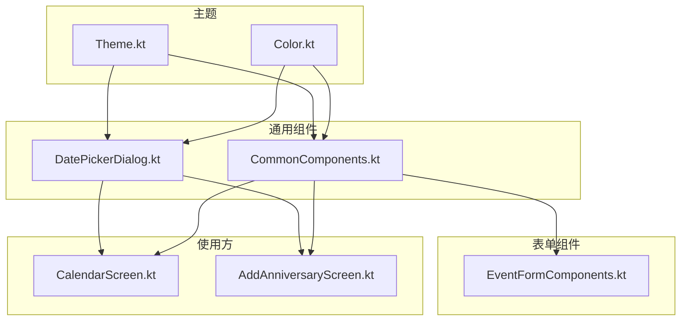
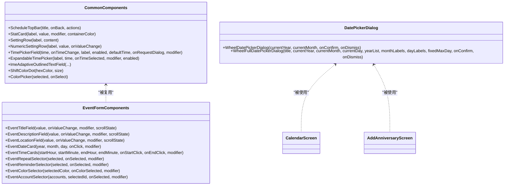
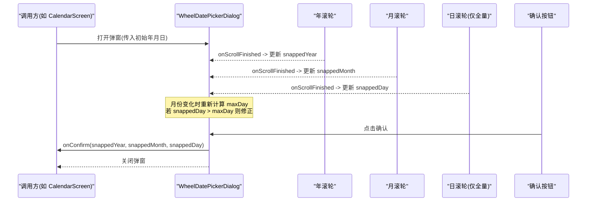
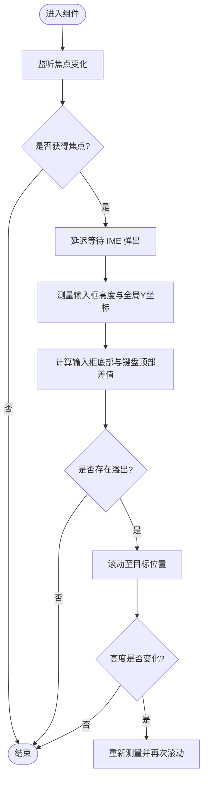
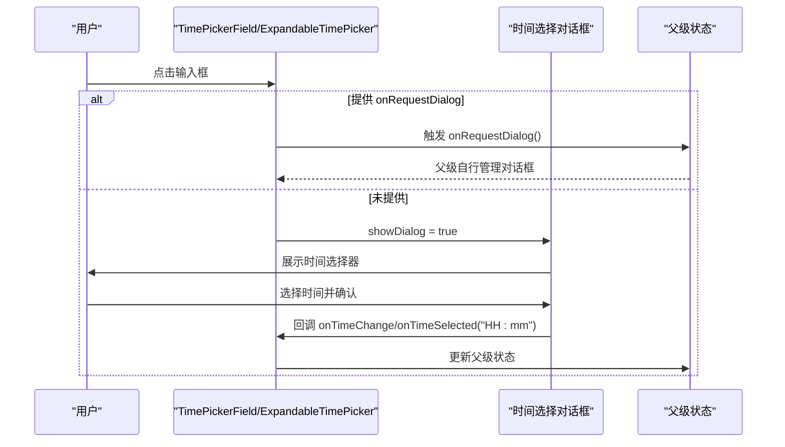
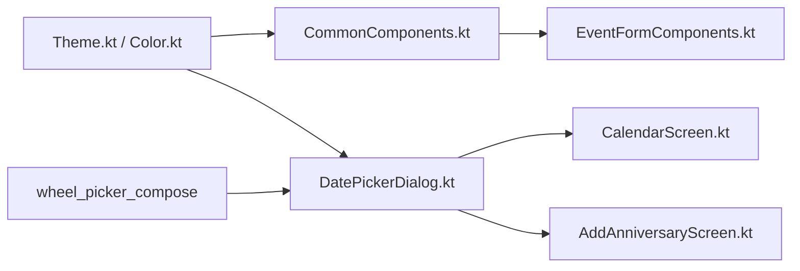

# 通用UI组件库

<cite>
**本文引用的文件**   
- [CommonComponents.kt](file://app/src/main/java/com/schedulecalendar/app/ui/component/CommonComponents.kt)
- [DatePickerDialog.kt](file://app/src/main/java/com/schedulecalendar/app/ui/component/DatePickerDialog.kt)
- [EventFormComponents.kt](file://app/src/main/java/com/schedulecalendar/app/ui/todom/EventFormComponents.kt)
- [CalendarScreen.kt](file://app/src/main/java/com/schedulecalendar/app/ui/calendar/CalendarScreen.kt)
- [AddAnniversaryScreen.kt](file://app/src/main/java/com/schedulecalendar/app/ui/todo/AddAnniversaryScreen.kt)
- [Color.kt](file://app/src/main/java/com/schedulecalendar/app/ui/theme/Color.kt)
- [Theme.kt](file://app/src/main/java/com/schedulecalendar/app/ui/theme/Theme.kt)
</cite>

## 目录
1. [简介](#简介)
2. [项目结构](#项目结构)
3. [核心组件](#核心组件)
4. [架构总览](#架构总览)
5. [详细组件分析](#详细组件分析)
6. [依赖关系分析](#依赖关系分析)
7. [性能与可访问性](#性能与可访问性)
8. [故障排查指南](#故障排查指南)
9. [结论](#结论)
10. [附录：属性接口与使用示例](#附录属性接口与使用示例)

## 简介
本文件系统化梳理并文档化应用中的通用 UI 组件库，重点覆盖以下方面：
- 基础 UI 元素：顶部栏、统计卡片、设置行、时间输入框、IME 自适应输入框等
- 滚轮日期选择器：WheelDatePickerDialog（年/月）与 WheelFullDatePickerDialog（年/月/日）的实现原理与联动策略
- 设计原则：单一职责、可配置性、主题适配
- 属性接口：参数类型、默认值与校验规则
- 集成示例：在日历、纪念日等场景中的使用方式、样式定制与事件处理
- 可访问性与响应式考虑

## 项目结构
通用组件集中在 ui/component 包中，业务表单组件位于 ui/todo 包，主题定义位于 ui/theme。关键文件如下：
- 通用组件：CommonComponents.kt、DatePickerDialog.kt
- 表单组件：EventFormComponents.kt
- 使用方示例：CalendarScreen.kt、AddAnniversaryScreen.kt
- 主题与颜色：Theme.kt、Color.kt

图表来源
- [Theme.kt:1-76](file://app/src/main/java/com/schedulecalendar/app/ui/theme/Theme.kt#L1-L76)
- [Color.kt:1-43](file://app/src/main/java/com/schedulecalendar/app/ui/theme/Color.kt#L1-L43)
- [CommonComponents.kt:1-444](file://app/src/main/java/com/schedulecalendar/app/ui/component/CommonComponents.kt#L1-L444)
- [DatePickerDialog.kt:1-303](file://app/src/main/java/com/schedulecalendar/app/ui/component/DatePickerDialog.kt#L1-L303)
- [EventFormComponents.kt:1-533](file://app/src/main/java/com/schedulecalendar/app/ui/todom/EventFormComponents.kt#L1-L533)
- [CalendarScreen.kt:581-619](file://app/src/main/java/com/schedulecalendar/app/ui/calendar/CalendarScreen.kt#L581-L619)
- [AddAnniversaryScreen.kt:668-688](file://app/src/main/java/com/schedulecalendar/app/ui/todo/AddAnniversaryScreen.kt#L668-L688)

章节来源
- [Theme.kt:1-76](file://app/src/main/java/com/schedulecalendar/app/ui/theme/Theme.kt#L1-L76)
- [Color.kt:1-43](file://app/src/main/java/com/schedulecalendar/app/ui/theme/Color.kt#L1-L43)
- [CommonComponents.kt:1-444](file://app/src/main/java/com/schedulecalendar/app/ui/component/CommonComponents.kt#L1-L444)
- [DatePickerDialog.kt:1-303](file://app/src/main/java/com/schedulecalendar/app/ui/component/DatePickerDialog.kt#L1-L303)
- [EventFormComponents.kt:1-533](file://app/src/main/java/com/schedulecalendar/app/ui/todom/EventFormComponents.kt#L1-L533)
- [CalendarScreen.kt:581-619](file://app/src/main/java/com/schedulecalendar/app/ui/calendar/CalendarScreen.kt#L581-L619)
- [AddAnniversaryScreen.kt:668-688](file://app/src/main/java/com/schedulecalendar/app/ui/todo/AddAnniversaryScreen.kt#L668-L688)

## 核心组件
本节概述通用组件的职责边界与能力范围，便于快速定位与复用。

- 顶部栏 ScheduleTopBar
  - 作用：统一页面标题与返回导航，支持右侧操作区
  - 特性：空标题时不渲染以节省空间；遵循 Material3 主题色
  - 适用：所有需要标准导航的页面

- 统计卡片 StatCard
  - 作用：展示“数值+标签”的信息块
  - 特性：容器颜色可配，圆角与内边距一致

- 设置项 SettingRow / NumericSettingRow
  - 作用：设置页的标准行布局，支持文本与数字输入
  - 特性：分隔线、左右对齐、宽度约束

- 时间输入 TimePickerField / ExpandableTimePicker
  - 作用：点击弹出时间选择对话框，支持只读显示与外部控制弹窗
  - 特性：支持默认时间、禁用态、图标提示、固定标签颜色

- IME 自适应输入框 ImeAdaptiveOutlinedTextField
  - 作用：自动滚动使输入框不被软键盘遮挡
  - 特性：支持 Column+ScrollState 精确滚动；LazyColumn 通过回调由调用方处理

- 颜色点与颜色选择器 ShiftColorDot / ColorPicker
  - 作用：展示班次预设颜色与选择交互
  - 特性：两行九列布局，选中边框高亮

章节来源
- [CommonComponents.kt:38-141](file://app/src/main/java/com/schedulecalendar/app/ui/component/CommonComponents.kt#L38-L141)
- [CommonComponents.kt:148-258](file://app/src/main/java/com/schedulecalendar/app/ui/component/CommonComponents.kt#L148-L258)
- [CommonComponents.kt:260-341](file://app/src/main/java/com/schedulecalendar/app/ui/component/CommonComponents.kt#L260-L341)
- [CommonComponents.kt:343-444](file://app/src/main/java/com/schedulecalendar/app/ui/component/CommonComponents.kt#L343-L444)
- [CommonComponents.kt:67-103](file://app/src/main/java/com/schedulecalendar/app/ui/component/CommonComponents.kt#L67-L103)

## 架构总览
组件库整体采用“主题驱动 + 组合式组件”的架构：
- 主题层提供语义化颜色与排版，组件通过 MaterialTheme 获取
- 通用组件保持无状态或最小状态，通过回调与父级通信
- 日期选择器封装第三方滚轮控件，内部维护本地快照状态，确认时回传结果
- 表单组件复用通用输入与选择器，形成领域化的组合

图表来源
- [CommonComponents.kt:1-444](file://app/src/main/java/com/schedulecalendar/app/ui/component/CommonComponents.kt#L1-L444)
- [DatePickerDialog.kt:1-303](file://app/src/main/java/com/schedulecalendar/app/ui/component/DatePickerDialog.kt#L1-L303)
- [EventFormComponents.kt:1-533](file://app/src/main/java/com/schedulecalendar/app/ui/todom/EventFormComponents.kt#L1-L533)
- [CalendarScreen.kt:581-619](file://app/src/main/java/com/schedulecalendar/app/ui/calendar/CalendarScreen.kt#L581-L619)
- [AddAnniversaryScreen.kt:668-688](file://app/src/main/java/com/schedulecalendar/app/ui/todo/AddAnniversaryScreen.kt#L668-L688)

## 详细组件分析

### 滚轮日期选择器：WheelDatePickerDialog 与 WheelFullDatePickerDialog
- 实现要点
  - 基于第三方 WheelTextPicker 构建三列（年/月/日）或两列（年/月）滚轮
  - 内部维护 snappedYear/snappedMonth/snappedDay 快照状态，滚动结束时更新
  - 月份变化时根据 YearMonth.lengthOfMonth() 动态计算最大天数，若超出则收窄 day
  - 支持固定最大天数 fixedMaxDay，用于农历等自定义场景
  - 按钮确认时对输入进行范围裁剪，保证返回值合法

- 数据绑定与联动
  - 年/月/日各自独立维护索引与显示文本
  - 月份变更触发 maxDay 重算，LaunchedEffect 将当前日修正到有效范围
  - 确认时将快照值限制在传入列表范围内再回调

- 用户交互
  - Dialog 包裹 Card，宽度为屏幕 85%，圆角与阴影提升层级
  - 选择器 selectorProperties 使用主题色容器半透明背景，视觉一致
  - 取消/确定按钮权重均分，字体大小微调

图表来源
- [DatePickerDialog.kt:33-186](file://app/src/main/java/com/schedulecalendar/app/ui/component/DatePickerDialog.kt#L33-L186)
- [DatePickerDialog.kt:192-303](file://app/src/main/java/com/schedulecalendar/app/ui/component/DatePickerDialog.kt#L192-L303)
- [CalendarScreen.kt:605-616](file://app/src/main/java/com/schedulecalendar/app/ui/calendar/CalendarScreen.kt#L605-L616)
- [AddAnniversaryScreen.kt:668-688](file://app/src/main/java/com/schedulecalendar/app/ui/todo/AddAnniversaryScreen.kt#L668-L688)

章节来源
- [DatePickerDialog.kt:33-186](file://app/src/main/java/com/schedulecalendar/app/ui/component/DatePickerDialog.kt#L33-L186)
- [DatePickerDialog.kt:192-303](file://app/src/main/java/com/schedulecalendar/app/ui/component/DatePickerDialog.kt#L192-L303)
- [CalendarScreen.kt:605-616](file://app/src/main/java/com/schedulecalendar/app/ui/calendar/CalendarScreen.kt#L605-L616)
- [AddAnniversaryScreen.kt:668-688](file://app/src/main/java/com/schedulecalendar/app/ui/todo/AddAnniversaryScreen.kt#L668-L688)

### IME 自适应输入框：ImeAdaptiveOutlinedTextField
- 核心机制
  - 监听焦点变化与尺寸变化，记录输入框全局坐标与高度
  - 当获得焦点后延迟等待 IME 弹出，计算输入框底部与键盘顶部的差值
  - 若存在溢出，按差值滚动至目标位置，确保输入框下边缘刚好在键盘上方
  - 内容增长导致高度变化时再次触发滚动，保持可见

- 两种模式
  - 传入 ScrollState：自动精确滚动父 Column
  - 未传入 ScrollState：通过 onFocused 回调交由 LazyColumn 侧处理滚动

图表来源
- [CommonComponents.kt:343-444](file://app/src/main/java/com/schedulecalendar/app/ui/component/CommonComponents.kt#L343-L444)

章节来源
- [CommonComponents.kt:343-444](file://app/src/main/java/com/schedulecalendar/app/ui/component/CommonComponents.kt#L343-L444)

### 时间输入组件：TimePickerField 与 ExpandableTimePicker
- 行为差异
  - TimePickerField：支持 onRequestDialog 回调，点击仅通知父级渲染对话框，适合 LazyColumn 等复杂布局
  - ExpandableTimePicker：自包含对话框，点击直接弹出
- 初始化逻辑
  - 解析 time 字符串为小时/分钟，越界则钳制到合法范围
  - 未提供 time 时使用 defaultTime 作为初始值
- 交互流程
  - 点击输入区域 → 打开对话框 → 选择时间 → 确认回调格式化 HH:mm 字符串

图表来源
- [CommonComponents.kt:168-258](file://app/src/main/java/com/schedulecalendar/app/ui/component/CommonComponents.kt#L168-L258)
- [CommonComponents.kt:260-341](file://app/src/main/java/com/schedulecalendar/app/ui/component/CommonComponents.kt#L260-L341)

章节来源
- [CommonComponents.kt:168-258](file://app/src/main/java/com/schedulecalendar/app/ui/component/CommonComponents.kt#L168-L258)
- [CommonComponents.kt:260-341](file://app/src/main/java/com/schedulecalendar/app/ui/component/CommonComponents.kt#L260-L341)

### 表单组件：EventFormComponents
- 复用通用输入与选择器，组合出领域化表单
- 典型字段：标题、描述、地点、日期、开始/结束时间、重复规则、提醒时间、颜色、账户
- 交互：多数为 OutlinedCard 包裹的可点击区域，展开 AlertDialog 进行选择

章节来源
- [EventFormComponents.kt:1-533](file://app/src/main/java/com/schedulecalendar/app/ui/todom/EventFormComponents.kt#L1-L533)

## 依赖关系分析
- 主题依赖
  - 组件广泛使用 MaterialTheme.colorScheme 与 typography，确保明暗主题与动态取色一致性
- 第三方依赖
  - 滚轮日期选择器依赖 wheel_picker_compose 的 WheelTextPicker
- 使用方耦合
  - CalendarScreen 与 AddAnniversaryScreen 分别演示了年/月与年/月/日的用法

图表来源
- [Theme.kt:1-76](file://app/src/main/java/com/schedulecalendar/app/ui/theme/Theme.kt#L1-L76)
- [Color.kt:1-43](file://app/src/main/java/com/schedulecalendar/app/ui/theme/Color.kt#L1-L43)
- [CommonComponents.kt:1-444](file://app/src/main/java/com/schedulecalendar/app/ui/component/CommonComponents.kt#L1-L444)
- [DatePickerDialog.kt:1-303](file://app/src/main/java/com/schedulecalendar/app/ui/component/DatePickerDialog.kt#L1-L303)
- [EventFormComponents.kt:1-533](file://app/src/main/java/com/schedulecalendar/app/ui/todom/EventFormComponents.kt#L1-L533)
- [CalendarScreen.kt:581-619](file://app/src/main/java/com/schedulecalendar/app/ui/calendar/CalendarScreen.kt#L581-L619)
- [AddAnniversaryScreen.kt:668-688](file://app/src/main/java/com/schedulecalendar/app/ui/todo/AddAnniversaryScreen.kt#L668-L688)

章节来源
- [Theme.kt:1-76](file://app/src/main/java/com/schedulecalendar/app/ui/theme/Theme.kt#L1-L76)
- [Color.kt:1-43](file://app/src/main/java/com/schedulecalendar/app/ui/theme/Color.kt#L1-L43)
- [CommonComponents.kt:1-444](file://app/src/main/java/com/schedulecalendar/app/ui/component/CommonComponents.kt#L1-L444)
- [DatePickerDialog.kt:1-303](file://app/src/main/java/com/schedulecalendar/app/ui/component/DatePickerDialog.kt#L1-L303)
- [EventFormComponents.kt:1-533](file://app/src/main/java/com/schedulecalendar/app/ui/todom/EventFormComponents.kt#L1-L533)
- [CalendarScreen.kt:581-619](file://app/src/main/java/com/schedulecalendar/app/ui/calendar/CalendarScreen.kt#L581-L619)
- [AddAnniversaryScreen.kt:668-688](file://app/src/main/java/com/schedulecalendar/app/ui/todo/AddAnniversaryScreen.kt#L668-L688)

## 性能与可访问性
- 性能
  - 日期选择器仅在滚动结束时更新快照，避免频繁重组
  - 月份变化时通过 LaunchedEffect 精准修正 day，减少无效计算
  - IME 自适应输入框在焦点与高度变化时触发滚动，注意延迟与节流，避免抖动
- 可访问性
  - 图标与按钮提供 contentDescription，便于读屏
  - 颜色选择器使用边框高亮选中态，兼顾色弱用户
  - 主题色对比度遵循 Material3 规范，支持深色模式

[本节为通用指导，不直接分析具体文件]

## 故障排查指南
- 日期选择异常
  - 现象：某月天数不足导致 day 越界
  - 排查：检查 fixedMaxDay 与 YearMonth.lengthOfMonth() 的计算路径，确认 LaunchedEffect 已修正 snappedDay
  - 参考：[DatePickerDialog.kt:56-68](file://app/src/main/java/com/schedulecalendar/app/ui/component/DatePickerDialog.kt#L56-L68)
- 时间输入未更新
  - 现象：点击确认后父级状态未刷新
  - 排查：确认使用的是 TimePickerField 还是 ExpandableTimePicker，以及回调名称与签名是否正确
  - 参考：[CommonComponents.kt:168-258](file://app/src/main/java/com/schedulecalendar/app/ui/component/CommonComponents.kt#L168-L258)、[CommonComponents.kt:260-341](file://app/src/main/java/com/schedulecalendar/app/ui/component/CommonComponents.kt#L260-L341)
- 输入框被键盘遮挡
  - 现象：在 LazyColumn 中输入框不可见
  - 排查：未传入 ScrollState 时需实现 onFocused 回调并在父级执行滚动
  - 参考：[CommonComponents.kt:343-444](file://app/src/main/java/com/schedulecalendar/app/ui/component/CommonComponents.kt#L343-L444)

章节来源
- [DatePickerDialog.kt:56-68](file://app/src/main/java/com/schedulecalendar/app/ui/component/DatePickerDialog.kt#L56-L68)
- [CommonComponents.kt:168-258](file://app/src/main/java/com/schedulecalendar/app/ui/component/CommonComponents.kt#L168-L258)
- [CommonComponents.kt:260-341](file://app/src/main/java/com/schedulecalendar/app/ui/component/CommonComponents.kt#L260-L341)
- [CommonComponents.kt:343-444](file://app/src/main/java/com/schedulecalendar/app/ui/component/CommonComponents.kt#L343-L444)

## 结论
通用 UI 组件库围绕“主题驱动、组合优先、最小状态”的原则构建，提供了从基础控件到领域化表单的完整能力。滚轮日期选择器通过快照状态与联动修正，实现了稳定且可扩展的年月日选择体验。配合 IME 自适应输入框与完善的主题适配，可在多场景下保持一致的可用性与美观度。

[本节为总结，不直接分析具体文件]

## 附录：属性接口与使用示例

### 属性接口一览
- ScheduleTopBar
  - 参数：title(String), onBack(() -> Unit)?, actions(@Composable RowScope.() -> Unit)
  - 默认：空标题时不渲染
- StatCard
  - 参数：label(String), value(String), modifier(Modifier), containerColor(Color)
  - 默认：containerColor 使用 primaryContainer
- SettingRow / NumericSettingRow
  - 参数：label(String), content()/value(String), onValueChange((String) -> Unit)
  - 默认：NumericSettingRow 宽度 120dp，单行
- TimePickerField
  - 参数：time(String), onTimeChange((String) -> Unit), label(String), modifier(Modifier), enabled(Boolean=true), defaultTime(String=""), onRequestDialog(() -> Unit)?
  - 默认：readOnly=false 的输入框外观，实际不可编辑；未提供 time 时使用 defaultTime
- ExpandableTimePicker
  - 参数：label(String), time(String), onTimeSelected((String) -> Unit), modifier(Modifier), enabled(Boolean=true)
  - 默认：自包含对话框
- ImeAdaptiveOutlinedTextField
  - 参数：value(String), onValueChange((String) -> Unit), modifier(Modifier), label/placeholder/leadingIcon/trailingIcon 可选, singleLine(Boolean=false), minLines(Int=1), maxLines(Int=MAX), textStyle(TextStyle?), scrollState(ScrollState?), onFocused(suspend () -> Unit)?
  - 默认：跟随系统文本样式；未提供 scrollState 时使用 onFocused
- WheelDatePickerDialog
  - 参数：currentYear(Int), currentMonth(Int), onConfirm((Int, Int) -> Unit), onDismiss(() -> Unit)
  - 默认：年份范围当前±30年
- WheelFullDatePickerDialog
  - 参数：title(String), currentYear(Int), currentMonth(Int), currentDay(Int), yearList(List<Int>), monthLabels(List<String>?), dayLabels(List<String>?), fixedMaxDay(Int?)?, onConfirm((Int, Int, Int) -> Unit), onDismiss(() -> Unit)
  - 默认：monthLabels/dayLabels 为空时使用“X月/X日”；day 最大值按 YearMonth 计算或 fixedMaxDay 覆盖

章节来源
- [CommonComponents.kt:38-141](file://app/src/main/java/com/schedulecalendar/app/ui/component/CommonComponents.kt#L38-L141)
- [CommonComponents.kt:148-258](file://app/src/main/java/com/schedulecalendar/app/ui/component/CommonComponents.kt#L148-L258)
- [CommonComponents.kt:260-341](file://app/src/main/java/com/schedulecalendar/app/ui/component/CommonComponents.kt#L260-L341)
- [CommonComponents.kt:343-444](file://app/src/main/java/com/schedulecalendar/app/ui/component/CommonComponents.kt#L343-L444)
- [DatePickerDialog.kt:33-186](file://app/src/main/java/com/schedulecalendar/app/ui/component/DatePickerDialog.kt#L33-L186)
- [DatePickerDialog.kt:192-303](file://app/src/main/java/com/schedulecalendar/app/ui/component/DatePickerDialog.kt#L192-L303)

### 使用示例与集成建议
- 在日历页面中使用年/月滚轮选择器跳转月份
  - 打开弹窗：传入当前 state.year/state.month
  - 确认回调：隐藏弹窗并调用 goToMonth(year, month)
  - 参考：[CalendarScreen.kt:605-616](file://app/src/main/java/com/schedulecalendar/app/ui/calendar/CalendarScreen.kt#L605-L616)
- 在纪念日编辑中使用年/月/日滚轮选择器（含农历）
  - 传入 lunarYearRange/lunarMonthNames/lunarDayNames/fixedMaxDay=30
  - 确认回调：更新 lunarYear/lunarMonth/lunarDay 并关闭弹窗
  - 参考：[AddAnniversaryScreen.kt:668-688](file://app/src/main/java/com/schedulecalendar/app/ui/todo/AddAnniversaryScreen.kt#L668-L688)
- 表单集成
  - 标题/描述/地点：使用 EventTitleField/EventDescriptionField/EventLocationField，结合 ImeAdaptiveOutlinedTextField 的 scrollState 或 onFocused
  - 日期/时间：使用 EventDateCard/EventTimeCards 触发对应选择器
  - 重复/提醒/颜色/账户：使用对应的选择器组件
  - 参考：[EventFormComponents.kt:86-241](file://app/src/main/java/com/schedulecalendar/app/ui/todom/EventFormComponents.kt#L86-L241)

章节来源
- [CalendarScreen.kt:605-616](file://app/src/main/java/com/schedulecalendar/app/ui/calendar/CalendarScreen.kt#L605-L616)
- [AddAnniversaryScreen.kt:668-688](file://app/src/main/java/com/schedulecalendar/app/ui/todo/AddAnniversaryScreen.kt#L668-L688)
- [EventFormComponents.kt:86-241](file://app/src/main/java/com/schedulecalendar/app/ui/todom/EventFormComponents.kt#L86-L241)