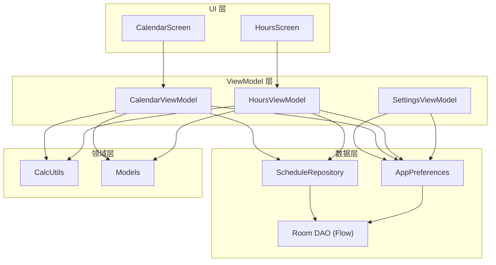
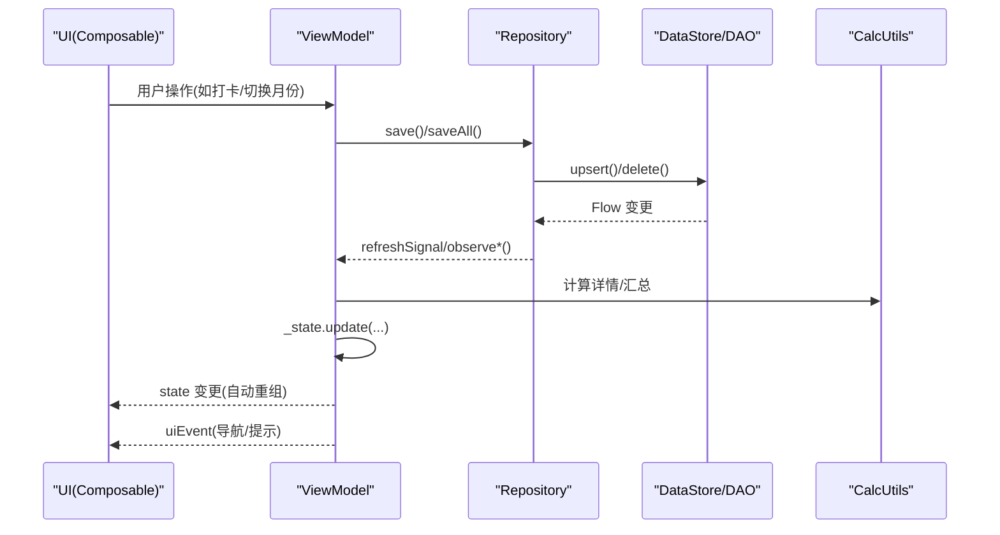
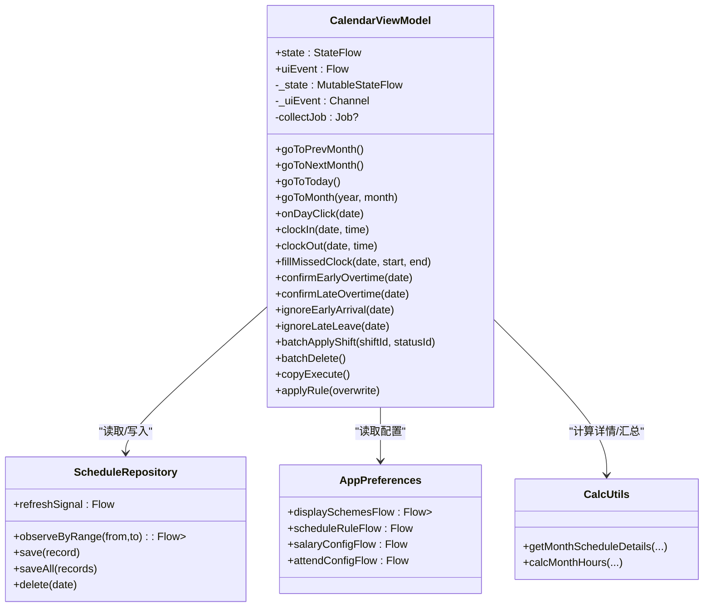
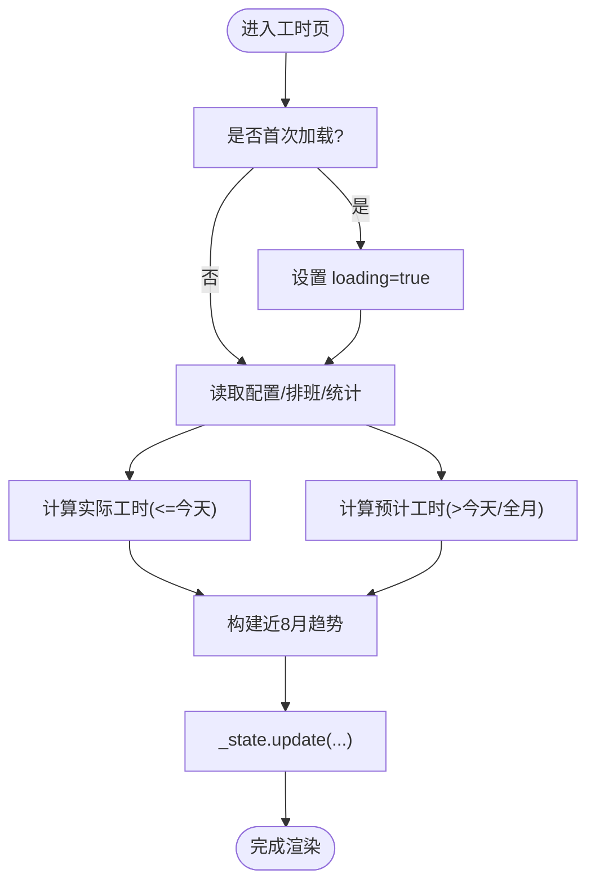
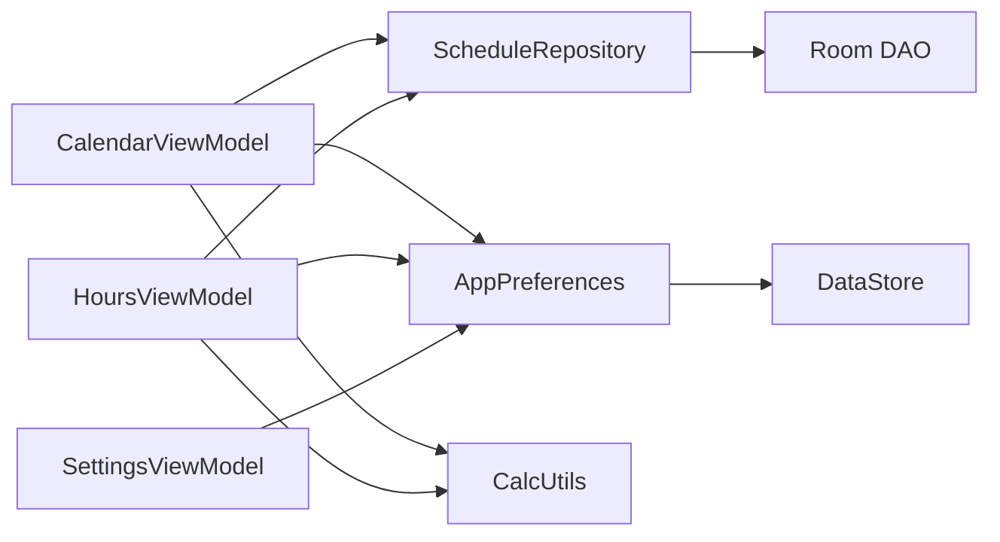

# 数据流设计

<cite>
**本文引用的文件**   
- [CalendarViewModel.kt](file://app/src/main/java/com/schedulecalendar/app/ui/calendar/CalendarViewModel.kt)
- [HoursViewModel.kt](file://app/src/main/java/com/schedulecalendar/app/ui/hours/HoursViewModel.kt)
- [SettingsViewModel.kt](file://app/src/main/java/com/schedulecalendar/app/ui/settings/SettingsViewModel.kt)
- [ScheduleRepository.kt](file://app/src/main/java/com/schedulecalendar/app/data/repository/ScheduleRepository.kt)
- [AppPreferences.kt](file://app/src/main/java/com/schedulecalendar/app/data/prefs/AppPreferences.kt)
- [Models.kt](file://app/src/main/java/com/schedulecalendar/app/domain/model/Models.kt)
- [CalcUtils.kt](file://app/src/main/java/com/schedulecalendar/app/domain/model/CalcUtils.kt)
- [CalendarScreen.kt](file://app/src/main/java/com/schedulecalendar/app/ui/calendar/CalendarScreen.kt)
- [HoursScreen.kt](file://app/src/main/java/com/schedulecalendar/app/ui/hours/HoursScreen.kt)
</cite>

## 目录
1. [引言](#引言)
2. [项目结构](#项目结构)
3. [核心组件](#核心组件)
4. [架构总览](#架构总览)
5. [详细组件分析](#详细组件分析)
6. [依赖关系分析](#依赖关系分析)
7. [性能考量](#性能考量)
8. [故障排查指南](#故障排查指南)
9. [结论](#结论)
10. [附录：最佳实践与示例路径](#附录最佳实践与示例路径)

## 引言
本文件围绕单向数据流在 Android 应用中的实现，系统阐述 StateFlow、Channel 与 Flow 的使用场景与组合策略。重点说明从 UI 层到数据层的完整流转过程，包括状态变更、事件传播与响应式更新；深入解析 combine 操作符在多数据源合并、依赖管理与性能优化中的作用；并给出事件驱动架构（uiEvent）的事件分发与消费模式。文末提供可落地的最佳实践与代码片段路径，涵盖内存泄漏防护、背压处理与调试技巧。

## 项目结构
本项目采用分层架构：UI 层（Compose Screen）→ ViewModel 层 → Repository 层 → DAO/DataStore 持久化层；领域计算逻辑集中在 domain 层。数据流以 Kotlin Flow 为核心，结合 StateFlow 暴露 UI 状态，使用 Channel 传递一次性 UI 事件，Repository 通过 Flow 暴露数据库变化，DataStore 暴露配置项的响应式流。

图表来源
- [CalendarScreen.kt:1-200](file://app/src/main/java/com/schedulecalendar/app/ui/calendar/CalendarScreen.kt#L1-L200)
- [HoursScreen.kt:1-200](file://app/src/main/java/com/schedulecalendar/app/ui/hours/HoursScreen.kt#L1-L200)
- [CalendarViewModel.kt:104-247](file://app/src/main/java/com/schedulecalendar/app/ui/calendar/CalendarViewModel.kt#L104-L247)
- [HoursViewModel.kt:51-163](file://app/src/main/java/com/schedulecalendar/app/ui/hours/HoursViewModel.kt#L51-L163)
- [SettingsViewModel.kt:34-91](file://app/src/main/java/com/schedulecalendar/app/ui/settings/SettingsViewModel.kt#L34-L91)
- [ScheduleRepository.kt:13-39](file://app/src/main/java/com/schedulecalendar/app/data/repository/ScheduleRepository.kt#L13-L39)
- [AppPreferences.kt:25-101](file://app/src/main/java/com/schedulecalendar/app/data/prefs/AppPreferences.kt#L25-L101)
- [CalcUtils.kt:16-200](file://app/src/main/java/com/schedulecalendar/app/domain/model/CalcUtils.kt#L16-L200)
- [Models.kt:80-100](file://app/src/main/java/com/schedulecalendar/app/domain/model/Models.kt#L80-L100)

章节来源
- [CalendarScreen.kt:1-200](file://app/src/main/java/com/schedulecalendar/app/ui/calendar/CalendarScreen.kt#L1-L200)
- [HoursScreen.kt:1-200](file://app/src/main/java/com/schedulecalendar/app/ui/hours/HoursScreen.kt#L1-L200)
- [CalendarViewModel.kt:104-247](file://app/src/main/java/com/schedulecalendar/app/ui/calendar/CalendarViewModel.kt#L104-L247)
- [HoursViewModel.kt:51-163](file://app/src/main/java/com/schedulecalendar/app/ui/hours/HoursViewModel.kt#L51-L163)
- [SettingsViewModel.kt:34-91](file://app/src/main/java/com/schedulecalendar/app/ui/settings/SettingsViewModel.kt#L34-L91)
- [ScheduleRepository.kt:13-39](file://app/src/main/java/com/schedulecalendar/app/data/repository/ScheduleRepository.kt#L13-L39)
- [AppPreferences.kt:25-101](file://app/src/main/java/com/schedulecalendar/app/data/prefs/AppPreferences.kt#L25-L101)
- [CalcUtils.kt:16-200](file://app/src/main/java/com/schedulecalendar/app/domain/model/CalcUtils.kt#L16-L200)
- [Models.kt:80-100](file://app/src/main/java/com/schedulecalendar/app/domain/model/Models.kt#L80-L100)

## 核心组件
- CalendarViewModel：日历主视图的状态与事件中心，负责多数据源合并、跨月数据计算、待办生成、批量/复制排班、小组件同步等。
- HoursViewModel：工时页一次性加载与刷新，监听数据变更信号，计算实际/预计工时与趋势。
- SettingsViewModel：设置页配置聚合，将多个 DataStore 配置合并为统一 UI 状态。
- ScheduleRepository：排班数据的读写与变更信号广播，封装 DAO 的 Flow 查询。
- AppPreferences：基于 DataStore 的配置流，提供薪资、考勤、显示方案、排序等 Flow。
- CalcUtils：工时与薪资计算的纯函数工具集，对齐小程序逻辑。
- Models：领域模型定义（班次、记录、附加项、配置等）。

章节来源
- [CalendarViewModel.kt:104-247](file://app/src/main/java/com/schedulecalendar/app/ui/calendar/CalendarViewModel.kt#L104-L247)
- [HoursViewModel.kt:51-163](file://app/src/main/java/com/schedulecalendar/app/ui/hours/HoursViewModel.kt#L51-L163)
- [SettingsViewModel.kt:34-91](file://app/src/main/java/com/schedulecalendar/app/ui/settings/SettingsViewModel.kt#L34-L91)
- [ScheduleRepository.kt:13-39](file://app/src/main/java/com/schedulecalendar/app/data/repository/ScheduleRepository.kt#L13-L39)
- [AppPreferences.kt:25-101](file://app/src/main/java/com/schedulecalendar/app/data/prefs/AppPreferences.kt#L25-L101)
- [CalcUtils.kt:16-200](file://app/src/main/java/com/schedulecalendar/app/domain/model/CalcUtils.kt#L16-L200)
- [Models.kt:80-100](file://app/src/main/java/com/schedulecalendar/app/domain/model/Models.kt#L80-L100)

## 架构总览
单向数据流的关键点：
- UI 只订阅 state（StateFlow），不直接修改数据。
- 用户交互触发 ViewModel 方法，写入数据层或发送 uiEvent（Channel）。
- 数据层通过 Flow 发出变更，ViewModel 用 combine 聚合多源数据，更新 state。
- UI 消费 uiEvent 执行导航、提示等副作用。

图表来源
- [CalendarViewModel.kt:104-247](file://app/src/main/java/com/schedulecalendar/app/ui/calendar/CalendarViewModel.kt#L104-L247)
- [HoursViewModel.kt:51-163](file://app/src/main/java/com/schedulecalendar/app/ui/hours/HoursViewModel.kt#L51-L163)
- [ScheduleRepository.kt:13-39](file://app/src/main/java/com/schedulecalendar/app/data/repository/ScheduleRepository.kt#L13-L39)
- [AppPreferences.kt:25-101](file://app/src/main/java/com/schedulecalendar/app/data/prefs/AppPreferences.kt#L25-L101)
- [CalcUtils.kt:16-200](file://app/src/main/java/com/schedulecalendar/app/domain/model/CalcUtils.kt#L16-L200)

## 详细组件分析

### CalendarViewModel：多源合并与事件驱动
- 状态与事件
  - 使用 MutableStateFlow 暴露不可变 state，UI 通过 collectAsStateWithLifecycle 订阅。
  - 使用 Channel<BUFFERED> 暴露一次性 uiEvent，避免重复消费。
- 数据合并
  - 使用 combine 聚合班次、排班范围、显示方案、排班规则等多 Flow，按当前月份动态计算日期范围，减少不必要的数据读取。
  - 对跨月填充日期进行额外计算，保证日历网格展示一致性。
- 事件处理
  - 导航、消息、错误通过 uiEvent 下发，UI 侧集中处理。
- 资源管理
  - 切月时取消旧 collectJob，防止 collector 累积导致内存泄漏。
- 外部联动
  - 写操作后触发小组件同步与日历事件加载。

图表来源
- [CalendarViewModel.kt:104-247](file://app/src/main/java/com/schedulecalendar/app/ui/calendar/CalendarViewModel.kt#L104-L247)
- [ScheduleRepository.kt:13-39](file://app/src/main/java/com/schedulecalendar/app/data/repository/ScheduleRepository.kt#L13-L39)
- [AppPreferences.kt:25-101](file://app/src/main/java/com/schedulecalendar/app/data/prefs/AppPreferences.kt#L25-L101)
- [CalcUtils.kt:16-200](file://app/src/main/java/com/schedulecalendar/app/domain/model/CalcUtils.kt#L16-L200)

章节来源
- [CalendarViewModel.kt:104-247](file://app/src/main/java/com/schedulecalendar/app/ui/calendar/CalendarViewModel.kt#L104-L247)
- [CalendarScreen.kt:121-130](file://app/src/main/java/com/schedulecalendar/app/ui/calendar/CalendarScreen.kt#L121-L130)

### HoursViewModel：按需加载与变更刷新
- 状态与事件
  - 使用 MutableStateFlow 暴露 HoursUiState，Channel 暴露一次性事件。
- 数据刷新
  - 监听 scheduleRepo.refreshSignal，当排班数据变更时自动 reload。
  - 首次加载显示 loading，后续刷新保持现有内容，提升体验。
- 计算与趋势
  - 根据当月/历史/未来月份区分实际与预计工时，近8个月趋势用于图表展示。

图表来源
- [HoursViewModel.kt:51-163](file://app/src/main/java/com/schedulecalendar/app/ui/hours/HoursViewModel.kt#L51-L163)
- [ScheduleRepository.kt:13-39](file://app/src/main/java/com/schedulecalendar/app/data/repository/ScheduleRepository.kt#L13-L39)

章节来源
- [HoursViewModel.kt:51-163](file://app/src/main/java/com/schedulecalendar/app/ui/hours/HoursViewModel.kt#L51-L163)
- [HoursScreen.kt:84-99](file://app/src/main/java/com/schedulecalendar/app/ui/hours/HoursScreen.kt#L84-L99)

### SettingsViewModel：配置聚合与保存
- 使用 combine 聚合薪资、考勤、排班规则、显示方案等多个 Flow，构造统一的 SettingsUiState。
- 保存操作委托给 AppPreferences，UI 通过 state 自动反映最新配置。

章节来源
- [SettingsViewModel.kt:34-91](file://app/src/main/java/com/schedulecalendar/app/ui/settings/SettingsViewModel.kt#L34-L91)
- [AppPreferences.kt:25-101](file://app/src/main/java/com/schedulecalendar/app/data/prefs/AppPreferences.kt#L25-L101)

### 数据层与偏好存储
- ScheduleRepository
  - 暴露 observeByRange/observeByMonth 等 Flow，供 ViewModel 组合。
  - 写操作后通过 MutableSharedFlow 发出 refreshSignal，驱动 UI 刷新。
- AppPreferences
  - 所有配置项均暴露 Flow，支持实时响应式更新。
  - 使用 Gson 序列化复杂对象，确保默认值正确反序列化。

章节来源
- [ScheduleRepository.kt:13-39](file://app/src/main/java/com/schedulecalendar/app/data/repository/ScheduleRepository.kt#L13-L39)
- [AppPreferences.kt:25-101](file://app/src/main/java/com/schedulecalendar/app/data/prefs/AppPreferences.kt#L25-L101)

### 领域计算与模型
- CalcUtils
  - 提供时间归一化、粒度取整、全局休息段扣减、日/月工时计算等纯函数。
- Models
  - 定义 Shift、ScheduleRecord、ExtraItem、SalaryConfig、AttendConfig、DisplayScheme 等核心领域对象。

章节来源
- [CalcUtils.kt:16-200](file://app/src/main/java/com/schedulecalendar/app/domain/model/CalcUtils.kt#L16-L200)
- [Models.kt:80-100](file://app/src/main/java/com/schedulecalendar/app/domain/model/Models.kt#L80-L100)

## 依赖关系分析
- 低耦合高内聚
  - ViewModel 仅依赖 Repository 与 Preferences 的抽象接口，领域计算通过纯函数 CalcUtils 解耦。
- 直接依赖
  - CalendarViewModel 依赖 ScheduleRepository、AppPreferences、CalcUtils。
  - HoursViewModel 依赖 ScheduleRepository、AppPreferences、CalcUtils。
  - SettingsViewModel 依赖 AppPreferences。
- 间接依赖
  - Repository 依赖 Room DAO 的 Flow；Preferences 依赖 DataStore。

图表来源
- [CalendarViewModel.kt:104-247](file://app/src/main/java/com/schedulecalendar/app/ui/calendar/CalendarViewModel.kt#L104-L247)
- [HoursViewModel.kt:51-163](file://app/src/main/java/com/schedulecalendar/app/ui/hours/HoursViewModel.kt#L51-L163)
- [SettingsViewModel.kt:34-91](file://app/src/main/java/com/schedulecalendar/app/ui/settings/SettingsViewModel.kt#L34-L91)
- [ScheduleRepository.kt:13-39](file://app/src/main/java/com/schedulecalendar/app/data/repository/ScheduleRepository.kt#L13-L39)
- [AppPreferences.kt:25-101](file://app/src/main/java/com/schedulecalendar/app/data/prefs/AppPreferences.kt#L25-L101)

章节来源
- [CalendarViewModel.kt:104-247](file://app/src/main/java/com/schedulecalendar/app/ui/calendar/CalendarViewModel.kt#L104-L247)
- [HoursViewModel.kt:51-163](file://app/src/main/java/com/schedulecalendar/app/ui/hours/HoursViewModel.kt#L51-L163)
- [SettingsViewModel.kt:34-91](file://app/src/main/java/com/schedulecalendar/app/ui/settings/SettingsViewModel.kt#L34-L91)
- [ScheduleRepository.kt:13-39](file://app/src/main/java/com/schedulecalendar/app/data/repository/ScheduleRepository.kt#L13-L39)
- [AppPreferences.kt:25-101](file://app/src/main/java/com/schedulecalendar/app/data/prefs/AppPreferences.kt#L25-L101)

## 性能考量
- 数据合并优化
  - CalendarViewModel 使用 combine 限定日期范围，避免全表扫描；跨月填充仅在必要时计算。
- 背压与缓冲
  - Channel 使用 BUFFERED 容量，避免快速事件堆积阻塞 UI；write 操作后 emit 一次信号，降低频繁刷新。
- 懒加载与去抖
  - HoursViewModel 首次加载才显示 loading，后续刷新保持内容，减少闪烁。
- 计算复杂度
  - CalcUtils 的计算为 O(n) 遍历当月记录，配合 Map 索引，整体线性复杂度。
- 内存泄漏防护
  - CalendarViewModel 切月时 cancel 旧 collectJob，防止协程泄漏。

[本节为通用指导，无需具体文件引用]

## 故障排查指南
- 常见问题定位
  - 状态未更新：检查 combine 的输入 Flow 是否正确，确认 Repository 的 observe 返回非空 Flow。
  - 事件丢失：确认 UI 侧是否持续 collect uiEvent，避免提前结束收集。
  - 数据不一致：核对 write 操作后是否调用 notifyChanged/emit refreshSignal。
- 调试技巧
  - 在 combine 前后打印关键参数（年份、月份、范围起止）。
  - 使用 runCatching 包裹耗时计算，捕获异常并输出错误事件。
  - 在 UI 层收集 state 与 uiEvent 时添加日志，观察时序。

章节来源
- [CalendarViewModel.kt:104-247](file://app/src/main/java/com/schedulecalendar/app/ui/calendar/CalendarViewModel.kt#L104-L247)
- [HoursViewModel.kt:51-163](file://app/src/main/java/com/schedulecalendar/app/ui/hours/HoursViewModel.kt#L51-L163)
- [ScheduleRepository.kt:13-39](file://app/src/main/java/com/schedulecalendar/app/data/repository/ScheduleRepository.kt#L13-L39)

## 结论
本项目以 Flow 为核心构建单向数据流，通过 StateFlow 暴露状态、Channel 传递一次性事件、combine 聚合多源数据，实现了清晰、可维护且高性能的响应式架构。ViewModel 作为唯一状态持有者与业务编排者，有效隔离了 UI 与数据层，提升了可测试性与扩展性。

[本节为总结，无需具体文件引用]

## 附录：最佳实践与示例路径
- StateFlow 使用场景
  - 页面级状态：CalendarUiState、HoursUiState、SettingsUiState。
  - 示例路径：
    - [CalendarViewModel.kt:117-118](file://app/src/main/java/com/schedulecalendar/app/ui/calendar/CalendarViewModel.kt#L117-L118)
    - [HoursViewModel.kt:61-62](file://app/src/main/java/com/schedulecalendar/app/ui/hours/HoursViewModel.kt#L61-L62)
    - [SettingsViewModel.kt:44-45](file://app/src/main/java/com/schedulecalendar/app/ui/settings/SettingsViewModel.kt#L44-L45)
- Channel 使用场景
  - 一次性 UI 事件（导航、提示、错误）。
  - 示例路径：
    - [CalendarViewModel.kt:120-121](file://app/src/main/java/com/schedulecalendar/app/ui/calendar/CalendarViewModel.kt#L120-L121)
    - [HoursViewModel.kt:64-65](file://app/src/main/java/com/schedulecalendar/app/ui/hours/HoursViewModel.kt#L64-L65)
    - [SettingsViewModel.kt:50-51](file://app/src/main/java/com/schedulecalendar/app/ui/settings/SettingsViewModel.kt#L50-L51)
- LiveData 使用场景
  - 本项目未直接使用 LiveData，推荐在需要与旧 API 兼容时使用，否则优先 Flow。
- combine 多数据源合并
  - 多 Flow 聚合为单一状态，减少冗余计算。
  - 示例路径：
    - [CalendarViewModel.kt:160-167](file://app/src/main/java/com/schedulecalendar/app/ui/calendar/CalendarViewModel.kt#L160-L167)
    - [SettingsViewModel.kt:55-63](file://app/src/main/java/com/schedulecalendar/app/ui/settings/SettingsViewModel.kt#L55-L63)
- 事件驱动架构（uiEvent）
  - 事件分发与消费模式：ViewModel 发送，UI 侧集中处理。
  - 示例路径：
    - [CalendarScreen.kt:121-130](file://app/src/main/java/com/schedulecalendar/app/ui/calendar/CalendarScreen.kt#L121-L130)
    - [HoursScreen.kt:91-99](file://app/src/main/java/com/schedulecalendar/app/ui/hours/HoursScreen.kt#L91-L99)
- 内存泄漏防护
  - 切月取消旧 Job，避免协程泄漏。
  - 示例路径：
    - [CalendarViewModel.kt:134-136](file://app/src/main/java/com/schedulecalendar/app/ui/calendar/CalendarViewModel.kt#L134-L136)
- 背压处理
  - Channel BUFFERED 容量控制；Repository 使用 SharedFlow 限发信号。
  - 示例路径：
    - [CalendarViewModel.kt:120-121](file://app/src/main/java/com/schedulecalendar/app/ui/calendar/CalendarViewModel.kt#L120-L121)
    - [ScheduleRepository.kt:17-21](file://app/src/main/java/com/schedulecalendar/app/data/repository/ScheduleRepository.kt#L17-L21)
- 调试技巧
  - 在关键节点打印日志；使用 runCatching 捕获异常并上报错误事件。
  - 示例路径：
    - [HoursViewModel.kt:134-137](file://app/src/main/java/com/schedulecalendar/app/ui/hours/HoursViewModel.kt#L134-L137)
    - [CalendarViewModel.kt:504-511](file://app/src/main/java/com/schedulecalendar/app/ui/calendar/CalendarViewModel.kt#L504-L511)