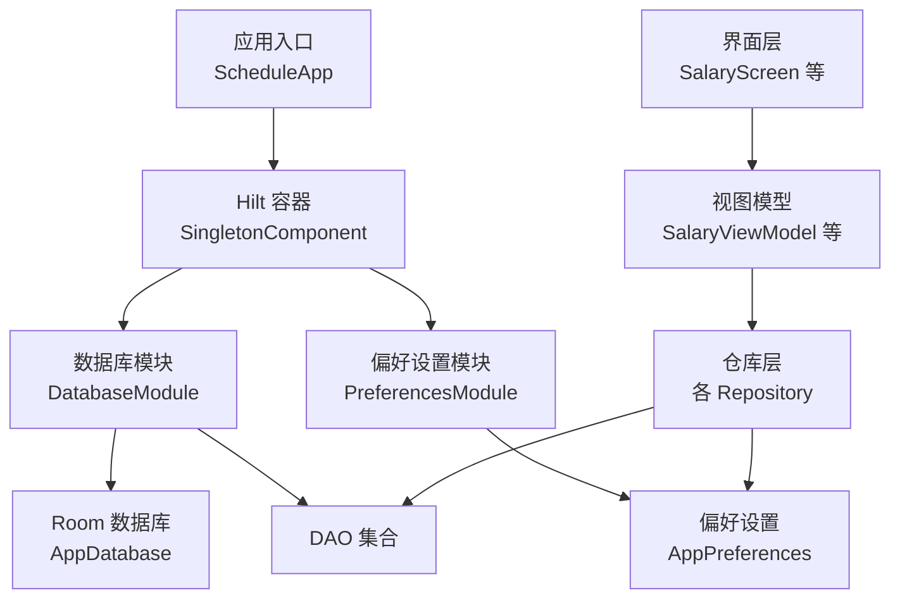
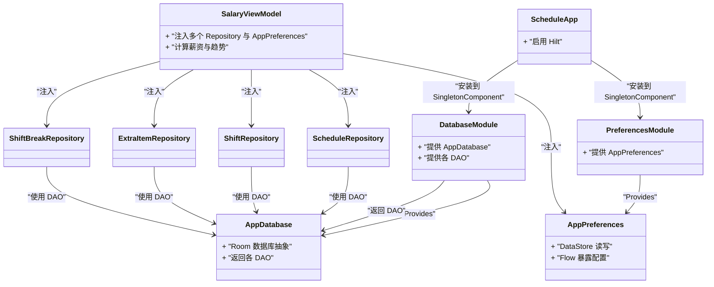
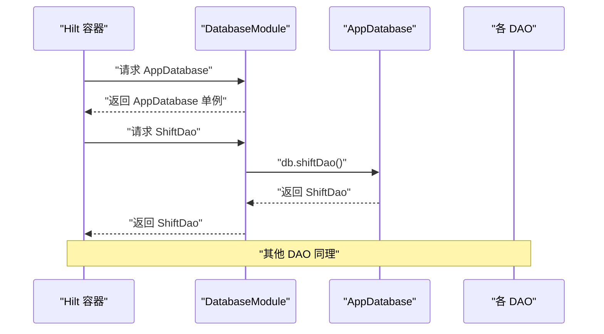
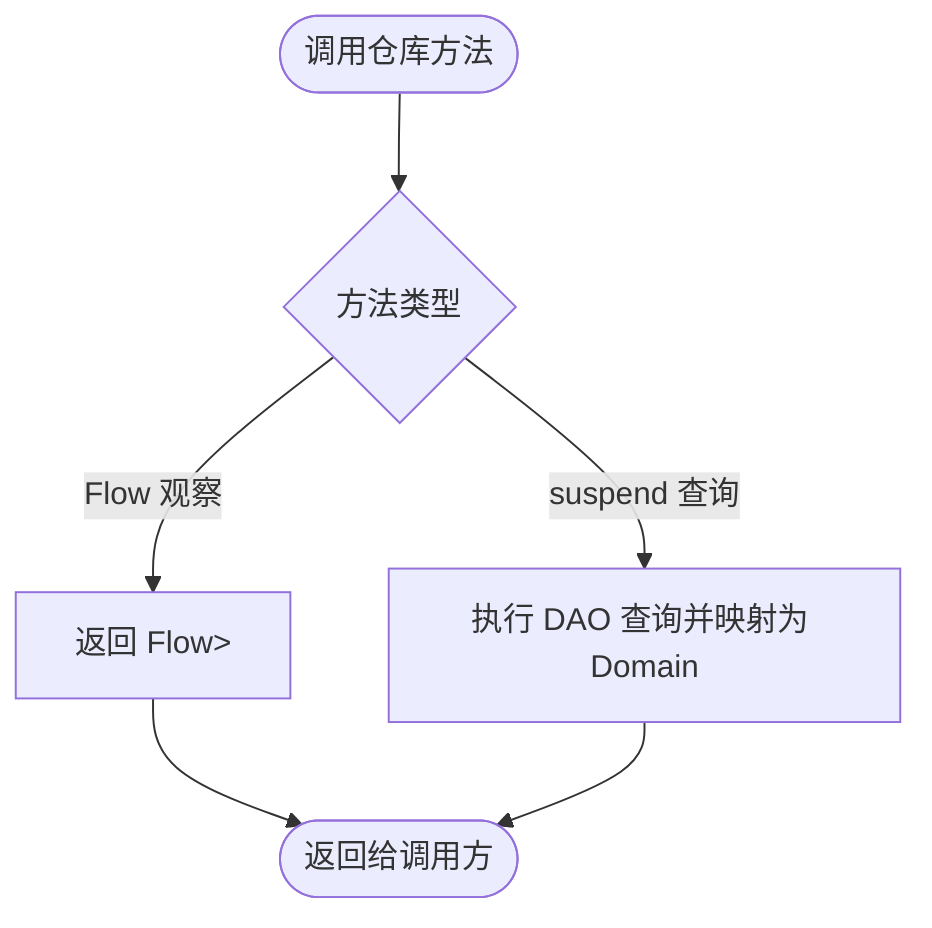
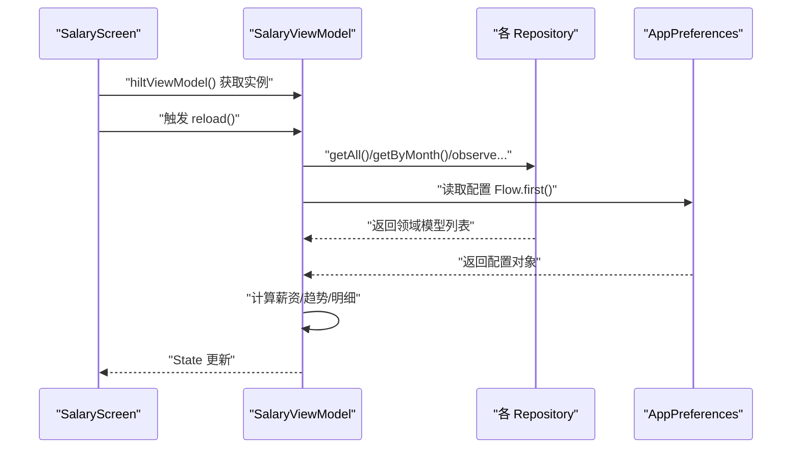
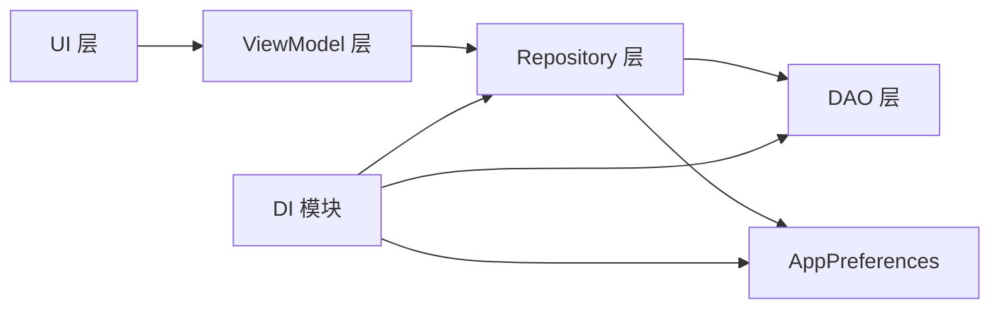

# 依赖注入系统

<cite>
**本文引用的文件**   
- [ScheduleApp.kt](file://app/src/main/java/com/schedulecalendar/app/ScheduleApp.kt)
- [DatabaseModule.kt](file://app/src/main/java/com/schedulecalendar/app/di/DatabaseModule.kt)
- [PreferencesModule.kt](file://app/src/main/java/com/schedulecalendar/app/di/PreferencesModule.kt)
- [AppDatabase.kt](file://app/src/main/java/com/schedulecalendar/app/data/db/AppDatabase.kt)
- [AppPreferences.kt](file://app/src/main/java/com/schedulecalendar/app/data/prefs/AppPreferences.kt)
- [SalaryViewModel.kt](file://app/src/main/java/com/schedulecalendar/app/ui/salary/SalaryViewModel.kt)
- [SalaryScreen.kt](file://app/src/main/java/com/schedulecalendar/app/ui/salary/SalaryScreen.kt)
- [ScheduleRepository.kt](file://app/src/main/java/com/schedulecalendar/app/data/repository/ScheduleRepository.kt)
- [ShiftRepository.kt](file://app/src/main/java/com/schedulecalendar/app/data/repository/ShiftRepository.kt)
- [ExtraItemRepository.kt](file://app/src/main/java/com/schedulecalendar/app/data/repository/ExtraItemRepository.kt)
- [ShiftBreakRepository.kt](file://app/src/main/java/com/schedulecalendar/app/data/repository/ShiftBreakRepository.kt)
</cite>

## 目录
1. [简介](#简介)
2. [项目结构](#项目结构)
3. [核心组件](#核心组件)
4. [架构总览](#架构总览)
5. [详细组件分析](#详细组件分析)
6. [依赖关系分析](#依赖关系分析)
7. [性能考量](#性能考量)
8. [故障排查指南](#故障排查指南)
9. [结论](#结论)
10. [附录](#附录)

## 简介
本文件系统性梳理项目中基于 Hilt 的依赖注入体系，覆盖模块定义、作用域管理、数据库与偏好设置等核心模块的实现细节，并说明单例模式、工厂模式的落地方式。同时给出在不同层级（UI、ViewModel、Repository）中正确注入依赖的实践方法，以及自定义注解、条件注入与延迟加载的高级特性与最佳实践。

## 项目结构
本项目采用分层组织：
- 应用入口与 DI 初始化：Application 类使用 Hilt 注解启用框架
- 模块层：以 @Module + @InstallIn 声明依赖提供器，按作用域安装到 Hilt 图
- 数据层：Room 数据库与 DataStore 偏好设置，通过 Repository 暴露领域模型
- 表现层：Compose UI 通过 hiltViewModel() 获取 ViewModel，再由 ViewModel 注入 Repository 与配置对象

图表来源
- [ScheduleApp.kt:1-9](file://app/src/main/java/com/schedulecalendar/app/ScheduleApp.kt#L1-L9)
- [DatabaseModule.kt:1-35](file://app/src/main/java/com/schedulecalendar/app/di/DatabaseModule.kt#L1-L35)
- [PreferencesModule.kt:1-21](file://app/src/main/java/com/schedulecalendar/app/di/PreferencesModule.kt#L1-L21)
- [AppDatabase.kt:1-35](file://app/src/main/java/com/schedulecalendar/app/data/db/AppDatabase.kt#L1-L35)
- [AppPreferences.kt:1-303](file://app/src/main/java/com/schedulecalendar/app/data/prefs/AppPreferences.kt#L1-L303)
- [SalaryViewModel.kt:1-156](file://app/src/main/java/com/schedulecalendar/app/ui/salary/SalaryViewModel.kt#L1-L156)
- [SalaryScreen.kt:38-58](file://app/src/main/java/com/schedulecalendar/app/ui/salary/SalaryScreen.kt#L38-L58)

章节来源
- [ScheduleApp.kt:1-9](file://app/src/main/java/com/schedulecalendar/app/ScheduleApp.kt#L1-L9)
- [DatabaseModule.kt:1-35](file://app/src/main/java/com/schedulecalendar/app/di/DatabaseModule.kt#L1-L35)
- [PreferencesModule.kt:1-21](file://app/src/main/java/com/schedulecalendar/app/di/PreferencesModule.kt#L1-L21)
- [AppDatabase.kt:1-35](file://app/src/main/java/com/schedulecalendar/app/data/db/AppDatabase.kt#L1-L35)
- [AppPreferences.kt:1-303](file://app/src/main/java/com/schedulecalendar/app/data/prefs/AppPreferences.kt#L1-L303)
- [SalaryViewModel.kt:1-156](file://app/src/main/java/com/schedulecalendar/app/ui/salary/SalaryViewModel.kt#L1-L156)
- [SalaryScreen.kt:38-58](file://app/src/main/java/com/schedulecalendar/app/ui/salary/SalaryScreen.kt#L38-L58)

## 核心组件
- 应用级 Hilt 容器：在 Application 上标注启用 Hilt，使全局单例作用域可用
- 数据库模块：提供 Room 数据库实例与各 DAO 的单例绑定
- 偏好设置模块：提供 AppPreferences 的单例绑定
- 仓库层：对 DAO 进行封装，统一领域模型转换与变更信号
- 视图模型：通过 Hilt 注入仓库与偏好设置，驱动业务逻辑与状态更新
- 界面层：通过 Compose 的 hiltViewModel() 获取生命周期感知的 ViewModel

章节来源
- [ScheduleApp.kt:1-9](file://app/src/main/java/com/schedulecalendar/app/ScheduleApp.kt#L1-L9)
- [DatabaseModule.kt:1-35](file://app/src/main/java/com/schedulecalendar/app/di/DatabaseModule.kt#L1-L35)
- [PreferencesModule.kt:1-21](file://app/src/main/java/com/schedulecalendar/app/di/PreferencesModule.kt#L1-L21)
- [SalaryViewModel.kt:1-156](file://app/src/main/java/com/schedulecalendar/app/ui/salary/SalaryViewModel.kt#L1-L156)
- [SalaryScreen.kt:38-58](file://app/src/main/java/com/schedulecalendar/app/ui/salary/SalaryScreen.kt#L38-L58)

## 架构总览
下图展示了从 UI 到数据层的依赖注入路径与关键对象关系。

图表来源
- [ScheduleApp.kt:1-9](file://app/src/main/java/com/schedulecalendar/app/ScheduleApp.kt#L1-L9)
- [DatabaseModule.kt:1-35](file://app/src/main/java/com/schedulecalendar/app/di/DatabaseModule.kt#L1-L35)
- [PreferencesModule.kt:1-21](file://app/src/main/java/com/schedulecalendar/app/di/PreferencesModule.kt#L1-L21)
- [AppDatabase.kt:1-35](file://app/src/main/java/com/schedulecalendar/app/data/db/AppDatabase.kt#L1-L35)
- [AppPreferences.kt:1-303](file://app/src/main/java/com/schedulecalendar/app/data/prefs/AppPreferences.kt#L1-L303)
- [SalaryViewModel.kt:1-156](file://app/src/main/java/com/schedulecalendar/app/ui/salary/SalaryViewModel.kt#L1-L156)
- [ScheduleRepository.kt:1-40](file://app/src/main/java/com/schedulecalendar/app/data/repository/ScheduleRepository.kt#L1-L40)
- [ShiftRepository.kt:1-45](file://app/src/main/java/com/schedulecalendar/app/data/repository/ShiftRepository.kt#L1-L45)
- [ExtraItemRepository.kt:1-31](file://app/src/main/java/com/schedulecalendar/app/data/repository/ExtraItemRepository.kt#L1-L31)
- [ShiftBreakRepository.kt:1-27](file://app/src/main/java/com/schedulecalendar/app/data/repository/ShiftBreakRepository.kt#L1-L27)

## 详细组件分析

### 应用入口与 Hilt 初始化
- 在 Application 类上使用 Hilt 注解启用依赖注入容器，确保全局单例作用域可用
- 该步骤是后续所有 @Module 与 @Inject 生效的前提

章节来源
- [ScheduleApp.kt:1-9](file://app/src/main/java/com/schedulecalendar/app/ScheduleApp.kt#L1-L9)

### 数据库模块（DatabaseModule）
- 使用 @Module 与 @InstallIn(SingletonComponent::class) 将依赖安装到全局单例作用域
- 提供 Room 数据库实例，并通过 @Singleton 保证进程内唯一
- 为每个 DAO 提供单例绑定，便于在 Repository 中直接注入

图表来源
- [DatabaseModule.kt:1-35](file://app/src/main/java/com/schedulecalendar/app/di/DatabaseModule.kt#L1-L35)
- [AppDatabase.kt:1-35](file://app/src/main/java/com/schedulecalendar/app/data/db/AppDatabase.kt#L1-L35)

章节来源
- [DatabaseModule.kt:1-35](file://app/src/main/java/com/schedulecalendar/app/di/DatabaseModule.kt#L1-L35)
- [AppDatabase.kt:1-35](file://app/src/main/java/com/schedulecalendar/app/data/db/AppDatabase.kt#L1-L35)

### 偏好设置模块（PreferencesModule）
- 提供 AppPreferences 的单例绑定，内部基于 DataStore 实现类型安全的键值存储与 Flow 响应式读取
- 通过 @ApplicationContext 限定 Context 生命周期，避免内存泄漏

章节来源
- [PreferencesModule.kt:1-21](file://app/src/main/java/com/schedulecalendar/app/di/PreferencesModule.kt#L1-L21)
- [AppPreferences.kt:1-303](file://app/src/main/java/com/schedulecalendar/app/data/prefs/AppPreferences.kt#L1-L303)

### 仓库层（Repositories）
- 各仓库类使用 @Singleton 与 @Inject 构造函数注入对应 DAO，统一领域模型转换
- 暴露 Flow 与 suspend 函数，支持观察与一次性查询
- 部分仓库提供“内置项合并”能力（如班次），便于 UI 展示与选择

图表来源
- [ScheduleRepository.kt:1-40](file://app/src/main/java/com/schedulecalendar/app/data/repository/ScheduleRepository.kt#L1-L40)
- [ShiftRepository.kt:1-45](file://app/src/main/java/com/schedulecalendar/app/data/repository/ShiftRepository.kt#L1-L45)
- [ExtraItemRepository.kt:1-31](file://app/src/main/java/com/schedulecalendar/app/data/repository/ExtraItemRepository.kt#L1-L31)
- [ShiftBreakRepository.kt:1-27](file://app/src/main/java/com/schedulecalendar/app/data/repository/ShiftBreakRepository.kt#L1-L27)

章节来源
- [ScheduleRepository.kt:1-40](file://app/src/main/java/com/schedulecalendar/app/data/repository/ScheduleRepository.kt#L1-L40)
- [ShiftRepository.kt:1-45](file://app/src/main/java/com/schedulecalendar/app/data/repository/ShiftRepository.kt#L1-L45)
- [ExtraItemRepository.kt:1-31](file://app/src/main/java/com/schedulecalendar/app/data/repository/ExtraItemRepository.kt#L1-L31)
- [ShiftBreakRepository.kt:1-27](file://app/src/main/java/com/schedulecalendar/app/data/repository/ShiftBreakRepository.kt#L1-L27)

### 视图模型与界面层（ViewModel & UI）
- 使用 @HiltViewModel 与 @Inject 构造函数注入多个仓库与 AppPreferences
- 界面通过 hiltViewModel() 获取 ViewModel，自动关联生命周期
- ViewModel 监听仓库变更信号，触发数据刷新与状态更新

图表来源
- [SalaryScreen.kt:38-58](file://app/src/main/java/com/schedulecalendar/app/ui/salary/SalaryScreen.kt#L38-L58)
- [SalaryViewModel.kt:1-156](file://app/src/main/java/com/schedulecalendar/app/ui/salary/SalaryViewModel.kt#L1-L156)
- [ScheduleRepository.kt:1-40](file://app/src/main/java/com/schedulecalendar/app/data/repository/ScheduleRepository.kt#L1-L40)
- [ShiftRepository.kt:1-45](file://app/src/main/java/com/schedulecalendar/app/data/repository/ShiftRepository.kt#L1-L45)
- [ExtraItemRepository.kt:1-31](file://app/src/main/java/com/schedulecalendar/app/data/repository/ExtraItemRepository.kt#L1-L31)
- [ShiftBreakRepository.kt:1-27](file://app/src/main/java/com/schedulecalendar/app/data/repository/ShiftBreakRepository.kt#L1-L27)
- [AppPreferences.kt:1-303](file://app/src/main/java/com/schedulecalendar/app/data/prefs/AppPreferences.kt#L1-L303)

章节来源
- [SalaryViewModel.kt:1-156](file://app/src/main/java/com/schedulecalendar/app/ui/salary/SalaryViewModel.kt#L1-L156)
- [SalaryScreen.kt:38-58](file://app/src/main/java/com/schedulecalendar/app/ui/salary/SalaryScreen.kt#L38-L58)

## 依赖关系分析
- 作用域策略
  - 全局单例：数据库、DAO、AppPreferences、Repository 均使用 @Singleton，确保进程内共享
  - 视图模型：由 Hilt 根据 Compose 生命周期创建与销毁，不强制单例
- 依赖方向
  - UI → ViewModel → Repository → DAO/Preferences
  - Module 负责向 Hilt 图注册具体实现
- 耦合与内聚
  - Repository 仅依赖 DAO 与领域模型，保持高内聚
  - ViewModel 聚合多仓库与配置，承担编排职责

图表来源
- [DatabaseModule.kt:1-35](file://app/src/main/java/com/schedulecalendar/app/di/DatabaseModule.kt#L1-L35)
- [PreferencesModule.kt:1-21](file://app/src/main/java/com/schedulecalendar/app/di/PreferencesModule.kt#L1-L21)
- [SalaryViewModel.kt:1-156](file://app/src/main/java/com/schedulecalendar/app/ui/salary/SalaryViewModel.kt#L1-L156)
- [ScheduleRepository.kt:1-40](file://app/src/main/java/com/schedulecalendar/app/data/repository/ScheduleRepository.kt#L1-L40)
- [ShiftRepository.kt:1-45](file://app/src/main/java/com/schedulecalendar/app/data/repository/ShiftRepository.kt#L1-L45)
- [ExtraItemRepository.kt:1-31](file://app/src/main/java/com/schedulecalendar/app/data/repository/ExtraItemRepository.kt#L1-L31)
- [ShiftBreakRepository.kt:1-27](file://app/src/main/java/com/schedulecalendar/app/data/repository/ShiftBreakRepository.kt#L1-L27)

章节来源
- [DatabaseModule.kt:1-35](file://app/src/main/java/com/schedulecalendar/app/di/DatabaseModule.kt#L1-L35)
- [PreferencesModule.kt:1-21](file://app/src/main/java/com/schedulecalendar/app/di/PreferencesModule.kt#L1-L21)
- [SalaryViewModel.kt:1-156](file://app/src/main/java/com/schedulecalendar/app/ui/salary/SalaryViewModel.kt#L1-L156)
- [ScheduleRepository.kt:1-40](file://app/src/main/java/com/schedulecalendar/app/data/repository/ScheduleRepository.kt#L1-L40)
- [ShiftRepository.kt:1-45](file://app/src/main/java/com/schedulecalendar/app/data/repository/ShiftRepository.kt#L1-L45)
- [ExtraItemRepository.kt:1-31](file://app/src/main/java/com/schedulecalendar/app/data/repository/ExtraItemRepository.kt#L1-L31)
- [ShiftBreakRepository.kt:1-27](file://app/src/main/java/com/schedulecalendar/app/data/repository/ShiftBreakRepository.kt#L1-L27)

## 性能考量
- 单例对象复用：数据库与 DAO 作为单例减少创建开销
- Flow 响应式更新：仓库与偏好设置通过 Flow 推送变更，避免轮询
- 首次加载优化：仅在首次加载时显示 loading，后续刷新保持现有内容
- 批量操作：仓库提供批量保存接口，降低 IO 次数

[本节为通用指导，无需特定文件引用]

## 故障排查指南
- 未启用 Hilt：确认 Application 已添加相应注解
- 作用域错误：检查 @InstallIn 与 @Singleton 是否匹配
- Context 泄漏：确保使用 @ApplicationContext 注入 Context
- 数据不一致：检查仓库是否在写操作后发出变更信号
- 反序列化异常：偏好设置中的复杂对象需确保 Gson 配置正确

章节来源
- [ScheduleApp.kt:1-9](file://app/src/main/java/com/schedulecalendar/app/ScheduleApp.kt#L1-L9)
- [DatabaseModule.kt:1-35](file://app/src/main/java/com/schedulecalendar/app/di/DatabaseModule.kt#L1-L35)
- [PreferencesModule.kt:1-21](file://app/src/main/java/com/schedulecalendar/app/di/PreferencesModule.kt#L1-L21)
- [AppPreferences.kt:1-303](file://app/src/main/java/com/schedulecalendar/app/data/prefs/AppPreferences.kt#L1-L303)
- [ScheduleRepository.kt:1-40](file://app/src/main/java/com/schedulecalendar/app/data/repository/ScheduleRepository.kt#L1-L40)

## 结论
本项目通过 Hilt 实现了清晰的分层依赖注入：模块集中定义依赖，仓库统一封装数据访问，ViewModel 编排业务逻辑，UI 仅消费状态。单例与 Flow 的组合提升了性能与可维护性。遵循本文的最佳实践与常见问题解决方案，可进一步保障系统的稳定性与可扩展性。

[本节为总结，无需特定文件引用]

## 附录

### 单例模式与工厂模式在本项目的体现
- 单例模式
  - 数据库、DAO、AppPreferences、Repository 均使用 @Singleton，确保全局唯一
- 工厂模式
  - 通过 @Module 的 @Provides 方法按需创建对象，充当工厂角色，将构造逻辑与使用点解耦

章节来源
- [DatabaseModule.kt:1-35](file://app/src/main/java/com/schedulecalendar/app/di/DatabaseModule.kt#L1-L35)
- [PreferencesModule.kt:1-21](file://app/src/main/java/com/schedulecalendar/app/di/PreferencesModule.kt#L1-L21)
- [AppPreferences.kt:1-303](file://app/src/main/java/com/schedulecalendar/app/data/prefs/AppPreferences.kt#L1-L303)
- [ScheduleRepository.kt:1-40](file://app/src/main/java/com/schedulecalendar/app/data/repository/ScheduleRepository.kt#L1-L40)
- [ShiftRepository.kt:1-45](file://app/src/main/java/com/schedulecalendar/app/data/repository/ShiftRepository.kt#L1-L45)
- [ExtraItemRepository.kt:1-31](file://app/src/main/java/com/schedulecalendar/app/data/repository/ExtraItemRepository.kt#L1-L31)
- [ShiftBreakRepository.kt:1-27](file://app/src/main/java/com/schedulecalendar/app/data/repository/ShiftBreakRepository.kt#L1-L27)

### 不同层级中的依赖注入方式
- UI 层：通过 hiltViewModel() 获取 ViewModel
- ViewModel 层：@HiltViewModel + @Inject 构造函数注入
- 数据层：@Singleton + @Inject 构造函数注入；通过 @Module 提供外部依赖（Context、数据库等）

章节来源
- [SalaryScreen.kt:38-58](file://app/src/main/java/com/schedulecalendar/app/ui/salary/SalaryScreen.kt#L38-L58)
- [SalaryViewModel.kt:1-156](file://app/src/main/java/com/schedulecalendar/app/ui/salary/SalaryViewModel.kt#L1-L156)
- [DatabaseModule.kt:1-35](file://app/src/main/java/com/schedulecalendar/app/di/DatabaseModule.kt#L1-L35)
- [PreferencesModule.kt:1-21](file://app/src/main/java/com/schedulecalendar/app/di/PreferencesModule.kt#L1-L21)

### 高级特性：自定义注解、条件注入与延迟加载
- 自定义注解
  - 可使用 @Qualifier 区分同类型的不同实现（例如不同数据库或偏好设置后端）
- 条件注入
  - 结合 @ConditionalOnProperty 或运行时开关，在模块中动态提供不同实现
- 延迟加载
  - 使用 @Lazy 包装依赖，按需创建，避免启动期开销
- 注意
  - 上述特性需在模块中配合 @Provides 与 @InstallIn 正确使用，并确保作用域一致

[本节为通用指导，无需特定文件引用]

### 最佳实践清单
- 明确作用域：全局资源用 @Singleton，UI 相关对象不强制单例
- 使用 @ApplicationContext 注入 Context，避免泄漏
- 通过 Flow 暴露数据变化，减少手动刷新
- 在写操作后发出变更信号，确保 UI 及时响应
- 将复杂对象的构造逻辑放入 @Module，保持 @Inject 简洁

[本节为通用指导，无需特定文件引用]