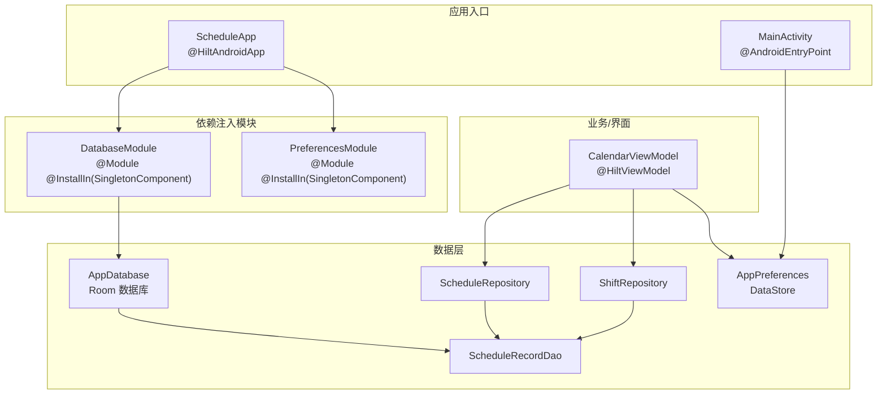
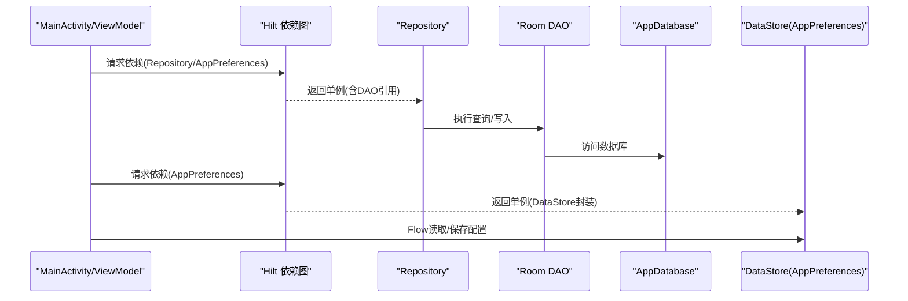
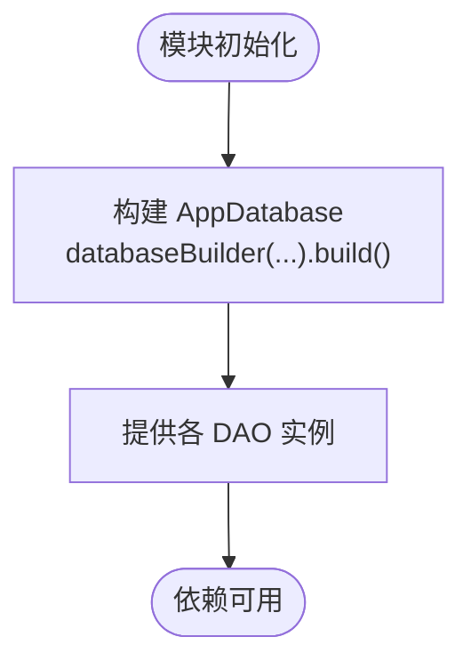
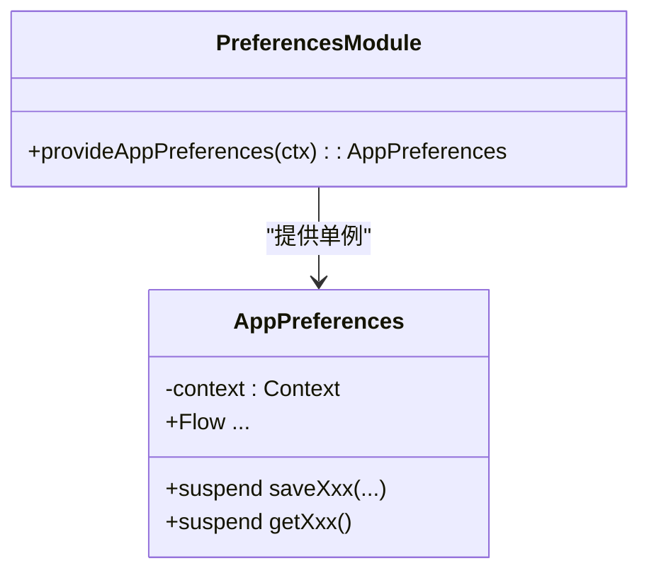
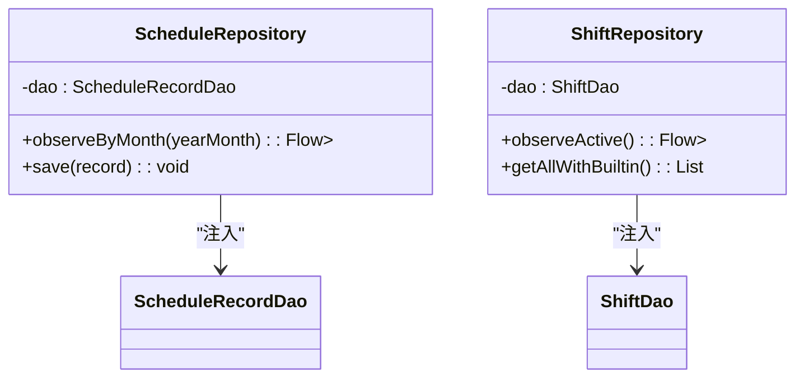
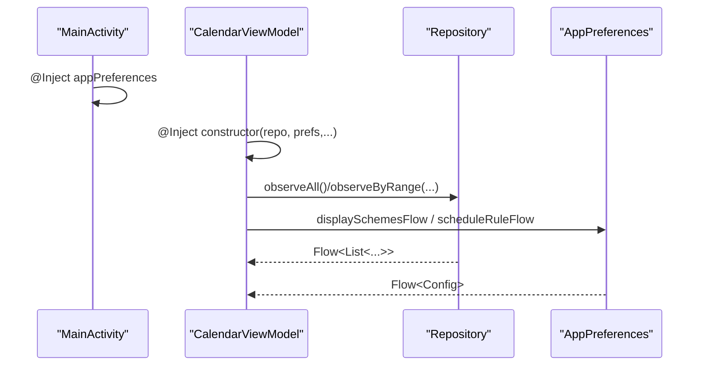
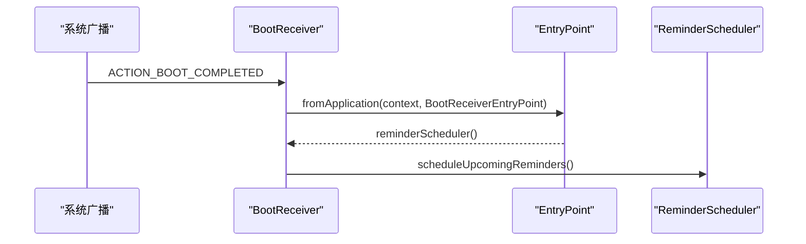
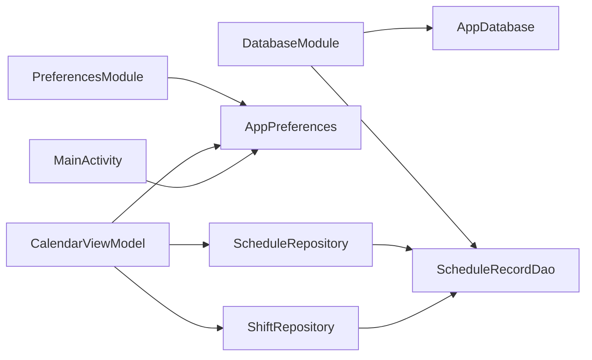

# 依赖注入配置

<cite>
**本文引用的文件**   
- [DatabaseModule.kt](file://app/src/main/java/com/schedulecalendar/app/di/DatabaseModule.kt)
- [PreferencesModule.kt](file://app/src/main/java/com/schedulecalendar/app/di/PreferencesModule.kt)
- [AppDatabase.kt](file://app/src/main/java/com/schedulecalendar/app/data/db/AppDatabase.kt)
- [ScheduleRecordDao.kt](file://app/src/main/java/com/schedulecalendar/app/data/db/dao/ScheduleRecordDao.kt)
- [AppPreferences.kt](file://app/src/main/java/com/schedulecalendar/app/data/prefs/AppPreferences.kt)
- [ScheduleRepository.kt](file://app/src/main/java/com/schedulecalendar/app/data/repository/ScheduleRepository.kt)
- [ShiftRepository.kt](file://app/src/main/java/com/schedulecalendar/app/data/repository/ShiftRepository.kt)
- [CalendarViewModel.kt](file://app/src/main/java/com/schedulecalendar/app/ui/calendar/CalendarViewModel.kt)
- [MainActivity.kt](file://app/src/main/java/com/schedulecalendar/app/MainActivity.kt)
- [BootReceiver.kt](file://app/src/main/java/com/schedulecalendar/app/reminder/BootReceiver.kt)
- [ScheduleApp.kt](file://app/src/main/java/com/schedulecalendar/app/ScheduleApp.kt)
- [build.gradle.kts](file://app/build.gradle.kts)
- [libs.versions.toml](file://gradle/libs.versions.toml)
</cite>

## 目录
1. [简介](#简介)
2. [项目结构](#项目结构)
3. [核心组件](#核心组件)
4. [架构总览](#架构总览)
5. [详细组件分析](#详细组件分析)
6. [依赖关系分析](#依赖关系分析)
7. [性能考量](#性能考量)
8. [故障排查指南](#故障排查指南)
9. [结论](#结论)
10. [附录](#附录)

## 简介
本文件面向使用 Hilt 的 Android 项目，系统性说明依赖注入的配置与使用方式，重点覆盖：
- DatabaseModule 中 Room 数据库实例的创建、DAO 注入与版本管理
- PreferencesModule 中 DataStore 的依赖注入方式
- 在各模块中使用 @Inject 进行依赖注入的模式与作用域管理（单例等）
- 具体使用示例与最佳实践，包括测试环境下的依赖替换思路
- 依赖关系图与常见问题排查指南

## 项目结构
本项目采用模块化组织，依赖注入相关代码集中在 di 包下，数据层通过 Repository + DAO + Room/DataStore 组合实现，UI 层通过 ViewModel 与 Activity 消费依赖。

图表来源 
- [ScheduleApp.kt:1-9](file://app/src/main/java/com/schedulecalendar/app/ScheduleApp.kt#L1-L9)
- [DatabaseModule.kt:19-34](file://app/src/main/java/com/schedulecalendar/app/di/DatabaseModule.kt#L19-L34)
- [PreferencesModule.kt:13-20](file://app/src/main/java/com/schedulecalendar/app/di/PreferencesModule.kt#L13-L20)
- [AppDatabase.kt:17-34](file://app/src/main/java/com/schedulecalendar/app/data/db/AppDatabase.kt#L17-L34)
- [ScheduleRecordDao.kt:8-39](file://app/src/main/java/com/schedulecalendar/app/data/db/dao/ScheduleRecordDao.kt#L8-L39)
- [ScheduleRepository.kt:13-39](file://app/src/main/java/com/schedulecalendar/app/data/repository/ScheduleRepository.kt#L13-L39)
- [ShiftRepository.kt:12-44](file://app/src/main/java/com/schedulecalendar/app/data/repository/ShiftRepository.kt#L12-L44)
- [CalendarViewModel.kt:118-129](file://app/src/main/java/com/schedulecalendar/app/ui/calendar/CalendarViewModel.kt#L118-L129)
- [MainActivity.kt:33-36](file://app/src/main/java/com/schedulecalendar/app/MainActivity.kt#L33-L36)

章节来源
- [build.gradle.kts:103-114](file://app/build.gradle.kts#L103-L114)
- [libs.versions.toml:48-59](file://gradle/libs.versions.toml#L48-L59)

## 核心组件
- Application 入口：通过 @HiltAndroidApp 启用 Hilt 并生成依赖图。
- DatabaseModule：提供 AppDatabase 单例与所有 DAO 实例。
- PreferencesModule：提供 AppPreferences（封装 DataStore）单例。
- Repository：以 @Singleton 暴露，内部持有 DAO，负责领域模型转换。
- ViewModel：通过 @HiltViewModel 与构造函数注入获取 Repository 与 AppPreferences。
- Activity：通过 @AndroidEntryPoint 与 @Inject 字段注入 AppPreferences。

章节来源
- [ScheduleApp.kt:7-8](file://app/src/main/java/com/schedulecalendar/app/ScheduleApp.kt#L7-L8)
- [DatabaseModule.kt:19-34](file://app/src/main/java/com/schedulecalendar/app/di/DatabaseModule.kt#L19-L34)
- [PreferencesModule.kt:13-20](file://app/src/main/java/com/schedulecalendar/app/di/PreferencesModule.kt#L13-L20)
- [ScheduleRepository.kt:13-16](file://app/src/main/java/com/schedulecalendar/app/data/repository/ScheduleRepository.kt#L13-L16)
- [ShiftRepository.kt:12-15](file://app/src/main/java/com/schedulecalendar/app/data/repository/ShiftRepository.kt#L12-L15)
- [CalendarViewModel.kt:118-129](file://app/src/main/java/com/schedulecalendar/app/ui/calendar/CalendarViewModel.kt#L118-L129)
- [MainActivity.kt:33-36](file://app/src/main/java/com/schedulecalendar/app/MainActivity.kt#L33-L36)

## 架构总览
下图展示从 UI 到数据层的依赖注入调用链，以及 Room 与 DataStore 的集成点。

图表来源 
- [CalendarViewModel.kt:118-129](file://app/src/main/java/com/schedulecalendar/app/ui/calendar/CalendarViewModel.kt#L118-L129)
- [ScheduleRepository.kt:13-39](file://app/src/main/java/com/schedulecalendar/app/data/repository/ScheduleRepository.kt#L13-L39)
- [AppDatabase.kt:17-34](file://app/src/main/java/com/schedulecalendar/app/data/db/AppDatabase.kt#L17-L34)
- [AppPreferences.kt:25-28](file://app/src/main/java/com/schedulecalendar/app/data/prefs/AppPreferences.kt#L25-L28)

## 详细组件分析

### DatabaseModule：Room 数据库依赖配置
- 作用域：@InstallIn(SingletonComponent::class)，保证 AppDatabase 为进程内单例。
- 数据库实例：通过 Room.databaseBuilder 构建，设置迁移策略（破坏性迁移），文件名固定。
- DAO 注入：每个 DAO 由 @Provides 方法从 AppDatabase 获取，供 Repository 注入。
- 版本管理：AppDatabase 声明 version=5，配合 schemas 导出便于迁移追踪；当前迁移策略为破坏性迁移。

图表来源 
- [DatabaseModule.kt:23-33](file://app/src/main/java/com/schedulecalendar/app/di/DatabaseModule.kt#L23-L33)
- [AppDatabase.kt:17-27](file://app/src/main/java/com/schedulecalendar/app/data/db/AppDatabase.kt#L17-L27)

章节来源
- [DatabaseModule.kt:19-34](file://app/src/main/java/com/schedulecalendar/app/di/DatabaseModule.kt#L19-L34)
- [AppDatabase.kt:17-34](file://app/src/main/java/com/schedulecalendar/app/data/db/AppDatabase.kt#L17-L34)

### PreferencesModule：DataStore 依赖注入
- 作用域：@InstallIn(SingletonComponent::class)，AppPreferences 为单例。
- 构造注入：AppPreferences 通过 @Inject 构造函数接收 ApplicationContext，内部使用 preferencesDataStore 扩展名创建 DataStore。
- 使用方式：在 Activity/ViewModel 中直接注入 AppPreferences，通过 Flow 或 suspend 函数读写配置。

图表来源 
- [PreferencesModule.kt:17-19](file://app/src/main/java/com/schedulecalendar/app/di/PreferencesModule.kt#L17-L19)
- [AppPreferences.kt:25-28](file://app/src/main/java/com/schedulecalendar/app/data/prefs/AppPreferences.kt#L25-L28)

章节来源
- [PreferencesModule.kt:13-20](file://app/src/main/java/com/schedulecalendar/app/di/PreferencesModule.kt#L13-L20)
- [AppPreferences.kt:25-66](file://app/src/main/java/com/schedulecalendar/app/data/prefs/AppPreferences.kt#L25-L66)

### Repository 与 DAO 的依赖注入
- Repository：@Singleton，通过构造函数注入 DAO，对外暴露 Flow/ suspend API，并在写操作后发出刷新信号。
- DAO：Room @Dao 接口，定义查询与变更方法，返回 Flow 或 List。

图表来源 
- [ScheduleRepository.kt:13-39](file://app/src/main/java/com/schedulecalendar/app/data/repository/ScheduleRepository.kt#L13-L39)
- [ShiftRepository.kt:12-44](file://app/src/main/java/com/schedulecalendar/app/data/repository/ShiftRepository.kt#L12-L44)
- [ScheduleRecordDao.kt:8-39](file://app/src/main/java/com/schedulecalendar/app/data/db/dao/ScheduleRecordDao.kt#L8-L39)

章节来源
- [ScheduleRepository.kt:13-39](file://app/src/main/java/com/schedulecalendar/app/data/repository/ScheduleRepository.kt#L13-L39)
- [ShiftRepository.kt:12-44](file://app/src/main/java/com/schedulecalendar/app/data/repository/ShiftRepository.kt#L12-L44)
- [ScheduleRecordDao.kt:8-39](file://app/src/main/java/com/schedulecalendar/app/data/db/dao/ScheduleRecordDao.kt#L8-L39)

### ViewModel 与 Activity 中的依赖注入
- ViewModel：@HiltViewModel，构造函数注入多个 Repository 与 AppPreferences，避免手动 new 对象。
- Activity：@AndroidEntryPoint，字段级 @Inject 注入 AppPreferences，用于权限与快捷方式等逻辑。

图表来源 
- [MainActivity.kt:33-36](file://app/src/main/java/com/schedulecalendar/app/MainActivity.kt#L33-L36)
- [CalendarViewModel.kt:118-129](file://app/src/main/java/com/schedulecalendar/app/ui/calendar/CalendarViewModel.kt#L118-L129)

章节来源
- [MainActivity.kt:33-36](file://app/src/main/java/com/schedulecalendar/app/MainActivity.kt#L33-L36)
- [CalendarViewModel.kt:118-129](file://app/src/main/java/com/schedulecalendar/app/ui/calendar/CalendarViewModel.kt#L118-L129)

### 非组件场景的依赖获取：EntryPoint
- BootReceiver 无法直接使用 @Inject，通过 @EntryPoint 与 EntryPointAccessors 获取 ReminderScheduler 单例，在开机广播中重新调度提醒。

图表来源 
- [BootReceiver.kt:23-44](file://app/src/main/java/com/schedulecalendar/app/reminder/BootReceiver.kt#L23-L44)

章节来源
- [BootReceiver.kt:23-44](file://app/src/main/java/com/schedulecalendar/app/reminder/BootReceiver.kt#L23-L44)

## 依赖关系分析
- 模块耦合：DatabaseModule 与 PreferencesModule 作为顶层提供者，被 Hilt 自动装配到 SingletonComponent。
- 数据层解耦：Repository 仅依赖 DAO，不感知 Room 细节；UI 仅依赖 Repository 与 AppPreferences。
- 作用域一致性：数据库与偏好存储均为单例，避免重复创建与资源泄漏。

图表来源 
- [DatabaseModule.kt:19-34](file://app/src/main/java/com/schedulecalendar/app/di/DatabaseModule.kt#L19-L34)
- [PreferencesModule.kt:13-20](file://app/src/main/java/com/schedulecalendar/app/di/PreferencesModule.kt#L13-L20)
- [AppDatabase.kt:17-34](file://app/src/main/java/com/schedulecalendar/app/data/db/AppDatabase.kt#L17-L34)
- [ScheduleRepository.kt:13-39](file://app/src/main/java/com/schedulecalendar/app/data/repository/ScheduleRepository.kt#L13-L39)
- [ShiftRepository.kt:12-44](file://app/src/main/java/com/schedulecalendar/app/data/repository/ShiftRepository.kt#L12-L44)
- [CalendarViewModel.kt:118-129](file://app/src/main/java/com/schedulecalendar/app/ui/calendar/CalendarViewModel.kt#L118-L129)
- [MainActivity.kt:33-36](file://app/src/main/java/com/schedulecalendar/app/MainActivity.kt#L33-L36)

章节来源
- [DatabaseModule.kt:19-34](file://app/src/main/java/com/schedulecalendar/app/di/DatabaseModule.kt#L19-L34)
- [PreferencesModule.kt:13-20](file://app/src/main/java/com/schedulecalendar/app/di/PreferencesModule.kt#L13-L20)
- [AppDatabase.kt:17-34](file://app/src/main/java/com/schedulecalendar/app/data/db/AppDatabase.kt#L17-L34)
- [ScheduleRepository.kt:13-39](file://app/src/main/java/com/schedulecalendar/app/data/repository/ScheduleRepository.kt#L13-L39)
- [ShiftRepository.kt:12-44](file://app/src/main/java/com/schedulecalendar/app/data/repository/ShiftRepository.kt#L12-L44)
- [CalendarViewModel.kt:118-129](file://app/src/main/java/com/schedulecalendar/app/ui/calendar/CalendarViewModel.kt#L118-L129)
- [MainActivity.kt:33-36](file://app/src/main/java/com/schedulecalendar/app/MainActivity.kt#L33-L36)

## 性能考量
- 单例作用域：AppDatabase 与 AppPreferences 均使用 @Singleton，避免频繁创建开销。
- Flow 响应式更新：Repository 与 AppPreferences 广泛使用 Flow，减少轮询与冗余计算。
- 延迟初始化：ViewModel 中非关键初始化使用延迟启动，降低首帧阻塞。
- 迁移策略：当前使用破坏性迁移，简化升级但会丢失历史数据；生产环境建议实现真实迁移路径。

[本节为通用指导，无需特定文件来源]

## 故障排查指南
- 未启用 Hilt：确保 Application 类标注 @HiltAndroidApp，并在 build.gradle 中引入 hilt-android 与 hilt-compiler（KSP）。
- 依赖缺失：检查 Module 是否安装到正确的 Component（如 SingletonComponent），并确保 @Provides/@Inject 注解正确。
- Room 版本不一致：确认 AppDatabase.version 与 schema 一致，必要时调整迁移策略。
- DataStore 读写异常：注意 Flow.first() 的正确用法，避免在 edit{} 中读取导致死锁。
- 非组件注入失败：在 BroadcastReceiver/Service 等非生命周期组件中，使用 EntryPointAccessors 获取依赖。

章节来源
- [build.gradle.kts:103-114](file://app/build.gradle.kts#L103-L114)
- [DatabaseModule.kt:19-34](file://app/src/main/java/com/schedulecalendar/app/di/DatabaseModule.kt#L19-L34)
- [PreferencesModule.kt:13-20](file://app/src/main/java/com/schedulecalendar/app/di/PreferencesModule.kt#L13-L20)
- [AppDatabase.kt:17-27](file://app/src/main/java/com/schedulecalendar/app/data/db/AppDatabase.kt#L17-L27)
- [AppPreferences.kt:109-111](file://app/src/main/java/com/schedulecalendar/app/data/prefs/AppPreferences.kt#L109-L111)
- [BootReceiver.kt:23-44](file://app/src/main/java/com/schedulecalendar/app/reminder/BootReceiver.kt#L23-L44)

## 结论
本项目通过 Hilt 实现了清晰的依赖注入体系：
- DatabaseModule 与 PreferencesModule 集中管理单例依赖
- Repository 与 DAO 解耦数据访问，ViewModel/Activity 通过构造函数或字段注入消费依赖
- 使用 Flow 实现响应式数据流，提升可维护性与性能
- 通过 EntryPoint 解决非组件场景的依赖获取问题

建议在后续迭代中完善 Room 的真实迁移策略，并补充测试模块以替换依赖（例如内存数据库与 Mock DataStore）。

[本节为总结，无需特定文件来源]

## 附录
- 构建与依赖版本：参考 build.gradle.kts 与 libs.versions.toml 中的 Hilt、Room、DataStore 依赖声明。
- 使用示例路径：
  - 数据库与 DAO：[AppDatabase.kt:17-34](file://app/src/main/java/com/schedulecalendar/app/data/db/AppDatabase.kt#L17-L34)、[ScheduleRecordDao.kt:8-39](file://app/src/main/java/com/schedulecalendar/app/data/db/dao/ScheduleRecordDao.kt#L8-L39)
  - 偏好存储：[AppPreferences.kt:25-66](file://app/src/main/java/com/schedulecalendar/app/data/prefs/AppPreferences.kt#L25-L66)
  - 仓库层：[ScheduleRepository.kt:13-39](file://app/src/main/java/com/schedulecalendar/app/data/repository/ScheduleRepository.kt#L13-L39)、[ShiftRepository.kt:12-44](file://app/src/main/java/com/schedulecalendar/app/data/repository/ShiftRepository.kt#L12-L44)
  - 视图层：[CalendarViewModel.kt:118-129](file://app/src/main/java/com/schedulecalendar/app/ui/calendar/CalendarViewModel.kt#L118-L129)、[MainActivity.kt:33-36](file://app/src/main/java/com/schedulecalendar/app/MainActivity.kt#L33-L36)
  - 非组件注入：[BootReceiver.kt:23-44](file://app/src/main/java/com/schedulecalendar/app/reminder/BootReceiver.kt#L23-L44)

章节来源
- [build.gradle.kts:103-114](file://app/build.gradle.kts#L103-L114)
- [libs.versions.toml:48-59](file://gradle/libs.versions.toml#L48-L59)