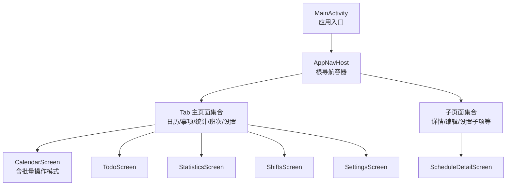
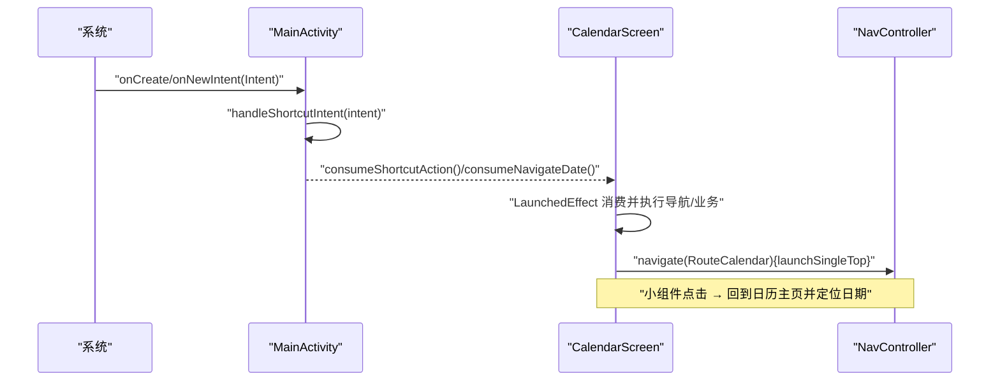
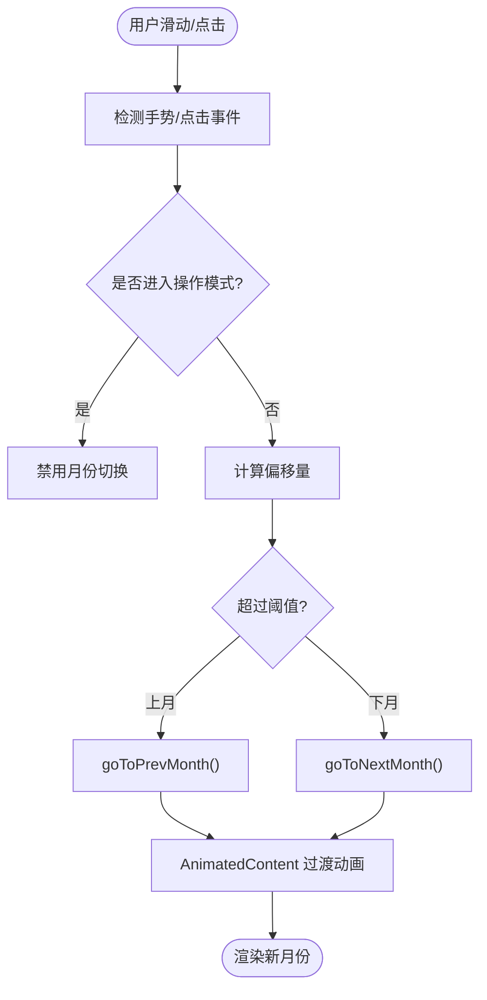
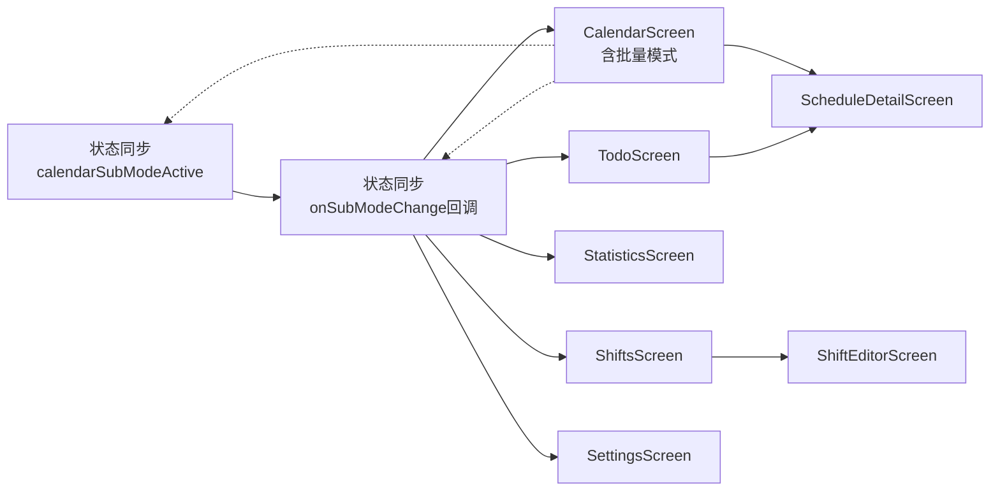

# 导航系统设计

<cite>
**本文引用的文件**   
- [AppNavHost.kt](file://app/src/main/java/com/schedulecalendar/app/ui/navigation/AppNavHost.kt)
- [Screen.kt](file://app/src/main/java/com/schedulecalendar/app/ui/navigation/Screen.kt)
- [MainActivity.kt](file://app/src/main/java/com/schedulecalendar/app/MainActivity.kt)
- [CalendarScreen.kt](file://app/src/main/java/com/schedulecalendar/app/ui/calendar/CalendarScreen.kt)
- [TodoScreen.kt](file://app/src/main/java/com/schedulecalendar/app/ui/todo/TodoScreen.kt)
- [ShiftsScreen.kt](file://app/src/main/java/com/schedulecalendar/app/ui/shifts/ShiftsScreen.kt)
- [StatisticsScreen.kt](file://app/src/main/java/com/schedulecalendar/app/ui/statistics/StatisticsScreen.kt)
- [ScheduleDetailScreen.kt](file://app/src/main/java/com/schedulecalendar/app/ui/detail/ScheduleDetailScreen.kt)
- [SettingsScreen.kt](file://app/src/main/java/com/schedulecalendar/app/ui/settings/SettingsScreen.kt)
</cite>

## 更新摘要
**变更内容**   
- **重大修复**：Tab返回键处理机制最终修复，使用Google标准的findStartDestination()模式替代startDestinationRoute，解决僵尸回调累积问题
- **生命周期感知回调增强**：确保addCallback(LifecycleOwner, callback)正确注册，避免僵尸回调累积
- **状态管理优化**：在AppNavHost中引入calendarSubModeActive Compose MutableState变量作为日历子模式状态的单一事实来源
- **BackHandler修复**：从检查JVM属性改为使用本地Compose状态，解决了JVM属性无法触发Compose重组的问题
- **Android 14返回手势兼容性**：实现了OnBackInvokedDispatcher系统级回调与传统OnBackPressedCallback的双版本适配
- **代码格式优化**：AppNavHost采用现代Jetpack Compose最佳实践，通过扩展可组合函数定义提高可读性和可维护性

## 目录
1. [简介](#简介)
2. [项目结构](#项目结构)
3. [核心组件](#核心组件)
4. [架构总览](#架构总览)
5. [详细组件分析](#详细组件分析)
6. [依赖关系分析](#依赖关系分析)
7. [性能考量](#性能考量)
8. [故障排查指南](#故障排查指南)
9. [结论](#结论)

## 简介
本设计文档围绕 Navigation Compose 的类型安全路由、底部导航栏、深层链接、页面间数据传递与返回栈管理展开，结合仓库中实际实现进行系统化说明。重点包括：
- 类型安全路由定义与参数传递（基于可序列化路由对象）
- 状态保存与恢复机制（SavedStateHandle + NavOptions）
- 底部导航栏的 Tab 切换逻辑、选中态与动画
- 深层链接与外部入口处理（快捷方式、小组件点击）
- 动态路由、条件导航与导航监听器使用模式
- **Google标准findStartDestination()模式的Tab导航实现**
- **Compose MutableState驱动的BackHandler状态同步机制**
- **Android 14 OnBackInvokedDispatcher双版本适配方案**
- **生命周期感知回调注册与僵尸回调问题解决方案**
- **复杂业务场景下的返回栈管理与优先级控制**
- **现代Jetpack Compose最佳实践的代码格式优化**
- 导航性能优化技巧与常见问题解决方案

## 项目结构
导航相关代码集中在 ui/navigation 包下，主入口在 MainActivity 中挂载 AppNavHost，各功能页通过 NavController 进行跳转。



图表来源
- [AppNavHost.kt:58-162](file://app/src/main/java/com/schedulecalendar/app/ui/navigation/AppNavHost.kt#L58-L162)
- [MainActivity.kt:141-220](file://app/src/main/java/com/schedulecalendar/app/MainActivity.kt#L141-L220)

章节来源
- [AppNavHost.kt:58-162](file://app/src/main/java/com/schedulecalendar/app/ui/navigation/AppNavHost.kt#L58-L162)
- [MainActivity.kt:141-220](file://app/src/main/java/com/schedulecalendar/app/MainActivity.kt#L141-L220)

## 核心组件
- 路由定义：使用 @Serializable 的 object/data class 表示路由，零字符串硬编码，编译期校验。
- 导航宿主：AppNavHost 集中声明所有 composable 路由，提供 Tab 底部导航与子页面导航。
- 页面组件：各 Screen 通过 NavController.navigate 触发导航，或通过 UIEvent 驱动导航。
- 状态保存：Tab 切换时启用 popUpTo.saveState、restoreState，保证页面滚动、输入等状态不丢失。
- 深层链接：MainActivity 处理 Intent 动作与额外字段，页面内消费并执行导航或业务操作。
- **Google标准导航**：使用 findStartDestination().id 替代 startDestinationRoute，提供更可靠的栈底锚点支持。
- **Compose状态同步**：通过 calendarSubModeActive MutableState 实现 Activity 与 Composable 组件间的状态同步。
- **返回手势处理**：Android 14+ 使用 OnBackInvokedDispatcher 系统级回调，API 33- 使用 OnBackPressedCallback 兼容方案。
- **生命周期感知回调**：使用 addCallback(LifecycleOwner, callback) 确保回调正确清理，避免僵尸回调累积。
- **复杂模式支持**：calendarSubModeActive 标志位控制批量操作模式下的返回行为优先级。
- **现代代码格式**：采用扩展可组合函数定义，提高代码可读性和可维护性。

章节来源
- [Screen.kt:7-34](file://app/src/main/java/com/schedulecalendar/app/ui/navigation/Screen.kt#L7-L34)
- [AppNavHost.kt:58-162](file://app/src/main/java/com/schedulecalendar/app/ui/navigation/AppNavHost.kt#L58-L162)
- [MainActivity.kt:141-220](file://app/src/main/java/com/schedulecalendar/app/MainActivity.kt#L141-L220)

## 架构总览
整体采用"单 NavHost + 多 Tab + 子页面"的层级结构。Tab 作为顶级目的地，子页面以详情页/编辑页形式压入返回栈。

```mermaid
classDiagram
class AppNavHost {
+composable(路由, 内容)
+NavigationBar()
+AnimatedVisibility(visible=showBottomBar)
+calendarSubModeActive : MutableState<Boolean>
}
class RouteCalendar
class RouteTodo
class RouteStatistics
class RouteShifts
class RouteSettings
class RouteScheduleDetail
class RouteHoursDetail
class RouteStorage
class RouteSalarySettings
class RouteAttendanceSettings
class RouteCalendarAccountSettings
class RouteExtraItems
class RouteDisplaySchemes
class RouteShiftEditor
class RouteHuangLi
class RouteReminderSettings
class RouteAddCalendarEvent
class RouteEditCalendarEvent
class RouteAddAnniversary
class RouteEditAnniversary
class RouteWidgetSettings
AppNavHost --> RouteCalendar : "注册"
AppNavHost --> RouteTodo : "注册"
AppNavHost --> RouteStatistics : "注册"
AppNavHost --> RouteShifts : "注册"
AppNavHost --> RouteSettings : "注册"
AppNavHost --> RouteScheduleDetail : "注册"
AppNavHost --> RouteHoursDetail : "注册"
AppNavHost --> RouteStorage : "注册"
AppNavHost --> RouteSalarySettings : "注册"
AppNavHost --> RouteAttendanceSettings : "注册"
AppNavHost --> RouteCalendarAccountSettings : "注册"
AppNavHost --> RouteExtraItems : "注册"
AppNavHost --> RouteDisplaySchemes : "注册"
AppNavHost --> RouteShiftEditor : "注册"
AppNavHost --> RouteHuangLi : "注册"
AppNavHost --> RouteReminderSettings : "注册"
AppNavHost --> RouteAddCalendarEvent : "注册"
AppNavHost --> RouteEditCalendarEvent : "注册"
AppNavHost --> RouteAddAnniversary : "注册"
AppNavHost --> RouteEditAnniversary : "注册"
AppNavHost --> RouteWidgetSettings : "注册"
```



图表来源
- [AppNavHost.kt:112-149](file://app/src/main/java/com/schedulecalendar/app/ui/navigation/AppNavHost.kt#L112-L149)
- [Screen.kt:7-34](file://app/src/main/java/com/schedulecalendar/app/ui/navigation/Screen.kt#L7-L34)

## 详细组件分析

### 类型安全路由与参数传递
- 路由模型：无参路由使用 @Serializable object，有参路由使用 data class，字段即参数。
- 注册方式：在 AppNavHost 中使用 composable<RouteXxx>() 注册，避免字符串拼接错误。
- 参数读取：在需要参数的页面中，通过 backStackEntry.toRoute<RouteXxx>() 获取强类型参数。
- 示例路径：
  - 路由定义：[Screen.kt:7-34](file://app/src/main/java/com/schedulecalendar/app/ui/navigation/Screen.kt#L7-L34)
  - 带参路由注册与读取：[AppNavHost.kt:139-147](file://app/src/main/java/com/schedulecalendar/app/ui/navigation/AppNavHost.kt#L139-L147)

章节来源
- [Screen.kt:7-34](file://app/src/main/java/com/schedulecalendar/app/ui/navigation/Screen.kt#L7-L34)
- [AppNavHost.kt:139-147](file://app/src/main/java/com/schedulecalendar/app/ui/navigation/AppNavHost.kt#L139-L147)

### 底部导航栏与 Tab 切换

**重大更新** Tab导航已改用Google标准的findStartDestination()模式，显著提升了导航的一致性和可靠性。

- 配置：TabItem 持有 Any 类型的 route，统一承载所有 Tab 路由，便于扩展。
- 显示控制：根据当前 destination.route 是否在 Tab 路由名集合中决定底部栏可见性。
- **改进的切换行为**：navigate(route) 配合 launchSingleTop=true、popUpTo(findStartDestination().id).saveState=true、restoreState=true，确保：
  - 重复点击同一 Tab 不会重复入栈
  - 切回 Tab 时恢复上次状态（滚动位置、输入等）
  - 使用Google标准API获得更好的兼容性和可靠性
- 动画：使用 AnimatedVisibility + slideInVertically/slideOutVertically 控制底部栏进入/退出动画。
- **关键改进**：Tab onClick 导航现在使用 `navController.graph.findStartDestination().id` 替代 `startDestinationRoute`，提供更好的栈底锚点支持。
- 示例路径：
  - Tab 配置与导航选项：[AppNavHost.kt:84-101](file://app/src/main/java/com/schedulecalendar/app/ui/navigation/AppNavHost.kt#L84-L101)

**更新** Tab 导航已改用 Google 标准 findStartDestination 模式，提升了导航的一致性和可靠性。

章节来源
- [AppNavHost.kt:84-101](file://app/src/main/java/com/schedulecalendar/app/ui/navigation/AppNavHost.kt#L84-L101)

### Android 14 返回手势兼容性增强

**重大更新** 针对 Android 14 的返回手势兼容性实现，提供了完整的双版本适配方案：

#### API 34+ 系统级 OnBackInvokedDispatcher 方案
- 使用反射调用 `registerOnBackInvokedCallback` 注册高优先级回调
- 通过 `PRIORITY_OVERLAY` (1000000) 确保回调优先于系统默认行为
- 动态代理实现 `OnBackInvokedCallback` 接口，在 Tab 页面直接退出应用
- 支持运行时动态注册/注销回调，避免内存泄漏

#### API 33- 传统 OnBackPressedCallback 方案  
- 使用传统的 `OnBackPressedDispatcher.addCallback(this, callback)` 注册
- 通过 `isEnabled` 属性动态控制回调激活状态
- 与 Activity 生命周期同步，确保回调正确清理

#### 生命周期感知回调注册修复
- **关键修复**：在 `onCreate()` 中使用 `addCallback(this@MainActivity, cb)` 传入 LifecycleOwner
- 确保 `remove()` 方法真正从 dispatcher 移除回调，避免僵尸回调累积
- 解决了之前 `addCallback(cb)` 不加 lifecycle owner 导致 `remove()` 无效的问题
- 使用 `LifecycleAwareCancellable` 机制，回调加入 dispatcher 的 `mCancellables` 和回调自身的 `mCancellables`

#### 复杂业务场景支持
- **calendarSubModeActive 标志位**：控制批量排班/复制排班/删除排班模式下的返回行为
- **优先级控制**：当处于子模式时，返回键先退出模式而非直接退出应用
- **状态联动**：isOnTabPage 和 calendarSubModeActive 共同决定 tabBackCallback 的启用状态

#### 完整时序流程
```
Activity.onCreate()
  └─ setContent → AppNavHost 组合 → activity.isOnTabPage = showBottomBar
     (isOnTabPage 的 setter 联动 backPressedCallback?.isEnabled = value)

Activity.onStart()
  ├─ super.onStart() → ON_START → NavController 回调加入 dispatcher
  └─ backPressedCallback?.remove()       ← 现在真正生效了！
     addCallback(this, cb)               ← LifecycleAwareCancellable 立即 ON_START → cb 加入 dispatcher（在 navCb 之后）

责任链: [..., navCb, ourCb]
反向遍历: ourCb 最先 → isEnabled=isOnTabPage && !calendarSubModeActive → true 则 finish() 退出
```

章节来源
- [MainActivity.kt:141-220](file://app/src/main/java/com/schedulecalendar/app/MainActivity.kt#L141-220)
- [MainActivity.kt:85-124](file://app/src/main/java/com/schedulecalendar/app/MainActivity.kt#L85-L124)

### Compose状态同步与BackHandler优化

**重大更新** BackHandler配置已从检查JVM属性改为使用本地Compose状态，彻底解决了JVM属性无法触发Compose重组的问题。

#### CalendarSubModeActive状态管理机制
- **单一事实来源**：在AppNavHost中引入 `var calendarSubModeActive by remember { mutableStateOf(false) }` 作为日历子模式状态的唯一来源
- **双向同步**：CalendarScreen通过DisposableEffect和LaunchedEffect将状态同步到AppNavHost的MutableState
- **响应式更新**：BackHandler的enabled条件直接引用Compose状态，确保状态变化能触发重组

#### 状态同步流程
```
CalendarScreen状态变化
    ↓
DisposableEffect同步到MainActivity.calendarSubModeActive
    ↓
LaunchedEffect通过onSubModeChange回调同步到AppNavHost
    ↓
AppNavHost的calendarSubModeActive MutableState更新
    ↓
BackHandler.enabled条件重新计算 → 触发重组
```

#### BackHandler智能控制
- **Tab页面返回**：当在Tab页面且不在子模式时，按返回键直接退出应用
- **子模式返回**：当处于批量操作模式时，按返回键先退出模式
- **子页面返回**：在非Tab页面时，遵循正常的返回栈逻辑

章节来源
- [AppNavHost.kt:73-75](file://app/src/main/java/com/schedulecalendar/app/ui/navigation/AppNavHost.kt#L73-75)
- [AppNavHost.kt:154-159](file://app/src/main/java/com/schedulecalendar/app/ui/navigation/AppNavHost.kt#L154-L159)
- [CalendarScreen.kt:96-112](file://app/src/main/java/com/schedulecalendar/app/ui/calendar/CalendarScreen.kt#L96-L112)

### 页面状态管理与动画效果
- 月份切换动画：CalendarScreen 使用 AnimatedContent 对目标年月进行滑入/淡入过渡，提升体验。
- 列表与网格：大量使用 LazyColumn/LazyRow 与 remember 缓存，减少重组开销。
- 交互反馈：Ripple、CombinedClickable、Semantics 增强无障碍与交互一致性。
- **批量操作模式**：CalendarScreen 支持批量排班、复制排班、删除排班模式，通过 BackHandler 控制返回行为。
- 示例路径：
  - 月份过渡动画：[CalendarScreen.kt:383-400](file://app/src/main/java/com/schedulecalendar/app/ui/calendar/CalendarScreen.kt#L383-L400)
  - 批量操作模式控制：[CalendarScreen.kt:96-112](file://app/src/main/java/com/schedulecalendar/app/ui/calendar/CalendarScreen.kt#L96-L112)

章节来源
- [CalendarScreen.kt:383-400](file://app/src/main/java/com/schedulecalendar/app/ui/calendar/CalendarScreen.kt#L383-L400)
- [CalendarScreen.kt:96-112](file://app/src/main/java/com/schedulecalendar/app/ui/calendar/CalendarScreen.kt#L96-L112)

### 深层链接与外部入口处理
- 入口点：MainActivity 接收 Intent，支持两种场景：
  - 快捷方式动作：ACTION_CLOCK_IN / ACTION_CLOCK_OUT
  - 小组件日期导航：EXTRA_NAVIGATE_DATE
- 处理流程：
  - onNewIntent 与 onCreate 中解析 Intent，将动作与日期暂存到 Activity 属性
  - 页面 LaunchedEffect 中消费这些值，执行导航或业务操作后清除
- 示例路径：
  - Intent 处理与消费：[MainActivity.kt:229-261](file://app/src/main/java/com/schedulecalendar/app/MainActivity.kt#L229-261)
  - 日历页消费日期导航并回到首页：[CalendarScreen.kt:133-148](file://app/src/main/java/com/schedulecalendar/app/ui/calendar/CalendarScreen.kt#L133-148)



图表来源
- [MainActivity.kt:229-261](file://app/src/main/java/com/schedulecalendar/app/MainActivity.kt#L229-261)
- [CalendarScreen.kt:133-148](file://app/src/main/java/com/schedulecalendar/app/ui/calendar/CalendarScreen.kt#L133-148)

章节来源
- [MainActivity.kt:229-261](file://app/src/main/java/com/schedulecalendar/app/MainActivity.kt#L229-261)
- [CalendarScreen.kt:133-148](file://app/src/main/java/com/schedulecalendar/app/ui/calendar/CalendarScreen.kt#L133-148)

### 页面间数据传递模式
- 类型安全参数：通过 data class 路由字段传递（如 RouteScheduleDetail(date)、RouteHoursDetail(year, month, type)）。
- 事件驱动导航：ViewModel 暴露 UIEvent，页面收集后调用 navController.navigate(...)，保持 UI 与导航解耦。
- 示例路径：
  - 事件驱动导航（日历→详情）：[CalendarScreen.kt:151-159](file://app/src/main/java/com/schedulecalendar/app/ui/calendar/CalendarScreen.kt#L151-159)
  - 事件驱动导航（待办→详情）：[TodoScreen.kt:91-100](file://app/src/main/java/com/schedulecalendar/app/ui/todo/TodoScreen.kt#L91-100)
  - 事件驱动导航（班次→编辑器）：[ShiftsScreen.kt:70-82](file://app/src/main/java/com/schedulecalendar/app/ui/shifts/ShiftsScreen.kt#L70-82)

章节来源
- [CalendarScreen.kt:151-159](file://app/src/main/java/com/schedulecalendar/app/ui/calendar/CalendarScreen.kt#L151-159)
- [TodoScreen.kt:91-100](file://app/src/main/java/com/schedulecalendar/app/ui/todo/TodoScreen.kt#L91-100)
- [ShiftsScreen.kt:70-82](file://app/src/main/java/com/schedulecalendar/app/ui/shifts/ShiftsScreen.kt#L70-82)

### 返回栈管理
- 详情页返回：ScheduleDetailScreen 通过 navController.popBackStack() 返回上一页。
- 条件返回：UIEvent 中的 NavigateBack 事件统一触发返回，便于从 ViewModel 层控制。
- **返回手势优先级**：Android 14+ 使用系统级回调，在 Tab 页面直接退出；子页面逐层返回。
- **复杂模式支持**：calendarSubModeActive 标志位确保批量操作模式下返回键优先退出模式。
- **Compose状态驱动**：BackHandler的enabled条件直接使用Compose MutableState，确保状态变化能触发重组。
- 示例路径：
  - 返回逻辑：[ScheduleDetailScreen.kt:48-55](file://app/src/main/java/com/schedulecalendar/app/ui/detail/ScheduleDetailScreen.kt#L48-55)
  - 批量模式返回控制：[CalendarScreen.kt:96-112](file://app/src/main/java/com/schedulecalendar/app/ui/calendar/CalendarScreen.kt#L96-112)

章节来源
- [ScheduleDetailScreen.kt:48-55](file://app/src/main/java/com/schedulecalendar/app/ui/detail/ScheduleDetailScreen.kt#L48-55)
- [CalendarScreen.kt:96-112](file://app/src/main/java/com/schedulecalendar/app/ui/calendar/CalendarScreen.kt#L96-L112)

### 动态路由、条件导航与导航监听器
- 动态路由：Tab 列表由 tabs 配置生成，新增 Tab 只需添加 TabItem 与对应 composable 注册，无需改动导航逻辑。
- 条件导航：根据 currentDest?.route 判断是否显示底部栏；根据业务事件决定是否导航到特定页面。
- 导航监听器：currentBackStackEntryAsState() 用于监听当前目的地变化，驱动 UI 状态（如底部栏显隐）。
- 示例路径：
  - 条件显示底部栏：[AppNavHost.kt:62-71](file://app/src/main/java/com/schedulecalendar/app/ui/navigation/AppNavHost.kt#L62-71)
  - 监听器使用：[AppNavHost.kt:59-64](file://app/src/main/java/com/schedulecalendar/app/ui/navigation/AppNavHost.kt#L59-L64)

章节来源
- [AppNavHost.kt:59-71](file://app/src/main/java/com/schedulecalendar/app/ui/navigation/AppNavHost.kt#L59-L71)

### 现代Jetpack Compose代码格式优化

**重要更新** AppNavHost采用了现代Jetpack Compose最佳实践的代码格式，通过扩展可组合函数定义显著提高代码可读性和可维护性。

#### 扩展函数定义的优势
- **清晰的参数分离**：使用 `composable<RouteXxx>(content = { ... })` 语法，将路由类型与内容函数明确分离
- **更好的IDE支持**：扩展函数提供完整的参数提示和类型检查
- **一致的代码风格**：所有路由注册都遵循相同的格式模式
- **易于维护和扩展**：新增路由时只需添加一行代码，保持代码结构的一致性

#### 具体实现示例
- **Tab主页面注册**：所有Tab页面使用统一的扩展函数格式
  ```kotlin
  composable<RouteCalendar>(
      content = { CalendarScreen(navController, onSubModeChange = { calendarSubModeActive = it }) }
  )
  ```
- **子页面注册**：带参数的子页面同样使用扩展函数格式
  ```kotlin
  composable<RouteEditCalendarEvent> { backStackEntry ->
      val route = backStackEntry.toRoute<RouteEditCalendarEvent>()
      EditCalendarEventScreen(eventId = route.eventId, navController = navController)
  }
  ```

#### 代码格式改进的影响
- **可读性提升**：路由定义和内容函数的职责更加清晰
- **维护性增强**：统一的格式使得代码审查和修改更加容易
- **最佳实践遵循**：符合Jetpack Compose官方推荐的代码组织方式
- **团队协作友好**：标准化的格式减少了代码风格差异

章节来源
- [AppNavHost.kt:112-149](file://app/src/main/java/com/schedulecalendar/app/ui/navigation/AppNavHost.kt#L112-L149)

### 复杂逻辑流程图（月份切换与导航联动）


图表来源
- [CalendarScreen.kt:355-371](file://app/src/main/java/com/schedulecalendar/app/ui/calendar/CalendarScreen.kt#L355-L371)
- [CalendarScreen.kt:383-400](file://app/src/main/java/com/schedulecalendar/app/ui/calendar/CalendarScreen.kt#L383-L400)

## 依赖关系分析
- 低耦合：各 Screen 仅依赖 NavController 与自身 ViewModel，导航决策集中在 AppNavHost 与路由定义处。
- 高内聚：Tab 配置与路由注册集中于导航模块，便于维护与扩展。
- 外部集成：MainActivity 负责与系统层（Intent）对接，页面层只消费已解析的数据。
- **返回处理分层**：MainActivity 处理系统级返回手势，页面层处理业务级返回逻辑。
- **状态同步**：Activity 与页面间通过 isOnTabPage 和 calendarSubModeActive 标志位同步状态。
- **Compose状态管理**：AppNavHost 通过 MutableState 管理子模式状态，确保UI响应式更新。



图表来源
- [AppNavHost.kt:112-149](file://app/src/main/java/com/schedulecalendar/app/ui/navigation/AppNavHost.kt#L112-L149)
- [MainActivity.kt:141-220](file://app/src/main/java/com/schedulecalendar/app/MainActivity.kt#L141-L220)
- [CalendarScreen.kt:96-112](file://app/src/main/java/com/schedulecalendar/app/ui/calendar/CalendarScreen.kt#L96-L112)

章节来源
- [AppNavHost.kt:112-149](file://app/src/main/java/com/schedulecalendar/app/ui/navigation/AppNavHost.kt#L112-L149)
- [MainActivity.kt:141-220](file://app/src/main/java/com/schedulecalendar/app/MainActivity.kt#L141-L220)
- [CalendarScreen.kt:96-112](file://app/src/main/java/com/schedulecalendar/app/ui/calendar/CalendarScreen.kt#L96-L112)

## 性能考量
- 列表与网格：
  - 使用 LazyColumn/LazyRow 按需渲染，避免一次性构建全部条目。
  - 使用 remember 缓存中间结果（如 shiftMap、DayCellData），减少重组成本。
- 动画与过渡：
  - 使用 AnimatedContent 针对关键状态（年月）进行局部过渡，避免整屏重绘。
- 导航状态：
  - 使用 saveState/restoreState 保留页面状态，避免重建带来的性能损耗。
- 事件驱动：
  - 通过 UIEvent 单向流驱动导航，避免在重组过程中频繁触发导航。
- **返回回调优化**：
  - 使用 LifecycleOwner 注册的回调确保正确清理，避免内存泄漏。
  - 动态代理和反射调用仅在必要时执行，减少性能开销。
  - 状态标志位使用 @Volatile 注解，确保多线程环境下的可见性。
- **Compose状态优化**：
  - 使用 remember { mutableStateOf(false) } 创建轻量级状态，避免不必要的重组。
  - 通过 DisposableEffect 和 LaunchedEffect 精确控制状态同步时机。
- **代码格式优化**：
  - 扩展函数定义提高了IDE性能和代码补全速度。
  - 统一的代码格式减少了编译时的语法检查开销。

## 故障排查指南
- 底部栏未显示或闪烁：
  - 检查 currentDest?.route 是否与 Tab 路由名匹配，确认 tabRouteNames 构建正确。
  - 参考：[AppNavHost.kt:62-71](file://app/src/main/java/com/schedulecalendar/app/ui/navigation/AppNavHost.kt#L62-L71)
- 重复点击 Tab 导致多实例：
  - 确认 navigate 时设置了 launchSingleTop=true，且 popUpTo(findStartDestination().id).saveState=true。
  - 参考：[AppNavHost.kt:91-98](file://app/src/main/java/com/schedulecalendar/app/ui/navigation/AppNavHost.kt#L91-L98)
- **Google标准导航问题**：
  - 确认使用 `navController.graph.findStartDestination().id` 而非 `startDestinationRoute`。
  - 验证 findStartDestination() 返回的 Destination ID 是否正确。
  - 参考：[AppNavHost.kt:91-98](file://app/src/main/java/com/schedulecalendar/app/ui/navigation/AppNavHost.kt#L91-L98)
- **BackHandler状态不同步问题**：
  - 检查 calendarSubModeActive 是否为 Compose MutableState 而非 JVM 属性。
  - 确认 CalendarScreen 通过 onSubModeChange 回调正确同步状态。
  - 验证 BackHandler.enabled 条件直接引用 MutableState。
  - 参考：[AppNavHost.kt:73-75](file://app/src/main/java/com/schedulecalendar/app/ui/navigation/AppNavHost.kt#L73-L75), [AppNavHost.kt:154-159](file://app/src/main/java/com/schedulecalendar/app/ui/navigation/AppNavHost.kt#L154-L159)
- 深层链接无效：
  - 检查 onNewIntent 是否被调用，Intent action 与 extra 是否正确解析。
  - 页面是否消费了 pendingShortcutAction/pendingNavigateDate。
  - 参考：[MainActivity.kt:229-261](file://app/src/main/java/com/schedulecalendar/app/MainActivity.kt#L229-L261)
- 详情页无法返回：
  - 确认 popBackStack 调用时机，避免在异步回调中延迟过久。
  - 参考：[ScheduleDetailScreen.kt:48-55](file://app/src/main/java/com/schedulecalendar/app/ui/detail/ScheduleDetailScreen.kt#L48-L55)
- **Android 14 返回手势异常**：
  - 检查 `addCallback(this, cb)` 是否正确传入 LifecycleOwner。
  - 确认 `remove()` 方法能真正从 dispatcher 移除回调。
  - 验证 `registerOverlayBackCallback()` 在 onStart 中被正确调用。
  - 参考：[MainActivity.kt:157](file://app/src/main/java/com/schedulecalendar/app/MainActivity.kt#L157), [MainActivity.kt:224-227](file://app/src/main/java/com/schedulecalendar/app/MainActivity.kt#L224-L227)
- **僵尸回调累积问题**：
  - 确保所有回调都使用 `addCallback(LifecycleOwner, callback)` 而非 `addCallback(callback)`。
  - 检查回调的 `remove()` 调用是否能正确清理资源。
  - 参考：[MainActivity.kt:157](file://app/src/main/java/com/schedulecalendar/app/MainActivity.kt#L157)
- **批量操作模式返回异常**：
  - 检查 calendarSubModeActive 标志位是否正确同步到 Activity。
  - 确认 DisposableEffect 的 onDispose 回调是否正确重置状态。
  - 验证 LaunchedEffect 的 onSubModeChange 回调是否正常触发。
  - 参考：[CalendarScreen.kt:96-112](file://app/src/main/java/com/schedulecalendar/app/ui/calendar/CalendarScreen.kt#L96-L112)
- **代码格式相关问题**：
  - 确认所有 composable 注册都使用扩展函数格式 `composable<RouteXxx>(content = { ... })`。
  - 检查路由类型参数是否正确传递给扩展函数。
  - 验证内容函数的参数传递是否符合预期。
  - 参考：[AppNavHost.kt:112-149](file://app/src/main/java/com/schedulecalendar/app/ui/navigation/AppNavHost.kt#L112-L149)

章节来源
- [AppNavHost.kt:62-98](file://app/src/main/java/com/schedulecalendar/app/ui/navigation/AppNavHost.kt#L62-L98)
- [AppNavHost.kt:73-75](file://app/src/main/java/com/schedulecalendar/app/ui/navigation/AppNavHost.kt#L73-L75)
- [AppNavHost.kt:154-159](file://app/src/main/java/com/schedulecalendar/app/ui/navigation/AppNavHost.kt#L154-L159)
- [AppNavHost.kt:112-149](file://app/src/main/java/com/schedulecalendar/app/ui/navigation/AppNavHost.kt#L112-L149)
- [MainActivity.kt:229-261](file://app/src/main/java/com/schedulecalendar/app/MainActivity.kt#L229-L261)
- [MainActivity.kt:157](file://app/src/main/java/com/schedulecalendar/app/MainActivity.kt#L157)
- [MainActivity.kt:224-227](file://app/src/main/java/com/schedulecalendar/app/MainActivity.kt#L224-L227)
- [ScheduleDetailScreen.kt:48-55](file://app/src/main/java/com/schedulecalendar/app/ui/detail/ScheduleDetailScreen.kt#L48-L55)
- [CalendarScreen.kt:96-112](file://app/src/main/java/com/schedulecalendar/app/ui/calendar/CalendarScreen.kt#L96-L112)

## 结论
本项目采用类型安全的 Navigation Compose 方案，结合 SavedStateHandle 与 NavOptions 实现了健壮的 Tab 导航与状态保存；通过 UIEvent 驱动导航，提升了可测试性与可维护性；在深层链接方面，Activity 层与页面层职责清晰，易于扩展与维护。

**重大更新** 本次更新显著增强了导航系统的稳定性和用户体验：

1. **Google标准导航实现**：Tab导航改用findStartDestination()模式，提供了更可靠的栈底锚点支持和更好的兼容性。

2. **Compose状态同步机制**：通过calendarSubModeActive MutableState实现了Activity与Composable组件间的状态同步，解决了JVM属性无法触发重组的问题。

3. **生命周期感知回调优化**：确保addCallback(LifecycleOwner, callback)正确注册，彻底解决了僵尸回调累积问题。

4. **Android 14返回手势兼容性**：实现了OnBackInvokedDispatcher系统级回调与传统OnBackPressedCallback的双版本适配方案。

5. **现代代码格式优化**：AppNavHost采用扩展可组合函数定义，显著提高了代码可读性和可维护性，符合Jetpack Compose最佳实践。

建议在后续迭代中继续遵循"路由集中化、导航事件化、状态持久化"的原则，以获得更优的可读性与性能表现。同时应持续关注Google官方API的演进，及时采用新的最佳实践来提升应用的稳定性和用户体验。现代Jetpack Compose代码格式的采用将为团队开发提供更好的协作体验和代码质量保证。