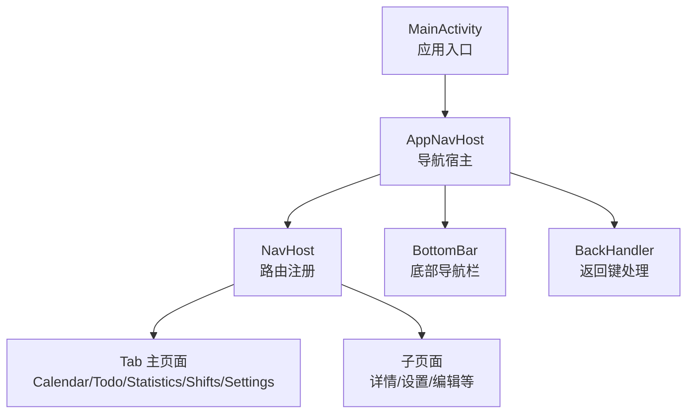
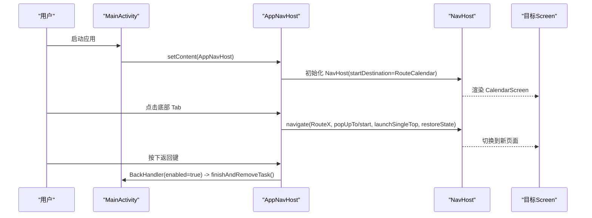
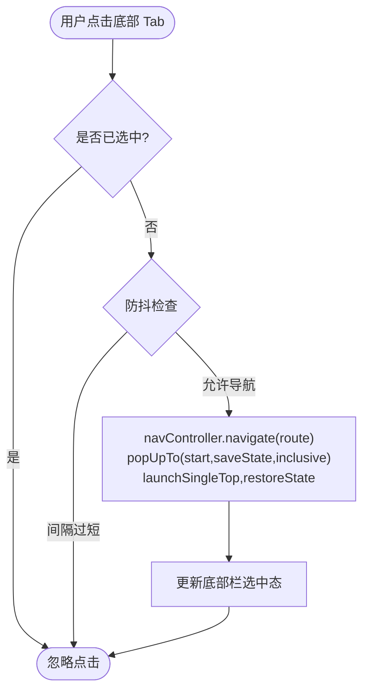
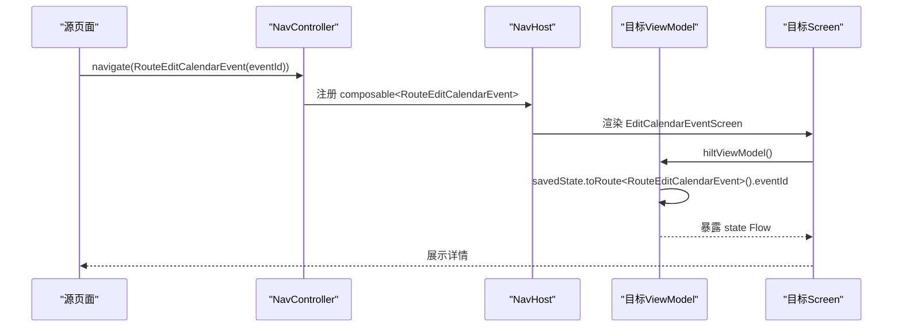
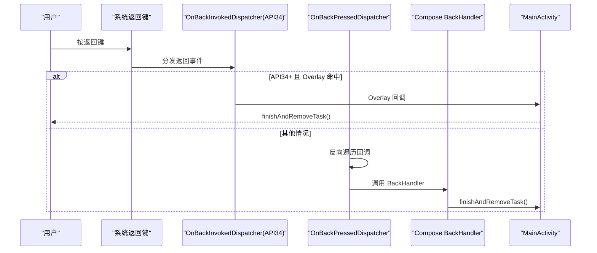
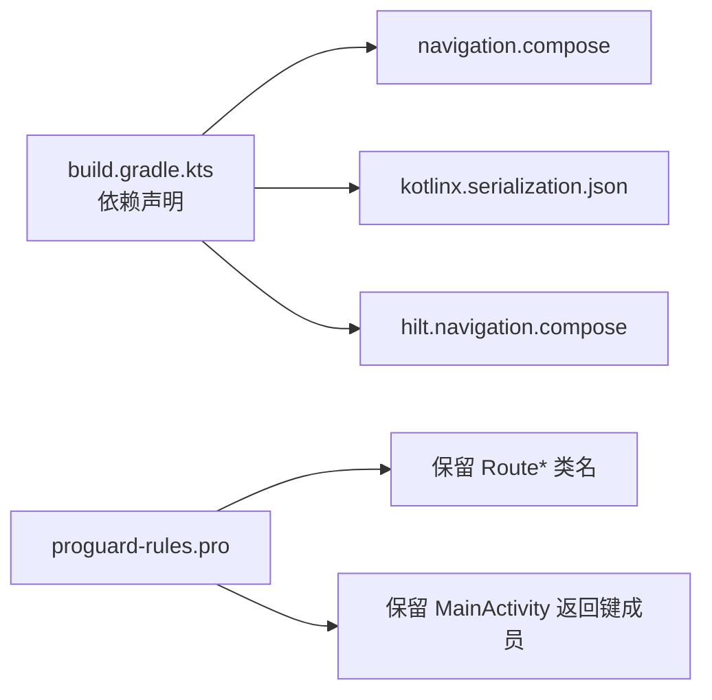
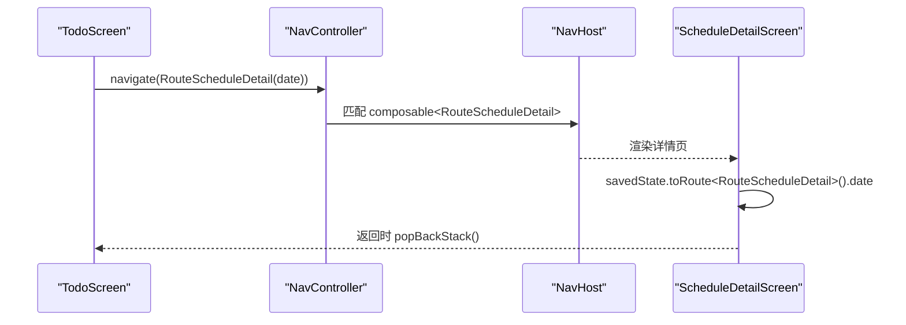

# 导航系统设计

<cite>
**本文引用的文件**   
- [AppNavHost.kt](file://app/src/main/java/com/schedulecalendar/app/ui/navigation/AppNavHost.kt)
- [Screen.kt](file://app/src/main/java/com/schedulecalendar/app/ui/navigation/Screen.kt)
- [MainActivity.kt](file://app/src/main/java/com/schedulecalendar/app/MainActivity.kt)
- [TodoScreen.kt](file://app/src/main/java/com/schedulecalendar/app/ui/todo/TodoScreen.kt)
- [HoursScreen.kt](file://app/src/main/java/com/schedulecalendar/app/ui/hours/HoursScreen.kt)
- [ScheduleDetailScreen.kt](file://app/src/main/java/com/schedulecalendar/app/ui/detail/ScheduleDetailScreen.kt)
- [DetailViewModels.kt](file://app/src/main/java/com/schedulecalendar/app/ui/detail/DetailViewModels.kt)
- [build.gradle.kts](file://app/build.gradle.kts)
- [proguard-rules.pro](file://app/proguard-rules.pro)
</cite>

## 目录
1. [简介](#简介)
2. [项目结构](#项目结构)
3. [核心组件](#核心组件)
4. [架构总览](#架构总览)
5. [详细组件分析](#详细组件分析)
6. [依赖关系分析](#依赖关系分析)
7. [性能考虑](#性能考虑)
8. [故障排查指南](#故障排查指南)
9. [结论](#结论)
10. [附录：导航流程图与示例](#附录导航流程图与示例)

## 简介
本文件面向使用 Jetpack Compose Navigation 的开发者，系统化梳理本项目中基于 Navigation Component 的导航体系。重点包括：
- AppNavHost 底部标签页（Tab）导航的实现与 TabItem 配置、路由定义、页面切换逻辑
- 类型安全路由设计模式：Route 类定义、参数传递与状态保存机制
- BackHandler 自定义返回键处理逻辑（含 API 34+ 系统级返回拦截）
- 页面间数据传递方式与状态管理策略
- 导航流程图与最佳实践建议

## 项目结构
导航相关代码集中在 ui/navigation 包下，配合 MainActivity 作为入口，各业务 Screen 通过 NavController 进行跳转。关键文件如下：
- AppNavHost.kt：导航宿主、底部导航栏、BackHandler、TabItem 配置与 NavHost 路由注册
- Screen.kt：所有 Route 定义（无参 object / 有参 data class），用于类型安全路由
- MainActivity.kt：应用入口、返回键回调、Activity 级状态同步
- 各业务 Screen：通过 navController.navigate(...) 触发导航，或在 ViewModel 中使用 SavedStateHandle.toRoute<T>() 读取参数

图表来源
- [AppNavHost.kt:57-171](file://app/src/main/java/com/schedulecalendar/app/ui/navigation/AppNavHost.kt#L57-L171)
- [Screen.kt:1-34](file://app/src/main/java/com/schedulecalendar/app/ui/navigation/Screen.kt#L1-L34)
- [MainActivity.kt:141-220](file://app/src/main/java/com/schedulecalendar/app/MainActivity.kt#L141-L220)

章节来源
- [AppNavHost.kt:1-172](file://app/src/main/java/com/schedulecalendar/app/ui/navigation/AppNavHost.kt#L1-L172)
- [Screen.kt:1-34](file://app/src/main/java/com/schedulecalendar/app/ui/navigation/Screen.kt#L1-L34)
- [MainActivity.kt:1-322](file://app/src/main/java/com/schedulecalendar/app/MainActivity.kt#L1-L322)

## 核心组件
- 类型安全路由定义（Screen.kt）
  - 无参主页面使用 @Serializable object 声明，如 RouteCalendar、RouteTodo、RouteStatistics、RouteShifts、RouteSettings
  - 带参子页面使用 @Serializable data class 声明，如 RouteScheduleDetail(date)、RouteHoursDetail(year, month, type)、RouteEditCalendarEvent(eventId) 等
- 导航宿主与底部导航（AppNavHost.kt）
  - TabItem(route, label, icon) 统一描述底部 Tab
  - tabs 列表集中配置 Tab 项
  - Scaffold + NavigationBar 实现底部导航，AnimatedVisibility 控制显示/隐藏
  - NavHost 注册所有 composable<RouteX>，支持类型安全导航
- Activity 返回键与状态同步（MainActivity.kt）
  - isOnTabPage、calendarSubModeActive 两个布尔状态在 Activity 侧维护
  - OnBackPressedDispatcher 回调与 API 34+ OnBackInvokedDispatcher Overlay 回调协同工作
  - setContent 中注入 AppNavHost，保证 UI 与返回键行为一致

章节来源
- [Screen.kt:1-34](file://app/src/main/java/com/schedulecalendar/app/ui/navigation/Screen.kt#L1-L34)
- [AppNavHost.kt:46-171](file://app/src/main/java/com/schedulecalendar/app/ui/navigation/AppNavHost.kt#L46-L171)
- [MainActivity.kt:54-157](file://app/src/main/java/com/schedulecalendar/app/MainActivity.kt#L54-L157)

## 架构总览
整体采用“单 Activity + Compose Navigation”的架构：
- MainActivity 负责生命周期、权限弹窗、返回键回调
- AppNavHost 作为导航容器，管理 NavHost、底部导航、BackHandler
- 各 Screen 通过 NavController 进行页面跳转；子页面参数通过 Route data class 序列化传递
- ViewModel 通过 SavedStateHandle.toRoute<T>() 读取参数，确保进程重启后仍可恢复

图表来源
- [AppNavHost.kt:57-171](file://app/src/main/java/com/schedulecalendar/app/ui/navigation/AppNavHost.kt#L57-L171)
- [MainActivity.kt:141-220](file://app/src/main/java/com/schedulecalendar/app/MainActivity.kt#L141-L220)

## 详细组件分析

### 底部标签页导航（AppNavHost）
- TabItem 配置
  - 使用 data class TabItem(route: Any, label: String, icon: ImageVector) 统一描述 Tab
  - tabs 列表集中定义五个 Tab：日历、事项、统计、班次、设置
- 路由定义与注册
  - 主页面使用 composable<RouteX> 注册，无参 object 路由直接映射到对应 Screen
  - 子页面同样使用 composable<RouteX>，部分需要 backStackEntry.toRoute<RouteX>() 提取参数
- 页面切换逻辑
  - NavigationBarItem.onClick 中调用 navController.navigate(tab.route)
  - 使用 popUpTo(startDestination, saveState=true, inclusive=true) + launchSingleTop=true + restoreState=true 保证：
    - 每次从 Tab 进入时清空并重建栈至起始目的地
    - 避免重复入栈与状态丢失
    - 保留页面状态以便快速切换回原 Tab
- 底部导航可见性
  - 根据当前 destination.route 是否属于 tabRouteNames 决定是否显示底部栏
  - 通过 activity.isOnTabPage 通知 Activity 更新返回键行为

图表来源
- [AppNavHost.kt:88-114](file://app/src/main/java/com/schedulecalendar/app/ui/navigation/AppNavHost.kt#L88-L114)

章节来源
- [AppNavHost.kt:46-171](file://app/src/main/java/com/schedulecalendar/app/ui/navigation/AppNavHost.kt#L46-L171)

### 类型安全路由设计（Screen.kt）
- 无参路由：@Serializable object RouteCalendar、RouteTodo、RouteStatistics、RouteShifts、RouteSettings
- 有参路由：@Serializable data class RouteScheduleDetail(val date: String)、RouteHoursDetail(val year: Int, val month: Int, val type: String = "all")、RouteEditCalendarEvent(val eventId: Long) 等
- 优势：
  - 编译期类型校验，避免字符串拼接错误
  - 参数序列化/反序列化由 kotlinx.serialization 自动完成
  - 与 SavedStateHandle 集成，进程重启后可恢复参数

章节来源
- [Screen.kt:1-34](file://app/src/main/java/com/schedulecalendar/app/ui/navigation/Screen.kt#L1-L34)

### 参数传递与状态保存（SavedStateHandle.toRoute<T>()）
- 在 NavHost 中为需要参数的子页面提供 backStackEntry.toRoute<RouteX>() 获取参数对象
- ViewModel 中通过构造参数 savedState: SavedStateHandle 并使用 toRoute<RouteX>() 读取参数
- 优点：
  - 参数随导航栈持久化，进程重启后仍可恢复
  - 类型安全，避免手动解析 Bundle 或 Intent 字段

图表来源
- [AppNavHost.kt:148-157](file://app/src/main/java/com/schedulecalendar/app/ui/navigation/AppNavHost.kt#L148-L157)
- [DetailViewModels.kt:54-70](file://app/src/main/java/com/schedulecalendar/app/ui/detail/DetailViewModels.kt#L54-L70)

章节来源
- [AppNavHost.kt:148-157](file://app/src/main/java/com/schedulecalendar/app/ui/navigation/AppNavHost.kt#L148-L157)
- [DetailViewModels.kt:1-70](file://app/src/main/java/com/schedulecalendar/app/ui/detail/DetailViewModels.kt#L1-L70)

### BackHandler 自定义返回键处理
- Compose 层 BackHandler
  - enabled = showBottomBar && !calendarSubModeActive
  - 当处于 Tab 页面且不在日历子模式时，按下返回键直接 finishAndRemoveTask()
- Activity 层 OnBackPressedDispatcher
  - 在 onCreate 中注册 lifecycle-aware 回调，优先级靠后，确保最后执行
  - 条件：isOnTabPage && !calendarSubModeActive → finishAndRemoveTask()
- API 34+ 系统级 OnBackInvokedDispatcher Overlay
  - 动态注册高优先级回调，优先拦截系统返回事件
  - 若命中则 finishAndRemoveTask()，未命中则回落到 OnBackPressedDispatcher

图表来源
- [AppNavHost.kt:161-171](file://app/src/main/java/com/schedulecalendar/app/ui/navigation/AppNavHost.kt#L161-L171)
- [MainActivity.kt:81-157](file://app/src/main/java/com/schedulecalendar/app/MainActivity.kt#L81-L157)

章节来源
- [AppNavHost.kt:161-171](file://app/src/main/java/com/schedulecalendar/app/ui/navigation/AppNavHost.kt#L161-L171)
- [MainActivity.kt:81-157](file://app/src/main/java/com/schedulecalendar/app/MainActivity.kt#L81-L157)

### 页面间数据传递与状态管理策略
- 路由参数传递
  - 使用 @Serializable data class 定义 Route，包含所需参数
  - 通过 navController.navigate(RouteX(...)) 传递参数
  - 目标页面通过 backStackEntry.toRoute<RouteX>() 或 ViewModel 中的 savedState.toRoute<RouteX>() 读取
- 状态管理
  - 各 Screen 使用 ViewModel + StateFlow 管理 UI 状态
  - ViewModel 通过 SavedStateHandle 持久化参数，确保进程重启后恢复
  - 跨页面事件通过 Channel/Flow 在 ViewModel 内派发 UI 事件（如 NavigateBack、ShowError）

章节来源
- [Screen.kt:1-34](file://app/src/main/java/com/schedulecalendar/app/ui/navigation/Screen.kt#L1-L34)
- [DetailViewModels.kt:54-70](file://app/src/main/java/com/schedulecalendar/app/ui/detail/DetailViewModels.kt#L54-L70)

## 依赖关系分析
- build.gradle.kts 中引入的关键依赖：
  - navigation.compose：Navigation 组件
  - kotlinx.serialization.json：类型安全路由序列化
  - hilt.navigation.compose：Hilt 与 Compose Navigation 集成
- proguard-rules.pro 中保留规则：
  - 保留 Route* 类名，防止 R8 重命名导致 ::class.qualifiedName 与 route 不匹配
  - 保留 MainActivity 返回键相关字段与方法，避免优化导致状态同步失效

图表来源
- [build.gradle.kts:100-131](file://app/build.gradle.kts#L100-L131)
- [proguard-rules.pro:45-69](file://app/proguard-rules.pro#L45-L69)

章节来源
- [build.gradle.kts:100-131](file://app/build.gradle.kts#L100-L131)
- [proguard-rules.pro:45-69](file://app/proguard-rules.pro#L45-L69)

## 性能考虑
- 底部导航防抖：限制最小点击间隔（300ms），避免快速连续点击导致重组任务堆积
- 导航栈优化：popUpTo(startDestination, saveState=true, inclusive=true) + launchSingleTop=true + restoreState=true
  - 减少不必要的页面实例创建
  - 保持页面状态，提升切换体验
- 动画过渡：AnimatedVisibility 控制底部栏显示/隐藏，使用 slideInVertically/slideOutVertically 平滑过渡

章节来源
- [AppNavHost.kt:76-114](file://app/src/main/java/com/schedulecalendar/app/ui/navigation/AppNavHost.kt#L76-L114)

## 故障排查指南
- 返回键无效或行为异常
  - 检查 isOnTabPage 与 calendarSubModeActive 状态是否正确同步
  - 确认 OnBackPressedDispatcher 与 API 34+ Overlay 回调注册顺序
  - 查看日志输出（MainActivity 中多处 Log.d）定位问题
- 路由参数丢失或进程重启后无法恢复
  - 确认 Route 使用 @Serializable 注解
  - 检查 ViewModel 中 savedState.toRoute<RouteX>() 是否正确读取
- 混淆导致路由不匹配
  - 确认 proguard-rules.pro 中保留了 Route* 类名
  - 避免对 Route 类进行重命名

章节来源
- [MainActivity.kt:54-157](file://app/src/main/java/com/schedulecalendar/app/MainActivity.kt#L54-L157)
- [proguard-rules.pro:45-69](file://app/proguard-rules.pro#L45-L69)

## 结论
本项目采用类型安全的 Navigation Component 导航方案，结合 Compose 与 Kotlin Serialization，实现了清晰的 Tab 导航、安全的参数传递与状态持久化。通过多层次的返回键处理（Compose BackHandler、OnBackPressedDispatcher、API 34+ Overlay），确保了在不同 Android 版本上的一致用户体验。建议在新增页面时遵循以下最佳实践：
- 使用 @Serializable object/data class 定义 Route
- 通过 navController.navigate(RouteX(...)) 传递参数
- 在 ViewModel 中使用 savedState.toRoute<RouteX>() 读取参数
- 合理配置 popUpTo、launchSingleTop、restoreState 优化导航栈与状态

## 附录：导航流程图与示例

### 典型导航场景：从事项页跳转到日程详情页

图表来源
- [TodoScreen.kt:96-105](file://app/src/main/java/com/schedulecalendar/app/ui/todo/TodoScreen.kt#L96-L105)
- [AppNavHost.kt:134-136](file://app/src/main/java/com/schedulecalendar/app/ui/navigation/AppNavHost.kt#L134-L136)
- [DetailViewModels.kt:64](file://app/src/main/java/com/schedulecalendar/app/ui/detail/DetailViewModels.kt#L64)

章节来源
- [TodoScreen.kt:96-105](file://app/src/main/java/com/schedulecalendar/app/ui/todo/TodoScreen.kt#L96-L105)
- [AppNavHost.kt:134-136](file://app/src/main/java/com/schedulecalendar/app/ui/navigation/AppNavHost.kt#L134-L136)
- [DetailViewModels.kt:64](file://app/src/main/java/com/schedulecalendar/app/ui/detail/DetailViewModels.kt#L64)

### 工时详情页参数传递示例
- HoursScreen 中通过 navController.navigate(RouteHoursDetail(year, month, type)) 传递参数
- HoursDetailScreen 接收参数并渲染对应数据

章节来源
- [HoursScreen.kt:96-124](file://app/src/main/java/com/schedulecalendar/app/ui/hours/HoursScreen.kt#L96-L124)