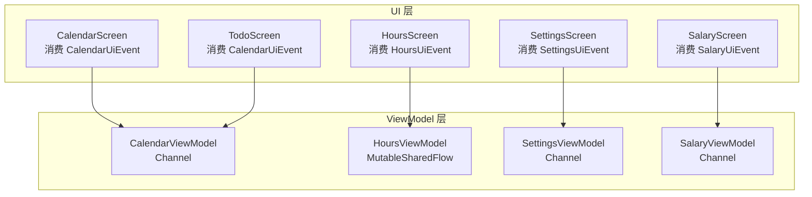
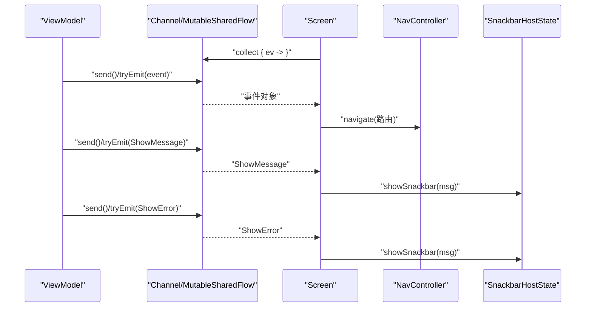
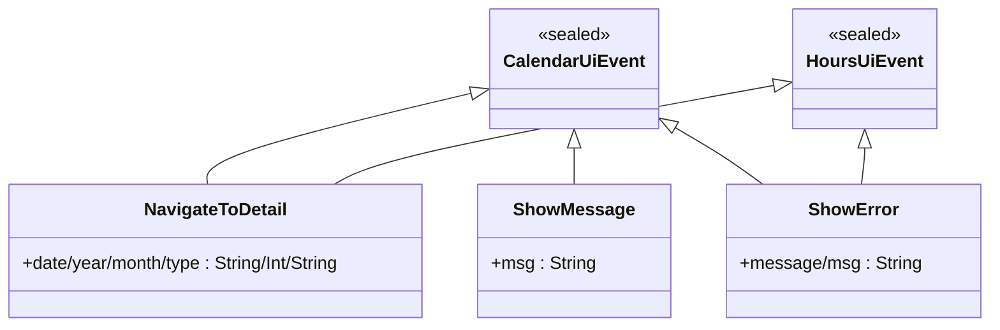
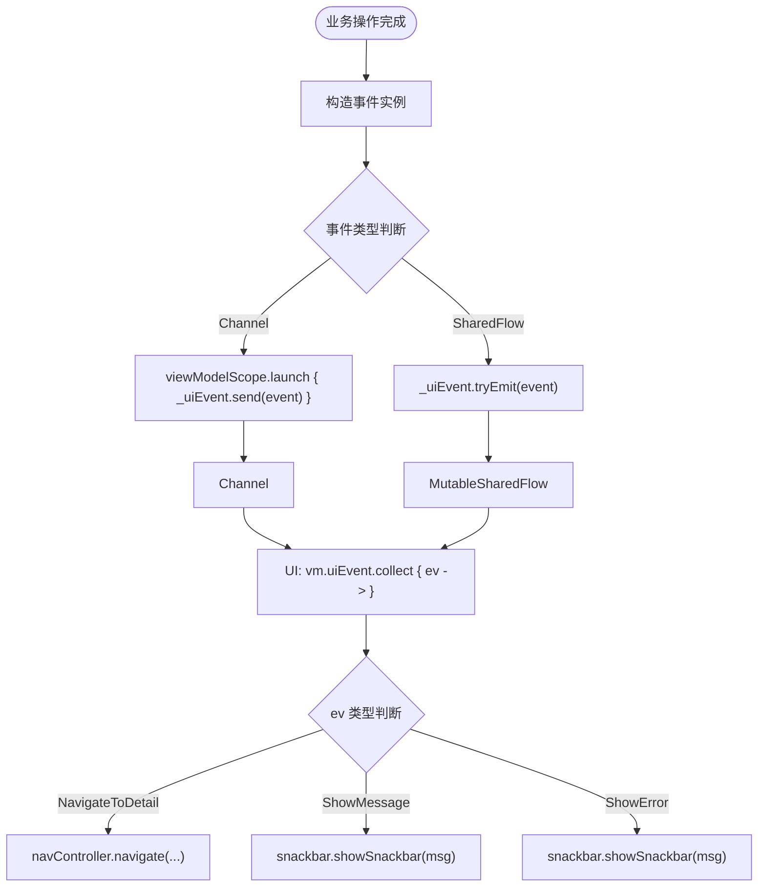
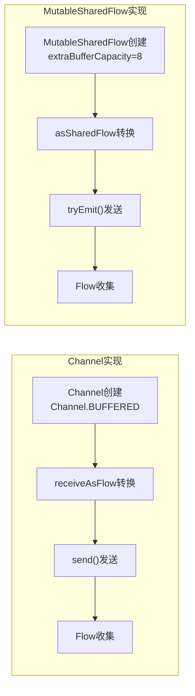
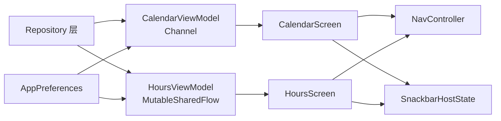

# 事件处理

<cite>
**本文引用的文件**   
- [CalendarViewModel.kt](file://app/src/main/java/com/schedulecalendar/app/ui/calendar/CalendarViewModel.kt)
- [CalendarScreen.kt](file://app/src/main/java/com/schedulecalendar/app/ui/calendar/CalendarScreen.kt)
- [HoursViewModel.kt](file://app/src/main/java/com/schedulecalendar/app/ui/hours/HoursViewModel.kt)
- [HoursScreen.kt](file://app/src/main/java/com/schedulecalendar/app/ui/hours/HoursScreen.kt)
- [SettingsViewModel.kt](file://app/src/main/java/com/schedulecalendar/app/ui/settings/SettingsViewModel.kt)
- [SalaryViewModel.kt](file://app/src/main/java/com/schedulecalendar/app/ui/salary/SalaryViewModel.kt)
</cite>

## 更新摘要
**所做更改**
- 更新了事件处理机制现代化改造部分，重点说明HoursViewModel从Channel迁移到MutableSharedFlow
- 添加了新的架构对比章节，展示两种实现方式的差异
- 更新了性能考虑和最佳实践建议
- 增强了协程集成和现代Kotlin Flow的使用指导

## 目录
1. [简介](#简介)
2. [项目结构](#项目结构)
3. [核心组件](#核心组件)
4. [架构总览](#架构总览)
5. [详细组件分析](#详细组件分析)
6. [事件处理机制现代化改造](#事件处理机制现代化改造)
7. [依赖关系分析](#依赖关系分析)
8. [性能考虑](#性能考虑)
9. [故障排查指南](#故障排查指南)
10. [结论](#结论)

## 简介
本文件围绕应用中的事件处理机制展开，重点说明：
- CalendarUiEvent、HoursUiEvent等密封类设计与事件类型定义
- Channel与MutableSharedFlow的使用方式与事件分发机制对比
- 事件的单向流动与消费模式
- 错误事件的处理策略与用户反馈机制
- 事件处理的调试技巧与性能监控方法

该机制贯穿日历、工时、待办中心、设置页等多个界面，通过ViewModel暴露StateFlow状态与事件流，UI层统一收集并消费事件，实现清晰、可维护的单向数据流。

## 项目结构
事件处理相关代码主要分布在以下位置：
- UI层（Composable）：负责展示与消费事件
- ViewModel层：封装业务逻辑，产生事件与状态
- 其他模块：复用相同的事件模型或通道模式

**图表来源**
- [CalendarViewModel.kt:134-135](file://app/src/main/java/com/schedulecalendar/app/ui/calendar/CalendarViewModel.kt#L134-L135)
- [HoursViewModel.kt:65-66](file://app/src/main/java/com/schedulecalendar/app/ui/hours/HoursViewModel.kt#L65-L66)
- [SettingsViewModel.kt:50-51](file://app/src/main/java/com/schedulecalendar/app/ui/settings/SettingsViewModel.kt#L50-L51)
- [SalaryViewModel.kt:60-61](file://app/src/main/java/com/schedulecalendar/app/ui/salary/SalaryViewModel.kt#L60-L61)

## 核心组件
- **密封类事件模型**：用于表达UI动作与反馈，包括导航到详情、显示消息、显示错误等。
- **Channel**：在部分ViewModel中作为一次性事件总线，UI侧通过receiveAsFlow()订阅，确保每个事件仅被消费一次。
- **MutableSharedFlow**：在现代ViewModel中使用，提供更好的协程集成和性能改进，支持更灵活的事件分发。
- **UI层**：在Composable中使用LaunchedEffect收集事件，根据事件类型执行导航或弹出Snackbar。

**章节来源**
- [CalendarViewModel.kt:58-62](file://app/src/main/java/com/schedulecalendar/app/ui/calendar/CalendarViewModel.kt#L58-L62)
- [HoursViewModel.kt:21-24](file://app/src/main/java/com/schedulecalendar/app/ui/hours/HoursViewModel.kt#L21-L24)
- [CalendarScreen.kt:92-100](file://app/src/main/java/com/schedulecalendar/app/ui/calendar/CalendarScreen.kt#L92-L100)
- [HoursScreen.kt:92-100](file://app/src/main/java/com/schedulecalendar/app/ui/hours/HoursScreen.kt#L92-L100)

## 架构总览
下图展示了从ViewModel发送事件到UI消费的完整流程，体现单向数据流与一次性消费特性。

**图表来源**
- [CalendarViewModel.kt:374-375](file://app/src/main/java/com/schedulecalendar/app/ui/calendar/CalendarViewModel.kt#L374-L375)
- [HoursViewModel.kt:81](file://app/src/main/java/com/schedulecalendar/app/ui/hours/HoursViewModel.kt#L81)
- [HoursScreen.kt:93-99](file://app/src/main/java/com/schedulecalendar/app/ui/hours/HoursScreen.kt#L93-L99)

## 详细组件分析

### 事件密封类设计
- **目的**：以类型安全的方式表达UI层的一次性动作与反馈，避免使用字符串或回调导致的耦合与遗漏。
- **类型定义**：
  - NavigateToDetail：携带参数，触发详情页导航
  - ShowMessage：携带文本消息，用于成功提示
  - ShowError：携带错误信息，用于失败提示

**图表来源**
- [CalendarViewModel.kt:58-62](file://app/src/main/java/com/schedulecalendar/app/ui/calendar/CalendarViewModel.kt#L58-L62)
- [HoursViewModel.kt:21-24](file://app/src/main/java/com/schedulecalendar/app/ui/hours/HoursViewModel.kt#L21-L24)

**章节来源**
- [CalendarViewModel.kt:58-62](file://app/src/main/java/com/schedulecalendar/app/ui/calendar/CalendarViewModel.kt#L58-L62)
- [HoursViewModel.kt:21-24](file://app/src/main/java/com/schedulecalendar/app/ui/hours/HoursViewModel.kt#L21-L24)

### 事件分发机制对比

#### Channel实现（传统方式）
- 使用`Channel<T>(Channel.BUFFERED)`创建缓冲型通道
- 通过`receiveAsFlow()`暴露为Flow供UI收集
- 使用`send()`方法发送事件
- 适用于需要背压控制的场景

#### MutableSharedFlow实现（现代方式）
- 使用`MutableSharedFlow<T>(extraBufferCapacity = 8)`创建共享流
- 通过`asSharedFlow()`暴露只读Flow
- 使用`tryEmit()`方法发送事件，更安全
- 提供更好的协程集成和性能优化

**图表来源**
- [CalendarViewModel.kt:134-135](file://app/src/main/java/com/schedulecalendar/app/ui/calendar/CalendarViewModel.kt#L134-L135)
- [HoursViewModel.kt:65-66](file://app/src/main/java/com/schedulecalendar/app/ui/hours/HoursViewModel.kt#L65-L66)
- [HoursViewModel.kt:81](file://app/src/main/java/com/schedulecalendar/app/ui/hours/HoursViewModel.kt#L81)

**章节来源**
- [CalendarViewModel.kt:134-135](file://app/src/main/java/com/schedulecalendar/app/ui/calendar/CalendarViewModel.kt#L134-L135)
- [HoursViewModel.kt:65-66](file://app/src/main/java/com/schedulecalendar/app/ui/hours/HoursViewModel.kt#L65-L66)
- [HoursViewModel.kt:81](file://app/src/main/java/com/schedulecalendar/app/ui/hours/HoursViewModel.kt#L81)

### 事件的单向流动与消费模式
- **单向数据流**：UI调用ViewModel的业务方法 → ViewModel更新StateFlow状态 → 必要时发送一次性事件 → UI收集事件并执行副作用（导航、提示）。
- **消费模式**：UI使用LaunchedEffect收集事件，保证生命周期内有效；事件仅消费一次，避免重复副作用。
- **多页面共享**：多个Screen均消费同一ViewModel的事件流，体现跨页面的统一事件处理。

**章节来源**
- [CalendarViewModel.kt:134-135](file://app/src/main/java/com/schedulecalendar/app/ui/calendar/CalendarViewModel.kt#L134-L135)
- [HoursViewModel.kt:65-66](file://app/src/main/java/com/schedulecalendar/app/ui/hours/HoursViewModel.kt#L65-L66)
- [HoursScreen.kt:92-100](file://app/src/main/java/com/schedulecalendar/app/ui/hours/HoursScreen.kt#L92-L100)

### 错误事件处理策略与用户反馈机制
- **错误事件**：ShowError用于承载异常信息，UI层统一通过Snackbar展示给用户。
- **成功反馈**：ShowMessage用于常规成功提示，提升用户体验。
- **导航事件**：NavigateToDetail用于跳转到详情页，保持UI行为集中管理。

**章节来源**
- [HoursViewModel.kt:143](file://app/src/main/java/com/schedulecalendar/app/ui/hours/HoursViewModel.kt#L143)
- [HoursScreen.kt:97](file://app/src/main/java/com/schedulecalendar/app/ui/hours/HoursScreen.kt#L97)

## 事件处理机制现代化改造

### 从Channel到MutableSharedFlow的迁移
HoursViewModel是项目中第一个采用现代事件处理机制的ViewModel，体现了架构演进的方向：

#### 传统Channel实现的特点
- 使用`Channel<CalendarUiEvent>(Channel.BUFFERED)`
- 通过`receiveAsFlow()`转换为Flow
- 使用`send()`方法发送事件
- 需要手动管理协程作用域

#### 现代MutableSharedFlow实现的优势
- 使用`MutableSharedFlow<HoursUiEvent>(extraBufferCapacity = 8)`
- 直接暴露为`asSharedFlow()`只读Flow
- 使用`tryEmit()`方法发送事件，更安全
- 更好的协程集成和内存管理

### 性能改进对比

**图表来源**
- [CalendarViewModel.kt:134-135](file://app/src/main/java/com/schedulecalendar/app/ui/calendar/CalendarViewModel.kt#L134-L135)
- [HoursViewModel.kt:65-66](file://app/src/main/java/com/schedulecalendar/app/ui/hours/HoursViewModel.kt#L65-L66)

### 迁移指导原则
1. **优先使用MutableSharedFlow**：对于新开发的ViewModel，推荐使用MutableSharedFlow
2. **保持向后兼容**：现有Channel实现保持不变，逐步迁移
3. **统一事件模式**：所有ViewModel遵循相同的密封类事件设计
4. **简化API**：tryEmit比send更安全，避免协程作用域问题

**章节来源**
- [HoursViewModel.kt:65-66](file://app/src/main/java/com/schedulecalendar/app/ui/hours/HoursViewModel.kt#L65-L66)
- [HoursViewModel.kt:81](file://app/src/main/java/com/schedulecalendar/app/ui/hours/HoursViewModel.kt#L81)

## 依赖关系分析
- **CalendarViewModel**依赖多个Repository与偏好设置，计算当月排班与待办事项，并在需要时发送UI事件。
- **HoursViewModel**同样依赖多个Repository，但采用现代化的MutableSharedFlow进行事件分发。
- **UI层**（CalendarScreen、HoursScreen、TodoScreen）依赖ViewModel的状态与事件流，不直接访问底层数据源。
- **事件流解耦了UI与业务逻辑**，便于测试与维护。

**图表来源**
- [CalendarViewModel.kt:119-129](file://app/src/main/java/com/schedulecalendar/app/ui/calendar/CalendarViewModel.kt#L119-L129)
- [HoursViewModel.kt:53-60](file://app/src/main/java/com/schedulecalendar/app/ui/hours/HoursViewModel.kt#L53-L60)
- [HoursScreen.kt:92-100](file://app/src/main/java/com/schedulecalendar/app/ui/hours/HoursScreen.kt#L92-L100)

**章节来源**
- [CalendarViewModel.kt:119-129](file://app/src/main/java/com/schedulecalendar/app/ui/calendar/CalendarViewModel.kt#L119-L129)
- [HoursViewModel.kt:53-60](file://app/src/main/java/com/schedulecalendar/app/ui/hours/HoursViewModel.kt#L53-L60)
- [HoursScreen.kt:92-100](file://app/src/main/java/com/schedulecalendar/app/ui/hours/HoursScreen.kt#L92-L100)

## 性能考虑
- **使用缓冲型Channel/SharedFlow**：减少背压风险，避免UI收集不及时导致事件丢失。
- **仅在必要时发送事件**：避免频繁发送相同类型事件造成UI抖动。
- **合理拆分事件类型**：将导航与提示分离，降低UI分支复杂度。
- **控制收集范围**：在LaunchedEffect中收集事件，随生命周期自动取消，防止内存泄漏。
- **优先选择MutableSharedFlow**：提供更好的协程集成和性能优化。
- **配置合适的缓冲区大小**：根据业务需求调整extraBufferCapacity参数。

## 故障排查指南
- **事件未触发**：检查ViewModel是否调用了send()/tryEmit()，以及UI是否正确collect。
- **重复消费**：确认UI未在多处同时collect同一Channel/SharedFlow，或使用StateFlow替代一次性事件。
- **导航失效**：检查NavigateToDetail的参数是否正确传递，NavController路由配置是否匹配。
- **错误提示缺失**：确认ShowError的消息内容非空，且UI层对ShowError分支有处理。
- **协程作用域问题**：确保在正确的viewModelScope中发送事件。
- **内存泄漏**：检查LaunchedEffect是否正确管理生命周期。

**章节来源**
- [CalendarViewModel.kt:374-375](file://app/src/main/java/com/schedulecalendar/app/ui/calendar/CalendarViewModel.kt#L374-L375)
- [HoursViewModel.kt:143](file://app/src/main/java/com/schedulecalendar/app/ui/hours/HoursViewModel.kt#L143)
- [HoursScreen.kt:92-100](file://app/src/main/java/com/schedulecalendar/app/ui/hours/HoursScreen.kt#L92-L100)

## 结论
通过密封类与Channel/MutableSharedFlow的组合，本项目实现了清晰、类型安全、一次性消费的事件处理机制。随着架构的现代化演进，HoursViewModel率先采用了MutableSharedFlow，提供了更好的协程集成和性能改进。UI层专注于消费事件与副作用，ViewModel负责业务逻辑与事件生产，形成稳定的单向数据流。该模式易于扩展与维护，适用于复杂交互场景下的事件驱动架构。

**推荐实践**：
- 新项目优先使用MutableSharedFlow
- 现有Channel实现保持向后兼容
- 统一密封类事件设计模式
- 持续优化性能和内存管理