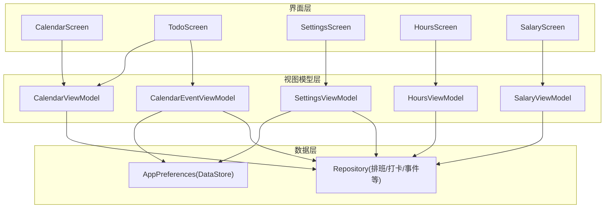
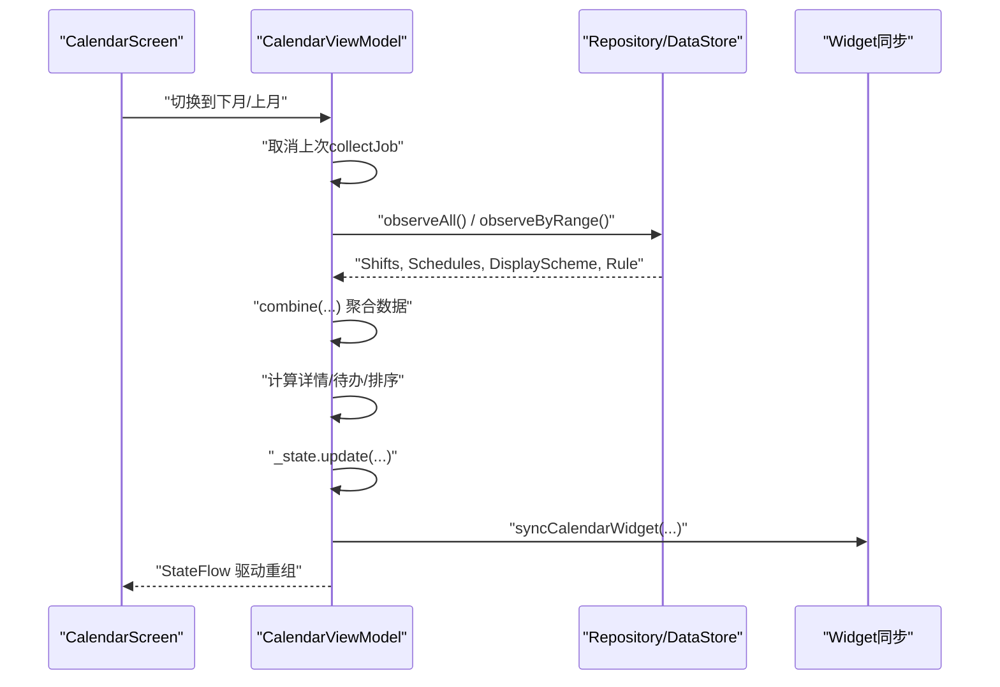
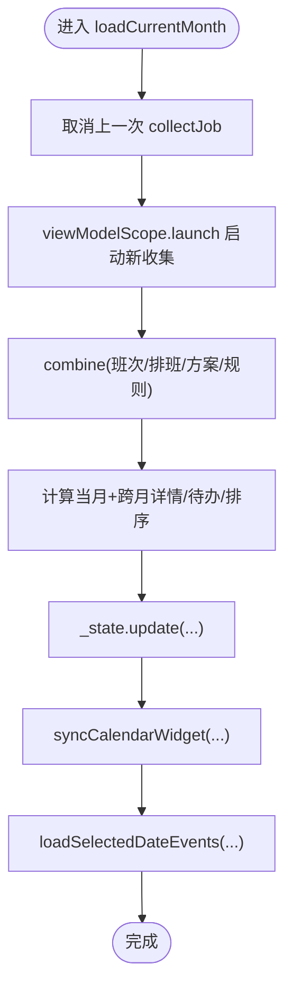
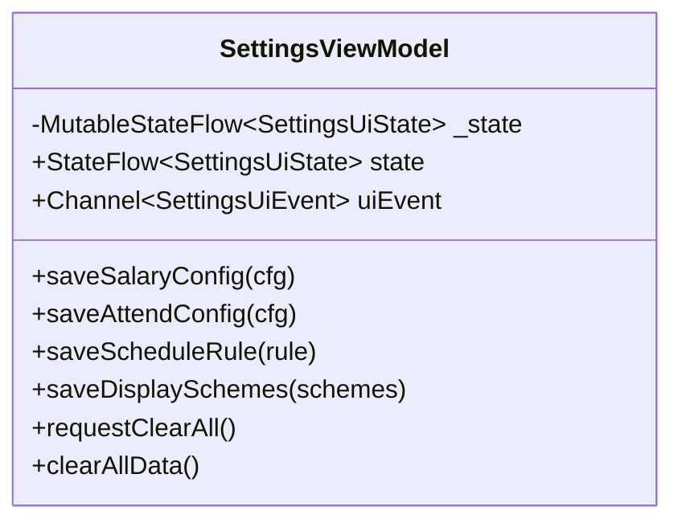
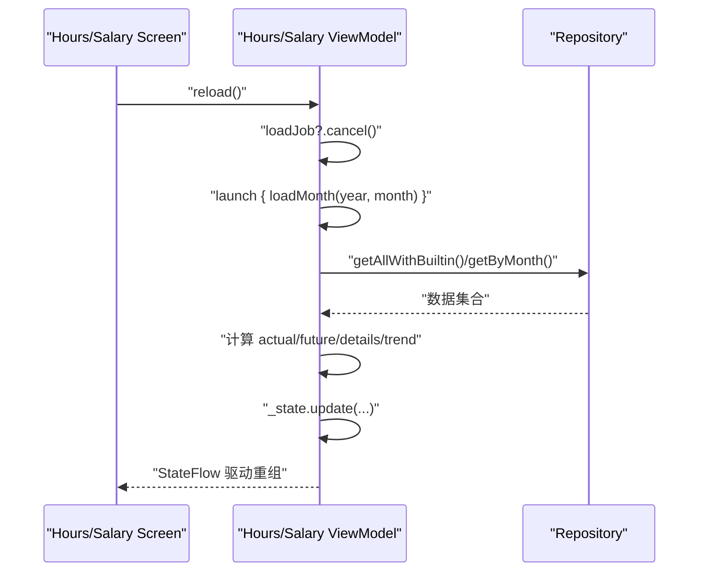
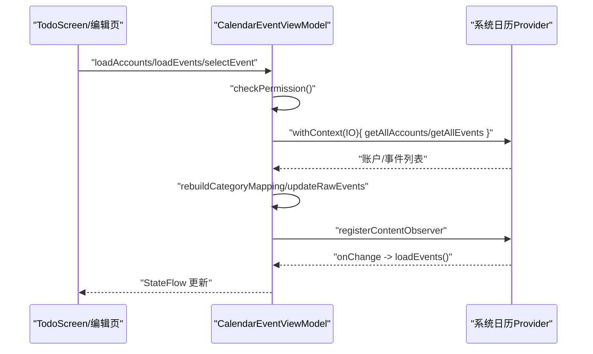
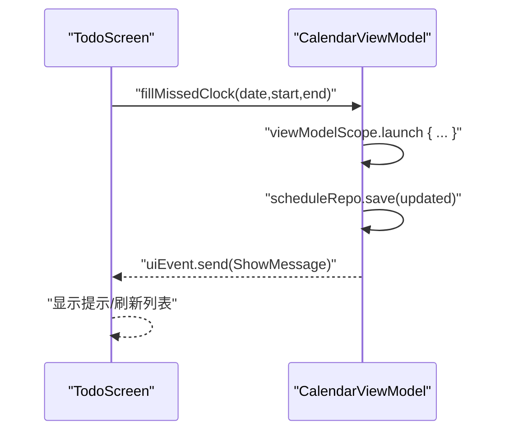
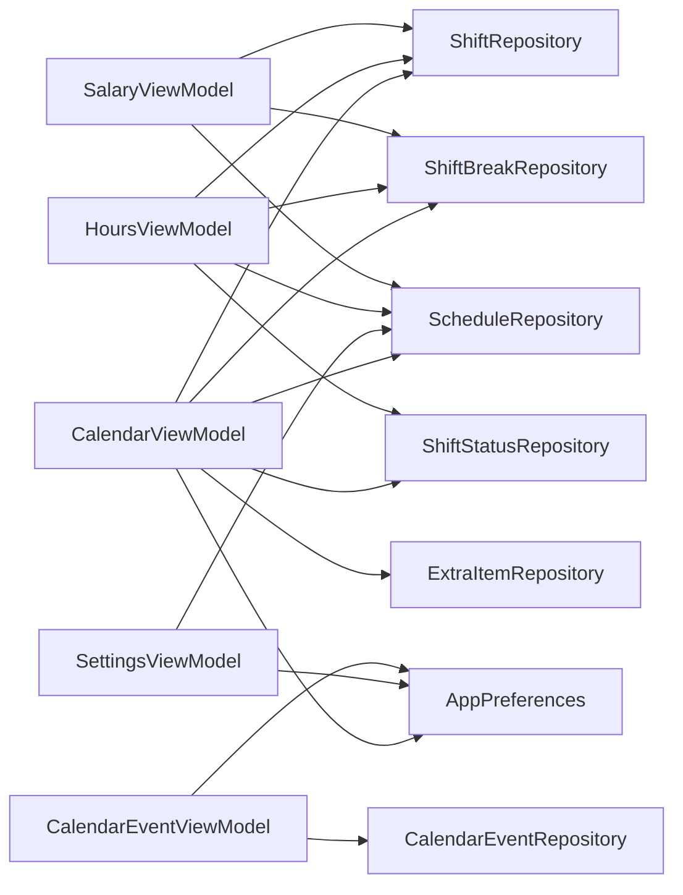
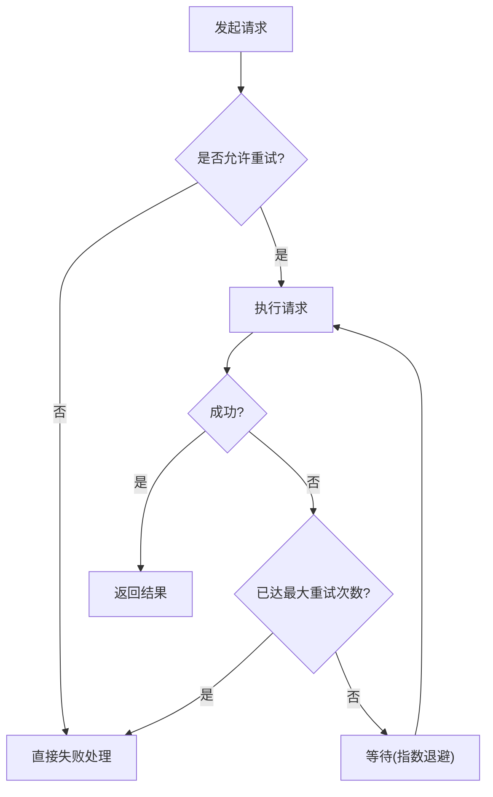

# 异步处理

<cite>
**本文引用的文件**   
- [CalendarViewModel.kt](file://app/src/main/java/com/schedulecalendar/app/ui/calendar/CalendarViewModel.kt)
- [SettingsViewModel.kt](file://app/src/main/java/com/schedulecalendar/app/ui/settings/SettingsViewModel.kt)
- [HoursViewModel.kt](file://app/src/main/java/com/schedulecalendar/app/ui/hours/HoursViewModel.kt)
- [SalaryViewModel.kt](file://app/src/main/java/com/schedulecalendar/app/ui/salary/SalaryViewModel.kt)
- [CalendarEventViewModel.kt](file://app/src/main/java/com/schedulecalendar/app/ui/todo/CalendarEventViewModel.kt)
- [AppPreferences.kt](file://app/src/main/java/com/schedulecalendar/app/data/prefs/AppPreferences.kt)
- [TodoScreen.kt](file://app/src/main/java/com/schedulecalendar/app/ui/todo/TodoScreen.kt)
- [CalendarScreen.kt](file://app/src/main/java/com/schedulecalendar/app/ui/calendar/CalendarScreen.kt)
</cite>

## 目录
1. [简介](#简介)
2. [项目结构](#项目结构)
3. [核心组件](#核心组件)
4. [架构总览](#架构总览)
5. [详细组件分析](#详细组件分析)
6. [依赖关系分析](#依赖关系分析)
7. [性能与并发最佳实践](#性能与并发最佳实践)
8. [错误处理与重试策略](#错误处理与重试策略)
9. [测试与调试指南](#测试与调试指南)
10. [结论](#结论)

## 简介
本文件聚焦于在 ViewModel 中使用协程进行异步处理的完整实践，涵盖：
- viewModelScope 的作用域管理与任务取消机制
- Flow 驱动的响应式数据流与状态更新
- 并发控制、资源清理与生命周期绑定
- 错误处理与可落地的重试策略建议
- 针对本仓库现有代码的可视化分析与改进建议

## 项目结构
本项目采用 MVVM + Compose 的架构。UI 层通过 collectAsStateWithLifecycle 订阅 ViewModel 暴露的 StateFlow；业务逻辑集中在各 ViewModel 中，使用 viewModelScope 启动协程，结合 Repository 与 DataStore/数据库访问数据。

图表来源
- [CalendarScreen.kt:1-56](file://app/src/main/java/com/schedulecalendar/app/ui/calendar/CalendarScreen.kt#L1-L56)
- [TodoScreen.kt:1-54](file://app/src/main/java/com/schedulecalendar/app/ui/todo/TodoScreen.kt#L1-L54)
- [CalendarViewModel.kt:1-30](file://app/src/main/java/com/schedulecalendar/app/ui/calendar/CalendarViewModel.kt#L1-L30)
- [SettingsViewModel.kt:1-17](file://app/src/main/java/com/schedulecalendar/app/ui/settings/SettingsViewModel.kt#L1-L17)
- [HoursViewModel.kt:1-19](file://app/src/main/java/com/schedulecalendar/app/ui/hours/HoursViewModel.kt#L1-L19)
- [SalaryViewModel.kt:1-18](file://app/src/main/java/com/schedulecalendar/app/ui/salary/SalaryViewModel.kt#L1-L18)
- [CalendarEventViewModel.kt:1-28](file://app/src/main/java/com/schedulecalendar/app/ui/todo/CalendarEventViewModel.kt#L1-L28)
- [AppPreferences.kt:37-64](file://app/src/main/java/com/schedulecalendar/app/data/prefs/AppPreferences.kt#L37-L64)

章节来源
- [CalendarScreen.kt:1-56](file://app/src/main/java/com/schedulecalendar/app/ui/calendar/CalendarScreen.kt#L1-L56)
- [TodoScreen.kt:1-54](file://app/src/main/java/com/schedulecalendar/app/ui/todo/TodoScreen.kt#L1-L54)
- [CalendarViewModel.kt:1-30](file://app/src/main/java/com/schedulecalendar/app/ui/calendar/CalendarViewModel.kt#L1-L30)
- [SettingsViewModel.kt:1-17](file://app/src/main/java/com/schedulecalendar/app/ui/settings/SettingsViewModel.kt#L1-L17)
- [HoursViewModel.kt:1-19](file://app/src/main/java/com/schedulecalendar/app/ui/hours/HoursViewModel.kt#L1-L19)
- [SalaryViewModel.kt:1-18](file://app/src/main/java/com/schedulecalendar/app/ui/salary/SalaryViewModel.kt#L1-L18)
- [CalendarEventViewModel.kt:1-28](file://app/src/main/java/com/schedulecalendar/app/ui/todo/CalendarEventViewModel.kt#L1-L28)
- [AppPreferences.kt:37-64](file://app/src/main/java/com/schedulecalendar/app/data/prefs/AppPreferences.kt#L37-L64)

## 核心组件
- CalendarViewModel：负责日历月视图的数据加载、待办计算、批量操作、复制排班、Widget 同步等。大量使用 combine 聚合多源数据，并通过 stateIn 将外部 Flow 接入 UI。
- SettingsViewModel：设置页一次性 UI 事件与配置保存，使用 Channel 传递一次性事件，stateIn 管理共享列表。
- HoursViewModel / SalaryViewModel：工时与薪资页面，监听数据刷新信号，按月份计算汇总与趋势。
- CalendarEventViewModel：系统日历事件读取、权限检查、ContentObserver 监听、分类映射与单事件加载。

章节来源
- [CalendarViewModel.kt:104-132](file://app/src/main/java/com/schedulecalendar/app/ui/calendar/CalendarViewModel.kt#L104-L132)
- [SettingsViewModel.kt:34-64](file://app/src/main/java/com/schedulecalendar/app/ui/settings/SettingsViewModel.kt#L34-L64)
- [HoursViewModel.kt:51-74](file://app/src/main/java/com/schedulecalendar/app/ui/hours/HoursViewModel.kt#L51-L74)
- [SalaryViewModel.kt:48-70](file://app/src/main/java/com/schedulecalendar/app/ui/salary/SalaryViewModel.kt#L48-L70)
- [CalendarEventViewModel.kt:46-152](file://app/src/main/java/com/schedulecalendar/app/ui/todo/CalendarEventViewModel.kt#L46-L152)

## 架构总览
下图展示了典型“切换月份”流程中的异步协作：UI 触发 -> ViewModel 取消旧收集 -> 重新组合并收集多源数据 -> 更新状态 -> 同步 Widget。

图表来源
- [CalendarViewModel.kt:126-147](file://app/src/main/java/com/schedulecalendar/app/ui/calendar/CalendarViewModel.kt#L126-L147)
- [CalendarViewModel.kt:160-246](file://app/src/main/java/com/schedulecalendar/app/ui/calendar/CalendarViewModel.kt#L160-L246)
- [CalendarScreen.kt:278-301](file://app/src/main/java/com/schedulecalendar/app/ui/calendar/CalendarScreen.kt#L278-L301)

## 详细组件分析

### CalendarViewModel 异步模式与生命周期
- 作用域管理：所有后台任务均通过 viewModelScope.launch 启动，随 ViewModel 销毁自动取消。
- 长时收集控制：维护 collectJob 引用，切月时先 cancel 再 launch，避免 collector 累积导致内存泄漏。
- 数据聚合：使用 combine 合并班次、排班范围、显示方案与规则，统一计算后更新 _state。
- 一次性事件：通过 Channel 发送导航/消息/错误事件，UI 侧用 receiveAsFlow 消费。
- 跨月数据：根据当月首尾填充日期计算跨月详情，保证网格展示一致性。
- 选中日期事件：loadSelectedDateEvents 在 IO 线程查询日历事件，异常捕获返回空列表，避免崩溃。

图表来源
- [CalendarViewModel.kt:123-147](file://app/src/main/java/com/schedulecalendar/app/ui/calendar/CalendarViewModel.kt#L123-L147)
- [CalendarViewModel.kt:160-246](file://app/src/main/java/com/schedulecalendar/app/ui/calendar/CalendarViewModel.kt#L160-L246)
- [CalendarViewModel.kt:393-402](file://app/src/main/java/com/schedulecalendar/app/ui/calendar/CalendarViewModel.kt#L393-L402)

章节来源
- [CalendarViewModel.kt:104-132](file://app/src/main/java/com/schedulecalendar/app/ui/calendar/CalendarViewModel.kt#L104-L132)
- [CalendarViewModel.kt:123-147](file://app/src/main/java/com/schedulecalendar/app/ui/calendar/CalendarViewModel.kt#L123-L147)
- [CalendarViewModel.kt:160-246](file://app/src/main/java/com/schedulecalendar/app/ui/calendar/CalendarViewModel.kt#L160-L246)
- [CalendarViewModel.kt:393-402](file://app/src/main/java/com/schedulecalendar/app/ui/calendar/CalendarViewModel.kt#L393-L402)

### SettingsViewModel 一次性事件与 Flow 状态
- 一次性事件：SettingsUiEvent 通过 Channel 传递，UI 侧 receiveAsFlow 消费，适合弹窗/提示等一次性行为。
- 状态聚合：init 中 combine 多个配置 Flow，产出 SettingsUiState 并写入 _state。
- 列表共享：shifts 使用 stateIn(viewModelScope, SharingStarted.WhileSubscribed(5_000), emptyList())，减少订阅开销。
- 清空数据：clearAllData 使用 runCatching 包裹多仓库删除与偏好清除，失败则发送 ShowError。

图表来源
- [SettingsViewModel.kt:34-90](file://app/src/main/java/com/schedulecalendar/app/ui/settings/SettingsViewModel.kt#L34-L90)

章节来源
- [SettingsViewModel.kt:34-90](file://app/src/main/java/com/schedulecalendar/app/ui/settings/SettingsViewModel.kt#L34-L90)

### HoursViewModel / SalaryViewModel 刷新与趋势
- 刷新触发：监听 scheduleRepo.refreshSignal，变更时调用 reload()。
- 加载流程：loadJob 记录当前 Job，进入 loadMonth 前 cancel 旧 Job，首次加载显示 loading，后续刷新保持内容。
- 计算逻辑：实际/预计工时或薪资按“历史/当前/未来”月份区分，细节项由 CalcUtils 生成，趋势取近 8 个月。
- 错误处理：runCatching 捕获异常，更新 loading=false 并通过 Channel 发送错误事件。

图表来源
- [HoursViewModel.kt:67-139](file://app/src/main/java/com/schedulecalendar/app/ui/hours/HoursViewModel.kt#L67-L139)
- [SalaryViewModel.kt:63-132](file://app/src/main/java/com/schedulecalendar/app/ui/salary/SalaryViewModel.kt#L63-L132)

章节来源
- [HoursViewModel.kt:67-139](file://app/src/main/java/com/schedulecalendar/app/ui/hours/HoursViewModel.kt#L67-L139)
- [SalaryViewModel.kt:63-132](file://app/src/main/java/com/schedulecalendar/app/ui/salary/SalaryViewModel.kt#L63-L132)

### CalendarEventViewModel 权限与监听
- 权限检查：checkPermission 更新 hasPermission，无权限时跳过敏感操作。
- 账户与分类：初始化时加载本地日历ID与纪念日专用日历ID，重建 calendarId -> category 映射。
- 事件过滤：rawEvents 经 combine 过滤出日程/纪念日两类列表，支持禁用账户过滤。
- 实时监听：注册 ContentObserver 监听系统日历变化，变更后重新加载事件。
- 单事件加载：loadEventById 在 IO 线程执行，异常捕获并置空结果。

图表来源
- [CalendarEventViewModel.kt:96-152](file://app/src/main/java/com/schedulecalendar/app/ui/todo/CalendarEventViewModel.kt#L96-L152)
- [CalendarEventViewModel.kt:236-289](file://app/src/main/java/com/schedulecalendar/app/ui/todo/CalendarEventViewModel.kt#L236-L289)
- [CalendarEventViewModel.kt:340-367](file://app/src/main/java/com/schedulecalendar/app/ui/todo/CalendarEventViewModel.kt#L340-L367)

章节来源
- [CalendarEventViewModel.kt:96-152](file://app/src/main/java/com/schedulecalendar/app/ui/todo/CalendarEventViewModel.kt#L96-L152)
- [CalendarEventViewModel.kt:236-289](file://app/src/main/java/com/schedulecalendar/app/ui/todo/CalendarEventViewModel.kt#L236-L289)
- [CalendarEventViewModel.kt:340-367](file://app/src/main/java/com/schedulecalendar/app/ui/todo/CalendarEventViewModel.kt#L340-L367)

### UI 与 ViewModel 交互示例（补录/加班确认）
- TodoScreen 通过回调触发 CalendarViewModel 的 fillMissedClock、confirmEarlyOvertime 等方法，完成后通过 UI 事件提示用户。
- 这些方法内部使用 viewModelScope.launch 执行写操作，随后发送 ShowMessage 事件。

图表来源
- [TodoScreen.kt:153-201](file://app/src/main/java/com/schedulecalendar/app/ui/todo/TodoScreen.kt#L153-L201)
- [CalendarViewModel.kt:418-427](file://app/src/main/java/com/schedulecalendar/app/ui/calendar/CalendarViewModel.kt#L418-L427)

章节来源
- [TodoScreen.kt:153-201](file://app/src/main/java/com/schedulecalendar/app/ui/todo/TodoScreen.kt#L153-L201)
- [CalendarViewModel.kt:418-427](file://app/src/main/java/com/schedulecalendar/app/ui/calendar/CalendarViewModel.kt#L418-L427)

## 依赖关系分析
- 低耦合：各 ViewModel 仅依赖 Repository 与 AppPreferences，不直接持有 UI 对象。
- 高内聚：每个 ViewModel 负责单一页面的状态与事件，职责清晰。
- 外部依赖：DataStore 提供配置 Flow；系统日历 Provider 通过 Repository 访问；Widget 同步在 ViewModel 中触发。

图表来源
- [CalendarViewModel.kt:104-115](file://app/src/main/java/com/schedulecalendar/app/ui/calendar/CalendarViewModel.kt#L104-L115)
- [SettingsViewModel.kt:34-42](file://app/src/main/java/com/schedulecalendar/app/ui/settings/SettingsViewModel.kt#L34-L42)
- [HoursViewModel.kt:51-59](file://app/src/main/java/com/schedulecalendar/app/ui/hours/HoursViewModel.kt#L51-L59)
- [SalaryViewModel.kt:48-55](file://app/src/main/java/com/schedulecalendar/app/ui/salary/SalaryViewModel.kt#L48-L55)
- [CalendarEventViewModel.kt:46-51](file://app/src/main/java/com/schedulecalendar/app/ui/todo/CalendarEventViewModel.kt#L46-L51)
- [AppPreferences.kt:37-64](file://app/src/main/java/com/schedulecalendar/app/data/prefs/AppPreferences.kt#L37-L64)

章节来源
- [CalendarViewModel.kt:104-115](file://app/src/main/java/com/schedulecalendar/app/ui/calendar/CalendarViewModel.kt#L104-L115)
- [SettingsViewModel.kt:34-42](file://app/src/main/java/com/schedulecalendar/app/ui/settings/SettingsViewModel.kt#L34-L42)
- [HoursViewModel.kt:51-59](file://app/src/main/java/com/schedulecalendar/app/ui/hours/HoursViewModel.kt#L51-L59)
- [SalaryViewModel.kt:48-55](file://app/src/main/java/com/schedulecalendar/app/ui/salary/SalaryViewModel.kt#L48-L55)
- [CalendarEventViewModel.kt:46-51](file://app/src/main/java/com/schedulecalendar/app/ui/todo/CalendarEventViewModel.kt#L46-L51)
- [AppPreferences.kt:37-64](file://app/src/main/java/com/schedulecalendar/app/data/prefs/AppPreferences.kt#L37-L64)

## 性能与并发最佳实践
- 使用 viewModelScope 启动协程，确保生命周期一致且自动取消。
- 对长时间运行的收集（如月份数据聚合）使用 Job 引用并在切换时 cancel，避免重复收集导致的内存泄漏。
- 使用 stateIn 与 WhileSubscribed 控制共享 Flow 的生命周期与空闲回收。
- 在 IO 密集型操作（如系统日历查询）中使用 withContext(Dispatchers.IO)。
- 使用 runCatching 包裹可能抛出的异常路径，避免主流程中断。
- 对于一次性 UI 事件，优先使用 Channel.receiveAsFlow，避免状态污染。

章节来源
- [CalendarViewModel.kt:123-147](file://app/src/main/java/com/schedulecalendar/app/ui/calendar/CalendarViewModel.kt#L123-L147)
- [SettingsViewModel.kt:47-48](file://app/src/main/java/com/schedulecalendar/app/ui/settings/SettingsViewModel.kt#L47-L48)
- [CalendarEventViewModel.kt:246-264](file://app/src/main/java/com/schedulecalendar/app/ui/todo/CalendarEventViewModel.kt#L246-L264)
- [HoursViewModel.kt:83-139](file://app/src/main/java/com/schedulecalendar/app/ui/hours/HoursViewModel.kt#L83-L139)
- [SalaryViewModel.kt:74-132](file://app/src/main/java/com/schedulecalendar/app/ui/salary/SalaryViewModel.kt#L74-L132)

## 错误处理与重试策略
- 现状
  - SettingsViewModel.clearAllData 使用 runCatching 捕获异常并发送 ShowError。
  - CalendarViewModel.loadSelectedDateEvents 捕获异常返回空列表，避免崩溃。
  - HoursViewModel/SalaryViewModel 在加载失败时更新 loading=false 并发送错误事件。
- 建议的重试策略
  - 网络/IO 类操作：指数退避重试（例如最多 3 次，间隔 1s/2s/4s），配合超时与取消。
  - 幂等性：确保重试不会造成副作用重复（如重复创建事件）。
  - 用户可见反馈：失败时发送 ShowError，成功时发送 Success，必要时提供“重试”按钮。
  - 降级：当连续失败超过阈值，回退到缓存或空数据，保持 UI 可用。

[此图为概念流程图，无需源码对应]

章节来源
- [SettingsViewModel.kt:75-89](file://app/src/main/java/com/schedulecalendar/app/ui/settings/SettingsViewModel.kt#L75-L89)
- [CalendarViewModel.kt:393-402](file://app/src/main/java/com/schedulecalendar/app/ui/calendar/CalendarViewModel.kt#L393-L402)
- [HoursViewModel.kt:134-138](file://app/src/main/java/com/schedulecalendar/app/ui/hours/HoursViewModel.kt#L134-L138)
- [SalaryViewModel.kt:127-131](file://app/src/main/java/com/schedulecalendar/app/ui/salary/SalaryViewModel.kt#L127-L131)

## 测试与调试指南
- 单元测试
  - 使用 TestDispatcher 模拟时间，验证 Flow 输出与状态更新。
  - 使用 InMemoryDataStore 或 Mock Repository，断言 save/clear/delete 调用顺序。
  - 对一次性事件，使用 testChannel 或 testFlow 验证发送的消息类型。
- 集成测试
  - 使用 createComposeRule 与 hiltTest 注入测试依赖，验证 UI 在状态变化下的表现。
  - 对系统日历相关功能，使用 Mock ContentResolver 或封装接口以隔离外部依赖。
- 调试技巧
  - 在关键分支添加 Log.d/e，关注 SecurityException 与 IO 异常路径。
  - 使用 Android Studio 的 Coroutines Debugger 观察 viewModelScope 任务树与取消点。
  - 对长时间收集，打印 collectJob 的 isActive 与 cancel 时机，排查泄漏。

章节来源
- [CalendarEventViewModel.kt:246-264](file://app/src/main/java/com/schedulecalendar/app/ui/todo/CalendarEventViewModel.kt#L246-L264)
- [CalendarEventViewModel.kt:340-367](file://app/src/main/java/com/schedulecalendar/app/ui/todo/CalendarEventViewModel.kt#L340-L367)
- [SettingsViewModel.kt:75-89](file://app/src/main/java/com/schedulecalendar/app/ui/settings/SettingsViewModel.kt#L75-L89)

## 结论
本项目在 ViewModel 中广泛使用 viewModelScope 与 Flow 构建响应式、可取消的异步处理链路。通过 Job 引用控制长时收集、stateIn 优化共享 Flow、Channel 传递一次性事件，整体架构清晰、可维护性强。建议在复杂 IO 场景引入指数退避重试与降级策略，进一步提升健壮性与用户体验。