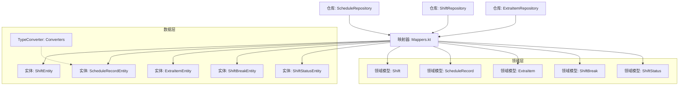
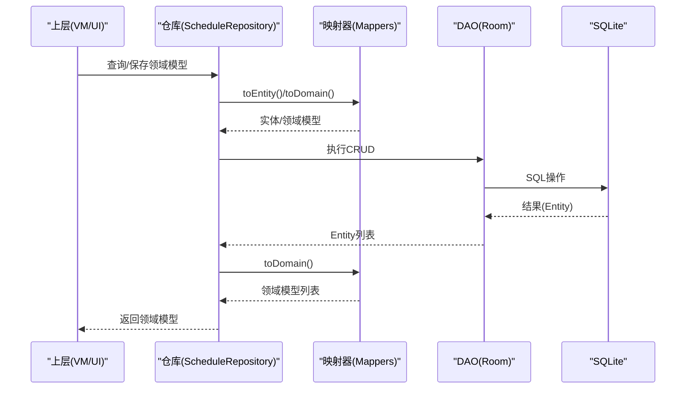
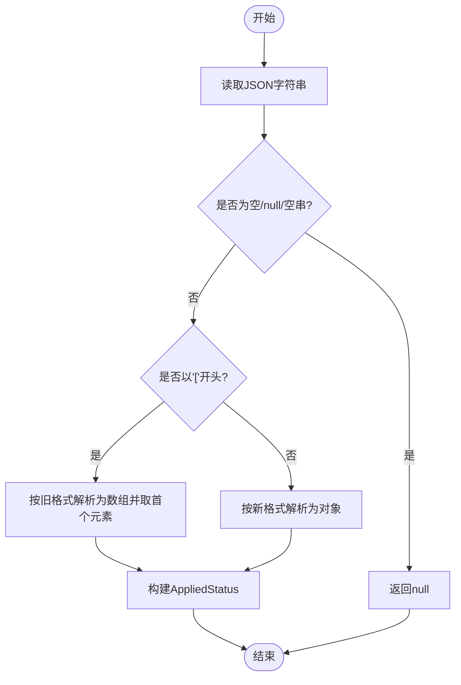
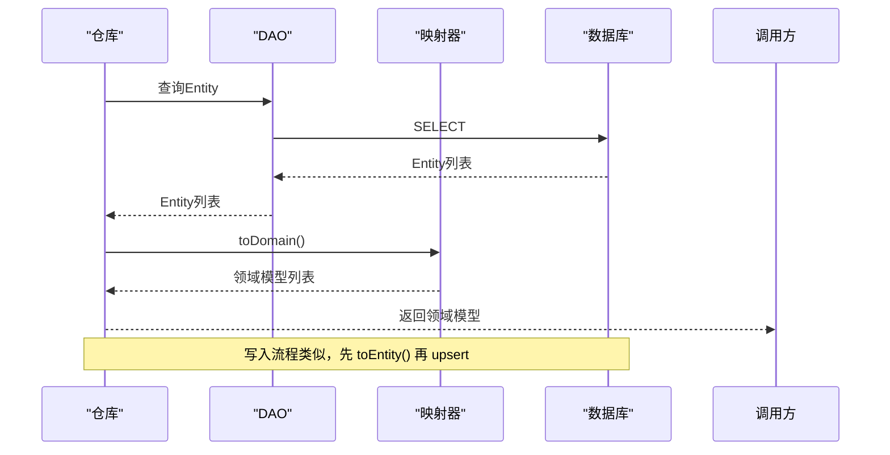
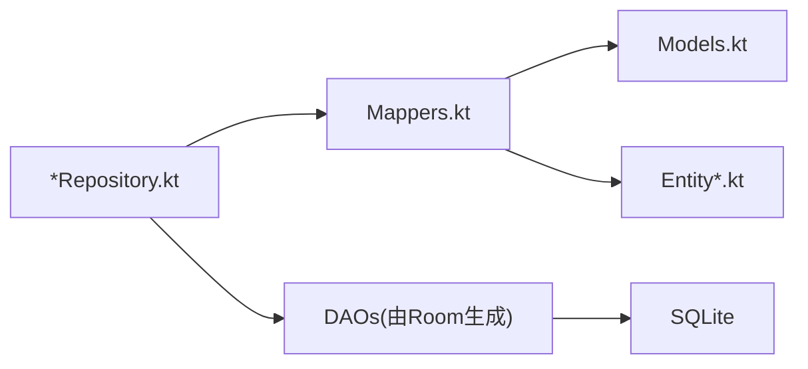

# 数据映射

<cite>
**本文引用的文件**   
- [Mappers.kt](file://app/src/main/java/com/schedulecalendar/app/data/repository/Mappers.kt)
- [Models.kt](file://app/src/main/java/com/schedulecalendar/app/domain/model/Models.kt)
- [ShiftEntity.kt](file://app/src/main/java/com/schedulecalendar/app/data/db/entity/ShiftEntity.kt)
- [ScheduleRecordEntity.kt](file://app/src/main/java/com/schedulecalendar/app/data/db/entity/ScheduleRecordEntity.kt)
- [ExtraItemEntity.kt](file://app/src/main/java/com/schedulecalendar/app/data/db/entity/ExtraItemEntity.kt)
- [ShiftBreakEntity.kt](file://app/src/main/java/com/schedulecalendar/app/data/db/entity/ShiftBreakEntity.kt)
- [ShiftStatusEntity.kt](file://app/src/main/java/com/schedulecalendar/app/data/db/entity/ShiftStatusEntity.kt)
- [Converters.kt](file://app/src/main/java/com/schedulecalendar/app/data/db/Converters.kt)
- [ScheduleRepository.kt](file://app/src/main/java/com/schedulecalendar/app/data/repository/ScheduleRepository.kt)
- [ShiftRepository.kt](file://app/src/main/java/com/schedulecalendar/app/data/repository/ShiftRepository.kt)
- [ExtraItemRepository.kt](file://app/src/main/java/com/schedulecalendar/app/data/repository/ExtraItemRepository.kt)
</cite>

## 目录
1. [简介](#简介)
2. [项目结构](#项目结构)
3. [核心组件](#核心组件)
4. [架构总览](#架构总览)
5. [详细组件分析](#详细组件分析)
6. [依赖关系分析](#依赖关系分析)
7. [性能考虑](#性能考虑)
8. [故障排查指南](#故障排查指南)
9. [结论](#结论)

## 简介
本文件聚焦于领域模型与数据实体之间的数据映射，系统性阐述 Mappers 的实现模式、转换规则、复杂对象嵌套与集合处理、验证与业务规则的映射落地方式，以及性能优化与错误处理的最佳实践。目标读者包括需要理解数据层到领域层边界、维护或扩展映射逻辑的工程师与产品技术同学。

## 项目结构
本项目采用分层架构：UI/ViewModel -> Repository -> DAO -> Room Entity；领域模型位于 domain.model 包中，数据实体位于 data.db.entity 包中，映射逻辑集中在 data.repository.Mappers.kt。Room 的 TypeConverter 用于简单集合类型（List<String>）的 JSON 序列化/反序列化。

图表来源
- [Mappers.kt:1-134](file://app/src/main/java/com/schedulecalendar/app/data/repository/Mappers.kt#L1-L134)
- [Models.kt:1-277](file://app/src/main/java/com/schedulecalendar/app/domain/model/Models.kt#L1-L277)
- [ShiftEntity.kt:1-24](file://app/src/main/java/com/schedulecalendar/app/data/db/entity/ShiftEntity.kt#L1-L24)
- [ScheduleRecordEntity.kt:1-26](file://app/src/main/java/com/schedulecalendar/app/data/db/entity/ScheduleRecordEntity.kt#L1-L26)
- [ExtraItemEntity.kt:1-16](file://app/src/main/java/com/schedulecalendar/app/data/db/entity/ExtraItemEntity.kt#L1-L16)
- [ShiftBreakEntity.kt:1-16](file://app/src/main/java/com/schedulecalendar/app/data/db/entity/ShiftBreakEntity.kt#L1-L16)
- [ShiftStatusEntity.kt:1-19](file://app/src/main/java/com/schedulecalendar/app/data/db/entity/ShiftStatusEntity.kt#L1-L19)
- [Converters.kt:1-17](file://app/src/main/java/com/schedulecalendar/app/data/db/Converters.kt#L1-L17)
- [ScheduleRepository.kt:1-40](file://app/src/main/java/com/schedulecalendar/app/data/repository/ScheduleRepository.kt#L1-L40)
- [ShiftRepository.kt:1-45](file://app/src/main/java/com/schedulecalendar/app/data/repository/ShiftRepository.kt#L1-L45)
- [ExtraItemRepository.kt:1-31](file://app/src/main/java/com/schedulecalendar/app/data/repository/ExtraItemRepository.kt#L1-L31)

章节来源
- [Mappers.kt:1-134](file://app/src/main/java/com/schedulecalendar/app/data/repository/Mappers.kt#L1-L134)
- [Models.kt:1-277](file://app/src/main/java/com/schedulecalendar/app/domain/model/Models.kt#L1-L277)
- [Converters.kt:1-17](file://app/src/main/java/com/schedulecalendar/app/data/db/Converters.kt#L1-L17)

## 核心组件
- 领域模型（Domain Models）
  - Shift、ScheduleRecord、ExtraItem、ShiftBreak、ShiftStatus、AppliedStatus、枚举类 ScheduleType、SalaryMode 等，定义在 Models.kt。
- 数据实体（Room Entities）
  - ShiftEntity、ScheduleRecordEntity、ExtraItemEntity、ShiftBreakEntity、ShiftStatusEntity，定义在 entity 包下。
- 映射器（Mappers）
  - 提供 Entity <-> Domain 的双向扩展函数，集中实现字段映射、JSON 解析/序列化、枚举转换、兼容旧格式等逻辑。
- 仓库（Repositories）
  - 调用 DAO 获取 Entity 列表后，统一通过 toDomain() 转换为领域模型返回给上层；写入时通过 toEntity() 持久化。
- Room TypeConverter
  - Converters 提供 List<String> 与 JSON String 的互转，供 Room 直接存取。

章节来源
- [Models.kt:1-277](file://app/src/main/java/com/schedulecalendar/app/domain/model/Models.kt#L1-L277)
- [ShiftEntity.kt:1-24](file://app/src/main/java/com/schedulecalendar/app/data/db/entity/ShiftEntity.kt#L1-L24)
- [ScheduleRecordEntity.kt:1-26](file://app/src/main/java/com/schedulecalendar/app/data/db/entity/ScheduleRecordEntity.kt#L1-L26)
- [ExtraItemEntity.kt:1-16](file://app/src/main/java/com/schedulecalendar/app/data/db/entity/ExtraItemEntity.kt#L1-L16)
- [ShiftBreakEntity.kt:1-16](file://app/src/main/java/com/schedulecalendar/app/data/db/entity/ShiftBreakEntity.kt#L1-L16)
- [ShiftStatusEntity.kt:1-19](file://app/src/main/java/com/schedulecalendar/app/data/db/entity/ShiftStatusEntity.kt#L1-L19)
- [Mappers.kt:1-134](file://app/src/main/java/com/schedulecalendar/app/data/repository/Mappers.kt#L1-L134)
- [Converters.kt:1-17](file://app/src/main/java/com/schedulecalendar/app/data/db/Converters.kt#L1-L17)

## 架构总览
下图展示从仓库到数据库的读写路径，以及映射器的介入点。

图表来源
- [ScheduleRepository.kt:1-40](file://app/src/main/java/com/schedulecalendar/app/data/repository/ScheduleRepository.kt#L1-L40)
- [Mappers.kt:1-134](file://app/src/main/java/com/schedulecalendar/app/data/repository/Mappers.kt#L1-L134)

## 详细组件分析

### 映射器实现模式
- 扩展函数风格：为每个 Entity 提供 toDomain()，为每个 Domain 提供 toEntity()，职责单一、易读、可测试。
- 集中式 JSON 处理：使用 Gson 进行复杂字段的序列化和反序列化，避免在各处重复实现。
- 兼容旧格式：对历史数据结构提供兼容解析策略，确保平滑升级。
- 安全转换：对枚举和可选字段使用 try-catch 或 runCatching，保证异常不向上抛出导致崩溃。

章节来源
- [Mappers.kt:1-134](file://app/src/main/java/com/schedulecalendar/app/data/repository/Mappers.kt#L1-L134)

### 领域模型与实体对照
- Shift
  - 领域模型包含正常工时阈值、内置类型、默认关联补贴/扣款ID列表等；实体以 JSON 存储关联ID列表。
  - 映射要点：linkedExtraIdsJson <-> linkedExtraIds 的 JSON 数组解析/序列化。
- ScheduleRecord
  - 领域模型包含排班类型、实际上下班时间、附加状态、薪资模式、加班确认标志等；实体以字符串形式存储枚举名与 JSON 集合。
  - 映射要点：type/salaryMode 枚举名与枚举值互转；extraItemIdsJson <-> extraItemIds；appliedStatusesJson <-> appliedStatus 的兼容解析。
- ExtraItem
  - 字段基本一一对应，无复杂转换。
- ShiftBreak / ShiftStatus
  - 字段基本一一对应，无复杂转换。

章节来源
- [Models.kt:1-277](file://app/src/main/java/com/schedulecalendar/app/domain/model/Models.kt#L1-L277)
- [ShiftEntity.kt:1-24](file://app/src/main/java/com/schedulecalendar/app/data/db/entity/ShiftEntity.kt#L1-L24)
- [ScheduleRecordEntity.kt:1-26](file://app/src/main/java/com/schedulecalendar/app/data/db/entity/ScheduleRecordEntity.kt#L1-L26)
- [ExtraItemEntity.kt:1-16](file://app/src/main/java/com/schedulecalendar/app/data/db/entity/ExtraItemEntity.kt#L1-L16)
- [ShiftBreakEntity.kt:1-16](file://app/src/main/java/com/schedulecalendar/app/data/db/entity/ShiftBreakEntity.kt#L1-L16)
- [ShiftStatusEntity.kt:1-19](file://app/src/main/java/com/schedulecalendar/app/data/db/entity/ShiftStatusEntity.kt#L1-L19)
- [Mappers.kt:1-134](file://app/src/main/java/com/schedulecalendar/app/data/repository/Mappers.kt#L1-L134)

### 复杂对象与集合映射
- 集合映射
  - Shift.linkedExtraIds、ScheduleRecord.extraItemIds 均以 JSON 数组存储，映射器负责将 JSON 字符串解析为 List<String>，并在写入时序列化回 JSON。
- 嵌套对象映射
  - AppliedStatus 作为单对象或兼容旧版数组格式存储在 appliedStatusesJson 中，映射器提供 parseAppliedStatus 兼容解析，并支持 toJson 输出。
- 枚举映射
  - ScheduleType、SalaryMode 在实体中以 name 字符串存储，映射器在读取时做安全转换，失败则回退到默认值或 null。

图表来源
- [Mappers.kt:60-89](file://app/src/main/java/com/schedulecalendar/app/data/repository/Mappers.kt#L60-L89)

章节来源
- [Mappers.kt:1-134](file://app/src/main/java/com/schedulecalendar/app/data/repository/Mappers.kt#L1-L134)

### 数据验证与业务规则映射
- 枚举安全转换
  - 使用 runCatching 捕获非法枚举值，回退到默认值或 null，避免崩溃。
- 归档标记
  - archivedAt 字段用于逻辑删除，仓库层在查询时过滤有效记录或在保存时设置归档时间戳。
- 内置数据合并
  - ShiftRepository 在返回结果时合并内置班次，保证 UI 始终能看到预设选项。
- 默认值与容错
  - 对缺失或非法 JSON 提供默认空集合或 null，保障上层稳定消费。

章节来源
- [Mappers.kt:1-134](file://app/src/main/java/com/schedulecalendar/app/data/repository/Mappers.kt#L1-L134)
- [ShiftRepository.kt:1-45](file://app/src/main/java/com/schedulecalendar/app/data/repository/ShiftRepository.kt#L1-L45)

### 仓库中的映射集成
- 读取路径
  - Repository 调用 DAO 获取 Entity 列表后，统一 map { it.toDomain() } 转换为领域模型再返回。
- 写入路径
  - Repository 接收领域模型，调用 toEntity() 转为实体后交由 DAO 持久化。
- 变更通知
  - 写操作后发出刷新信号，驱动 ViewModel 重新拉取数据。

图表来源
- [ScheduleRepository.kt:1-40](file://app/src/main/java/com/schedulecalendar/app/data/repository/ScheduleRepository.kt#L1-L40)
- [ShiftRepository.kt:1-45](file://app/src/main/java/com/schedulecalendar/app/data/repository/ShiftRepository.kt#L1-L45)
- [ExtraItemRepository.kt:1-31](file://app/src/main/java/com/schedulecalendar/app/data/repository/ExtraItemRepository.kt#L1-L31)
- [Mappers.kt:1-134](file://app/src/main/java/com/schedulecalendar/app/data/repository/Mappers.kt#L1-L134)

章节来源
- [ScheduleRepository.kt:1-40](file://app/src/main/java/com/schedulecalendar/app/data/repository/ScheduleRepository.kt#L1-L40)
- [ShiftRepository.kt:1-45](file://app/src/main/java/com/schedulecalendar/app/data/repository/ShiftRepository.kt#L1-L45)
- [ExtraItemRepository.kt:1-31](file://app/src/main/java/com/schedulecalendar/app/data/repository/ExtraItemRepository.kt#L1-L31)

## 依赖关系分析
- 低耦合高内聚
  - 映射器仅关注字段级转换与 JSON 处理，不包含业务计算；仓库负责组合与过滤；领域模型承载业务语义。
- 外部依赖
  - Gson 用于 JSON 序列化/反序列化；Room 提供持久化能力；Kotlin Flow 用于响应式数据流。
- 潜在循环依赖
  - 当前未发现循环引用；映射器只依赖领域模型与实体定义。

图表来源
- [Mappers.kt:1-134](file://app/src/main/java/com/schedulecalendar/app/data/repository/Mappers.kt#L1-L134)
- [Models.kt:1-277](file://app/src/main/java/com/schedulecalendar/app/domain/model/Models.kt#L1-L277)
- [ScheduleRepository.kt:1-40](file://app/src/main/java/com/schedulecalendar/app/data/repository/ScheduleRepository.kt#L1-L40)
- [ShiftRepository.kt:1-45](file://app/src/main/java/com/schedulecalendar/app/data/repository/ShiftRepository.kt#L1-L45)
- [ExtraItemRepository.kt:1-31](file://app/src/main/java/com/schedulecalendar/app/data/repository/ExtraItemRepository.kt#L1-L31)

章节来源
- [Mappers.kt:1-134](file://app/src/main/java/com/schedulecalendar/app/data/repository/Mappers.kt#L1-L134)
- [Models.kt:1-277](file://app/src/main/java/com/schedulecalendar/app/domain/model/Models.kt#L1-L277)
- [ScheduleRepository.kt:1-40](file://app/src/main/java/com/schedulecalendar/app/data/repository/ScheduleRepository.kt#L1-L40)
- [ShiftRepository.kt:1-45](file://app/src/main/java/com/schedulecalendar/app/data/repository/ShiftRepository.kt#L1-L45)
- [ExtraItemRepository.kt:1-31](file://app/src/main/java/com/schedulecalendar/app/data/repository/ExtraItemRepository.kt#L1-L31)

## 性能考虑
- 批量转换
  - 在仓库层对列表进行 map 转换，避免在 DAO 层引入额外开销；必要时可在仓库侧缓存常用字典（如内置班次）。
- JSON 解析成本
  - 大集合 JSON 解析有 CPU 与内存开销，建议仅在必要路径启用；对于频繁读取的数据，可考虑在应用启动时预解析并缓存。
- 枚举转换
  - 使用 runCatching 会引入少量异常开销，但能提升健壮性；若性能敏感，可在已知数据可信的前提下减少异常分支。
- 归档过滤
  - 在 DAO 层增加 WHERE archivedAt IS NULL 条件，减少应用层过滤成本。

[本节为通用指导，无需特定文件来源]

## 故障排查指南
- JSON 解析失败
  - 现象：集合为空或对象为 null。
  - 排查：检查 stored JSON 是否符合预期格式；确认旧格式兼容逻辑是否覆盖所有情况。
- 枚举值非法
  - 现象：读取时回退到默认值或 null。
  - 排查：确认写入时是否正确保存了枚举 name；检查是否有脏数据。
- 内置数据未显示
  - 现象：某些预设选项不可见。
  - 排查：确认仓库是否在返回结果中合并了内置数据；检查 ID 冲突与去重逻辑。
- 归档数据污染
  - 现象：已归档项仍出现在列表中。
  - 排查：确认 DAO 查询是否过滤 archivedAt；仓库是否误用 getAllIncludingArchived。

章节来源
- [Mappers.kt:1-134](file://app/src/main/java/com/schedulecalendar/app/data/repository/Mappers.kt#L1-L134)
- [ShiftRepository.kt:1-45](file://app/src/main/java/com/schedulecalendar/app/data/repository/ShiftRepository.kt#L1-L45)

## 结论
本项目通过集中式的映射器实现了领域模型与数据实体的清晰分离，结合仓库层的统一转换与容错策略，保证了数据流转的稳定性和可维护性。针对复杂对象与集合的 JSON 处理提供了兼容性与健壮性保障。建议在后续迭代中继续遵循“映射器只做转换、仓库负责组合、领域承载业务”的原则，并结合性能与错误处理的实践持续优化。