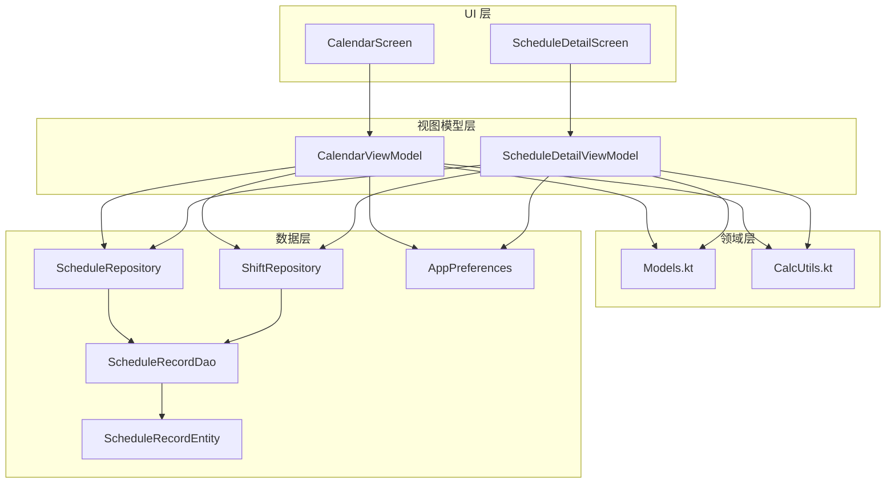
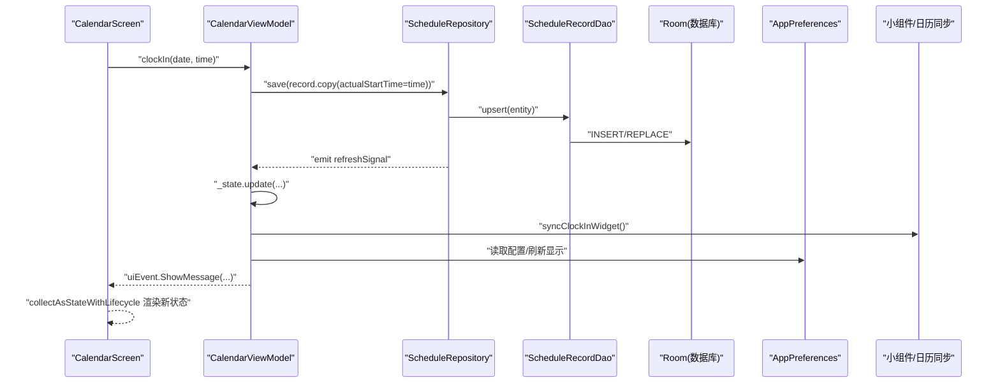
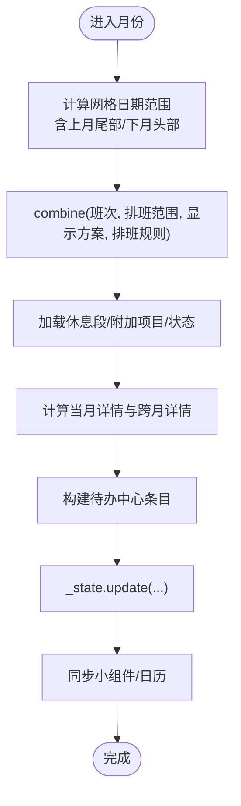
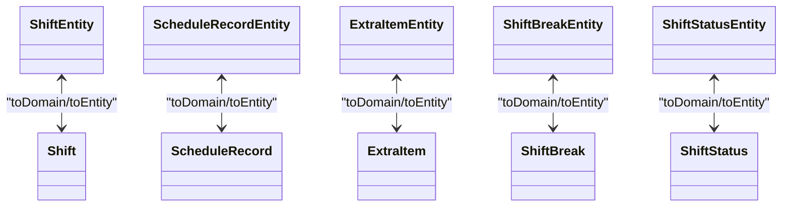
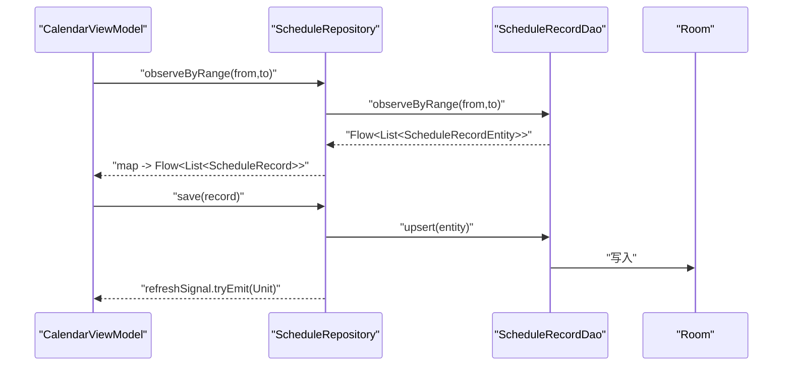
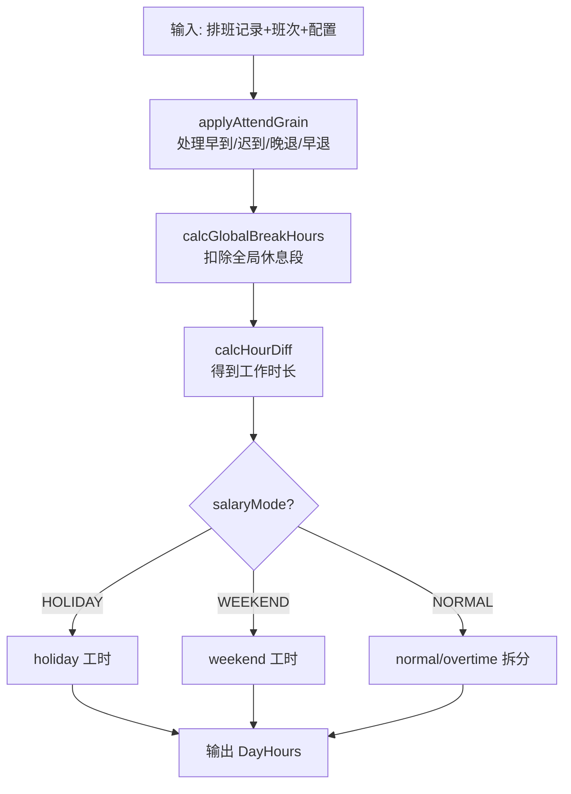
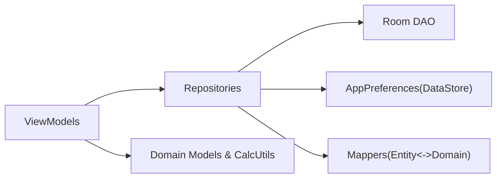

# 数据流模式

<cite>
**本文引用的文件**   
- [CalendarViewModel.kt](file://app/src/main/java/com/schedulecalendar/app/ui/calendar/CalendarViewModel.kt)
- [CalendarScreen.kt](file://app/src/main/java/com/schedulecalendar/app/ui/calendar/CalendarScreen.kt)
- [DetailViewModels.kt](file://app/src/main/java/com/schedulecalendar/app/ui/detail/DetailViewModels.kt)
- [ScheduleDetailScreen.kt](file://app/src/main/java/com/schedulecalendar/app/ui/detail/ScheduleDetailScreen.kt)
- [Mappers.kt](file://app/src/main/java/com/schedulecalendar/app/data/repository/Mappers.kt)
- [Models.kt](file://app/src/main/java/com/schedulecalendar/app/domain/model/Models.kt)
- [CalcUtils.kt](file://app/src/main/java/com/schedulecalendar/app/domain/model/CalcUtils.kt)
- [ScheduleRepository.kt](file://app/src/main/java/com/schedulecalendar/app/data/repository/ScheduleRepository.kt)
- [ShiftRepository.kt](file://app/src/main/java/com/schedulecalendar/app/data/repository/ShiftRepository.kt)
- [AppPreferences.kt](file://app/src/main/java/com/schedulecalendar/app/data/prefs/AppPreferences.kt)
- [ScheduleRecordDao.kt](file://app/src/main/java/com/schedulecalendar/app/data/db/dao/ScheduleRecordDao.kt)
- [ScheduleRecordEntity.kt](file://app/src/main/java/com/schedulecalendar/app/data/db/entity/ScheduleRecordEntity.kt)
</cite>

## 目录
1. [简介](#简介)
2. [项目结构](#项目结构)
3. [核心组件](#核心组件)
4. [架构总览](#架构总览)
5. [详细组件分析](#详细组件分析)
6. [依赖关系分析](#依赖关系分析)
7. [性能与并发](#性能与并发)
8. [故障排查指南](#故障排查指南)
9. [结论](#结论)

## 简介
本文件围绕单向数据流（Unidirectional Data Flow）设计原则，系统性阐述该应用的数据从 UI 层到数据层的流动路径、状态更新传播机制、领域模型与数据模型的映射转换、异步操作与错误处理策略，以及数据一致性、并发控制与性能优化实践。重点覆盖 StateFlow 的使用场景与最佳实践，并说明为何未使用 LiveData 的替代方案。

## 项目结构
应用采用分层架构：UI（Compose Screen + ViewModel）、领域（Domain Models + 计算工具）、数据（Repository + DAO + Entity + Preferences）。数据通过 Repository 暴露为 Kotlin Flow，ViewModel 组合多个 Flow 形成单一不可变 UI State，UI 仅消费 state 与一次性事件。

图表来源
- [CalendarScreen.kt:1-200](file://app/src/main/java/com/schedulecalendar/app/ui/calendar/CalendarScreen.kt#L1-L200)
- [CalendarViewModel.kt:100-250](file://app/src/main/java/com/schedulecalendar/app/ui/calendar/CalendarViewModel.kt#L100-L250)
- [ScheduleDetailScreen.kt:1-200](file://app/src/main/java/com/schedulecalendar/app/ui/detail/ScheduleDetailScreen.kt#L1-L200)
- [DetailViewModels.kt:50-150](file://app/src/main/java/com/schedulecalendar/app/ui/detail/DetailViewModels.kt#L50-L150)
- [ScheduleRepository.kt:1-40](file://app/src/main/java/com/schedulecalendar/app/data/repository/ScheduleRepository.kt#L1-L40)
- [ShiftRepository.kt:1-45](file://app/src/main/java/com/schedulecalendar/app/data/repository/ShiftRepository.kt#L1-L45)
- [AppPreferences.kt:60-120](file://app/src/main/java/com/schedulecalendar/app/data/prefs/AppPreferences.kt#L60-L120)
- [ScheduleRecordDao.kt:1-40](file://app/src/main/java/com/schedulecalendar/app/data/db/dao/ScheduleRecordDao.kt#L1-L40)
- [ScheduleRecordEntity.kt:1-26](file://app/src/main/java/com/schedulecalendar/app/data/db/entity/ScheduleRecordEntity.kt#L1-L26)

章节来源
- [CalendarScreen.kt:1-200](file://app/src/main/java/com/schedulecalendar/app/ui/calendar/CalendarScreen.kt#L1-L200)
- [CalendarViewModel.kt:100-250](file://app/src/main/java/com/schedulecalendar/app/ui/calendar/CalendarViewModel.kt#L100-L250)
- [ScheduleDetailScreen.kt:1-200](file://app/src/main/java/com/schedulecalendar/app/ui/detail/ScheduleDetailScreen.kt#L1-L200)
- [DetailViewModels.kt:50-150](file://app/src/main/java/com/schedulecalendar/app/ui/detail/DetailViewModels.kt#L50-L150)
- [ScheduleRepository.kt:1-40](file://app/src/main/java/com/schedulecalendar/app/data/repository/ScheduleRepository.kt#L1-L40)
- [ShiftRepository.kt:1-45](file://app/src/main/java/com/schedulecalendar/app/data/repository/ShiftRepository.kt#L1-L45)
- [AppPreferences.kt:60-120](file://app/src/main/java/com/schedulecalendar/app/data/prefs/AppPreferences.kt#L60-L120)
- [ScheduleRecordDao.kt:1-40](file://app/src/main/java/com/schedulecalendar/app/data/db/dao/ScheduleRecordDao.kt#L1-L40)
- [ScheduleRecordEntity.kt:1-26](file://app/src/main/java/com/schedulecalendar/app/data/db/entity/ScheduleRecordEntity.kt#L1-L26)

## 核心组件
- 单向数据流载体
  - UI 状态：各 ViewModel 内部以 MutableStateFlow 驱动不可变 data class 作为唯一真实来源，UI 通过 collectAsStateWithLifecycle 订阅。
  - 一次性事件：通过 Channel.receiveAsFlow() 暴露，避免重复消费。
- 数据源
  - Room DAO 返回 Flow<List<Entity>>，Repository 将其 map 为 Domain 对象并对外暴露 Flow。
  - DataStore 配置项以 Flow 形式暴露，便于实时响应。
- 领域计算
  - CalcUtils 提供工时/薪资计算、时间归一化、考勤粒度处理等纯函数逻辑，保证可测试性与一致性。
- 映射转换
  - Mappers 负责 Entity <-> Domain 的双向转换，包含 JSON 字段解析与兼容旧格式。

章节来源
- [CalendarViewModel.kt:115-130](file://app/src/main/java/com/schedulecalendar/app/ui/calendar/CalendarViewModel.kt#L115-L130)
- [DetailViewModels.kt:60-70](file://app/src/main/java/com/schedulecalendar/app/ui/detail/DetailViewModels.kt#L60-L70)
- [ScheduleRepository.kt:22-39](file://app/src/main/java/com/schedulecalendar/app/data/repository/ScheduleRepository.kt#L22-L39)
- [AppPreferences.kt:67-101](file://app/src/main/java/com/schedulecalendar/app/data/prefs/AppPreferences.kt#L67-L101)
- [CalcUtils.kt:149-230](file://app/src/main/java/com/schedulecalendar/app/domain/model/CalcUtils.kt#L149-L230)
- [Mappers.kt:19-48](file://app/src/main/java/com/schedulecalendar/app/data/repository/Mappers.kt#L19-L48)

## 架构总览
下图展示一次“打卡保存”的完整调用链与数据传播路径，体现单向数据流与状态更新传播。

图表来源
- [CalendarViewModel.kt:404-416](file://app/src/main/java/com/schedulecalendar/app/ui/calendar/CalendarViewModel.kt#L404-L416)
- [ScheduleRepository.kt:32-34](file://app/src/main/java/com/schedulecalendar/app/data/repository/ScheduleRepository.kt#L32-L34)
- [ScheduleRecordDao.kt:22-26](file://app/src/main/java/com/schedulecalendar/app/data/db/dao/ScheduleRecordDao.kt#L22-L26)
- [CalendarScreen.kt:121-130](file://app/src/main/java/com/schedulecalendar/app/ui/calendar/CalendarScreen.kt#L121-L130)

## 详细组件分析

### 单向数据流与状态管理
- 状态定义
  - CalendarUiState 聚合当月班次、排班记录、显示方案、待办事项、批量/复制模式等，确保 UI 所需信息集中且不可变。
  - ScheduleDetailState 聚焦单条记录的编辑上下文与实时预览。
- 状态更新
  - 所有变更通过 _state.update { ... } 产生新实例，触发下游收集者重绘。
  - 一次性事件通过 Channel 发送，UI 侧 collect 后消费并自动清理。
- 数据收集
  - loadCurrentMonth 中 combine 多个 Flow（班次、排班范围、显示方案、排班规则），在任一上游变化时重新计算当月详情与待办。

图表来源
- [CalendarViewModel.kt:134-247](file://app/src/main/java/com/schedulecalendar/app/ui/calendar/CalendarViewModel.kt#L134-L247)

章节来源
- [CalendarViewModel.kt:60-102](file://app/src/main/java/com/schedulecalendar/app/ui/calendar/CalendarViewModel.kt#L60-L102)
- [CalendarViewModel.kt:134-247](file://app/src/main/java/com/schedulecalendar/app/ui/calendar/CalendarViewModel.kt#L134-L247)
- [CalendarScreen.kt:76-130](file://app/src/main/java/com/schedulecalendar/app/ui/calendar/CalendarScreen.kt#L76-L130)

### 领域模型与数据模型映射（Mappers）
- Shift / ShiftBreak / ShiftStatus / ExtraItem / ScheduleRecord 均提供 toDomain()/toEntity() 扩展函数。
- 复杂字段
  - extraItemIdsJson/appliedStatusesJson 使用 Gson 序列化/反序列化，支持旧版数组与新对象格式兼容。
- 校验与容错
  - 枚举解析使用 runCatching/getOrDefault，失败回退默认值，避免崩溃。

图表来源
- [Mappers.kt:19-48](file://app/src/main/java/com/schedulecalendar/app/data/repository/Mappers.kt#L19-L48)
- [Mappers.kt:92-128](file://app/src/main/java/com/schedulecalendar/app/data/repository/Mappers.kt#L92-L128)
- [Mappers.kt:52-58](file://app/src/main/java/com/schedulecalendar/app/data/repository/Mappers.kt#L52-L58)
- [Mappers.kt:132-134](file://app/src/main/java/com/schedulecalendar/app/data/repository/Mappers.kt#L132-L134)

章节来源
- [Mappers.kt:19-48](file://app/src/main/java/com/schedulecalendar/app/data/repository/Mappers.kt#L19-L48)
- [Mappers.kt:92-128](file://app/src/main/java/com/schedulecalendar/app/data/repository/Mappers.kt#L92-L128)
- [Mappers.kt:52-58](file://app/src/main/java/com/schedulecalendar/app/data/repository/Mappers.kt#L52-L58)
- [Mappers.kt:132-134](file://app/src/main/java/com/schedulecalendar/app/data/repository/Mappers.kt#L132-L134)

### 数据层与仓库（Repository）
- Room DAO 暴露 observeByRange/observeByMonth 等 Flow，Repository 将 Entity 映射为 Domain 并统一抛出 Flow。
- 写操作后通过 MutableSharedFlow 发出刷新信号，供其他模块（如薪资页）按需重载。

图表来源
- [ScheduleRepository.kt:22-39](file://app/src/main/java/com/schedulecalendar/app/data/repository/ScheduleRepository.kt#L22-L39)
- [ScheduleRecordDao.kt:10-26](file://app/src/main/java/com/schedulecalendar/app/data/db/dao/ScheduleRecordDao.kt#L10-L26)

章节来源
- [ScheduleRepository.kt:1-40](file://app/src/main/java/com/schedulecalendar/app/data/repository/ScheduleRepository.kt#L1-L40)
- [ScheduleRecordDao.kt:1-40](file://app/src/main/java/com/schedulecalendar/app/data/db/dao/ScheduleRecordDao.kt#L1-L40)

### 偏好设置与配置流（DataStore）
- AppPreferences 将 SalaryConfig、AttendConfig、DisplayScheme、ScheduleRule 等序列化为 JSON，并以 Flow 暴露。
- 列表排序（班次/状态/补贴扣款/休息段）以逗号分隔 ID 字符串持久化，读取时恢复顺序。

章节来源
- [AppPreferences.kt:67-101](file://app/src/main/java/com/schedulecalendar/app/data/prefs/AppPreferences.kt#L67-L101)
- [AppPreferences.kt:112-153](file://app/src/main/java/com/schedulecalendar/app/data/prefs/AppPreferences.kt#L112-L153)

### 领域计算（CalcUtils）
- 时间工具：HH:mm 与分钟互转、跨天归一化、小时差计算。
- 考勤粒度：按配置的 overtimeGranMin 向下取整；迟到/早退容忍阈值内视为准点。
- 全局休息段：计算与班次时间窗口的重叠时长并扣除。
- 日工时分类：根据日期类型（工作日/周末/节假日）与 salaryMode 分类统计正常/加班/周末/节假日工时。
- 月度汇总：HoursSummary、SalarySummary、DayScheduleDetail 生成。

图表来源
- [CalcUtils.kt:61-113](file://app/src/main/java/com/schedulecalendar/app/domain/model/CalcUtils.kt#L61-L113)
- [CalcUtils.kt:149-230](file://app/src/main/java/com/schedulecalendar/app/domain/model/CalcUtils.kt#L149-L230)

章节来源
- [CalcUtils.kt:149-230](file://app/src/main/java/com/schedulecalendar/app/domain/model/CalcUtils.kt#L149-L230)
- [CalcUtils.kt:234-340](file://app/src/main/java/com/schedulecalendar/app/domain/model/CalcUtils.kt#L234-L340)
- [CalcUtils.kt:427-465](file://app/src/main/java/com/schedulecalendar/app/domain/model/CalcUtils.kt#L427-L465)

### UI 层与事件分发
- CalendarScreen 通过 collectAsStateWithLifecycle 订阅 vm.state，并通过 LaunchedEffect 收集 uiEvent 进行导航或 Snackbar 提示。
- 快捷方式与小组件点击会触发 ViewModel 方法，进而更新状态与事件。

章节来源
- [CalendarScreen.kt:76-130](file://app/src/main/java/com/schedulecalendar/app/ui/calendar/CalendarScreen.kt#L76-L130)
- [CalendarScreen.kt:84-119](file://app/src/main/java/com/schedulecalendar/app/ui/calendar/CalendarScreen.kt#L84-L119)

### 详情页数据流
- ScheduleDetailViewModel 加载班次、状态、附加项目、休息段与当前记录，实时计算预览工时与薪资明细。
- 用户交互（选择班次、修改实际打卡时间、附加状态、备注等）先更新本地 state，再持久化。

章节来源
- [DetailViewModels.kt:72-140](file://app/src/main/java/com/schedulecalendar/app/ui/detail/DetailViewModels.kt#L72-L140)
- [ScheduleDetailScreen.kt:40-115](file://app/src/main/java/com/schedulecalendar/app/ui/detail/ScheduleDetailScreen.kt#L40-L115)

## 依赖关系分析
- 低耦合高内聚
  - Repository 屏蔽 DAO 与 Entity 细节，向上暴露 Domain 对象与 Flow。
  - ViewModel 仅依赖 Repository 与 Preferences，不直接访问 Room/DataStore。
  - 领域计算集中在 CalcUtils，无副作用，易于单元测试。
- 外部依赖
  - Room 提供响应式查询；DataStore 提供配置流；Gson 用于 JSON 序列化。

图表来源
- [CalendarViewModel.kt:105-115](file://app/src/main/java/com/schedulecalendar/app/ui/calendar/CalendarViewModel.kt#L105-L115)
- [DetailViewModels.kt:53-61](file://app/src/main/java/com/schedulecalendar/app/ui/detail/DetailViewModels.kt#L53-L61)
- [ScheduleRepository.kt:14-16](file://app/src/main/java/com/schedulecalendar/app/data/repository/ScheduleRepository.kt#L14-L16)
- [ShiftRepository.kt:13-15](file://app/src/main/java/com/schedulecalendar/app/data/repository/ShiftRepository.kt#L13-L15)
- [AppPreferences.kt:26-28](file://app/src/main/java/com/schedulecalendar/app/data/prefs/AppPreferences.kt#L26-L28)
- [Mappers.kt:1-12](file://app/src/main/java/com/schedulecalendar/app/data/repository/Mappers.kt#L1-L12)

章节来源
- [CalendarViewModel.kt:105-115](file://app/src/main/java/com/schedulecalendar/app/ui/calendar/CalendarViewModel.kt#L105-L115)
- [DetailViewModels.kt:53-61](file://app/src/main/java/com/schedulecalendar/app/ui/detail/DetailViewModels.kt#L53-L61)
- [ScheduleRepository.kt:14-16](file://app/src/main/java/com/schedulecalendar/app/data/repository/ScheduleRepository.kt#L14-L16)
- [ShiftRepository.kt:13-15](file://app/src/main/java/com/schedulecalendar/app/data/repository/ShiftRepository.kt#L13-L15)
- [AppPreferences.kt:26-28](file://app/src/main/java/com/schedulecalendar/app/data/prefs/AppPreferences.kt#L26-L28)
- [Mappers.kt:1-12](file://app/src/main/java/com/schedulecalendar/app/data/repository/Mappers.kt#L1-L12)

## 性能与并发
- 协程与调度
  - 所有 IO 与计算均在 viewModelScope 中执行，避免内存泄漏；必要时使用 withContext(Dispatchers.IO) 切换线程。
- 背压与去抖
  - Flow 天然具备背压能力；对频繁变化的数据源（如 Room 观察）建议在 Repository 层做必要的合并与过滤。
- 资源管理
  - 切月时取消旧的 collectJob，防止 collector 累积导致内存泄漏。
- 批量操作
  - saveAll 使用单次 upsertAll 减少磁盘写入次数；删除也支持批量范围删除。
- 只读快照
  - 读取 DataStore 时使用 .first() 获取当前快照，避免在 edit{} 中读取造成竞态。

章节来源
- [CalendarViewModel.kt:123-132](file://app/src/main/java/com/schedulecalendar/app/ui/calendar/CalendarViewModel.kt#L123-L132)
- [CalendarViewModel.kt:394-402](file://app/src/main/java/com/schedulecalendar/app/ui/calendar/CalendarViewModel.kt#L394-L402)
- [ScheduleRepository.kt:32-36](file://app/src/main/java/com/schedulecalendar/app/data/repository/ScheduleRepository.kt#L32-L36)
- [AppPreferences.kt:107-109](file://app/src/main/java/com/schedulecalendar/app/data/prefs/AppPreferences.kt#L107-L109)

## 故障排查指南
- 常见问题定位
  - 状态未更新：检查是否调用了 _state.update 而非直接赋值；确认 collectAsStateWithLifecycle 已绑定生命周期。
  - 事件重复消费：确保 uiEvent 使用 receiveAsFlow 并在 UI 层 collect 一次。
  - 数据不同步：确认 Repository 在写操作后 emit refreshSignal，相关页面是否正确监听。
  - 解析异常：Mappers 中对 JSON 与枚举解析使用了 try/catch 与 getOrDefault，若出现异常请检查 JSON 结构与枚举名称。
- 建议日志与断点
  - 在 Repository.save/saveAll 前后打印关键参数；在 ViewModel._state.update 前打印变更摘要。
  - 在 CalcUtils 的关键分支（applyAttendGrain、calcDayHours）添加断点验证边界条件。

章节来源
- [CalendarViewModel.kt:117-122](file://app/src/main/java/com/schedulecalendar/app/ui/calendar/CalendarViewModel.kt#L117-L122)
- [ScheduleRepository.kt:17-21](file://app/src/main/java/com/schedulecalendar/app/data/repository/ScheduleRepository.kt#L17-L21)
- [Mappers.kt:69-88](file://app/src/main/java/com/schedulecalendar/app/data/repository/Mappers.kt#L69-L88)

## 结论
本项目严格遵循单向数据流：UI 仅消费不可变 state 与一次性事件；ViewModel 组合多源 Flow 计算最终状态；数据层通过 Repository 暴露 Flow 并封装映射与并发细节；领域计算集中于无副作用工具类，保障一致性与可测试性。整体架构清晰、可扩展性强，适合持续演进与团队协作。