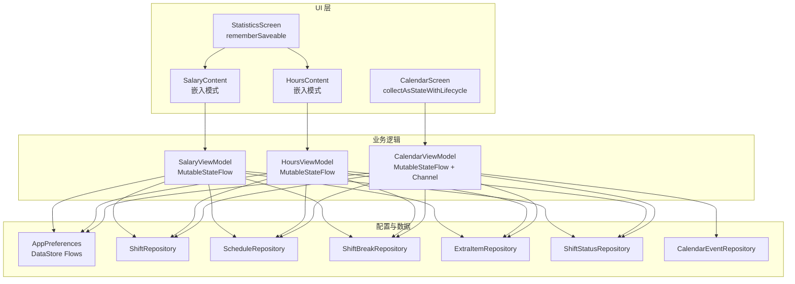
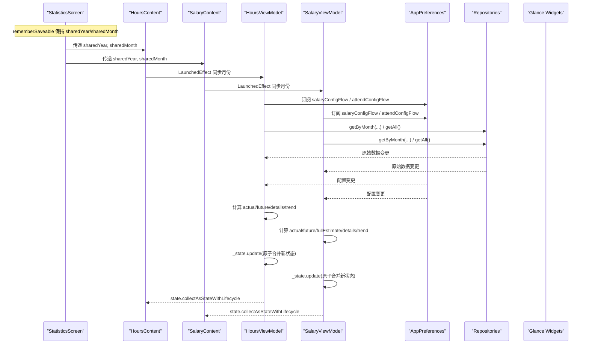
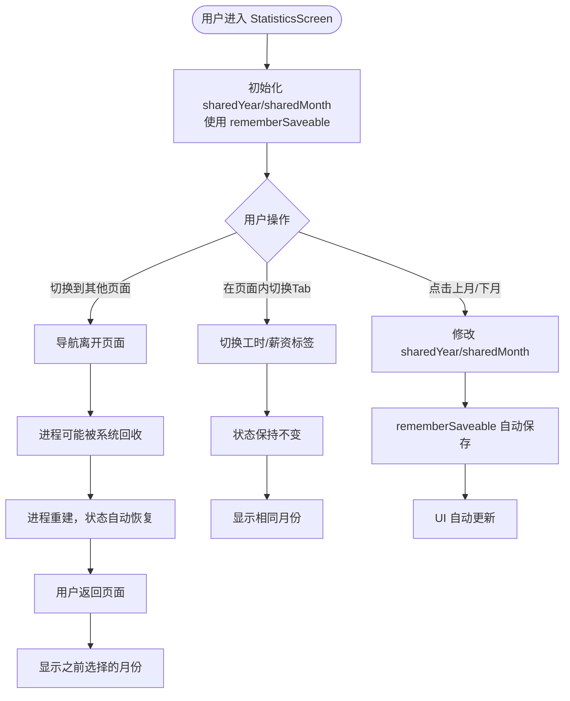
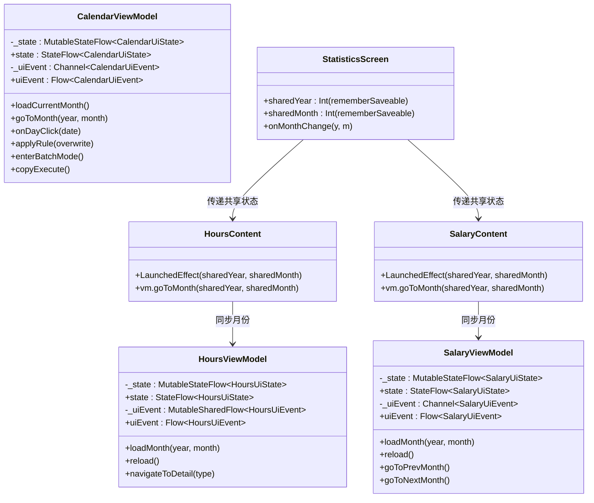
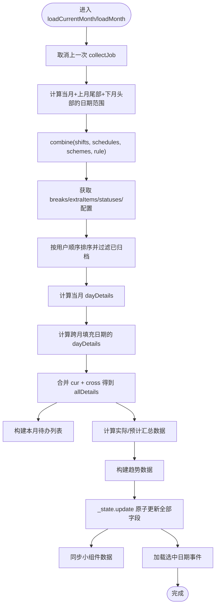
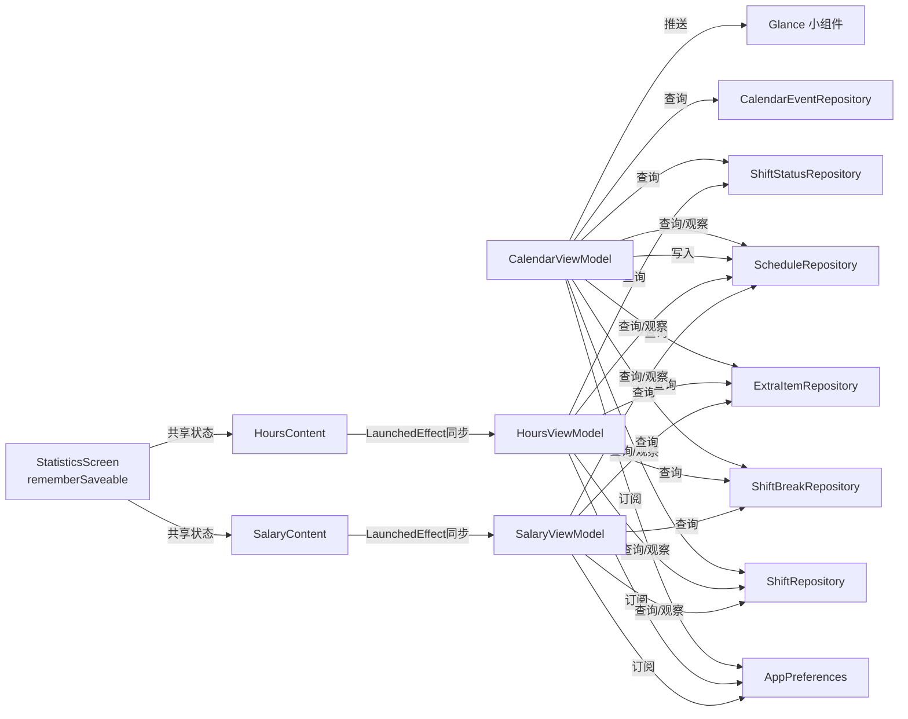

# 状态管理

<cite>
**本文引用的文件**   
- [CalendarViewModel.kt](file://app/src/main/java/com/schedulecalendar/app/ui/calendar/CalendarViewModel.kt)
- [CalendarScreen.kt](file://app/src/main/java/com/schedulecalendar/app/ui/calendar/CalendarScreen.kt)
- [AppPreferences.kt](file://app/src/main/java/com/schedulecalendar/app/data/prefs/AppPreferences.kt)
- [StatisticsScreen.kt](file://app/src/main/java/com/schedulecalendar/app/ui/statistics/StatisticsScreen.kt)
- [HoursScreen.kt](file://app/src/main/java/com/schedulecalendar/app/ui/hours/HoursScreen.kt)
- [SalaryScreen.kt](file://app/src/main/java/com/schedulecalendar/app/ui/salary/SalaryScreen.kt)
- [HoursViewModel.kt](file://app/src/main/java/com/schedulecalendar/app/ui/hours/HoursViewModel.kt)
- [SalaryViewModel.kt](file://app/src/main/java/com/schedulecalendar/app/ui/salary/SalaryViewModel.kt)
</cite>

## 更新摘要
**所做更改**   
- 新增 rememberSaveable 状态持久化章节，详细说明 StatisticsScreen.kt 中 sharedYear 和 sharedMonth 的改进
- 更新状态保存与恢复机制，涵盖 Compose 状态的生命周期管理
- 增强导航状态保持的最佳实践指导
- 补充嵌入式组件状态同步模式

## 目录
1. [简介](#简介)
2. [项目结构](#项目结构)
3. [核心组件](#核心组件)
4. [架构总览](#架构总览)
5. [详细组件分析](#详细组件分析)
6. [依赖关系分析](#依赖关系分析)
7. [性能考量](#性能考量)
8. [故障排查指南](#故障排查指南)
9. [结论](#结论)
10. [附录](#附录)

## 简介
本文件围绕 CalendarUiState 的状态管理模式进行系统化说明，涵盖：
- 设计模式与数据结构：不可变状态、组合式更新、事件驱动。
- MutableStateFlow 的使用方式与订阅模式：单向数据流、生命周期感知收集。
- **新增** rememberSaveable 状态持久化：导航状态保持、配置状态恢复。
- 原子性保证与并发控制：update 的原子语义、Job 取消策略、协程作用域隔离。
- 状态持久化、恢复与版本兼容：DataStore + Gson 的容错反序列化。
- 最佳实践与性能优化技巧：避免闪烁、减少重组、批量操作与范围计算。

## 项目结构
与状态管理直接相关的代码集中在日历模块、统计模块与偏好层：
- UI 层：CalendarScreen 通过 collectAsStateWithLifecycle 订阅 ViewModel 暴露的 state；StatisticsScreen 使用 rememberSaveable 管理共享月份状态。
- 业务层：CalendarViewModel、HoursViewModel、SalaryViewModel 维护各自的状态，负责数据加载、计算与同步小组件。
- 配置层：AppPreferences 提供 Flow 化的偏好数据源，供 ViewModel 组合进状态。

**图表来源**
- [StatisticsScreen.kt:34-36](file://app/src/main/java/com/schedulecalendar/app/ui/statistics/StatisticsScreen.kt#L34-L36)
- [CalendarScreen.kt:76-130](file://app/src/main/java/com/schedulecalendar/app/ui/calendar/CalendarScreen.kt#L76-L130)
- [HoursScreen.kt:59-88](file://app/src/main/java/com/schedulecalendar/app/ui/hours/HoursScreen.kt#L59-L88)
- [SalaryScreen.kt:49-78](file://app/src/main/java/com/schedulecalendar/app/ui/salary/SalaryScreen.kt#L49-L78)

## 核心组件
- CalendarUiState：描述当前月份视图所需的全部展示态（年月、班次/状态列表、排班记录、每日详情、待办、选择集、复制/批量/删除模式、选中日期事件等）。
- HoursUiState / SalaryUiState：工时和薪资页面的状态模型，包含实际数据、预计数据、趋势信息等。
- **新增** StatisticsScreen 共享状态：sharedYear 和 sharedMonth 使用 rememberSaveable 确保导航返回后状态保持。
- ViewModel 层：各页面 ViewModel 以 MutableStateFlow 持有并暴露状态；使用 Channel 发送一次性 UI 事件。
- AppPreferences：通过 DataStore 暴露各类配置的 Flow，支持默认值与容错解析。

**章节来源**
- [CalendarViewModel.kt:60-102](file://app/src/main/java/com/schedulecalendar/app/ui/calendar/CalendarViewModel.kt#L60-L102)
- [HoursViewModel.kt:34-50](file://app/src/main/java/com/schedulecalendar/app/ui/hours/HoursViewModel.kt#L34-L50)
- [SalaryViewModel.kt:32-46](file://app/src/main/java/com/schedulecalendar/app/ui/salary/SalaryViewModel.kt#L32-L46)
- [StatisticsScreen.kt:34-36](file://app/src/main/java/com/schedulecalendar/app/ui/statistics/StatisticsScreen.kt#L34-L36)

## 架构总览
单向数据流：UI 仅消费 state 与 uiEvent；所有变更由 ViewModel 发起，经 Repository/Preferences 落盘或广播，再回推至 State。**新增** rememberSaveable 用于 UI 层短期状态持久化，确保用户导航离开后返回时能保持之前选择的月份和年份状态。

**图表来源**
- [StatisticsScreen.kt:34-36](file://app/src/main/java/com/schedulecalendar/app/ui/statistics/StatisticsScreen.kt#L34-L36)
- [HoursScreen.kt:84-88](file://app/src/main/java/com/schedulecalendar/app/ui/hours/HoursScreen.kt#L84-L88)
- [SalaryScreen.kt:74-78](file://app/src/main/java/com/schedulecalendar/app/ui/salary/SalaryScreen.kt#L74-L78)
- [HoursViewModel.kt:84-146](file://app/src/main/java/com/schedulecalendar/app/ui/hours/HoursViewModel.kt#L84-L146)
- [SalaryViewModel.kt:74-144](file://app/src/main/java/com/schedulecalendar/app/ui/salary/SalaryViewModel.kt#L74-L144)

## 详细组件分析

### CalendarUiState 设计与字段职责
- 时间维度：year/month 决定当前显示月份；selectedDate 用于详情区高亮与联动。
- 基础数据：shifts/allShifts、shiftStatuses/allShiftStatuses 分别用于"当前有效"和"含归档历史"的查找场景。
- 排班与详情：schedules 为 Map[date, record]；dayDetails 为 Map[date, detail]，用于格内工时/薪资摘要。
- 规则与方案：scheduleRule/displayScheme 影响排班生成与单元格展示项。
- 交互模式：batchMode/batchSelected、copyMode/copyPhase/copySourceDates/copyTargetDate、deleteMode 控制批量/复制/删除流程。
- 辅助信息：todos 用于待办中心；extraItems 用于附加项目；selectedDateEvents 用于纪念日/日程。
- 加载态：loading 控制首屏加载指示。

更新机制要点：
- 所有字段均为不可变 data class 属性，通过 copy 生成新实例。
- 关键聚合更新统一通过 _state.update { ... } 完成，确保一次提交多个字段的原子性。

**章节来源**
- [CalendarViewModel.kt:60-102](file://app/src/main/java/com/schedulecalendar/app/ui/calendar/CalendarViewModel.kt#L60-L102)

### rememberSaveable 状态持久化与导航状态保持
**新增** StatisticsScreen.kt 中的 sharedYear 和 sharedMonth 状态变量从 remember 改为 rememberSaveable，这是状态管理的重要改进：

- **状态持久化机制**：rememberSaveable 会在进程销毁和重建时自动保存和恢复状态，确保用户导航离开后返回时能保持之前选择的月份和年份。
- **用户体验提升**：用户在工时和薪资页面之间切换，或在应用内导航到其他页面后返回，都能保持之前查看的月份，无需重新选择。
- **实现细节**：使用 `mutableIntStateOf` 包装 Int 类型，配合 `rememberSaveable` 实现可保存的可变状态。

**图表来源**
- [StatisticsScreen.kt:34-36](file://app/src/main/java/com/schedulecalendar/app/ui/statistics/StatisticsScreen.kt#L34-L36)

**章节来源**
- [StatisticsScreen.kt:34-36](file://app/src/main/java/com/schedulecalendar/app/ui/statistics/StatisticsScreen.kt#L34-L36)

### MutableStateFlow 的使用与订阅模式
- 内部私有 MutableStateFlow 持有可变状态，对外暴露只读 asStateFlow。
- UI 侧使用 collectAsStateWithLifecycle 订阅，自动绑定生命周期，避免内存泄漏。
- 一次性事件通过 Channel 发送，UI 侧用 collect 处理导航/提示。

**图表来源**
- [CalendarViewModel.kt:117-121](file://app/src/main/java/com/schedulecalendar/app/ui/calendar/CalendarViewModel.kt#L117-L121)
- [HoursViewModel.kt:62-66](file://app/src/main/java/com/schedulecalendar/app/ui/hours/HoursViewModel.kt#L62-66)
- [SalaryViewModel.kt:57-61](file://app/src/main/java/com/schedulecalendar/app/ui/salary/SalaryViewModel.kt#L57-61)
- [StatisticsScreen.kt:34-36](file://app/src/main/java/com/schedulecalendar/app/ui/statistics/StatisticsScreen.kt#L34-L36)
- [HoursScreen.kt:84-88](file://app/src/main/java/com/schedulecalendar/app/ui/hours/HoursScreen.kt#L84-L88)
- [SalaryScreen.kt:74-78](file://app/src/main/java/com/schedulecalendar/app/ui/salary/SalaryScreen.kt#L74-L78)

**章节来源**
- [CalendarViewModel.kt:117-121](file://app/src/main/java/com/schedulecalendar/app/ui/calendar/CalendarViewModel.kt#L117-L121)
- [HoursViewModel.kt:62-66](file://app/src/main/java/com/schedulecalendar/app/ui/hours/HoursViewModel.kt#L62-66)
- [SalaryViewModel.kt:57-61](file://app/src/main/java/com/schedulecalendar/app/ui/salary/SalaryViewModel.kt#L57-61)

### 状态更新的原子性与并发控制
- 原子性：使用 _state.update { it.copy(...) } 在一次回调中构造完整的新状态对象，避免中间态被 UI 观察到。
- 并发安全：
  - 切月时先 cancel 旧 collectJob，再启动新的 combine 收集，防止 collector 累积。
  - 所有写库操作在 viewModelScope 下执行，避免跨作用域竞争。
  - 对集合类字段（如 batchSelected）采用 toMutableSet()/toSet() 拷贝后再更新，避免共享可变引用。
- 防抖与去重：
  - 切换月份不清除旧数据，避免闪烁；新数据到达后整体替换。
  - 首次进入某月才设置 loading=true，后续刷新保持现有内容。

**章节来源**
- [CalendarViewModel.kt:134-147](file://app/src/main/java/com/schedulecalendar/app/ui/calendar/CalendarViewModel.kt#L134-L147)
- [HoursViewModel.kt:84-146](file://app/src/main/java/com/schedulecalendar/app/ui/hours/HoursViewModel.kt#L84-L146)
- [SalaryViewModel.kt:74-144](file://app/src/main/java/com/schedulecalendar/app/ui/salary/SalaryViewModel.kt#L74-L144)

### 状态持久化、恢复与版本兼容
- **新增** rememberSaveable 状态持久化：
  - StatisticsScreen 中的 sharedYear 和 sharedMonth 使用 rememberSaveable 确保进程重建后状态恢复。
  - 适用于短期 UI 状态，如用户选择的月份、标签页位置等。
- 偏好配置持久化：
  - AppPreferences 基于 DataStore，将复杂对象序列化为 JSON 存储。
  - 读取端使用 map 转换并提供默认值；保存端使用 edit{} 原子写入。
- 版本兼容：
  - 使用 Gson InstanceCreator 为 data class 注册无参构造器，确保反序列化缺失字段时使用默认值。
  - 列表/映射类型解析失败时返回空集合/空映射，避免崩溃。
- 恢复策略：
  - ViewModel 在 loadCurrentMonth 中从 Preferences 拉取 active scheme 与 rule，若不存在则回退到内置预设。
  - 班次/状态顺序、颜色索引等均可从 DataStore 恢复。

**章节来源**
- [StatisticsScreen.kt:34-36](file://app/src/main/java/com/schedulecalendar/app/ui/statistics/StatisticsScreen.kt#L34-L36)
- [AppPreferences.kt:26-101](file://app/src/main/java/com/schedulecalendar/app/data/prefs/AppPreferences.kt#L26-L101)
- [CalendarViewModel.kt:160-177](file://app/src/main/java/com/schedulecalendar/app/ui/calendar/CalendarViewModel.kt#L160-L177)

### 状态订阅模式与 UI 渲染
- UI 通过 collectAsStateWithLifecycle 订阅 state，当 state 变化时触发重组。
- 一次性事件（导航、消息、错误）通过 Channel 发送，UI 侧 collect 并在 Snackbar 或导航中消费。
- **新增** 嵌入式组件状态同步：HoursContent 和 SalaryContent 通过 LaunchedEffect 监听外部传入的 sharedYear/sharedMonth，调用 vm.goToMonth() 同步状态。
- 为避免频繁重组，UI 中对复杂计算结果使用 remember 缓存（例如 DayCell 的数据行文本计算）。

**章节来源**
- [CalendarScreen.kt:76-130](file://app/src/main/java/com/schedulecalendar/app/ui/calendar/CalendarScreen.kt#L76-130)
- [HoursScreen.kt:84-88](file://app/src/main/java/com/schedulecalendar/app/ui/hours/HoursScreen.kt#L84-L88)
- [SalaryScreen.kt:74-78](file://app/src/main/java/com/schedulecalendar/app/ui/salary/SalaryScreen.kt#L74-L78)

### 复杂逻辑流程图：当月数据加载与状态组装

**图表来源**
- [CalendarViewModel.kt:134-247](file://app/src/main/java/com/schedulecalendar/app/ui/calendar/CalendarViewModel.kt#L134-L247)
- [HoursViewModel.kt:84-146](file://app/src/main/java/com/schedulecalendar/app/ui/hours/HoursViewModel.kt#L84-L146)
- [SalaryViewModel.kt:74-144](file://app/src/main/java/com/schedulecalendar/app/ui/salary/SalaryViewModel.kt#L74-L144)

## 依赖关系分析
- 低耦合：UI 不直接访问仓库，仅通过 ViewModel 暴露的 state 与 uiEvent 交互。
- 单一职责：
  - CalendarViewModel 专注状态编排与副作用（写库、同步小组件）。
  - HoursViewModel / SalaryViewModel 专注各自的业务逻辑和数据计算。
  - AppPreferences 专注配置持久化与默认值处理。
- **新增** 状态层次结构：
  - StatisticsScreen 作为父组件管理共享状态（rememberSaveable）。
  - HoursContent / SalaryContent 作为子组件接收状态并通过 LaunchedEffect 同步到 ViewModel。
- 外部依赖：
  - Repository 提供 observeAll/observeByRange 等响应式数据源。
  - Glance 小组件通过 updateWidgetData 接收最新数据。

**图表来源**
- [CalendarViewModel.kt:104-132](file://app/src/main/java/com/schedulecalendar/app/ui/calendar/CalendarViewModel.kt#L104-L132)
- [HoursViewModel.kt:53-60](file://app/src/main/java/com/schedulecalendar/app/ui/hours/HoursViewModel.kt#L53-60)
- [SalaryViewModel.kt:49-55](file://app/src/main/java/com/schedulecalendar/app/ui/salary/SalaryViewModel.kt#L49-55)
- [StatisticsScreen.kt:34-36](file://app/src/main/java/com/schedulecalendar/app/ui/statistics/StatisticsScreen.kt#L34-L36)
- [HoursScreen.kt:84-88](file://app/src/main/java/com/schedulecalendar/app/ui/hours/HoursScreen.kt#L84-L88)
- [SalaryScreen.kt:74-78](file://app/src/main/java/com/schedulecalendar/app/ui/salary/SalaryScreen.kt#L74-L78)

## 性能考量
- 避免闪烁：
  - 切换月份不清空旧数据，新数据到达后整体替换，配合 AnimatedContent 实现平滑过渡。
- 减少重组：
  - 使用 remember 缓存 DayCell 的计算结果（如三行数据项文本）。
  - 仅在首次加载某月时设置 loading=true，后续刷新不重置。
  - **新增** rememberSaveable 避免不必要的状态重建，提高导航性能。
- 批量与范围操作：
  - 批量应用/删除/复制均基于 Set 选择集，避免重复计算。
  - 复制排班阶段化（选择源范围→选择目标起点），降低误操作成本。
- 资源释放：
  - 切月时 cancel 旧 collectJob，防止协程泄漏。
  - 小组件同步仅在必要时机触发，避免频繁 IO。
- **新增** 状态同步优化：
  - 使用 LaunchedEffect 监听状态变化，避免不必要的 ViewModel 调用。
  - 嵌入式模式下跳过生命周期监听，减少重复刷新。

## 故障排查指南
- 现象：切换月份后界面闪烁或空白
  - 检查是否清除了旧数据；应保留旧数据直到新数据到达。
  - 参考：[CalendarViewModel.kt:328-363](file://app/src/main/java/com/schedulecalendar/app/ui/calendar/CalendarViewModel.kt#L328-L363)
- 现象：小组件未更新
  - 确认 syncCalendarWidget/syncWidget 是否在状态更新后被调用。
  - 参考：[CalendarViewModel.kt:801-873](file://app/src/main/java/com/schedulecalendar/app/ui/calendar/CalendarViewModel.kt#L801-L873)
- 现象：偏好配置反序列化异常
  - 检查 AppPreferences 中的 InstanceCreator 与 runCatching 容错逻辑。
  - 参考：[AppPreferences.kt:26-101](file://app/src/main/java/com/schedulecalendar/app/data/prefs/AppPreferences.kt#L26-L101)
- 现象：协程泄漏或重复收集
  - 确认 loadCurrentMonth 开头是否 cancel 了 collectJob。
  - 参考：[CalendarViewModel.kt:134-147](file://app/src/main/java/com/schedulecalendar/app/ui/calendar/CalendarViewModel.kt#L134-L147)
- **新增** 现象：导航返回后月份状态丢失
  - 确认 sharedYear/sharedMonth 是否使用 rememberSaveable 而非 remember。
  - 参考：[StatisticsScreen.kt:34-36](file://app/src/main/java/com/schedulecalendar/app/ui/statistics/StatisticsScreen.kt#L34-L36)
- **新增** 现象：嵌入式组件状态不同步
  - 检查 LaunchedEffect 是否正确监听 sharedYear/sharedMonth 变化。
  - 参考：[HoursScreen.kt:84-88](file://app/src/main/java/com/schedulecalendar/app/ui/hours/HoursScreen.kt#L84-L88)
  - 参考：[SalaryScreen.kt:74-78](file://app/src/main/java/com/schedulecalendar/app/ui/salary/SalaryScreen.kt#L74-L78)

**章节来源**
- [CalendarViewModel.kt:134-147](file://app/src/main/java/com/schedulecalendar/app/ui/calendar/CalendarViewModel.kt#L134-L147)
- [CalendarViewModel.kt:328-363](file://app/src/main/java/com/schedulecalendar/app/ui/calendar/CalendarViewModel.kt#L328-L363)
- [CalendarViewModel.kt:801-873](file://app/src/main/java/com/schedulecalendar/app/ui/calendar/CalendarViewModel.kt#L801-L873)
- [AppPreferences.kt:26-101](file://app/src/main/java/com/schedulecalendar/app/data/prefs/AppPreferences.kt#L26-L101)
- [StatisticsScreen.kt:34-36](file://app/src/main/java/com/schedulecalendar/app/ui/statistics/StatisticsScreen.kt#L34-L36)
- [HoursScreen.kt:84-88](file://app/src/main/java/com/schedulecalendar/app/ui/hours/HoursScreen.kt#L84-L88)
- [SalaryScreen.kt:74-78](file://app/src/main/java/com/schedulecalendar/app/ui/salary/SalaryScreen.kt#L74-L78)

## 结论
本项目采用不可变状态 + 单向数据流的典型架构，结合 MutableStateFlow 与 Channel 实现了清晰的状态管理与事件分发。**新增** rememberSaveable 的使用进一步提升了用户体验，确保用户导航离开后返回时能保持之前选择的月份和年份状态。通过原子更新、Job 取消、remember 缓存与容错反序列化，保证了状态一致性、用户体验与健壮性。建议在新增功能时遵循以下原则：
- 始终通过 _state.update 原子更新状态。
- 使用 collectAsStateWithLifecycle 订阅，避免手动管理生命周期。
- 对需要跨导航保持的 UI 状态使用 rememberSaveable。
- 对耗时操作使用 viewModelScope 与合适的调度器。
- 对复杂 UI 计算使用 remember 缓存。
- 对配置读写使用 DataStore Flow，并提供默认值与容错。
- **新增** 在父组件管理中共享状态，子组件通过 LaunchedEffect 同步到 ViewModel。

## 附录

### 状态字段速查表（节选）
- year/month：当前显示月份
- shifts/allShifts：当前有效/含归档的班次列表
- schedules：日期到排班记录的映射
- dayDetails：日期到每日详情的映射
- todos：待办中心条目
- batchMode/batchSelected：批量模式与选择集
- copyMode/copyPhase/copySourceDates/copyTargetDate：复制排班流程状态
- deleteMode：清除排班模式
- selectedDate：当前选中日期
- extraItems：附加补贴/扣款项目
- shiftStatuses/allShiftStatuses：当前有效/含归档的附加状态
- selectedDateEvents：选中日期的纪念日与日程事件
- loading：加载指示
- **新增** sharedYear/sharedMonth：StatisticsScreen 中共享的月份状态（rememberSaveable）

**章节来源**
- [CalendarViewModel.kt:60-102](file://app/src/main/java/com/schedulecalendar/app/ui/calendar/CalendarViewModel.kt#L60-L102)
- [StatisticsScreen.kt:34-36](file://app/src/main/java/com/schedulecalendar/app/ui/statistics/StatisticsScreen.kt#L34-L36)

### rememberSaveable vs remember 对比
| 特性 | remember | rememberSaveable |
|------|----------|------------------|
| 状态保存 | 仅在当前组合期间保存 | 进程重建后也能恢复 |
| 适用场景 | 临时 UI 状态 | 需要跨导航保持的状态 |
| 内存占用 | 较低 | 较高（需要序列化） |
| 性能影响 | 无额外开销 | 有序列化/反序列化开销 |
| 使用示例 | `var text by remember { mutableStateOf("") }` | `var month by rememberSaveable { mutableIntStateOf(1) }` |

**章节来源**
- [StatisticsScreen.kt:34-36](file://app/src/main/java/com/schedulecalendar/app/ui/statistics/StatisticsScreen.kt#L34-L36)