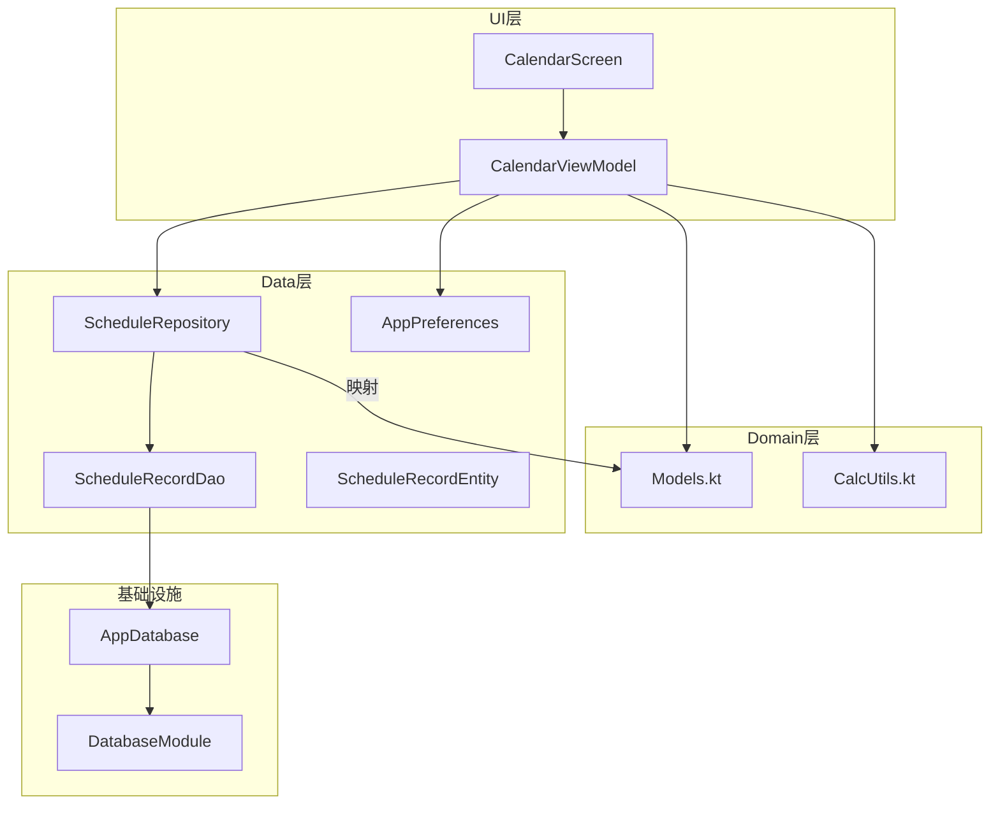
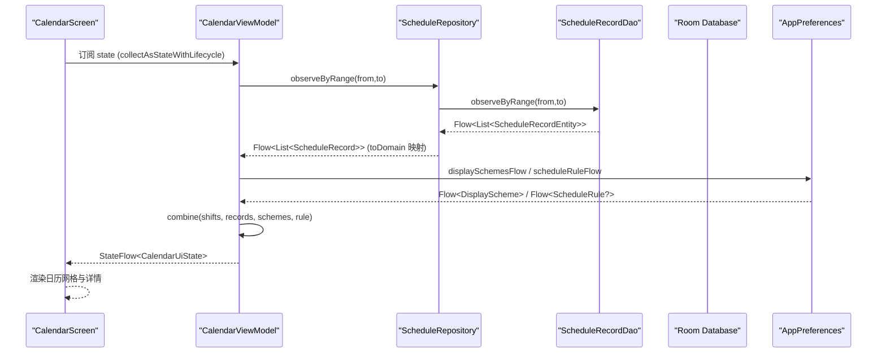
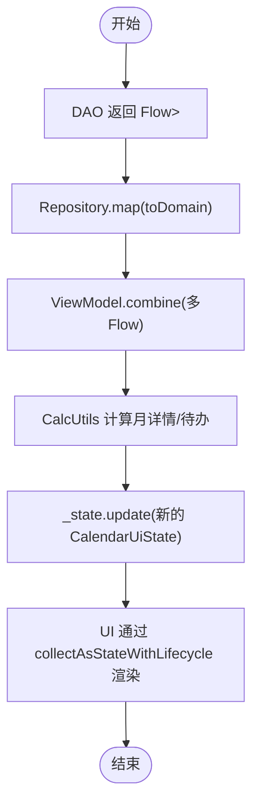
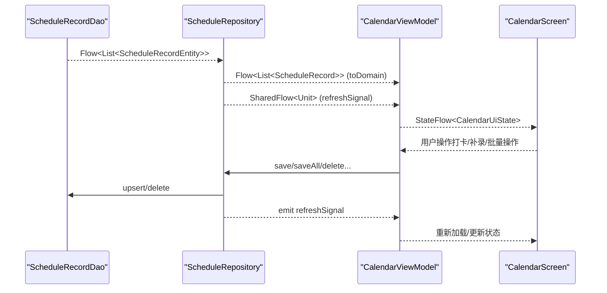
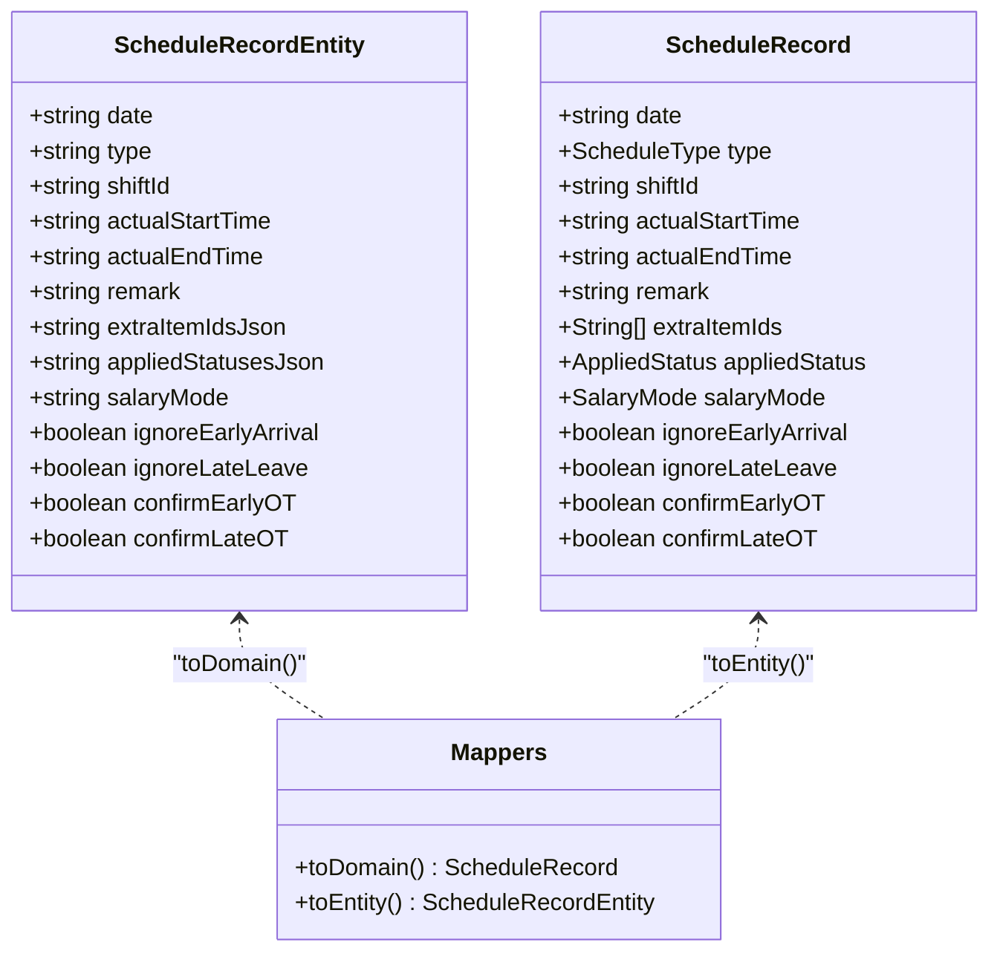
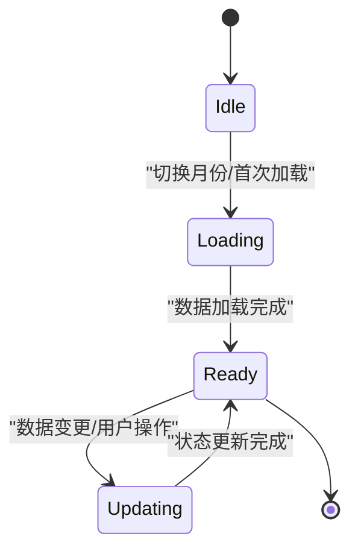
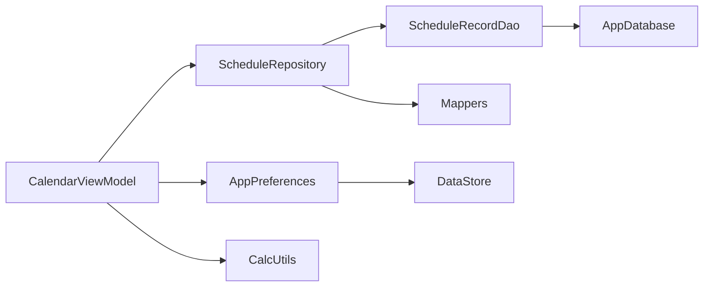

# 数据流管理

<cite>
**本文引用的文件**   
- [Mappers.kt](file://app/src/main/java/com/schedulecalendar/app/data/repository/Mappers.kt)
- [Models.kt](file://app/src/main/java/com/schedulecalendar/app/domain/model/Models.kt)
- [ScheduleRecordEntity.kt](file://app/src/main/java/com/schedulecalendar/app/data/db/entity/ScheduleRecordEntity.kt)
- [ScheduleRepository.kt](file://app/src/main/java/com/schedulecalendar/app/data/repository/ScheduleRepository.kt)
- [ScheduleRecordDao.kt](file://app/src/main/java/com/schedulecalendar/app/data/db/dao/ScheduleRecordDao.kt)
- [AppDatabase.kt](file://app/src/main/java/com/schedulecalendar/app/data/db/AppDatabase.kt)
- [DatabaseModule.kt](file://app/src/main/java/com/schedulecalendar/app/di/DatabaseModule.kt)
- [CalendarViewModel.kt](file://app/src/main/java/com/schedulecalendar/app/ui/calendar/CalendarViewModel.kt)
- [CalendarScreen.kt](file://app/src/main/java/com/schedulecalendar/app/ui/calendar/CalendarScreen.kt)
- [CalcUtils.kt](file://app/src/main/java/com/schedulecalendar/app/domain/model/CalcUtils.kt)
- [AppPreferences.kt](file://app/src/main/java/com/schedulecalendar/app/data/prefs/AppPreferences.kt)
</cite>

## 目录
1. [引言](#引言)
2. [项目结构](#项目结构)
3. [核心组件](#核心组件)
4. [架构总览](#架构总览)
5. [详细组件分析](#详细组件分析)
6. [依赖关系分析](#依赖关系分析)
7. [性能考量](#性能考量)
8. [问题排查指南](#问题排查指南)
9. [结论](#结论)
10. [附录](#附录)

## 引言
本文件围绕应用的数据流管理展开，重点阐述 Coroutines 与 Flow 在异步数据处理中的应用，覆盖数据流的创建、转换与收集；梳理 Repository 层的数据流向（从数据源到 ViewModel 再到 UI）；说明实体类与领域模型之间的映射转换机制；解释状态管理策略（StateFlow 的使用与状态同步）；并提供构建与优化数据流的实践要点、数据流图与问题排查指南。

## 项目结构
本项目采用分层架构：
- UI 层（Compose Screen + ViewModel）：负责用户交互与状态展示
- Domain 层（领域模型与计算工具）：封装业务规则与计算逻辑
- Data 层（Repository、DAO、Entity、Preferences）：负责数据访问与持久化
- DI 模块：提供数据库与 DAO 的依赖注入

**图表来源** 
- [CalendarViewModel.kt](file://app/src/main/java/com/schedulecalendar/app/ui/calendar/CalendarViewModel.kt)
- [CalendarScreen.kt](file://app/src/main/java/com/schedulecalendar/app/ui/calendar/CalendarScreen.kt)
- [ScheduleRepository.kt](file://app/src/main/java/com/schedulecalendar/app/data/repository/ScheduleRepository.kt)
- [ScheduleRecordDao.kt](file://app/src/main/java/com/schedulecalendar/app/data/db/dao/ScheduleRecordDao.kt)
- [AppDatabase.kt](file://app/src/main/java/com/schedulecalendar/app/data/db/AppDatabase.kt)
- [DatabaseModule.kt](file://app/src/main/java/com/schedulecalendar/app/di/DatabaseModule.kt)
- [Models.kt](file://app/src/main/java/com/schedulecalendar/app/domain/model/Models.kt)
- [CalcUtils.kt](file://app/src/main/java/com/schedulecalendar/app/domain/model/CalcUtils.kt)
- [AppPreferences.kt](file://app/src/main/java/com/schedulecalendar/app/data/prefs/AppPreferences.kt)

**章节来源**
- [AppDatabase.kt:17-34](file://app/src/main/java/com/schedulecalendar/app/data/db/AppDatabase.kt#L17-L34)
- [DatabaseModule.kt:21-34](file://app/src/main/java/com/schedulecalendar/app/di/DatabaseModule.kt#L21-L34)

## 核心组件
- 领域模型与计算工具：Models.kt 定义班次、排班记录、薪资配置等；CalcUtils.kt 实现工时与薪资计算、时间处理、周末/节假日判断等。
- 数据访问层：ScheduleRecordDao 暴露 Room 查询与变更流；ScheduleRepository 聚合 DAO 并对外暴露 Flow 与 suspend 方法，同时承担 Entity ↔ Domain 的映射。
- 状态管理与 UI：CalendarViewModel 使用 MutableStateFlow 维护 UI 状态，通过 combine 组合多个 Flow，统一刷新 UI；CalendarScreen 以 collectAsStateWithLifecycle 订阅状态。
- 偏好设置：AppPreferences 基于 DataStore 暴露 Flow 供 ViewModel 组合消费。

**章节来源**
- [Models.kt:1-278](file://app/src/main/java/com/schedulecalendar/app/domain/model/Models.kt#L1-L278)
- [CalcUtils.kt:1-557](file://app/src/main/java/com/schedulecalendar/app/domain/model/CalcUtils.kt#L1-L557)
- [ScheduleRecordDao.kt:1-40](file://app/src/main/java/com/schedulecalendar/app/data/db/dao/ScheduleRecordDao.kt#L1-L40)
- [ScheduleRepository.kt:1-40](file://app/src/main/java/com/schedulecalendar/app/data/repository/ScheduleRepository.kt#L1-L40)
- [CalendarViewModel.kt:118-246](file://app/src/main/java/com/schedulecalendar/app/ui/calendar/CalendarViewModel.kt#L118-L246)
- [CalendarScreen.kt:54-77](file://app/src/main/java/com/schedulecalendar/app/ui/calendar/CalendarScreen.kt#L54-L77)
- [AppPreferences.kt:69-103](file://app/src/main/java/com/schedulecalendar/app/data/prefs/AppPreferences.kt#L69-L103)

## 架构总览
下图展示了从数据源到 UI 的完整数据流，包括 Flow 的组合与转换、Repository 的映射、ViewModel 的状态更新以及 UI 的响应式渲染。

**图表来源** 
- [CalendarViewModel.kt:173-246](file://app/src/main/java/com/schedulecalendar/app/ui/calendar/CalendarViewModel.kt#L173-L246)
- [ScheduleRepository.kt:22-35](file://app/src/main/java/com/schedulecalendar/app/data/repository/ScheduleRepository.kt#L22-L35)
- [ScheduleRecordDao.kt:19-21](file://app/src/main/java/com/schedulecalendar/app/data/db/dao/ScheduleRecordDao.kt#L19-L21)
- [AppPreferences.kt:93-103](file://app/src/main/java/com/schedulecalendar/app/data/prefs/AppPreferences.kt#L93-L103)

## 详细组件分析

### 数据流创建与转换（Coroutines 与 Flow）
- DAO 层返回 Flow<List<Entity>>，Room 自动监听表变化并推送新值。
- Repository 层对 DAO 的 Flow 进行 map 转换，将 Entity 列表映射为 Domain 对象列表，屏蔽底层存储细节。
- ViewModel 层使用 combine 组合多个 Flow（班次、排班记录、显示方案、排班规则），统一计算当月详情与待办事项，再写入 StateFlow。
- UI 层通过 collectAsStateWithLifecycle 订阅 StateFlow，保证生命周期安全且避免内存泄漏。

**图表来源** 
- [ScheduleRecordDao.kt:10-21](file://app/src/main/java/com/schedulecalendar/app/data/db/dao/ScheduleRecordDao.kt#L10-L21)
- [ScheduleRepository.kt:22-35](file://app/src/main/java/com/schedulecalendar/app/data/repository/ScheduleRepository.kt#L22-L35)
- [CalendarViewModel.kt:173-246](file://app/src/main/java/com/schedulecalendar/app/ui/calendar/CalendarViewModel.kt#L173-L246)
- [CalcUtils.kt:448-486](file://app/src/main/java/com/schedulecalendar/app/domain/model/CalcUtils.kt#L448-L486)

**章节来源**
- [ScheduleRecordDao.kt:10-21](file://app/src/main/java/com/schedulecalendar/app/data/db/dao/ScheduleRecordDao.kt#L10-L21)
- [ScheduleRepository.kt:22-35](file://app/src/main/java/com/schedulecalendar/app/data/repository/ScheduleRepository.kt#L22-L35)
- [CalendarViewModel.kt:173-246](file://app/src/main/java/com/schedulecalendar/app/ui/calendar/CalendarViewModel.kt#L173-L246)

### Repository 层数据流向（数据源 → ViewModel → UI）
- 数据源：Room 数据库通过 DAO 暴露 Flow，支持按月份或日期范围观察数据。
- Repository：封装 DAO 调用，提供 observeByRange/getByMonth 等方法，并在写操作后发出 refreshSignal（SharedFlow）通知相关页面刷新。
- ViewModel：订阅 Repository 的 Flow，结合 Preferences 的配置，计算并更新 StateFlow。
- UI：订阅 ViewModel 的 StateFlow，响应式更新界面。

**图表来源** 
- [ScheduleRecordDao.kt:22-38](file://app/src/main/java/com/schedulecalendar/app/data/db/dao/ScheduleRecordDao.kt#L22-L38)
- [ScheduleRepository.kt:17-39](file://app/src/main/java/com/schedulecalendar/app/data/repository/ScheduleRepository.kt#L17-L39)
- [CalendarViewModel.kt:475-502](file://app/src/main/java/com/schedulecalendar/app/ui/calendar/CalendarViewModel.kt#L475-L502)

**章节来源**
- [ScheduleRepository.kt:17-39](file://app/src/main/java/com/schedulecalendar/app/data/repository/ScheduleRepository.kt#L17-L39)
- [CalendarViewModel.kt:475-502](file://app/src/main/java/com/schedulecalendar/app/ui/calendar/CalendarViewModel.kt#L475-L502)

### 实体类与领域模型的映射转换机制
- Mappers.kt 定义了 Entity 与 Domain 的双向转换扩展函数，如 ShiftEntity.toDomain()、ScheduleRecordEntity.toDomain() 等。
- 复杂字段（如 JSON 数组）通过 Gson 解析/序列化，确保兼容旧版与新格式。
- Repository 层在返回 Flow 或 suspend 结果时统一调用 toDomain/toEntity，保持数据层与领域层的解耦。

**图表来源** 
- [ScheduleRecordEntity.kt:8-25](file://app/src/main/java/com/schedulecalendar/app/data/db/entity/ScheduleRecordEntity.kt#L8-L25)
- [Models.kt:82-101](file://app/src/main/java/com/schedulecalendar/app/domain/model/Models.kt#L82-L101)
- [Mappers.kt:92-128](file://app/src/main/java/com/schedulecalendar/app/data/repository/Mappers.kt#L92-L128)

**章节来源**
- [Mappers.kt:19-48](file://app/src/main/java/com/schedulecalendar/app/data/repository/Mappers.kt#L19-L48)
- [Mappers.kt:92-128](file://app/src/main/java/com/schedulecalendar/app/data/repository/Mappers.kt#L92-L128)

### 状态管理策略（StateFlow 与状态同步）
- ViewModel 内部使用 MutableStateFlow 保存 UI 状态，并通过 asStateFlow 暴露只读视图。
- 使用 Channel 或 SharedFlow 传递一次性事件（如导航、消息提示）。
- 切月时取消旧的 collectJob 再启动新的协程，防止 collector 累积导致内存泄漏。
- 通过 combine 组合多个 Flow，确保数据一致性，并在任意上游变化时触发重算与 UI 更新。

**图表来源** 
- [CalendarViewModel.kt:131-151](file://app/src/main/java/com/schedulecalendar/app/ui/calendar/CalendarViewModel.kt#L131-L151)
- [CalendarViewModel.kt:153-246](file://app/src/main/java/com/schedulecalendar/app/ui/calendar/CalendarViewModel.kt#L153-L246)

**章节来源**
- [CalendarViewModel.kt:131-151](file://app/src/main/java/com/schedulecalendar/app/ui/calendar/CalendarViewModel.kt#L131-L151)
- [CalendarViewModel.kt:153-246](file://app/src/main/java/com/schedulecalendar/app/ui/calendar/CalendarViewModel.kt#L153-L246)

### 具体代码示例与优化技巧
- 数据流构建：
  - 使用 observeByRange 获取跨月数据，map 转换为 Domain 对象。
  - 使用 combine 组合班次、排班记录、显示方案、排班规则，统一计算。
- 性能优化：
  - 仅在首次加载时显示 loading，后续刷新保持现有内容，避免闪烁。
  - 使用 withContext(Dispatchers.IO) 执行 IO 密集型任务（如日历事件过滤）。
  - 合理设置 SharedFlow 的缓冲区容量，避免背压问题。
- 错误处理：
  - 使用 runCatching 包裹可能失败的操作，捕获异常并发送错误事件。
  - 对 JSON 解析使用 try-catch，兼容旧格式与新格式。

**章节来源**
- [ScheduleRepository.kt:22-35](file://app/src/main/java/com/schedulecalendar/app/data/repository/ScheduleRepository.kt#L22-L35)
- [CalendarViewModel.kt:416-473](file://app/src/main/java/com/schedulecalendar/app/ui/calendar/CalendarViewModel.kt#L416-L473)
- [Mappers.kt:69-88](file://app/src/main/java/com/schedulecalendar/app/data/repository/Mappers.kt#L69-L88)

## 依赖关系分析
- ViewModel 依赖 Repository、Preferences、计算工具等。
- Repository 依赖 DAO 和 Mapper。
- DAO 依赖 Room 数据库。
- Preferences 依赖 DataStore。

**图表来源** 
- [CalendarViewModel.kt:118-129](file://app/src/main/java/com/schedulecalendar/app/ui/calendar/CalendarViewModel.kt#L118-L129)
- [ScheduleRepository.kt:14-16](file://app/src/main/java/com/schedulecalendar/app/data/repository/ScheduleRepository.kt#L14-L16)
- [AppPreferences.kt:26-28](file://app/src/main/java/com/schedulecalendar/app/data/prefs/AppPreferences.kt#L26-L28)

**章节来源**
- [CalendarViewModel.kt:118-129](file://app/src/main/java/com/schedulecalendar/app/ui/calendar/CalendarViewModel.kt#L118-L129)
- [ScheduleRepository.kt:14-16](file://app/src/main/java/com/schedulecalendar/app/data/repository/ScheduleRepository.kt#L14-L16)
- [AppPreferences.kt:26-28](file://app/src/main/java/com/schedulecalendar/app/data/prefs/AppPreferences.kt#L26-L28)

## 性能考量
- 使用 Flow 的 map 和 combine 进行数据转换与组合，避免不必要的重复计算。
- 在 ViewModel 中合理使用 Job 管理协程生命周期，防止内存泄漏。
- 对于大数据集（如月度详情），考虑分页或懒加载。
- 使用 withContext(Dispatchers.IO) 将阻塞操作移出主线程。

[本节为通用指导，无需特定文件引用]

## 问题排查指南
- 数据不更新：
  - 检查 DAO 是否返回 Flow，Repository 是否正确映射。
  - 确认 ViewModel 是否正确组合 Flow 并更新 StateFlow。
- 内存泄漏：
  - 检查 collectJob 是否在切月时取消。
  - 确保 UI 层使用 collectAsStateWithLifecycle 而非 collect。
- 数据不一致：
  - 检查 combine 的输入 Flow 是否包含所有必要数据源。
  - 确认 Repository 的 refreshSignal 是否在写操作后正确发出。
- 性能问题：
  - 检查是否有频繁的 JSON 解析或数据库查询。
  - 考虑缓存热点数据或使用更高效的查询方式。

**章节来源**
- [CalendarViewModel.kt:153-246](file://app/src/main/java/com/schedulecalendar/app/ui/calendar/CalendarViewModel.kt#L153-L246)
- [ScheduleRepository.kt:17-39](file://app/src/main/java/com/schedulecalendar/app/data/repository/ScheduleRepository.kt#L17-L39)

## 结论
本项目通过 Coroutines 与 Flow 构建了清晰、可维护的数据流架构。Repository 层有效隔离了数据源与业务逻辑，ViewModel 层统一管理状态与业务逻辑，UI 层通过响应式编程实现高效渲染。实体与领域模型的映射机制确保了数据的一致性与可测试性。整体设计符合现代 Android 开发的最佳实践，具备良好的可扩展性与可维护性。

[本节为总结性内容，无需特定文件引用]

## 附录
- 关键术语：
  - Flow：Kotlin 协程中的异步数据流
  - StateFlow：可观察的状态流，用于 UI 状态管理
  - SharedFlow：共享流，用于事件广播
  - Room：Android 官方数据库框架
  - DataStore：Android 官方数据存储解决方案

[本节为术语解释，无需特定文件引用]