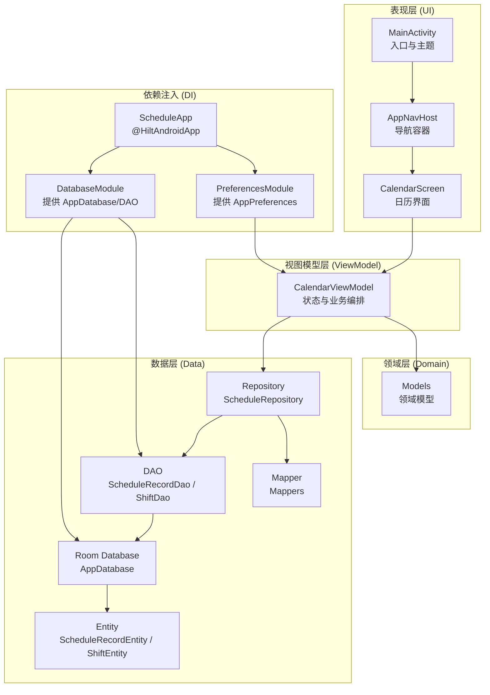
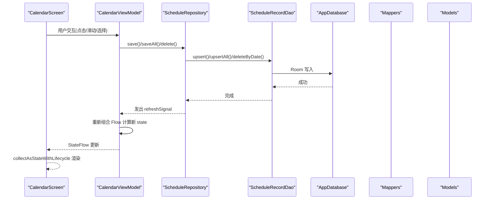
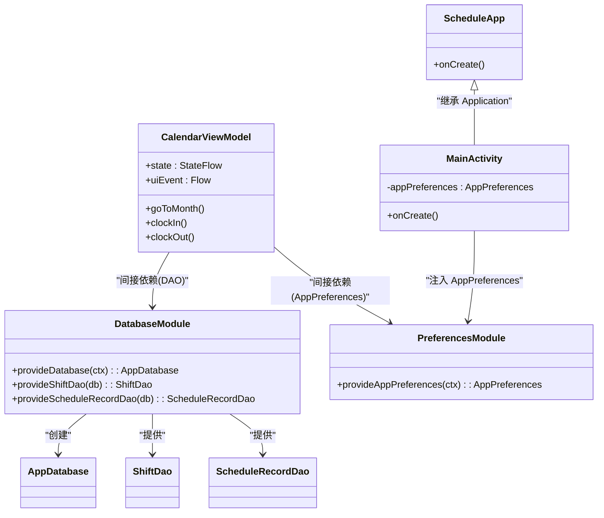
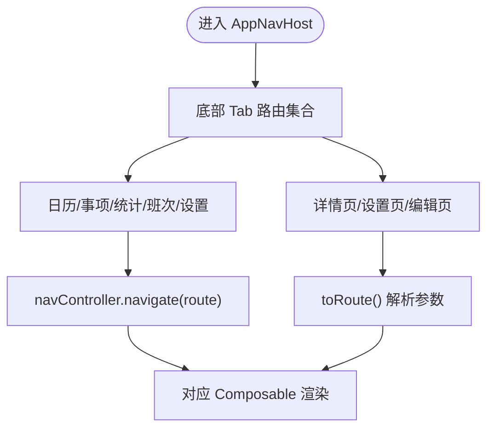
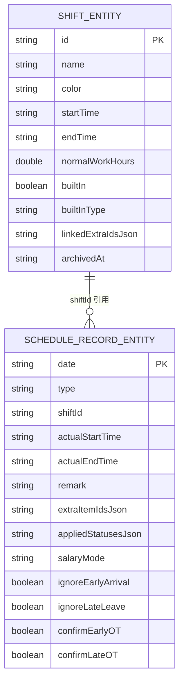
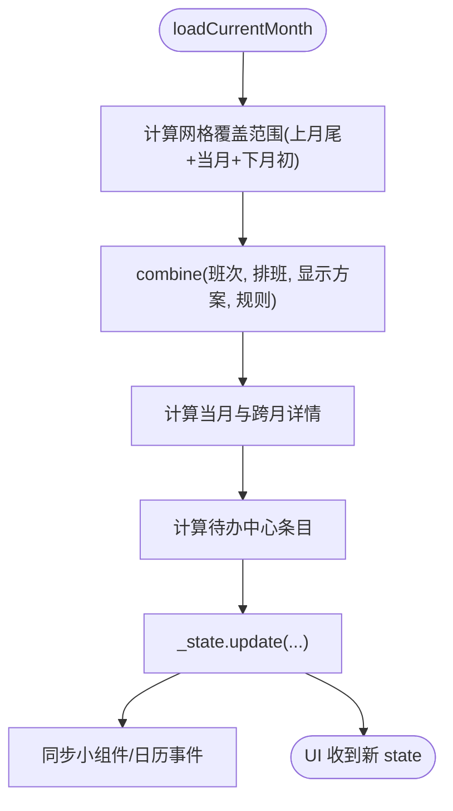
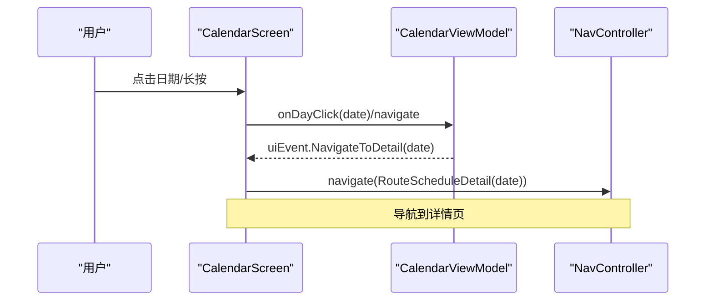
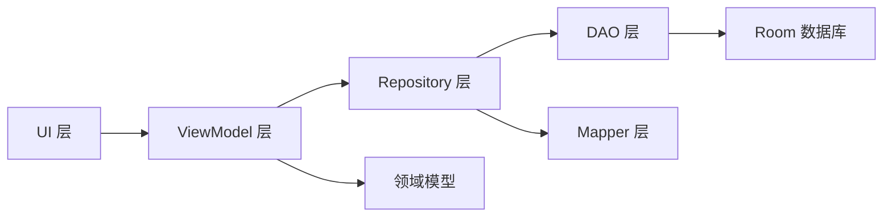

# 架构设计

<cite>
**本文引用的文件**   
- [ScheduleApp.kt](file://app/src/main/java/com/schedulecalendar/app/ScheduleApp.kt)
- [MainActivity.kt](file://app/src/main/java/com/schedulecalendar/app/MainActivity.kt)
- [AppNavHost.kt](file://app/src/main/java/com/schedulecalendar/app/ui/navigation/AppNavHost.kt)
- [Screen.kt](file://app/src/main/java/com/schedulecalendar/app/ui/navigation/Screen.kt)
- [DatabaseModule.kt](file://app/src/main/java/com/schedulecalendar/app/di/DatabaseModule.kt)
- [PreferencesModule.kt](file://app/src/main/java/com/schedulecalendar/app/di/PreferencesModule.kt)
- [AppDatabase.kt](file://app/src/main/java/com/schedulecalendar/app/data/db/AppDatabase.kt)
- [ShiftDao.kt](file://app/src/main/java/com/schedulecalendar/app/data/db/dao/ShiftDao.kt)
- [ScheduleRecordDao.kt](file://app/src/main/java/com/schedulecalendar/app/data/db/dao/ScheduleRecordDao.kt)
- [ShiftEntity.kt](file://app/src/main/java/com/schedulecalendar/app/data/db/entity/ShiftEntity.kt)
- [ScheduleRecordEntity.kt](file://app/src/main/java/com/schedulecalendar/app/data/db/entity/ScheduleRecordEntity.kt)
- [Mappers.kt](file://app/src/main/java/com/schedulecalendar/app/data/repository/Mappers.kt)
- [ScheduleRepository.kt](file://app/src/main/java/com/schedulecalendar/app/data/repository/ScheduleRepository.kt)
- [Models.kt](file://app/src/main/java/com/schedulecalendar/app/domain/model/Models.kt)
- [CalendarViewModel.kt](file://app/src/main/java/com/schedulecalendar/app/ui/calendar/CalendarViewModel.kt)
- [CalendarScreen.kt](file://app/src/main/java/com/schedulecalendar/app/ui/calendar/CalendarScreen.kt)
</cite>

## 目录
1. [简介](#简介)
2. [项目结构](#项目结构)
3. [核心组件](#核心组件)
4. [架构总览](#架构总览)
5. [详细组件分析](#详细组件分析)
6. [依赖关系分析](#依赖关系分析)
7. [性能考量](#性能考量)
8. [故障排查指南](#故障排查指南)
9. [结论](#结论)
10. [附录](#附录)

## 简介
本文件面向 Android 排班日历应用的系统架构，围绕 MVVM + Clean Architecture 的分层设计展开，重点说明：
- View 层使用 Jetpack Compose 进行声明式 UI 构建与状态收集
- ViewModel 层负责状态管理、业务编排与副作用处理
- Repository 层抽象数据访问，统一 DAO 与外部数据源
- Hilt 依赖注入的配置与使用
- 单向数据流（StateFlow/Flow）驱动 UI 更新
- 导航系统设计（类型安全路由）、组件通信机制、错误处理策略
- 提供架构图与数据流图，帮助开发者快速理解整体设计思路

## 项目结构
应用采用按功能域与分层组织的方式：
- app/src/main/java/com/schedulecalendar/app
  - data: 数据层（Room 数据库、DAO、实体、偏好设置、仓库）
  - domain: 领域模型与工具（班次、记录、薪资配置等）
  - ui: 表现层（Compose 屏幕、导航、主题、组件）
  - di: 依赖注入模块（Hilt Module）
  - widget/reminder 等扩展能力

图表来源
- [MainActivity.kt:1-105](file://app/src/main/java/com/schedulecalendar/app/MainActivity.kt#L1-L105)
- [AppNavHost.kt:1-133](file://app/src/main/java/com/schedulecalendar/app/ui/navigation/AppNavHost.kt#L1-L133)
- [CalendarScreen.kt:1-800](file://app/src/main/java/com/schedulecalendar/app/ui/calendar/CalendarScreen.kt#L1-L800)
- [CalendarViewModel.kt:1-800](file://app/src/main/java/com/schedulecalendar/app/ui/calendar/CalendarViewModel.kt#L1-L800)
- [ScheduleRepository.kt:1-40](file://app/src/main/java/com/schedulecalendar/app/data/repository/ScheduleRepository.kt#L1-L40)
- [AppDatabase.kt:1-35](file://app/src/main/java/com/schedulecalendar/app/data/db/AppDatabase.kt#L1-L35)
- [ScheduleRecordDao.kt:1-40](file://app/src/main/java/com/schedulecalendar/app/data/db/dao/ScheduleRecordDao.kt#L1-L40)
- [ShiftDao.kt:1-42](file://app/src/main/java/com/schedulecalendar/app/data/db/dao/ShiftDao.kt#L1-L42)
- [Mappers.kt:1-134](file://app/src/main/java/com/schedulecalendar/app/data/repository/Mappers.kt#L1-L134)
- [DatabaseModule.kt:1-35](file://app/src/main/java/com/schedulecalendar/app/di/DatabaseModule.kt#L1-L35)
- [PreferencesModule.kt:1-21](file://app/src/main/java/com/schedulecalendar/app/di/PreferencesModule.kt#L1-L21)
- [ScheduleApp.kt:1-9](file://app/src/main/java/com/schedulecalendar/app/ScheduleApp.kt#L1-L9)

章节来源
- [MainActivity.kt:1-105](file://app/src/main/java/com/schedulecalendar/app/MainActivity.kt#L1-L105)
- [AppNavHost.kt:1-133](file://app/src/main/java/com/schedulecalendar/app/ui/navigation/AppNavHost.kt#L1-L133)
- [CalendarScreen.kt:1-800](file://app/src/main/java/com/schedulecalendar/app/ui/calendar/CalendarScreen.kt#L1-L800)
- [CalendarViewModel.kt:1-800](file://app/src/main/java/com/schedulecalendar/app/ui/calendar/CalendarViewModel.kt#L1-L800)
- [ScheduleRepository.kt:1-40](file://app/src/main/java/com/schedulecalendar/app/data/repository/ScheduleRepository.kt#L1-L40)
- [AppDatabase.kt:1-35](file://app/src/main/java/com/schedulecalendar/app/data/db/AppDatabase.kt#L1-L35)
- [ScheduleRecordDao.kt:1-40](file://app/src/main/java/com/schedulecalendar/app/data/db/dao/ScheduleRecordDao.kt#L1-L40)
- [ShiftDao.kt:1-42](file://app/src/main/java/com/schedulecalendar/app/data/db/dao/ShiftDao.kt#L1-L42)
- [Mappers.kt:1-134](file://app/src/main/java/com/schedulecalendar/app/data/repository/Mappers.kt#L1-L134)
- [DatabaseModule.kt:1-35](file://app/src/main/java/com/schedulecalendar/app/di/DatabaseModule.kt#L1-L35)
- [PreferencesModule.kt:1-21](file://app/src/main/java/com/schedulecalendar/app/di/PreferencesModule.kt#L1-L21)
- [ScheduleApp.kt:1-9](file://app/src/main/java/com/schedulecalendar/app/ScheduleApp.kt#L1-L9)

## 核心组件
- 应用入口与 DI 初始化
  - ScheduleApp 标注 @HiltAndroidApp，启动 Hilt 编译期生成代码
  - MainActivity 通过 @AndroidEntryPoint 注入 AppPreferences，并承载 Compose 根节点与导航容器
- 导航系统
  - AppNavHost 定义底部 Tab 与子页面路由，使用类型安全的 Serializable 路由对象
  - Screen.kt 集中定义所有路由（object 无参、data class 带参）
- 数据层
  - AppDatabase 暴露多个 DAO；DatabaseModule 提供单例数据库与 DAO
  - PreferencesModule 提供 AppPreferences 单例
  - Repository 封装 DAO 调用，返回 Flow/List，并在写操作后发出刷新信号
  - Mappers 负责 Entity 与 Domain 模型的互转
- 领域层
  - Models.kt 定义班次、记录、薪资配置、显示方案等核心领域模型
- 视图模型层
  - CalendarViewModel 聚合多仓库依赖，组合 Flow 计算当月详情、待办、同步小组件与日历事件
- 表现层
  - CalendarScreen 使用 hiltViewModel() 获取 VM，collectAsStateWithLifecycle 收集 state，并通过 Channel 消费 uiEvent 触发导航或提示

章节来源
- [ScheduleApp.kt:1-9](file://app/src/main/java/com/schedulecalendar/app/ScheduleApp.kt#L1-L9)
- [MainActivity.kt:1-105](file://app/src/main/java/com/schedulecalendar/app/MainActivity.kt#L1-L105)
- [AppNavHost.kt:1-133](file://app/src/main/java/com/schedulecalendar/app/ui/navigation/AppNavHost.kt#L1-L133)
- [Screen.kt:1-34](file://app/src/main/java/com/schedulecalendar/app/ui/navigation/Screen.kt#L1-L34)
- [DatabaseModule.kt:1-35](file://app/src/main/java/com/schedulecalendar/app/di/DatabaseModule.kt#L1-L35)
- [PreferencesModule.kt:1-21](file://app/src/main/java/com/schedulecalendar/app/di/PreferencesModule.kt#L1-L21)
- [AppDatabase.kt:1-35](file://app/src/main/java/com/schedulecalendar/app/data/db/AppDatabase.kt#L1-L35)
- [ScheduleRepository.kt:1-40](file://app/src/main/java/com/schedulecalendar/app/data/repository/ScheduleRepository.kt#L1-L40)
- [Mappers.kt:1-134](file://app/src/main/java/com/schedulecalendar/app/data/repository/Mappers.kt#L1-L134)
- [Models.kt:1-277](file://app/src/main/java/com/schedulecalendar/app/domain/model/Models.kt#L1-L277)
- [CalendarViewModel.kt:1-800](file://app/src/main/java/com/schedulecalendar/app/ui/calendar/CalendarViewModel.kt#L1-L800)
- [CalendarScreen.kt:1-800](file://app/src/main/java/com/schedulecalendar/app/ui/calendar/CalendarScreen.kt#L1-L800)

## 架构总览
下图展示从 UI 到数据的单向数据流与职责边界。View 仅订阅状态与消费事件；ViewModel 编排业务逻辑；Repository 屏蔽数据源细节；DAO 直接操作 Room；Domain 模型贯穿各层。

图表来源
- [CalendarScreen.kt:1-800](file://app/src/main/java/com/schedulecalendar/app/ui/calendar/CalendarScreen.kt#L1-L800)
- [CalendarViewModel.kt:1-800](file://app/src/main/java/com/schedulecalendar/app/ui/calendar/CalendarViewModel.kt#L1-L800)
- [ScheduleRepository.kt:1-40](file://app/src/main/java/com/schedulecalendar/app/data/repository/ScheduleRepository.kt#L1-L40)
- [ScheduleRecordDao.kt:1-40](file://app/src/main/java/com/schedulecalendar/app/data/db/dao/ScheduleRecordDao.kt#L1-L40)
- [AppDatabase.kt:1-35](file://app/src/main/java/com/schedulecalendar/app/data/db/AppDatabase.kt#L1-L35)
- [Mappers.kt:1-134](file://app/src/main/java/com/schedulecalendar/app/data/repository/Mappers.kt#L1-L134)
- [Models.kt:1-277](file://app/src/main/java/com/schedulecalendar/app/domain/model/Models.kt#L1-L277)

## 详细组件分析

### 依赖注入（Hilt）
- 应用级初始化
  - ScheduleApp 标注 @HiltAndroidApp，启用 Hilt 注解处理器
- 模块与提供者
  - DatabaseModule 提供 AppDatabase 单例与各 DAO 实例
  - PreferencesModule 提供 AppPreferences 单例
- 组件注入
  - MainActivity 通过 @AndroidEntryPoint 注入 AppPreferences
  - CalendarViewModel 通过 @HiltViewModel 注入多仓库与上下文

图表来源
- [ScheduleApp.kt:1-9](file://app/src/main/java/com/schedulecalendar/app/ScheduleApp.kt#L1-L9)
- [MainActivity.kt:1-105](file://app/src/main/java/com/schedulecalendar/app/MainActivity.kt#L1-L105)
- [DatabaseModule.kt:1-35](file://app/src/main/java/com/schedulecalendar/app/di/DatabaseModule.kt#L1-L35)
- [PreferencesModule.kt:1-21](file://app/src/main/java/com/schedulecalendar/app/di/PreferencesModule.kt#L1-L21)
- [CalendarViewModel.kt:1-800](file://app/src/main/java/com/schedulecalendar/app/ui/calendar/CalendarViewModel.kt#L1-L800)

章节来源
- [ScheduleApp.kt:1-9](file://app/src/main/java/com/schedulecalendar/app/ScheduleApp.kt#L1-L9)
- [MainActivity.kt:1-105](file://app/src/main/java/com/schedulecalendar/app/MainActivity.kt#L1-L105)
- [DatabaseModule.kt:1-35](file://app/src/main/java/com/schedulecalendar/app/di/DatabaseModule.kt#L1-L35)
- [PreferencesModule.kt:1-21](file://app/src/main/java/com/schedulecalendar/app/di/PreferencesModule.kt#L1-L21)
- [CalendarViewModel.kt:1-800](file://app/src/main/java/com/schedulecalendar/app/ui/calendar/CalendarViewModel.kt#L1-L800)

### 导航系统
- 路由定义
  - Screen.kt 使用 @Serializable 定义 object 与 data class 路由，实现类型安全
- 导航容器
  - AppNavHost 维护底部 Tab 与子页面，支持状态保存与恢复
  - 主路由包含日历、事项、统计、班次、设置；子路由包含详情、设置页、编辑页等
- 参数传递
  - 子页面通过 backStackEntry.toRoute<T>() 读取参数

图表来源
- [AppNavHost.kt:1-133](file://app/src/main/java/com/schedulecalendar/app/ui/navigation/AppNavHost.kt#L1-L133)
- [Screen.kt:1-34](file://app/src/main/java/com/schedulecalendar/app/ui/navigation/Screen.kt#L1-L34)

章节来源
- [AppNavHost.kt:1-133](file://app/src/main/java/com/schedulecalendar/app/ui/navigation/AppNavHost.kt#L1-L133)
- [Screen.kt:1-34](file://app/src/main/java/com/schedulecalendar/app/ui/navigation/Screen.kt#L1-L34)

### 数据层与领域模型
- 数据库与 DAO
  - AppDatabase 声明实体与版本，导出 schema
  - ScheduleRecordDao/ShiftDao 提供按月/范围查询的 Flow 与一次性查询
- 映射器
  - Mappers 将 Entity 与 Domain 模型互转，兼容 JSON 字段格式
- 仓库
  - ScheduleRepository 封装 DAO 调用，对外暴露 Flow<List<ScheduleRecord>> 与写操作的刷新信号

图表来源
- [AppDatabase.kt:1-35](file://app/src/main/java/com/schedulecalendar/app/data/db/AppDatabase.kt#L1-L35)
- [ShiftEntity.kt:1-24](file://app/src/main/java/com/schedulecalendar/app/data/db/entity/ShiftEntity.kt#L1-L24)
- [ScheduleRecordEntity.kt:1-26](file://app/src/main/java/com/schedulecalendar/app/data/db/entity/ScheduleRecordEntity.kt#L1-L26)
- [ScheduleRecordDao.kt:1-40](file://app/src/main/java/com/schedulecalendar/app/data/db/dao/ScheduleRecordDao.kt#L1-L40)
- [ShiftDao.kt:1-42](file://app/src/main/java/com/schedulecalendar/app/data/db/dao/ShiftDao.kt#L1-L42)
- [Mappers.kt:1-134](file://app/src/main/java/com/schedulecalendar/app/data/repository/Mappers.kt#L1-L134)
- [Models.kt:1-277](file://app/src/main/java/com/schedulecalendar/app/domain/model/Models.kt#L1-L277)

章节来源
- [AppDatabase.kt:1-35](file://app/src/main/java/com/schedulecalendar/app/data/db/AppDatabase.kt#L1-L35)
- [ShiftEntity.kt:1-24](file://app/src/main/java/com/schedulecalendar/app/data/db/entity/ShiftEntity.kt#L1-L24)
- [ScheduleRecordEntity.kt:1-26](file://app/src/main/java/com/schedulecalendar/app/data/db/entity/ScheduleRecordEntity.kt#L1-L26)
- [ScheduleRecordDao.kt:1-40](file://app/src/main/java/com/schedulecalendar/app/data/db/dao/ScheduleRecordDao.kt#L1-L40)
- [ShiftDao.kt:1-42](file://app/src/main/java/com/schedulecalendar/app/data/db/dao/ShiftDao.kt#L1-L42)
- [Mappers.kt:1-134](file://app/src/main/java/com/schedulecalendar/app/data/repository/Mappers.kt#L1-L134)
- [Models.kt:1-277](file://app/src/main/java/com/schedulecalendar/app/domain/model/Models.kt#L1-L277)

### 视图模型与状态管理
- 状态模型
  - CalendarUiState 包含月份、班次、排班记录、显示方案、工时详情、待办、批量/复制模式、附加项、选中日期事件等
- 事件模型
  - CalendarUiEvent 用于导航与消息提示
- 数据流
  - combine 多 Flow（班次、排班、显示方案、规则）计算当月详情与跨月填充
  - 写操作后通过 SharedFlow 通知刷新，ViewModel 重新组合数据并更新 state
- 业务逻辑
  - 打卡、补录、加班确认/忽略、批量/复制/删除、应用排班规则等

图表来源
- [CalendarViewModel.kt:1-800](file://app/src/main/java/com/schedulecalendar/app/ui/calendar/CalendarViewModel.kt#L1-L800)

章节来源
- [CalendarViewModel.kt:1-800](file://app/src/main/java/com/schedulecalendar/app/ui/calendar/CalendarViewModel.kt#L1-L800)

### 表现层与组件通信
- 状态收集
  - CalendarScreen 使用 hiltViewModel() 获取 VM，collectAsStateWithLifecycle 收集 state
- 事件消费
  - vm.uiEvent 为 Channel 流，UI 侧 collect 后执行导航或 Snackbar 提示
- 外部输入
  - 处理快捷方式 Intent（上班/下班打卡）与小组件点击日期导航
- 交互流程
  - 点击日期 → 更新 selectedDate → 加载纪念日与日程事件 → 导航至详情页

图表来源
- [CalendarScreen.kt:1-800](file://app/src/main/java/com/schedulecalendar/app/ui/calendar/CalendarScreen.kt#L1-L800)
- [CalendarViewModel.kt:1-800](file://app/src/main/java/com/schedulecalendar/app/ui/calendar/CalendarViewModel.kt#L1-L800)
- [AppNavHost.kt:1-133](file://app/src/main/java/com/schedulecalendar/app/ui/navigation/AppNavHost.kt#L1-L133)

章节来源
- [CalendarScreen.kt:1-800](file://app/src/main/java/com/schedulecalendar/app/ui/calendar/CalendarScreen.kt#L1-L800)
- [CalendarViewModel.kt:1-800](file://app/src/main/java/com/schedulecalendar/app/ui/calendar/CalendarViewModel.kt#L1-L800)
- [AppNavHost.kt:1-133](file://app/src/main/java/com/schedulecalendar/app/ui/navigation/AppNavHost.kt#L1-L133)

## 依赖关系分析
- 耦合与内聚
  - UI 仅依赖 ViewModel 暴露的 state 与 uiEvent，低耦合
  - ViewModel 聚合多个 Repository，高内聚的业务编排
  - Repository 对 DAO 的依赖清晰，便于替换数据源
- 外部依赖
  - Room 数据库与 Flow 异步数据流
  - Hilt 提供依赖注入
  - Navigation Compose 提供类型安全路由
- 潜在循环依赖
  - 当前分层清晰，未见循环导入；Repository 不依赖 UI/ViewModel

图表来源
- [CalendarScreen.kt:1-800](file://app/src/main/java/com/schedulecalendar/app/ui/calendar/CalendarScreen.kt#L1-L800)
- [CalendarViewModel.kt:1-800](file://app/src/main/java/com/schedulecalendar/app/ui/calendar/CalendarViewModel.kt#L1-L800)
- [ScheduleRepository.kt:1-40](file://app/src/main/java/com/schedulecalendar/app/data/repository/ScheduleRepository.kt#L1-L40)
- [ScheduleRecordDao.kt:1-40](file://app/src/main/java/com/schedulecalendar/app/data/db/dao/ScheduleRecordDao.kt#L1-L40)
- [AppDatabase.kt:1-35](file://app/src/main/java/com/schedulecalendar/app/data/db/AppDatabase.kt#L1-L35)
- [Mappers.kt:1-134](file://app/src/main/java/com/schedulecalendar/app/data/repository/Mappers.kt#L1-L134)
- [Models.kt:1-277](file://app/src/main/java/com/schedulecalendar/app/domain/model/Models.kt#L1-L277)

章节来源
- [CalendarScreen.kt:1-800](file://app/src/main/java/com/schedulecalendar/app/ui/calendar/CalendarScreen.kt#L1-L800)
- [CalendarViewModel.kt:1-800](file://app/src/main/java/com/schedulecalendar/app/ui/calendar/CalendarViewModel.kt#L1-L800)
- [ScheduleRepository.kt:1-40](file://app/src/main/java/com/schedulecalendar/app/data/repository/ScheduleRepository.kt#L1-L40)
- [ScheduleRecordDao.kt:1-40](file://app/src/main/java/com/schedulecalendar/app/data/db/dao/ScheduleRecordDao.kt#L1-L40)
- [AppDatabase.kt:1-35](file://app/src/main/java/com/schedulecalendar/app/data/db/AppDatabase.kt#L1-L35)
- [Mappers.kt:1-134](file://app/src/main/java/com/schedulecalendar/app/data/repository/Mappers.kt#L1-L134)
- [Models.kt:1-277](file://app/src/main/java/com/schedulecalendar/app/domain/model/Models.kt#L1-L277)

## 性能考量
- 数据流优化
  - 使用 combine 合并多 Flow，避免重复请求；在切月时取消旧 Job，防止 collector 累积泄漏
- 列表与动画
  - 日历网格使用 LazyColumn 与 AnimatedContent 控制过渡，减少不必要的重组
- 计算复杂度
  - 当月与跨月详情计算涉及遍历与关联查找，建议保持数据量合理，必要时引入缓存或分页
- 数据库迁移
  - Room 导出 schema，便于追踪版本变更；破坏性迁移需谨慎评估影响

[本节为通用指导，无需特定文件引用]

## 故障排查指南
- 常见问题定位
  - 导航未生效：检查路由是否注册、参数是否正确解析
  - 状态不更新：确认 Flow 是否被正确收集，是否存在并发竞争或 Job 未取消
  - 数据不同步：检查 Repository 写操作后是否发出刷新信号，ViewModel 是否重新组合数据
- 日志与提示
  - 使用 uiEvent.ShowMessage/ShowError 反馈用户操作结果
  - 在关键路径添加异常捕获与回退逻辑（如日历事件加载失败返回空列表）

章节来源
- [CalendarViewModel.kt:1-800](file://app/src/main/java/com/schedulecalendar/app/ui/calendar/CalendarViewModel.kt#L1-L800)
- [CalendarScreen.kt:1-800](file://app/src/main/java/com/schedulecalendar/app/ui/calendar/CalendarScreen.kt#L1-L800)

## 结论
该应用以 MVVM + Clean Architecture 为核心，结合 Hilt 依赖注入与 Compose 声明式 UI，实现了清晰的职责划分与单向数据流。通过类型安全导航、Flow 驱动的响应式更新以及完善的错误处理策略，系统在可维护性与可扩展性方面具备良好基础。建议在后续迭代中持续优化大数据量场景下的计算与渲染性能，并完善测试覆盖。

[本节为总结性内容，无需特定文件引用]

## 附录
- 关键路径参考
  - 应用启动与 DI 初始化：[ScheduleApp.kt:1-9](file://app/src/main/java/com/schedulecalendar/app/ScheduleApp.kt#L1-L9)、[MainActivity.kt:1-105](file://app/src/main/java/com/schedulecalendar/app/MainActivity.kt#L1-L105)
  - 导航定义与容器：[Screen.kt:1-34](file://app/src/main/java/com/schedulecalendar/app/ui/navigation/Screen.kt#L1-L34)、[AppNavHost.kt:1-133](file://app/src/main/java/com/schedulecalendar/app/ui/navigation/AppNavHost.kt#L1-L133)
  - 数据层与映射：[AppDatabase.kt:1-35](file://app/src/main/java/com/schedulecalendar/app/data/db/AppDatabase.kt#L1-L35)、[ScheduleRecordDao.kt:1-40](file://app/src/main/java/com/schedulecalendar/app/data/db/dao/ScheduleRecordDao.kt#L1-L40)、[ShiftDao.kt:1-42](file://app/src/main/java/com/schedulecalendar/app/data/db/dao/ShiftDao.kt#L1-L42)、[Mappers.kt:1-134](file://app/src/main/java/com/schedulecalendar/app/data/repository/Mappers.kt#L1-L134)
  - 领域模型：[Models.kt:1-277](file://app/src/main/java/com/schedulecalendar/app/domain/model/Models.kt#L1-L277)
  - 视图模型与界面：[CalendarViewModel.kt:1-800](file://app/src/main/java/com/schedulecalendar/app/ui/calendar/CalendarViewModel.kt#L1-L800)、[CalendarScreen.kt:1-800](file://app/src/main/java/com/schedulecalendar/app/ui/calendar/CalendarScreen.kt#L1-L800)