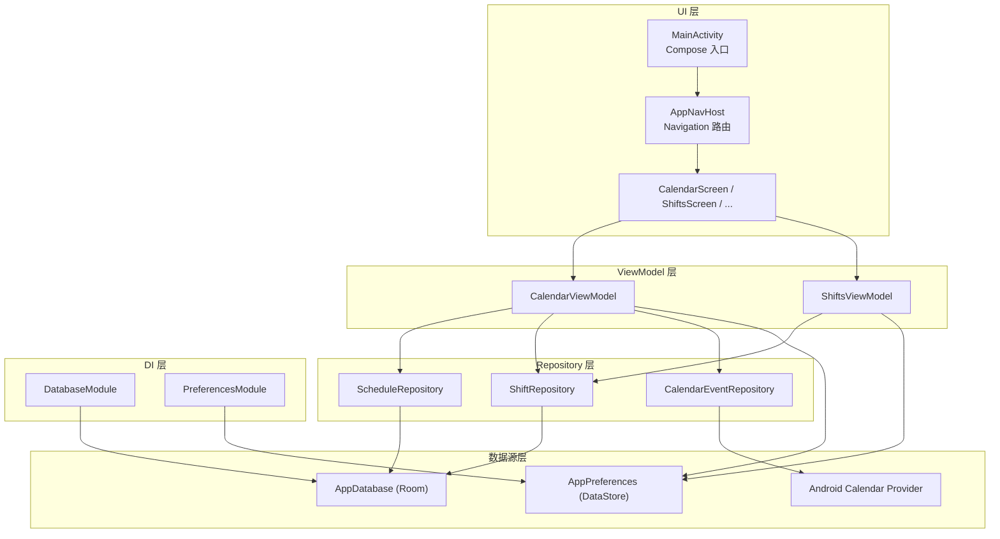
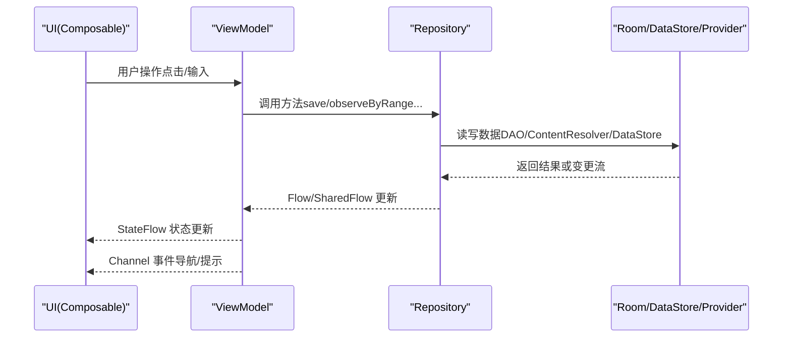
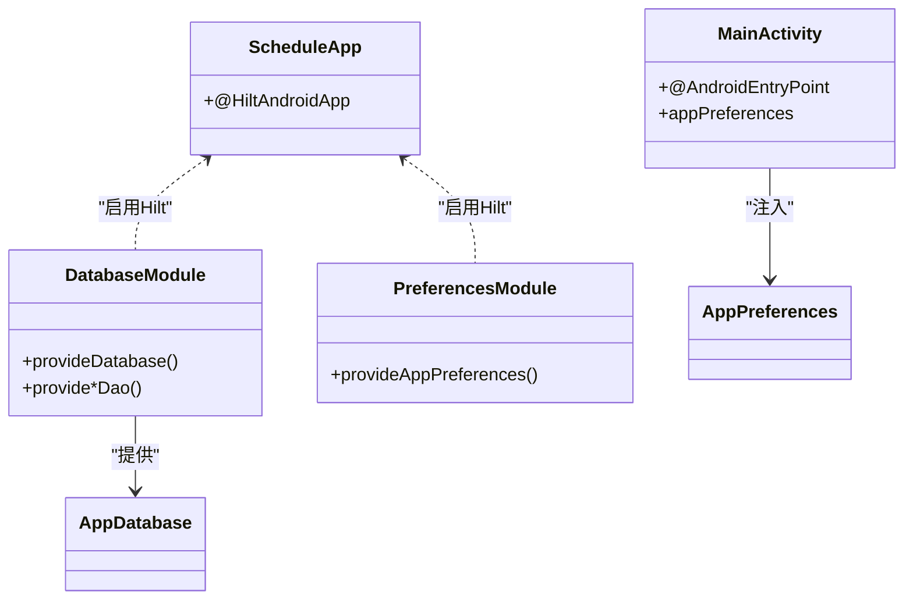
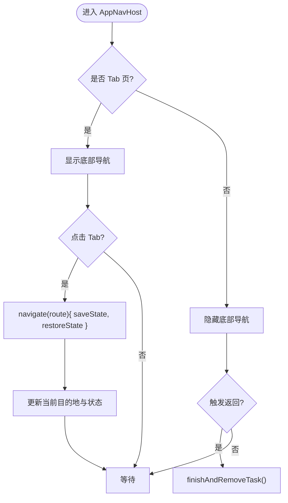
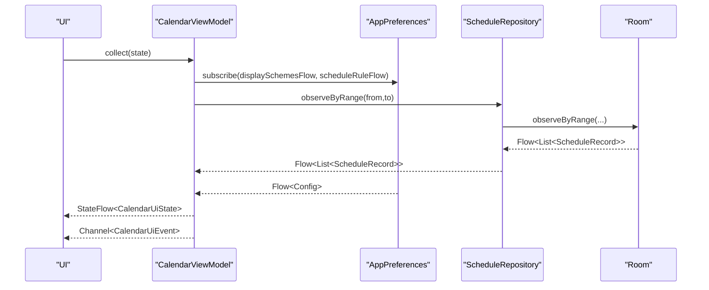
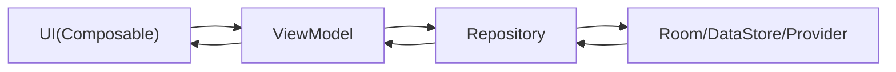
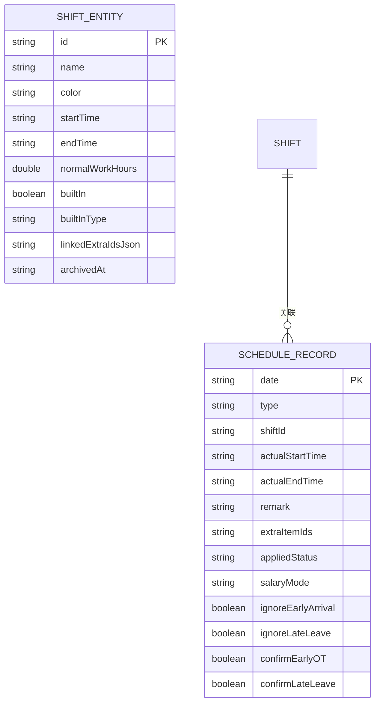
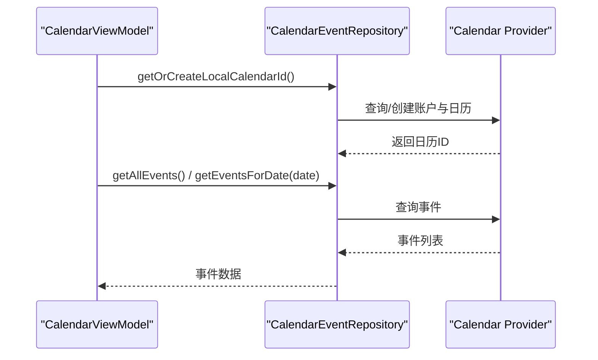
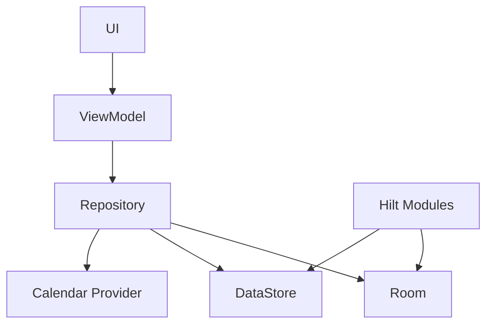

# 架构设计

<cite>
**本文引用的文件**   
- [ScheduleApp.kt](file://app/src/main/java/com/schedulecalendar/app/ScheduleApp.kt)
- [MainActivity.kt](file://app/src/main/java/com/schedulecalendar/app/MainActivity.kt)
- [DatabaseModule.kt](file://app/src/main/java/com/schedulecalendar/app/di/DatabaseModule.kt)
- [PreferencesModule.kt](file://app/src/main/java/com/schedulecalendar/app/di/PreferencesModule.kt)
- [AppNavHost.kt](file://app/src/main/java/com/schedulecalendar/app/ui/navigation/AppNavHost.kt)
- [Screen.kt](file://app/src/main/java/com/schedulecalendar/app/ui/navigation/Screen.kt)
- [AppDatabase.kt](file://app/src/main/java/com/schedulecalendar/app/data/db/AppDatabase.kt)
- [AppPreferences.kt](file://app/src/main/java/com/schedulecalendar/app/data/prefs/AppPreferences.kt)
- [CalendarViewModel.kt](file://app/src/main/java/com/schedulecalendar/app/ui/calendar/CalendarViewModel.kt)
- [ShiftsViewModel.kt](file://app/src/main/java/com/schedulecalendar/app/ui/shifts/ShiftsViewModel.kt)
- [ScheduleRepository.kt](file://app/src/main/java/com/schedulecalendar/app/data/repository/ScheduleRepository.kt)
- [ShiftRepository.kt](file://app/src/main/java/com/schedulecalendar/app/data/repository/ShiftRepository.kt)
- [Models.kt](file://app/src/main/java/com/schedulecalendar/app/domain/model/Models.kt)
- [ShiftEntity.kt](file://app/src/main/java/com/schedulecalendar/app/data/db/entity/ShiftEntity.kt)
- [CalendarEventRepository.kt](file://app/src/main/java/com/schedulecalendar/app/data/calendar/CalendarEventRepository.kt)
</cite>

## 目录
1. [简介](#简介)
2. [项目结构](#项目结构)
3. [核心组件](#核心组件)
4. [架构总览](#架构总览)
5. [详细组件分析](#详细组件分析)
6. [依赖关系分析](#依赖关系分析)
7. [性能考量](#性能考量)
8. [故障排查指南](#故障排查指南)
9. [结论](#结论)
10. [附录](#附录)

## 简介
本文件为 Android 排班日历应用的架构设计文档，重点阐述 MVVM 架构模式在 UI、ViewModel、Repository 与数据源层的职责分离；说明 Hilt 依赖注入的配置与使用（DatabaseModule、PreferencesModule）；解释 Navigation Component 的页面导航机制与状态管理；描述数据流架构中 StateFlow 与 Flow/LiveData 的使用模式；并给出组件交互关系图与关键流程时序图，帮助开发者理解整体设计与扩展点。

## 项目结构
应用采用分层组织：
- UI 层：Compose 界面与导航（AppNavHost、各 Screen）
- ViewModel 层：业务编排与状态管理（CalendarViewModel、ShiftsViewModel 等）
- Repository 层：领域模型聚合与数据访问抽象（ScheduleRepository、ShiftRepository 等）
- 数据源层：Room 数据库（AppDatabase + DAO + Entity）、DataStore 偏好（AppPreferences）、系统日历 Provider（CalendarEventRepository）
- DI 层：Hilt 模块（DatabaseModule、PreferencesModule）
- 领域模型：domain.model（Models.kt）

**图表来源** 
- [MainActivity.kt:167-219](file://app/src/main/java/com/schedulecalendar/app/MainActivity.kt#L167-L219)
- [AppNavHost.kt:57-172](file://app/src/main/java/com/schedulecalendar/app/ui/navigation/AppNavHost.kt#L57-L172)
- [CalendarViewModel.kt:118-151](file://app/src/main/java/com/schedulecalendar/app/ui/calendar/CalendarViewModel.kt#L118-L151)
- [ShiftsViewModel.kt:47-75](file://app/src/main/java/com/schedulecalendar/app/ui/shifts/ShiftsViewModel.kt#L47-L75)
- [ScheduleRepository.kt:13-39](file://app/src/main/java/com/schedulecalendar/app/data/repository/ScheduleRepository.kt#L13-L39)
- [ShiftRepository.kt:12-44](file://app/src/main/java/com/schedulecalendar/app/data/repository/ShiftRepository.kt#L12-L44)
- [AppDatabase.kt:17-34](file://app/src/main/java/com/schedulecalendar/app/data/db/AppDatabase.kt#L17-L34)
- [AppPreferences.kt:25-66](file://app/src/main/java/com/schedulecalendar/app/data/prefs/AppPreferences.kt#L25-L66)
- [CalendarEventRepository.kt:46-61](file://app/src/main/java/com/schedulecalendar/app/data/calendar/CalendarEventRepository.kt#L46-L61)
- [DatabaseModule.kt:19-34](file://app/src/main/java/com/schedulecalendar/app/di/DatabaseModule.kt#L19-L34)
- [PreferencesModule.kt:13-20](file://app/src/main/java/com/schedulecalendar/app/di/PreferencesModule.kt#L13-L20)

**章节来源**
- [MainActivity.kt:167-219](file://app/src/main/java/com/schedulecalendar/app/MainActivity.kt#L167-L219)
- [AppNavHost.kt:57-172](file://app/src/main/java/com/schedulecalendar/app/ui/navigation/AppNavHost.kt#L57-L172)
- [AppDatabase.kt:17-34](file://app/src/main/java/com/schedulecalendar/app/data/db/AppDatabase.kt#L17-L34)
- [AppPreferences.kt:25-66](file://app/src/main/java/com/schedulecalendar/app/data/prefs/AppPreferences.kt#L25-L66)

## 核心组件
- Application 与 DI 初始化
  - ScheduleApp 通过 @HiltAndroidApp 启用 Hilt，提供全局依赖注入能力。
- Activity 与 UI 入口
  - MainActivity 作为 Compose 入口，设置主题、权限弹窗、返回键拦截，并挂载 AppNavHost。
- 导航
  - AppNavHost 定义 Tab 主页面与子页面路由，处理底部导航、BackHandler、Tab 切换防抖与状态保存恢复。
  - Screen.kt 以可序列化类型定义路由参数，实现类型安全导航。
- 数据持久化
  - AppDatabase 声明 Room 数据库与实体，配合 DatabaseModule 提供单例实例与 DAO。
  - AppPreferences 基于 DataStore 暴露 Flow 配置项，供 UI/ViewModel 订阅。
- 仓库与领域模型
  - ScheduleRepository、ShiftRepository 封装 DAO 调用，转换领域模型，并通过 Flow/SharedFlow 暴露变更信号。
  - Models.kt 定义班次、排班记录、显示方案、薪资计算等核心领域模型。
- 系统日历集成
  - CalendarEventRepository 封装系统日历账户与事件读写，支持本地日历创建、事件查询与提醒。

**章节来源**
- [ScheduleApp.kt:7-8](file://app/src/main/java/com/schedulecalendar/app/ScheduleApp.kt#L7-L8)
- [MainActivity.kt:33-219](file://app/src/main/java/com/schedulecalendar/app/MainActivity.kt#L33-L219)
- [AppNavHost.kt:57-172](file://app/src/main/java/com/schedulecalendar/app/ui/navigation/AppNavHost.kt#L57-L172)
- [Screen.kt:1-34](file://app/src/main/java/com/schedulecalendar/app/ui/navigation/Screen.kt#L1-L34)
- [AppDatabase.kt:17-34](file://app/src/main/java/com/schedulecalendar/app/data/db/AppDatabase.kt#L17-L34)
- [DatabaseModule.kt:19-34](file://app/src/main/java/com/schedulecalendar/app/di/DatabaseModule.kt#L19-L34)
- [PreferencesModule.kt:13-20](file://app/src/main/java/com/schedulecalendar/app/di/PreferencesModule.kt#L13-L20)
- [AppPreferences.kt:25-66](file://app/src/main/java/com/schedulecalendar/app/data/prefs/AppPreferences.kt#L25-L66)
- [ScheduleRepository.kt:13-39](file://app/src/main/java/com/schedulecalendar/app/data/repository/ScheduleRepository.kt#L13-L39)
- [ShiftRepository.kt:12-44](file://app/src/main/java/com/schedulecalendar/app/data/repository/ShiftRepository.kt#L12-L44)
- [Models.kt:51-101](file://app/src/main/java/com/schedulecalendar/app/domain/model/Models.kt#L51-L101)
- [CalendarEventRepository.kt:46-61](file://app/src/main/java/com/schedulecalendar/app/data/calendar/CalendarEventRepository.kt#L46-L61)

## 架构总览
MVVM 分层清晰：
- UI 层（Compose Screens）仅负责展示与用户交互，不直接访问数据源。
- ViewModel 层持有 StateFlow 状态，组合多个 Repository 的数据流，编排业务逻辑，向 UI 发送一次性事件（Channel）。
- Repository 层屏蔽数据源细节，统一转换为领域模型，并通过 Flow/SharedFlow 暴露数据变更。
- 数据源层包括 Room、DataStore、系统日历 Provider，由 Hilt 模块提供单例。

**图表来源** 
- [CalendarViewModel.kt:118-151](file://app/src/main/java/com/schedulecalendar/app/ui/calendar/CalendarViewModel.kt#L118-L151)
- [ScheduleRepository.kt:13-39](file://app/src/main/java/com/schedulecalendar/app/data/repository/ScheduleRepository.kt#L13-L39)
- [AppPreferences.kt:25-66](file://app/src/main/java/com/schedulecalendar/app/data/prefs/AppPreferences.kt#L25-L66)
- [CalendarEventRepository.kt:46-61](file://app/src/main/java/com/schedulecalendar/app/data/calendar/CalendarEventRepository.kt#L46-L61)

## 详细组件分析

### Hilt 依赖注入配置与使用
- 应用级注解
  - ScheduleApp 使用 @HiltAndroidApp 启动 Hilt。
- 数据库模块
  - DatabaseModule 提供 AppDatabase 单例与各 DAO 实例，便于 Repository 注入。
- 偏好模块
  - PreferencesModule 提供 AppPreferences 单例，封装 DataStore 读写。
- Activity 注入
  - MainActivity 使用 @AndroidEntryPoint 注入 AppPreferences，用于权限与快捷方式开关。

**图表来源** 
- [ScheduleApp.kt:7-8](file://app/src/main/java/com/schedulecalendar/app/ScheduleApp.kt#L7-L8)
- [DatabaseModule.kt:19-34](file://app/src/main/java/com/schedulecalendar/app/di/DatabaseModule.kt#L19-L34)
- [PreferencesModule.kt:13-20](file://app/src/main/java/com/schedulecalendar/app/di/PreferencesModule.kt#L13-L20)
- [MainActivity.kt:33-36](file://app/src/main/java/com/schedulecalendar/app/MainActivity.kt#L33-L36)

**章节来源**
- [ScheduleApp.kt:7-8](file://app/src/main/java/com/schedulecalendar/app/ScheduleApp.kt#L7-L8)
- [DatabaseModule.kt:19-34](file://app/src/main/java/com/schedulecalendar/app/di/DatabaseModule.kt#L19-L34)
- [PreferencesModule.kt:13-20](file://app/src/main/java/com/schedulecalendar/app/di/PreferencesModule.kt#L13-L20)
- [MainActivity.kt:33-36](file://app/src/main/java/com/schedulecalendar/app/MainActivity.kt#L33-L36)

### Navigation Component 导航与状态管理
- 路由定义
  - Screen.kt 使用 @Serializable 定义路由（object 无参、data class 带参），保证类型安全。
- 导航宿主
  - AppNavHost 定义 Tab 列表、底部导航栏、子页面 composable，处理 BackHandler 与状态保存恢复。
- 状态联动
  - 通过 LocalContext 获取 MainActivity，通知 isOnTabPage 以控制返回键行为；内部维护 calendarSubModeActive 控制批量模式下的返回策略。

**图表来源** 
- [AppNavHost.kt:57-172](file://app/src/main/java/com/schedulecalendar/app/ui/navigation/AppNavHost.kt#L57-L172)
- [Screen.kt:1-34](file://app/src/main/java/com/schedulecalendar/app/ui/navigation/Screen.kt#L1-L34)
- [MainActivity.kt:141-157](file://app/src/main/java/com/schedulecalendar/app/MainActivity.kt#L141-L157)

**章节来源**
- [AppNavHost.kt:57-172](file://app/src/main/java/com/schedulecalendar/app/ui/navigation/AppNavHost.kt#L57-L172)
- [Screen.kt:1-34](file://app/src/main/java/com/schedulecalendar/app/ui/navigation/Screen.kt#L1-L34)
- [MainActivity.kt:141-157](file://app/src/main/java/com/schedulecalendar/app/MainActivity.kt#L141-L157)

### 数据流架构：StateFlow 与 Flow/LiveData
- ViewModel 状态
  - CalendarViewModel 使用 MutableStateFlow 暴露 CalendarUiState，UI 订阅后重组。
  - ShiftsViewModel 将 Repository 的 Flow 通过 stateIn 转为 StateFlow，结合内存排序 Flow 组合输出。
- 一次性事件
  - 使用 Channel 发送导航、消息、错误等一次性事件，避免重复触发。
- Repository 数据流
  - ScheduleRepository 暴露 observeByRange/observeByMonth 等 Flow，写操作后通过 SharedFlow 发出刷新信号。
  - ShiftRepository 暴露 observeAllWithBuiltin 等 Flow，合并内置与用户数据。
- 偏好数据流
  - AppPreferences 暴露各类 Flow（如 displaySchemesFlow、scheduleRuleFlow），供 ViewModel 组合。

**图表来源** 
- [CalendarViewModel.kt:118-151](file://app/src/main/java/com/schedulecalendar/app/ui/calendar/CalendarViewModel.kt#L118-L151)
- [AppPreferences.kt:68-103](file://app/src/main/java/com/schedulecalendar/app/data/prefs/AppPreferences.kt#L68-L103)
- [ScheduleRepository.kt:22-39](file://app/src/main/java/com/schedulecalendar/app/data/repository/ScheduleRepository.kt#L22-L39)

**章节来源**
- [CalendarViewModel.kt:118-151](file://app/src/main/java/com/schedulecalendar/app/ui/calendar/CalendarViewModel.kt#L118-L151)
- [ShiftsViewModel.kt:47-86](file://app/src/main/java/com/schedulecalendar/app/ui/shifts/ShiftsViewModel.kt#L47-L86)
- [ScheduleRepository.kt:22-39](file://app/src/main/java/com/schedulecalendar/app/data/repository/ScheduleRepository.kt#L22-L39)
- [AppPreferences.kt:68-103](file://app/src/main/java/com/schedulecalendar/app/data/prefs/AppPreferences.kt#L68-L103)

### 组件间交互关系与数据流向
- UI → ViewModel：用户交互触发方法（如 onDayClick、clockIn/clockOut、applyRule）。
- ViewModel → Repository：读取/写入数据（observeByRange、save/saveAll、archive/delete）。
- Repository → 数据源：Room DAO、DataStore、Calendar Provider。
- 数据源 → Repository：Flow 数据流与 SharedFlow 刷新信号。
- Repository → ViewModel：Flow 数据更新。
- ViewModel → UI：StateFlow 状态更新与 Channel 事件。

**图表来源** 
- [CalendarViewModel.kt:118-151](file://app/src/main/java/com/schedulecalendar/app/ui/calendar/CalendarViewModel.kt#L118-L151)
- [ScheduleRepository.kt:13-39](file://app/src/main/java/com/schedulecalendar/app/data/repository/ScheduleRepository.kt#L13-L39)
- [ShiftRepository.kt:12-44](file://app/src/main/java/com/schedulecalendar/app/data/repository/ShiftRepository.kt#L12-L44)
- [AppPreferences.kt:25-66](file://app/src/main/java/com/schedulecalendar/app/data/prefs/AppPreferences.kt#L25-L66)

**章节来源**
- [CalendarViewModel.kt:118-151](file://app/src/main/java/com/schedulecalendar/app/ui/calendar/CalendarViewModel.kt#L118-L151)
- [ScheduleRepository.kt:13-39](file://app/src/main/java/com/schedulecalendar/app/data/repository/ScheduleRepository.kt#L13-L39)
- [ShiftRepository.kt:12-44](file://app/src/main/java/com/schedulecalendar/app/data/repository/ShiftRepository.kt#L12-L44)
- [AppPreferences.kt:25-66](file://app/src/main/java/com/schedulecalendar/app/data/prefs/AppPreferences.kt#L25-L66)

### 领域模型与数据映射
- 领域模型
  - Models.kt 定义 Shift、ScheduleRecord、DisplayScheme、SalaryConfig、AttendConfig 等。
- 数据实体
  - ShiftEntity 对应 Room 表结构，包含 archivedAt、linkedExtraIdsJson 等字段。
- 映射
  - Repository 中 toDomain()/toEntity() 完成领域模型与实体的双向转换。

**图表来源** 
- [ShiftEntity.kt:8-23](file://app/src/main/java/com/schedulecalendar/app/data/db/entity/ShiftEntity.kt#L8-L23)
- [Models.kt:51-101](file://app/src/main/java/com/schedulecalendar/app/domain/model/Models.kt#L51-L101)

**章节来源**
- [Models.kt:51-101](file://app/src/main/java/com/schedulecalendar/app/domain/model/Models.kt#L51-L101)
- [ShiftEntity.kt:8-23](file://app/src/main/java/com/schedulecalendar/app/data/db/entity/ShiftEntity.kt#L8-L23)

### 系统日历集成流程
- 账户与日历
  - CalendarEventRepository 负责创建/查找本地日历（日程、纪念日、提醒），按账户类型排序。
- 事件读写
  - 支持创建事件（含提醒与扩展属性兼容国产 ROM）、更新、删除、批量删除、按日期查询。
- 禁用账户
  - 支持关闭指定日历同步，过滤显示。

**图表来源** 
- [CalendarEventRepository.kt:417-516](file://app/src/main/java/com/schedulecalendar/app/data/calendar/CalendarEventRepository.kt#L417-L516)
- [CalendarEventRepository.kt:163-211](file://app/src/main/java/com/schedulecalendar/app/data/calendar/CalendarEventRepository.kt#L163-L211)
- [CalendarEventRepository.kt:774-800](file://app/src/main/java/com/schedulecalendar/app/data/calendar/CalendarEventRepository.kt#L774-L800)

**章节来源**
- [CalendarEventRepository.kt:417-516](file://app/src/main/java/com/schedulecalendar/app/data/calendar/CalendarEventRepository.kt#L417-L516)
- [CalendarEventRepository.kt:163-211](file://app/src/main/java/com/schedulecalendar/app/data/calendar/CalendarEventRepository.kt#L163-L211)
- [CalendarEventRepository.kt:774-800](file://app/src/main/java/com/schedulecalendar/app/data/calendar/CalendarEventRepository.kt#L774-L800)

## 依赖关系分析
- 低耦合高内聚
  - UI 仅依赖 ViewModel；ViewModel 依赖 Repository；Repository 依赖数据源。
- 外部依赖
  - Room（数据库）、DataStore（偏好）、Calendar Provider（系统日历）。
- 循环依赖检查
  - 未发现循环依赖；DI 模块集中管理单例生命周期。

**图表来源** 
- [ScheduleRepository.kt:13-39](file://app/src/main/java/com/schedulecalendar/app/data/repository/ScheduleRepository.kt#L13-L39)
- [ShiftRepository.kt:12-44](file://app/src/main/java/com/schedulecalendar/app/data/repository/ShiftRepository.kt#L12-L44)
- [AppPreferences.kt:25-66](file://app/src/main/java/com/schedulecalendar/app/data/prefs/AppPreferences.kt#L25-L66)
- [CalendarEventRepository.kt:46-61](file://app/src/main/java/com/schedulecalendar/app/data/calendar/CalendarEventRepository.kt#L46-L61)
- [DatabaseModule.kt:19-34](file://app/src/main/java/com/schedulecalendar/app/di/DatabaseModule.kt#L19-L34)
- [PreferencesModule.kt:13-20](file://app/src/main/java/com/schedulecalendar/app/di/PreferencesModule.kt#L13-L20)

**章节来源**
- [ScheduleRepository.kt:13-39](file://app/src/main/java/com/schedulecalendar/app/data/repository/ScheduleRepository.kt#L13-L39)
- [ShiftRepository.kt:12-44](file://app/src/main/java/com/schedulecalendar/app/data/repository/ShiftRepository.kt#L12-L44)
- [AppPreferences.kt:25-66](file://app/src/main/java/com/schedulecalendar/app/data/prefs/AppPreferences.kt#L25-L66)
- [CalendarEventRepository.kt:46-61](file://app/src/main/java/com/schedulecalendar/app/data/calendar/CalendarEventRepository.kt#L46-L61)
- [DatabaseModule.kt:19-34](file://app/src/main/java/com/schedulecalendar/app/di/DatabaseModule.kt#L19-L34)
- [PreferencesModule.kt:13-20](file://app/src/main/java/com/schedulecalendar/app/di/PreferencesModule.kt#L13-L20)

## 性能考量
- 数据流优化
  - ViewModel 中使用 combine 合并多源 Flow，减少重复收集；stateIn 限定收集范围，避免泄漏。
- 导航防抖
  - AppNavHost 对 Tab 点击进行防抖，避免快速切换导致重组堆积。
- 数据库迁移
  - AppDatabase 导出 schema，便于版本迁移追踪；DatabaseModule 使用 fallbackToDestructiveMigration 简化升级。
- 系统日历查询
  - CalendarEventRepository 批量加载日历信息，避免 N+1 查询；按日期范围筛选事件。

[本节为通用指导，无需具体文件引用]

## 故障排查指南
- 权限问题
  - MainActivity 首次启动弹出权限申请对话框，记录初始权限状态；若未授权，系统日历功能受限。
- 返回键行为异常
  - 检查 AppNavHost 的 BackHandler 与 MainActivity 的 OnBackPressedDispatcher 回调优先级；确认 isOnTabPage 与 calendarSubModeActive 状态。
- 数据不同步
  - 检查 Repository 的 refreshSignal（SharedFlow）是否在写操作后发出；确保 ViewModel 正确订阅 Flow。
- 日历事件不显示
  - 确认 CalendarEventRepository 的本地日历创建成功；检查事件时间范围与年度重复规则解析。

**章节来源**
- [MainActivity.kt:167-219](file://app/src/main/java/com/schedulecalendar/app/MainActivity.kt#L167-L219)
- [AppNavHost.kt:161-172](file://app/src/main/java/com/schedulecalendar/app/ui/navigation/AppNavHost.kt#L161-L172)
- [ScheduleRepository.kt:17-21](file://app/src/main/java/com/schedulecalendar/app/data/repository/ScheduleRepository.kt#L17-L21)
- [CalendarEventRepository.kt:417-516](file://app/src/main/java/com/schedulecalendar/app/data/calendar/CalendarEventRepository.kt#L417-L516)

## 结论
本应用采用清晰的 MVVM 分层与 Hilt 依赖注入，结合 Navigation Component 与 Flow/StateFlow 数据流，实现了可扩展、易维护的排班日历系统。UI 与数据源解耦，ViewModel 专注状态编排，Repository 统一数据访问，数据源层稳定可靠。通过合理的性能优化与完善的错误处理，整体架构具备良好的扩展性与可测试性。

[本节为总结，无需具体文件引用]

## 附录
- 扩展点建议
  - 新增数据源：在 Repository 层增加新接口，保持领域模型不变。
  - 新增页面：在 Screen.kt 定义路由，在 AppNavHost 注册 composable。
  - 新增配置项：在 AppPreferences 添加 Flow 与读写方法，并在相关 ViewModel 中订阅。

[本节为概念性内容，无需具体文件引用]