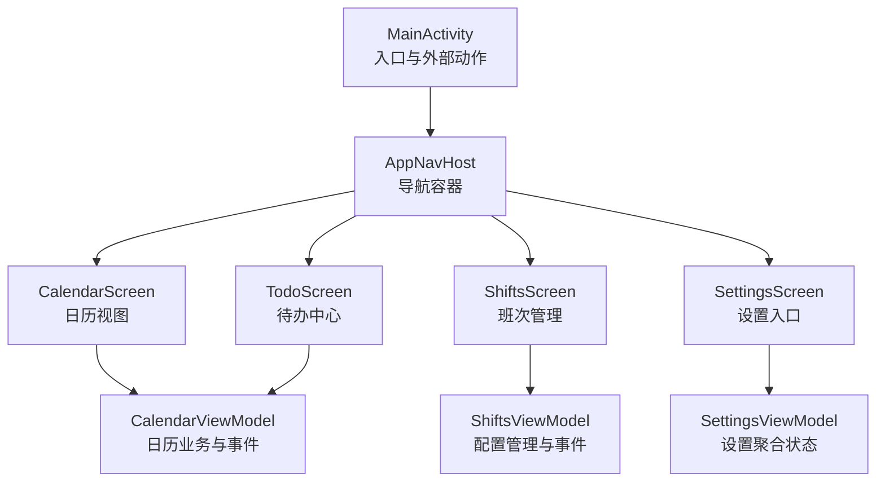
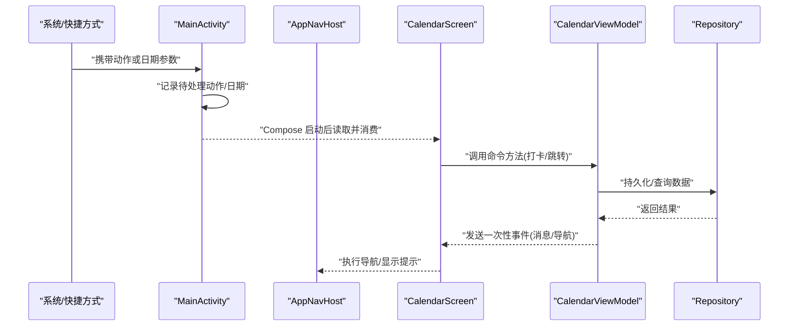
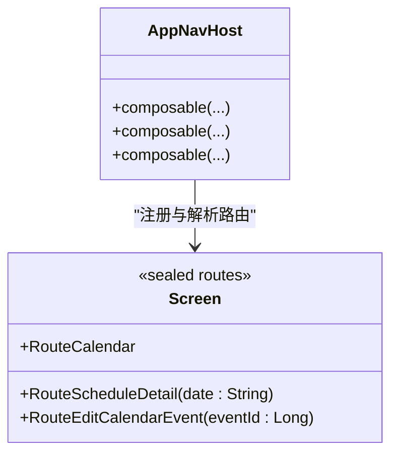
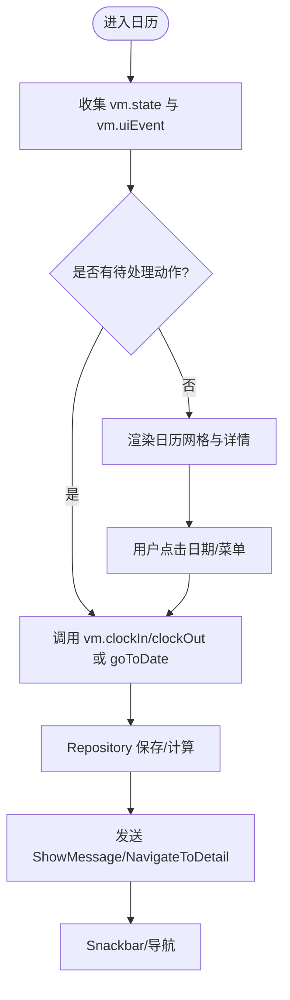
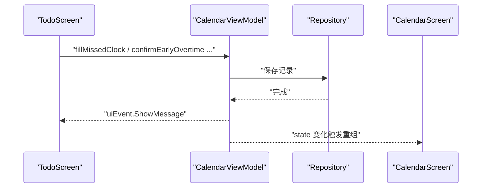
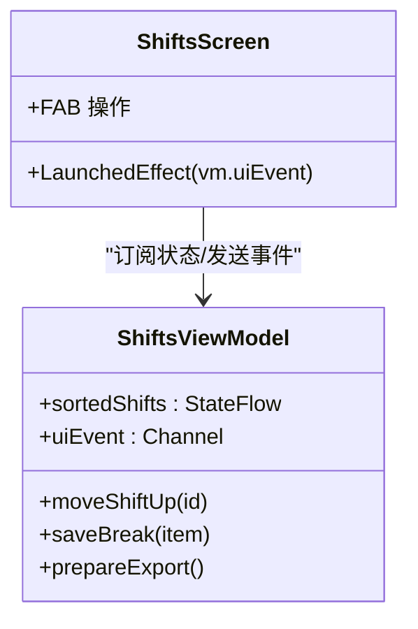
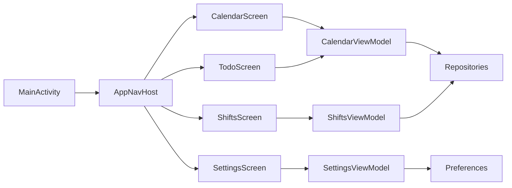

# 组件通信机制

<cite>
**本文引用的文件**
- [MainActivity.kt](file://app/src/main/java/com/schedulecalendar/app/MainActivity.kt)
- [ScheduleApp.kt](file://app/src/main/java/com/schedulecalendar/app/ScheduleApp.kt)
- [AppNavHost.kt](file://app/src/main/java/com/schedulecalendar/app/ui/navigation/AppNavHost.kt)
- [Screen.kt](file://app/src/main/java/com/schedulecalendar/app/ui/navigation/Screen.kt)
- [CalendarScreen.kt](file://app/src/main/java/com/schedulecalendar/app/ui/calendar/CalendarScreen.kt)
- [CalendarViewModel.kt](file://app/src/main/java/com/schedulecalendar/app/ui/calendar/CalendarViewModel.kt)
- [TodoScreen.kt](file://app/src/main/java/com/schedulecalendar/app/ui/todo/TodoScreen.kt)
- [ShiftsScreen.kt](file://app/src/main/java/com/schedulecalendar/app/ui/shifts/ShiftsScreen.kt)
- [ShiftsViewModel.kt](file://app/src/main/java/com/schedulecalendar/app/ui/shifts/ShiftsViewModel.kt)
- [SettingsScreen.kt](file://app/src/main/java/com/schedulecalendar/app/ui/settings/SettingsScreen.kt)
- [SettingsViewModel.kt](file://app/src/main/java/com/schedulecalendar/app/ui/settings/SettingsViewModel.kt)
</cite>

## 目录
1. [简介](#简介)
2. [项目结构](#项目结构)
3. [核心组件](#核心组件)
4. [架构总览](#架构总览)
5. [详细组件分析](#详细组件分析)
6. [依赖分析](#依赖分析)
7. [性能考虑](#性能考虑)
8. [故障排查指南](#故障排查指南)
9. [结论](#结论)
10. [附录](#附录)

## 简介
本文件聚焦于 Compose 应用中的组件通信机制，围绕以下主题展开：
- 回调函数、状态提升与共享状态管理
- 自定义组件开发规范（属性定义、事件处理、样式定制）
- ViewModel 间通信方式（事件总线模式与状态共享）
- 跨屏幕数据传递与状态同步策略
- 组件解耦设计、接口抽象与测试友好的实现

本项目采用单 Activity + Navigation Compose 的架构，使用 Hilt 注入依赖，以 StateFlow/Channel 作为 UI 状态与一次性事件的载体。通过“单向数据流”和“事件驱动”的组合，实现了清晰的职责边界与可测试性。

## 项目结构
整体采用按功能域组织的方式：
- ui/navigation：路由与导航容器
- ui/calendar、ui/todo、ui/shifts、ui/settings：各功能模块的 Screen 与 ViewModel
- data：仓库与偏好设置
- widget：桌面小组件
- MainActivity 负责入口、快捷方式与小组件跳转的桥接

图表来源
- [AppNavHost.kt:54-133](file://app/src/main/java/com/schedulecalendar/app/ui/navigation/AppNavHost.kt#L54-L133)
- [CalendarScreen.kt:76-130](file://app/src/main/java/com/schedulecalendar/app/ui/calendar/CalendarScreen.kt#L76-L130)
- [TodoScreen.kt:67-100](file://app/src/main/java/com/schedulecalendar/app/ui/todo/TodoScreen.kt#L67-L100)
- [ShiftsScreen.kt:52-82](file://app/src/main/java/com/schedulecalendar/app/ui/shifts/ShiftsScreen.kt#L52-L82)
- [SettingsScreen.kt:40-46](file://app/src/main/java/com/schedulecalendar/app/ui/settings/SettingsScreen.kt#L40-L46)

章节来源
- [AppNavHost.kt:54-133](file://app/src/main/java/com/schedulecalendar/app/ui/navigation/AppNavHost.kt#L54-L133)
- [Screen.kt:7-34](file://app/src/main/java/com/schedulecalendar/app/ui/navigation/Screen.kt#L7-L34)

## 核心组件
- 导航层：AppNavHost 集中注册所有页面路由，使用类型安全路由对象进行参数传递。
- 视图层：各 Screen 通过 hiltViewModel() 获取对应 ViewModel，订阅 state 并消费 uiEvent。
- 业务层：ViewModel 暴露不可变状态 Flow 与一次性事件 Channel；对外提供命令式方法触发变更。
- 外部集成：MainActivity 接收系统/快捷方式/小组件动作，交由具体 Screen 消费。

章节来源
- [AppNavHost.kt:54-133](file://app/src/main/java/com/schedulecalendar/app/ui/navigation/AppNavHost.kt#L54-L133)
- [CalendarScreen.kt:76-130](file://app/src/main/java/com/schedulecalendar/app/ui/calendar/CalendarScreen.kt#L76-L130)
- [CalendarViewModel.kt:117-132](file://app/src/main/java/com/schedulecalendar/app/ui/calendar/CalendarViewModel.kt#L117-L132)
- [MainActivity.kt:41-104](file://app/src/main/java/com/schedulecalendar/app/MainActivity.kt#L41-L104)

## 架构总览
下图展示了从外部动作到界面更新的端到端流程，体现“外部输入 → Activity 桥接 → ViewModel 事件 → UI 响应”的单向数据流。

图表来源
- [MainActivity.kt:72-104](file://app/src/main/java/com/schedulecalendar/app/MainActivity.kt#L72-L104)
- [CalendarScreen.kt:84-130](file://app/src/main/java/com/schedulecalendar/app/ui/calendar/CalendarScreen.kt#L84-L130)
- [CalendarViewModel.kt:404-416](file://app/src/main/java/com/schedulecalendar/app/ui/calendar/CalendarViewModel.kt#L404-L416)

## 详细组件分析

### 导航与跨屏数据传递
- 类型安全路由：使用 @Serializable 的 object/data class 描述路由与参数，避免字符串拼接错误。
- 统一入口：AppNavHost 集中声明 composable，子页面通过 toRoute<T>() 解析参数。
- 跨屏传参示例：详情页、编辑页等通过 RouteXXX 携带必要 ID/日期。

图表来源
- [AppNavHost.kt:96-130](file://app/src/main/java/com/schedulecalendar/app/ui/navigation/AppNavHost.kt#L96-L130)
- [Screen.kt:7-34](file://app/src/main/java/com/schedulecalendar/app/ui/navigation/Screen.kt#L7-L34)

章节来源
- [AppNavHost.kt:96-130](file://app/src/main/java/com/schedulecalendar/app/ui/navigation/AppNavHost.kt#L96-L130)
- [Screen.kt:7-34](file://app/src/main/java/com/schedulecalendar/app/ui/navigation/Screen.kt#L7-L34)

### Calendar 模块：状态提升与事件总线
- 状态提升：CalendarScreen 持有少量本地 UI 状态（如弹窗），主数据来自 CalendarViewModel.state。
- 事件总线：CalendarViewModel.uiEvent 为 Channel，UI 侧 LaunchedEffect 收集并消费一次性的导航/提示事件。
- 外部动作桥接：MainActivity 缓存快捷方式动作与小组件日期，CalendarScreen 在 LaunchedEffect 中消费。

图表来源
- [CalendarScreen.kt:84-130](file://app/src/main/java/com/schedulecalendar/app/ui/calendar/CalendarScreen.kt#L84-L130)
- [CalendarViewModel.kt:117-132](file://app/src/main/java/com/schedulecalendar/app/ui/calendar/CalendarViewModel.kt#L117-L132)
- [MainActivity.kt:72-104](file://app/src/main/java/com/schedulecalendar/app/MainActivity.kt#L72-L104)

章节来源
- [CalendarScreen.kt:76-130](file://app/src/main/java/com/schedulecalendar/app/ui/calendar/CalendarScreen.kt#L76-L130)
- [CalendarViewModel.kt:117-132](file://app/src/main/java/com/schedulecalendar/app/ui/calendar/CalendarViewModel.kt#L117-L132)
- [MainActivity.kt:72-104](file://app/src/main/java/com/schedulecalendar/app/MainActivity.kt#L72-L104)

### Todo 模块：共享 ViewModel 与多 Tab 联动
- 共享状态：TodoScreen 与 CalendarScreen 共用 CalendarViewModel，保证待办与日历数据一致。
- 事件分发：TodoScreen 同样收集 vm.uiEvent，将导航与提示透传到 Scaffold 的 Snackbar/NavController。
- 交互闭环：用户在待办中心操作（补录/确认加班）直接更新底层排班数据，日历自动刷新。

图表来源
- [TodoScreen.kt:91-100](file://app/src/main/java/com/schedulecalendar/app/ui/todo/TodoScreen.kt#L91-L100)
- [CalendarViewModel.kt:419-427](file://app/src/main/java/com/schedulecalendar/app/ui/calendar/CalendarViewModel.kt#L419-L427)

章节来源
- [TodoScreen.kt:67-100](file://app/src/main/java/com/schedulecalendar/app/ui/todo/TodoScreen.kt#L67-L100)
- [CalendarViewModel.kt:419-427](file://app/src/main/java/com/schedulecalendar/app/ui/calendar/CalendarViewModel.kt#L419-L427)

### Shifts 模块：配置管理与事件通知
- 列表与排序：ShiftsViewModel 维护内存排序顺序，即时响应并异步持久化到 DataStore。
- 事件通知：新增/删除/导入导出等操作通过 uiEvent 通知 UI 层展示消息或跳转编辑器。
- 编辑器回退：ShiftEditorViewModel 保存成功后发送 NavigateBack，由父级处理返回逻辑。

图表来源
- [ShiftsViewModel.kt:54-120](file://app/src/main/java/com/schedulecalendar/app/ui/shifts/ShiftsViewModel.kt#L54-L120)
- [ShiftsScreen.kt:70-82](file://app/src/main/java/com/schedulecalendar/app/ui/shifts/ShiftsScreen.kt#L70-L82)

章节来源
- [ShiftsViewModel.kt:54-120](file://app/src/main/java/com/schedulecalendar/app/ui/shifts/ShiftsViewModel.kt#L54-L120)
- [ShiftsScreen.kt:70-82](file://app/src/main/java/com/schedulecalendar/app/ui/shifts/ShiftsScreen.kt#L70-L82)

### Settings 模块：聚合配置与权限引导
- 聚合状态：SettingsViewModel 合并多个偏好 Flow，组合成统一的 SettingsUiState。
- 导航入口：SettingsScreen 仅做导航与权限检查，不承载复杂业务。
- 权限与后台保障：提供一键跳转到系统设置的入口，便于用户开启所需权限。

章节来源
- [SettingsViewModel.kt:34-64](file://app/src/main/java/com/schedulecalendar/app/ui/settings/SettingsViewModel.kt#L34-L64)
- [SettingsScreen.kt:40-46](file://app/src/main/java/com/schedulecalendar/app/ui/settings/SettingsScreen.kt#L40-L46)

### 自定义组件开发规范
- 属性定义
  - 只读数据通过参数传入，保持纯函数式 Composable。
  - 可选样式通过默认参数与主题色结合，避免硬编码。
- 事件处理
  - 使用 lambda 回调向上抛出用户意图，由上层决定副作用（导航、写库）。
  - 对一次性行为（如打开对话框）可在组件内维护局部 remember 状态。
- 样式定制
  - 使用 MaterialTheme 的颜色/排版，确保一致性。
  - 复杂颜色对比度计算封装为工具函数，提高可读性与复用性。

章节来源
- [CalendarScreen.kt:627-800](file://app/src/main/java/com/schedulecalendar/app/ui/calendar/CalendarScreen.kt#L627-L800)

### ViewModel 间通信方式
- 事件总线模式
  - 每个 ViewModel 暴露 sealed class 的事件集合，通过 Channel 发送，UI 侧 collectAsStateWithLifecycle 消费。
  - 典型事件：NavigateToDetail、ShowMessage、ShowError。
- 状态共享机制
  - 多 Screen 共享同一 ViewModel（如 CalendarViewModel），保证数据一致性。
  - 通过 combine 聚合多个数据源，输出单一不可变状态。

章节来源
- [CalendarViewModel.kt:117-132](file://app/src/main/java/com/schedulecalendar/app/ui/calendar/CalendarViewModel.kt#L117-L132)
- [ShiftsViewModel.kt:119-120](file://app/src/main/java/com/schedulecalendar/app/ui/shifts/ShiftsViewModel.kt#L119-L120)
- [SettingsViewModel.kt:44-64](file://app/src/main/java/com/schedulecalendar/app/ui/settings/SettingsViewModel.kt#L44-L64)

### 跨屏幕的数据传递与状态同步策略
- 路由参数：使用 @Serializable 的 data class 传递强类型参数，避免歧义。
- 全局状态：关键业务状态集中在共享 ViewModel，跨屏自动同步。
- 外部动作：Activity 层缓存 Intent 动作，Screen 在 LaunchedEffect 中消费，避免重复处理。

章节来源
- [Screen.kt:16-34](file://app/src/main/java/com/schedulecalendar/app/ui/navigation/Screen.kt#L16-L34)
- [AppNavHost.kt:105-130](file://app/src/main/java/com/schedulecalendar/app/ui/navigation/AppNavHost.kt#L105-L130)
- [MainActivity.kt:72-104](file://app/src/main/java/com/schedulecalendar/app/MainActivity.kt#L72-L104)

### 组件解耦设计与接口抽象
- 分层清晰：Screen 仅负责展示与用户交互，ViewModel 负责业务与数据，Repository 负责存储。
- 事件与状态分离：UI 状态用于渲染，事件用于副作用，降低耦合。
- 可测试性：ViewModel 暴露纯函数方法与不可变状态，便于单元测试；Screen 可通过注入 mock VM 验证交互。

章节来源
- [CalendarViewModel.kt:328-375](file://app/src/main/java/com/schedulecalendar/app/ui/calendar/CalendarViewModel.kt#L328-L375)
- [ShiftsViewModel.kt:146-170](file://app/src/main/java/com/schedulecalendar/app/ui/shifts/ShiftsViewModel.kt#L146-L170)

## 依赖分析
- 低耦合：Screen 依赖 ViewModel，ViewModel 依赖 Repository 与 Preferences，无循环依赖。
- 外部集成点：Hilt 注入、Navigation Compose、DataStore、Room、系统日历与闹钟。
- 事件传播路径：Activity → Screen → ViewModel → Repository → Event → Screen。

图表来源
- [AppNavHost.kt:96-130](file://app/src/main/java/com/schedulecalendar/app/ui/navigation/AppNavHost.kt#L96-L130)
- [CalendarViewModel.kt:105-115](file://app/src/main/java/com/schedulecalendar/app/ui/calendar/CalendarViewModel.kt#L105-L115)
- [ShiftsViewModel.kt:46-52](file://app/src/main/java/com/schedulecalendar/app/ui/shifts/ShiftsViewModel.kt#L46-L52)
- [SettingsViewModel.kt:34-42](file://app/src/main/java/com/schedulecalendar/app/ui/settings/SettingsViewModel.kt#L34-L42)

章节来源
- [AppNavHost.kt:96-130](file://app/src/main/java/com/schedulecalendar/app/ui/navigation/AppNavHost.kt#L96-L130)
- [CalendarViewModel.kt:105-115](file://app/src/main/java/com/schedulecalendar/app/ui/calendar/CalendarViewModel.kt#L105-L115)
- [ShiftsViewModel.kt:46-52](file://app/src/main/java/com/schedulecalendar/app/ui/shifts/ShiftsViewModel.kt#L46-L52)
- [SettingsViewModel.kt:34-42](file://app/src/main/java/com/schedulecalendar/app/ui/settings/SettingsViewModel.kt#L34-L42)

## 性能考虑
- 列表优化：大量日历格子使用 LazyColumn/Row 与 key 稳定标识，减少重组开销。
- 状态合并：使用 combine 聚合多个 Flow，避免多次重组。
- 协程作用域：所有 IO 与耗时计算在 viewModelScope 中进行，避免泄漏。
- 动画过渡：月份切换使用 AnimatedContent，平滑且可控。

[本节为通用指导，无需特定文件引用]

## 故障排查指南
- 事件未触发
  - 检查 ViewModel 是否正确发送事件，UI 是否 collectAsStateWithLifecycle 订阅。
  - 确认 LaunchedEffect 生命周期与上下文正确。
- 导航无效
  - 核对路由定义与参数类型是否匹配，toRoute<T>() 解析是否成功。
- 外部动作重复处理
  - 确保 Activity 层 consume 后清空缓存，避免重复消费。
- 数据不同步
  - 确认共享 ViewModel 的状态是否被多处修改，必要时引入单一事实源。

章节来源
- [CalendarScreen.kt:121-130](file://app/src/main/java/com/schedulecalendar/app/ui/calendar/CalendarScreen.kt#L121-L130)
- [TodoScreen.kt:91-100](file://app/src/main/java/com/schedulecalendar/app/ui/todo/TodoScreen.kt#L91-L100)
- [MainActivity.kt:91-104](file://app/src/main/java/com/schedulecalendar/app/MainActivity.kt#L91-L104)

## 结论
本项目通过“单向数据流 + 事件总线 + 类型安全路由”的组合，实现了高内聚、低耦合的组件通信体系。Screen 专注展示与交互，ViewModel 负责业务与状态，Repository 负责数据访问。借助 Hilt 与 Flow/Channel，既保证了运行时效率，也提升了可测试性与可维护性。

[本节为总结，无需特定文件引用]

## 附录
- 最佳实践清单
  - 使用 sealed class 表达事件，避免字符串魔法值。
  - 使用不可变数据类承载 UI 状态，配合 combine 聚合。
  - 外部动作在 Activity 层集中处理，Screen 按需消费。
  - 路由参数使用 @Serializable 类型，避免歧义。
  - 复杂样式计算封装为工具函数，保持组件简洁。

[本节为补充说明，无需特定文件引用]