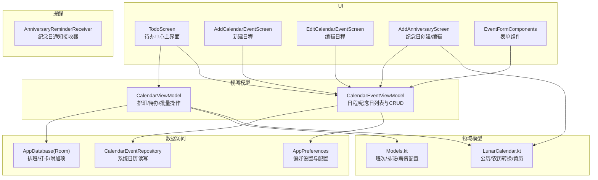
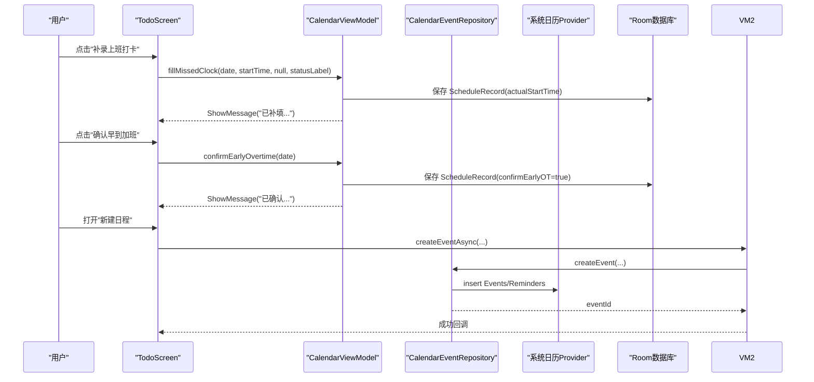
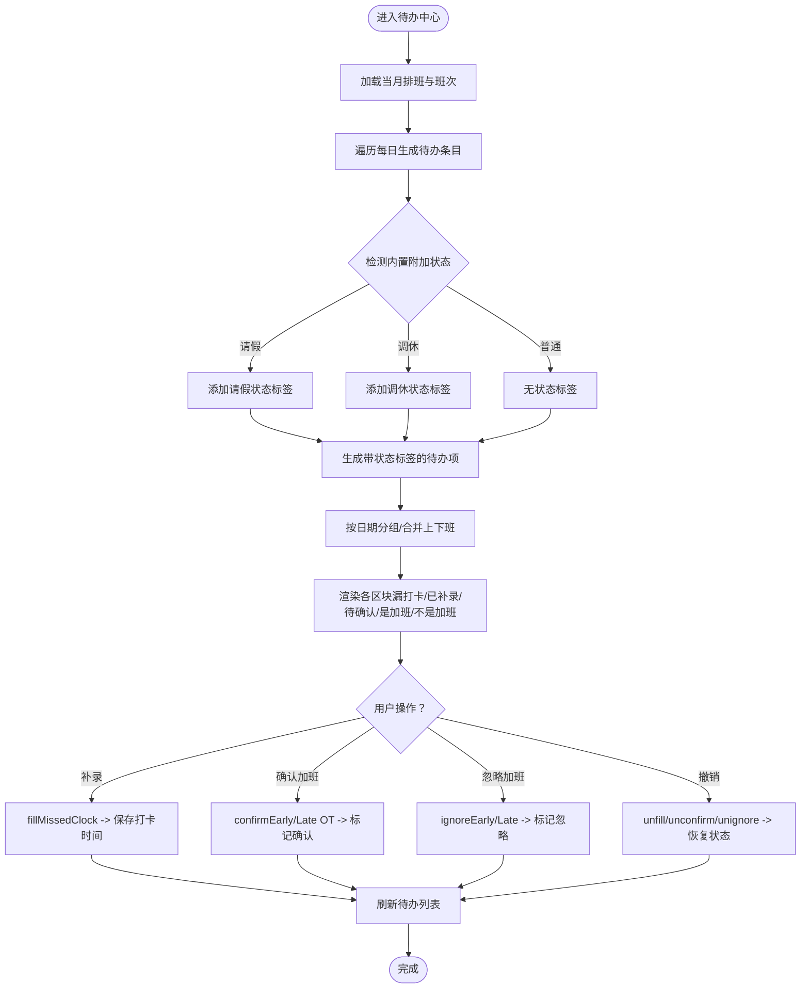
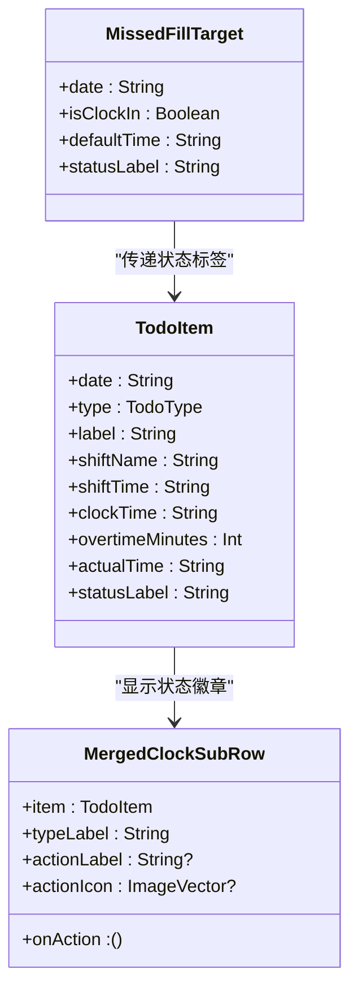
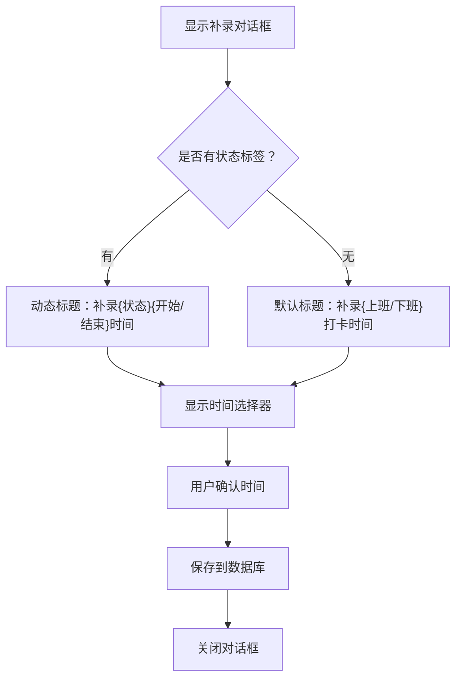
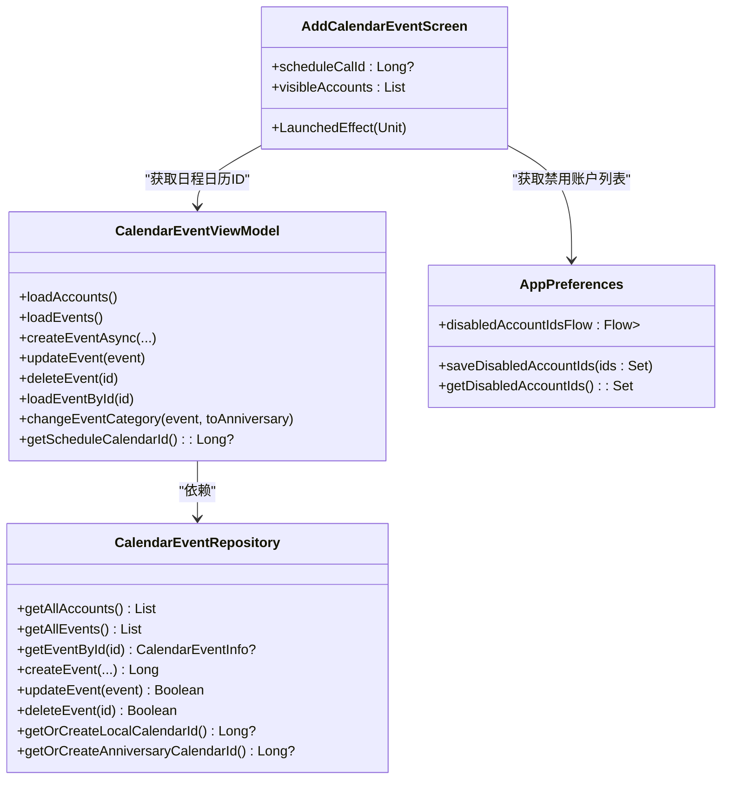
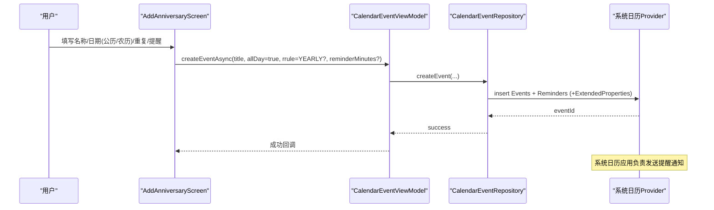
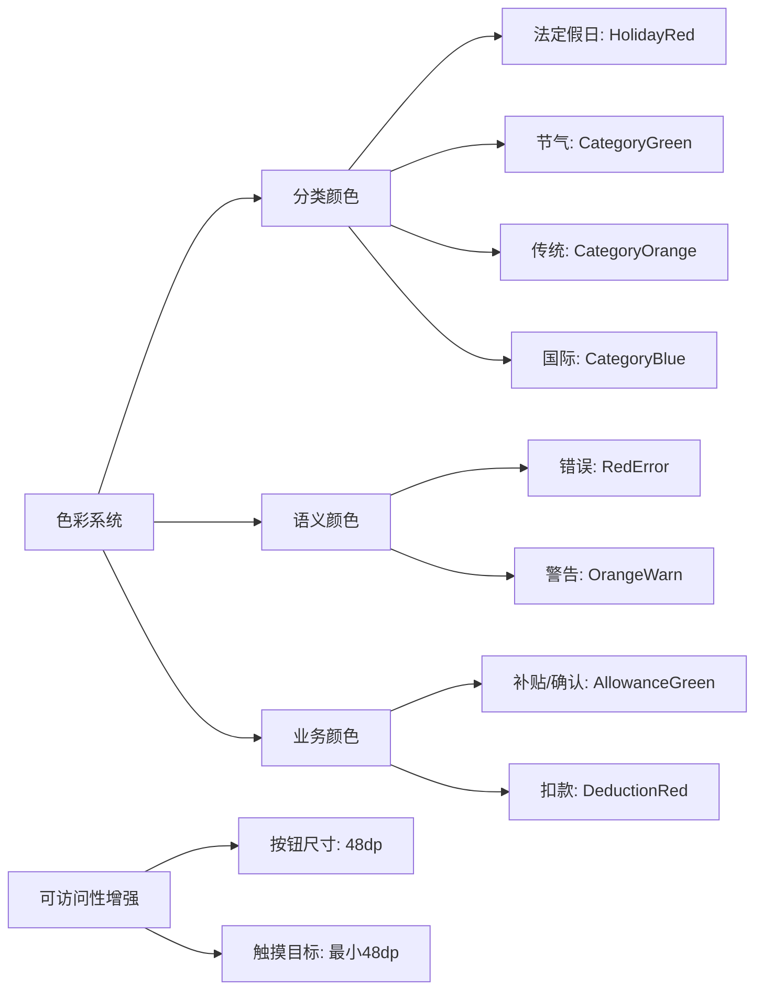
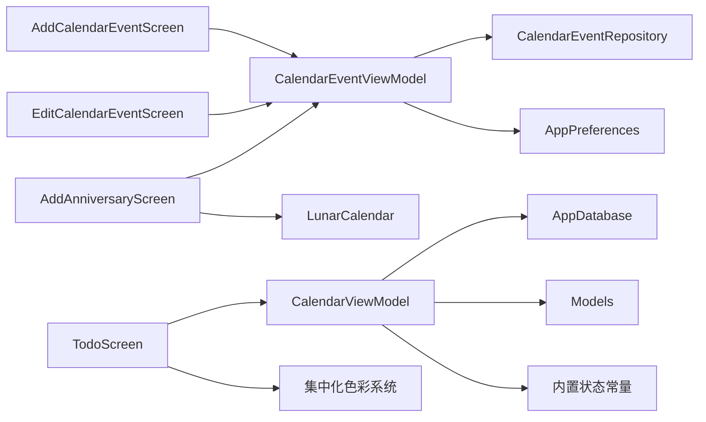

# 待办事项中心

<cite>
**本文引用的文件**   
- [MainActivity.kt](file://app/src/main/java/com/schedulecalendar/app/MainActivity.kt)
- [ScheduleApp.kt](file://app/src/main/java/com/schedulecalendar/app/ScheduleApp.kt)
- [TodoScreen.kt](file://app/src/main/java/com/schedulecalendar/app/ui/todo/TodoScreen.kt)
- [CalendarEventViewModel.kt](file://app/src/main/java/com/schedulecalendar/app/ui/todo/CalendarEventViewModel.kt)
- [AddCalendarEventScreen.kt](file://app/src/main/java/com/schedulecalendar/app/ui/todo/AddCalendarEventScreen.kt)
- [EditCalendarEventScreen.kt](file://app/src/main/java/com/schedulecalendar/app/ui/todo/EditCalendarEventScreen.kt)
- [EventFormComponents.kt](file://app/src/main/java/com/schedulecalendar/app/ui/todo/EventFormComponents.kt)
- [CalendarEventRepository.kt](file://app/src/main/java/com/schedulecalendar/app/data/calendar/CalendarEventRepository.kt)
- [CalendarViewModel.kt](file://app/src/main/java/com/schedulecalendar/app/ui/calendar/CalendarViewModel.kt)
- [LunarCalendar.kt](file://app/src/main/java/com/schedulecalendar/app/domain/model/LunarCalendar.kt)
- [AnniversaryReminderReceiver.kt](file://app/src/main/java/com/schedulecalendar/app/reminder/AnniversaryReminderReceiver.kt)
- [AddAnniversaryScreen.kt](file://app/src/main/java/com/schedulecalendar/app/ui/todo/AddAnniversaryScreen.kt)
- [Models.kt](file://app/src/main/java/com/schedulecalendar/app/domain/model/Models.kt)
- [AppDatabase.kt](file://app/src/main/java/com/schedulecalendar/app/data/db/AppDatabase.kt)
- [AppPreferences.kt](file://app/src/main/java/com/schedulecalendar/app/data/prefs/AppPreferences.kt)
- [Color.kt](file://app/src/main/java/com/schedulecalendar/app/ui/theme/Color.kt)
</cite>

## 更新摘要
**已进行的更改**   
- **更新了** 待办事项界面颜色系统，节假日分类颜色现在使用集中化的 CategoryGreen、CategoryOrange、CategoryBlue 常量替代硬编码值
- **增强了** 可访问性支持，所有操作按钮和交互元素尺寸统一增加到 48dp，提升触摸体验
- **优化了** 加班确认对话框的视觉一致性，主操作按钮使用 AllowanceGreen 颜色保持整体配色方案一致
- **改进了** 状态标签功能，MissedFillTarget数据类现在包含statusLabel参数以携带关于漏打卡是否与请假或调休状态相关的上下文信息
- **合并了** 打卡行组件显示视觉指示器，使用彩色徽章区分常规班次和特殊状态如请假或调休

## 目录
1. [简介](#简介)
2. [项目结构](#项目结构)
3. [核心组件](#核心组件)
4. [架构总览](#架构总览)
5. [详细组件分析](#详细组件分析)
6. [依赖关系分析](#依赖关系分析)
7. [性能考量](#性能考量)
8. [故障排查指南](#故障排查指南)
9. [结论](#结论)
10. [附录](#附录)

## 简介
本文件为"待办事项中心"的综合技术文档，围绕以下能力进行系统化说明：
- 漏打卡补录、加班确认与忽略的业务逻辑与实现路径
- 日程事件管理（创建、编辑、删除）与系统日历服务集成机制（权限、同步、数据一致性）
- 纪念日管理（农历计算、节日识别、系统日历提醒机制）
- 待办事项的优先级排序、状态管理与批量操作
- **新增**：状态标签功能，支持请假、调休等特殊状态的视觉标识
- **更新**：统一的色彩系统和增强的可访问性设计
- 扩展新待办类型的示例方法
- 数据持久化策略与异常处理方案

## 项目结构
待办中心位于 UI 层 todo 包与 calendar 模块的协作中，通过 ViewModel 聚合业务逻辑，Repository 对接系统日历 Provider，Room 数据库负责排班与打卡记录等本地数据。

图表来源
- [TodoScreen.kt:1-200](file://app/src/main/java/com/schedulecalendar/app/ui/todo/TodoScreen.kt#L1-L200)
- [CalendarEventViewModel.kt:1-120](file://app/src/main/java/com/schedulecalendar/app/ui/todo/CalendarEventViewModel.kt#L1-L120)
- [CalendarEventRepository.kt:1-120](file://app/src/main/java/com/schedulecalendar/app/data/calendar/CalendarEventRepository.kt#L1-L120)
- [CalendarViewModel.kt:1-120](file://app/src/main/java/com/schedulecalendar/app/ui/calendar/CalendarViewModel.kt#L1-L120)
- [LunarCalendar.kt:1-120](file://app/src/main/java/com/schedulecalendar/app/domain/model/LunarCalendar.kt#L1-L120)
- [AnniversaryReminderReceiver.kt:1-57](file://app/src/main/java/com/schedulecalendar/app/reminder/AnniversaryReminderReceiver.kt#L1-L57)
- [AppDatabase.kt:1-35](file://app/src/main/java/com/schedulecalendar/app/data/db/AppDatabase.kt#L1-L35)
- [AppPreferences.kt:1-313](file://app/src/main/java/com/schedulecalendar/app/data/prefs/AppPreferences.kt#L1-L313)

章节来源
- [MainActivity.kt:1-105](file://app/src/main/java/com/schedulecalendar/app/MainActivity.kt#L1-L105)
- [ScheduleApp.kt:1-9](file://app/src/main/java/com/schedulecalendar/app/ScheduleApp.kt#L1-L9)

## 核心组件
- 待办中心主界面：按类型分组展示漏打卡、已补录、疑似加班待确认、是加班、不是加班等条目；支持展开/折叠、日期排序与合并显示。
- **新增**：状态标签功能，在漏打卡补录时携带请假、调休等特殊状态的上下文信息，并在UI上显示相应的视觉指示器。
- 日程事件管理：创建/编辑/删除系统日历事件，支持重复规则、提醒时间、颜色、地点、描述、账户选择。**新增**：自动选择专用排班日历功能，智能过滤禁用账户。
- 纪念日管理：支持公历/农历输入、每年重复、**仅使用系统日历提醒**。
- 视图模型：
  - CalendarViewModel：构建当月待办、月份切换、补录/确认/忽略加班、撤销操作、批量操作、复制排班、加载选中日期的纪念日与日程。
  - CalendarEventViewModel：权限检查、账户与事件加载、ContentObserver 监听变化、单事件加载、分类过滤（日程 vs 纪念日）、**新增**：日程日历ID管理和禁用账户过滤。
- 数据仓库：CalendarEventRepository 封装对 Android Calendar Provider 的读写，含本地账户与日历的自动创建、批量查询优化、提醒与扩展属性写入。
- 偏好设置：AppPreferences 提供 DataStore 流式数据访问，包括禁用账户ID列表、账户分类映射等配置。
- 领域模型：Models.kt 定义班次、排班记录、薪资配置、考勤规则等；LunarCalendar.kt 提供权威农历转换与黄历信息。
- 提醒：AnniversaryReminderReceiver 作为备用接收器存在，但纪念日提醒现已完全依赖系统日历提醒机制。

章节来源
- [TodoScreen.kt:218-417](file://app/src/main/java/com/schedulecalendar/app/ui/todo/TodoScreen.kt#L218-L417)
- [CalendarEventViewModel.kt:46-152](file://app/src/main/java/com/schedulecalendar/app/ui/todo/CalendarEventViewModel.kt#L46-L152)
- [CalendarEventRepository.kt:46-120](file://app/src/main/java/com/schedulecalendar/app/data/calendar/CalendarEventRepository.kt#L46-L120)
- [CalendarViewModel.kt:104-247](file://app/src/main/java/com/schedulecalendar/app/ui/calendar/CalendarViewModel.kt#L104-L247)
- [Models.kt:80-141](file://app/src/main/java/com/schedulecalendar/app/domain/model/Models.kt#L80-L141)
- [LunarCalendar.kt:13-104](file://app/src/main/java/com/schedulecalendar/app/domain/model/LunarCalendar.kt#L13-L104)
- [AnniversaryReminderReceiver.kt:14-57](file://app/src/main/java/com/schedulecalendar/app/reminder/AnniversaryReminderReceiver.kt#L14-L57)
- [AppPreferences.kt:252-262](file://app/src/main/java/com/schedulecalendar/app/data/prefs/AppPreferences.kt#L252-L262)

## 架构总览
待办中心采用 MVVM + Repository 分层，UI 层通过 Compose 页面驱动 ViewModel，ViewModel 组合多个 Repository 与 Domain 工具类完成业务编排，最终落库或调用系统日历 Provider。

图表来源
- [TodoScreen.kt:170-201](file://app/src/main/java/com/schedulecalendar/app/ui/todo/TodoScreen.kt#L170-L201)
- [CalendarViewModel.kt:418-455](file://app/src/main/java/com/schedulecalendar/app/ui/calendar/CalendarViewModel.kt#L418-L455)
- [CalendarEventViewModel.kt:372-397](file://app/src/main/java/com/schedulecalendar/app/ui/todo/CalendarEventViewModel.kt#L372-397)
- [CalendarEventRepository.kt:275-330](file://app/src/main/java/com/schedulecalendar/app/data/calendar/CalendarEventRepository.kt#L275-330)

## 详细组件分析

### 待办中心（漏打卡补录、加班确认、状态标签）
- 数据源：CalendarViewModel 基于当月排班记录与班次配置生成 TodoItem 列表，按日期降序排列，同一天上班/下班合并显示。
- **新增**：状态标签功能，支持识别内置附加状态（请假/调休），在生成待办项时携带statusLabel参数。
- 业务规则：
  - 漏打卡：有班次但缺少实际开始/结束时间则产生"漏打卡"条目；若已补录则显示"已补录"。
  - **新增**：内置附加状态检测，当appliedStatus为请假或调休时，自动生成对应的状态标签。
  - 加班确认：早到/晚退分别独立判断，超过配置的计量粒度才进入"待确认"，确认后进入"是加班"，忽略后进入"不是加班"。
- 交互流程：
  - 漏打卡补录：弹出时间选择器，根据状态标签动态调整标题（如"请假补录上班时间"），确认后更新对应记录的 actualStartTime/actualEndTime。
  - 加班处理：弹窗确认/忽略，更新 confirmEarlyOT/confirmLateOT 或 ignoreEarlyArrival/ignoreLateLeave。
  - 撤销：提供取消补录与取消确认/忽略的操作。

图表来源
- [CalendarViewModel.kt:249-324](file://app/src/main/java/com/schedulecalendar/app/ui/calendar/CalendarViewModel.kt#L249-L324)
- [CalendarViewModel.kt:418-499](file://app/src/main/java/com/schedulecalendar/app/ui/calendar/CalendarViewModel.kt#L418-L499)
- [TodoScreen.kt:314-417](file://app/src/main/java/com/schedulecalendar/app/ui/todo/TodoScreen.kt#L314-L417)

章节来源
- [CalendarViewModel.kt:249-324](file://app/src/main/java/com/schedulecalendar/app/ui/calendar/CalendarViewModel.kt#L249-L324)
- [CalendarViewModel.kt:418-499](file://app/src/main/java/com/schedulecalendar/app/ui/calendar/CalendarViewModel.kt#L418-L499)
- [TodoScreen.kt:218-417](file://app/src/main/java/com/schedulecalendar/app/ui/todo/TodoScreen.kt#L218-L417)
- [Models.kt:80-141](file://app/src/main/java/com/schedulecalendar/app/domain/model/Models.kt#L80-L141)

### 状态标签功能增强
- **新增**：MissedFillTarget数据类包含statusLabel参数，用于携带漏打卡时的状态上下文信息。
- **新增**：TodoItem数据类增加statusLabel字段，支持存储内置附加状态名称（如"请假"、"调休"）。
- **新增**：MergedClockSubRow组件中的状态标签显示，使用彩色徽章区分常规班次和特殊状态。
- **新增**：MissedClockFillDialog弹窗标题动态调整，根据statusLabel显示相应的补录提示。

图表来源
- [TodoScreen.kt:59](file://app/src/main/java/com/schedulecalendar/app/ui/todo/TodoScreen.kt#L59)
- [CalendarViewModel.kt:35-46](file://app/src/main/java/com/schedulecalendar/app/ui/calendar/CalendarViewModel.kt#L35-L46)
- [TodoScreen.kt:647-716](file://app/src/main/java/com/schedulecalendar/app/ui/todo/TodoScreen.kt#L647-L716)

**更新** 状态标签功能现已完整实现，支持在漏打卡补录过程中携带和处理请假、调休等特殊状态的上下文信息，并在UI上提供直观的视觉反馈。

章节来源
- [TodoScreen.kt:59](file://app/src/main/java/com/schedulecalendar/app/ui/todo/TodoScreen.kt#L59)
- [CalendarViewModel.kt:35-46](file://app/src/main/java/com/schedulecalendar/app/ui/calendar/CalendarViewModel.kt#L35-L46)
- [TodoScreen.kt:647-716](file://app/src/main/java/com/schedulecalendar/app/ui/todo/TodoScreen.kt#L647-L716)
- [TodoScreen.kt:724-775](file://app/src/main/java/com/schedulecalendar/app/ui/todo/TodoScreen.kt#L724-L775)

### 漏打卡补录弹窗标题优化
- **更新**：MissedClockFillDialog函数中的对话框标题逻辑已优化，从原来的"补录上班/下班时间"改为更清晰的"补录开始/结束时间"。
- **更新**：当存在statusLabel（如请假、调休）时，标题格式为"补录{状态}{开始/结束}时间"，提供更好的上下文信息。
- **更新**：普通情况下保持原有的"补录上班打卡时间"或"补录下班打卡时间"格式。

图表来源
- [TodoScreen.kt:724-775](file://app/src/main/java/com/schedulecalendar/app/ui/todo/TodoScreen.kt#L724-L775)

**更新** 对话框标题优化提升了用户体验，特别是在处理请假、调休等特殊状态时，能够提供更准确的上下文信息，帮助用户更好地理解当前操作的含义。

章节来源
- [TodoScreen.kt:724-775](file://app/src/main/java/com/schedulecalendar/app/ui/todo/TodoScreen.kt#L724-L775)

### 日程事件管理（创建/编辑/删除）
- 权限管理：进入页面即请求 WRITE_CALENDAR 权限，无权限时阻止创建/编辑。
- 账户与日历：
  - 首次使用自动创建应用自有账户与"日程"日历，优先写入该日历。
  - 支持多账户/多日历选择，默认将应用自有账户置顶。
  - **新增**：自动选择专用排班日历功能，通过 `getScheduleCalendarId()` 方法获取应用专用的日程日历ID。
- 事件字段：标题、描述、地点、全天/非全天、开始/结束时间、重复规则（RRULE）、提醒时间、颜色。
- 数据一致性：
  - 通过 ContentObserver 监听系统日历变更，自动刷新列表。
  - 创建/更新成功后触发 loadEvents 以保持一致性。
- 单事件加载：编辑页按 ID 直接加载事件，避免全量列表依赖。
- **新增**：禁用账户过滤功能，只显示活跃日历供用户选择。

图表来源
- [CalendarEventViewModel.kt:46-152](file://app/src/main/java/com/schedulecalendar/app/ui/todo/CalendarEventViewModel.kt#L46-L152)
- [CalendarEventRepository.kt:46-120](file://app/src/main/java/com/schedulecalendar/app/data/calendar/CalendarEventRepository.kt#L46-L120)
- [AddCalendarEventScreen.kt:71-82](file://app/src/main/java/com/schedulecalendar/app/ui/todo/AddCalendarEventScreen.kt#L71-L82)
- [AppPreferences.kt:252-262](file://app/src/main/java/com/schedulecalendar/app/data/prefs/AppPreferences.kt#L252-L262)

**更新** 日程事件创建界面现已增强自动选择专用排班日历的功能。当用户进入新建日程页面时，系统会自动获取应用专用的日程日历ID并设置为默认选项，同时智能过滤掉被禁用的账户，只显示活跃的日历供用户选择。

章节来源
- [AddCalendarEventScreen.kt:1-316](file://app/src/main/java/com/schedulecalendar/app/ui/todo/AddCalendarEventScreen.kt#L1-L316)
- [EditCalendarEventScreen.kt:1-316](file://app/src/main/java/com/schedulecalendar/app/ui/todo/EditCalendarEventScreen.kt#L1-L316)
- [CalendarEventViewModel.kt:158-265](file://app/src/main/java/com/schedulecalendar/app/ui/todo/CalendarEventViewModel.kt#L158-L265)
- [CalendarEventRepository.kt:412-517](file://app/src/main/java/com/schedulecalendar/app/data/calendar/CalendarEventRepository.kt#L412-L517)
- [EventFormComponents.kt:33-53](file://app/src/main/java/com/schedulecalendar/app/ui/todo/EventFormComponents.kt#L33-L53)
- [AppPreferences.kt:252-262](file://app/src/main/java/com/schedulecalendar/app/data/prefs/AppPreferences.kt#L252-L262)

### 纪念日管理（农历计算、节日识别、系统日历提醒）
- 农历计算：基于权威库进行公历/农历互转，支持闰月与干支、生肖等信息展示。
- 节日识别：结合节气与节假日数据，在详情页展示相关信息。
- 存储与展示：
  - 纪念日事件写入"纪念日"专用日历（红色），标题前缀"纪念日: "且可带年度重复 RRULE。
  - 在"日程"标签页过滤掉纪念日事件，在"纪念日"标签页仅显示纪念日事件。
- **更新** 提醒机制：
  - **仅使用系统日历提醒**：通过 Reminders 表设置提前分钟数，部分国产 ROM 兼容 ExtendedProperties。
  - **已移除**：精确闹钟提醒功能（AnniversaryReminder 枚举类和 AlarmManager.setAlarmClock() 调度逻辑）。
  - 用户现在完全依赖系统日历应用的提醒功能，不再使用自定义的精确闹钟通知。

图表来源
- [AddAnniversaryScreen.kt:534-629](file://app/src/main/java/com/schedulecalendar/app/ui/todo/AddAnniversaryScreen.kt#L534-L629)
- [CalendarEventViewModel.kt:372-397](file://app/src/main/java/com/schedulecalendar/app/ui/todo/CalendarEventViewModel.kt#L372-397)
- [CalendarEventRepository.kt:275-381](file://app/src/main/java/com/schedulecalendar/app/data/calendar/CalendarEventRepository.kt#L275-381)

章节来源
- [LunarCalendar.kt:35-104](file://app/src/main/java/com/schedulecalendar/app/domain/model/LunarCalendar.kt#L35-L104)
- [AddAnniversaryScreen.kt:1-689](file://app/src/main/java/com/schedulecalendar/app/ui/todo/AddAnniversaryScreen.kt#L1-L689)
- [CalendarEventViewModel.kt:72-119](file://app/src/main/java/com/schedulecalendar/app/ui/todo/CalendarEventViewModel.kt#L72-L119)
- [CalendarEventRepository.kt:525-583](file://app/src/main/java/com/schedulecalendar/app/data/calendar/CalendarEventRepository.kt#L525-L583)

### 优先级排序、状态管理与批量操作
- 优先级排序：待办按日期降序，同一天内上班在前、下班在后（通过统一行组件与合并行组件实现）。
- 状态管理：
  - 补录状态：MISSED_CLOCK_IN/MISSED_CLOCK_OUT → FILLED_CLOCK_IN/FILLED_CLOCK_OUT
  - 加班状态：PENDING_EARLY_OT/PENDING_LATE_OT → CONFIRMED_* / IGNORED_*
  - **新增**：状态标签状态：空字符串 → "请假"/"调休"等内置附加状态名称
- 批量操作：
  - 批量设置排班与附加状态
  - 批量删除排班
  - 全选/清空选择
  - 复制排班（范围复制与跨月复制）

章节来源
- [TodoScreen.kt:479-700](file://app/src/main/java/com/schedulecalendar/app/ui/todo/TodoScreen.kt#L479-700)
- [CalendarViewModel.kt:552-793](file://app/src/main/java/com/schedulecalendar/app/ui/calendar/CalendarViewModel.kt#L552-L793)

### 扩展新待办类型与处理逻辑（示例）
- 步骤概览：
  1. 在 TodoType 枚举新增类型（如 MISSED_BREAK、CONFIRMED_BREAK）。
  2. 在 buildTodos 中增加对应判定逻辑，生成新的 TodoItem。
  3. 在 TodoTab 中新增分组区块与交互（弹窗/按钮）。
  4. 在 CalendarViewModel 中实现对应的保存/撤销方法，更新 ScheduleRecord 字段。
  5. 如需持久化新字段，在 Models.kt 的 ScheduleRecord 中添加字段，并在 DAO/Entity 层同步迁移。
- 参考路径：
  - 枚举与模型：[Models.kt:80-141](file://app/src/main/java/com/schedulecalendar/app/domain/model/Models.kt#L80-L141)
  - 待办构建：[CalendarViewModel.kt:249-324](file://app/src/main/java/com/schedulecalendar/app/ui/calendar/CalendarViewModel.kt#L249-L324)
  - 界面分组：[TodoScreen.kt:218-417](file://app/src/main/java/com/schedulecalendar/app/ui/todo/TodoScreen.kt#L218-L417)

章节来源
- [Models.kt:80-141](file://app/src/main/java/com/schedulecalendar/app/domain/model/Models.kt#L80-L141)
- [CalendarViewModel.kt:249-324](file://app/src/main/java/com/schedulecalendar/app/ui/calendar/CalendarViewModel.kt#L249-L324)
- [TodoScreen.kt:218-417](file://app/src/main/java/com/schedulecalendar/app/ui/todo/TodoScreen.kt#L218-L417)

### 色彩系统与可访问性增强
- **更新** 集中化色彩管理：节假日分类颜色现在使用 CategoryGreen、CategoryOrange、CategoryBlue 等集中化常量，替代之前的硬编码值，确保视觉一致性。
- **增强** 可访问性支持：所有操作按钮和交互元素尺寸统一增加到 48dp，符合 Material Design 可访问性标准，提升触摸体验。
- **优化** 加班确认对话框：主操作按钮使用 AllowanceGreen 颜色，保持整体配色方案的一致性。
- **改进** 视觉层次：通过统一的色彩系统和尺寸规范，提升了界面的可读性和易用性。

图表来源
- [Color.kt:34-39](file://app/src/main/java/com/schedulecalendar/app/ui/theme/Color.kt#L34-L39)
- [TodoScreen.kt:579-584](file://app/src/main/java/com/schedulecalendar/app/ui/todo/TodoScreen.kt#L579-L584)
- [TodoScreen.kt:701-706](file://app/src/main/java/com/schedulecalendar/app/ui/todo/TodoScreen.kt#L701-L706)
- [TodoScreen.kt:802-812](file://app/src/main/java/com/schedulecalendar/app/ui/todo/TodoScreen.kt#L802-L812)

**更新** 色彩系统和可访问性的增强显著提升了用户体验，统一的色彩管理确保了视觉一致性，而增强的触摸目标尺寸改善了可访问性。

章节来源
- [Color.kt:34-39](file://app/src/main/java/com/schedulecalendar/app/ui/theme/Color.kt#L34-L39)
- [TodoScreen.kt:579-584](file://app/src/main/java/com/schedulecalendar/app/ui/todo/TodoScreen.kt#L579-L584)
- [TodoScreen.kt:701-706](file://app/src/main/java/com/schedulecalendar/app/ui/todo/TodoScreen.kt#L701-L706)
- [TodoScreen.kt:802-812](file://app/src/main/java/com/schedulecalendar/app/ui/todo/TodoScreen.kt#L802-L812)

## 依赖关系分析
- UI 层依赖 ViewModel，ViewModel 依赖 Repository 与 Domain 工具类。
- Repository 直接访问系统日历 Provider，必要时创建应用自有账户与日历。
- Room 数据库用于排班、打卡、附加项等本地数据持久化。
- **更新** 提醒机制简化：纪念日提醒完全依赖系统日历应用，不再需要自定义的 AlarmManager 调度。
- **新增**：AppPreferences 提供 DataStore 流式数据访问，支持禁用账户ID列表和账户分类映射的配置管理。
- **新增**：状态标签功能依赖内置状态常量（BUILTIN_STATUS_LEAVE、BUILTIN_STATUS_SWAP）进行识别。
- **更新**：色彩系统通过集中化的 Color.kt 文件管理，确保全局一致性。

图表来源
- [TodoScreen.kt:1-120](file://app/src/main/java/com/schedulecalendar/app/ui/todo/TodoScreen.kt#L1-L120)
- [CalendarEventViewModel.kt:46-120](file://app/src/main/java/com/schedulecalendar/app/ui/todo/CalendarEventViewModel.kt#L46-L120)
- [CalendarEventRepository.kt:46-120](file://app/src/main/java/com/schedulecalendar/app/data/calendar/CalendarEventRepository.kt#L46-L120)
- [CalendarViewModel.kt:104-132](file://app/src/main/java/com/schedulecalendar/app/ui/calendar/CalendarViewModel.kt#L104-L132)
- [AppDatabase.kt:17-35](file://app/src/main/java/com/schedulecalendar/app/data/db/AppDatabase.kt#L17-L35)
- [LunarCalendar.kt:13-104](file://app/src/main/java/com/schedulecalendar/app/domain/model/LunarCalendar.kt#L13-L104)
- [AppPreferences.kt:252-262](file://app/src/main/java/com/schedulecalendar/app/data/prefs/AppPreferences.kt#L252-L262)
- [Models.kt:75-79](file://app/src/main/java/com/schedulecalendar/app/domain/model/Models.kt#L75-L79)
- [Color.kt:34-39](file://app/src/main/java/com/schedulecalendar/app/ui/theme/Color.kt#L34-L39)

章节来源
- [CalendarEventViewModel.kt:120-152](file://app/src/main/java/com/schedulecalendar/app/ui/todo/CalendarEventViewModel.kt#L120-L152)
- [CalendarEventRepository.kt:64-105](file://app/src/main/java/com/schedulecalendar/app/data/calendar/CalendarEventRepository.kt#L64-L105)
- [AppPreferences.kt:252-262](file://app/src/main/java/com/schedulecalendar/app/data/prefs/AppPreferences.kt#L252-L262)

## 性能考量
- 批量加载日历信息：Repository 在获取所有事件前先批量加载日历信息，避免 N+1 查询。
- 流式更新：ViewModel 使用 StateFlow 与 combine 响应式更新，减少不必要的重组。
- 懒加载：纪念日列表与日程列表通过 combine 与过滤条件按需计算，避免全量渲染。
- 协程调度：IO 操作在 Dispatchers.IO 执行，避免阻塞主线程。
- **新增**：禁用账户过滤在UI层进行，避免频繁的数据查询，提升用户体验。
- **更新**：移除精确闹钟调度减少了系统资源消耗，简化了提醒机制的复杂度。
- **新增**：状态标签计算在数据构建阶段完成，避免UI层的重复计算。
- **更新**：集中化色彩管理减少了颜色计算的开销，提升了渲染性能。

章节来源
- [CalendarEventRepository.kt:155-203](file://app/src/main/java/com/schedulecalendar/app/data/calendar/CalendarEventRepository.kt#L155-L203)
- [CalendarEventViewModel.kt:96-152](file://app/src/main/java/com/schedulecalendar/app/ui/todo/CalendarEventViewModel.kt#L96-L152)
- [CalendarViewModel.kt:134-247](file://app/src/main/java/com/schedulecalendar/app/ui/calendar/CalendarViewModel.kt#L134-L247)
- [AddCalendarEventScreen.kt:78-82](file://app/src/main/java/com/schedulecalendar/app/ui/todo/AddCalendarEventScreen.kt#L78-L82)

## 故障排查指南
- 权限问题：
  - 现象：无法创建/编辑日程或读取事件。
  - 排查：检查 READ/WRITE_CALENDAR 权限是否授予；查看 SecurityException 日志。
  - 参考：权限检查与请求入口。
- 账户/日历不存在：
  - 现象：创建事件失败或找不到目标日历。
  - 排查：确认 getOrCreateLocalCalendarId/getOrCreateAnniversaryCalendarId 是否返回有效 ID。
- **更新** 提醒未触发：
  - 现象：纪念日或日程提醒不生效。
  - 排查：检查 Reminders 插入与 ExtendedProperties 写入；确认系统日历应用的提醒设置。
  - **注意**：由于已移除精确闹钟功能，请确保系统日历应用的提醒功能正常工作。
- 数据不一致：
  - 现象：外部修改日历后本地未刷新。
  - 排查：确认 ContentObserver 注册与 onChange 回调是否触发。
- **新增**：禁用账户问题：
  - 现象：某些日历账户在创建日程时不可见。
  - 排查：检查 AppPreferences 中的 disabledAccountIds 是否正确保存；确认 visibleAccounts 过滤逻辑是否正常。
  - 解决：在设置中重新启用被禁用的账户，或清除应用数据重置配置。
- **新增**：状态标签显示问题：
  - 现象：请假/调休状态标签不显示或显示错误。
  - 排查：检查 appliedStatus 是否为空；确认 BUILTIN_STATUS_LEAVE/BUILTIN_STATUS_SWAP 常量值；验证 statusLabel 字段是否正确传递。
  - 解决：重新加载排班数据，确保内置状态正确识别。
- **新增**：对话框标题显示问题：
  - 现象：补录对话框标题显示不正确。
  - 排查：检查 statusLabel 参数是否正确传递；确认对话框标题逻辑分支是否正确执行。
  - 解决：确保 MissedFillTarget 中的 statusLabel 字段正确填充，检查对话框标题生成逻辑。
- **更新**：色彩显示问题：
  - 现象：节假日分类颜色显示异常。
  - 排查：检查 CategoryGreen、CategoryOrange、CategoryBlue 常量是否正确引用；确认 Color.kt 文件中的颜色定义。
  - 解决：重新编译应用，确保颜色常量正确加载。
- **更新**：按钮尺寸问题：
  - 现象：操作按钮尺寸不符合预期。
  - 排查：检查 Modifier.size(48.dp) 是否正确应用；确认 Material Design 规范遵循情况。
  - 解决：确保所有交互元素的尺寸都设置为 48dp，符合可访问性标准。

章节来源
- [CalendarEventViewModel.kt:225-289](file://app/src/main/java/com/schedulecalendar/app/ui/todo/CalendarEventViewModel.kt#L225-L289)
- [CalendarEventRepository.kt:412-517](file://app/src/main/java/com/schedulecalendar/app/data/calendar/CalendarEventRepository.kt#L412-L517)
- [CalendarEventRepository.kt:335-381](file://app/src/main/java/com/schedulecalendar/app/data/calendar/CalendarEventRepository.kt#L335-L381)
- [AddCalendarEventScreen.kt:78-82](file://app/src/main/java/com/schedulecalendar/app/ui/todo/AddCalendarEventScreen.kt#L78-L82)
- [AppPreferences.kt:252-262](file://app/src/main/java/com/schedulecalendar/app/data/prefs/AppPreferences.kt#L252-L262)

## 结论
待办事项中心通过清晰的 MVVM 分层与 Repository 抽象，实现了漏打卡补录、加班确认、日程与纪念日管理的完整闭环。系统日历集成具备完善的权限控制、账户/日历自动创建、提醒兼容与数据一致性保障；纪念日管理融合农历计算与简化的系统日历提醒机制，满足复杂场景需求。配合批量操作与可扩展的待办类型设计，具备良好的可维护性与演进空间。

**最新更新**：状态标签功能现已完整实现，支持在漏打卡补录过程中携带和处理请假、调休等特殊状态的上下文信息，并在UI上提供直观的视觉反馈。对话框标题优化提升了用户体验，特别是在处理请假、调休等特殊状态时，能够提供更准确的上下文信息。日程事件创建界面现已支持自动选择专用排班日历和智能账户过滤功能，进一步提升了用户体验和操作效率。纪念日提醒机制已简化为仅依赖系统日历提醒，移除了复杂的精确闹钟调度逻辑。**新增**的集中化色彩系统和增强的可访问性设计，显著提升了界面的视觉一致性和用户友好性，所有操作按钮和交互元素都达到了 48dp 的可访问性标准。

## 附录
- 数据持久化策略：
  - 排班与打卡记录：Room 数据库（AppDatabase 版本 5，导出 schema 便于迁移）。
  - 日程与纪念日：Android Calendar Provider（应用自有账户与日历）。
  - 用户配置：DataStore（AppPreferences，支持流式数据访问）。
- 关键路径参考：
  - 数据库定义：[AppDatabase.kt:17-35](file://app/src/main/java/com/schedulecalendar/app/data/db/AppDatabase.kt#L17-L35)
  - 领域模型：[Models.kt:80-141](file://app/src/main/java/com/schedulecalendar/app/domain/model/Models.kt#L80-L141)
  - 日历仓库：[CalendarEventRepository.kt:275-381](file://app/src/main/java/com/schedulecalendar/app/data/calendar/CalendarEventRepository.kt#L275-381)
  - 偏好设置：[AppPreferences.kt:252-262](file://app/src/main/java/com/schedulecalendar/app/data/prefs/AppPreferences.kt#L252-L262)
  - 日程日历ID管理：[CalendarEventViewModel.kt:187-194](file://app/src/main/java/com/schedulecalendar/app/ui/todo/CalendarEventViewModel.kt#L187-L194)
  - 禁用账户过滤：[AddCalendarEventScreen.kt:78-82](file://app/src/main/java/com/schedulecalendar/app/ui/todo/AddCalendarEventScreen.kt#L78-L82)
  - **更新** 纪念日提醒：[CalendarEventRepository.kt:317-323](file://app/src/main/java/com/schedulecalendar/app/data/calendar/CalendarEventRepository.kt#L317-L323)
  - **新增** 状态标签功能：[CalendarViewModel.kt:292-314](file://app/src/main/java/com/schedulecalendar/app/ui/calendar/CalendarViewModel.kt#L292-L314)
  - **新增** 状态标签显示：[TodoScreen.kt:679-692](file://app/src/main/java/com/schedulecalendar/app/ui/todo/TodoScreen.kt#L679-L692)
  - **更新** 对话框标题优化：[TodoScreen.kt:744-748](file://app/src/main/java/com/schedulecalendar/app/ui/todo/TodoScreen.kt#L744-L748)
  - **更新** 集中化色彩系统：[Color.kt:34-39](file://app/src/main/java/com/schedulecalendar/app/ui/theme/Color.kt#L34-L39)
  - **更新** 可访问性增强：[TodoScreen.kt:579-584](file://app/src/main/java/com/schedulecalendar/app/ui/todo/TodoScreen.kt#L579-L584)