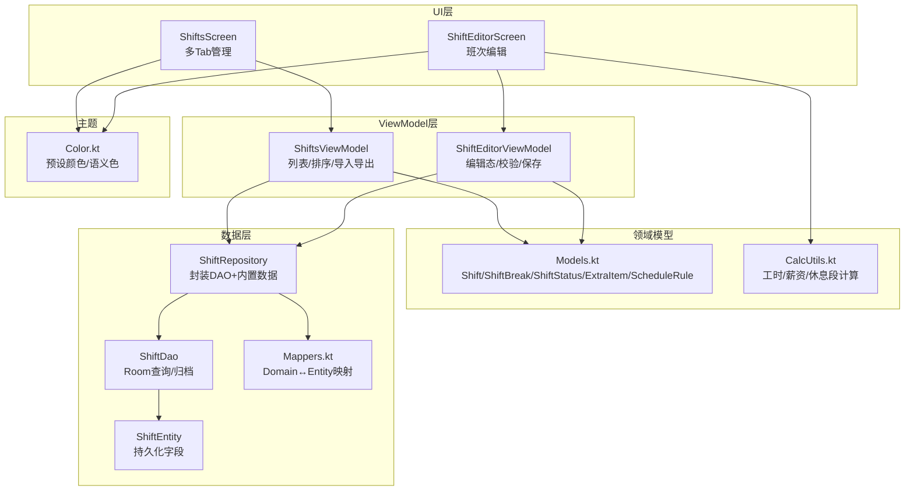
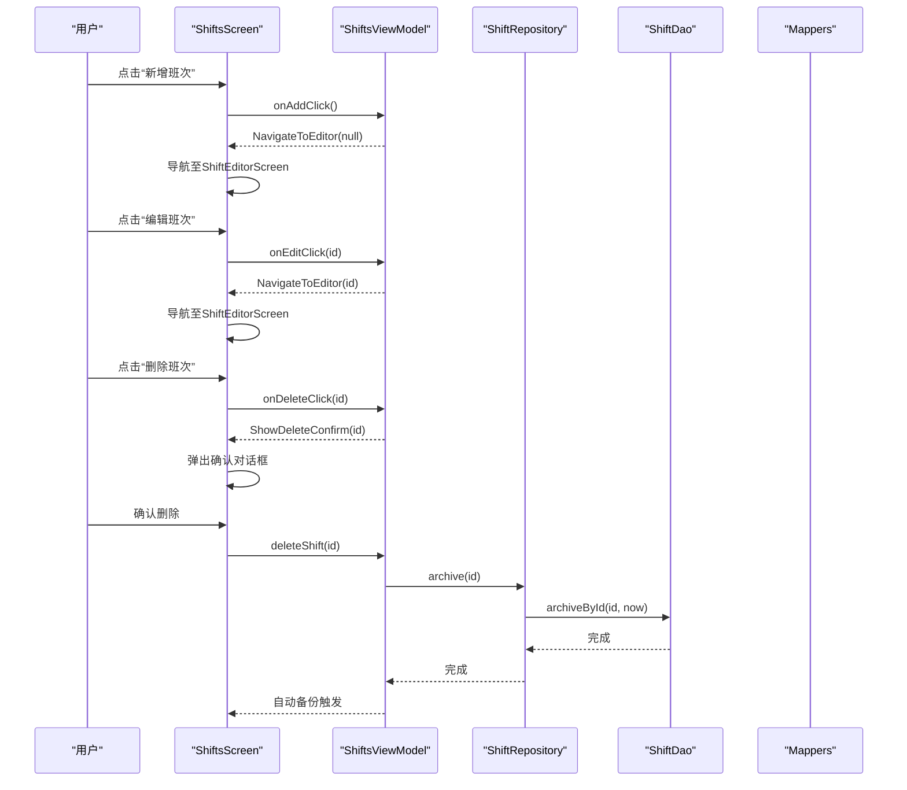
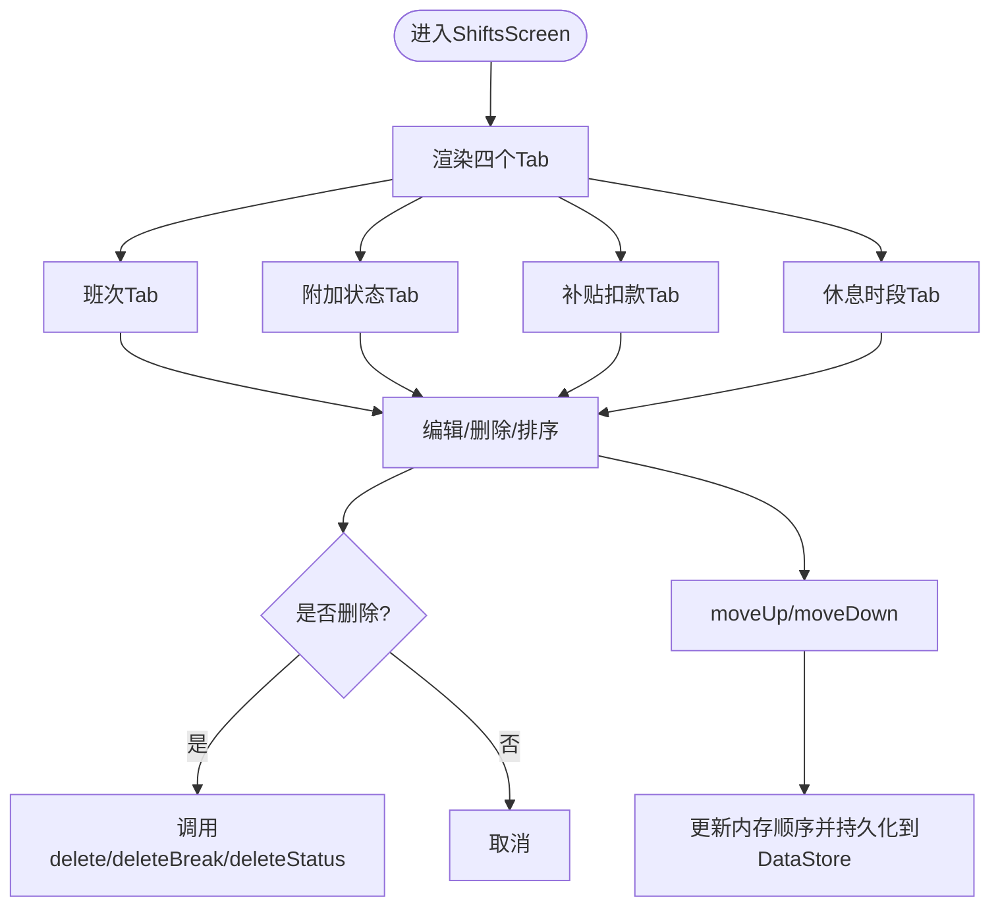
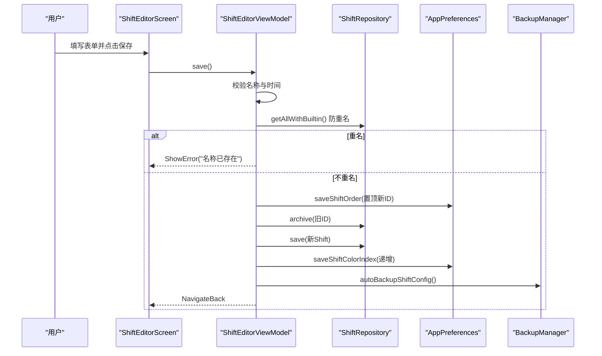
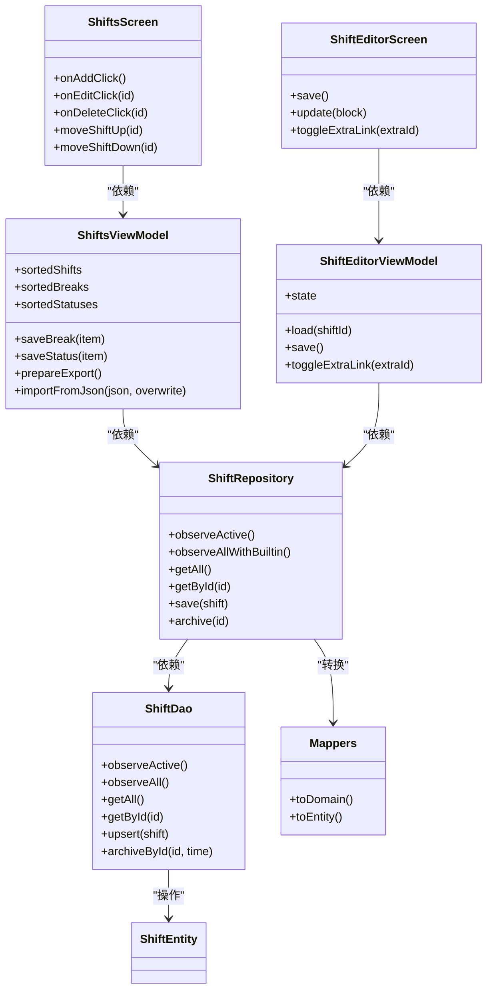

# 排班管理系统

<cite>
**本文引用的文件**   
- [ShiftsScreen.kt](file://app/src/main/java/com/schedulecalendar/app/ui/shifts/ShiftsScreen.kt)
- [ShiftEditorScreen.kt](file://app/src/main/java/com/schedulecalendar/app/ui/shifts/ShiftEditorScreen.kt)
- [ShiftsViewModel.kt](file://app/src/main/java/com/schedulecalendar/app/ui/shifts/ShiftsViewModel.kt)
- [Models.kt](file://app/src/main/java/com/schedulecalendar/app/domain/model/Models.kt)
- [CalcUtils.kt](file://app/src/main/java/com/schedulecalendar/app/domain/model/CalcUtils.kt)
- [ShiftRepository.kt](file://app/src/main/java/com/schedulecalendar/app/data/repository/ShiftRepository.kt)
- [Mappers.kt](file://app/src/main/java/com/schedulecalendar/app/data/repository/Mappers.kt)
- [ShiftEntity.kt](file://app/src/main/java/com/schedulecalendar/app/data/db/entity/ShiftEntity.kt)
- [ShiftDao.kt](file://app/src/main/java/com/schedulecalendar/app/data/db/dao/ShiftDao.kt)
- [Color.kt](file://app/src/main/java/com/schedulecalendar/app/ui/theme/Color.kt)
</cite>

## 目录
1. [简介](#简介)
2. [项目结构](#项目结构)
3. [核心组件](#核心组件)
4. [架构总览](#架构总览)
5. [详细组件分析](#详细组件分析)
6. [依赖关系分析](#依赖关系分析)
7. [性能与可扩展性](#性能与可扩展性)
8. [故障排查指南](#故障排查指南)
9. [结论](#结论)
10. [附录：最佳实践与扩展建议](#附录最佳实践与扩展建议)

## 简介
本文件面向Android排班日历应用中的“排班管理”子系统，聚焦班次定义、管理与编辑的完整实现。文档围绕以下目标展开：
- 解释 ShiftsScreen 与 ShiftEditorScreen 的设计模式与交互流程
- 说明班次类型系统、循环排班规则、休息时间配置等核心业务逻辑
- 阐述班次状态的动态管理、颜色主题配置与可视化展示
- 提供班次数据的CRUD操作、验证规则与错误处理机制
- 通过代码路径示例展示最佳实践与扩展方法

## 项目结构
排班管理子系统采用 MVVM + Compose UI 的分层架构：
- UI 层：ShiftsScreen（列表与多Tab管理）、ShiftEditorScreen（班次编辑）
- ViewModel 层：ShiftsViewModel（列表状态、排序、导入导出）、ShiftEditorViewModel（编辑态、校验、保存）
- 领域模型：Models.kt（Shift、ShiftBreak、ShiftStatus、ExtraItem、ScheduleRule 等）
- 计算工具：CalcUtils.kt（工时/薪资计算、全局休息段扣减、考勤粒度处理）
- 数据层：Repository + DAO + Entity（Room），以及 Mappers 负责领域模型与实体映射
- 主题与颜色：Color.kt（预设班次颜色、语义色）

图表来源
- [ShiftsScreen.kt:1-120](file://app/src/main/java/com/schedulecalendar/app/ui/shifts/ShiftsScreen.kt#L1-L120)
- [ShiftEditorScreen.kt:1-60](file://app/src/main/java/com/schedulecalendar/app/ui/shifts/ShiftEditorScreen.kt#L1-L60)
- [ShiftsViewModel.kt:1-120](file://app/src/main/java/com/schedulecalendar/app/ui/shifts/ShiftsViewModel.kt#L1-L120)
- [Models.kt:1-120](file://app/src/main/java/com/schedulecalendar/app/domain/model/Models.kt#L1-L120)
- [CalcUtils.kt:1-140](file://app/src/main/java/com/schedulecalendar/app/domain/model/CalcUtils.kt#L1-L140)
- [ShiftRepository.kt:1-45](file://app/src/main/java/com/schedulecalendar/app/data/repository/ShiftRepository.kt#L1-L45)
- [ShiftDao.kt:1-42](file://app/src/main/java/com/schedulecalendar/app/data/db/dao/ShiftDao.kt#L1-L42)
- [ShiftEntity.kt:1-24](file://app/src/main/java/com/schedulecalendar/app/data/db/entity/ShiftEntity.kt#L1-L24)
- [Mappers.kt:1-50](file://app/src/main/java/com/schedulecalendar/app/data/repository/Mappers.kt#L1-L50)
- [Color.kt:1-54](file://app/src/main/java/com/schedulecalendar/app/ui/theme/Color.kt#L1-L54)

章节来源
- [ShiftsScreen.kt:1-120](file://app/src/main/java/com/schedulecalendar/app/ui/shifts/ShiftsScreen.kt#L1-L120)
- [ShiftEditorScreen.kt:1-60](file://app/src/main/java/com/schedulecalendar/app/ui/shifts/ShiftEditorScreen.kt#L1-L60)
- [ShiftsViewModel.kt:1-120](file://app/src/main/java/com/schedulecalendar/app/ui/shifts/ShiftsViewModel.kt#L1-L120)
- [Models.kt:1-120](file://app/src/main/java/com/schedulecalendar/app/domain/model/Models.kt#L1-L120)
- [CalcUtils.kt:1-140](file://app/src/main/java/com/schedulecalendar/app/domain/model/CalcUtils.kt#L1-L140)
- [ShiftRepository.kt:1-45](file://app/src/main/java/com/schedulecalendar/app/data/repository/ShiftRepository.kt#L1-L45)
- [ShiftDao.kt:1-42](file://app/src/main/java/com/schedulecalendar/app/data/db/dao/ShiftDao.kt#L1-L42)
- [ShiftEntity.kt:1-24](file://app/src/main/java/com/schedulecalendar/app/data/db/entity/ShiftEntity.kt#L1-L24)
- [Mappers.kt:1-50](file://app/src/main/java/com/schedulecalendar/app/data/repository/Mappers.kt#L1-L50)
- [Color.kt:1-54](file://app/src/main/java/com/schedulecalendar/app/ui/theme/Color.kt#L1-L54)

## 核心组件
- ShiftsScreen：多Tab页面（班次、附加状态、补贴扣款、休息时段），支持新增、编辑、删除、排序、确认对话框、消息提示
- ShiftEditorScreen：班次编辑表单，包含名称、上下班时间、时长预览、颜色选择、默认关联补贴/扣款项、保存按钮
- ShiftsViewModel：维护班次/状态/休息时段的排序与CRUD、导入导出、自动备份
- ShiftEditorViewModel：编辑态管理、输入校验、重名检查、归档旧记录并创建新ID、递增颜色索引、导航回退
- Models.kt：定义Shift、ShiftBreak、ShiftStatus、ExtraItem、ScheduleRule等核心数据结构与常量
- CalcUtils.kt：工时/薪资计算、全局休息段扣减、考勤粒度处理、周末/节假日判断
- ShiftRepository + ShiftDao + ShiftEntity：Room数据访问与内置数据合并
- Color.kt：班次预设颜色与语义色

章节来源
- [ShiftsScreen.kt:1-200](file://app/src/main/java/com/schedulecalendar/app/ui/shifts/ShiftsScreen.kt#L1-L200)
- [ShiftEditorScreen.kt:1-120](file://app/src/main/java/com/schedulecalendar/app/ui/shifts/ShiftEditorScreen.kt#L1-L120)
- [ShiftsViewModel.kt:1-200](file://app/src/main/java/com/schedulecalendar/app/ui/shifts/ShiftsViewModel.kt#L1-L200)
- [Models.kt:1-120](file://app/src/main/java/com/schedulecalendar/app/domain/model/Models.kt#L1-L120)
- [CalcUtils.kt:1-140](file://app/src/main/java/com/schedulecalendar/app/domain/model/CalcUtils.kt#L1-L140)
- [ShiftRepository.kt:1-45](file://app/src/main/java/com/schedulecalendar/app/data/repository/ShiftRepository.kt#L1-L45)
- [ShiftDao.kt:1-42](file://app/src/main/java/com/schedulecalendar/app/data/db/dao/ShiftDao.kt#L1-L42)
- [ShiftEntity.kt:1-24](file://app/src/main/java/com/schedulecalendar/app/data/db/entity/ShiftEntity.kt#L1-L24)
- [Color.kt:1-54](file://app/src/main/java/com/schedulecalendar/app/ui/theme/Color.kt#L1-L54)

## 架构总览
排班管理子系统遵循清晰的MVVM分层：
- UI层使用Compose状态收集与事件派发，通过ViewModel暴露StateFlow驱动界面更新
- ViewModel协调Repository进行数据读写，并通过Channel发送一次性UI事件（如导航、提示）
- Repository封装DAO与内置数据合并，保证历史数据与内置类型的正确显示
- 领域模型集中定义业务结构与计算工具，确保跨模块一致性

图表来源
- [ShiftsScreen.kt:1-120](file://app/src/main/java/com/schedulecalendar/app/ui/shifts/ShiftsScreen.kt#L1-L120)
- [ShiftsViewModel.kt:1-160](file://app/src/main/java/com/schedulecalendar/app/ui/shifts/ShiftsViewModel.kt#L1-L160)
- [ShiftRepository.kt:1-45](file://app/src/main/java/com/schedulecalendar/app/data/repository/ShiftRepository.kt#L1-L45)
- [ShiftDao.kt:1-42](file://app/src/main/java/com/schedulecalendar/app/data/db/dao/ShiftDao.kt#L1-L42)
- [Mappers.kt:1-50](file://app/src/main/java/com/schedulecalendar/app/data/repository/Mappers.kt#L1-L50)

## 详细组件分析

### ShiftsScreen：多Tab排班管理入口
- Tab 1 班次列表：展示班次名称、颜色点、内置标签、时间信息与关联补贴数量；支持编辑、删除、上移/下移排序
- Tab 2 附加状态：展示状态名称、颜色、内置标签、报表类型映射；支持编辑、删除、排序
- Tab 3 补贴扣款：展示名称与金额，支持编辑、删除、排序
- Tab 4 休息时段：展示标签与时间段，支持编辑、删除、排序；内部弹窗编辑器含名称唯一性与时间重叠校验
- 删除确认对话框：防止误删，提示历史数据不受影响
- 事件流：通过Channel接收导航、消息、错误等一次性事件

图表来源
- [ShiftsScreen.kt:1-200](file://app/src/main/java/com/schedulecalendar/app/ui/shifts/ShiftsScreen.kt#L1-L200)
- [ShiftsViewModel.kt:1-200](file://app/src/main/java/com/schedulecalendar/app/ui/shifts/ShiftsViewModel.kt#L1-L200)

章节来源
- [ShiftsScreen.kt:1-200](file://app/src/main/java/com/schedulecalendar/app/ui/shifts/ShiftsScreen.kt#L1-L200)
- [ShiftsViewModel.kt:1-200](file://app/src/main/java/com/schedulecalendar/app/ui/shifts/ShiftsViewModel.kt#L1-L200)

### ShiftEditorScreen：班次编辑与时长预览
- 输入项：名称、上下班时间、颜色选择、默认关联补贴/扣款项
- 时长预览：基于CalcUtils.calcHourDiff与calcGlobalBreakHours计算总时长、休息时长与实际工时
- 错误提示：名称为空、重复、时间不完整等错误在UI层即时反馈
- 保存流程：校验→防重名→归档旧记录→保存新记录→递增颜色索引→自动备份→导航回退

图表来源
- [ShiftEditorScreen.kt:1-120](file://app/src/main/java/com/schedulecalendar/app/ui/shifts/ShiftEditorScreen.kt#L1-L120)
- [ShiftsViewModel.kt:334-459](file://app/src/main/java/com/schedulecalendar/app/ui/shifts/ShiftsViewModel.kt#L334-L459)
- [CalcUtils.kt:1-140](file://app/src/main/java/com/schedulecalendar/app/domain/model/CalcUtils.kt#L1-L140)

章节来源
- [ShiftEditorScreen.kt:1-120](file://app/src/main/java/com/schedulecalendar/app/ui/shifts/ShiftEditorScreen.kt#L1-L120)
- [ShiftsViewModel.kt:334-459](file://app/src/main/java/com/schedulecalendar/app/ui/shifts/ShiftsViewModel.kt#L334-L459)

### 班次类型系统与内置数据
- 内置班次：休息、调休、请假（通过常量标识，不参与用户编辑）
- 内置状态：请假、调休（映射报表类型leave/swap）
- Repository在查询时合并内置数据，确保历史数据展示与选择完整性

章节来源
- [Models.kt:1-80](file://app/src/main/java/com/schedulecalendar/app/domain/model/Models.kt#L1-L80)
- [ShiftRepository.kt:1-45](file://app/src/main/java/com/schedulecalendar/app/data/repository/ShiftRepository.kt#L1-L45)

### 循环排班规则与休息时段配置
- ScheduleRule：定义循环起点、班次ID序列、起始偏移、是否每月独立循环
- 休息时段（ShiftBreak）：全局不计入工时段，所有班次生效；编辑器支持名称唯一性与时间重叠校验
- 时长计算：CalcUtils.calcGlobalBreakHours对班次窗口与休息段求交集，扣除休息时长得到实际工时

章节来源
- [Models.kt:184-196](file://app/src/main/java/com/schedulecalendar/app/domain/model/Models.kt#L184-L196)
- [ShiftsScreen.kt:315-450](file://app/src/main/java/com/schedulecalendar/app/ui/shifts/ShiftsScreen.kt#L315-L450)
- [CalcUtils.kt:115-135](file://app/src/main/java/com/schedulecalendar/app/domain/model/CalcUtils.kt#L115-L135)

### 班次状态动态管理与颜色主题
- 状态类型（ShiftStatus）：支持自定义名称、颜色、报表类型映射、可选时间段限制
- 颜色主题：ShiftPresetColors提供高区分度预设颜色，新增时按持久化索引循环选择
- UI展示：状态卡片显示颜色点、内置标签、报表类型；编辑器支持颜色选择与实时预览

章节来源
- [Models.kt:22-35](file://app/src/main/java/com/schedulecalendar/app/domain/model/Models.kt#L22-L35)
- [ShiftsScreen.kt:451-617](file://app/src/main/java/com/schedulecalendar/app/ui/shifts/ShiftsScreen.kt#L451-L617)
- [Color.kt:45-54](file://app/src/main/java/com/schedulecalendar/app/ui/theme/Color.kt#L45-L54)

### 数据CRUD与验证规则
- CRUD：支持新增、编辑（归档旧记录+新建新ID）、删除（逻辑归档）、排序（内存顺序+持久化）
- 验证规则：名称非空、唯一性（忽略大小写）、时间完整性、休息时段名称唯一与时间不重叠
- 错误处理：通过Channel发送ShowError/ShowMessage，UI层Snackbar或文本提示

章节来源
- [ShiftsViewModel.kt:175-226](file://app/src/main/java/com/schedulecalendar/app/ui/shifts/ShiftsViewModel.kt#L175-L226)
- [ShiftsScreen.kt:395-450](file://app/src/main/java/com/schedulecalendar/app/ui/shifts/ShiftsScreen.kt#L395-L450)
- [ShiftsViewModel.kt:407-459](file://app/src/main/java/com/schedulecalendar/app/ui/shifts/ShiftsViewModel.kt#L407-L459)

### 导入导出与自动备份
- 导出：生成JSON数据包（版本v5），包含班次、休息时段、状态、补贴扣款
- 导入：解析JSON，支持覆盖/增量策略，统计导入数量并提示
- 自动备份：每次修改后触发自动备份，保障数据安全

章节来源
- [ShiftsViewModel.kt:276-332](file://app/src/main/java/com/schedulecalendar/app/ui/shifts/ShiftsViewModel.kt#L276-L332)

## 依赖关系分析
- UI层依赖ViewModel：通过hiltViewModel注入，避免手动生命周期管理
- ViewModel依赖Repository：统一数据访问，屏蔽DAO细节与内置数据合并
- Repository依赖DAO与Mapper：Room查询与领域模型转换
- 领域模型与计算工具：CalcUtils被UI与ViewModel共同引用，保证计算一致性

图表来源
- [ShiftsScreen.kt:1-120](file://app/src/main/java/com/schedulecalendar/app/ui/shifts/ShiftsScreen.kt#L1-L120)
- [ShiftEditorScreen.kt:1-120](file://app/src/main/java/com/schedulecalendar/app/ui/shifts/ShiftEditorScreen.kt#L1-L120)
- [ShiftsViewModel.kt:1-200](file://app/src/main/java/com/schedulecalendar/app/ui/shifts/ShiftsViewModel.kt#L1-L200)
- [ShiftsViewModel.kt:334-459](file://app/src/main/java/com/schedulecalendar/app/ui/shifts/ShiftsViewModel.kt#L334-L459)
- [ShiftRepository.kt:1-45](file://app/src/main/java/com/schedulecalendar/app/data/repository/ShiftRepository.kt#L1-L45)
- [ShiftDao.kt:1-42](file://app/src/main/java/com/schedulecalendar/app/data/db/dao/ShiftDao.kt#L1-L42)
- [ShiftEntity.kt:1-24](file://app/src/main/java/com/schedulecalendar/app/data/db/entity/ShiftEntity.kt#L1-L24)
- [Mappers.kt:1-50](file://app/src/main/java/com/schedulecalendar/app/data/repository/Mappers.kt#L1-L50)

章节来源
- [ShiftsScreen.kt:1-120](file://app/src/main/java/com/schedulecalendar/app/ui/shifts/ShiftsScreen.kt#L1-L120)
- [ShiftEditorScreen.kt:1-120](file://app/src/main/java/com/schedulecalendar/app/ui/shifts/ShiftEditorScreen.kt#L1-L120)
- [ShiftsViewModel.kt:1-200](file://app/src/main/java/com/schedulecalendar/app/ui/shifts/ShiftsViewModel.kt#L1-L200)
- [ShiftsViewModel.kt:334-459](file://app/src/main/java/com/schedulecalendar/app/ui/shifts/ShiftsViewModel.kt#L334-L459)
- [ShiftRepository.kt:1-45](file://app/src/main/java/com/schedulecalendar/app/data/repository/ShiftRepository.kt#L1-L45)
- [ShiftDao.kt:1-42](file://app/src/main/java/com/schedulecalendar/app/data/db/dao/ShiftDao.kt#L1-L42)
- [ShiftEntity.kt:1-24](file://app/src/main/java/com/schedulecalendar/app/data/db/entity/ShiftEntity.kt#L1-L24)
- [Mappers.kt:1-50](file://app/src/main/java/com/schedulecalendar/app/data/repository/Mappers.kt#L1-L50)

## 性能与可扩展性
- 排序优化：内存中MutableStateFlow即时响应，后台异步持久化到DataStore，避免UI卡顿
- 数据流：StateFlow与combine组合排序，减少不必要的重组
- 计算工具：CalcUtils纯函数设计，无副作用，便于测试与复用
- 扩展建议：
  - 新增班次类型：在Models.kt中添加枚举与常量，并在Repository合并逻辑中扩展
  - 新增休息段规则：在CalcUtils.calcGlobalBreakHours中扩展交集算法
  - 新增状态报表类型：在ShiftStatus.reportType中扩展映射，并在工时统计中处理

[本节为通用指导，无需特定文件引用]

## 故障排查指南
- 名称重复：检查ShiftEditorViewModel.save中的重名校验逻辑，确保仅比较未归档记录
- 时间不完整：确认TimePickerField输入与CalcUtils.calcHourDiff的空值处理
- 休息段重叠：BreakEditorDialog中breakIntervalsOverlap校验失败时提示具体冲突项
- 导入失败：检查JSON格式与版本兼容性，查看ShiftsViewModel.importFromJson的错误分支
- 自动备份失败：确认BackupManager.autoBackupShiftConfig调用链与权限设置

章节来源
- [ShiftsViewModel.kt:407-459](file://app/src/main/java/com/schedulecalendar/app/ui/shifts/ShiftsViewModel.kt#L407-L459)
- [ShiftsScreen.kt:395-450](file://app/src/main/java/com/schedulecalendar/app/ui/shifts/ShiftsScreen.kt#L395-L450)
- [ShiftsViewModel.kt:296-332](file://app/src/main/java/com/schedulecalendar/app/ui/shifts/ShiftsViewModel.kt#L296-L332)

## 结论
排班管理系统通过清晰的MVVM架构与Compose UI实现了完整的班次定义、管理与编辑功能。核心业务逻辑集中在领域模型与计算工具中，确保了数据一致性与可维护性。通过内存排序、数据流驱动与自动备份机制，系统在用户体验与数据安全方面表现良好。未来扩展可通过模块化方式在Models与CalcUtils中平滑添加新功能。

[本节为总结，无需特定文件引用]

## 附录：最佳实践与扩展建议
- 数据建模：保持领域模型简洁，使用data class与枚举表达业务语义
- 计算工具：将复杂逻辑封装为纯函数，便于单元测试与跨模块复用
- UI状态：优先使用StateFlow与collectAsStateWithLifecycle，避免手动订阅与泄漏
- 错误处理：通过Channel发送一次性事件，UI层集中处理提示与导航
- 扩展方法：
  - 新增班次类型：在Models.kt中添加常量与内置数据，在Repository合并逻辑中扩展
  - 新增休息段规则：在CalcUtils.calcGlobalBreakHours中扩展交集算法
  - 新增状态报表类型：在ShiftStatus.reportType中扩展映射，并在工时统计中处理

章节来源
- [Models.kt:1-120](file://app/src/main/java/com/schedulecalendar/app/domain/model/Models.kt#L1-L120)
- [CalcUtils.kt:1-140](file://app/src/main/java/com/schedulecalendar/app/domain/model/CalcUtils.kt#L1-L140)
- [ShiftRepository.kt:1-45](file://app/src/main/java/com/schedulecalendar/app/data/repository/ShiftRepository.kt#L1-L45)