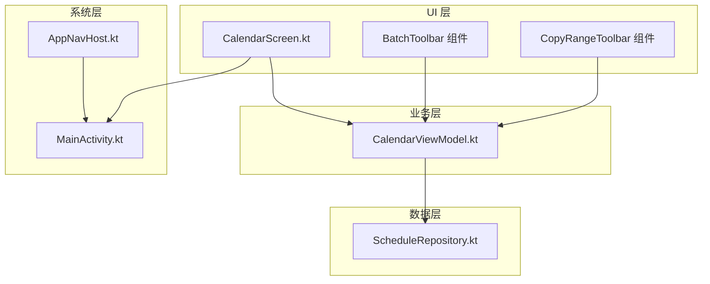
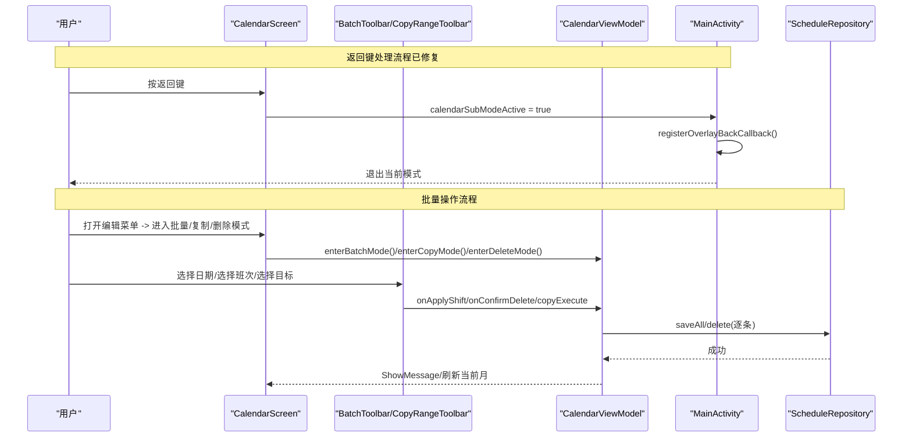
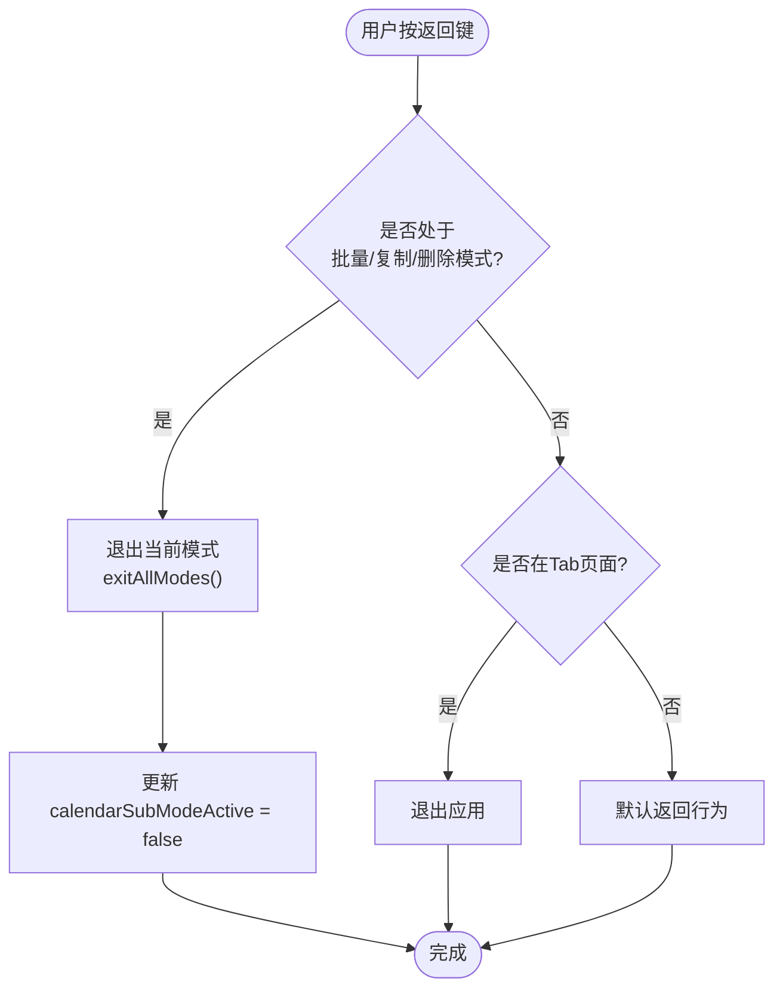
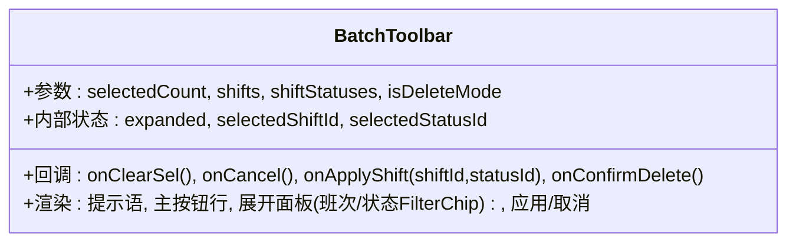
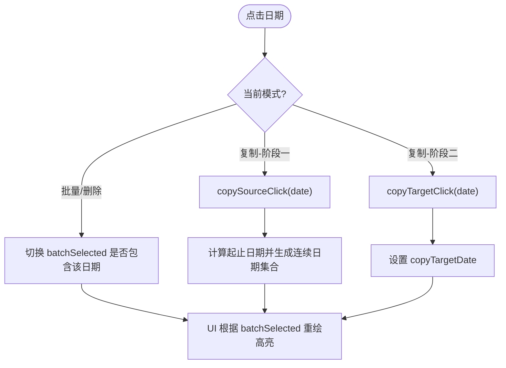
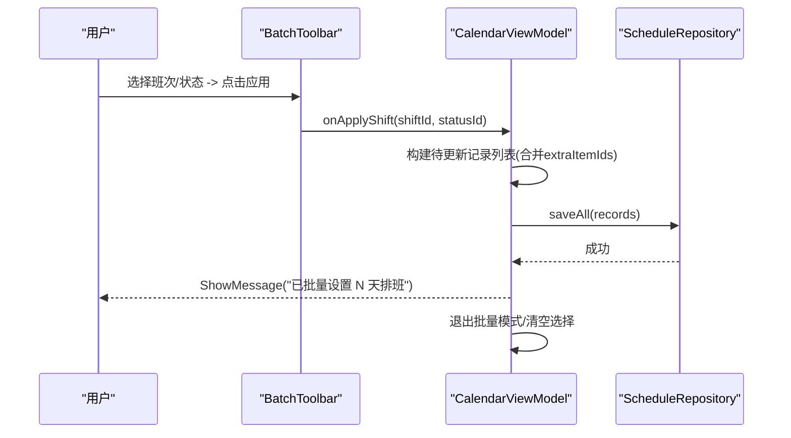
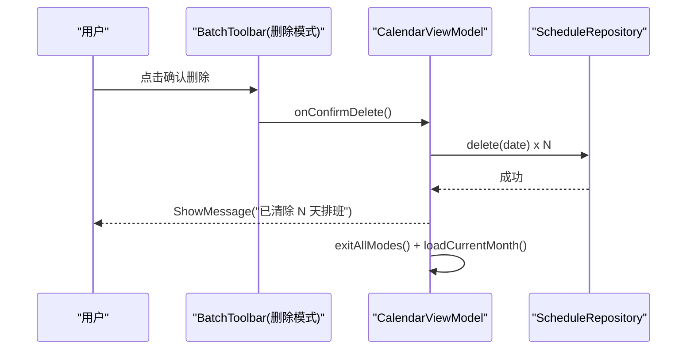
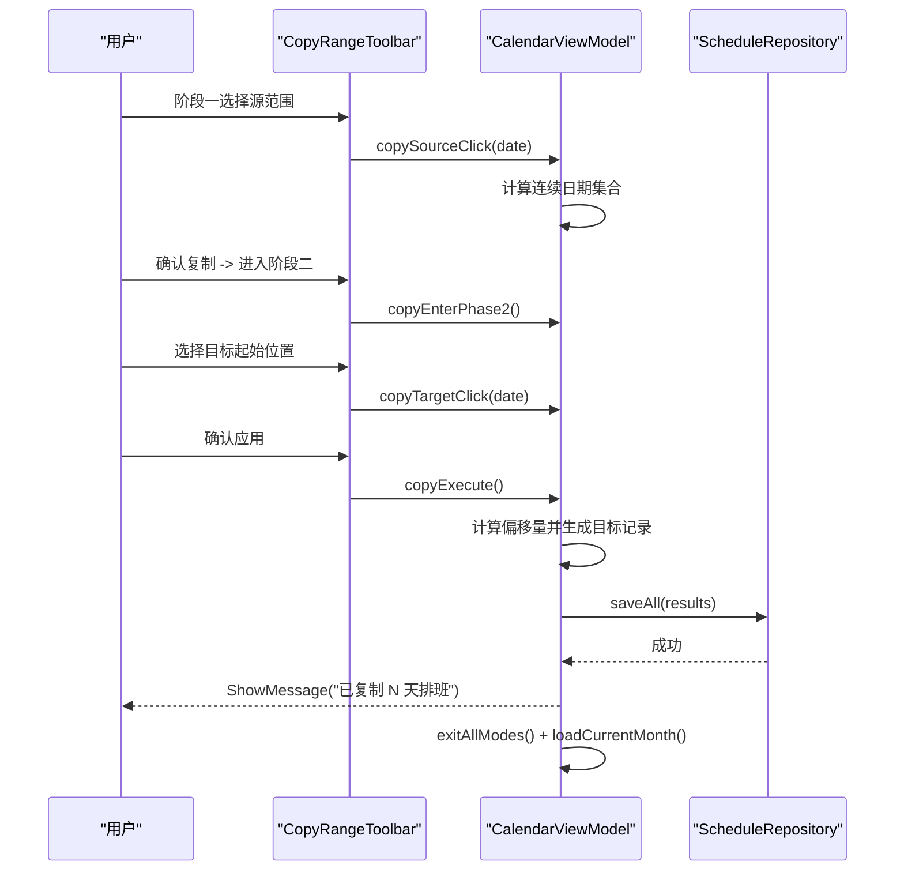
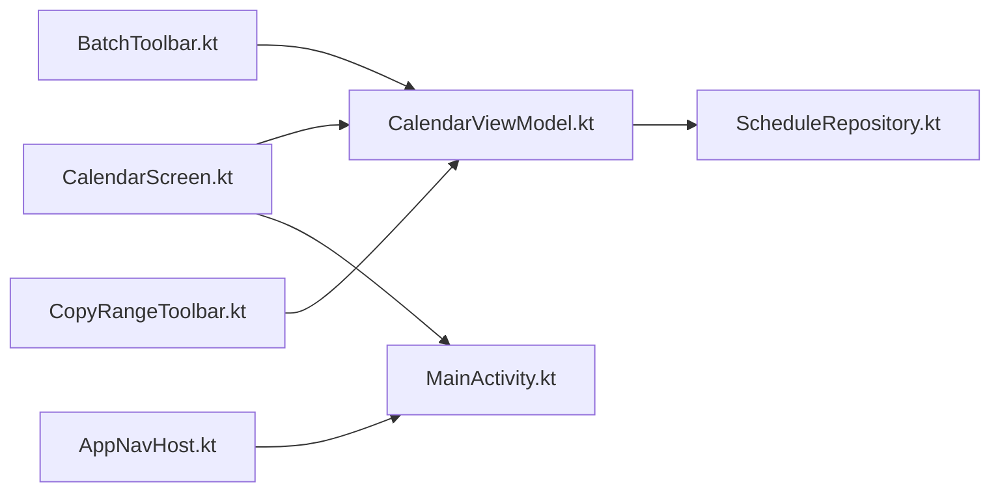

# 批量排班操作

<cite>
**本文引用的文件**   
- [CalendarScreen.kt](file://app/src/main/java/com/schedulecalendar/app/ui/calendar/CalendarScreen.kt)
- [CalendarViewModel.kt](file://app/src/main/java/com/schedulecalendar/app/ui/calendar/CalendarViewModel.kt)
- [MainActivity.kt](file://app/src/main/java/com/schedulecalendar/app/MainActivity.kt)
- [AppNavHost.kt](file://app/src/main/java/com/schedulecalendar/app/ui/navigation/AppNavHost.kt)
- [ScheduleRepository.kt](file://app/src/main/java/com/schedulecalendar/app/data/repository/ScheduleRepository.kt)
</cite>

## 更新摘要
**所做更改**   
- 修复了返回键处理机制中的僵尸回调累积问题，使用 addCallback(this, cb) 传入 LifecycleOwner 确保回调能正确从 dispatcher 移除
- 优化了导航栈管理，使用 Google 标准的 findStartDestination 模式替代 startDestinationRoute
- 完善了生命周期回调管理，防止内存泄漏和意外行为
- 增强了批量模式下的返回键行为控制，支持用户先退出批量调度模式再触发应用级返回动作

## 目录
1. [简介](#简介)
2. [项目结构](#项目结构)
3. [核心组件](#核心组件)
4. [架构总览](#架构总览)
5. [详细组件分析](#详细组件分析)
6. [依赖分析](#依赖分析)
7. [性能考虑](#性能考虑)
8. [故障排查指南](#故障排查指南)
9. [结论](#结论)
10. [附录](#附录)

## 简介
本文件围绕"批量排班"功能进行系统化文档化，覆盖多选机制、批量应用班次与附加状态、批量删除排班、复制排班（日期范围选择与目标设置）、工具栏组件 BatchToolbar 的设计与实现、用户确认流程、错误处理与提示、以及可扩展的自定义批量操作规则示例。同时提供架构图、时序图与流程图，帮助读者快速理解并扩展该能力。

**最新更新**：修复了返回键处理机制中的关键问题，解决了僵尸回调累积导致的内存泄漏问题，并优化了批量模式下的返回键行为逻辑。通过改用 addCallback(this, cb) 传入 LifecycleOwner，确保 remove() 真正生效，避免了内存泄漏风险。

## 项目结构
批量排班相关逻辑主要分布在以下位置：
- UI 层：日历主界面与工具栏组件
  - CalendarScreen.kt：包含日历网格交互、模式切换、工具栏渲染与事件分发
- 业务层：状态管理与批量操作编排
  - CalendarViewModel.kt：维护批量/复制/删除模式状态，执行批量写入与复制计算
- 系统层：返回键处理与生命周期管理
  - MainActivity.kt：集成 BackHandler 与系统级返回键处理，解决僵尸回调问题
  - AppNavHost.kt：导航栈管理与 Tab 页面控制，使用标准导航模式
- 数据层：持久化写入
  - ScheduleRepository.kt：提供批量保存接口 saveAll

**图表来源**
- [CalendarScreen.kt:96-107](file://app/src/main/java/com/schedulecalendar/app/ui/calendar/CalendarScreen.kt#L96-L107)
- [CalendarScreen.kt:1079-1273](file://app/src/main/java/com/schedulecalendar/app/ui/calendar/CalendarScreen.kt#L1079-L1273)
- [CalendarScreen.kt:1349-1400](file://app/src/main/java/com/schedulecalendar/app/ui/calendar/CalendarScreen.kt#L1349-L1400)
- [CalendarViewModel.kt:603-615](file://app/src/main/java/com/schedulecalendar/app/ui/calendar/CalendarViewModel.kt#L603-L615)
- [MainActivity.kt:70-77](file://app/src/main/java/com/schedulecalendar/app/MainActivity.kt#L70-L77)
- [AppNavHost.kt:84-92](file://app/src/main/java/com/schedulecalendar/app/ui/navigation/AppNavHost.kt#L84-L92)
- [ScheduleRepository.kt:32](file://app/src/main/java/com/schedulecalendar/app/data/repository/ScheduleRepository.kt#L32)

**章节来源**
- [CalendarScreen.kt:96-107](file://app/src/main/java/com/schedulecalendar/app/ui/calendar/CalendarScreen.kt#L96-L107)
- [CalendarScreen.kt:1079-1273](file://app/src/main/java/com/schedulecalendar/app/ui/calendar/CalendarScreen.kt#L1079-L1273)
- [CalendarScreen.kt:1349-1400](file://app/src/main/java/com/schedulecalendar/app/ui/calendar/CalendarScreen.kt#L1349-L1400)
- [CalendarViewModel.kt:603-615](file://app/src/main/java/com/schedulecalendar/app/ui/calendar/CalendarViewModel.kt#L603-L615)
- [MainActivity.kt:70-77](file://app/src/main/java/com/schedulecalendar/app/MainActivity.kt#L70-L77)
- [AppNavHost.kt:84-92](file://app/src/main/java/com/schedulecalendar/app/ui/navigation/AppNavHost.kt#L84-L92)
- [ScheduleRepository.kt:32](file://app/src/main/java/com/schedulecalendar/app/data/repository/ScheduleRepository.kt#L32)

## 核心组件
- **多选机制**
  - 在批量/删除模式下，点击日期格会切换选中状态；跨月填充日在批量/删除模式下不可选。
  - 选择集由 ViewModel 中的 batchSelected 集合维护，UI 根据集合渲染高亮。
- **批量应用班次**
  - 通过 BatchToolbar 展开面板选择目标班次与可选的附加状态，确认后调用批量写入。
  - 支持合并班次关联的额外项目（extraItemIds）。
- **批量删除排班**
  - 在删除模式下，对已选日期逐条删除，完成后退出模式并刷新当月视图。
- **复制排班**
  - 两阶段交互：阶段一选择源日期范围（连续），阶段二选择目标起始位置；执行时按偏移量复制记录。
  - 另提供整月复制弹窗，支持覆盖或跳过已有日期。
- **返回键处理机制** ⭐ **已修复**
  - 集成 BackHandler 监听，在批量/复制/删除模式下按返回键自动退出当前模式。
  - 支持 API 34+ 的系统级 OnBackInvokedDispatcher 和 API 33- 的 OnBackPressedCallback。
  - 通过 calendarSubModeActive 状态控制返回键行为优先级，**现已修复僵尸回调累积问题**。

**章节来源**
- [CalendarScreen.kt:379-426](file://app/src/main/java/com/schedulecalendar/app/ui/calendar/CalendarScreen.kt#L379-L426)
- [CalendarScreen.kt:96-107](file://app/src/main/java/com/schedulecalendar/app/ui/calendar/CalendarScreen.kt#L96-L107)
- [CalendarScreen.kt:1079-1273](file://app/src/main/java/com/schedulecalendar/app/ui/calendar/CalendarScreen.kt#L1079-L1273)
- [CalendarScreen.kt:1349-1400](file://app/src/main/java/com/schedulecalendar/app/ui/calendar/CalendarScreen.kt#L1349-L1400)
- [CalendarViewModel.kt:603-615](file://app/src/main/java/com/schedulecalendar/app/ui/calendar/CalendarViewModel.kt#L603-L615)
- [MainActivity.kt:70-77](file://app/src/main/java/com/schedulecalendar/app/MainActivity.kt#L70-L77)

## 架构总览
批量排班采用"UI 触发 -> ViewModel 编排 -> Repository 持久化"的分层架构，**已修复的返回键处理机制**确保用户体验的一致性。UI 仅负责展示与事件转发，所有状态变更与业务规则集中在 ViewModel 中，保证可测试性与一致性。

**图表来源**
- [CalendarScreen.kt:96-107](file://app/src/main/java/com/schedulecalendar/app/ui/calendar/CalendarScreen.kt#L96-L107)
- [CalendarScreen.kt:488-533](file://app/src/main/java/com/schedulecalendar/app/ui/calendar/CalendarScreen.kt#L488-L533)
- [CalendarScreen.kt:969-1165](file://app/src/main/java/com/schedulecalendar/app/ui/calendar/CalendarScreen.kt#L969-L1165)
- [CalendarScreen.kt:1240-1329](file://app/src/main/java/com/schedulecalendar/app/ui/calendar/CalendarScreen.kt#L1240-1329)
- [CalendarViewModel.kt:603-615](file://app/src/main/java/com/schedulecalendar/app/ui/calendar/CalendarViewModel.kt#L603-L615)
- [MainActivity.kt:83-122](file://app/src/main/java/com/schedulecalendar/app/MainActivity.kt#L83-L122)
- [ScheduleRepository.kt:32](file://app/src/main/java/com/schedulecalendar/app/data/repository/ScheduleRepository.kt#L32)

## 详细组件分析

### 返回键处理机制 ⭐ **已修复的关键问题**

#### 多级返回键处理架构
系统实现了三层返回键处理机制，确保在不同 Android 版本下的兼容性：

1. **Composable 层 (BackHandler)**
   - 在 CalendarScreen 中使用 BackHandler 监听返回键
   - 当处于批量/复制/删除模式时，优先退出当前模式

2. **Activity 层 (OnBackPressedCallback)**
   - API 33- 使用传统的 OnBackPressedCallback
   - 根据 isOnTabPage 状态决定是否允许退出应用

3. **系统层 (OnBackInvokedDispatcher)**
   - API 34+ 使用系统级 OnBackInvokedDispatcher
   - 通过 PRIORITY_OVERLAY 优先级拦截返回键

**图表来源**
- [CalendarScreen.kt:96-107](file://app/src/main/java/com/schedulecalendar/app/ui/calendar/CalendarScreen.kt#L96-L107)
- [MainActivity.kt:70-77](file://app/src/main/java/com/schedulecalendar/app/MainActivity.kt#L70-L77)
- [MainActivity.kt:83-122](file://app/src/main/java/com/schedulecalendar/app/MainActivity.kt#L83-L122)

#### 生命周期回调管理 ⭐ **重要修复**
**已解决之前版本中存在的僵尸回调累积问题：**

- **问题根因**：`addCallback(callback)` 不加 `LifecycleOwner` → `remove()` 不生效
- **解决方案**：改用 `addCallback(this, cb)` 传入 LifecycleOwner
- **效果**：确保回调能正确从 dispatcher 移除，避免内存泄漏

**修复详情**：
- 在 MainActivity.kt 第157行，使用 `onBackPressedDispatcher.addCallback(this, tabBackCallback!!)` 而非无参数的 addCallback
- 这确保了回调的生命周期感知，当 Activity 销毁时回调会被正确清理
- 避免了每轮 onStart 遗留一个 enable 被锁死的僵尸回调

**修复原理**：
- `addCallback(this, cb)` 内部创建 `LifecycleAwareCancellable`，同时加入 dispatcher 的 `mCancellables` **和** 回调自身的 `mCancellables`
- `cb.remove()` 会遍历回调自身的列表 → 调用 `LifecycleAwareCancellable.cancel()` → 从 dispatcher **真正移除**
- `onStart()` 时 lifecycle 已是 STARTED → `LifecycleAwareCancellable` 注册后立即 ON_START → 立刻加入 dispatcher（无延迟）

#### 导航栈管理优化
**已改进 Tab 导航逻辑：**

- **问题**：使用 `startDestinationRoute` 可能导致导航栈管理不一致
- **解决方案**：改用 Google 标准的 `findStartDestination()` 方法
- **效果**：保持 `startDestination` 作为栈底锚点，确保导航行为符合预期

**修复详情**：
- 在 AppNavHost.kt 第89行，将 `navController.graph.startDestinationRoute` 替换为 `navController.graph.findStartDestination().id`
- 移除了 `inclusive = true` 参数，避免过度清理导航栈
- 保持 `launchSingleTop = true` 和 `restoreState = true` 不变

**章节来源**
- [CalendarScreen.kt:96-107](file://app/src/main/java/com/schedulecalendar/app/ui/calendar/CalendarScreen.kt#L96-L107)
- [MainActivity.kt:70-77](file://app/src/main/java/com/schedulecalendar/app/MainActivity.kt#L70-L77)
- [MainActivity.kt:83-122](file://app/src/main/java/com/schedulecalendar/app/MainActivity.kt#L83-L122)
- [MainActivity.kt:157](file://app/src/main/java/com/schedulecalendar/app/MainActivity.kt#L157)
- [AppNavHost.kt:84-92](file://app/src/main/java/com/schedulecalendar/app/ui/navigation/AppNavHost.kt#L84-L92)

### BatchToolbar 组件设计与实现
- **布局与交互**
  - 顶部显示"已选择 X 天"或"点击选择"，根据 selectedCount 动态变化。
  - 主按钮行：批量模式下为"应用排班/取消选择/退出"；删除模式下为"确认删除/取消选择/退出"。
  - "应用排班"按钮点击后展开面板，使用 FlowRow 展示班次与附加状态 FilterChip，支持单选/多选状态。
  - 面板底部"取消/应用"按钮控制提交。
- **状态管理**
  - 本地 remember 状态：expanded、selectedShiftId、selectedStatusId。
  - 外部回调：onClearSel、onCancel、onApplyShift、onConfirmDelete。
- **视觉与可用性**
  - 删除模式使用 errorContainer 背景色，其他模式使用 secondaryContainer。
  - 按钮启用条件与 selectedCount 绑定，避免空操作。

**图表来源**
- [CalendarScreen.kt:1079-1273](file://app/src/main/java/com/schedulecalendar/app/ui/calendar/CalendarScreen.kt#L1079-L1273)

**章节来源**
- [CalendarScreen.kt:1079-1273](file://app/src/main/java/com/schedulecalendar/app/ui/calendar/CalendarScreen.kt#L1079-L1273)

### 多选机制与选择状态
- **选择行为**
  - 在批量/删除模式下，点击日期格切换选中状态；跨月填充日在批量/删除模式下不可选。
  - 复制模式分阶段：阶段一选择源日期范围（连续），阶段二选择目标起始位置。
- **状态存储**
  - batchSelected：Set<String> 存放已选日期字符串。
  - copySourceStart/copySourceEnd/copySourceDates：阶段一范围与集合。
  - copyTargetDate：阶段二目标起始日期。
- **渲染联动**
  - DayCell.selected 根据当前模式与对应状态字段计算，用于高亮显示。

**图表来源**
- [CalendarScreen.kt:379-426](file://app/src/main/java/com/schedulecalendar/app/ui/calendar/CalendarScreen.kt#L379-L426)
- [CalendarViewModel.kt:718-754](file://app/src/main/java/com/schedulecalendar/app/ui/calendar/CalendarViewModel.kt#L718-L754)

**章节来源**
- [CalendarScreen.kt:379-426](file://app/src/main/java/com/schedulecalendar/app/ui/calendar/CalendarScreen.kt#L379-L426)
- [CalendarViewModel.kt:718-754](file://app/src/main/java/com/schedulecalendar/app/ui/calendar/CalendarViewModel.kt#L718-L754)

### 批量应用班次流程
- **入口**
  - BatchToolbar 展开面板中选择目标班次与可选附加状态，点击"应用"触发 onApplyShift。
- **业务逻辑**
  - 查找目标班次，读取其默认关联的 extraItemIds。
  - 遍历 batchSelected，合并既有 extraItemIds 与关联项，更新 shiftId 与 appliedStatus。
  - 批量保存后退出批量模式并清空选择集，发送成功消息。
- **错误处理**
  - 若未选择任何日期则直接返回；无异常捕获但可通过上层 UI 事件统一提示。

**图表来源**
- [CalendarScreen.kt:488-533](file://app/src/main/java/com/schedulecalendar/app/ui/calendar/CalendarScreen.kt#L488-L533)
- [CalendarScreen.kt:1079-1273](file://app/src/main/java/com/schedulecalendar/app/ui/calendar/CalendarScreen.kt#L1079-L1273)
- [CalendarViewModel.kt:633-652](file://app/src/main/java/com/schedulecalendar/app/ui/calendar/CalendarViewModel.kt#L633-L652)
- [ScheduleRepository.kt:32](file://app/src/main/java/com/schedulecalendar/app/data/repository/ScheduleRepository.kt#L32)

**章节来源**
- [CalendarScreen.kt:488-533](file://app/src/main/java/com/schedulecalendar/app/ui/calendar/CalendarScreen.kt#L488-L533)
- [CalendarScreen.kt:1079-1273](file://app/src/main/java/com/schedulecalendar/app/ui/calendar/CalendarScreen.kt#L1079-L1273)
- [CalendarViewModel.kt:633-652](file://app/src/main/java/com/schedulecalendar/app/ui/calendar/CalendarViewModel.kt#L633-L652)
- [ScheduleRepository.kt:32](file://app/src/main/java/com/schedulecalendar/app/data/repository/ScheduleRepository.kt#L32)

### 批量删除排班流程
- **入口**
  - 删除模式下，点击"确认删除"触发 onConfirmDelete。
- **业务逻辑**
  - 遍历 batchSelected，逐条删除对应日期的排班记录。
  - 退出所有模式，发送成功消息，并刷新当月数据以反映最新状态。
- **错误处理**
  - 若无选择则直接返回；删除失败可由上层统一提示。

**图表来源**
- [CalendarScreen.kt:502-515](file://app/src/main/java/com/schedulecalendar/app/ui/calendar/CalendarScreen.kt#L502-L515)
- [CalendarViewModel.kt:654-661](file://app/src/main/java/com/schedulecalendar/app/ui/calendar/CalendarViewModel.kt#L654-L661)

**章节来源**
- [CalendarScreen.kt:502-515](file://app/src/main/java/com/schedulecalendar/app/ui/calendar/CalendarScreen.kt#L502-L515)
- [CalendarViewModel.kt:654-661](file://app/src/main/java/com/schedulecalendar/app/ui/calendar/CalendarViewModel.kt#L654-L661)

### 复制排班完整流程
- **阶段一：选择源日期范围**
  - 第一次点击设置起始日期，第二次点击设置结束日期并生成连续日期集合。
  - 若已有完整范围，再次点击将重新开始选择。
- **阶段二：选择目标起始位置**
  - 点击目标日期作为复制起点。
- **执行复制**
  - 计算源起始日期与目标起始日期的偏移量，按偏移量映射每个源日期到目标日期。
  - 获取源记录的排班数据，复制并保存至目标日期。
  - 成功后退出模式、提示并刷新当月视图。

**图表来源**
- [CalendarScreen.kt:517-533](file://app/src/main/java/com/schedulecalendar/app/ui/calendar/CalendarScreen.kt#L517-L533)
- [CalendarScreen.kt:1349-1400](file://app/src/main/java/com/schedulecalendar/app/ui/calendar/CalendarScreen.kt#L1349-L1400)
- [CalendarViewModel.kt:776-799](file://app/src/main/java/com/schedulecalendar/app/ui/calendar/CalendarViewModel.kt#L776-L799)
- [ScheduleRepository.kt:32](file://app/src/main/java/com/schedulecalendar/app/data/repository/ScheduleRepository.kt#L32)

**章节来源**
- [CalendarScreen.kt:517-533](file://app/src/main/java/com/schedulecalendar/app/ui/calendar/CalendarScreen.kt#L517-L533)
- [CalendarScreen.kt:1349-1400](file://app/src/main/java/com/schedulecalendar/app/ui/calendar/CalendarScreen.kt#L1349-L1400)
- [CalendarViewModel.kt:776-799](file://app/src/main/java/com/schedulecalendar/app/ui/calendar/CalendarViewModel.kt#L776-L799)
- [ScheduleRepository.kt:32](file://app/src/main/java/com/schedulecalendar/app/data/repository/ScheduleRepository.kt#L32)

### 撤销机制与用户确认
- **撤销机制**
  - 当前批量/复制/删除操作未实现全局撤销栈；如需撤销，可在 ViewModel 中引入 UndoManager 或事务日志，记录每次批量操作的快照，并提供"撤销最近一次批量操作"的能力。
- **用户确认**
  - 删除操作通过工具栏按钮显式确认；复制操作通过两阶段引导确保意图明确。
  - 建议在关键危险操作前增加二次确认对话框，防止误删。

[本节为通用建议，不直接分析具体文件]

### 错误处理与提示
- **成功路径**
  - 批量应用/删除/复制成功后，通过 uiEvent 发送 ShowMessage 提示用户。
- **失败路径**
  - 当前代码未对数据库写入异常进行捕获；建议在上层捕获异常并通过 ShowError 提示用户，必要时回滚或重试。
- **边界情况**
  - 源日期无排班数据时，复制流程会提示"源日期无排班数据"并中止。

**章节来源**
- [CalendarViewModel.kt:633-799](file://app/src/main/java/com/schedulecalendar/app/ui/calendar/CalendarViewModel.kt#L633-799)

### 自定义批量操作规则示例
- **思路**
  - 在 ViewModel 中新增一个批量方法，接收一组日期与自定义规则（如只保留特定班次、强制附加状态、合并额外项目等）。
  - 复用现有的 saveAll 接口进行批量写入，并在成功后发送消息与刷新视图。
- **参考路径**
  - 批量应用班次：[CalendarViewModel.kt:633-652](file://app/src/main/java/com/schedulecalendar/app/ui/calendar/CalendarViewModel.kt#L633-652)
  - 批量删除：[CalendarViewModel.kt:654-661](file://app/src/main/java/com/schedulecalendar/app/ui/calendar/CalendarViewModel.kt#L654-661)
  - 复制执行：[CalendarViewModel.kt:776-799](file://app/src/main/java/com/schedulecalendar/app/ui/calendar/CalendarViewModel.kt#L776-799)
  - 批量保存接口：[ScheduleRepository.kt:32](file://app/src/main/java/com/schedulecalendar/app/data/repository/ScheduleRepository.kt#L32)

**章节来源**
- [CalendarViewModel.kt:633-799](file://app/src/main/java/com/schedulecalendar/app/ui/calendar/CalendarViewModel.kt#L633-799)
- [ScheduleRepository.kt:32](file://app/src/main/java/com/schedulecalendar/app/data/repository/ScheduleRepository.kt#L32)

## 依赖分析
- **组件耦合**
  - CalendarScreen 依赖 CalendarViewModel 暴露的状态与动作，低耦合、职责清晰。
  - BatchToolbar/CopyRangeToolbar 仅持有回调，不直接访问数据，便于替换与测试。
  - MainActivity 通过 calendarSubModeActive 状态与 CalendarScreen 通信，实现返回键协调。
- **外部依赖**
  - ScheduleRepository 提供 saveAll 与 delete 等持久化能力。
- **潜在循环依赖**
  - 当前未见循环引用；UI 与业务层单向依赖。

**图表来源**
- [CalendarScreen.kt:96-107](file://app/src/main/java/com/schedulecalendar/app/ui/calendar/CalendarScreen.kt#L96-L107)
- [CalendarScreen.kt:1079-1273](file://app/src/main/java/com/schedulecalendar/app/ui/calendar/CalendarScreen.kt#L1079-L1273)
- [CalendarScreen.kt:1349-1400](file://app/src/main/java/com/schedulecalendar/app/ui/calendar/CalendarScreen.kt#L1349-L1400)
- [CalendarViewModel.kt:603-799](file://app/src/main/java/com/schedulecalendar/app/ui/calendar/CalendarViewModel.kt#L603-799)
- [MainActivity.kt:70-77](file://app/src/main/java/com/schedulecalendar/app/MainActivity.kt#L70-L77)
- [AppNavHost.kt:84-92](file://app/src/main/java/com/schedulecalendar/app/ui/navigation/AppNavHost.kt#L84-L92)
- [ScheduleRepository.kt:32](file://app/src/main/java/com/schedulecalendar/app/data/repository/ScheduleRepository.kt#L32)

**章节来源**
- [CalendarScreen.kt:96-107](file://app/src/main/java/com/schedulecalendar/app/ui/calendar/CalendarScreen.kt#L96-L107)
- [CalendarScreen.kt:1079-1273](file://app/src/main/java/com/schedulecalendar/app/ui/calendar/CalendarScreen.kt#L1079-L1273)
- [CalendarScreen.kt:1349-1400](file://app/src/main/java/com/schedulecalendar/app/ui/calendar/CalendarScreen.kt#L1349-L1400)
- [CalendarViewModel.kt:603-799](file://app/src/main/java/com/schedulecalendar/app/ui/calendar/CalendarViewModel.kt#L603-799)
- [MainActivity.kt:70-77](file://app/src/main/java/com/schedulecalendar/app/MainActivity.kt#L70-L77)
- [AppNavHost.kt:84-92](file://app/src/main/java/com/schedulecalendar/app/ui/navigation/AppNavHost.kt#L84-L92)
- [ScheduleRepository.kt:32](file://app/src/main/java/com/schedulecalendar/app/data/repository/ScheduleRepository.kt#L32)

## 性能考虑
- **批量写入**
  - 使用 saveAll 一次性写入多条记录，减少 IO 次数，提升吞吐。
- **选择集大小**
  - 当 batchSelected 较大时，构建 records 列表可能占用较多内存；建议分批写入或流式处理以降低峰值内存。
- **视图刷新**
  - 批量操作完成后刷新当月数据，避免频繁刷新导致卡顿；可考虑延迟刷新或增量更新。
- **交互反馈**
  - 大数量操作期间可增加进度指示或禁用交互，提升用户体验。
- **返回键处理优化** ⭐ **已修复**
  - 使用 DisposableEffect 管理 calendarSubModeActive 状态，避免不必要的重新注册。
  - 通过 LifecycleOwner 管理回调，**现已修复内存泄漏和僵尸回调累积问题**。

[本节提供通用指导，不直接分析具体文件]

## 故障排查指南
- **常见问题**
  - 未选择日期即执行操作：检查 selectedCount 与 enabled 绑定，确保按钮不可用。
  - 复制后目标月份未更新：确认是否在复制到当前显示月时触发了 loadCurrentMonth。
  - 源日期无数据：复制流程会提示并中止，需先创建源日期排班。
  - 返回键无法退出模式：**已修复** - 检查 calendarSubModeActive 状态是否正确同步，确认 addCallback 使用了正确的 LifecycleOwner。
- **定位步骤**
  - 查看 UI 事件通道是否收到 ShowMessage/ShowError。
  - 检查 ViewModel 中对应方法的执行路径与返回值。
  - 验证 Repository 的 saveAll/delete 是否被调用且无异常。
  - 调试返回键处理链：BackHandler -> calendarSubModeActive -> registerOverlayBackCallback。
  - **检查回调管理**：确认 onBackPressedDispatcher.addCallback 使用了 this 作为 LifecycleOwner。

**章节来源**
- [CalendarViewModel.kt:603-799](file://app/src/main/java/com/schedulecalendar/app/ui/calendar/CalendarViewModel.kt#L603-799)
- [CalendarScreen.kt:96-107](file://app/src/main/java/com/schedulecalendar/app/ui/calendar/CalendarScreen.kt#L96-L107)
- [MainActivity.kt:83-122](file://app/src/main/java/com/schedulecalendar/app/MainActivity.kt#L83-L122)
- [MainActivity.kt:157](file://app/src/main/java/com/schedulecalendar/app/MainActivity.kt#L157)

## 结论
批量排班功能通过清晰的 UI-VM-Repo 分层实现了高效的多选、批量应用、批量删除与复制排班。**已修复的返回键处理机制**进一步提升了用户体验，解决了僵尸回调累积导致的内存泄漏问题，确保用户在批量操作模式下能够自然地退出当前模式。通过改用 addCallback(this, cb) 传入 LifecycleOwner，现在回调能够正确地从 dispatcher 移除，避免了内存泄漏风险。同时，导航栈管理的优化也确保了 Tab 页面行为的稳定性。BatchToolbar 与 CopyRangeToolbar 提供了直观的操作入口与状态反馈。建议在现有基础上补充撤销机制与更完善的错误处理，以提升健壮性与用户体验。

[本节为总结性内容，不直接分析具体文件]

## 附录
- **关键实现路径参考**
  - 批量应用班次：[CalendarViewModel.kt:633-652](file://app/src/main/java/com/schedulecalendar/app/ui/calendar/CalendarViewModel.kt#L633-652)
  - 批量删除：[CalendarViewModel.kt:654-661](file://app/src/main/java/com/schedulecalendar/app/ui/calendar/CalendarViewModel.kt#L654-661)
  - 复制执行：[CalendarViewModel.kt:776-799](file://app/src/main/java/com/schedulecalendar/app/ui/calendar/CalendarViewModel.kt#L776-799)
  - 工具栏组件：[CalendarScreen.kt:1079-1273](file://app/src/main/java/com/schedulecalendar/app/ui/calendar/CalendarScreen.kt#L1079-1273)、[CalendarScreen.kt:1349-1400](file://app/src/main/java/com/schedulecalendar/app/ui/calendar/CalendarScreen.kt#L1349-1400)
  - 批量保存接口：[ScheduleRepository.kt:32](file://app/src/main/java/com/schedulecalendar/app/data/repository/ScheduleRepository.kt#L32)
  - **返回键处理（已修复）**：[CalendarScreen.kt:96-107](file://app/src/main/java/com/schedulecalendar/app/ui/calendar/CalendarScreen.kt#L96-107)、[MainActivity.kt:70-77](file://app/src/main/java/com/schedulecalendar/app/MainActivity.kt#L70-77)、[MainActivity.kt:83-122](file://app/src/main/java/com/schedulecalendar/app/MainActivity.kt#L83-122)、[MainActivity.kt:157](file://app/src/main/java/com/schedulecalendar/app/MainActivity.kt#L157)
  - **导航栈管理（已优化）**：[AppNavHost.kt:84-92](file://app/src/main/java/com/schedulecalendar/app/ui/navigation/AppNavHost.kt#L84-92)