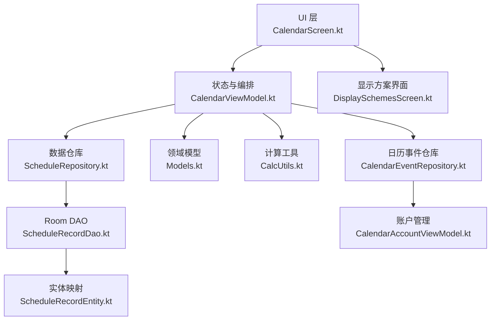
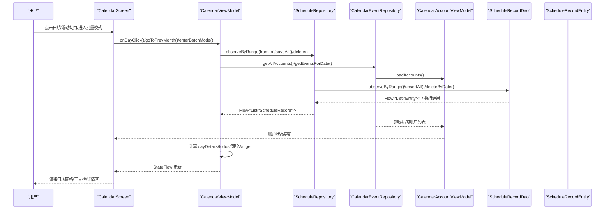
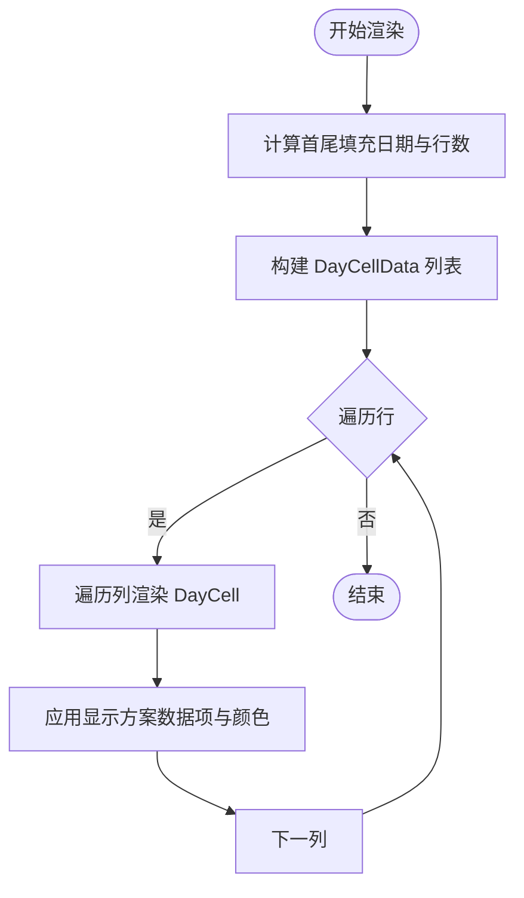
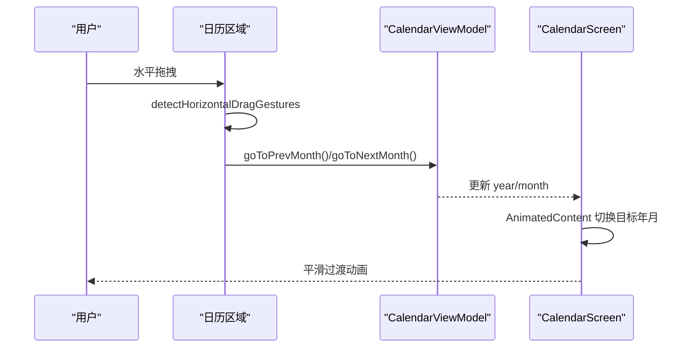
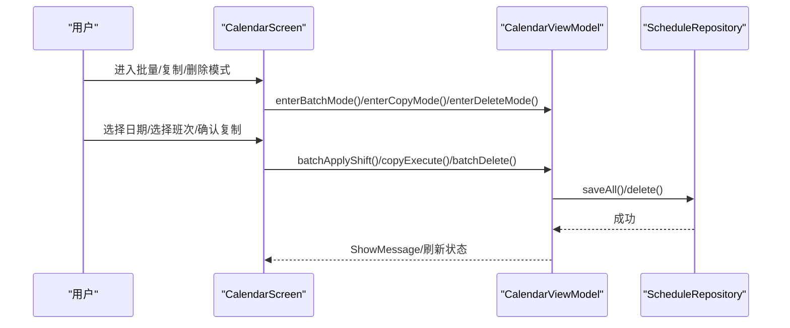
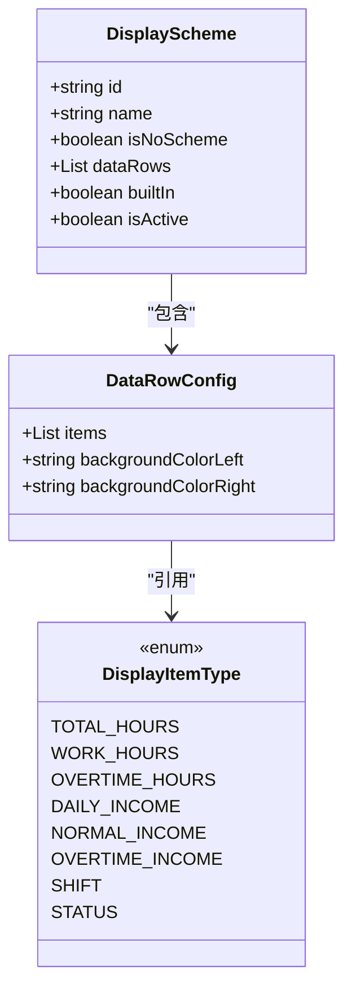
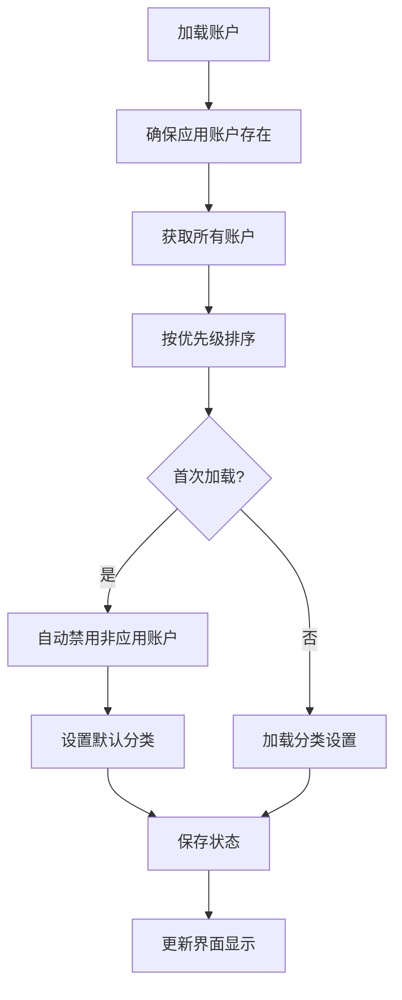
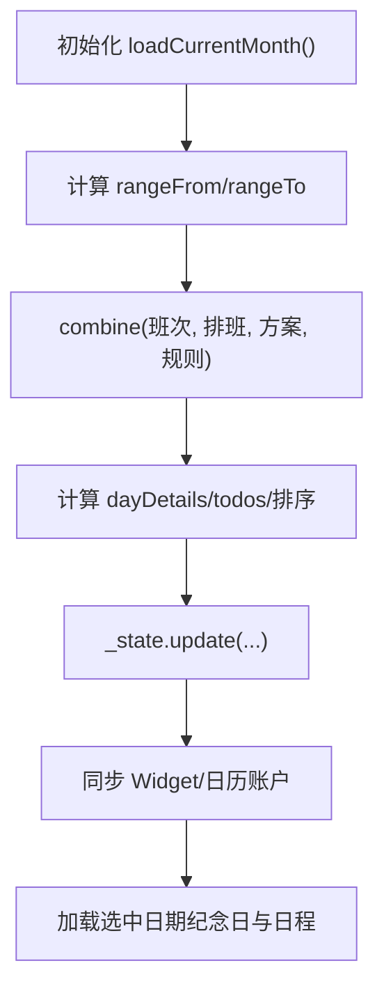
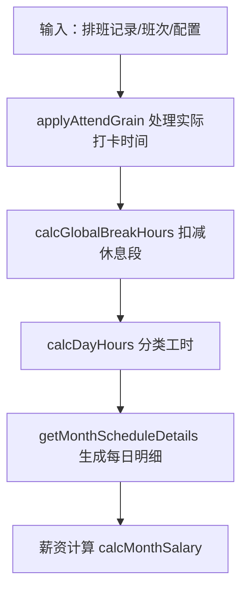
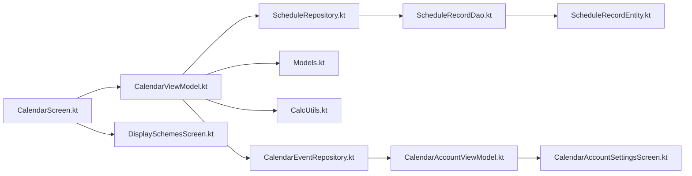

# 日历排班管理

<cite>
**本文引用的文件**   
- [CalendarScreen.kt](file://app/src/main/java/com/schedulecalendar/app/ui/calendar/CalendarScreen.kt)
- [CalendarViewModel.kt](file://app/src/main/java/com/schedulecalendar/app/ui/calendar/CalendarViewModel.kt)
- [DisplaySchemesScreen.kt](file://app/src/main/java/com/schedulecalendar/app/ui/detail/DisplaySchemesScreen.kt)
- [Models.kt](file://app/src/main/java/com/schedulecalendar/app/domain/model/Models.kt)
- [CalcUtils.kt](file://app/src/main/java/com/schedulecalendar/app/domain/model/CalcUtils.kt)
- [ScheduleRepository.kt](file://app/src/main/java/com/schedulecalendar/app/data/repository/ScheduleRepository.kt)
- [ScheduleRecordDao.kt](file://app/src/main/java/com/schedulecalendar/app/data/db/dao/ScheduleRecordDao.kt)
- [ScheduleRecordEntity.kt](file://app/src/main/java/com/schedulecalendar/app/data/db/entity/ScheduleRecordEntity.kt)
- [CalendarEventRepository.kt](file://app/src/main/java/com/schedulecalendar/app/data/calendar/CalendarEventRepository.kt)
- [CalendarAccountViewModel.kt](file://app/src/main/java/com/schedulecalendar/app/ui/settings/CalendarAccountViewModel.kt)
- [CalendarAccountSettingsScreen.kt](file://app/src/main/java/com/schedulecalendar/app/ui/settings/CalendarAccountSettingsScreen.kt)
</cite>

## 更新摘要
**所做更改**
- 更新了日历账户排序机制章节，详细说明新的优先级顺序系统
- 新增了账户分类和显示逻辑的相关说明
- 完善了账户管理的UI交互流程
- 增强了账户类型识别和自动分类功能

## 目录
1. [简介](#简介)
2. [项目结构](#项目结构)
3. [核心组件](#核心组件)
4. [架构总览](#架构总览)
5. [详细组件分析](#详细组件分析)
6. [依赖关系分析](#依赖关系分析)
7. [性能考量](#性能考量)
8. [故障排查指南](#故障排查指南)
9. [结论](#结论)
10. [附录](#附录)

## 简介
本模块为"日历排班管理"的核心实现，提供月度日历视图、日期网格渲染、月份切换动画与手势操作；支持批量排班、复制排班、删除排班等高级操作；内置显示方案系统，可自定义数据行与颜色；涵盖排班数据的加载策略、状态管理与性能优化；并提供错误处理与用户反馈机制。

## 项目结构
该模块采用分层组织：UI（Compose）层负责交互与展示，ViewModel 负责状态与业务编排，领域模型与计算工具位于 domain 层，数据访问通过 Repository 与 DAO 完成。

图表来源
- [CalendarScreen.kt:1-120](file://app/src/main/java/com/schedulecalendar/app/ui/calendar/CalendarScreen.kt#L1-L120)
- [CalendarViewModel.kt:105-132](file://app/src/main/java/com/schedulecalendar/app/ui/calendar/CalendarViewModel.kt#L105-L132)
- [ScheduleRepository.kt:14-39](file://app/src/main/java/com/schedulecalendar/app/data/repository/ScheduleRepository.kt#L14-L39)
- [ScheduleRecordDao.kt:8-39](file://app/src/main/java/com/schedulecalendar/app/data/db/dao/ScheduleRecordDao.kt#L8-L39)
- [ScheduleRecordEntity.kt:8-25](file://app/src/main/java/com/schedulecalendar/app/data/db/entity/ScheduleRecordEntity.kt#L8-L25)
- [Models.kt:143-180](file://app/src/main/java/com/schedulecalendar/app/domain/model/Models.kt#L143-L180)
- [DisplaySchemesScreen.kt:49-114](file://app/src/main/java/com/schedulecalendar/app/ui/detail/DisplaySchemesScreen.kt#L49-L114)
- [CalendarEventRepository.kt:66-114](file://app/src/main/java/com/schedulecalendar/app/data/calendar/CalendarEventRepository.kt#L66-L114)
- [CalendarAccountViewModel.kt:48-96](file://app/src/main/java/com/schedulecalendar/app/ui/settings/CalendarAccountViewModel.kt#L48-L96)

章节来源
- [CalendarScreen.kt:1-120](file://app/src/main/java/com/schedulecalendar/app/ui/calendar/CalendarScreen.kt#L1-L120)
- [CalendarViewModel.kt:105-132](file://app/src/main/java/com/schedulecalendar/app/ui/calendar/CalendarViewModel.kt#L105-L132)
- [ScheduleRepository.kt:14-39](file://app/src/main/java/com/schedulecalendar/app/data/repository/ScheduleRepository.kt#L14-L39)
- [ScheduleRecordDao.kt:8-39](file://app/src/main/java/com/schedulecalendar/app/data/db/dao/ScheduleRecordDao.kt#L8-L39)
- [ScheduleRecordEntity.kt:8-25](file://app/src/main/java/com/schedulecalendar/app/data/db/entity/ScheduleRecordEntity.kt#L8-L25)
- [Models.kt:143-180](file://app/src/main/java/com/schedulecalendar/app/domain/model/Models.kt#L143-L180)
- [DisplaySchemesScreen.kt:49-114](file://app/src/main/java/com/schedulecalendar/app/ui/detail/DisplaySchemesScreen.kt#L49-L114)
- [CalendarEventRepository.kt:66-114](file://app/src/main/java/com/schedulecalendar/app/data/calendar/CalendarEventRepository.kt#L66-L114)
- [CalendarAccountViewModel.kt:48-96](file://app/src/main/java/com/schedulecalendar/app/ui/settings/CalendarAccountViewModel.kt#L48-L96)

## 核心组件
- 日历视图与交互：包含顶部栏、星期标题、日历网格、底部详情区与批量/复制/清除工具栏。
- 状态与编排：维护当前年月、选中日期、模式（批量/复制/删除）、选择集、显示方案、待办事项等。
- 数据加载与刷新：基于 Flow 的跨月范围观察，合并班次、排班记录、显示方案与规则，计算每日工时与薪资明细。
- 显示方案系统：支持三行数据项配置、左右槽位背景色、特殊类型自动配色与预览。
- 账户管理系统：智能账户排序、分类管理、权限控制与同步状态管理。
- 计算工具：考勤粒度、休息段扣减、周末/节假日分类、加班阈值、薪资汇总与每日明细。

章节来源
- [CalendarScreen.kt:267-485](file://app/src/main/java/com/schedulecalendar/app/ui/calendar/CalendarScreen.kt#L267-L485)
- [CalendarViewModel.kt:134-247](file://app/src/main/java/com/schedulecalendar/app/ui/calendar/CalendarViewModel.kt#L134-L247)
- [Models.kt:143-180](file://app/src/main/java/com/schedulecalendar/app/domain/model/Models.kt#L143-L180)
- [CalcUtils.kt:427-465](file://app/src/main/java/com/schedulecalendar/app/domain/model/CalcUtils.kt#L427-L465)
- [CalendarEventRepository.kt:66-114](file://app/src/main/java/com/schedulecalendar/app/data/calendar/CalendarEventRepository.kt#L66-L114)
- [CalendarAccountViewModel.kt:48-96](file://app/src/main/java/com/schedulecalendar/app/ui/settings/CalendarAccountViewModel.kt#L48-L96)

## 架构总览
整体遵循 MVVM + Repository 模式：UI 订阅 ViewModel 的 StateFlow，触发事件后由 ViewModel 协调 Repository 进行数据读写，并通过 Flow 将变更推送回 UI。

图表来源
- [CalendarScreen.kt:267-485](file://app/src/main/java/com/schedulecalendar/app/ui/calendar/CalendarScreen.kt#L267-L485)
- [CalendarViewModel.kt:134-247](file://app/src/main/java/com/schedulecalendar/app/ui/calendar/CalendarViewModel.kt#L134-L247)
- [ScheduleRepository.kt:22-39](file://app/src/main/java/com/schedulecalendar/app/data/repository/ScheduleRepository.kt#L22-L39)
- [ScheduleRecordDao.kt:10-39](file://app/src/main/java/com/schedulecalendar/app/data/db/dao/ScheduleRecordDao.kt#L10-L39)
- [ScheduleRecordEntity.kt:8-25](file://app/src/main/java/com/schedulecalendar/app/data/db/entity/ScheduleRecordEntity.kt#L8-L25)
- [CalendarEventRepository.kt:66-114](file://app/src/main/java/com/schedulecalendar/app/data/calendar/CalendarEventRepository.kt#L66-L114)
- [CalendarAccountViewModel.kt:48-96](file://app/src/main/java/com/schedulecalendar/app/ui/settings/CalendarAccountViewModel.kt#L48-L96)

## 详细组件分析

### 月度日历视图与日期网格渲染
- 网格构建：根据当月第一天星期与天数计算首尾填充日期，生成 prevFillDays + curMonthDays + nextFillDays 的完整序列，按 7 列逐行渲染。
- 视觉样式：根据是否今天、是否节假日、是否周末、是否选中、是否跨月设置背景与文字色；支持圆角边框与选中高亮。
- 数据项行：依据 DisplayScheme.dataRows 配置最多三行，每行最多两个数据项；SHIFT/STATUS 使用绑定颜色，其他类型使用用户自定义背景色并自动反色。
- 农历与节日：优先法定节假日名称，其次节气与传统节日，最后显示农历日期；节假日首日高亮显示节日名。

图表来源
- [CalendarScreen.kt:277-485](file://app/src/main/java/com/schedulecalendar/app/ui/calendar/CalendarScreen.kt#L277-L485)
- [CalendarScreen.kt:628-965](file://app/src/main/java/com/schedulecalendar/app/ui/calendar/CalendarScreen.kt#L628-L965)
- [Models.kt:143-180](file://app/src/main/java/com/schedulecalendar/app/domain/model/Models.kt#L143-L180)

章节来源
- [CalendarScreen.kt:277-485](file://app/src/main/java/com/schedulecalendar/app/ui/calendar/CalendarScreen.kt#L277-L485)
- [CalendarScreen.kt:628-965](file://app/src/main/java/com/schedulecalendar/app/ui/calendar/CalendarScreen.kt#L628-L965)
- [Models.kt:143-180](file://app/src/main/java/com/schedulecalendar/app/domain/model/Models.kt#L143-L180)

### 月份切换动画与手势操作
- 手势检测：在日历区域监听水平拖拽，超过阈值则切换到上月或下月。
- 过渡动画：使用 AnimatedContent 以目标年月作为 key，实现滑入/滑出与淡入淡出组合动画，避免闪烁。
- 导航联动：从小组件点击日期时，先跳转到对应月份再选中日期。

图表来源
- [CalendarScreen.kt:295-346](file://app/src/main/java/com/schedulecalendar/app/ui/calendar/CalendarScreen.kt#L295-346)
- [CalendarViewModel.kt:328-341](file://app/src/main/java/com/schedulecalendar/app/ui/calendar/CalendarViewModel.kt#L328-341)

章节来源
- [CalendarScreen.kt:295-346](file://app/src/main/java/com/schedulecalendar/app/ui/calendar/CalendarScreen.kt#L295-346)
- [CalendarViewModel.kt:328-341](file://app/src/main/java/com/schedulecalendar/app/ui/calendar/CalendarViewModel.kt#L328-341)

### 批量排班、复制排班、删除排班
- 批量排班：选择多个日期后，选择班次与可选附加状态，应用时将班次 ID、附加状态与默认关联补贴/扣款项目合并写入。
- 复制排班：两阶段流程——阶段一选择源日期连续范围，阶段二选择目标起始位置，按偏移量复制排班记录到目标日期。
- 删除排班：选择多个日期后批量删除记录并退出模式。

图表来源
- [CalendarScreen.kt:488-533](file://app/src/main/java/com/schedulecalendar/app/ui/calendar/CalendarScreen.kt#L488-533)
- [CalendarViewModel.kt:569-760](file://app/src/main/java/com/schedulecalendar/app/ui/calendar/CalendarViewModel.kt#L569-760)
- [ScheduleRepository.kt:32-35](file://app/src/main/java/com/schedulecalendar/app/data/repository/ScheduleRepository.kt#L32-L35)

章节来源
- [CalendarScreen.kt:488-533](file://app/src/main/java/com/schedulecalendar/app/ui/calendar/CalendarScreen.kt#L488-533)
- [CalendarViewModel.kt:569-760](file://app/src/main/java/com/schedulecalendar/app/ui/calendar/CalendarViewModel.kt#L569-760)
- [ScheduleRepository.kt:32-35](file://app/src/main/java/com/schedulecalendar/app/data/repository/ScheduleRepository.kt#L32-L35)

### 显示方案系统的配置与扩展
- 数据结构：DisplayScheme 包含 name、dataRows（三行，每行最多两项）、isActive 等；DataRowConfig 定义 items 与左右背景色。
- 界面编辑：新增/编辑方案，支持数据项下拉选择、左右槽位颜色选择器、实时预览 MiniDayCellPreview。
- 特殊类型：SHIFT/STATUS 具有预设颜色且锁定背景色选择器，其他类型允许自定义背景色并自动计算对比文字色。

图表来源
- [Models.kt:143-180](file://app/src/main/java/com/schedulecalendar/app/domain/model/Models.kt#L143-180)
- [DisplaySchemesScreen.kt:187-306](file://app/src/main/java/com/schedulecalendar/app/ui/detail/DisplaySchemesScreen.kt#L187-306)
- [DisplaySchemesScreen.kt:496-628](file://app/src/main/java/com/schedulecalendar/app/ui/detail/DisplaySchemesScreen.kt#L496-628)

章节来源
- [Models.kt:143-180](file://app/src/main/java/com/schedulecalendar/app/domain/model/Models.kt#L143-180)
- [DisplaySchemesScreen.kt:187-306](file://app/src/main/java/com/schedulecalendar/app/ui/detail/DisplaySchemesScreen.kt#L187-306)
- [DisplaySchemesScreen.kt:496-628](file://app/src/main/java/com/schedulecalendar/app/ui/detail/DisplaySchemesScreen.kt#L496-628)

### 日历账户排序机制与分类管理
**已更新** 账户排序机制经过重大改进，采用固定优先级顺序系统，确保账户显示的逻辑性和一致性。

#### 优先级排序算法
系统使用 `compareBy` 比较器实现字符串优先级值排序，取代了之前的简单布尔排序：

1. **日程账户**（优先级 A）：显示名称包含"-日程"后缀的应用账户
2. **纪念日账户**（优先级 B）：显示名称包含"-纪念日"后缀的应用账户  
3. **提醒账户**（优先级 C）：显示名称包含"-提醒"后缀的应用账户
4. **外部账户**（优先级 ZZZ）：非应用类型的系统账户排在最后

#### 账户分类系统
- **分类键格式**：统一使用 "calId:<id>" 格式标识每个日历
- **分类类型**：支持 "schedule"（日程）和 "anniversary"（纪念日）两种分类
- **自动分类**：首次加载时根据显示名称自动判断并设置默认分类
- **手动调整**：用户可在设置界面手动修改账户分类

#### 账户管理流程

图表来源
- [CalendarEventRepository.kt:66-114](file://app/src/main/java/com/schedulecalendar/app/data/calendar/CalendarEventRepository.kt#L66-L114)
- [CalendarAccountViewModel.kt:48-96](file://app/src/main/java/com/schedulecalendar/app/ui/settings/CalendarAccountViewModel.kt#L48-L96)
- [CalendarAccountSettingsScreen.kt:132-144](file://app/src/main/java/com/schedulecalendar/app/ui/settings/CalendarAccountSettingsScreen.kt#L132-144)

章节来源
- [CalendarEventRepository.kt:66-114](file://app/src/main/java/com/schedulecalendar/app/data/calendar/CalendarEventRepository.kt#L66-L114)
- [CalendarAccountViewModel.kt:48-96](file://app/src/main/java/com/schedulecalendar/app/ui/settings/CalendarAccountViewModel.kt#L48-L96)
- [CalendarAccountSettingsScreen.kt:132-144](file://app/src/main/java/com/schedulecalendar/app/ui/settings/CalendarAccountSettingsScreen.kt#L132-144)

### 排班数据加载策略与状态管理
- 加载策略：根据当前年月计算覆盖范围（含上月尾部与下月头部），使用 combine 合并班次、排班记录、显示方案与规则，统一计算当月与跨月详情。
- 状态管理：StateFlow 暴露 CalendarUiState，包含 shifts/allShifts、schedules、displayScheme、dayDetails、todos、extraItems、shiftStatuses/allShiftStatuses、模式与选择集等。
- 事件驱动：uiEvent Channel 发送导航与消息事件，UI 侧收集并处理。

图表来源
- [CalendarViewModel.kt:134-247](file://app/src/main/java/com/schedulecalendar/app/ui/calendar/CalendarViewModel.kt#L134-247)
- [CalendarViewModel.kt:393-402](file://app/src/main/java/com/schedulecalendar/app/ui/calendar/CalendarViewModel.kt#L393-402)

章节来源
- [CalendarViewModel.kt:134-247](file://app/src/main/java/com/schedulecalendar/app/ui/calendar/CalendarViewModel.kt#L134-247)
- [CalendarViewModel.kt:393-402](file://app/src/main/java/com/schedulecalendar/app/ui/calendar/CalendarViewModel.kt#L393-402)

### 计算与工时薪资逻辑
- 考勤粒度：早到/晚退按分钟粒度取整，迟到/早退容忍时长内视为准点。
- 休息段扣减：全局不计入时段与班次时间窗口的重叠时长扣减。
- 分类计薪：自动推断工作日/周末/节假日，支持手动指定计薪方式；正常工时与加班工时按阈值划分。
- 薪资汇总：基础底薪+绩效+各时段薪资+补贴-扣款-社保-公积金=实发工资。

图表来源
- [CalcUtils.kt:61-113](file://app/src/main/java/com/schedulecalendar/app/domain/model/CalcUtils.kt#L61-L113)
- [CalcUtils.kt:149-230](file://app/src/main/java/com/schedulecalendar/app/domain/model/CalcUtils.kt#L149-L230)
- [CalcUtils.kt:427-465](file://app/src/main/java/com/schedulecalendar/app/domain/model/CalcUtils.kt#L427-L465)
- [CalcUtils.kt:344-423](file://app/src/main/java/com/schedulecalendar/app/domain/model/CalcUtils.kt#L344-L423)

章节来源
- [CalcUtils.kt:61-113](file://app/src/main/java/com/schedulecalendar/app/domain/model/CalcUtils.kt#L61-L113)
- [CalcUtils.kt:149-230](file://app/src/main/java/com/schedulecalendar/app/domain/model/CalcUtils.kt#L149-L230)
- [CalcUtils.kt:427-465](file://app/src/main/java/com/schedulecalendar/app/domain/model/CalcUtils.kt#L427-L465)
- [CalcUtils.kt:344-423](file://app/src/main/java/com/schedulecalendar/app/domain/model/CalcUtils.kt#L344-L423)

### 错误处理与用户反馈
- 事件通道：uiEvent 发送 NavigateToDetail、ShowMessage、ShowError，UI 侧 Snackbar 提示。
- 异常捕获：加载纪念日与日程事件时 try-catch 返回空列表，避免崩溃。
- 撤销操作：提供补录/确认/忽略的撤销方法，保持用户操作的容错性。

章节来源
- [CalendarViewModel.kt:54-58](file://app/src/main/java/com/schedulecalendar/app/ui/calendar/CalendarViewModel.kt#L54-L58)
- [CalendarViewModel.kt:393-402](file://app/src/main/java/com/schedulecalendar/app/ui/calendar/CalendarViewModel.kt#L393-402)
- [CalendarViewModel.kt:459-499](file://app/src/main/java/com/schedulecalendar/app/ui/calendar/CalendarViewModel.kt#L459-L499)

## 依赖关系分析
- UI 依赖 ViewModel 的状态与事件；ViewModel 依赖 Repository 提供的 Flow 与 suspend 接口；Repository 封装 DAO 的 Room 查询与写操作；DAO 直接操作 ScheduleRecordEntity。
- 领域模型与计算工具被 ViewModel 与 UI 共同消费，保证计算一致性与展示一致性。
- 日历事件仓库与账户管理模块提供系统日历集成能力，支持多账户管理和智能排序。

图表来源
- [CalendarScreen.kt:1-120](file://app/src/main/java/com/schedulecalendar/app/ui/calendar/CalendarScreen.kt#L1-L120)
- [CalendarViewModel.kt:105-132](file://app/src/main/java/com/schedulecalendar/app/ui/calendar/CalendarViewModel.kt#L105-L132)
- [ScheduleRepository.kt:14-39](file://app/src/main/java/com/schedulecalendar/app/data/repository/ScheduleRepository.kt#L14-L39)
- [ScheduleRecordDao.kt:8-39](file://app/src/main/java/com/schedulecalendar/app/data/db/dao/ScheduleRecordDao.kt#L8-L39)
- [ScheduleRecordEntity.kt:8-25](file://app/src/main/java/com/schedulecalendar/app/data/db/entity/ScheduleRecordEntity.kt#L8-L25)
- [Models.kt:143-180](file://app/src/main/java/com/schedulecalendar/app/domain/model/Models.kt#L143-L180)
- [DisplaySchemesScreen.kt:49-114](file://app/src/main/java/com/schedulecalendar/app/ui/detail/DisplaySchemesScreen.kt#L49-L114)
- [CalendarEventRepository.kt:66-114](file://app/src/main/java/com/schedulecalendar/app/data/calendar/CalendarEventRepository.kt#L66-L114)
- [CalendarAccountViewModel.kt:48-96](file://app/src/main/java/com/schedulecalendar/app/ui/settings/CalendarAccountViewModel.kt#L48-L96)
- [CalendarAccountSettingsScreen.kt:132-144](file://app/src/main/java/com/schedulecalendar/app/ui/settings/CalendarAccountSettingsScreen.kt#L132-144)

章节来源
- [CalendarScreen.kt:1-120](file://app/src/main/java/com/schedulecalendar/app/ui/calendar/CalendarScreen.kt#L1-L120)
- [CalendarViewModel.kt:105-132](file://app/src/main/java/com/schedulecalendar/app/ui/calendar/CalendarViewModel.kt#L105-L132)
- [ScheduleRepository.kt:14-39](file://app/src/main/java/com/schedulecalendar/app/data/repository/ScheduleRepository.kt#L14-L39)
- [ScheduleRecordDao.kt:8-39](file://app/src/main/java/com/schedulecalendar/app/data/db/dao/ScheduleRecordDao.kt#L8-L39)
- [ScheduleRecordEntity.kt:8-25](file://app/src/main/java/com/schedulecalendar/app/data/db/entity/ScheduleRecordEntity.kt#L8-L25)
- [Models.kt:143-180](file://app/src/main/java/com/schedulecalendar/app/domain/model/Models.kt#L143-L180)
- [DisplaySchemesScreen.kt:49-114](file://app/src/main/java/com/schedulecalendar/app/ui/detail/DisplaySchemesScreen.kt#L49-L114)
- [CalendarEventRepository.kt:66-114](file://app/src/main/java/com/schedulecalendar/app/data/calendar/CalendarEventRepository.kt#L66-L114)
- [CalendarAccountViewModel.kt:48-96](file://app/src/main/java/com/schedulecalendar/app/ui/settings/CalendarAccountViewModel.kt#L48-L96)
- [CalendarAccountSettingsScreen.kt:132-144](file://app/src/main/java/com/schedulecalendar/app/ui/settings/CalendarAccountSettingsScreen.kt#L132-144)

## 性能考量
- 流式加载：使用 observeByRange 一次性拉取跨月范围数据，减少多次请求；切换月份时取消旧 Job 再启新 Job，防止泄漏。
- 预计算详情：对当月与跨月日期分别计算详情，避免重复计算；dayDetails 与 schedules 以 Map 索引提升查找效率。
- 渲染优化：AnimatedContent 仅以年月为 key 触发过渡；LazyColumn 按需渲染；DayCell 内部布局常量固定高度，减少重排。
- 颜色计算：文本对比色按亮度公式计算，避免运行时复杂分支。
- 账户排序优化：使用 compareBy 比较器实现 O(n log n) 排序复杂度，避免频繁的字符串比较操作。

[本节为通用指导，不直接分析具体文件]

## 故障排查指南
- 无数据或空白：检查 observeByRange 的 from/to 是否正确；确认 DAO 查询条件与数据库版本迁移。
- 切换月份闪烁：确保 loadCurrentMonth 不清除旧数据，仅在数据到达后替换；同月跳转仅更新 selectedDate。
- 复制失败：确认源日期存在排班记录；目标日期范围与偏移计算正确；保存成功后刷新当前月。
- 显示方案不生效：确认 DisplayScheme.isActive 与 NO_SCHEME_ID 的兜底逻辑；检查 dataRows 中 SHIFT/STATUS 可见性过滤。
- 账户排序异常：检查账户显示名称后缀是否正确；确认 ACCOUNT_TYPE 常量与实际账户类型匹配；验证 compareBy 比较器的优先级逻辑。
- 账户分类失效：确认 accountKey 格式正确；检查 DataStore 存储状态；验证首次加载时的自动分类逻辑。

章节来源
- [CalendarViewModel.kt:134-247](file://app/src/main/java/com/schedulecalendar/app/ui/calendar/CalendarViewModel.kt#L134-L247)
- [CalendarViewModel.kt:343-363](file://app/src/main/java/com/schedulecalendar/app/ui/calendar/CalendarViewModel.kt#L343-L363)
- [CalendarViewModel.kt:727-793](file://app/src/main/java/com/schedulecalendar/app/ui/calendar/CalendarViewModel.kt#L727-793)
- [DisplaySchemesScreen.kt:55-72](file://app/src/main/java/com/schedulecalendar/app/ui/detail/DisplaySchemesScreen.kt#L55-L72)
- [CalendarEventRepository.kt:102-114](file://app/src/main/java/com/schedulecalendar/app/data/calendar/CalendarEventRepository.kt#L102-L114)
- [CalendarAccountViewModel.kt:59-81](file://app/src/main/java/com/schedulecalendar/app/ui/settings/CalendarAccountViewModel.kt#L59-L81)

## 结论
本模块通过清晰的 MVVM 分层与 Flow 驱动的响应式数据流，实现了高性能的月度日历视图与丰富的排班管理能力。显示方案系统与计算工具保证了灵活性与准确性；批量/复制/删除等高级操作提升了用户体验。**最新的账户排序机制改进确保了日历账户的一致性和逻辑性显示，为用户提供了更好的账户管理体验。**建议持续优化大数据量下的渲染与计算，完善异常日志与监控。

[本节为总结，不直接分析具体文件]

## 附录
- 自定义排班规则示例路径：
  - 规则应用入口：[CalendarViewModel.kt:501-550](file://app/src/main/java/com/schedulecalendar/app/ui/calendar/CalendarViewModel.kt#L501-L550)
  - 规则数据结构：[Models.kt:189-194](file://app/src/main/java/com/schedulecalendar/app/domain/model/Models.kt#L189-L194)
- 自定义显示样式示例路径：
  - 方案编辑器与预览：[DisplaySchemesScreen.kt:187-306](file://app/src/main/java/com/schedulecalendar/app/ui/detail/DisplaySchemesScreen.kt#L187-306)
  - 迷你预览组件：[DisplaySchemesScreen.kt:496-628](file://app/src/main/java/com/schedulecalendar/app/ui/detail/DisplaySchemesScreen.kt#L496-L628)
- 错误处理与用户反馈示例路径：
  - 事件通道与消息提示：[CalendarViewModel.kt:54-58](file://app/src/main/java/com/schedulecalendar/app/ui/calendar/CalendarViewModel.kt#L54-L58)
  - 事件加载异常捕获：[CalendarViewModel.kt:393-402](file://app/src/main/java/com/schedulecalendar/app/ui/calendar/CalendarViewModel.kt#L393-402)
- 账户排序机制实现路径：
  - 排序算法实现：[CalendarEventRepository.kt:102-114](file://app/src/main/java/com/schedulecalendar/app/data/calendar/CalendarEventRepository.kt#L102-L114)
  - 账户分类管理：[CalendarAccountViewModel.kt:59-81](file://app/src/main/java/com/schedulecalendar/app/ui/settings/CalendarAccountViewModel.kt#L59-L81)
  - 账户设置界面：[CalendarAccountSettingsScreen.kt:132-144](file://app/src/main/java/com/schedulecalendar/app/ui/settings/CalendarAccountSettingsScreen.kt#L132-L144)