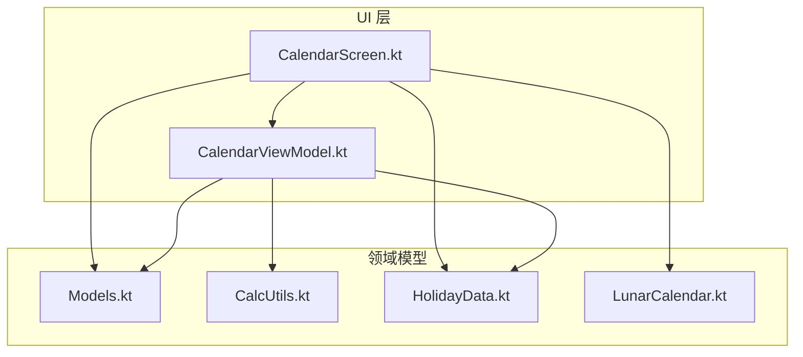
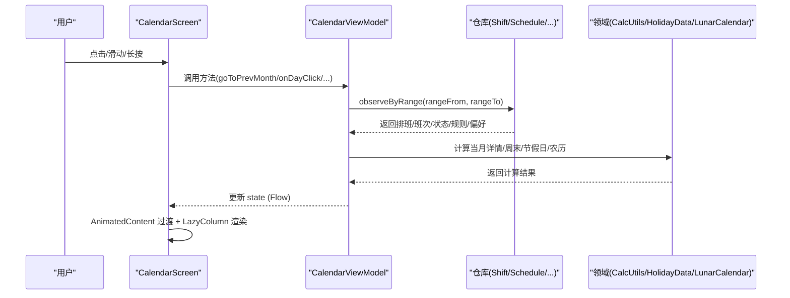
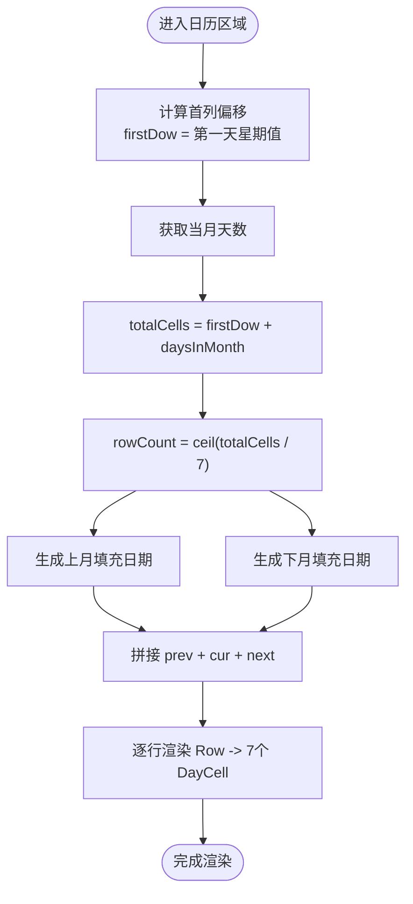
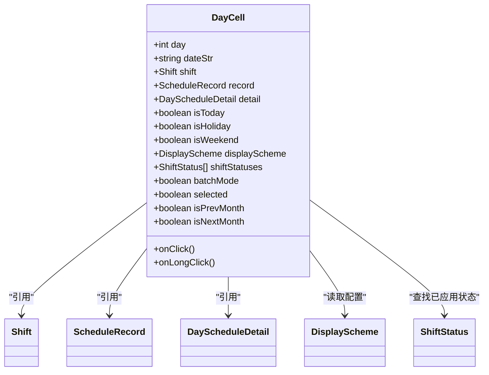
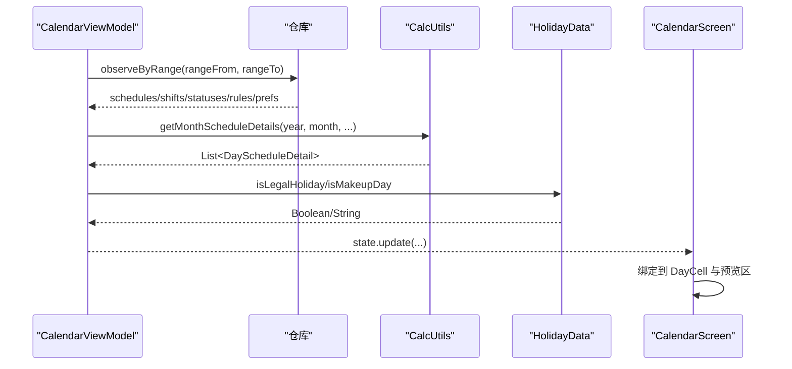
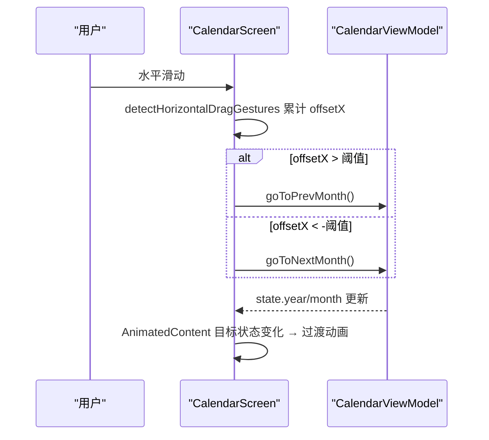
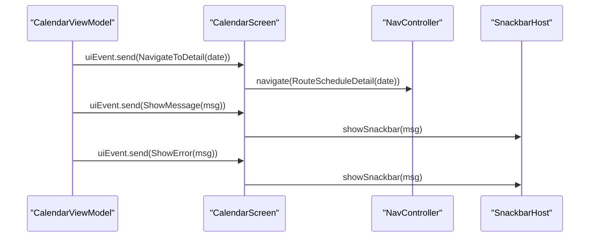
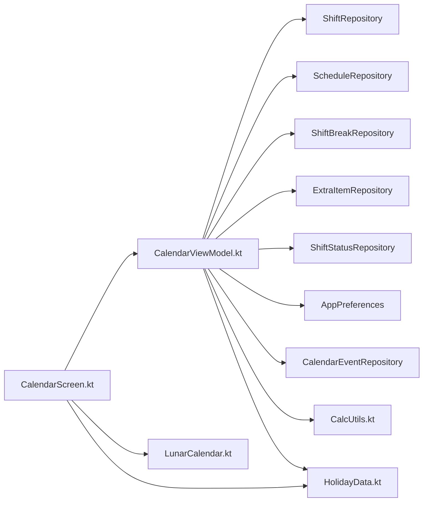

# 日历视图核心

<cite>
**本文引用的文件列表**
- [CalendarScreen.kt](file://app/src/main/java/com/schedulecalendar/app/ui/calendar/CalendarScreen.kt)
- [CalendarViewModel.kt](file://app/src/main/java/com/schedulecalendar/app/ui/calendar/CalendarViewModel.kt)
- [Models.kt](file://app/src/main/java/com/schedulecalendar/app/domain/model/Models.kt)
- [CalcUtils.kt](file://app/src/main/java/com/schedulecalendar/app/domain/model/CalcUtils.kt)
- [HolidayData.kt](file://app/src/main/java/com/schedulecalendar/app/domain/model/HolidayData.kt)
- [LunarCalendar.kt](file://app/src/main/java/com/schedulecalendar/app/domain/model/LunarCalendar.kt)
</cite>

## 目录
1. [简介](#简介)
2. [项目结构](#项目结构)
3. [核心组件](#核心组件)
4. [架构总览](#架构总览)
5. [详细组件分析](#详细组件分析)
6. [依赖关系分析](#依赖关系分析)
7. [性能考量](#性能考量)
8. [故障排查指南](#故障排查指南)
9. [结论](#结论)
10. [附录](#附录)

## 简介
本文件聚焦于“日历视图核心”的实现与文档化，覆盖以下关键主题：
- 月度日历网格的渲染机制：日期计算、月份切换动画、手势操作支持
- DayCell 组件的设计模式：状态管理、视觉样式配置、交互事件处理
- 日历数据绑定机制：排班信息显示、节假日标记、周末标识
- 性能优化策略：LazyColumn 使用、内存管理与渲染优化
- 自定义样式与交互行为的实现方案
- 错误处理与用户反馈机制

## 项目结构
日历相关代码主要分布在 UI 层与领域模型层：
- UI 层：CalendarScreen（Compose 界面）、CalendarViewModel（状态与业务编排）
- 领域模型：Models（数据类与枚举）、CalcUtils（工时薪资计算）、HolidayData（节假日/节气/节日信息）、LunarCalendar（农历/黄历工具）

图表来源
- [CalendarScreen.kt:1-120](file://app/src/main/java/com/schedulecalendar/app/ui/calendar/CalendarScreen.kt#L1-L120)
- [CalendarViewModel.kt:104-132](file://app/src/main/java/com/schedulecalendar/app/ui/calendar/CalendarViewModel.kt#L104-L132)
- [Models.kt:143-207](file://app/src/main/java/com/schedulecalendar/app/domain/model/Models.kt#L143-L207)
- [CalcUtils.kt:427-465](file://app/src/main/java/com/schedulecalendar/app/domain/model/CalcUtils.kt#L427-L465)
- [HolidayData.kt:171-175](file://app/src/main/java/com/schedulecalendar/app/domain/model/HolidayData.kt#L171-L175)
- [LunarCalendar.kt:69-72](file://app/src/main/java/com/schedulecalendar/app/domain/model/LunarCalendar.kt#L69-L72)

章节来源
- [CalendarScreen.kt:1-120](file://app/src/main/java/com/schedulecalendar/app/ui/calendar/CalendarScreen.kt#L1-L120)
- [CalendarViewModel.kt:104-132](file://app/src/main/java/com/schedulecalendar/app/ui/calendar/CalendarViewModel.kt#L104-L132)

## 核心组件
- CalendarScreen：负责日历网格渲染、月份切换动画、手势滑动、批量/复制/删除模式工具栏、日期详情展示等。
- CalendarViewModel：维护当前年月、选中日期、排班记录、显示方案、待办事项、批量/复制状态；负责跨月数据范围计算、数据聚合、事件派发与 Widget 同步。
- Models：定义班次、附加状态、排班记录、显示方案、每日明细等数据结构。
- CalcUtils：提供工时/薪资计算、自动计薪方式推断、周末判断、格式化等。
- HolidayData：内置法定节假日、调休补班、二十四节气、传统节日与国际节日名称映射。
- LunarCalendar：公历转农历、黄历宜忌、时辰吉凶等。

章节来源
- [CalendarScreen.kt:267-485](file://app/src/main/java/com/schedulecalendar/app/ui/calendar/CalendarScreen.kt#L267-L485)
- [CalendarViewModel.kt:134-247](file://app/src/main/java/com/schedulecalendar/app/ui/calendar/CalendarViewModel.kt#L134-L247)
- [Models.kt:80-100](file://app/src/main/java/com/schedulecalendar/app/domain/model/Models.kt#L80-L100)
- [Models.kt:143-207](file://app/src/main/java/com/schedulecalendar/app/domain/model/Models.kt#L143-L207)
- [CalcUtils.kt:499-522](file://app/src/main/java/com/schedulecalendar/app/domain/model/CalcUtils.kt#L499-L522)
- [HolidayData.kt:171-175](file://app/src/main/java/com/schedulecalendar/app/domain/model/HolidayData.kt#L171-L175)
- [LunarCalendar.kt:69-72](file://app/src/main/java/com/schedulecalendar/app/domain/model/LunarCalendar.kt#L69-L72)

## 架构总览
日历视图采用 MVVM + Compose 架构：
- ViewModel 通过 Flow 暴露状态，UI 层 collectAsStateWithLifecycle 订阅并驱动重组。
- 数据源包括本地仓库（排班、班次、状态、补贴/扣款、规则、偏好），在切月时按完整日期范围合并计算。
- 领域层 CalcUtils 与 HolidayData/LunarCalendar 提供计算与辅助信息。

图表来源
- [CalendarScreen.kt:329-346](file://app/src/main/java/com/schedulecalendar/app/ui/calendar/CalendarScreen.kt#L329-L346)
- [CalendarViewModel.kt:134-247](file://app/src/main/java/com/schedulecalendar/app/ui/calendar/CalendarViewModel.kt#L134-L247)
- [CalcUtils.kt:427-465](file://app/src/main/java/com/schedulecalendar/app/domain/model/CalcUtils.kt#L427-L465)
- [HolidayData.kt:171-175](file://app/src/main/java/com/schedulecalendar/app/domain/model/HolidayData.kt#L171-L175)
- [LunarCalendar.kt:69-72](file://app/src/main/java/com/schedulecalendar/app/domain/model/LunarCalendar.kt#L69-L72)

## 详细组件分析

### 月度日历网格渲染机制
- 日期计算
  - 首列偏移：根据当月第一天星期几计算前填充天数。
  - 行数：(首列偏移 + 当月天数 + 6) / 7 向上取整。
  - 跨月填充：上月尾部 + 下月头部补齐最后一行。
- 月份切换动画
  - 使用 AnimatedContent 以目标状态 year*100+month 驱动过渡，向左滑入=下月，向右滑入=上月，同时配合淡入淡出。
- 手势操作
  - detectHorizontalDragGestures 监听水平拖拽，超过阈值触发 goToPrevMonth/goToNextMonth。
  - 在批量/复制/删除模式下禁用手势以避免误触。
- 网格布局
  - 外层 Column 自适应高度，内层 for(rowIdx) Row 循环，每行 7 个 DayCell。
  - 每个 DayCell 内部包含日期数字、农历/节假日标签、数据行（班次/状态/工时/收入等）。

图表来源
- [CalendarScreen.kt:278-288](file://app/src/main/java/com/schedulecalendar/app/ui/calendar/CalendarScreen.kt#L278-L288)
- [CalendarScreen.kt:359-435](file://app/src/main/java/com/schedulecalendar/app/ui/calendar/CalendarScreen.kt#L359-L435)
- [CalendarScreen.kt:441-481](file://app/src/main/java/com/schedulecalendar/app/ui/calendar/CalendarScreen.kt#L441-L481)

章节来源
- [CalendarScreen.kt:278-288](file://app/src/main/java/com/schedulecalendar/app/ui/calendar/CalendarScreen.kt#L278-L288)
- [CalendarScreen.kt:329-346](file://app/src/main/java/com/schedulecalendar/app/ui/calendar/CalendarScreen.kt#L329-L346)
- [CalendarScreen.kt:295-317](file://app/src/main/java/com/schedulecalendar/app/ui/calendar/CalendarScreen.kt#L295-L317)
- [CalendarScreen.kt:359-435](file://app/src/main/java/com/schedulecalendar/app/ui/calendar/CalendarScreen.kt#L359-L435)
- [CalendarScreen.kt:441-481](file://app/src/main/java/com/schedulecalendar/app/ui/calendar/CalendarScreen.kt#L441-L481)

### DayCell 组件设计模式
- 状态管理
  - 输入参数：day/dateStr/shift/record/detail/isToday/isHoliday/isWeekend/displayScheme/shiftStatuses/batchMode/selected/isPrevMonth/isNextMonth。
  - 内部状态：interactionSource（用于 ripple 效果）。
- 视觉样式配置
  - 背景色优先级：选中 > 今天 > 有班次且非休息 > 透明。
  - 文字前景色：选中 > 今天 > 节假日 > 周末 > 默认 onSurface。
  - 边框与圆角：drawRoundRect 绘制选中/今天高亮边框。
  - 徽章：节假日显示“休”，补班工作日显示“补”。
  - 数据行：根据 DisplayScheme.dataRows 配置渲染 SHIFT/STATUS/工时/收入等，支持左右独立背景色与自动对比文字色。
- 交互事件处理
  - combinedClickable：onClick 与 onLongClick 分别处理选择/导航到详情。
  - 无障碍描述：构建 contentDescription，包含日期、班次、农历、是否今天/节假日/周末、打卡状态。
- 农历/节假日信息
  - 农历文本：LunarCalendar.getLunarDayText。
  - 节假日名：HolidayData.getHolidayName/getFullFestivalInfo。
  - 补班工作日：HolidayData.isMakeupDay。

图表来源
- [CalendarScreen.kt:628-639](file://app/src/main/java/com/schedulecalendar/app/ui/calendar/CalendarScreen.kt#L628-L639)
- [Models.kt:51-65](file://app/src/main/java/com/schedulecalendar/app/domain/model/Models.kt#L51-L65)
- [Models.kt:80-100](file://app/src/main/java/com/schedulecalendar/app/domain/model/Models.kt#L80-L100)
- [Models.kt:242-254](file://app/src/main/java/com/schedulecalendar/app/domain/model/Models.kt#L242-L254)
- [Models.kt:167-180](file://app/src/main/java/com/schedulecalendar/app/domain/model/Models.kt#L167-L180)
- [Models.kt:23-35](file://app/src/main/java/com/schedulecalendar/app/domain/model/Models.kt#L23-L35)

章节来源
- [CalendarScreen.kt:628-965](file://app/src/main/java/com/schedulecalendar/app/ui/calendar/CalendarScreen.kt#L628-L965)
- [Models.kt:143-207](file://app/src/main/java/com/schedulecalendar/app/domain/model/Models.kt#L143-L207)
- [Models.kt:242-254](file://app/src/main/java/com/schedulecalendar/app/domain/model/Models.kt#L242-L254)
- [LunarCalendar.kt:69-72](file://app/src/main/java/com/schedulecalendar/app/domain/model/LunarCalendar.kt#L69-L72)
- [HolidayData.kt:171-175](file://app/src/main/java/com/schedulecalendar/app/domain/model/HolidayData.kt#L171-L175)

### 日历数据绑定机制
- 排班信息显示
  - 从 ViewModel.state.schedules 中按 dateStr 查找 ScheduleRecord，再关联 Shift 名称与颜色。
  - 若 DisplayScheme 配置了 SHIFT/STATUS 项，则在数据行中显示对应标签。
- 节假日标记
  - HolidayData.isLegalHoliday 判定法定假日，getHolidayName 获取名称，isMakeupDay 判定补班工作日。
- 周末标识
  - CalcUtils.isWeekend 结合 HolidayData.isMakeupDay 判断是否为周末（考虑调休补班）。
- 每日详情
  - CalcUtils.getMonthScheduleDetails 计算 normalHours/overtimeHours/weekendHours/holidayHours/salary 等，供 DayCell 与预览区展示。

图表来源
- [CalendarViewModel.kt:134-247](file://app/src/main/java/com/schedulecalendar/app/ui/calendar/CalendarViewModel.kt#L134-L247)
- [CalcUtils.kt:427-465](file://app/src/main/java/com/schedulecalendar/app/domain/model/CalcUtils.kt#L427-L465)
- [HolidayData.kt:171-175](file://app/src/main/java/com/schedulecalendar/app/domain/model/HolidayData.kt#L171-L175)
- [CalendarScreen.kt:390-408](file://app/src/main/java/com/schedulecalendar/app/ui/calendar/CalendarScreen.kt#L390-L408)

章节来源
- [CalendarViewModel.kt:134-247](file://app/src/main/java/com/schedulecalendar/app/ui/calendar/CalendarViewModel.kt#L134-L247)
- [CalcUtils.kt:427-465](file://app/src/main/java/com/schedulecalendar/app/domain/model/CalcUtils.kt#L427-L465)
- [HolidayData.kt:171-175](file://app/src/main/java/com/schedulecalendar/app/domain/model/HolidayData.kt#L171-L175)
- [CalendarScreen.kt:390-408](file://app/src/main/java/com/schedulecalendar/app/ui/calendar/CalendarScreen.kt#L390-L408)

### 月份切换动画与手势流程
- 动画
  - AnimatedContent 目标状态为 year*100+month，根据大小比较决定 slideForward。
  - 进入：slideInHorizontally + fadeIn；退出：slideOutHorizontally + fadeOut。
- 手势
  - detectHorizontalDragGestures 累计 offsetX，结束时判断阈值触发上/下月切换。
  - 操作模式（批量/复制/删除）下禁用手势。

图表来源
- [CalendarScreen.kt:295-317](file://app/src/main/java/com/schedulecalendar/app/ui/calendar/CalendarScreen.kt#L295-L317)
- [CalendarScreen.kt:329-346](file://app/src/main/java/com/schedulecalendar/app/ui/calendar/CalendarScreen.kt#L329-L346)
- [CalendarViewModel.kt:328-341](file://app/src/main/java/com/schedulecalendar/app/ui/calendar/CalendarViewModel.kt#L328-L341)

章节来源
- [CalendarScreen.kt:295-317](file://app/src/main/java/com/schedulecalendar/app/ui/calendar/CalendarScreen.kt#L295-L317)
- [CalendarScreen.kt:329-346](file://app/src/main/java/com/schedulecalendar/app/ui/calendar/CalendarScreen.kt#L329-L346)
- [CalendarViewModel.kt:328-341](file://app/src/main/java/com/schedulecalendar/app/ui/calendar/CalendarViewModel.kt#L328-L341)

### 自定义日历样式与交互行为示例
- 自定义显示方案
  - 修改 DisplayScheme.dataRows，添加/移除 DisplayItemType（如 WORK_HOURS/OVERTIME_HOURS/DAILY_INCOME/NORMAL_INCOME/OVERTIME_INCOME/SHIFT/STATUS）。
  - 为数据行配置 backgroundColorLeft/backgroundColorRight，实现左右独立背景色。
- 自定义交互
  - 在 DayCell 的 onClick/onLongClick 回调中扩展逻辑（例如跳转到详情页或打开编辑弹窗）。
  - 在 CalendarScreen 顶部栏增加更多菜单项或快捷按钮。

章节来源
- [Models.kt:143-207](file://app/src/main/java/com/schedulecalendar/app/domain/model/Models.kt#L143-L207)
- [CalendarScreen.kt:828-961](file://app/src/main/java/com/schedulecalendar/app/ui/calendar/CalendarScreen.kt#L828-L961)
- [CalendarScreen.kt:459-476](file://app/src/main/java/com/schedulecalendar/app/ui/calendar/CalendarScreen.kt#L459-L476)

### 错误处理与用户反馈机制
- UI 事件通道
  - CalendarUiEvent.NavigateToDetail：导航到详情页面。
  - CalendarUiEvent.ShowMessage/ShowError：通过 SnackbarHost 显示消息或错误提示。
- 异常捕获
  - 加载纪念日与日程事件时 try-catch 空列表兜底。
  - 应用排班规则失败时发送 ShowError 事件。

图表来源
- [CalendarViewModel.kt:54-58](file://app/src/main/java/com/schedulecalendar/app/ui/calendar/CalendarViewModel.kt#L54-L58)
- [CalendarScreen.kt:121-130](file://app/src/main/java/com/schedulecalendar/app/ui/calendar/CalendarScreen.kt#L121-L130)
- [CalendarViewModel.kt:501-511](file://app/src/main/java/com/schedulecalendar/app/ui/calendar/CalendarViewModel.kt#L501-L511)
- [CalendarViewModel.kt:393-402](file://app/src/main/java/com/schedulecalendar/app/ui/calendar/CalendarViewModel.kt#L393-L402)

章节来源
- [CalendarViewModel.kt:54-58](file://app/src/main/java/com/schedulecalendar/app/ui/calendar/CalendarViewModel.kt#L54-L58)
- [CalendarScreen.kt:121-130](file://app/src/main/java/com/schedulecalendar/app/ui/calendar/CalendarScreen.kt#L121-L130)
- [CalendarViewModel.kt:501-511](file://app/src/main/java/com/schedulecalendar/app/ui/calendar/CalendarViewModel.kt#L501-L511)
- [CalendarViewModel.kt:393-402](file://app/src/main/java/com/schedulecalendar/app/ui/calendar/CalendarViewModel.kt#L393-L402)

## 依赖关系分析
- UI 层依赖 ViewModel 暴露的 state 与 uiEvent。
- ViewModel 依赖多个仓库（ShiftRepository、ScheduleRepository、ShiftBreakRepository、ExtraItemRepository、ShiftStatusRepository）以及偏好设置与日历事件仓库。
- 领域层 CalcUtils/HolidayData/LunarCalendar 被 ViewModel 与 UI 共同使用。

图表来源
- [CalendarViewModel.kt:104-132](file://app/src/main/java/com/schedulecalendar/app/ui/calendar/CalendarViewModel.kt#L104-L132)
- [CalendarScreen.kt:1-70](file://app/src/main/java/com/schedulecalendar/app/ui/calendar/CalendarScreen.kt#L1-L70)

章节来源
- [CalendarViewModel.kt:104-132](file://app/src/main/java/com/schedulecalendar/app/ui/calendar/CalendarViewModel.kt#L104-L132)
- [CalendarScreen.kt:1-70](file://app/src/main/java/com/schedulecalendar/app/ui/calendar/CalendarScreen.kt#L1-L70)

## 性能考量
- LazyColumn 整体滚动：将日历区域作为 item 放入 LazyColumn，避免一次性渲染所有行导致的卡顿。
- 跨月数据范围优化：loadCurrentMonth 计算 rangeFrom/rangeTo，仅查询必要范围的排班数据，减少 IO 压力。
- 取消旧 Job：每次切月先 cancel 上一次 collectJob，防止协程泄漏与重复计算。
- remember 缓存：remember(state.allShifts) 建立 shiftMap，避免重复 associateBy。
- 动画过渡：AnimatedContent 仅在 targetState 变化时触发，同月不执行过渡，降低重绘开销。
- 按需渲染：DisplayScheme.dataRows 过滤可见数据项，减少不必要的 Surface/Text 组合。

[本节为通用性能建议，无需特定文件来源]

## 故障排查指南
- 月份切换无动画
  - 检查 AnimatedContent 的 targetState 是否变化（year*100+month）。
  - 确认 goToPrevMonth/goToNextMonth 是否正确更新 state.year/state.month。
- 手势无效
  - 检查 isInOperMode（batchMode/deleteMode/copyMode）是否启用导致 pointerInput 提前 return。
- 节假日/周末显示不正确
  - 校验 HolidayData.isLegalHoliday/isMakeupDay 的数据是否覆盖目标日期。
  - 确认 CalcUtils.isWeekend 传入的 month 是 0-based（解析后 -1）。
- 数据未刷新
  - 确认 loadCurrentMonth 的 combine 是否收集到新数据，state.update 是否触发重组。
- 用户反馈未显示
  - 检查 uiEvent Channel 是否发送 NavigateToDetail/ShowMessage/ShowError。
  - 确认 CalendarScreen 中的 LaunchedEffect 是否正确消费事件并调用 snackbar.showSnackbar。

章节来源
- [CalendarScreen.kt:295-317](file://app/src/main/java/com/schedulecalendar/app/ui/calendar/CalendarScreen.kt#L295-L317)
- [CalendarScreen.kt:329-346](file://app/src/main/java/com/schedulecalendar/app/ui/calendar/CalendarScreen.kt#L329-L346)
- [CalendarViewModel.kt:134-247](file://app/src/main/java/com/schedulecalendar/app/ui/calendar/CalendarViewModel.kt#L134-L247)
- [CalendarViewModel.kt:54-58](file://app/src/main/java/com/schedulecalendar/app/ui/calendar/CalendarViewModel.kt#L54-L58)
- [CalendarScreen.kt:121-130](file://app/src/main/java/com/schedulecalendar/app/ui/calendar/CalendarScreen.kt#L121-L130)

## 结论
日历视图核心通过清晰的 MVVM 分层与 Compose 声明式 UI，实现了高性能的月度网格渲染、流畅的月份切换动画与丰富的交互体验。DayCell 组件基于可配置的 DisplayScheme 灵活展示排班与统计信息，并结合 HolidayData/LunarCalendar 提供节假日与农历信息。ViewModel 通过 Flow 与精确的日期范围查询保障数据一致性与性能。错误处理与用户反馈机制完善，便于快速定位问题与提升用户体验。

[本节为总结性内容，无需特定文件来源]

## 附录
- 自定义样式最佳实践
  - 优先使用 DisplayScheme.dataRows 控制数据项与背景色，避免在 DayCell 中硬编码样式。
  - 使用 textColorForBg 自动计算对比文字色，确保可读性。
- 交互扩展建议
  - 在 CalendarScreen 顶部栏增加更多操作入口（如批量复制、清空选择）。
  - 在 DayCell 的 onLongClick 中打开编辑弹窗或跳转至更详细的排班编辑页。

[本节为通用指导，无需特定文件来源]