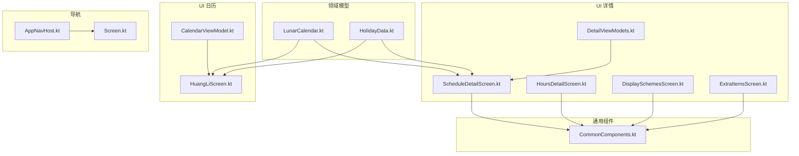
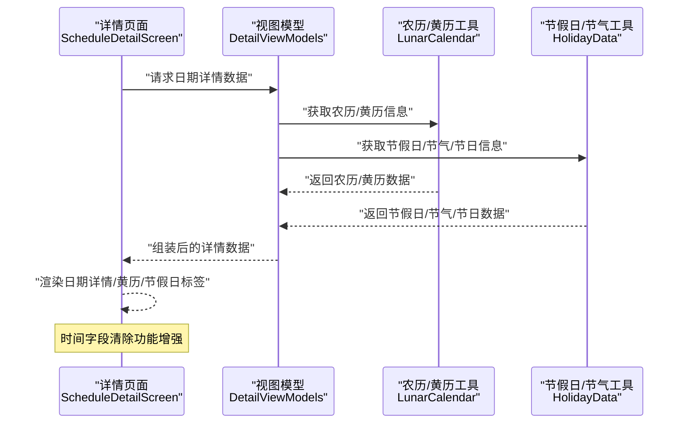
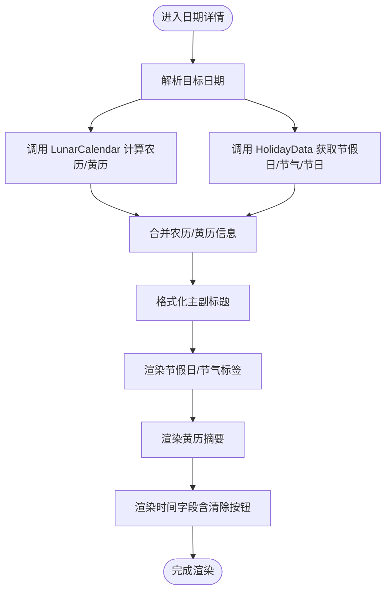
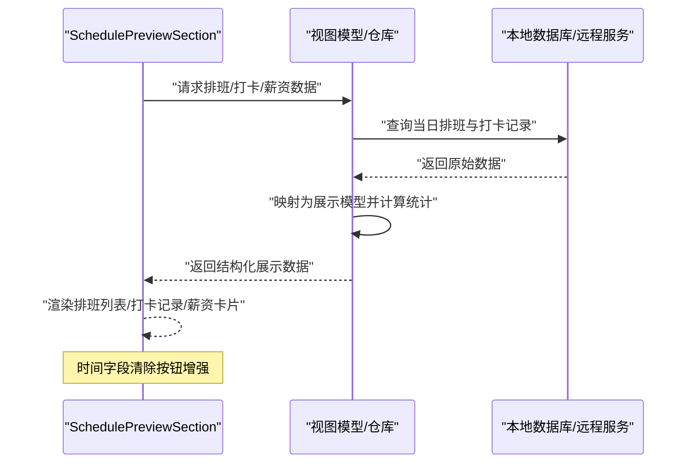
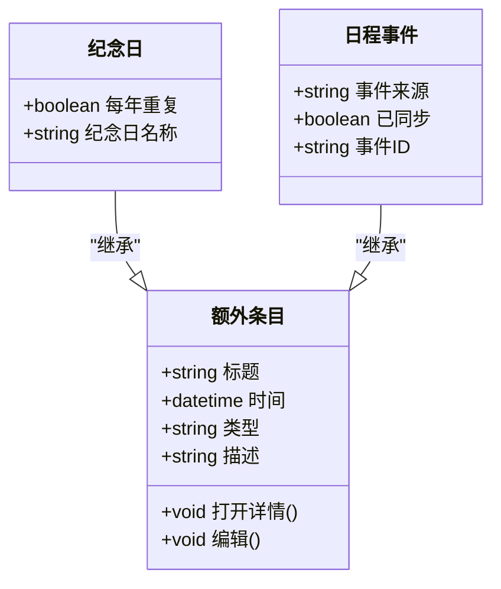
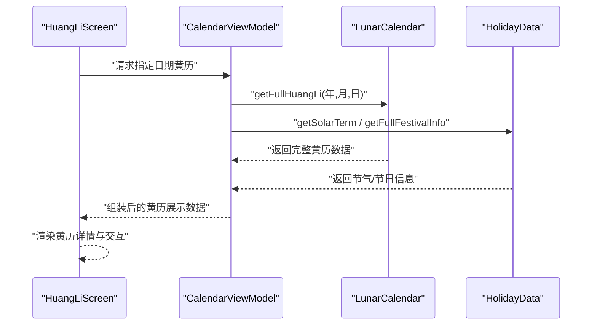
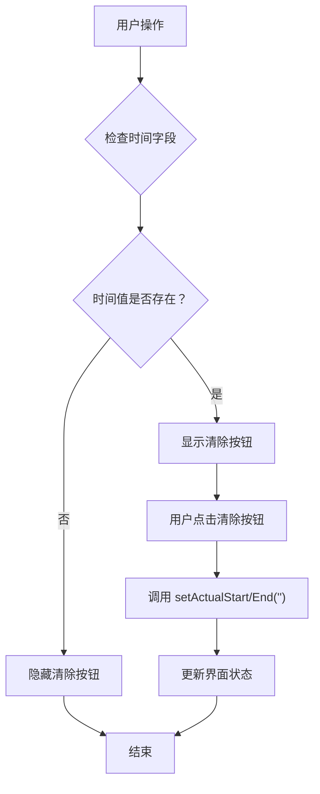
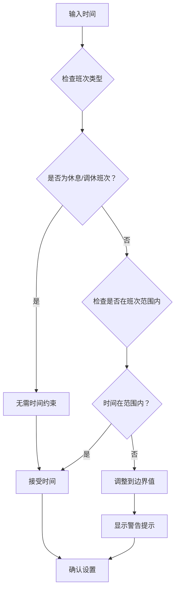
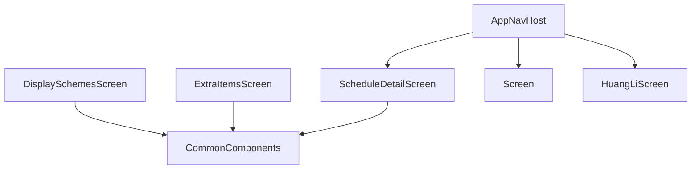
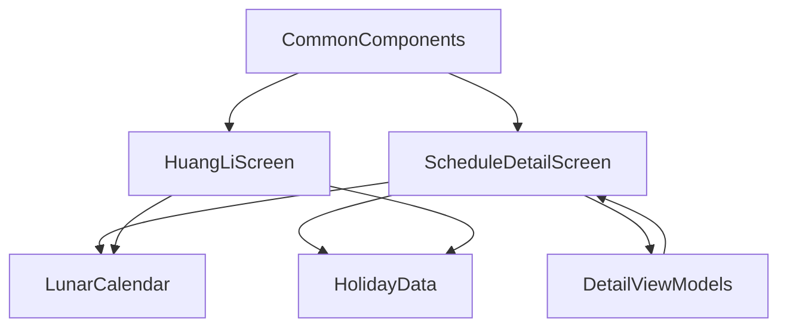

# 日期详情展示

<cite>
**本文引用的文件**   
- [LunarCalendar.kt](file://app/src/main/java/com/schedulecalendar/app/domain/model/LunarCalendar.kt)
- [HolidayData.kt](file://app/src/main/java/com/schedulecalendar/app/domain/model/HolidayData.kt)
- [ScheduleDetailScreen.kt](file://app/src/main/java/com/schedulecalendar/app/ui/detail/ScheduleDetailScreen.kt)
- [HoursDetailScreen.kt](file://app/src/main/java/com/schedulecalendar/app/ui/detail/HoursDetailScreen.kt)
- [HuangLiScreen.kt](file://app/src/main/java/com/schedulecalendar/app/ui/calendar/HuangLiScreen.kt)
- [CalendarViewModel.kt](file://app/src/main/java/com/schedulecalendar/app/ui/calendar/CalendarViewModel.kt)
- [DisplaySchemesScreen.kt](file://app/src/main/java/com/schedulecalendar/app/ui/detail/DisplaySchemesScreen.kt)
- [ExtraItemsScreen.kt](file://app/src/main/java/com/schedulecalendar/app/ui/detail/ExtraItemsScreen.kt)
- [CommonComponents.kt](file://app/src/main/java/com/schedulecalendar/app/ui/component/CommonComponents.kt)
- [AppNavHost.kt](file://app/src/main/java/com/schedulecalendar/app/ui/navigation/AppNavHost.kt)
- [Screen.kt](file://app/src/main/java/com/schedulecalendar/app/ui/navigation/Screen.kt)
- [DetailViewModels.kt](file://app/src/main/java/com/schedulecalendar/app/ui/detail/DetailViewModels.kt)
</cite>

## 更新摘要
**变更内容**   
- 增强了时间字段的清除功能，为"实际上班"和"实际下班"时间选择器添加专用清除按钮
- 改进了状态时间对话框的时间约束逻辑，支持内置休息/调休班次的特殊处理
- 优化了用户交互体验，提供更直观的时间管理操作

## 目录
1. [引言](#引言)
2. [项目结构](#项目结构)
3. [核心组件](#核心组件)
4. [架构总览](#架构总览)
5. [详细组件分析](#详细组件分析)
6. [依赖分析](#依赖分析)
7. [性能考虑](#性能考虑)
8. [故障排查指南](#故障排查指南)
9. [结论](#结论)
10. [附录](#附录)

## 引言
本文件围绕"日期详情展示"能力，系统性梳理并说明以下功能：
- DateDetailSection 组件的设计与实现：日期信息格式化、农历显示、节假日标识等。
- SchedulePreviewSection 组件的数据绑定与展示逻辑：排班信息、打卡记录、薪资统计等内容的呈现。
- 纪念日与日程事件的集成机制：数据来源、显示格式、交互处理。
- 黄历信息的获取与展示：节气、民俗节日、官方纪念日等信息的显示。
- 自定义日期详情布局与扩展显示内容的方法。
- 数据加载优化与用户交互体验改进方案。

**最新更新**：增强了时间字段的清除功能，为用户提供更便捷的时间管理操作体验。

## 项目结构
与"日期详情展示"相关的代码主要分布在 domain 层（模型与工具）、ui 层（界面与状态）以及导航配置中：
- domain/model：提供农历、黄历、节假日、节气等基础数据与计算能力。
- ui/detail：包含日期详情相关页面与展示逻辑。
- ui/calendar：包含黄历展示页与日历视图模型。
- ui/component：通用 UI 组件，便于复用。
- ui/navigation：应用导航路由定义。

图表来源
- [LunarCalendar.kt:1-418](file://app/src/main/java/com/schedulecalendar/app/domain/model/LunarCalendar.kt#L1-L418)
- [HolidayData.kt:1-636](file://app/src/main/java/com/schedulecalendar/app/domain/model/HolidayData.kt#L1-L636)
- [ScheduleDetailScreen.kt](file://app/src/main/java/com/schedulecalendar/app/ui/detail/ScheduleDetailScreen.kt)
- [HoursDetailScreen.kt](file://app/src/main/java/com/schedulecalendar/app/ui/detail/HoursDetailScreen.kt)
- [HuangLiScreen.kt](file://app/src/main/java/com/schedulecalendar/app/ui/calendar/HuangLiScreen.kt)
- [CalendarViewModel.kt](file://app/src/main/java/com/schedulecalendar/app/ui/calendar/CalendarViewModel.kt)
- [DisplaySchemesScreen.kt](file://app/src/main/java/com/schedulecalendar/app/ui/detail/DisplaySchemesScreen.kt)
- [ExtraItemsScreen.kt](file://app/src/main/java/com/schedulecalendar/app/ui/detail/ExtraItemsScreen.kt)
- [CommonComponents.kt](file://app/src/main/java/com/schedulecalendar/app/ui/component/CommonComponents.kt)
- [AppNavHost.kt](file://app/src/main/java/com/schedulecalendar/app/ui/navigation/AppNavHost.kt)
- [Screen.kt](file://app/src/main/java/com/schedulecalendar/app/ui/navigation/Screen.kt)
- [DetailViewModels.kt](file://app/src/main/java/com/schedulecalendar/app/ui/detail/DetailViewModels.kt)

章节来源
- [LunarCalendar.kt:1-418](file://app/src/main/java/com/schedulecalendar/app/domain/model/LunarCalendar.kt#L1-L418)
- [HolidayData.kt:1-636](file://app/src/main/java/com/schedulecalendar/app/domain/model/HolidayData.kt#L1-L636)
- [HuangLiScreen.kt](file://app/src/main/java/com/schedulecalendar/app/ui/calendar/HuangLiScreen.kt)
- [CalendarViewModel.kt](file://app/src/main/java/com/schedulecalendar/app/ui/calendar/CalendarViewModel.kt)
- [ScheduleDetailScreen.kt](file://app/src/main/java/com/schedulecalendar/app/ui/detail/ScheduleDetailScreen.kt)
- [HoursDetailScreen.kt](file://app/src/main/java/com/schedulecalendar/app/ui/detail/HoursDetailScreen.kt)
- [DisplaySchemesScreen.kt](file://app/src/main/java/com/schedulecalendar/app/ui/detail/DisplaySchemesScreen.kt)
- [ExtraItemsScreen.kt](file://app/src/main/java/com/schedulecalendar/app/ui/detail/ExtraItemsScreen.kt)
- [CommonComponents.kt](file://app/src/main/java/com/schedulecalendar/app/ui/component/CommonComponents.kt)
- [AppNavHost.kt](file://app/src/main/java/com/schedulecalendar/app/ui/navigation/AppNavHost.kt)
- [Screen.kt](file://app/src/main/java/com/schedulecalendar/app/ui/navigation/Screen.kt)
- [DetailViewModels.kt](file://app/src/main/java/com/schedulecalendar/app/ui/detail/DetailViewModels.kt)

## 核心组件
本节聚焦于"日期详情展示"的核心能力与关键模块：
- 日期信息与农历：通过领域模型将公历转换为农历，并提供干支、生肖、月日文本等。
- 节假日与节气：内置法定假日、调休补班、二十四节气与传统/国际节日识别。
- 黄历信息：宜忌等级、五行、冲煞、星宿、值神、建除十二神、纳音五行、胎神、时辰吉凶等。
- 详情展示：在详情页面聚合上述信息，结合排班、打卡、薪资等数据进行综合呈现。
- **新增**：增强的时间字段清除功能，提升用户操作便捷性。

章节来源
- [LunarCalendar.kt:1-418](file://app/src/main/java/com/schedulecalendar/app/domain/model/LunarCalendar.kt#L1-L418)
- [HolidayData.kt:1-636](file://app/src/main/java/com/schedulecalendar/app/domain/model/HolidayData.kt#L1-L636)

## 架构总览
下图展示了从 UI 到领域模型的调用关系，以及数据流向：

图表来源
- [ScheduleDetailScreen.kt](file://app/src/main/java/com/schedulecalendar/app/ui/detail/ScheduleDetailScreen.kt)
- [DetailViewModels.kt](file://app/src/main/java/com/schedulecalendar/app/ui/detail/DetailViewModels.kt)
- [CalendarViewModel.kt](file://app/src/main/java/com/schedulecalendar/app/ui/calendar/CalendarViewModel.kt)
- [LunarCalendar.kt:1-418](file://app/src/main/java/com/schedulecalendar/app/domain/model/LunarCalendar.kt#L1-L418)
- [HolidayData.kt:1-636](file://app/src/main/java/com/schedulecalendar/app/domain/model/HolidayData.kt#L1-L636)

## 详细组件分析

### DateDetailSection 组件设计与实现
- 职责
  - 负责日期主标题与副标题的格式化（如星期、农历月日、干支、生肖）。
  - 展示节假日与节气标签（法定假日、传统节日、国际节日、二十四节气）。
  - 展示黄历摘要（宜忌等级、五行、冲煞、值神、星宿等）。
  - 作为入口，承载后续扩展项（纪念日、日程事件、额外信息等）。
- 数据源
  - 农历与黄历：来自 LunarCalendar 工具类。
  - 节假日与节气：来自 HolidayData 工具类。
- 展示逻辑
  - 根据当前公历日期，计算农历月日文本；若为初一则优先显示月份文本。
  - 合并法定节假日、调休补班、二十四节气与传统/国际节日，去重后以标签形式展示。
  - 根据宜忌数量判定黄历等级，并展示五行、冲煞、值神、星宿等辅助信息。
- 可定制性
  - 通过 DisplaySchemesScreen 提供的展示方案切换，控制是否显示某类信息。
  - 通过 ExtraItemsScreen 扩展额外条目（纪念日、日程事件等），统一由通用组件渲染。

**更新**：时间字段清除功能增强，在"实际上班"和"实际下班"时间选择器中添加了专用清除按钮。

图表来源
- [LunarCalendar.kt:1-418](file://app/src/main/java/com/schedulecalendar/app/domain/model/LunarCalendar.kt#L1-L418)
- [HolidayData.kt:1-636](file://app/src/main/java/com/schedulecalendar/app/domain/model/HolidayData.kt#L1-L636)
- [ScheduleDetailScreen.kt](file://app/src/main/java/com/schedulecalendar/app/ui/detail/ScheduleDetailScreen.kt)
- [DisplaySchemesScreen.kt](file://app/src/main/java/com/schedulecalendar/app/ui/detail/DisplaySchemesScreen.kt)
- [ExtraItemsScreen.kt](file://app/src/main/java/com/schedulecalendar/app/ui/detail/ExtraItemsScreen.kt)
- [CommonComponents.kt](file://app/src/main/java/com/schedulecalendar/app/ui/component/CommonComponents.kt)

章节来源
- [LunarCalendar.kt:1-418](file://app/src/main/java/com/schedulecalendar/app/domain/model/LunarCalendar.kt#L1-L418)
- [HolidayData.kt:1-636](file://app/src/main/java/com/schedulecalendar/app/domain/model/HolidayData.kt#L1-L636)
- [ScheduleDetailScreen.kt](file://app/src/main/java/com/schedulecalendar/app/ui/detail/ScheduleDetailScreen.kt)
- [DisplaySchemesScreen.kt](file://app/src/main/java/com/schedulecalendar/app/ui/detail/DisplaySchemesScreen.kt)
- [ExtraItemsScreen.kt](file://app/src/main/java/com/schedulecalendar/app/ui/detail/ExtraItemsScreen.kt)
- [CommonComponents.kt](file://app/src/main/java/com/schedulecalendar/app/ui/component/CommonComponents.kt)

### SchedulePreviewSection 组件数据绑定与展示逻辑
- 职责
  - 展示当日排班信息（班次、时段、状态）。
  - 展示打卡记录（签到/签退时间、异常标记）。
  - 展示薪资统计（当日或累计工时、计薪规则汇总）。
- 数据绑定
  - 从 ViewModel 或 Repository 拉取排班与打卡数据，按日期分组。
  - 将数据映射为 UI 友好的数据结构（如列表项、统计卡片）。
- 展示逻辑
  - 排班信息：按时间段顺序排列，标注正常/迟到/早退/缺卡等状态。
  - 打卡记录：对比计划班次与实际打卡，突出差异与提示。
  - 薪资统计：基于工时与计薪规则计算，提供明细与合计。
- 交互处理
  - 点击排班条目可查看详情或跳转编辑。
  - 点击打卡异常可触发修正流程或备注输入。
  - 支持筛选与排序（按日期、状态、类型）。

**更新**：时间字段清除功能增强，为用户提供了更便捷的时间管理操作。

图表来源
- [ScheduleDetailScreen.kt](file://app/src/main/java/com/schedulecalendar/app/ui/detail/ScheduleDetailScreen.kt)
- [HoursDetailScreen.kt](file://app/src/main/java/com/schedulecalendar/app/ui/detail/HoursDetailScreen.kt)

章节来源
- [ScheduleDetailScreen.kt](file://app/src/main/java/com/schedulecalendar/app/ui/detail/ScheduleDetailScreen.kt)
- [HoursDetailScreen.kt](file://app/src/main/java/com/schedulecalendar/app/ui/detail/HoursDetailScreen.kt)

### 纪念日与日程事件的集成机制
- 数据来源
  - 纪念日：通常来源于本地存储或设置项，可通过 ExtraItemsScreen 进行维护。
  - 日程事件：可能来自系统日历或应用内事件表，通过 CalendarEventViewModel 管理。
- 显示格式
  - 统一抽象为"额外条目"，使用 CommonComponents 中的通用组件渲染，保持风格一致。
  - 每条条目包含标题、时间、类型标签与可选描述。
- 交互处理
  - 点击条目可打开详情或编辑界面。
  - 支持新增、删除、重复提醒等常见操作。
  - 与日期详情联动：当选择不同日期时，自动过滤对应条目。

图表来源
- [ExtraItemsScreen.kt](file://app/src/main/java/com/schedulecalendar/app/ui/detail/ExtraItemsScreen.kt)
- [CommonComponents.kt](file://app/src/main/java/com/schedulecalendar/app/ui/component/CommonComponents.kt)
- [CalendarEventViewModel.kt](file://app/src/main/java/com/schedulecalendar/app/ui/todo/CalendarEventViewModel.kt)

章节来源
- [ExtraItemsScreen.kt](file://app/src/main/java/com/schedulecalendar/app/ui/detail/ExtraItemsScreen.kt)
- [CommonComponents.kt](file://app/src/main/java/com/schedulecalendar/app/ui/component/CommonComponents.kt)
- [CalendarEventViewModel.kt](file://app/src/main/java/com/schedulecalendar/app/ui/todo/CalendarEventViewModel.kt)

### 黄历信息的获取与展示
- 数据获取
  - 通过 LunarCalendar.getFullHuangLi 获取完整黄历信息，包括农历、节气、宜忌、五行、冲煞、值神、星宿、纳音五行、胎神、时辰吉凶等。
  - 通过 HolidayData.getSolarTerm 与 getFullFestivalInfo 补充节气与传统/国际节日信息。
- 展示逻辑
  - 在 HuangLiScreen 中集中展示黄历摘要与详细信息。
  - 根据宜忌数量判定等级，并以颜色或图标区分吉凶。
  - 展示十二时辰吉凶，帮助用户选择吉时。
- 交互处理
  - 支持切换日期查看不同日期的黄历。
  - 点击具体条目可查看详细说明或跳转到相关设置。

图表来源
- [HuangLiScreen.kt](file://app/src/main/java/com/schedulecalendar/app/ui/calendar/HuangLiScreen.kt)
- [CalendarViewModel.kt](file://app/src/main/java/com/schedulecalendar/app/ui/calendar/CalendarViewModel.kt)
- [LunarCalendar.kt:1-418](file://app/src/main/java/com/schedulecalendar/app/domain/model/LunarCalendar.kt#L1-L418)
- [HolidayData.kt:1-636](file://app/src/main/java/com/schedulecalendar/app/domain/model/HolidayData.kt#L1-L636)

章节来源
- [HuangLiScreen.kt](file://app/src/main/java/com/schedulecalendar/app/ui/calendar/HuangLiScreen.kt)
- [CalendarViewModel.kt](file://app/src/main/java/com/schedulecalendar/app/ui/calendar/CalendarViewModel.kt)
- [LunarCalendar.kt:1-418](file://app/src/main/java/com/schedulecalendar/app/domain/model/LunarCalendar.kt#L1-L418)
- [HolidayData.kt:1-636](file://app/src/main/java/com/schedulecalendar/app/domain/model/HolidayData.kt#L1-L636)

### 时间字段清除功能增强
**新增功能**：为"实际上班"和"实际下班"时间选择器添加了专用的清除按钮，提升用户操作便捷性。

- 功能特性
  - 当时间值存在时，显示红色清除按钮（X图标）
  - 点击清除按钮立即清空对应时间字段
  - 清除按钮采用 Material Design 错误色调，视觉醒目
  - 按钮位置固定在时间选择器右侧，不影响原有布局

- 实现细节
  - 在 ScheduleDetailScreen 中为每个时间字段添加条件渲染的清除按钮
  - 使用 `record?.actualStartTime != null` 和 `record?.actualEndTime != null` 判断显示条件
  - 清除操作直接调用 ViewModel 的 `setActualStart("")` 和 `setActualEnd("")` 方法
  - 按钮尺寸为 36dp × 54dp，图标大小为 20dp

- 用户体验改进
  - 无需重新打开时间选择器即可快速删除时间
  - 符合 Material Design 设计规范，保持一致的交互模式
  - 红色错误色调明确指示删除操作的破坏性

图表来源
- [ScheduleDetailScreen.kt:218-230](file://app/src/main/java/com/schedulecalendar/app/ui/detail/ScheduleDetailScreen.kt#L218-L230)
- [ScheduleDetailScreen.kt:249-261](file://app/src/main/java/com/schedulecalendar/app/ui/detail/ScheduleDetailScreen.kt#L249-L261)
- [DetailViewModels.kt:163-164](file://app/src/main/java/com/schedulecalendar/app/ui/detail/DetailViewModels.kt#L163-L164)

章节来源
- [ScheduleDetailScreen.kt](file://app/src/main/java/com/schedulecalendar/app/ui/detail/ScheduleDetailScreen.kt)
- [DetailViewModels.kt](file://app/src/main/java/com/schedulecalendar/app/ui/detail/DetailViewModels.kt)

### 状态时间对话框的时间约束逻辑增强
**更新功能**：状态时间对话框增强了时间约束逻辑，能够正确识别和处理内置休息/调休班次的特殊情况。

- 约束逻辑改进
  - 检测班次是否有有效时间段：`hasShiftRange = defaultStartTime.isNotEmpty() && defaultEndTime.isNotEmpty()`
  - 对于内置休息/调休班次（无时间段），跳过时间约束检查
  - 对于普通班次，严格限制时间不能超过班次范围
  - 支持跨天班次的正确处理（如 20:30-8:30）

- 智能判断机制
  - 使用 `clampToShift` 函数进行时间约束计算
  - 对于休息/调休班次返回 `null`，表示无需约束
  - 对于普通班次，超出范围时自动调整到边界值
  - 显示警告提示告知用户时间已被调整

- 用户体验优化
  - 当检测到时间超出范围时，显示黄色警告提示
  - 提供"清除时间"按钮，方便用户重置时间设置
  - 支持部分时间设置（仅开始时间或仅结束时间）

图表来源
- [ScheduleDetailScreen.kt:588-608](file://app/src/main/java/com/schedulecalendar/app/ui/detail/ScheduleDetailScreen.kt#L588-L608)
- [ScheduleDetailScreen.kt:639-646](file://app/src/main/java/com/schedulecalendar/app/ui/detail/ScheduleDetailScreen.kt#L639-L646)

章节来源
- [ScheduleDetailScreen.kt](file://app/src/main/java/com/schedulecalendar/app/ui/detail/ScheduleDetailScreen.kt)

### 自定义日期详情布局与扩展显示内容
- 展示方案切换
  - 通过 DisplaySchemesScreen 提供的选项，控制是否显示农历、黄历、节假日、额外条目等。
- 扩展条目
  - 在 ExtraItemsScreen 中添加自定义条目（如纪念日、日程事件、备注等），统一由通用组件渲染。
- 通用组件
  - 使用 CommonComponents 中的卡片、标签、列表等组件，确保风格一致与可维护性。
- 导航集成
  - 通过 AppNavHost 与 Screen 定义路由，将日期详情与其他页面（如黄历、设置）无缝衔接。

图表来源
- [DisplaySchemesScreen.kt](file://app/src/main/java/com/schedulecalendar/app/ui/detail/DisplaySchemesScreen.kt)
- [ExtraItemsScreen.kt](file://app/src/main/java/com/schedulecalendar/app/ui/detail/ExtraItemsScreen.kt)
- [CommonComponents.kt](file://app/src/main/java/com/schedulecalendar/app/ui/component/CommonComponents.kt)
- [AppNavHost.kt](file://app/src/main/java/com/schedulecalendar/app/ui/navigation/AppNavHost.kt)
- [Screen.kt](file://app/src/main/java/com/schedulecalendar/app/ui/navigation/Screen.kt)

章节来源
- [DisplaySchemesScreen.kt](file://app/src/main/java/com/schedulecalendar/app/ui/detail/DisplaySchemesScreen.kt)
- [ExtraItemsScreen.kt](file://app/src/main/java/com/schedulecalendar/app/ui/detail/ExtraItemsScreen.kt)
- [CommonComponents.kt](file://app/src/main/java/com/schedulecalendar/app/ui/component/CommonComponents.kt)
- [AppNavHost.kt](file://app/src/main/java/com/schedulecalendar/app/ui/navigation/AppNavHost.kt)
- [Screen.kt](file://app/src/main/java/com/schedulecalendar/app/ui/navigation/Screen.kt)

## 依赖分析
- 组件耦合
  - 详情页面依赖领域模型（LunarCalendar、HolidayData）进行数据计算与格式化。
  - 通用组件被多个页面复用，降低耦合度并提升一致性。
  - ViewModel 统一管理状态变化，确保数据流的一致性。
- 外部依赖
  - 农历与黄历计算依赖第三方库（tyme4j），保证数据权威性与准确性。
  - 节假日与节气数据内置于 HolidayData，覆盖 2024-2030 年范围。
- 潜在循环依赖
  - 当前结构清晰，未见明显循环依赖；如需扩展，建议通过接口或事件总线解耦。

**更新**：时间字段清除功能通过 ViewModel 方法实现，保持了良好的组件解耦。

图表来源
- [ScheduleDetailScreen.kt](file://app/src/main/java/com/schedulecalendar/app/ui/detail/ScheduleDetailScreen.kt)
- [HuangLiScreen.kt](file://app/src/main/java/com/schedulecalendar/app/ui/calendar/HuangLiScreen.kt)
- [DetailViewModels.kt](file://app/src/main/java/com/schedulecalendar/app/ui/detail/DetailViewModels.kt)
- [LunarCalendar.kt:1-418](file://app/src/main/java/com/schedulecalendar/app/domain/model/LunarCalendar.kt#L1-L418)
- [HolidayData.kt:1-636](file://app/src/main/java/com/schedulecalendar/app/domain/model/HolidayData.kt#L1-L636)
- [CommonComponents.kt](file://app/src/main/java/com/schedulecalendar/app/ui/component/CommonComponents.kt)

章节来源
- [ScheduleDetailScreen.kt](file://app/src/main/java/com/schedulecalendar/app/ui/detail/ScheduleDetailScreen.kt)
- [HuangLiScreen.kt](file://app/src/main/java/com/schedulecalendar/app/ui/calendar/HuangLiScreen.kt)
- [DetailViewModels.kt](file://app/src/main/java/com/schedulecalendar/app/ui/detail/DetailViewModels.kt)
- [LunarCalendar.kt:1-418](file://app/src/main/java/com/schedulecalendar/app/domain/model/LunarCalendar.kt#L1-L418)
- [HolidayData.kt:1-636](file://app/src/main/java/com/schedulecalendar/app/domain/model/HolidayData.kt#L1-L636)
- [CommonComponents.kt](file://app/src/main/java/com/schedulecalendar/app/ui/component/CommonComponents.kt)

## 性能考虑
- 数据缓存
  - 对黄历与节假日信息进行内存缓存，避免重复计算与 I/O。
  - 对排班与打卡数据采用分页与懒加载，减少首屏压力。
- 计算优化
  - 将耗时计算（如农历转换、黄历生成）移至后台线程，UI 仅接收结果。
  - 对节气与节日信息进行预编译与索引，提高查找效率。
- 渲染优化
  - 使用 Compose 的状态驱动更新，避免不必要的重组。
  - 对长列表采用虚拟化与按需加载，提升滚动流畅度。
- **更新**：时间字段清除操作为即时响应，无需额外计算开销。

[本节为通用指导，不直接分析具体文件]

## 故障排查指南
- 农历/黄历数据异常
  - 检查 LunarCalendar 的工具方法是否传入有效日期参数。
  - 确认 tyme4j 库版本与兼容性。
- 节假日/节气缺失
  - 核对 HolidayData 中的数据是否覆盖目标年份。
  - 确认日期格式为 yyyy-MM-dd，避免匹配失败。
- 展示不一致
  - 检查 DisplaySchemesScreen 的配置是否启用相应模块。
  - 确认 CommonComponents 的样式与主题设置正确。
- 导航问题
  - 检查 AppNavHost 与 Screen 的路由定义是否完整。
  - 确认页面间传参是否正确。
- **更新**：时间字段清除功能问题
  - 检查 ViewModel 的 `setActualStart` 和 `setActualEnd` 方法是否正确处理空字符串。
  - 确认条件渲染逻辑正确判断时间字段是否存在值。
  - 验证清除按钮的点击事件绑定是否正确。

章节来源
- [LunarCalendar.kt:1-418](file://app/src/main/java/com/schedulecalendar/app/domain/model/LunarCalendar.kt#L1-L418)
- [HolidayData.kt:1-636](file://app/src/main/java/com/schedulecalendar/app/domain/model/HolidayData.kt#L1-L636)
- [DisplaySchemesScreen.kt](file://app/src/main/java/com/schedulecalendar/app/ui/detail/DisplaySchemesScreen.kt)
- [CommonComponents.kt](file://app/src/main/java/com/schedulecalendar/app/ui/component/CommonComponents.kt)
- [AppNavHost.kt](file://app/src/main/java/com/schedulecalendar/app/ui/navigation/AppNavHost.kt)
- [Screen.kt](file://app/src/main/java/com/schedulecalendar/app/ui/navigation/Screen.kt)
- [DetailViewModels.kt](file://app/src/main/java/com/schedulecalendar/app/ui/detail/DetailViewModels.kt)

## 结论
通过领域模型与 UI 层的协同，日期详情展示功能实现了丰富的信息聚合与灵活的展示方案。借助 LunarCalendar 与 HolidayData 的强大能力，应用能够准确呈现农历、黄历、节假日与节气信息，并通过通用组件与展示方案切换，满足多样化的用户需求。

**最新更新**：时间字段清除功能的增强显著提升了用户体验，为用户提供了更便捷的时间管理操作方式。状态时间对话框的时间约束逻辑改进确保了数据的准确性和一致性。未来可在数据缓存、异步加载与交互反馈方面进一步优化，以提升用户体验与性能表现。

[本节为总结性内容，不直接分析具体文件]

## 附录
- 示例路径参考
  - 日期详情主页面：[ScheduleDetailScreen.kt](file://app/src/main/java/com/schedulecalendar/app/ui/detail/ScheduleDetailScreen.kt)
  - 工时详情页面：[HoursDetailScreen.kt](file://app/src/main/java/com/schedulecalendar/app/ui/detail/HoursDetailScreen.kt)
  - 黄历展示页面：[HuangLiScreen.kt](file://app/src/main/java/com/schedulecalendar/app/ui/calendar/HuangLiScreen.kt)
  - 展示方案设置：[DisplaySchemesScreen.kt](file://app/src/main/java/com/schedulecalendar/app/ui/detail/DisplaySchemesScreen.kt)
  - 额外条目管理：[ExtraItemsScreen.kt](file://app/src/main/java/com/schedulecalendar/app/ui/detail/ExtraItemsScreen.kt)
  - 通用组件库：[CommonComponents.kt](file://app/src/main/java/com/schedulecalendar/app/ui/component/CommonComponents.kt)
  - 导航配置：[AppNavHost.kt](file://app/src/main/java/com/schedulecalendar/app/ui/navigation/AppNavHost.kt)、[Screen.kt](file://app/src/main/java/com/schedulecalendar/app/ui/navigation/Screen.kt)
  - 领域模型：[LunarCalendar.kt](file://app/src/main/java/com/schedulecalendar/app/domain/model/LunarCalendar.kt)、[HolidayData.kt](file://app/src/main/java/com/schedulecalendar/app/domain/model/HolidayData.kt)
  - **更新**：视图模型：[DetailViewModels.kt](file://app/src/main/java/com/schedulecalendar/app/ui/detail/DetailViewModels.kt)

[本节为参考信息，不直接分析具体文件]