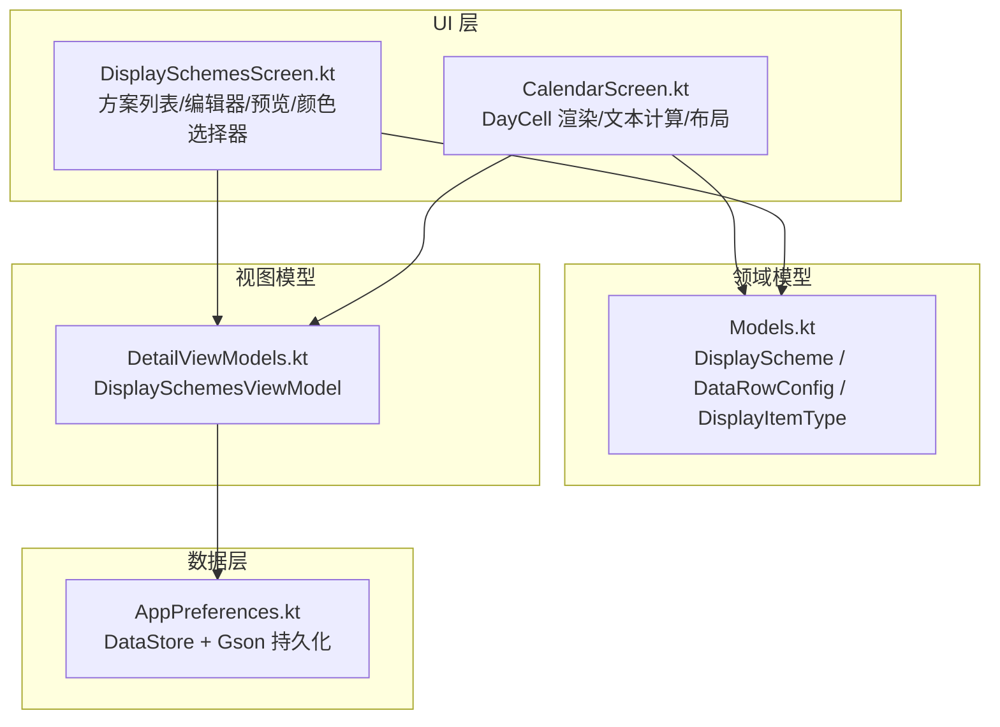
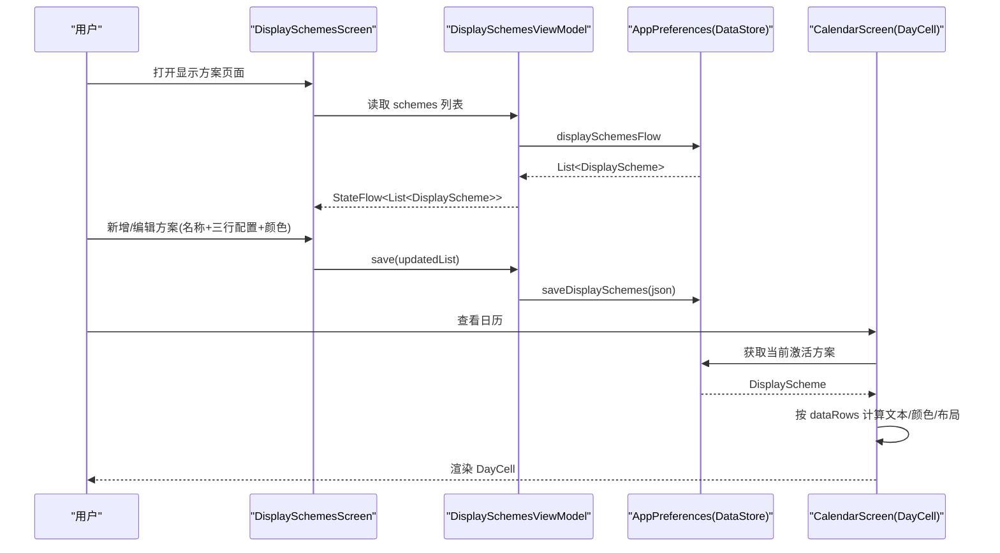
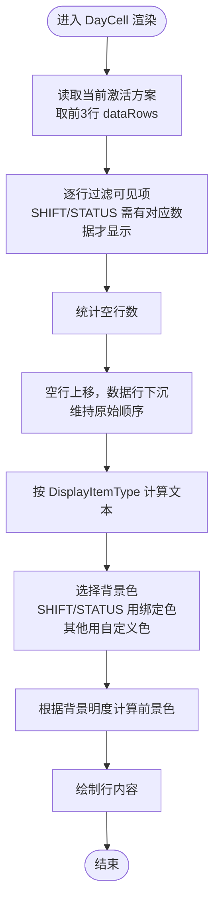
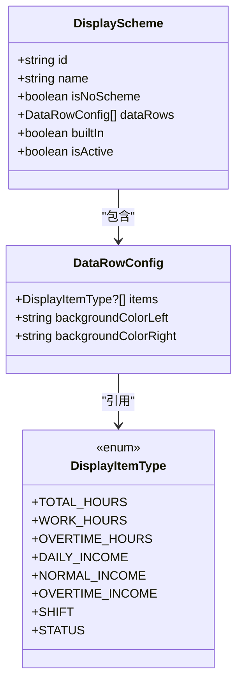
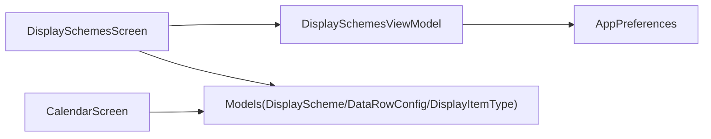

# 显示方案系统

<cite>
**本文引用的文件**   
- [Models.kt](file://app/src/main/java/com/schedulecalendar/app/domain/model/Models.kt)
- [DisplaySchemesScreen.kt](file://app/src/main/java/com/schedulecalendar/app/ui/detail/DisplaySchemesScreen.kt)
- [DetailViewModels.kt](file://app/src/main/java/com/schedulecalendar/app/ui/detail/DetailViewModels.kt)
- [CalendarScreen.kt](file://app/src/main/java/com/schedulecalendar/app/ui/calendar/CalendarScreen.kt)
- [AppPreferences.kt](file://app/src/main/java/com/schedulecalendar/app/data/prefs/AppPreferences.kt)
</cite>

## 目录
1. [简介](#简介)
2. [项目结构](#项目结构)
3. [核心组件](#核心组件)
4. [架构总览](#架构总览)
5. [详细组件分析](#详细组件分析)
6. [依赖关系分析](#依赖关系分析)
7. [性能与可扩展性](#性能与可扩展性)
8. [故障排查指南](#故障排查指南)
9. [结论](#结论)
10. [附录：扩展指南与示例路径](#附录扩展指南与示例路径)

## 简介
本文件系统性地梳理“显示方案”子系统，围绕 DisplayScheme 数据模型、DataRowConfig 行配置、DisplayItemType 显示项类型、布局规则与动态渲染逻辑展开。文档覆盖方案的创建、编辑、保存与管理机制；解释各类显示项（总工时、正班工时、加班工时、日收入、班次信息、状态标签等）的实现方式；说明颜色适配与文本计算；并提供扩展新显示项类型的实践路径与代码片段定位。同时涵盖持久化存储与版本兼容策略。

## 项目结构
显示方案相关代码主要分布在以下模块：
- 领域模型定义：Models.kt
- 显示方案管理界面与编辑器：DisplaySchemesScreen.kt
- 日历单元格渲染与文本计算：CalendarScreen.kt
- 显示方案 ViewModel：DetailViewModels.kt
- 偏好存储与反序列化：AppPreferences.kt

图表来源
- [Models.kt:143-207](file://app/src/main/java/com/schedulecalendar/app/domain/model/Models.kt#L143-L207)
- [DisplaySchemesScreen.kt:1-114](file://app/src/main/java/com/schedulecalendar/app/ui/detail/DisplaySchemesScreen.kt#L1-L114)
- [CalendarScreen.kt:709-754](file://app/src/main/java/com/schedulecalendar/app/ui/calendar/CalendarScreen.kt#L709-L754)
- [DetailViewModels.kt:518-537](file://app/src/main/java/com/schedulecalendar/app/ui/detail/DetailViewModels.kt#L518-L537)
- [AppPreferences.kt:90-101](file://app/src/main/java/com/schedulecalendar/app/data/prefs/AppPreferences.kt#L90-L101)

章节来源
- [Models.kt:143-207](file://app/src/main/java/com/schedulecalendar/app/domain/model/Models.kt#L143-L207)
- [DisplaySchemesScreen.kt:1-114](file://app/src/main/java/com/schedulecalendar/app/ui/detail/DisplaySchemesScreen.kt#L1-L114)
- [CalendarScreen.kt:709-754](file://app/src/main/java/com/schedulecalendar/app/ui/calendar/CalendarScreen.kt#L709-L754)
- [DetailViewModels.kt:518-537](file://app/src/main/java/com/schedulecalendar/app/ui/detail/DetailViewModels.kt#L518-L537)
- [AppPreferences.kt:90-101](file://app/src/main/java/com/schedulecalendar/app/data/prefs/AppPreferences.kt#L90-L101)

## 核心组件
- DisplayScheme：表示一个显示方案，包含 id、name、isNoScheme、dataRows、builtIn、isActive 等字段。内置默认方案与“无方案”占位用于兼容旧数据或空配置场景。
- DataRowConfig：表示一行可展示的数据槽位，最多两个槽位（左/右），支持独立背景色。
- DisplayItemType：枚举型显示项类型，包括总工时、正班工时、加班工时、当日总收入、正班收入、加班收入、班次、附加状态等，并附带 label/desc/defaultColor 等元信息。
- textColorForBackground：根据背景十六进制色计算对比文字色（黑/白）。

章节来源
- [Models.kt:143-207](file://app/src/main/java/com/schedulecalendar/app/domain/model/Models.kt#L143-L207)

## 架构总览
显示方案从 UI 编辑到持久化再到日历渲染的完整链路如下：

图表来源
- [DisplaySchemesScreen.kt:50-114](file://app/src/main/java/com/schedulecalendar/app/ui/detail/DisplaySchemesScreen.kt#L50-L114)
- [DetailViewModels.kt:520-537](file://app/src/main/java/com/schedulecalendar/app/ui/detail/DetailViewModels.kt#L520-L537)
- [AppPreferences.kt:90-101](file://app/src/main/java/com/schedulecalendar/app/data/prefs/AppPreferences.kt#L90-L101)
- [CalendarScreen.kt:709-754](file://app/src/main/java/com/schedulecalendar/app/ui/calendar/CalendarScreen.kt#L709-L754)

## 详细组件分析

### 数据模型设计
- DisplayScheme
  - id/name：唯一标识与显示名
  - isNoScheme：是否为“无方案”占位（用于兼容空配置）
  - dataRows：最多四行的 DataRowConfig 列表，实际渲染仅取前三行
  - builtIn/isActive：是否内置与是否当前激活
- DataRowConfig
  - items：最多两个 DisplayItemType?（允许为空）
  - backgroundColorLeft/right：左右槽位的自定义背景色（十六进制字符串）
- DisplayItemType
  - 提供 label/desc/defaultColor，其中 SHIFT/STATUS 具有预设颜色，属于“特殊类型”，在编辑器中会锁定颜色选择器
  - 其他类型使用用户自定义背景色，并通过亮度算法自动选择前景色

章节来源
- [Models.kt:143-207](file://app/src/main/java/com/schedulecalendar/app/domain/model/Models.kt#L143-L207)

### 显示项类型与实现要点
- 总工时：正常工时 + 加班工时合计
- 正班工时：不含加班
- 加班工时：含周末/节假日折算为加班的时长
- 当日总收入：含补贴/扣款后的薪资合计
- 正班收入/加班收入：分别对应正常与加班时薪部分
- 班次：显示当前日期绑定的班次名称
- 附加状态：显示已应用的请假/调休等状态名称

文本计算与可见性控制由日历渲染侧完成，具体见 CalendarScreen 中的 calcItemText 与可见性过滤逻辑。

章节来源
- [CalendarScreen.kt:725-741](file://app/src/main/java/com/schedulecalendar/app/ui/calendar/CalendarScreen.kt#L725-L741)

### 布局规则与动态渲染
- 每行最多两项，左右槽位独立背景色
- 当某行存在 SHIFT/STATUS 时，该行作为“标签行”优先下沉至底部，其余数据行上移保持紧凑
- 若某行无任何可见项，则视为空行，参与上移对齐
- 文本颜色根据背景色明度自动选择（浅底深字/深底浅字）
- SHIFT/STATUS 使用绑定颜色（带透明度叠加），其他类型使用用户自定义背景色

图表来源
- [CalendarScreen.kt:709-754](file://app/src/main/java/com/schedulecalendar/app/ui/calendar/CalendarScreen.kt#L709-L754)
- [CalendarScreen.kt:828-904](file://app/src/main/java/com/schedulecalendar/app/ui/calendar/CalendarScreen.kt#L828-L904)

章节来源
- [CalendarScreen.kt:709-754](file://app/src/main/java/com/schedulecalendar/app/ui/calendar/CalendarScreen.kt#L709-L754)
- [CalendarScreen.kt:828-904](file://app/src/main/java/com/schedulecalendar/app/ui/calendar/CalendarScreen.kt#L828-L904)

### 显示方案的管理机制（创建/编辑/保存/切换）
- 列表页
  - 始终包含“预设方案”占位（isNoScheme=true），用于兼容空配置
  - 点击卡片切换激活方案
  - 非内置方案支持编辑与删除
- 编辑器对话框
  - 名称去重自动生成
  - 三行数据行配置：每行两个下拉框，支持“无”选项，跨行互斥避免重复
  - 实时预览 MiniDayCellPreview 与颜色选择器 ColorPickerGrid
  - 特殊类型（SHIFT/STATUS）锁定颜色选择器
- 保存与激活
  - 新增/编辑后写入 DataStore
  - 激活时将目标方案标记 isActive=true，并确保其存在于持久化列表

图表来源
- [Models.kt:143-207](file://app/src/main/java/com/schedulecalendar/app/domain/model/Models.kt#L143-L207)

章节来源
- [DisplaySchemesScreen.kt:50-114](file://app/src/main/java/com/schedulecalendar/app/ui/detail/DisplaySchemesScreen.kt#L50-L114)
- [DisplaySchemesScreen.kt:188-306](file://app/src/main/java/com/schedulecalendar/app/ui/detail/DisplaySchemesScreen.kt#L188-L306)
- [DisplaySchemesScreen.kt:310-492](file://app/src/main/java/com/schedulecalendar/app/ui/detail/DisplaySchemesScreen.kt#L310-L492)
- [DisplaySchemesScreen.kt:496-628](file://app/src/main/java/com/schedulecalendar/app/ui/detail/DisplaySchemesScreen.kt#L496-L628)
- [DisplaySchemesScreen.kt:630-776](file://app/src/main/java/com/schedulecalendar/app/ui/detail/DisplaySchemesScreen.kt#L630-L776)
- [DetailViewModels.kt:520-537](file://app/src/main/java/com/schedulecalendar/app/ui/detail/DetailViewModels.kt#L520-L537)

### 持久化与版本兼容
- 存储位置：DataStore preferences，键 KEY_DISPLAY_SCHEMES
- 序列化：Gson，针对 DisplayScheme 注册 InstanceCreator 以保留 Kotlin data class 默认值
- 兼容性：
  - 读取失败或空值时回退到默认列表
  - “无方案”占位在 UI 层注入，保证旧数据或空配置下仍可显示
  - 通过 isNoScheme 区分内置占位与用户自定义方案

章节来源
- [AppPreferences.kt:29-35](file://app/src/main/java/com/schedulecalendar/app/data/prefs/AppPreferences.kt#L29-L35)
- [AppPreferences.kt:90-101](file://app/src/main/java/com/schedulecalendar/app/data/prefs/AppPreferences.kt#L90-L101)
- [DisplaySchemesScreen.kt:55-72](file://app/src/main/java/com/schedulecalendar/app/ui/detail/DisplaySchemesScreen.kt#L55-L72)

## 依赖关系分析
- UI 层
  - DisplaySchemesScreen 依赖 DisplaySchemesViewModel 与领域模型
  - CalendarScreen 依赖领域模型与当前激活方案进行渲染
- 视图模型
  - DisplaySchemesViewModel 暴露 schemes Flow，封装 save/setActive 操作
- 数据层
  - AppPreferences 提供 displaySchemesFlow 与 saveDisplaySchemes，内部使用 DataStore + Gson

图表来源
- [DisplaySchemesScreen.kt:50-114](file://app/src/main/java/com/schedulecalendar/app/ui/detail/DisplaySchemesScreen.kt#L50-L114)
- [DetailViewModels.kt:520-537](file://app/src/main/java/com/schedulecalendar/app/ui/detail/DetailViewModels.kt#L520-L537)
- [AppPreferences.kt:90-101](file://app/src/main/java/com/schedulecalendar/app/data/prefs/AppPreferences.kt#L90-L101)
- [Models.kt:143-207](file://app/src/main/java/com/schedulecalendar/app/domain/model/Models.kt#L143-L207)
- [CalendarScreen.kt:709-754](file://app/src/main/java/com/schedulecalendar/app/ui/calendar/CalendarScreen.kt#L709-L754)

章节来源
- [DisplaySchemesScreen.kt:50-114](file://app/src/main/java/com/schedulecalendar/app/ui/detail/DisplaySchemesScreen.kt#L50-L114)
- [DetailViewModels.kt:520-537](file://app/src/main/java/com/schedulecalendar/app/ui/detail/DetailViewModels.kt#L520-L537)
- [AppPreferences.kt:90-101](file://app/src/main/java/com/schedulecalendar/app/data/prefs/AppPreferences.kt#L90-L101)
- [Models.kt:143-207](file://app/src/main/java/com/schedulecalendar/app/domain/model/Models.kt#L143-L207)
- [CalendarScreen.kt:709-754](file://app/src/main/java/com/schedulecalendar/app/ui/calendar/CalendarScreen.kt#L709-L754)

## 性能与可扩展性
- 性能
  - 使用 StateFlow 驱动 UI 更新，避免频繁重建
  - 编辑器内使用 remember 缓存 computed 值（如 usedItems、previewScheme）
  - 颜色解析采用 try-catch 容错，避免异常导致渲染中断
- 可扩展性
  - 新增显示项类型只需在 DisplayItemType 中添加枚举项，并在 CalendarScreen 的文本计算与可见性判断处补充分支
  - 如需引入新的布局行为（例如多列/合并单元格），可在 CalendarScreen 的构建 contentRows 与 allRows 逻辑处扩展

[本节为通用指导，不直接分析具体文件]

## 故障排查指南
- 方案未生效
  - 检查 DisplaySchemesViewModel.setActive 是否正确标记 isActive 并持久化
  - 确认 CalendarScreen 读取的是当前激活方案
- 颜色不可见或对比度差
  - 检查 backgroundColorLeft/Right 是否为合法十六进制字符串
  - 确认 textColorForBackground 的计算结果是否符合预期
- 数据项重复或冲突
  - 编辑器中对跨行重复项做了过滤，若仍出现，请检查 usedItems 的收集逻辑
- 空配置导致崩溃
  - 确保 AppPreferences 的反序列化失败时回退到默认列表
  - 确认 UI 层对 isNoScheme 的处理正确

章节来源
- [DetailViewModels.kt:520-537](file://app/src/main/java/com/schedulecalendar/app/ui/detail/DetailViewModels.kt#L520-L537)
- [AppPreferences.kt:90-101](file://app/src/main/java/com/schedulecalendar/app/data/prefs/AppPreferences.kt#L90-L101)
- [DisplaySchemesScreen.kt:310-492](file://app/src/main/java/com/schedulecalendar/app/ui/detail/DisplaySchemesScreen.kt#L310-L492)
- [Models.kt:209-222](file://app/src/main/java/com/schedulecalendar/app/domain/model/Models.kt#L209-L222)

## 结论
显示方案系统以轻量数据模型为核心，结合 Compose UI 的动态渲染与 DataStore 持久化，提供了灵活的日历格子内容定制能力。通过 DataRowConfig 的双槽位与独立背景色、DisplayItemType 的类型化扩展点以及智能布局与颜色适配，既满足日常需求，又具备良好的可扩展性。

[本节为总结性内容，不直接分析具体文件]

## 附录：扩展指南与示例路径

### 新增显示项类型步骤
1. 在 DisplayItemType 中添加新枚举项（label/desc/defaultColor）
   - 参考路径：[Models.kt:143-153](file://app/src/main/java/com/schedulecalendar/app/domain/model/Models.kt#L143-L153)
2. 在 CalendarScreen 的 calcItemText 中为新类型添加文本计算分支
   - 参考路径：[CalendarScreen.kt:725-741](file://app/src/main/java/com/schedulecalendar/app/ui/calendar/CalendarScreen.kt#L725-L741)
3. 如需特殊可见性控制（如依赖某些数据），在可见性过滤处增加条件
   - 参考路径：[CalendarScreen.kt:830-838](file://app/src/main/java/com/schedulecalendar/app/ui/calendar/CalendarScreen.kt#L830-L838)
4. 如需在编辑器预览中显示该类型，更新 MiniDayCellPreview 的 when 分支
   - 参考路径：[DisplaySchemesScreen.kt:592-601](file://app/src/main/java/com/schedulecalendar/app/ui/detail/DisplaySchemesScreen.kt#L592-L601)

### 自定义显示规则示例路径
- 文本格式化与单位处理
  - 参考路径：[CalendarScreen.kt:725-741](file://app/src/main/java/com/schedulecalendar/app/ui/calendar/CalendarScreen.kt#L725-L741)
- 背景色与前景色自适应
  - 参考路径：[CalendarScreen.kt:743-752](file://app/src/main/java/com/schedulecalendar/app/ui/calendar/CalendarScreen.kt#L743-L752)
  - 参考路径：[Models.kt:209-222](file://app/src/main/java/com/schedulecalendar/app/domain/model/Models.kt#L209-L222)
- 行布局与空行上移
  - 参考路径：[CalendarScreen.kt:828-842](file://app/src/main/java/com/schedulecalendar/app/ui/calendar/CalendarScreen.kt#L828-L842)

### 导入导出与版本兼容
- 导入导出
  - 当前仓库未发现显式的导入/导出入口。可通过 AppPreferences 提供的 JSON 读写接口自行实现（基于 KEY_DISPLAY_SCHEMES）
  - 参考路径：[AppPreferences.kt:90-101](file://app/src/main/java/com/schedulecalendar/app/data/prefs/AppPreferences.kt#L90-L101)
- 版本兼容
  - 反序列化失败回退默认列表
  - 使用 isNoScheme 占位兼容空配置
  - 参考路径：[AppPreferences.kt:90-101](file://app/src/main/java/com/schedulecalendar/app/data/prefs/AppPreferences.kt#L90-L101)、[DisplaySchemesScreen.kt:55-72](file://app/src/main/java/com/schedulecalendar/app/ui/detail/DisplaySchemesScreen.kt#L55-L72)