# 日历管理系统

<cite>
**本文引用的文件**   
- [CalendarScreen.kt](file://app/src/main/java/com/schedulecalendar/app/ui/calendar/CalendarScreen.kt)
- [CalendarViewModel.kt](file://app/src/main/java/com/schedulecalendar/app/ui/calendar/CalendarViewModel.kt)
- [LunarCalendar.kt](file://app/src/main/java/com/schedulecalendar/app/domain/model/LunarCalendar.kt)
- [HolidayData.kt](file://app/src/main/java/com/schedulecalendar/app/domain/model/HolidayData.kt)
- [Models.kt](file://app/src/main/java/com/schedulecalendar/app/domain/model/Models.kt)
- [CalcUtils.kt](file://app/src/main/java/com/schedulecalendar/app/domain/model/CalcUtils.kt)
- [ScheduleRepository.kt](file://app/src/main/java/com/schedulecalendar/app/data/repository/ScheduleRepository.kt)
- [HuangLiScreen.kt](file://app/src/main/java/com/schedulecalendar/app/ui/calendar/HuangLiScreen.kt)
</cite>

## 目录
1. [简介](#简介)
2. [项目结构](#项目结构)
3. [核心组件](#核心组件)
4. [架构总览](#架构总览)
5. [详细组件分析](#详细组件分析)
6. [依赖关系分析](#依赖关系分析)
7. [性能考量](#性能考量)
8. [故障排查指南](#故障排查指南)
9. [结论](#结论)
10. [附录：关键流程图与序列图](#附录关键流程图与序列图)

## 简介
本文件面向Android排班日历应用中的“日历管理系统”，重点阐述 CalendarScreen 组件的架构设计与实现原理，包括日期网格渲染、月份切换动画、批量操作模式（批量排班、复制排班、删除排班）、状态管理、用户交互处理与UI更新机制。同时说明日历数据绑定、日期选择逻辑、节假日识别与农历显示功能，并提供具体代码路径与使用场景，帮助开发者快速理解并扩展系统能力。

## 项目结构
该模块采用 MVVM + Compose UI 的分层组织方式：
- UI 层：CalendarScreen、HuangLiScreen 等 Composable 负责界面与交互
- ViewModel 层：CalendarViewModel 管理状态、业务编排与事件分发
- Domain 层：Models、CalcUtils、LunarCalendar、HolidayData 提供领域模型与计算工具
- Data 层：ScheduleRepository 等仓库封装数据库访问与流式数据同步

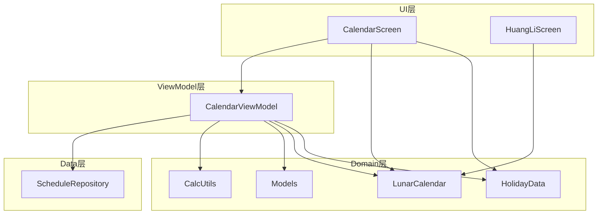

图表来源 
- [CalendarScreen.kt:229-687](file://app/src/main/java/com/schedulecalendar/app/ui/calendar/CalendarScreen.kt#L229-L687)
- [CalendarViewModel.kt:118-246](file://app/src/main/java/com/schedulecalendar/app/ui/calendar/CalendarViewModel.kt#L118-L246)
- [Models.kt:1-278](file://app/src/main/java/com/schedulecalendar/app/domain/model/Models.kt#L1-L278)
- [CalcUtils.kt:148-234](file://app/src/main/java/com/schedulecalendar/app/domain/model/CalcUtils.kt#L148-L234)
- [LunarCalendar.kt:13-67](file://app/src/main/java/com/schedulecalendar/app/domain/model/LunarCalendar.kt#L13-L67)
- [HolidayData.kt:171-175](file://app/src/main/java/com/schedulecalendar/app/domain/model/HolidayData.kt#L171-L175)
- [ScheduleRepository.kt:14-39](file://app/src/main/java/com/schedulecalendar/app/data/repository/ScheduleRepository.kt#L14-L39)

章节来源
- [CalendarScreen.kt:229-687](file://app/src/main/java/com/schedulecalendar/app/ui/calendar/CalendarScreen.kt#L229-L687)
- [CalendarViewModel.kt:118-246](file://app/src/main/java/com/schedulecalendar/app/ui/calendar/CalendarViewModel.kt#L118-L246)

## 核心组件
- CalendarScreen：日历主界面，包含顶部导航栏、星期标题行、日历网格区域、详情展示区、批量/复制/删除工具栏以及弹窗（滚轮日期选择器、复制月份对话框）。
- CalendarViewModel：集中管理日历状态（当前年月、选中日期、班次/记录/详情、批量/复制/删除模式、待办事项、有事件的日期集合），协调数据加载、事件处理与UI事件派发。
- LunarCalendar：公历与农历转换、黄历信息（宜忌、干支、时辰吉凶等）计算。
- HolidayData：法定节假日、调休补班、节气与传统节日数据及查询方法。
- Models：班次、排班记录、附加状态、薪资配置、考勤规则、显示方案等核心领域模型。
- CalcUtils：工时与薪资计算、时间归一化、周末判断、月统计与每日明细生成。
- ScheduleRepository：排班记录的CRUD与范围查询、Flow流式监听。

章节来源
- [CalendarScreen.kt:229-687](file://app/src/main/java/com/schedulecalendar/app/ui/calendar/CalendarScreen.kt#L229-L687)
- [CalendarViewModel.kt:118-246](file://app/src/main/java/com/schedulecalendar/app/ui/calendar/CalendarViewModel.kt#L118-L246)
- [LunarCalendar.kt:13-67](file://app/src/main/java/com/schedulecalendar/app/domain/model/LunarCalendar.kt#L13-L67)
- [HolidayData.kt:171-175](file://app/src/main/java/com/schedulecalendar/app/domain/model/HolidayData.kt#L171-L175)
- [Models.kt:51-101](file://app/src/main/java/com/schedulecalendar/app/domain/model/Models.kt#L51-L101)
- [CalcUtils.kt:148-234](file://app/src/main/java/com/schedulecalendar/app/domain/model/CalcUtils.kt#L148-L234)
- [ScheduleRepository.kt:14-39](file://app/src/main/java/com/schedulecalendar/app/data/repository/ScheduleRepository.kt#L14-L39)

## 架构总览
CalendarScreen 通过 hiltViewModel() 注入 CalendarViewModel，订阅其 state Flow 驱动重组；ViewModel 组合多个 Repository 与配置源，计算当月数据与相邻月份数据，供 HorizontalPager 平滑切换。日期网格由 renderDateGrid 构建，DayCell 负责单格渲染与交互；批量/复制/删除模式通过 Toolbar 暴露操作入口，状态在 ViewModel 中统一维护。

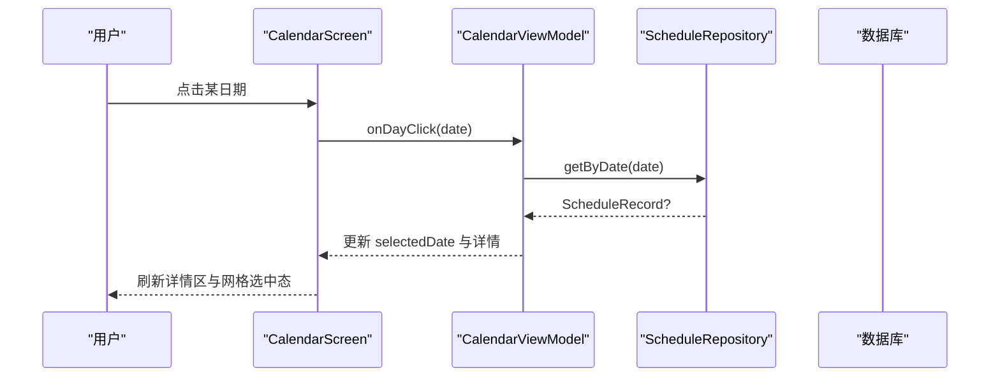

图表来源 
- [CalendarScreen.kt:202-218](file://app/src/main/java/com/schedulecalendar/app/ui/calendar/CalendarScreen.kt#L202-L218)
- [CalendarViewModel.kt:402-413](file://app/src/main/java/com/schedulecalendar/app/ui/calendar/CalendarViewModel.kt#L402-L413)
- [ScheduleRepository.kt:31](file://app/src/main/java/com/schedulecalendar/app/data/repository/ScheduleRepository.kt#L31)

章节来源
- [CalendarScreen.kt:229-687](file://app/src/main/java/com/schedulecalendar/app/ui/calendar/CalendarScreen.kt#L229-L687)
- [CalendarViewModel.kt:118-246](file://app/src/main/java/com/schedulecalendar/app/ui/calendar/CalendarViewModel.kt#L118-L246)

## 详细组件分析

### CalendarScreen 组件分析
- 顶部栏：显示年月与“今天”按钮，支持打开滚轮日期选择器；右侧编辑菜单提供“显示方案”“批量排班”“复制排班”“删除排班”。
- 星期标题行：固定于顶部，周末以红色高亮。
- 日历网格：renderDateGrid 计算当月/上月/下月填充天数，构造 DayCellData 列表，按行渲染；支持早退/迟到/备注角标、节假日/周末标识、事件指示点。
- 月份切换：HorizontalPager 配合 rememberPagerState 实现左右滑动切换，高度插值随行数变化；LaunchedEffect 同步 ViewModel 的 year/month 与 pager 位置。
- 详情区：DateDetailSection、SchedulePreviewSection、AnniversaryEventSection 在非批量模式下显示。
- 工具栏：BatchToolbar、CopyRangeToolbar 根据状态动态显示，提供批量应用、全选/清空、复制执行等操作。
- 弹窗：WheelDatePickerDialog 用于选择年月；CopyMonthDialog 用于整月复制。

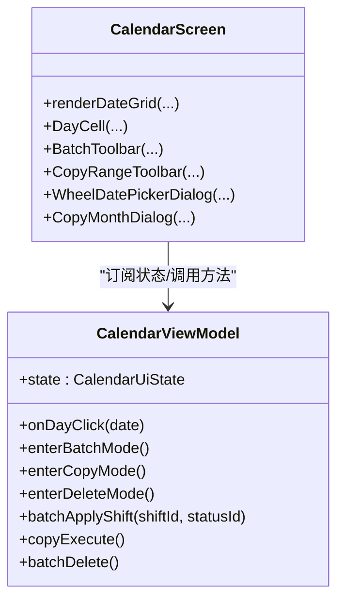

图表来源 
- [CalendarScreen.kt:92-225](file://app/src/main/java/com/schedulecalendar/app/ui/calendar/CalendarScreen.kt#L92-L225)
- [CalendarScreen.kt:229-687](file://app/src/main/java/com/schedulecalendar/app/ui/calendar/CalendarScreen.kt#L229-L687)
- [CalendarViewModel.kt:696-800](file://app/src/main/java/com/schedulecalendar/app/ui/calendar/CalendarViewModel.kt#L696-L800)

章节来源
- [CalendarScreen.kt:92-225](file://app/src/main/java/com/schedulecalendar/app/ui/calendar/CalendarScreen.kt#L92-L225)
- [CalendarScreen.kt:229-687](file://app/src/main/java/com/schedulecalendar/app/ui/calendar/CalendarScreen.kt#L229-L687)

### 日期网格渲染与 DayCell
- 网格计算：基于 YearMonth 获取当月天数与首周偏移，拼接上月/下月填充日，形成 totalRows*7 的单元格矩阵。
- 数据绑定：从 state.schedules、state.allShifts、state.dayDetails 映射到 DayCellData，含 isToday、isHoliday、isWeekend、selected、hasCalendarEvent 等属性。
- 交互：点击进入选中或批量/复制模式；长按跳转详情页；早退/迟到/备注以迷你角标显示。
- 视觉：根据选中/今天/节假日/周末/班次颜色设置背景与文字色；农历文本通过 LunarCalendar.getLunarDayText 获取。

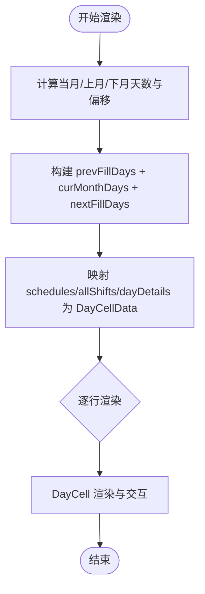

图表来源 
- [CalendarScreen.kt:92-225](file://app/src/main/java/com/schedulecalendar/app/ui/calendar/CalendarScreen.kt#L92-L225)
- [CalendarScreen.kt:719-800](file://app/src/main/java/com/schedulecalendar/app/ui/calendar/CalendarScreen.kt#L719-L800)

章节来源
- [CalendarScreen.kt:92-225](file://app/src/main/java/com/schedulecalendar/app/ui/calendar/CalendarScreen.kt#L92-L225)
- [CalendarScreen.kt:719-800](file://app/src/main/java/com/schedulecalendar/app/ui/calendar/CalendarScreen.kt#L719-L800)

### 月份切换动画与 Pager 同步
- 使用 HorizontalPager 与 rememberPagerState，初始页设为中间值（如500），通过 offsetFraction 计算当前页与下一页的行数差，进行高度插值，使切换过程高度平滑过渡。
- LaunchedEffect(state.year, state.month) 将 ViewModel 的年月变更同步至 pager 页面；pager 稳定后回调 updateDisplayMonth 轻量更新显示。

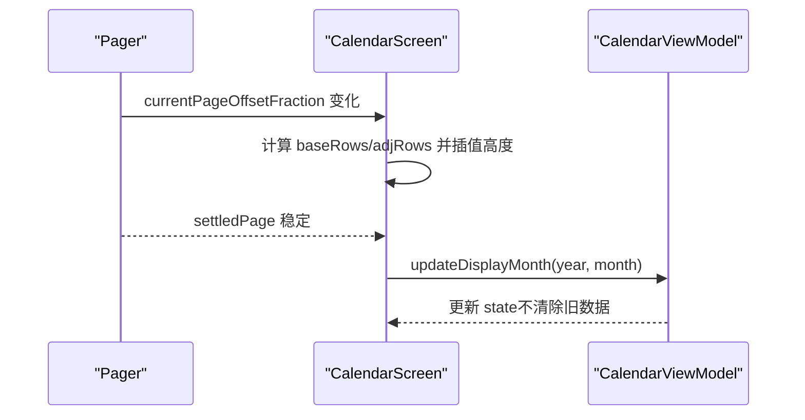

图表来源 
- [CalendarScreen.kt:490-528](file://app/src/main/java/com/schedulecalendar/app/ui/calendar/CalendarScreen.kt#L490-L528)
- [CalendarViewModel.kt:361-365](file://app/src/main/java/com/schedulecalendar/app/ui/calendar/CalendarViewModel.kt#L361-L365)

章节来源
- [CalendarScreen.kt:490-528](file://app/src/main/java/com/schedulecalendar/app/ui/calendar/CalendarScreen.kt#L490-L528)
- [CalendarViewModel.kt:361-365](file://app/src/main/java/com/schedulecalendar/app/ui/calendar/CalendarViewModel.kt#L361-L365)

### 批量操作模式（批量排班、复制排班、删除排班）
- 批量排班：进入模式后，点击日期多选，底部 BatchToolbar 提供选择班次与状态、应用、全选/清空、退出。
- 复制排班：两阶段流程——阶段1选择源日期集合（连续区间），阶段2选择目标起始日期，确认后批量复制。
- 删除排班：进入模式后多选日期，底部工具栏确认删除。

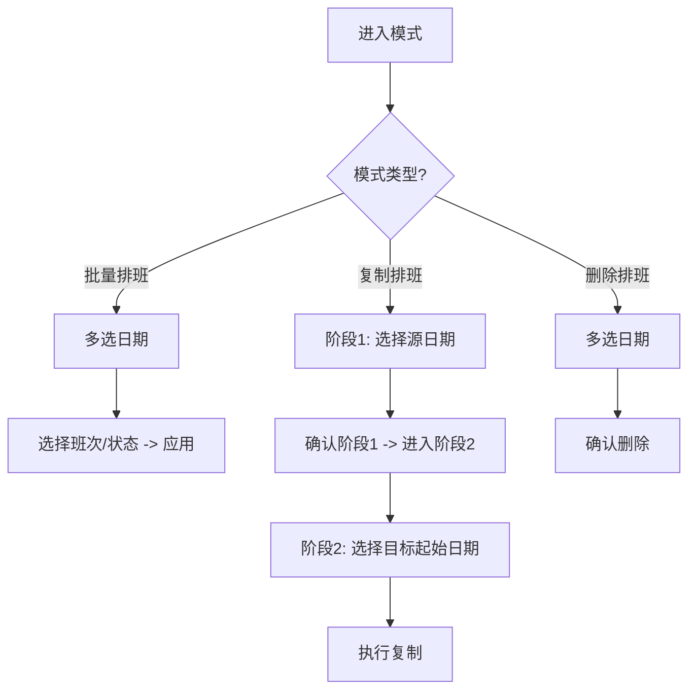

图表来源 
- [CalendarViewModel.kt:696-800](file://app/src/main/java/com/schedulecalendar/app/ui/calendar/CalendarViewModel.kt#L696-L800)
- [CalendarScreen.kt:557-602](file://app/src/main/java/com/schedulecalendar/app/ui/calendar/CalendarScreen.kt#L557-L602)

章节来源
- [CalendarViewModel.kt:696-800](file://app/src/main/java/com/schedulecalendar/app/ui/calendar/CalendarViewModel.kt#L696-L800)
- [CalendarScreen.kt:557-602](file://app/src/main/java/com/schedulecalendar/app/ui/calendar/CalendarScreen.kt#L557-L602)

### 日历数据绑定与日期选择逻辑
- 数据收集：loadCurrentMonth 使用 combine 监听 shiftRepo.observeAll、scheduleRepo.observeByRange、prefs.displaySchemesFlow、prefs.scheduleRuleFlow，合并后计算 dayDetails（当前月+相邻月），更新 state。
- 日期选择：onDayClick 区分模式（批量/复制/删除 vs 普通），普通模式仅更新 selectedDate 并加载纪念日与日程事件。
- 事件联动：uiEvent Channel 派发 NavigateToDetail、ShowMessage、ShowError，由 Screen 消费并导航或提示。

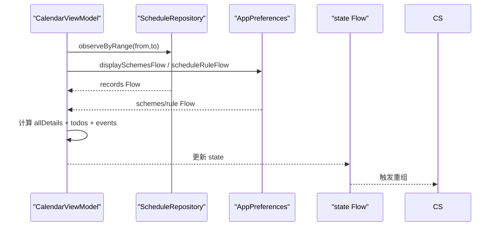

图表来源 
- [CalendarViewModel.kt:153-246](file://app/src/main/java/com/schedulecalendar/app/ui/calendar/CalendarViewModel.kt#L153-L246)
- [CalendarScreen.kt:294-302](file://app/src/main/java/com/schedulecalendar/app/ui/calendar/CalendarScreen.kt#L294-L302)

章节来源
- [CalendarViewModel.kt:153-246](file://app/src/main/java/com/schedulecalendar/app/ui/calendar/CalendarViewModel.kt#L153-L246)
- [CalendarScreen.kt:294-302](file://app/src/main/java/com/schedulecalendar/app/ui/calendar/CalendarScreen.kt#L294-L302)

### 节假日识别与农历显示
- 节假日识别：HolidayData.isLegalHoliday/isTransferWorkday/isMakeupDay/getHolidayName 提供法定假日、调休补班、名称查询。
- 农历显示：LunarCalendar.getLunarDayText 返回“初一/初二...”或“正月/二月...”，DayCell 中用于无障碍描述与显示。
- 黄历详情：HuangLiScreen 展示完整黄历信息（宜忌、干支、时辰吉凶等）。

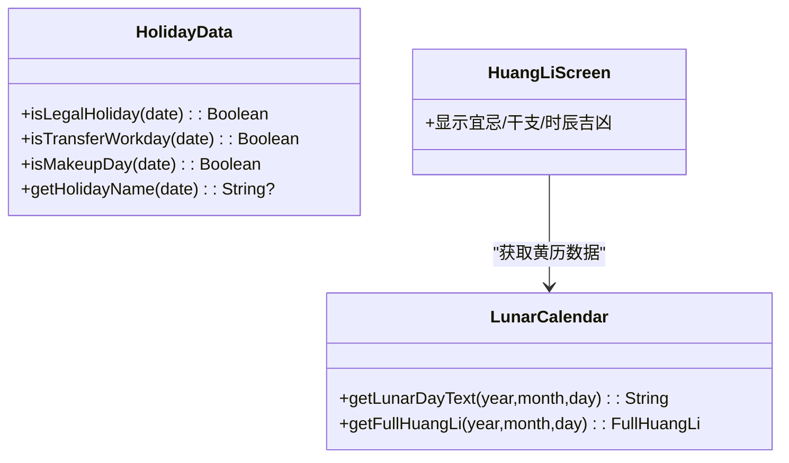

图表来源 
- [HolidayData.kt:171-175](file://app/src/main/java/com/schedulecalendar/app/domain/model/HolidayData.kt#L171-L175)
- [LunarCalendar.kt:69-72](file://app/src/main/java/com/schedulecalendar/app/domain/model/LunarCalendar.kt#L69-L72)
- [HuangLiScreen.kt:33-44](file://app/src/main/java/com/schedulecalendar/app/ui/calendar/HuangLiScreen.kt#L33-L44)

章节来源
- [HolidayData.kt:171-175](file://app/src/main/java/com/schedulecalendar/app/domain/model/HolidayData.kt#L171-L175)
- [LunarCalendar.kt:69-72](file://app/src/main/java/com/schedulecalendar/app/domain/model/LunarCalendar.kt#L69-L72)
- [HuangLiScreen.kt:33-44](file://app/src/main/java/com/schedulecalendar/app/ui/calendar/HuangLiScreen.kt#L33-L44)

### 高级操作实现细节（批量排班、复制排班、删除排班）
- 批量排班：batchApplyShift 对选中日期集合批量写入 shiftId、appliedStatus、extraItemIds（自动合并关联项目），成功后退出模式并提示。
- 复制排班：enterCopyMode/copyEnterPhase2/copyBackToPhase1/copyExecute 分阶段管理源日期集合与目标起始日期，执行时复制源记录的 shiftId 与状态到目标日期。
- 删除排班：batchDelete 遍历选中日期逐一删除，完成后退出模式并刷新。

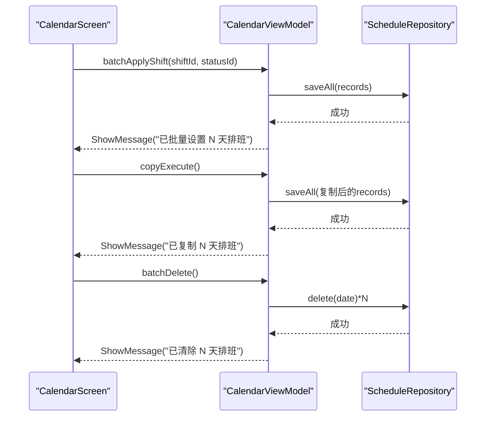

图表来源 
- [CalendarViewModel.kt:729-757](file://app/src/main/java/com/schedulecalendar/app/ui/calendar/CalendarViewModel.kt#L729-L757)
- [CalendarViewModel.kt:791-800](file://app/src/main/java/com/schedulecalendar/app/ui/calendar/CalendarViewModel.kt#L791-L800)
- [ScheduleRepository.kt:32-36](file://app/src/main/java/com/schedulecalendar/app/data/repository/ScheduleRepository.kt#L32-L36)

章节来源
- [CalendarViewModel.kt:729-757](file://app/src/main/java/com/schedulecalendar/app/ui/calendar/CalendarViewModel.kt#L729-L757)
- [CalendarViewModel.kt:791-800](file://app/src/main/java/com/schedulecalendar/app/ui/calendar/CalendarViewModel.kt#L791-L800)
- [ScheduleRepository.kt:32-36](file://app/src/main/java/com/schedulecalendar/app/data/repository/ScheduleRepository.kt#L32-L36)

## 依赖关系分析
- CalendarScreen 依赖 CalendarViewModel 提供的 state 与 uiEvent，不直接访问数据层。
- CalendarViewModel 依赖多个 Repository（shift、schedule、break、extra、status）与 AppPreferences，组合数据并计算 dayDetails、todos、datesWithEvents。
- Domain 层 CalcUtils 与 Models 被 ViewModel 与 UI 共同使用，确保计算与展示一致。
- LunarCalendar 与 HolidayData 提供农历与节假日数据，被 UI 与 ViewModel 使用。

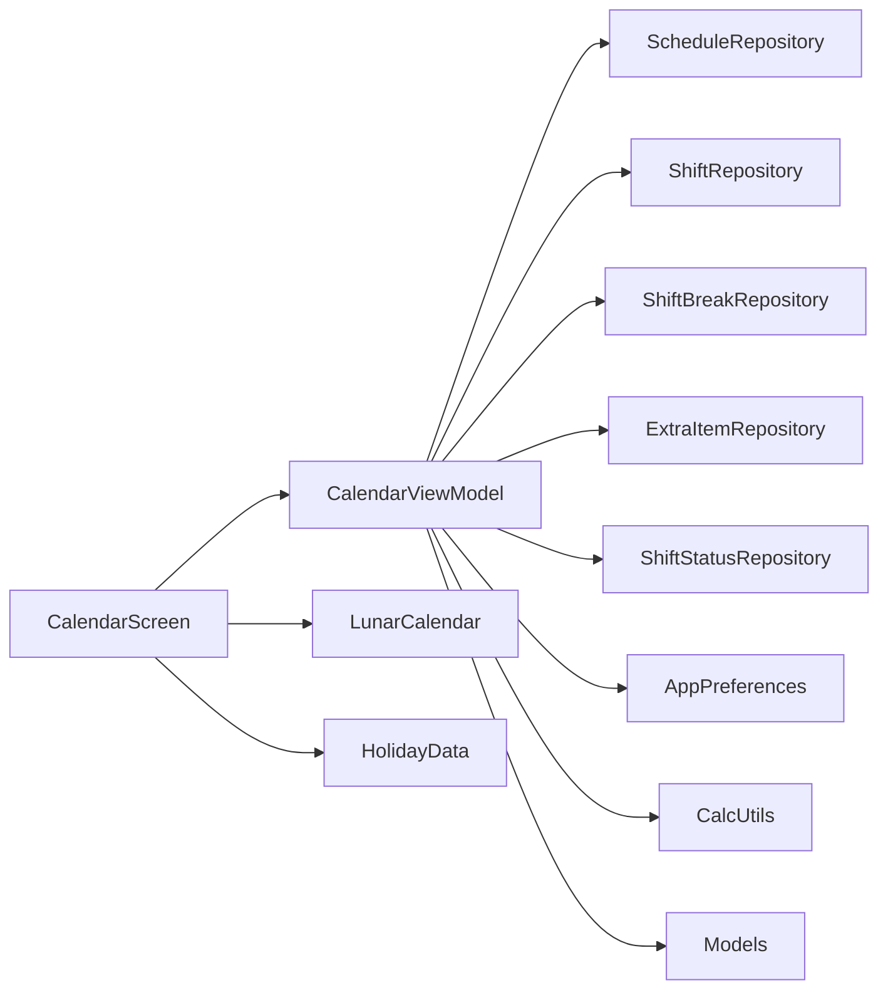

图表来源 
- [CalendarScreen.kt:229-687](file://app/src/main/java/com/schedulecalendar/app/ui/calendar/CalendarScreen.kt#L229-L687)
- [CalendarViewModel.kt:118-246](file://app/src/main/java/com/schedulecalendar/app/ui/calendar/CalendarViewModel.kt#L118-L246)

章节来源
- [CalendarScreen.kt:229-687](file://app/src/main/java/com/schedulecalendar/app/ui/calendar/CalendarScreen.kt#L229-L687)
- [CalendarViewModel.kt:118-246](file://app/src/main/java/com/schedulecalendar/app/ui/calendar/CalendarViewModel.kt#L118-L246)

## 性能考量
- 数据加载优化：loadCurrentMonth 使用 combine 一次性监听多源，避免多次请求；切换月份不清除旧数据，减少闪烁。
- 分页与高度插值：HorizontalPager 结合页数与行数插值，提升滑动体验；settledPage 回调轻量更新显示，避免频繁重算。
- 流式更新：Repository 的 Flow 与 SharedFlow 保证写操作后及时通知 UI，避免手动刷新。
- 计算复杂度：dayDetails 计算为 O(N)，N 为当月+相邻月天数；批量操作为 O(M)，M 为选中日期数量。

[本节为通用指导，无需特定文件引用]

## 故障排查指南
- 打卡跨午夜问题：clockOut/fillMissedClock 中对下班打卡时间早于班次结束时间的情况做前一天归属修正，避免错误归属。
- 加班确认与忽略：confirmEarlyOvertime/ignoreEarlyArrival 等方法需与 UI 状态一致，撤销方法对应恢复标志位。
- 事件加载异常：loadSelectedDateEvents/loadDatesWithEvents 捕获异常并回退为空集合，避免崩溃。
- Widget 同步：syncWidget/syncCalendarWidget 在数据变更后同步桌面小组件，若显示异常检查同步逻辑。

章节来源
- [CalendarViewModel.kt:475-502](file://app/src/main/java/com/schedulecalendar/app/ui/calendar/CalendarViewModel.kt#L475-L502)
- [CalendarViewModel.kt:505-559](file://app/src/main/java/com/schedulecalendar/app/ui/calendar/CalendarViewModel.kt#L505-L559)
- [CalendarViewModel.kt:416-473](file://app/src/main/java/com/schedulecalendar/app/ui/calendar/CalendarViewModel.kt#L416-L473)

## 结论
CalendarScreen 与 CalendarViewModel 构成了日历管理系统的核心，实现了高效的日期网格渲染、平滑的月份切换动画、完善的批量操作模式与丰富的节假日/农历显示。通过清晰的 MVVM 分层与流式数据同步，系统在可维护性与用户体验上达到良好平衡。开发者可基于现有架构扩展更多显示方案、自定义工具栏与高级排班策略。

[本节为总结性内容，无需特定文件引用]

## 附录：关键流程图与序列图

### 日期选择与详情加载序列图
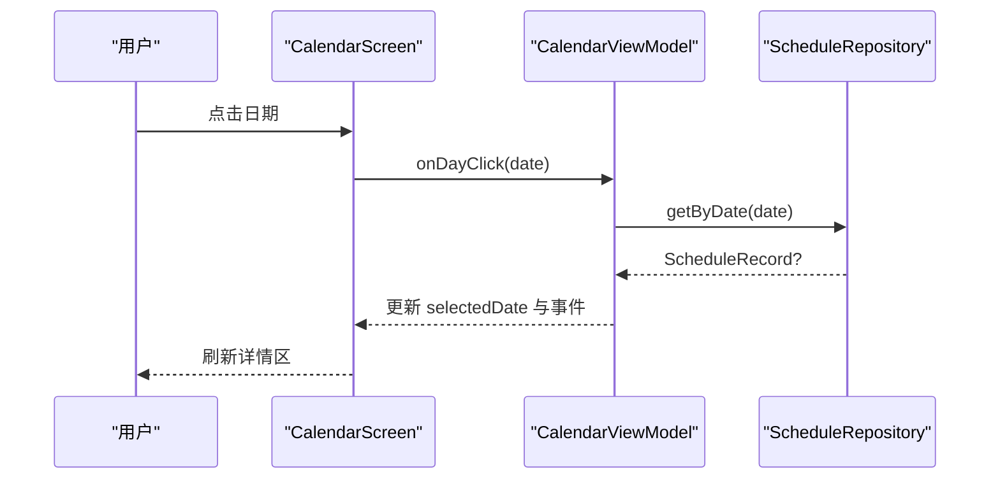

图表来源 
- [CalendarScreen.kt:202-218](file://app/src/main/java/com/schedulecalendar/app/ui/calendar/CalendarScreen.kt#L202-L218)
- [CalendarViewModel.kt:402-413](file://app/src/main/java/com/schedulecalendar/app/ui/calendar/CalendarViewModel.kt#L402-L413)
- [ScheduleRepository.kt:31](file://app/src/main/java/com/schedulecalendar/app/data/repository/ScheduleRepository.kt#L31)

### 批量排班操作流程
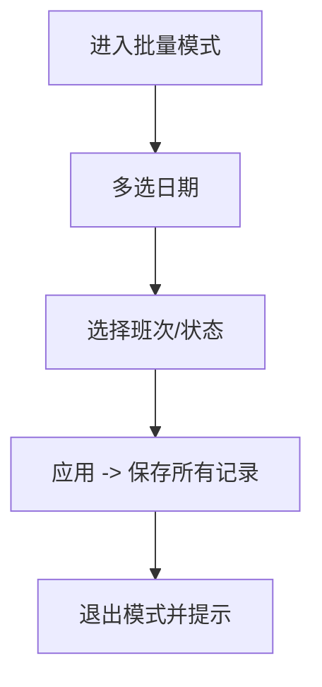

图表来源 
- [CalendarViewModel.kt:729-748](file://app/src/main/java/com/schedulecalendar/app/ui/calendar/CalendarViewModel.kt#L729-L748)

### 复制排班两阶段流程
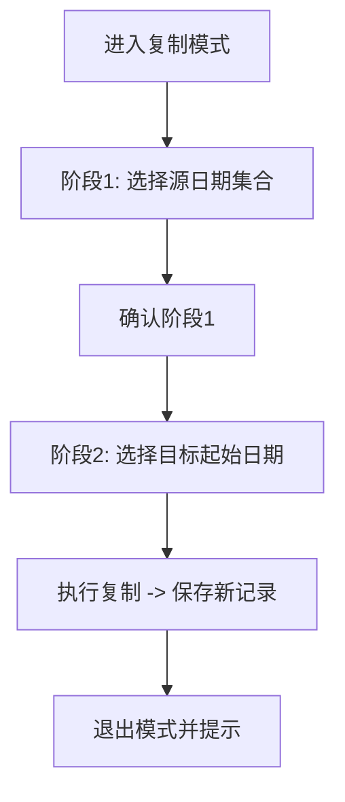

图表来源 
- [CalendarViewModel.kt:791-800](file://app/src/main/java/com/schedulecalendar/app/ui/calendar/CalendarViewModel.kt#L791-L800)