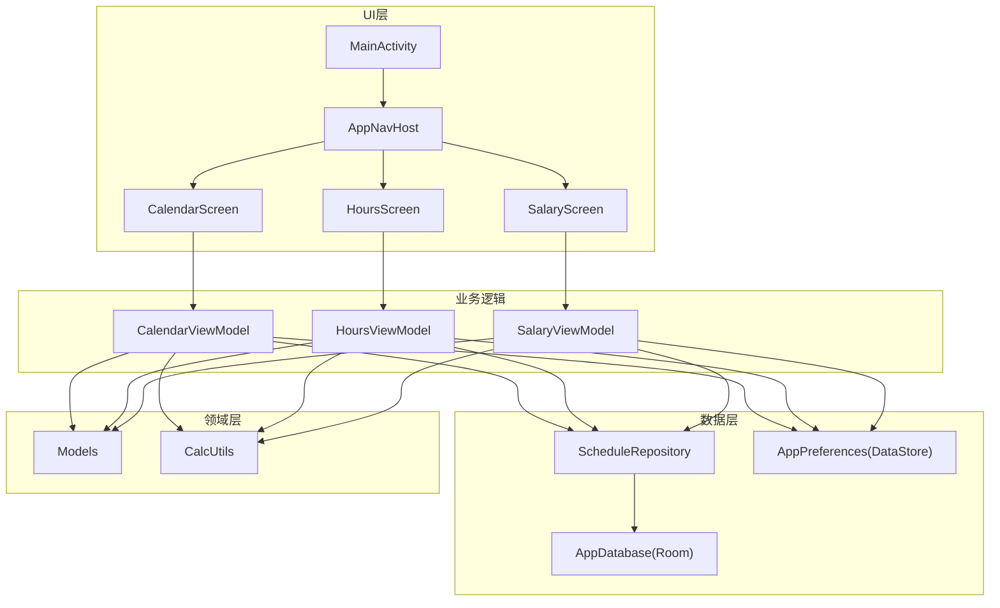
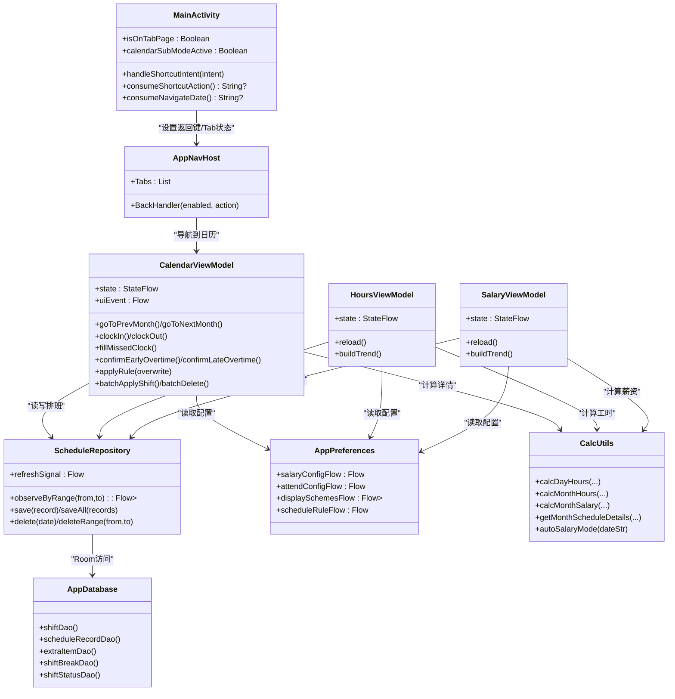
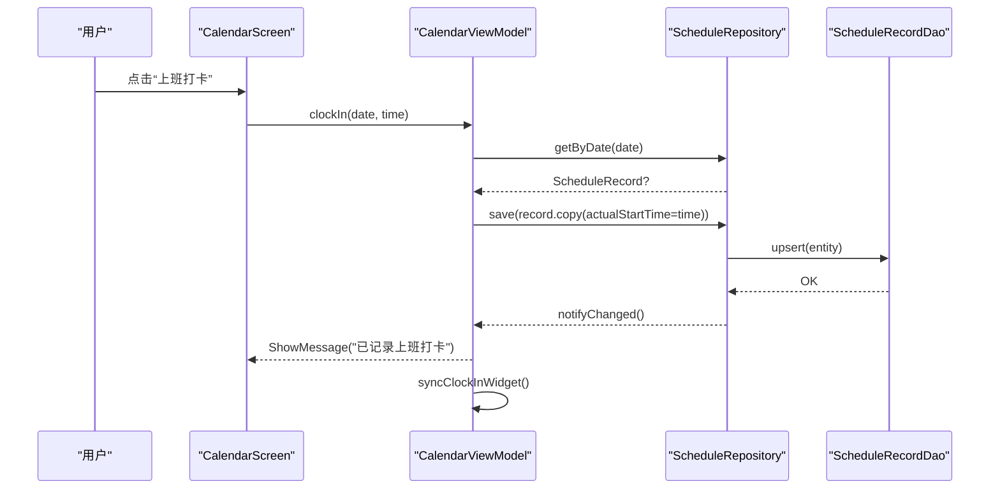
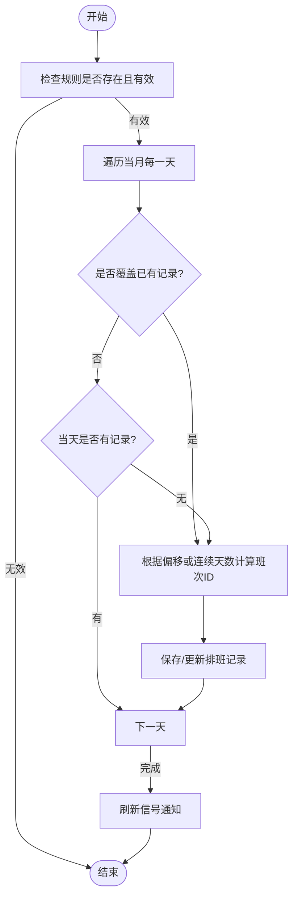
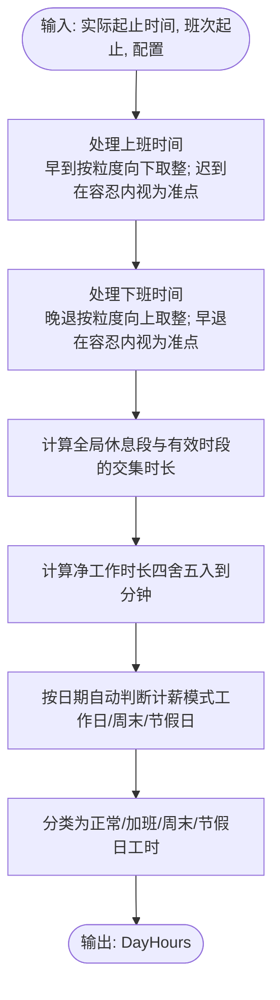
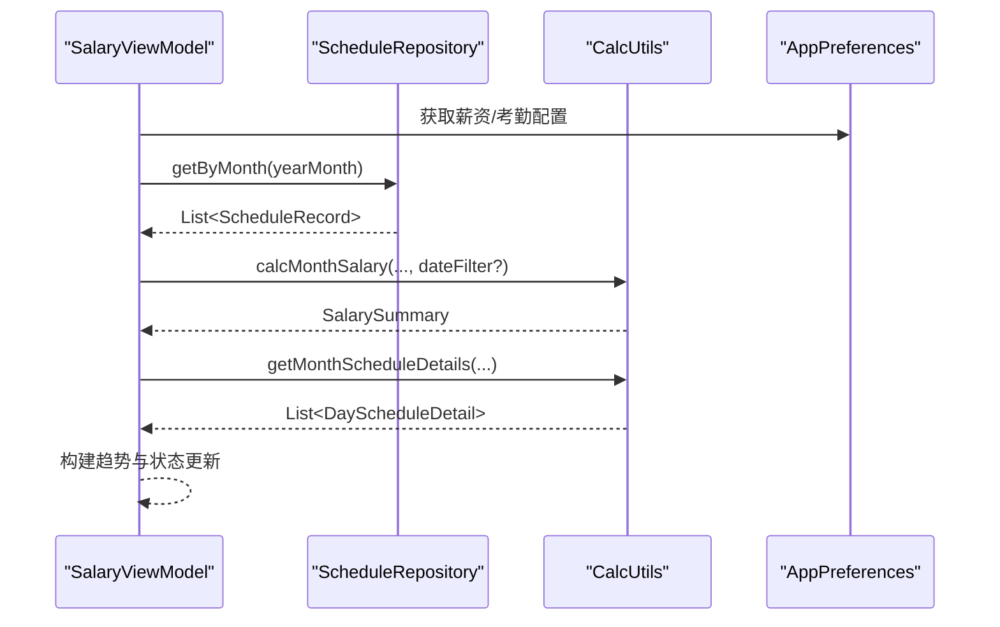
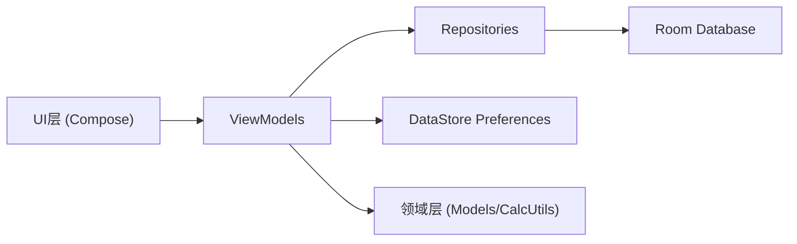

# 核心功能模块

<cite>
**本文引用的文件**   
- [MainActivity.kt](file://app/src/main/java/com/schedulecalendar/app/MainActivity.kt)
- [ScheduleApp.kt](file://app/src/main/java/com/schedulecalendar/app/ScheduleApp.kt)
- [AppDatabase.kt](file://app/src/main/java/com/schedulecalendar/app/data/db/AppDatabase.kt)
- [ScheduleRecordEntity.kt](file://app/src/main/java/com/schedulecalendar/app/data/db/entity/ScheduleRecordEntity.kt)
- [ScheduleRecordDao.kt](file://app/src/main/java/com/schedulecalendar/app/data/db/dao/ScheduleRecordDao.kt)
- [ScheduleRepository.kt](file://app/src/main/java/com/schedulecalendar/app/data/repository/ScheduleRepository.kt)
- [Models.kt](file://app/src/main/java/com/schedulecalendar/app/domain/model/Models.kt)
- [CalcUtils.kt](file://app/src/main/java/com/schedulecalendar/app/domain/model/CalcUtils.kt)
- [AppNavHost.kt](file://app/src/main/java/com/schedulecalendar/app/ui/navigation/AppNavHost.kt)
- [Screen.kt](file://app/src/main/java/com/schedulecalendar/app/ui/navigation/Screen.kt)
- [CalendarViewModel.kt](file://app/src/main/java/com/schedulecalendar/app/ui/calendar/CalendarViewModel.kt)
- [CalendarScreen.kt](file://app/src/main/java/com/schedulecalendar/app/ui/calendar/CalendarScreen.kt)
- [HoursViewModel.kt](file://app/src/main/java/com/schedulecalendar/app/ui/hours/HoursViewModel.kt)
- [SalaryViewModel.kt](file://app/src/main/java/com/schedulecalendar/app/ui/salary/SalaryViewModel.kt)
- [AppPreferences.kt](file://app/src/main/java/com/schedulecalendar/app/data/prefs/AppPreferences.kt)
</cite>

## 目录
1. [简介](#简介)
2. [项目结构](#项目结构)
3. [核心组件](#核心组件)
4. [架构总览](#架构总览)
5. [详细组件分析](#详细组件分析)
6. [依赖关系分析](#依赖关系分析)
7. [性能考量](#性能考量)
8. [故障排查指南](#故障排查指南)
9. [结论](#结论)
10. [附录](#附录)

## 简介
本文件面向Android排班日历应用的核心功能模块，系统性梳理并说明以下四大模块的职责边界、接口定义与交互关系：
- 日历管理系统：负责月视图展示、日期选择、事件指示点、批量操作（复制/删除）、打卡补录与加班确认等。
- 排班管理系统：负责班次与附加状态的定义、排序、归档、循环规则应用与批量设置。
- 考勤打卡系统：负责上下班打卡记录、跨午夜修正、迟到早退容忍与加班粒度处理、待办中心生成。
- 薪资计算引擎：基于工时分类（正常/加班/周末/节假日）与补贴扣款，输出日明细与月度汇总、趋势图。

文档同时覆盖用户界面设计、交互流程与状态管理，并提供具体使用场景与操作流程，帮助开发者快速理解需求与实现方案。

## 项目结构
应用采用分层架构：UI层（Compose + Navigation）→ ViewModel → Repository → DAO/Room → DataStore偏好配置；领域层提供统一计算工具与数据模型。

图表来源
- [AppNavHost.kt:57-172](file://app/src/main/java/com/schedulecalendar/app/ui/navigation/AppNavHost.kt#L57-L172)
- [CalendarScreen.kt:92-200](file://app/src/main/java/com/schedulecalendar/app/ui/calendar/CalendarScreen.kt#L92-L200)
- [ScheduleRepository.kt:13-39](file://app/src/main/java/com/schedulecalendar/app/data/repository/ScheduleRepository.kt#L13-L39)
- [AppDatabase.kt:17-34](file://app/src/main/java/com/schedulecalendar/app/data/db/AppDatabase.kt#L17-L34)
- [AppPreferences.kt:25-66](file://app/src/main/java/com/schedulecalendar/app/data/prefs/AppPreferences.kt#L25-L66)
- [Models.kt:82-122](file://app/src/main/java/com/schedulecalendar/app/domain/model/Models.kt#L82-L122)
- [CalcUtils.kt:16-50](file://app/src/main/java/com/schedulecalendar/app/domain/model/CalcUtils.kt#L16-L50)

章节来源
- [AppNavHost.kt:57-172](file://app/src/main/java/com/schedulecalendar/app/ui/navigation/AppNavHost.kt#L57-L172)
- [Screen.kt:7-34](file://app/src/main/java/com/schedulecalendar/app/ui/navigation/Screen.kt#L7-L34)
- [AppDatabase.kt:17-34](file://app/src/main/java/com/schedulecalendar/app/data/db/AppDatabase.kt#L17-L34)

## 核心组件
- 入口与导航
  - MainActivity：权限申请、返回键拦截、快捷方式动作处理、通知Tab页状态。
  - AppNavHost：底部Tab导航、子页面路由、BackHandler兜底退出。
- 数据持久化
  - AppDatabase：Room数据库声明与DAO暴露。
  - ScheduleRecordEntity/Dao：排班记录的CRUD与Flow监听。
  - AppPreferences：DataStore存储薪资/考勤/显示方案/排序/提醒等配置。
- 业务与UI
  - CalendarViewModel：日历状态、月份切换、打卡/补录/加班确认、批量/复制/删除、事件加载、Widget同步。
  - HoursViewModel：工时统计、趋势、近14天明细。
  - SalaryViewModel：薪资统计、趋势、预计与实际区分。
- 领域计算
  - Models：班次、状态、排班记录、薪资配置、考勤配置、显示方案等数据模型。
  - CalcUtils：工时分类、考勤粒度、休息段扣减、月度汇总与每日明细、自动计薪模式判断。

章节来源
- [MainActivity.kt:34-262](file://app/src/main/java/com/schedulecalendar/app/MainActivity.kt#L34-L262)
- [AppNavHost.kt:57-172](file://app/src/main/java/com/schedulecalendar/app/ui/navigation/AppNavHost.kt#L57-L172)
- [AppDatabase.kt:17-34](file://app/src/main/java/com/schedulecalendar/app/data/db/AppDatabase.kt#L17-L34)
- [ScheduleRecordEntity.kt:8-26](file://app/src/main/java/com/schedulecalendar/app/data/db/entity/ScheduleRecordEntity.kt#L8-L26)
- [ScheduleRecordDao.kt:8-39](file://app/src/main/java/com/schedulecalendar/app/data/db/dao/ScheduleRecordDao.kt#L8-L39)
- [ScheduleRepository.kt:13-39](file://app/src/main/java/com/schedulecalendar/app/data/repository/ScheduleRepository.kt#L13-L39)
- [AppPreferences.kt:25-66](file://app/src/main/java/com/schedulecalendar/app/data/prefs/AppPreferences.kt#L25-L66)
- [Models.kt:82-122](file://app/src/main/java/com/schedulecalendar/app/domain/model/Models.kt#L82-L122)
- [CalcUtils.kt:149-234](file://app/src/main/java/com/schedulecalendar/app/domain/model/CalcUtils.kt#L149-L234)

## 架构总览
应用遵循MVVM+Repository模式，UI通过ViewModel订阅Flow与StateFlow，Repository封装数据源（Room/DataStore），领域层CalcUtils提供纯函数计算，保证可测试性与一致性。

图表来源
- [MainActivity.kt:34-262](file://app/src/main/java/com/schedulecalendar/app/MainActivity.kt#L34-L262)
- [AppNavHost.kt:57-172](file://app/src/main/java/com/schedulecalendar/app/ui/navigation/AppNavHost.kt#L57-L172)
- [CalendarViewModel.kt:118-151](file://app/src/main/java/com/schedulecalendar/app/ui/calendar/CalendarViewModel.kt#L118-L151)
- [HoursViewModel.kt:52-75](file://app/src/main/java/com/schedulecalendar/app/ui/hours/HoursViewModel.kt#L52-L75)
- [SalaryViewModel.kt:48-70](file://app/src/main/java/com/schedulecalendar/app/ui/salary/SalaryViewModel.kt#L48-L70)
- [ScheduleRepository.kt:13-39](file://app/src/main/java/com/schedulecalendar/app/data/repository/ScheduleRepository.kt#L13-L39)
- [AppDatabase.kt:17-34](file://app/src/main/java/com/schedulecalendar/app/data/db/AppDatabase.kt#L17-L34)
- [AppPreferences.kt:68-103](file://app/src/main/java/com/schedulecalendar/app/data/prefs/AppPreferences.kt#L68-L103)
- [CalcUtils.kt:149-234](file://app/src/main/java/com/schedulecalendar/app/domain/model/CalcUtils.kt#L149-L234)

## 详细组件分析

### 日历管理系统
职责边界
- 展示当月/相邻月份的日历网格，支持滑动联动与选中日期。
- 集成日程/纪念日事件指示点。
- 提供批量操作（全选/多选/复制/删除）、打卡补录、加班确认/忽略。
- 与Widget同步显示打卡状态。

关键交互流程（打卡与补录）

图表来源
- [CalendarViewModel.kt:475-502](file://app/src/main/java/com/schedulecalendar/app/ui/calendar/CalendarViewModel.kt#L475-L502)
- [ScheduleRepository.kt:31-36](file://app/src/main/java/com/schedulecalendar/app/data/repository/ScheduleRepository.kt#L31-L36)
- [ScheduleRecordDao.kt:22-26](file://app/src/main/java/com/schedulecalendar/app/data/db/dao/ScheduleRecordDao.kt#L22-L26)

状态管理
- CalendarUiState集中管理月份、班次/状态列表、排班映射、显示方案、待办、批量/复制/删除模式、事件集合等。
- 通过StateFlow驱动UI重组，Channel传递一次性UI事件。

章节来源
- [CalendarViewModel.kt:64-108](file://app/src/main/java/com/schedulecalendar/app/ui/calendar/CalendarViewModel.kt#L64-L108)
- [CalendarScreen.kt:92-200](file://app/src/main/java/com/schedulecalendar/app/ui/calendar/CalendarScreen.kt#L92-L200)

### 排班管理系统
职责边界
- 班次与附加状态的增删改查、排序、归档。
- 循环规则应用（独立循环/连续循环）。
- 批量设置班次与附加状态，合并默认关联的补贴/扣款项目。

数据处理流程（循环规则应用）

图表来源
- [CalendarViewModel.kt:645-694](file://app/src/main/java/com/schedulecalendar/app/ui/calendar/CalendarViewModel.kt#L645-L694)

章节来源
- [Models.kt:190-195](file://app/src/main/java/com/schedulecalendar/app/domain/model/Models.kt#L190-L195)
- [CalendarViewModel.kt:645-694](file://app/src/main/java/com/schedulecalendar/app/ui/calendar/CalendarViewModel.kt#L645-L694)

### 考勤打卡系统
职责边界
- 上下班打卡写入，跨午夜修正（下班时间早于班次结束归属前一天）。
- 迟到/早退容忍与加班粒度取整。
- 生成待办中心条目（漏打卡、已补录、加班待确认/已确认/忽略）。

算法流程图（考勤粒度与休息段扣减）

图表来源
- [CalcUtils.kt:61-113](file://app/src/main/java/com/schedulecalendar/app/domain/model/CalcUtils.kt#L61-L113)
- [CalcUtils.kt:149-234](file://app/src/main/java/com/schedulecalendar/app/domain/model/CalcUtils.kt#L149-L234)

章节来源
- [CalendarViewModel.kt:475-502](file://app/src/main/java/com/schedulecalendar/app/ui/calendar/CalendarViewModel.kt#L475-L502)
- [CalcUtils.kt:61-113](file://app/src/main/java/com/schedulecalendar/app/domain/model/CalcUtils.kt#L61-L113)

### 薪资计算引擎
职责边界
- 基于工时分类与补贴扣款计算月度薪资，区分实际与预计。
- 生成每日明细（含当日收入、正班/加班收入、补贴扣款合计）。
- 计算近8个月薪资趋势。

数据流（月薪计算）

图表来源
- [SalaryViewModel.kt:74-144](file://app/src/main/java/com/schedulecalendar/app/ui/salary/SalaryViewModel.kt#L74-L144)
- [CalcUtils.kt:365-444](file://app/src/main/java/com/schedulecalendar/app/domain/model/CalcUtils.kt#L365-L444)
- [CalcUtils.kt:448-486](file://app/src/main/java/com/schedulecalendar/app/domain/model/CalcUtils.kt#L448-L486)

章节来源
- [SalaryViewModel.kt:74-144](file://app/src/main/java/com/schedulecalendar/app/ui/salary/SalaryViewModel.kt#L74-L144)
- [CalcUtils.kt:365-444](file://app/src/main/java/com/schedulecalendar/app/domain/model/CalcUtils.kt#L365-L444)

### 用户界面设计与交互
- 主界面：底部Tab（日历/事项/统计/班次/设置），当前Tab状态由AppNavHost通知MainActivity，用于返回键行为控制。
- 日历网格：支持跨月填充、事件指示点、批量/复制/删除模式、选中高亮。
- 返回键策略：API 34+使用Overlay回调优先，否则回退至OnBackPressedDispatcher兜底。

章节来源
- [AppNavHost.kt:57-172](file://app/src/main/java/com/schedulecalendar/app/ui/navigation/AppNavHost.kt#L57-L172)
- [MainActivity.kt:81-157](file://app/src/main/java/com/schedulecalendar/app/MainActivity.kt#L81-L157)
- [CalendarScreen.kt:92-200](file://app/src/main/java/com/schedulecalendar/app/ui/calendar/CalendarScreen.kt#L92-L200)

## 依赖关系分析
- UI层依赖ViewModel，ViewModel依赖Repository与Preferences，Repository依赖Room DAO。
- 领域层CalcUtils被多个ViewModel复用，确保计算一致性。
- DataStore提供配置流，避免频繁IO阻塞。

图表来源
- [AppNavHost.kt:57-172](file://app/src/main/java/com/schedulecalendar/app/ui/navigation/AppNavHost.kt#L57-L172)
- [ScheduleRepository.kt:13-39](file://app/src/main/java/com/schedulecalendar/app/data/repository/ScheduleRepository.kt#L13-L39)
- [AppPreferences.kt:68-103](file://app/src/main/java/com/schedulecalendar/app/data/prefs/AppPreferences.kt#L68-L103)
- [CalcUtils.kt:149-234](file://app/src/main/java/com/schedulecalendar/app/domain/model/CalcUtils.kt#L149-L234)

章节来源
- [ScheduleRepository.kt:13-39](file://app/src/main/java/com/schedulecalendar/app/data/repository/ScheduleRepository.kt#L13-L39)
- [AppPreferences.kt:68-103](file://app/src/main/java/com/schedulecalendar/app/data/prefs/AppPreferences.kt#L68-L103)

## 性能考量
- Flow组合与取消：CalendarViewModel在切月时取消旧Job，防止收集器累积泄漏。
- 懒加载与首次loading：仅在首次加载details为空时显示loading，后续刷新保持现有内容。
- 数据范围优化：日历网格加载相邻月份完整数据，减少滑动时的重复请求。
- 原子写操作：Repository在写后发出refreshSignal，避免UI多次轮询。

[本节为通用指导，不直接分析具体文件]

## 故障排查指南
常见问题与定位
- 返回键未生效：检查MainActivity的OnBackPressedCallback与API 34+ Overlay回调注册顺序；确认isOnTabPage与calendarSubModeActive状态。
- 打卡记录错乱：核对跨午夜修正逻辑（下班时间早于班次结束归属前一天）；检查AppliedStatus时间段约束。
- 薪资计算异常：确认自动计薪模式（周末/节假日）与考勤粒度配置；检查全局休息段重叠扣减。
- 数据不同步：检查Repository.refreshSignal是否触发；确认Flow订阅未被取消。

章节来源
- [MainActivity.kt:81-157](file://app/src/main/java/com/schedulecalendar/app/MainActivity.kt#L81-L157)
- [CalendarViewModel.kt:475-502](file://app/src/main/java/com/schedulecalendar/app/ui/calendar/CalendarViewModel.kt#L475-L502)
- [CalcUtils.kt:61-113](file://app/src/main/java/com/schedulecalendar/app/domain/model/CalcUtils.kt#L61-L113)
- [ScheduleRepository.kt:17-21](file://app/src/main/java/com/schedulecalendar/app/data/repository/ScheduleRepository.kt#L17-L21)

## 结论
本应用以清晰的MVVM分层与领域计算为核心，实现了日历管理、排班管理、考勤打卡与薪资计算的闭环。通过Flow与StateFlow实现响应式数据流，结合Room与DataStore保障数据一致性与配置灵活性。建议在扩展新功能时遵循现有职责边界与计算规范，确保可维护性与可测试性。

[本节为总结性内容，不直接分析具体文件]

## 附录
- 使用场景示例
  - 场景一：员工每日打卡与加班确认
    - 步骤：打开日历→点击日期→记录上班/下班→系统提示加班待确认→确认后计入加班工时→查看工时/薪资页。
  - 场景二：批量设置排班
    - 步骤：进入批量模式→选择日期→应用班次与附加状态→保存→刷新网格与详情。
  - 场景三：查看月度薪资趋势
    - 步骤：切换到薪资页→选择月份→查看实际/预计薪资与近8月趋势→点击某日查看明细。

[本节为概念性内容，不直接分析具体文件]