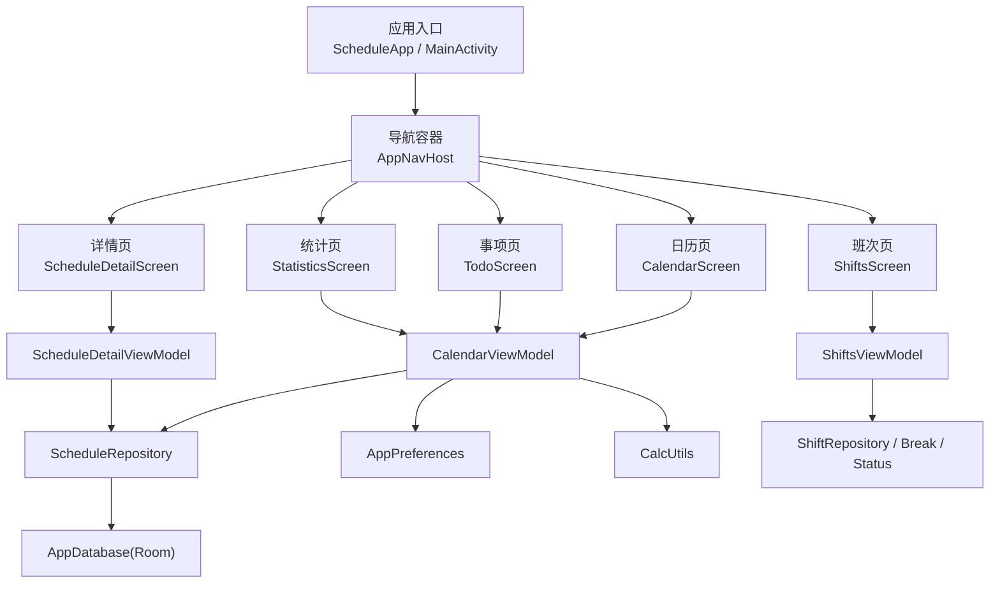
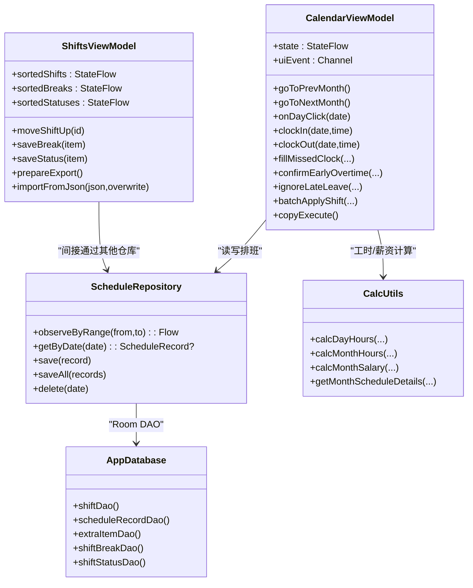
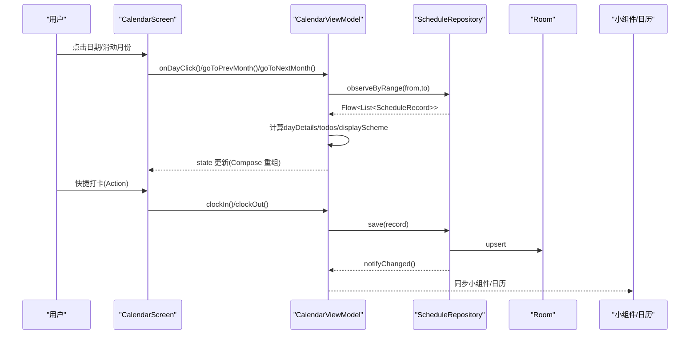
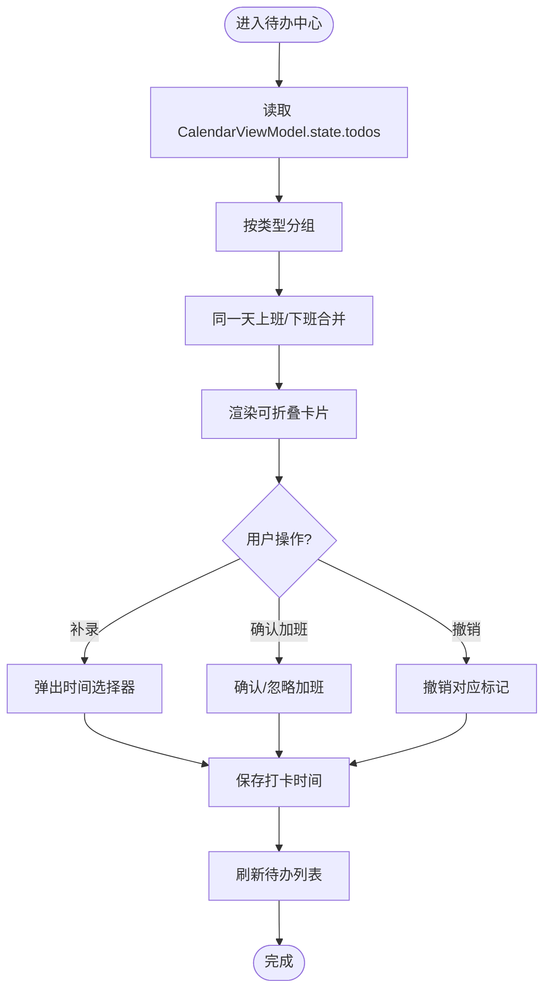
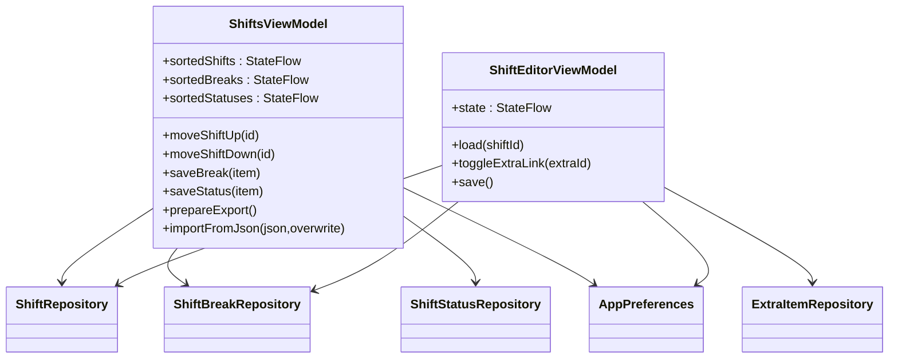
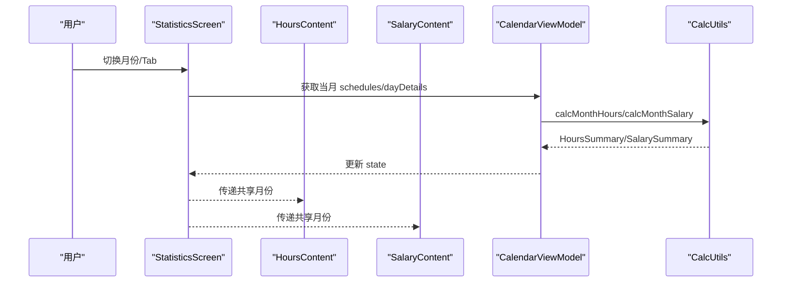
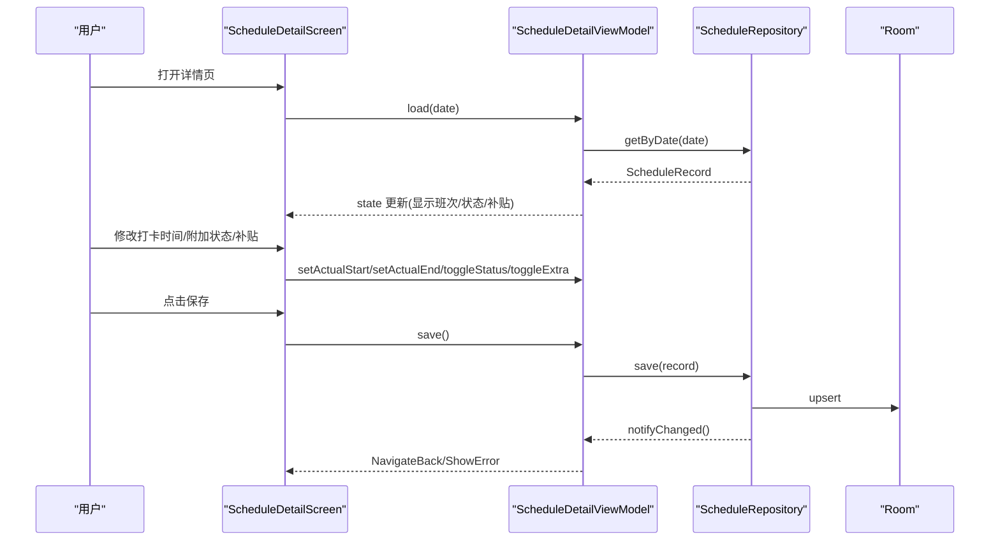
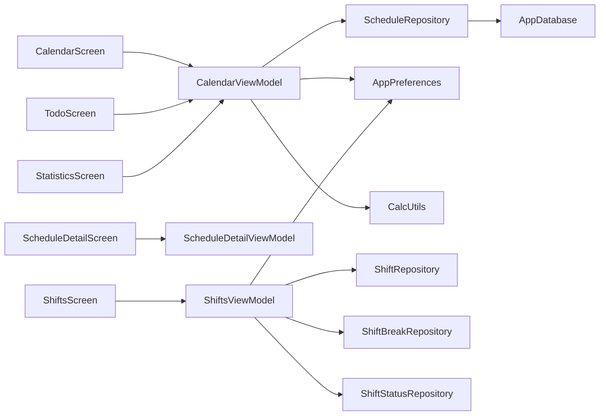

# 核心功能模块

<cite>
**本文引用的文件**   
- [MainActivity.kt](file://app/src/main/java/com/schedulecalendar/app/MainActivity.kt)
- [ScheduleApp.kt](file://app/src/main/java/com/schedulecalendar/app/ScheduleApp.kt)
- [AppNavHost.kt](file://app/src/main/java/com/schedulecalendar/app/ui/navigation/AppNavHost.kt)
- [Screen.kt](file://app/src/main/java/com/schedulecalendar/app/ui/navigation/Screen.kt)
- [CalendarScreen.kt](file://app/src/main/java/com/schedulecalendar/app/ui/calendar/CalendarScreen.kt)
- [CalendarViewModel.kt](file://app/src/main/java/com/schedulecalendar/app/ui/calendar/CalendarViewModel.kt)
- [TodoScreen.kt](file://app/src/main/java/com/schedulecalendar/app/ui/todo/TodoScreen.kt)
- [ShiftsScreen.kt](file://app/src/main/java/com/schedulecalendar/app/ui/shifts/ShiftsScreen.kt)
- [ShiftsViewModel.kt](file://app/src/main/java/com/schedulecalendar/app/ui/shifts/ShiftsViewModel.kt)
- [StatisticsScreen.kt](file://app/src/main/java/com/schedulecalendar/app/ui/statistics/StatisticsScreen.kt)
- [Models.kt](file://app/src/main/java/com/schedulecalendar/app/domain/model/Models.kt)
- [CalcUtils.kt](file://app/src/main/java/com/schedulecalendar/app/domain/model/CalcUtils.kt)
- [AppDatabase.kt](file://app/src/main/java/com/schedulecalendar/app/data/db/AppDatabase.kt)
- [ScheduleRepository.kt](file://app/src/main/java/com/schedulecalendar/app/data/repository/ScheduleRepository.kt)
- [ScheduleDetailScreen.kt](file://app/src/main/java/com/schedulecalendar/app/ui/detail/ScheduleDetailScreen.kt)
</cite>

## 目录
1. [简介](#简介)
2. [项目结构](#项目结构)
3. [核心组件](#核心组件)
4. [架构总览](#架构总览)
5. [详细组件分析](#详细组件分析)
6. [依赖关系分析](#依赖关系分析)
7. [性能考量](#性能考量)
8. [故障排查指南](#故障排查指南)
9. [结论](#结论)
10. [附录](#附录)

## 简介
本文件面向开发者与产品人员，系统化梳理 Android 排班日历应用的核心功能模块：日历排班管理、待办事项中心、班次管理系统、统计分析模块。文档覆盖业务逻辑、界面设计、数据流转、状态管理、错误处理与性能优化，并给出模块间集成方式与最佳实践，帮助快速理解实现细节与扩展方法。

## 项目结构
应用采用 MVVM + Compose UI + Room + Hilt 的架构风格，按功能域分层组织代码：
- 表现层（UI）：Composable 页面与导航
- 视图模型层（ViewModel）：状态管理与业务编排
- 领域层（Domain）：计算工具与领域模型
- 数据层（Data）：Room 数据库、DAO、仓库（Repository）、偏好设置
- 系统入口：Application 与主 Activity

图表来源
- [AppNavHost.kt:54-133](file://app/src/main/java/com/schedulecalendar/app/ui/navigation/AppNavHost.kt#L54-L133)
- [Screen.kt:7-34](file://app/src/main/java/com/schedulecalendar/app/ui/navigation/Screen.kt#L7-L34)
- [CalendarScreen.kt:76-130](file://app/src/main/java/com/schedulecalendar/app/ui/calendar/CalendarScreen.kt#L76-L130)
- [TodoScreen.kt:67-100](file://app/src/main/java/com/schedulecalendar/app/ui/todo/TodoScreen.kt#L67-L100)
- [StatisticsScreen.kt:31-128](file://app/src/main/java/com/schedulecalendar/app/ui/statistics/StatisticsScreen.kt#L31-L128)
- [ShiftsScreen.kt:52-179](file://app/src/main/java/com/schedulecalendar/app/ui/shifts/ShiftsScreen.kt#L52-L179)
- [ScheduleDetailScreen.kt:40-114](file://app/src/main/java/com/schedulecalendar/app/ui/detail/ScheduleDetailScreen.kt#L40-L114)
- [CalendarViewModel.kt:105-132](file://app/src/main/java/com/schedulecalendar/app/ui/calendar/CalendarViewModel.kt#L105-L132)
- [ShiftsViewModel.kt:46-130](file://app/src/main/java/com/schedulecalendar/app/ui/shifts/ShiftsViewModel.kt#L46-L130)
- [ScheduleRepository.kt:14-39](file://app/src/main/java/com/schedulecalendar/app/data/repository/ScheduleRepository.kt#L14-L39)
- [AppDatabase.kt:17-34](file://app/src/main/java/com/schedulecalendar/app/data/db/AppDatabase.kt#L17-L34)

章节来源
- [AppNavHost.kt:54-133](file://app/src/main/java/com/schedulecalendar/app/ui/navigation/AppNavHost.kt#L54-L133)
- [Screen.kt:7-34](file://app/src/main/java/com/schedulecalendar/app/ui/navigation/Screen.kt#L7-L34)
- [AppDatabase.kt:17-34](file://app/src/main/java/com/schedulecalendar/app/data/db/AppDatabase.kt#L17-L34)

## 核心组件
- 日历排班管理：提供月历展示、日期选择、批量操作（批量排班/复制/删除）、快捷打卡、联动小组件与桌面日程事件。
- 待办事项中心：汇总漏打卡补录、已补录、疑似加班确认、已确认/忽略加班等任务，支持按月筛选与内联操作。
- 班次管理系统：维护班次、附加状态、补贴扣款项、全局休息时段；支持排序、导入导出、编辑与归档。
- 统计分析模块：合并工时与薪资两个子页，共享月份状态，展示月度汇总与每日明细。

章节来源
- [CalendarScreen.kt:76-130](file://app/src/main/java/com/schedulecalendar/app/ui/calendar/CalendarScreen.kt#L76-L130)
- [TodoScreen.kt:67-100](file://app/src/main/java/com/schedulecalendar/app/ui/todo/TodoScreen.kt#L67-L100)
- [ShiftsScreen.kt:52-179](file://app/src/main/java/com/schedulecalendar/app/ui/shifts/ShiftsScreen.kt#L52-L179)
- [StatisticsScreen.kt:31-128](file://app/src/main/java/com/schedulecalendar/app/ui/statistics/StatisticsScreen.kt#L31-L128)

## 架构总览
整体遵循“UI → ViewModel → Repository → Room”的数据流，结合 Flow 进行响应式更新；领域计算集中在 CalcUtils，保证业务规则一致性与可测试性。

图表来源
- [CalendarViewModel.kt:105-132](file://app/src/main/java/com/schedulecalendar/app/ui/calendar/CalendarViewModel.kt#L105-L132)
- [ShiftsViewModel.kt:46-130](file://app/src/main/java/com/schedulecalendar/app/ui/shifts/ShiftsViewModel.kt#L46-L130)
- [ScheduleRepository.kt:14-39](file://app/src/main/java/com/schedulecalendar/app/data/repository/ScheduleRepository.kt#L14-L39)
- [AppDatabase.kt:17-34](file://app/src/main/java/com/schedulecalendar/app/data/db/AppDatabase.kt#L17-L34)
- [CalcUtils.kt:149-230](file://app/src/main/java/com/schedulecalendar/app/domain/model/CalcUtils.kt#L149-L230)

## 详细组件分析

### 日历排班管理
- 业务逻辑
  - 月份切换与跨月填充：根据当月天数与首周日偏移计算网格范围，加载上月尾部与下月头部数据用于展示。
  - 显示方案：支持多行数据项配置（如正班工时、加班工时、当日收入等），在格子中动态渲染。
  - 批量操作：批量排班、复制排班（两阶段选择源范围与目标起始）、清除排班；支持全选当月。
  - 快捷打卡：从 Activity 接收 Action，调用 clockIn/clockOut 写入实际打卡时间。
  - 纪念日与日程：加载选中日期的本地日历事件，供详情页展示。
- 界面设计
  - 顶部栏：年月选择器、“今天”按钮、编辑菜单（显示方案、批量排班、复制排班、删除排班）。
  - 日历网格：支持左右滑动切换月份，日期高亮（今天/选中/节假日/周末），农历与节日标签。
  - 底部区域：日期详情、排班预览、纪念日与日程（仅在非批量/复制模式下显示）。
- 数据流转
  - ViewModel 组合多个 Flow（班次、排班记录、显示方案、循环规则），计算当月详情与跨月详情，生成待办列表，并同步小组件与桌面日历。
  - 写操作通过 Repository 持久化，触发刷新信号，UI 自动更新。
- 状态管理
  - 使用 StateFlow 暴露 state，Channel 发送一次性 UI 事件（导航、消息、错误）。
  - 切月时取消旧收集 Job，避免协程泄漏。
- 错误处理
  - 统一通过 uiEvent 抛出 ShowMessage/ShowError，UI 层以 Snackbar 提示。
- 性能优化
  - 使用 combine 聚合数据源，减少重复查询；跨月详情预计算；AnimatedContent 控制过渡动画；LazyColumn 按需渲染。

图表来源
- [CalendarScreen.kt:76-130](file://app/src/main/java/com/schedulecalendar/app/ui/calendar/CalendarScreen.kt#L76-L130)
- [CalendarViewModel.kt:134-246](file://app/src/main/java/com/schedulecalendar/app/ui/calendar/CalendarViewModel.kt#L134-L246)
- [ScheduleRepository.kt:22-39](file://app/src/main/java/com/schedulecalendar/app/data/repository/ScheduleRepository.kt#L22-L39)

章节来源
- [CalendarScreen.kt:76-130](file://app/src/main/java/com/schedulecalendar/app/ui/calendar/CalendarScreen.kt#L76-L130)
- [CalendarViewModel.kt:134-246](file://app/src/main/java/com/schedulecalendar/app/ui/calendar/CalendarViewModel.kt#L134-L246)
- [MainActivity.kt:72-103](file://app/src/main/java/com/schedulecalendar/app/MainActivity.kt#L72-L103)

### 待办事项中心
- 业务逻辑
  - 分类聚合：漏打卡待补录、已补录、疑似加班待确认、是加班、不是加班。
  - 同一天上班/下班合并显示，便于快速处理。
  - 支持撤销操作（撤销补录、撤销确认/忽略加班）。
- 界面设计
  - 顶部 Tab：待办、日程、纪念日、节假日。
  - 卡片区块：可展开/折叠，显示数量与操作按钮。
  - 弹窗：漏打卡补录时间选择、加班确认/忽略对话框。
- 数据流转
  - 复用 CalendarViewModel 的 state.todos，基于当月排班与考勤规则生成。
  - 操作后通过 Repository 保存，UI 即时刷新。
- 状态管理
  - 使用 remember 缓存过滤结果，避免频繁重组。
- 错误处理
  - 通过 CalendarUiEvent 统一提示。
- 性能优化
  - 分页/懒加载未使用（当前为单月数据），但通过分组与排序降低渲染开销。

图表来源
- [TodoScreen.kt:67-100](file://app/src/main/java/com/schedulecalendar/app/ui/todo/TodoScreen.kt#L67-L100)
- [CalendarViewModel.kt:250-324](file://app/src/main/java/com/schedulecalendar/app/ui/calendar/CalendarViewModel.kt#L250-L324)

章节来源
- [TodoScreen.kt:67-100](file://app/src/main/java/com/schedulecalendar/app/ui/todo/TodoScreen.kt#L67-L100)
- [CalendarViewModel.kt:250-324](file://app/src/main/java/com/schedulecalendar/app/ui/calendar/CalendarViewModel.kt#L250-L324)

### 班次管理系统
- 业务逻辑
  - 班次 CRUD：新增/编辑/删除（归档），支持名称唯一性校验与预设颜色索引递增。
  - 全局休息时段：定义不计入工时的时间段，支持重叠检测与排序。
  - 附加状态：请假/调休等自定义状态，支持颜色与报表类型映射。
  - 补贴/扣款：独立管理，支持关联到班次默认预选。
  - 导入/导出：JSON 格式，版本 v4，支持覆盖/增量策略。
- 界面设计
  - 四 Tab：班次、附加状态、补贴扣款、休息时段。
  - 每个条目支持上移/下移排序，内置项不可编辑/删除。
  - 编辑器弹窗：字段校验、冲突检测、实时预览。
- 数据流转
  - 使用 StateFlow 暴露排序后的列表，内存顺序与 DataStore 持久化同步。
  - 保存/删除后触发自动备份。
- 状态管理
  - 内存 _shiftOrder/_statusOrder/_breakOrder 即时响应，后台异步持久化。
- 错误处理
  - 通过 ShiftsUiEvent 返回错误信息，UI 层 Snackbar 提示。
- 性能优化
  - stateIn 控制订阅生命周期；combine 实现即时排序；避免不必要的数据库查询。

图表来源
- [ShiftsViewModel.kt:46-130](file://app/src/main/java/com/schedulecalendar/app/ui/shifts/ShiftsViewModel.kt#L46-L130)
- [ShiftsViewModel.kt:350-454](file://app/src/main/java/com/schedulecalendar/app/ui/shifts/ShiftsViewModel.kt#L350-L454)

章节来源
- [ShiftsScreen.kt:52-179](file://app/src/main/java/com/schedulecalendar/app/ui/shifts/ShiftsScreen.kt#L52-L179)
- [ShiftsViewModel.kt:46-130](file://app/src/main/java/com/schedulecalendar/app/ui/shifts/ShiftsViewModel.kt#L46-L130)
- [ShiftsViewModel.kt:350-454](file://app/src/main/java/com/schedulecalendar/app/ui/shifts/ShiftsViewModel.kt#L350-L454)

### 统计分析模块
- 业务逻辑
  - 合并工时与薪资两个子页，共享月份状态，支持上下月切换。
  - 工时统计：正常/加班/周末/节假日工时，迟到早退计数，请假/调休折算。
  - 薪资统计：底薪+绩效+各时段薪资+补贴-扣款-社保-公积金=实发工资。
- 界面设计
  - 顶部栏：CenterAlignedTopAppBar + 月份导航 + TabRow。
  - 内容区：HorizontalPager 切换工时/薪资，内部复用 HoursContent/SalaryContent。
- 数据流转
  - 通过 CalendarViewModel 提供的 dayDetails 与 CalcUtils 计算结果驱动展示。
- 状态管理
  - sharedYear/sharedMonth 作为共享状态，确保两个子页同步。
- 错误处理
  - 由底层计算与仓库异常向上抛出，UI 层统一处理。
- 性能优化
  - 共享状态避免重复计算；分页懒加载按需渲染。

图表来源
- [StatisticsScreen.kt:31-128](file://app/src/main/java/com/schedulecalendar/app/ui/statistics/StatisticsScreen.kt#L31-L128)
- [CalendarViewModel.kt:134-246](file://app/src/main/java/com/schedulecalendar/app/ui/calendar/CalendarViewModel.kt#L134-L246)
- [CalcUtils.kt:234-423](file://app/src/main/java/com/schedulecalendar/app/domain/model/CalcUtils.kt#L234-L423)

章节来源
- [StatisticsScreen.kt:31-128](file://app/src/main/java/com/schedulecalendar/app/ui/statistics/StatisticsScreen.kt#L31-L128)
- [CalcUtils.kt:234-423](file://app/src/main/java/com/schedulecalendar/app/domain/model/CalcUtils.kt#L234-L423)

### 排班详情编辑
- 业务逻辑
  - 选择班次、设置实际打卡时间、附加状态（含时间段）、补贴/扣款勾选、备注、计薪方式（自动/手动）。
  - 实时预览工时与薪资明细。
- 界面设计
  - 顶部栏：标题、返回、清除/保存。
  - 表单分区：日期信息、班次选择、打卡时间、附加状态、补贴扣款、备注、计薪方式。
  - 弹窗：班次选择底面板、状态时间段编辑、时间选择器。
- 数据流转
  - 通过 ScheduleDetailViewModel 加载班次/状态/补贴数据，保存时调用 Repository 持久化。
- 状态管理
  - 使用 StateFlow 暴露编辑状态，UI 实时反馈。
- 错误处理
  - 校验失败通过 uiEvent 返回错误信息。
- 性能优化
  - 滚动容器与 IME 适配，避免输入框被遮挡；弹窗在外部渲染避免裁剪。

图表来源
- [ScheduleDetailScreen.kt:40-114](file://app/src/main/java/com/schedulecalendar/app/ui/detail/ScheduleDetailScreen.kt#L40-L114)
- [ScheduleRepository.kt:22-39](file://app/src/main/java/com/schedulecalendar/app/data/repository/ScheduleRepository.kt#L22-L39)

章节来源
- [ScheduleDetailScreen.kt:40-114](file://app/src/main/java/com/schedulecalendar/app/ui/detail/ScheduleDetailScreen.kt#L40-L114)

## 依赖关系分析
- 组件耦合与内聚
  - UI 与 ViewModel 解耦，通过 StateFlow/Channel 通信；ViewModel 依赖 Repository 与领域计算。
  - Repository 封装 DAO 与转换逻辑，屏蔽 Room 细节。
- 直接/间接依赖
  - CalendarViewModel 直接依赖 ScheduleRepository、AppPreferences、CalcUtils；间接依赖 Room。
  - ShiftsViewModel 直接依赖各类 Repository 与 AppPreferences。
- 外部依赖与集成点
  - Room 数据库、Hilt 注入、Compose Navigation、Material3 组件、系统日历 Provider。
- 接口契约与实现细节
  - Repository 暴露 Flow/List API；ViewModel 暴露 state/uiEvent；UI 消费这些接口。

图表来源
- [CalendarScreen.kt:76-130](file://app/src/main/java/com/schedulecalendar/app/ui/calendar/CalendarScreen.kt#L76-L130)
- [TodoScreen.kt:67-100](file://app/src/main/java/com/schedulecalendar/app/ui/todo/TodoScreen.kt#L67-L100)
- [StatisticsScreen.kt:31-128](file://app/src/main/java/com/schedulecalendar/app/ui/statistics/StatisticsScreen.kt#L31-L128)
- [ScheduleDetailScreen.kt:40-114](file://app/src/main/java/com/schedulecalendar/app/ui/detail/ScheduleDetailScreen.kt#L40-L114)
- [ShiftsScreen.kt:52-179](file://app/src/main/java/com/schedulecalendar/app/ui/shifts/ShiftsScreen.kt#L52-L179)
- [CalendarViewModel.kt:105-132](file://app/src/main/java/com/schedulecalendar/app/ui/calendar/CalendarViewModel.kt#L105-L132)
- [ShiftsViewModel.kt:46-130](file://app/src/main/java/com/schedulecalendar/app/ui/shifts/ShiftsViewModel.kt#L46-L130)
- [ScheduleRepository.kt:14-39](file://app/src/main/java/com/schedulecalendar/app/data/repository/ScheduleRepository.kt#L14-L39)
- [AppDatabase.kt:17-34](file://app/src/main/java/com/schedulecalendar/app/data/db/AppDatabase.kt#L17-L34)

章节来源
- [AppDatabase.kt:17-34](file://app/src/main/java/com/schedulecalendar/app/data/db/AppDatabase.kt#L17-L34)
- [ScheduleRepository.kt:14-39](file://app/src/main/java/com/schedulecalendar/app/data/repository/ScheduleRepository.kt#L14-L39)

## 性能考量
- 数据层
  - 使用 Flow 观察数据变更，避免轮询；Repository 提供范围查询以减少不必要数据量。
- 计算层
  - CalcUtils 集中工时/薪资算法，避免重复实现；对跨天/粒度取整/容忍时长进行归一化处理。
- UI 层
  - AnimatedContent/LazyColumn 提升渲染效率；remember 缓存中间结果；stateIn 控制订阅生命周期。
- 资源管理
  - 切月时取消旧收集 Job，防止协程泄漏；弹窗在外部渲染避免裁剪与重绘。

[本节为通用指导，不直接分析具体文件]

## 故障排查指南
- 常见问题
  - 打卡无效：检查 MainActivity 是否成功消费 Action，CalendarViewModel.clockIn/clockOut 是否正确保存。
  - 排班未刷新：确认 Repository.save/saveAll 是否触发 notifyChanged，UI 是否订阅相应 Flow。
  - 计算异常：核对 CalcUtils 的考勤规则参数（粒度、容忍时长、标准工时）与配置一致性。
  - 导入失败：检查 JSON 版本与字段完整性，确认覆盖/增量策略是否符合预期。
- 调试建议
  - 使用 Snackbar 捕获 uiEvent 的错误信息；在关键路径打印日志（如 Range 计算、Flow 合并结果）。
  - 验证 Room Schema 迁移与版本号，确保数据库升级正确。

章节来源
- [MainActivity.kt:72-103](file://app/src/main/java/com/schedulecalendar/app/MainActivity.kt#L72-L103)
- [CalendarViewModel.kt:404-499](file://app/src/main/java/com/schedulecalendar/app/ui/calendar/CalendarViewModel.kt#L404-L499)
- [ScheduleRepository.kt:22-39](file://app/src/main/java/com/schedulecalendar/app/data/repository/ScheduleRepository.kt#L22-L39)
- [ShiftsViewModel.kt:274-327](file://app/src/main/java/com/schedulecalendar/app/ui/shifts/ShiftsViewModel.kt#L274-L327)

## 结论
本应用通过清晰的 MVVM 分层与 Compose UI，实现了日历排班、待办中心、班次管理与统计分析四大核心模块。数据流以 Flow 为核心，领域计算集中于 CalcUtils，保证了业务一致性与可维护性。建议在后续迭代中继续强化错误边界、单元测试覆盖与性能监控，以提升用户体验与开发效率。

[本节为总结，不直接分析具体文件]

## 附录
- 领域模型与常量
  - 内置班次/状态、显示方案、薪资/考勤配置、小时/薪资汇总数据结构等。
- 使用示例与最佳实践
  - 日历网格：优先使用 displayScheme 配置数据项，减少硬编码。
  - 批量操作：先选择再执行，提供撤销能力，避免误操作。
  - 待办中心：合并同类项，提升处理效率。
  - 班次管理：保持名称唯一性，合理设置休息时段以避免工时重复扣除。
  - 统计分析：共享月份状态，确保工时与薪资一致性。

章节来源
- [Models.kt:51-277](file://app/src/main/java/com/schedulecalendar/app/domain/model/Models.kt#L51-L277)
- [CalcUtils.kt:149-230](file://app/src/main/java/com/schedulecalendar/app/domain/model/CalcUtils.kt#L149-L230)