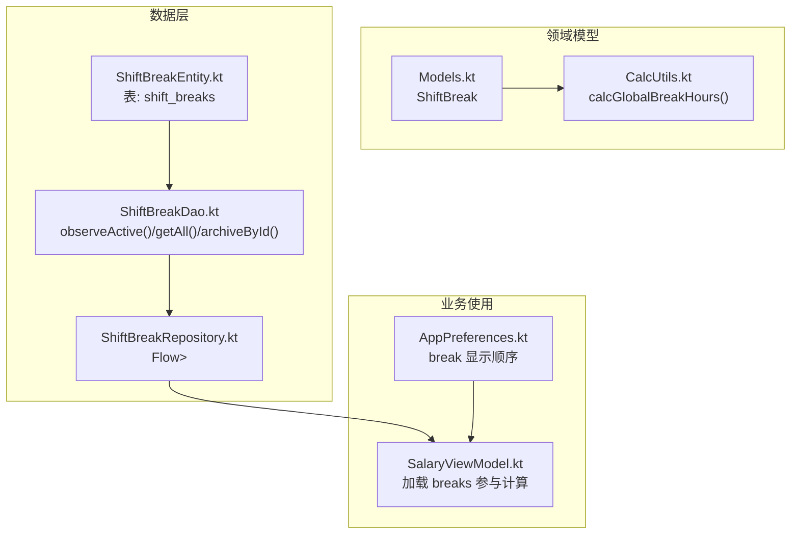
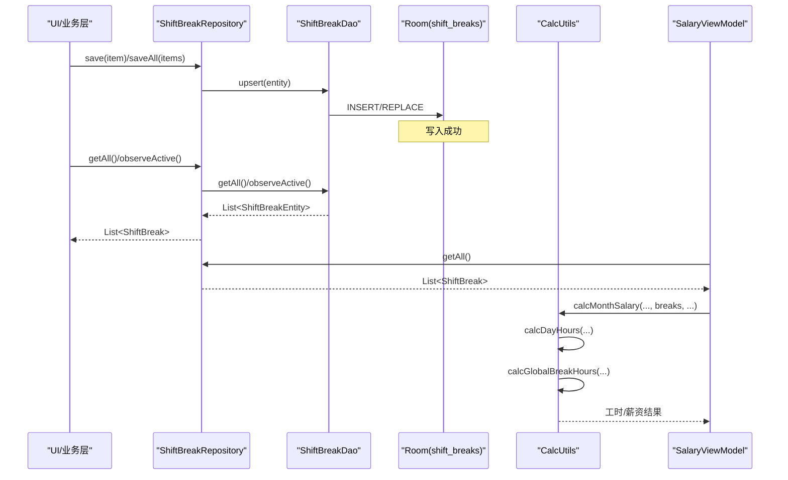
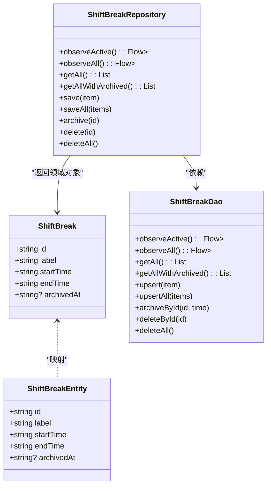
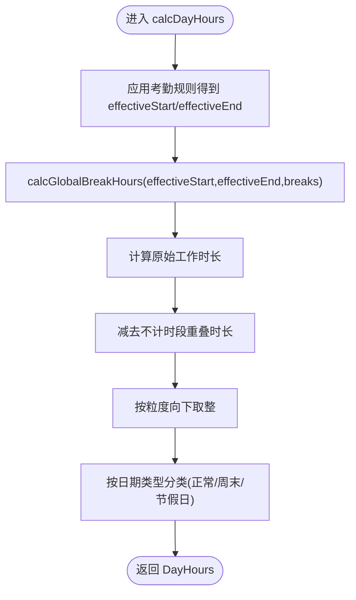
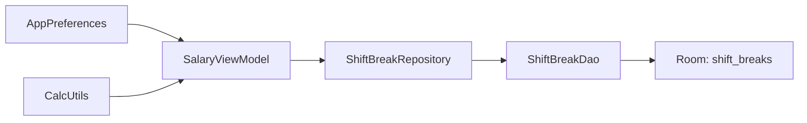

# 全局不计时段管理

<cite>
**本文引用的文件**   
- [ShiftBreakEntity.kt](file://app/src/main/java/com/schedulecalendar/app/data/db/entity/ShiftBreakEntity.kt)
- [ShiftBreakDao.kt](file://app/src/main/java/com/schedulecalendar/app/data/db/dao/ShiftBreakDao.kt)
- [ShiftBreakRepository.kt](file://app/src/main/java/com/schedulecalendar/app/data/repository/ShiftBreakRepository.kt)
- [Models.kt](file://app/src/main/java/com/schedulecalendar/app/domain/model/Models.kt)
- [CalcUtils.kt](file://app/src/main/java/com/schedulecalendar/app/domain/model/CalcUtils.kt)
- [SalaryViewModel.kt](file://app/src/main/java/com/schedulecalendar/app/ui/salary/SalaryViewModel.kt)
- [AppPreferences.kt](file://app/src/main/java/com/schedulecalendar/app/data/prefs/AppPreferences.kt)
</cite>

## 目录
1. [简介](#简介)
2. [项目结构](#项目结构)
3. [核心组件](#核心组件)
4. [架构总览](#架构总览)
5. [详细组件分析](#详细组件分析)
6. [依赖关系分析](#依赖关系分析)
7. [性能考量](#性能考量)
8. [故障排查指南](#故障排查指南)
9. [结论](#结论)
10. [附录](#附录)

## 简介
本文件围绕“全局不计时段”（如午休、用餐等）的管理体系展开，覆盖其定义、数据模型、持久化、仓库层、与排班记录的计算联动、排序管理与优先级处理、删除保护与引用检查、时间验证与冲突检测，以及扩展新类型与复杂时间计算逻辑的实践方案。目标是帮助开发者快速理解并正确扩展该子系统。

## 项目结构
全局不计时段相关代码分布在领域模型、数据库实体与 DAO、仓库层、薪资计算工具类以及偏好设置中：
- 领域模型：定义 ShiftBreak 数据结构及内置常量
- 数据层：Room 实体与 DAO 提供增删改查与归档能力
- 仓库层：封装对 DAO 的调用，并提供 Flow 观察
- 计算层：在工时与薪资计算中自动扣除不计时段
- 偏好设置：维护显示顺序（排序）

图表来源
- [Models.kt:1-277](file://app/src/main/java/com/schedulecalendar/app/domain/model/Models.kt#L1-L277)
- [CalcUtils.kt:115-134](file://app/src/main/java/com/schedulecalendar/app/domain/model/CalcUtils.kt#L115-L134)
- [ShiftBreakEntity.kt:1-16](file://app/src/main/java/com/schedulecalendar/app/data/db/entity/ShiftBreakEntity.kt#L1-L16)
- [ShiftBreakDao.kt:1-39](file://app/src/main/java/com/schedulecalendar/app/data/db/dao/ShiftBreakDao.kt#L1-L39)
- [ShiftBreakRepository.kt:1-27](file://app/src/main/java/com/schedulecalendar/app/data/repository/ShiftBreakRepository.kt#L1-L27)
- [SalaryViewModel.kt:74-88](file://app/src/main/java/com/schedulecalendar/app/ui/salary/SalaryViewModel.kt#L74-L88)
- [AppPreferences.kt:144-153](file://app/src/main/java/com/schedulecalendar/app/data/prefs/AppPreferences.kt#L144-L153)

章节来源
- [Models.kt:1-277](file://app/src/main/java/com/schedulecalendar/app/domain/model/Models.kt#L1-L277)
- [ShiftBreakEntity.kt:1-16](file://app/src/main/java/com/schedulecalendar/app/data/db/entity/ShiftBreakEntity.kt#L1-L16)
- [ShiftBreakDao.kt:1-39](file://app/src/main/java/com/schedulecalendar/app/data/db/dao/ShiftBreakDao.kt#L1-L39)
- [ShiftBreakRepository.kt:1-27](file://app/src/main/java/com/schedulecalendar/app/data/repository/ShiftBreakRepository.kt#L1-L27)
- [SalaryViewModel.kt:74-88](file://app/src/main/java/com/schedulecalendar/app/ui/salary/SalaryViewModel.kt#L74-L88)
- [AppPreferences.kt:144-153](file://app/src/main/java/com/schedulecalendar/app/data/prefs/AppPreferences.kt#L144-L153)

## 核心组件
- 领域模型 ShiftBreak：包含 id、label、startTime(HH:mm)、endTime(HH:mm)、archivedAt(归档标记)
- 数据实体 ShiftBreakEntity：对应 Room 表 shift_breaks，字段与领域模型一致
- DAO 接口 ShiftBreakDao：提供 observeActive/observeAll、getAll/getAllWithArchived、upsert/upsertAll、archiveById、deleteById、deleteAll
- 仓库 ShiftBreakRepository：将 Entity 映射为 Domain，暴露 Flow 与 suspend API
- 计算 CalcUtils.calcGlobalBreakHours：计算班次窗口与所有不计时段的重叠时长，支持跨天
- 薪资视图 SalaryViewModel：加载 breaks 列表并传入计算函数，使不计时段影响最终工时与薪资
- 偏好 AppPreferences：保存 break 显示顺序，用于 UI 展示排序

章节来源
- [Models.kt:13-20](file://app/src/main/java/com/schedulecalendar/app/domain/model/Models.kt#L13-L20)
- [ShiftBreakEntity.kt:7-15](file://app/src/main/java/com/schedulecalendar/app/data/db/entity/ShiftBreakEntity.kt#L7-L15)
- [ShiftBreakDao.kt:10-37](file://app/src/main/java/com/schedulecalendar/app/data/db/dao/ShiftBreakDao.kt#L10-L37)
- [ShiftBreakRepository.kt:15-25](file://app/src/main/java/com/schedulecalendar/app/data/repository/ShiftBreakRepository.kt#L15-L25)
- [CalcUtils.kt:115-134](file://app/src/main/java/com/schedulecalendar/app/domain/model/CalcUtils.kt#L115-L134)
- [SalaryViewModel.kt:74-88](file://app/src/main/java/com/schedulecalendar/app/ui/salary/SalaryViewModel.kt#L74-L88)
- [AppPreferences.kt:144-153](file://app/src/main/java/com/schedulecalendar/app/data/prefs/AppPreferences.kt#L144-L153)

## 架构总览
全局不计时段从用户输入到工时/薪资计算的端到端流程如下：

图表来源
- [ShiftBreakRepository.kt:15-25](file://app/src/main/java/com/schedulecalendar/app/data/repository/ShiftBreakRepository.kt#L15-L25)
- [ShiftBreakDao.kt:10-37](file://app/src/main/java/com/schedulecalendar/app/data/db/dao/ShiftBreakDao.kt#L10-L37)
- [SalaryViewModel.kt:74-88](file://app/src/main/java/com/schedulecalendar/app/ui/salary/SalaryViewModel.kt#L74-L88)
- [CalcUtils.kt:115-134](file://app/src/main/java/com/schedulecalendar/app/domain/model/CalcUtils.kt#L115-L134)

## 详细组件分析

### 数据模型与持久化
- 领域模型 ShiftBreak 与实体 ShiftBreakEntity 一一对应，字段包括标识、标签、起止时间、归档时间
- DAO 提供两类查询：仅有效（未归档）与全部（含已归档），便于 UI 区分展示与管理
- 插入策略采用 REPLACE，避免重复键冲突；归档通过设置 archivedAt 实现逻辑删除

图表来源
- [Models.kt:13-20](file://app/src/main/java/com/schedulecalendar/app/domain/model/Models.kt#L13-L20)
- [ShiftBreakEntity.kt:7-15](file://app/src/main/java/com/schedulecalendar/app/data/db/entity/ShiftBreakEntity.kt#L7-L15)
- [ShiftBreakDao.kt:10-37](file://app/src/main/java/com/schedulecalendar/app/data/db/dao/ShiftBreakDao.kt#L10-L37)
- [ShiftBreakRepository.kt:15-25](file://app/src/main/java/com/schedulecalendar/app/data/repository/ShiftBreakRepository.kt#L15-L25)

章节来源
- [Models.kt:13-20](file://app/src/main/java/com/schedulecalendar/app/domain/model/Models.kt#L13-L20)
- [ShiftBreakEntity.kt:7-15](file://app/src/main/java/com/schedulecalendar/app/data/db/entity/ShiftBreakEntity.kt#L7-L15)
- [ShiftBreakDao.kt:10-37](file://app/src/main/java/com/schedulecalendar/app/data/db/dao/ShiftBreakDao.kt#L10-L37)
- [ShiftBreakRepository.kt:15-25](file://app/src/main/java/com/schedulecalendar/app/data/repository/ShiftBreakRepository.kt#L15-L25)

### 创建流程与校验
- 标签设置：label 作为人类可读名称，建议简洁明确（如“午休”、“午餐”）
- 开始结束时间配置：HH:mm 格式，支持跨天（例如 23:00→01:00）
- 时间重叠检测：建议在保存前进行区间合并与冲突检测，避免同一日内多个时段相互嵌套或交叉导致扣减异常
- 推荐校验规则：
  - 开始时间早于结束时间（考虑跨天归一化）
  - 同日内不出现完全相同的起止时间
  - 若存在重叠，提示用户调整或自动合并相邻时段

（本节为通用实践建议，无需源码引用）

### 与排班记录的计算联动
- 计算入口：薪资模块在加载月份数据时获取 breaks 列表，并传入 CalcUtils 进行汇总
- 日级计算：calcDayHours 先根据考勤规则（粒度取整、容忍时长）得到有效起止时间，再调用 calcGlobalBreakHours 扣除不计时段
- 月级汇总：calcMonthSalary 基于每日工时乘以相应费率，叠加补贴与扣款，得到实发工资

图表来源
- [CalcUtils.kt:149-230](file://app/src/main/java/com/schedulecalendar/app/domain/model/CalcUtils.kt#L149-L230)
- [CalcUtils.kt:115-134](file://app/src/main/java/com/schedulecalendar/app/domain/model/CalcUtils.kt#L115-L134)

章节来源
- [SalaryViewModel.kt:74-88](file://app/src/main/java/com/schedulecalendar/app/ui/salary/SalaryViewModel.kt#L74-L88)
- [CalcUtils.kt:149-230](file://app/src/main/java/com/schedulecalendar/app/domain/model/CalcUtils.kt#L149-L230)
- [CalcUtils.kt:115-134](file://app/src/main/java/com/schedulecalendar/app/domain/model/CalcUtils.kt#L115-L134)

### 排序管理与优先级处理
- 显示顺序：通过 AppPreferences 的 getBreakOrder/saveBreakOrder 维护 breaks 的显示顺序，供 UI 渲染
- 计算优先级：当前计算逻辑对所有 breaks 求和重叠时长，无显式优先级字段；如需差异化处理（如不同标签有不同权重），可在领域模型增加权重字段并在 calcGlobalBreakHours 中加权累加

章节来源
- [AppPreferences.kt:144-153](file://app/src/main/java/com/schedulecalendar/app/data/prefs/AppPreferences.kt#L144-L153)
- [CalcUtils.kt:115-134](file://app/src/main/java/com/schedulecalendar/app/domain/model/CalcUtils.kt#L115-L134)

### 删除保护与引用检查
- 逻辑删除：DAO 提供 archiveById，仓库提供 archive，设置 archivedAt 后不再出现在 observeActive/getAll 中
- 物理删除：deleteById/deleteAll 直接移除记录
- 引用检查建议：
  - 在删除或归档前检查是否存在历史排班记录引用该 breaks（可通过日期范围与时间段匹配判断）
  - 若存在引用，优先采用归档而非物理删除，保证历史统计一致性

（本节为通用实践建议，无需源码引用）

### 时间验证与冲突检测实现方案
- 时间解析：统一使用 HH:mm 字符串，内部转换为分钟数进行比较与计算
- 跨天支持：normRange 将结束时间小于开始时间的情况归一化为次日
- 重叠计算：对每个 break 与班次窗口分别计算两段重叠长度，并累加
- 冲突检测（建议）：
  - 在同一天内，遍历 breaks 两两比较，若存在任意重叠则提示用户
  - 可引入区间合并算法，将相邻或重叠时段合并，避免重复扣减

章节来源
- [CalcUtils.kt:20-34](file://app/src/main/java/com/schedulecalendar/app/domain/model/CalcUtils.kt#L20-L34)
- [CalcUtils.kt:115-134](file://app/src/main/java/com/schedulecalendar/app/domain/model/CalcUtils.kt#L115-L134)

### 扩展新的不计时段类型与复杂计算
- 扩展方向：
  - 在领域模型增加字段（如 weight、type、scope），以支持不同类型与权重
  - 在 DAO/Repository 层同步更新映射与查询
  - 在 CalcUtils 中扩展 calcGlobalBreakHours 以支持加权或条件过滤
- 复杂时间计算：
  - 针对特殊场景（如分段休息、弹性休息），可在 calcDayHours 中增加分支逻辑，结合 appliedStatus 的时间段进行更精细的扣减

（本节为通用实践建议，无需源码引用）

## 依赖关系分析
- Repository 依赖 DAO，DAO 依赖 Room 表
- 薪资 ViewModel 依赖 Repository 获取 breaks，并传递给 CalcUtils
- 偏好设置独立存储显示顺序，不影响计算逻辑

图表来源
- [ShiftBreakRepository.kt:15-25](file://app/src/main/java/com/schedulecalendar/app/data/repository/ShiftBreakRepository.kt#L15-L25)
- [ShiftBreakDao.kt:10-37](file://app/src/main/java/com/schedulecalendar/app/data/db/dao/ShiftBreakDao.kt#L10-L37)
- [SalaryViewModel.kt:74-88](file://app/src/main/java/com/schedulecalendar/app/ui/salary/SalaryViewModel.kt#L74-L88)
- [AppPreferences.kt:144-153](file://app/src/main/java/com/schedulecalendar/app/data/prefs/AppPreferences.kt#L144-L153)

章节来源
- [ShiftBreakRepository.kt:15-25](file://app/src/main/java/com/schedulecalendar/app/data/repository/ShiftBreakRepository.kt#L15-L25)
- [ShiftBreakDao.kt:10-37](file://app/src/main/java/com/schedulecalendar/app/data/db/dao/ShiftBreakDao.kt#L10-L37)
- [SalaryViewModel.kt:74-88](file://app/src/main/java/com/schedulecalendar/app/ui/salary/SalaryViewModel.kt#L74-L88)
- [AppPreferences.kt:144-153](file://app/src/main/java/com/schedulecalendar/app/data/prefs/AppPreferences.kt#L144-L153)

## 性能考量
- 使用 Flow 观察有效 breaks，减少手动刷新开销
- 批量保存使用 upsertAll，降低 IO 次数
- 计算层对 breaks 进行线性扫描，通常数量较小，性能可接受；若未来规模增长，可考虑按日期索引或预聚合

（本节为通用指导，无需源码引用）

## 故障排查指南
- 问题：不计时段未生效
  - 检查是否使用了 observeActive/getAll（排除已归档）
  - 确认 breaks 的 startTime/endTime 格式为 HH:mm
  - 查看 calcGlobalBreakHours 返回值是否为 0（可能无重叠）
- 问题：加班/迟到早退计数异常
  - 核对 applyAttendGrain 的参数是否正确传递 ignoreEarlyArrival/ignoreLateLeave
  - 确认考勤粒度与容忍时长配置
- 问题：历史统计不一致
  - 避免物理删除 breaks，优先使用归档
  - 若必须删除，需评估对历史记录的潜在影响

章节来源
- [ShiftBreakRepository.kt:15-25](file://app/src/main/java/com/schedulecalendar/app/data/repository/ShiftBreakRepository.kt#L15-L25)
- [CalcUtils.kt:61-113](file://app/src/main/java/com/schedulecalendar/app/domain/model/CalcUtils.kt#L61-L113)
- [CalcUtils.kt:115-134](file://app/src/main/java/com/schedulecalendar/app/domain/model/CalcUtils.kt#L115-L134)

## 结论
全局不计时段通过领域模型、数据层与计算层的协同，实现了在工作时段中自动扣除休息与用餐等时间段的完整闭环。配合 Flow 观察、归档机制与显示顺序管理，既保证了用户体验，也确保了历史统计的一致性。未来可按需在领域模型与计算层扩展更多类型与复杂逻辑，以满足多样化业务需求。

## 附录
- 关键路径参考：
  - 领域模型定义：[Models.kt:13-20](file://app/src/main/java/com/schedulecalendar/app/domain/model/Models.kt#L13-L20)
  - 数据实体与 DAO：[ShiftBreakEntity.kt:7-15](file://app/src/main/java/com/schedulecalendar/app/data/db/entity/ShiftBreakEntity.kt#L7-L15), [ShiftBreakDao.kt:10-37](file://app/src/main/java/com/schedulecalendar/app/data/db/dao/ShiftBreakDao.kt#L10-L37)
  - 仓库层：[ShiftBreakRepository.kt:15-25](file://app/src/main/java/com/schedulecalendar/app/data/repository/ShiftBreakRepository.kt#L15-L25)
  - 计算逻辑：[CalcUtils.kt:115-134](file://app/src/main/java/com/schedulecalendar/app/domain/model/CalcUtils.kt#L115-L134), [CalcUtils.kt:149-230](file://app/src/main/java/com/schedulecalendar/app/domain/model/CalcUtils.kt#L149-L230)
  - 薪资视图集成：[SalaryViewModel.kt:74-88](file://app/src/main/java/com/schedulecalendar/app/ui/salary/SalaryViewModel.kt#L74-L88)
  - 显示顺序：[AppPreferences.kt:144-153](file://app/src/main/java/com/schedulecalendar/app/data/prefs/AppPreferences.kt#L144-L153)