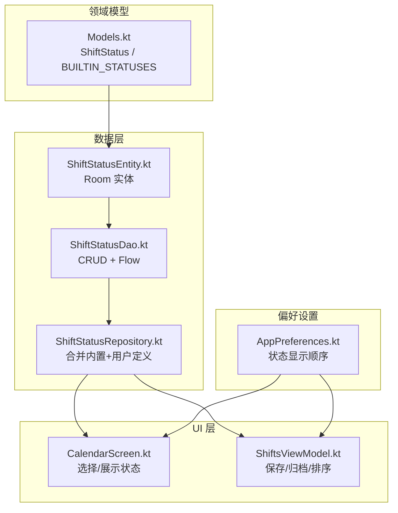
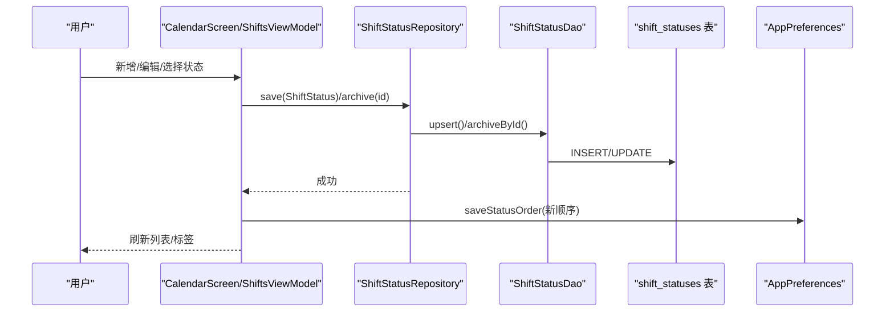
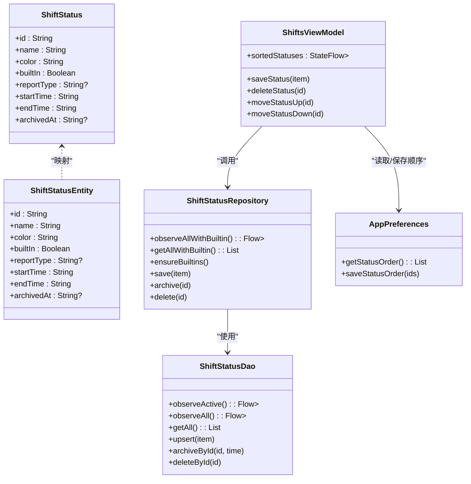
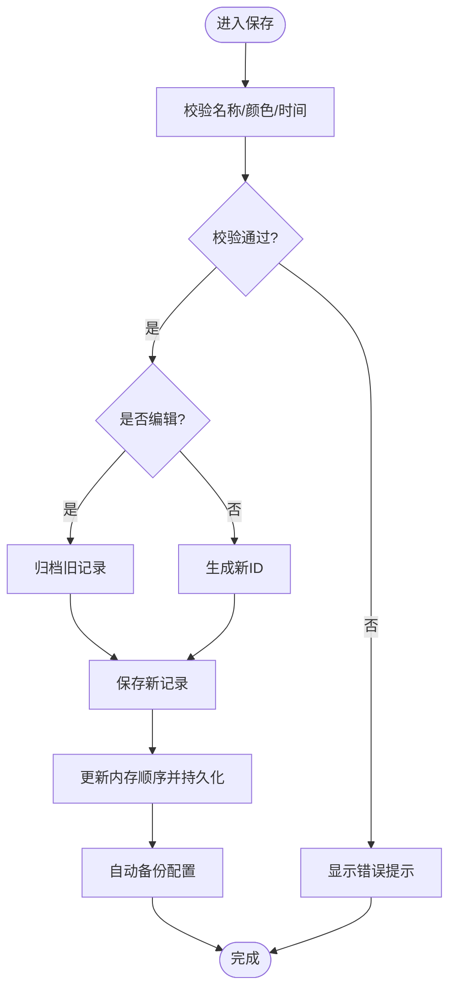

# 状态类型管理

<cite>
**本文引用的文件列表**
- [ShiftStatusEntity.kt](file://app/src/main/java/com/schedulecalendar/app/data/db/entity/ShiftStatusEntity.kt)
- [ShiftStatusDao.kt](file://app/src/main/java/com/schedulecalendar/app/data/db/dao/ShiftStatusDao.kt)
- [ShiftStatusRepository.kt](file://app/src/main/java/com/schedulecalendar/app/data/repository/ShiftStatusRepository.kt)
- [Models.kt](file://app/src/main/java/com/schedulecalendar/app/domain/model/Models.kt)
- [ScheduleRecordEntity.kt](file://app/src/main/java/com/schedulecalendar/app/data/db/entity/ScheduleRecordEntity.kt)
- [AppPreferences.kt](file://app/src/main/java/com/schedulecalendar/app/data/prefs/AppPreferences.kt)
- [CalendarScreen.kt](file://app/src/main/java/com/schedulecalendar/app/ui/calendar/CalendarScreen.kt)
- [ShiftsViewModel.kt](file://app/src/main/java/com/schedulecalendar/app/ui/shifts/ShiftsViewModel.kt)
</cite>

## 目录
1. [简介](#简介)
2. [项目结构](#项目结构)
3. [核心组件](#核心组件)
4. [架构总览](#架构总览)
5. [详细组件分析](#详细组件分析)
6. [依赖关系分析](#依赖关系分析)
7. [性能与排序机制](#性能与排序机制)
8. [数据验证与冲突检测](#数据验证与冲突检测)
9. [删除保护机制](#删除保护机制)
10. [使用示例与扩展指南](#使用示例与扩展指南)
11. [故障排查](#故障排查)
12. [结论](#结论)

## 简介
本文件围绕“状态类型管理系统”进行系统化说明，覆盖内置状态类型（请假、调休）的定义与实现、自定义状态的创建流程（名称、颜色、报表类型）、排序与优先级、与考勤记录的关联关系与应用逻辑、删除保护机制，以及数据验证与冲突检测方案。文档同时提供可落地的代码级参考路径，便于二次开发与定制。

## 项目结构
状态类型在数据层以实体表存储，通过 DAO 暴露查询与写入接口，由 Repository 聚合领域模型与持久化细节；UI 层在日历与排班编辑界面中展示和选择状态类型，并通过 ViewModel 驱动保存、归档与排序等交互。

图表来源
- [Models.kt](file://app/src/main/java/com/schedulecalendar/app/domain/model/Models.kt)
- [ShiftStatusEntity.kt](file://app/src/main/java/com/schedulecalendar/app/data/db/entity/ShiftStatusEntity.kt)
- [ShiftStatusDao.kt](file://app/src/main/java/com/schedulecalendar/app/data/db/dao/ShiftStatusDao.kt)
- [ShiftStatusRepository.kt](file://app/src/main/java/com/schedulecalendar/app/data/repository/ShiftStatusRepository.kt)
- [AppPreferences.kt](file://app/src/main/java/com/schedulecalendar/app/data/prefs/AppPreferences.kt)
- [CalendarScreen.kt](file://app/src/main/java/com/schedulecalendar/app/ui/calendar/CalendarScreen.kt)
- [ShiftsViewModel.kt](file://app/src/main/java/com/schedulecalendar/app/ui/shifts/ShiftsViewModel.kt)

章节来源
- [Models.kt](file://app/src/main/java/com/schedulecalendar/app/domain/model/Models.kt)
- [ShiftStatusEntity.kt](file://app/src/main/java/com/schedulecalendar/app/data/db/entity/ShiftStatusEntity.kt)
- [ShiftStatusDao.kt](file://app/src/main/java/com/schedulecalendar/app/data/db/dao/ShiftStatusDao.kt)
- [ShiftStatusRepository.kt](file://app/src/main/java/com/schedulecalendar/app/data/repository/ShiftStatusRepository.kt)
- [AppPreferences.kt](file://app/src/main/java/com/schedulecalendar/app/data/prefs/AppPreferences.kt)
- [CalendarScreen.kt](file://app/src/main/java/com/schedulecalendar/app/ui/calendar/CalendarScreen.kt)
- [ShiftsViewModel.kt](file://app/src/main/java/com/schedulecalendar/app/ui/shifts/ShiftsViewModel.kt)

## 核心组件
- 领域模型：ShiftStatus 表示一个状态类型，包含 id、name、color、builtIn、reportType、startTime、endTime、archivedAt 等字段；BUILTIN_STATUSES 定义了内置的请假与调休两类状态。
- 数据实体：ShiftStatusEntity 对应 Room 表 shift_statuses，字段与领域模型一致。
- 数据访问：ShiftStatusDao 提供 observeActive/observeAll、upsert、archiveById、deleteById 等操作，并支持按 builtIn 降序、name 升序排序。
- 仓储层：ShiftStatusRepository 负责合并内置与用户定义的状态，保证首次启动时内置状态存在，并提供 getAllWithBuiltin 等便捷方法。
- 偏好设置：AppPreferences 提供状态显示顺序的读写接口，供 UI 层组合排序。
- UI 与交互：CalendarScreen 展示并允许选择附加状态；ShiftsViewModel 负责新增/编辑/归档/排序状态类型，并在保存后自动备份配置。

章节来源
- [Models.kt](file://app/src/main/java/com/schedulecalendar/app/domain/model/Models.kt)
- [ShiftStatusEntity.kt](file://app/src/main/java/com/schedulecalendar/app/data/db/entity/ShiftStatusEntity.kt)
- [ShiftStatusDao.kt](file://app/src/main/java/com/schedulecalendar/app/data/db/dao/ShiftStatusDao.kt)
- [ShiftStatusRepository.kt](file://app/src/main/java/com/schedulecalendar/app/data/repository/ShiftStatusRepository.kt)
- [AppPreferences.kt](file://app/src/main/java/com/schedulecalendar/app/data/prefs/AppPreferences.kt)
- [CalendarScreen.kt](file://app/src/main/java/com/schedulecalendar/app/ui/calendar/CalendarScreen.kt)
- [ShiftsViewModel.kt](file://app/src/main/java/com/schedulecalendar/app/ui/shifts/ShiftsViewModel.kt)

## 架构总览
状态类型的生命周期从 UI 触发，经 ViewModel 调用 Repository，最终落到 DAO 与数据库；排序与显示顺序通过 DataStore 持久化，并在各页面组合计算。

图表来源
- [ShiftsViewModel.kt](file://app/src/main/java/com/schedulecalendar/app/ui/shifts/ShiftsViewModel.kt)
- [ShiftStatusRepository.kt](file://app/src/main/java/com/schedulecalendar/app/data/repository/ShiftStatusRepository.kt)
- [ShiftStatusDao.kt](file://app/src/main/java/com/schedulecalendar/app/data/db/dao/ShiftStatusDao.kt)
- [AppPreferences.kt](file://app/src/main/java/com/schedulecalendar/app/data/prefs/AppPreferences.kt)
- [CalendarScreen.kt](file://app/src/main/java/com/schedulecalendar/app/ui/calendar/CalendarScreen.kt)

## 详细组件分析

### 领域模型与内置类型
- ShiftStatus 字段说明：
  - id/name/color：唯一标识、显示名、颜色。
  - builtIn：是否为内置类型。
  - reportType：映射到报表类型，如 leave（请假工时）、swap（调休工时）。
  - startTime/endTime：可选的时间段限制，为空则不限制。
  - archivedAt：逻辑删除标记，null 为有效，非 null 为已归档。
- 内置状态：
  - 请假：reportType=leave，用于统计请假工时。
  - 调休：reportType=swap，用于统计调休工时。

章节来源
- [Models.kt](file://app/src/main/java/com/schedulecalendar/app/domain/model/Models.kt)

### 数据实体与 DAO
- 实体表 shift_statuses 包含 id、name、color、builtIn、reportType、startTime、endTime、archivedAt。
- DAO 关键能力：
  - observeActive：仅返回未归档状态，并按 builtIn 降序、name 升序排列。
  - observeAll/getAll：返回所有状态（含归档），排序规则同上。
  - upsert/upsertAll：插入或替换。
  - archiveById：逻辑删除（设置 archivedAt）。
  - deleteById/deleteAllUserDefined/deleteAll：物理删除。

章节来源
- [ShiftStatusEntity.kt](file://app/src/main/java/com/schedulecalendar/app/data/db/entity/ShiftStatusEntity.kt)
- [ShiftStatusDao.kt](file://app/src/main/java/com/schedulecalendar/app/data/db/dao/ShiftStatusDao.kt)

### 仓储层与内置保障
- ensureBuiltins：首次启动时确保内置状态存在于数据库中。
- observeAllWithBuiltin/getAllWithBuiltin：将内置与用户定义合并，去重且内置在前。
- save：仅保存非内置状态。
- archive/delete：归档或删除。

章节来源
- [ShiftStatusRepository.kt](file://app/src/main/java/com/schedulecalendar/app/data/repository/ShiftStatusRepository.kt)

### UI 展示与选择
- CalendarScreen 在单元格与详情区域展示班次与附加状态标签，支持在编辑界面选择状态类型。
- 当 DisplayScheme 配置了 STATUS 项时，才会显示附加状态标签。

章节来源
- [CalendarScreen.kt](file://app/src/main/java/com/schedulecalendar/app/ui/calendar/CalendarScreen.kt)

### 状态类型 CRUD 与排序
- ShiftsViewModel 提供：
  - saveStatus：新增/编辑（编辑时先归档旧记录再新建新 ID），新增时置顶并递增预设颜色索引。
  - deleteStatus：归档状态类型。
  - moveStatusUp/moveStatusDown：调整显示顺序，即时更新内存顺序并持久化到 DataStore。
- 排序策略：
  - 内存优先：UI 立即响应拖动/上移下移。
  - 持久化：通过 AppPreferences.saveStatusOrder 保存顺序。
  - 组合：sortedStatuses 将内存顺序与数据库结果合并，缺失项追加至末尾。

章节来源
- [ShiftsViewModel.kt](file://app/src/main/java/com/schedulecalendar/app/ui/shifts/ShiftsViewModel.kt)
- [AppPreferences.kt](file://app/src/main/java/com/schedulecalendar/app/data/prefs/AppPreferences.kt)

### 与考勤记录的关联
- ScheduleRecordEntity 使用 JSON 字段 appliedStatusesJson 存储 AppliedStatus 列表（statusId + 可选开始/结束时间）。
- 应用逻辑：
  - 若状态设置了 startTime/endTime，则在工时计算时可扣除相应时段。
  - reportType 决定该状态在报表中的归类（请假/调休）。

章节来源
- [ScheduleRecordEntity.kt](file://app/src/main/java/com/schedulecalendar/app/data/db/entity/ScheduleRecordEntity.kt)
- [Models.kt](file://app/src/main/java/com/schedulecalendar/app/domain/model/Models.kt)

## 依赖关系分析
- 低耦合分层：UI 仅依赖 ViewModel 与 Repository；Repository 封装 DAO 与领域转换；DAO 直接操作数据库。
- 内置与用户定义解耦：Repository 负责合并与去重，避免上层关心内置常量。
- 排序与显示分离：DataStore 只存顺序，UI 层组合排序，降低数据库压力。

图表来源
- [Models.kt](file://app/src/main/java/com/schedulecalendar/app/domain/model/Models.kt)
- [ShiftStatusEntity.kt](file://app/src/main/java/com/schedulecalendar/app/data/db/entity/ShiftStatusEntity.kt)
- [ShiftStatusDao.kt](file://app/src/main/java/com/schedulecalendar/app/data/db/dao/ShiftStatusDao.kt)
- [ShiftStatusRepository.kt](file://app/src/main/java/com/schedulecalendar/app/data/repository/ShiftStatusRepository.kt)
- [AppPreferences.kt](file://app/src/main/java/com/schedulecalendar/app/data/prefs/AppPreferences.kt)
- [ShiftsViewModel.kt](file://app/src/main/java/com/schedulecalendar/app/ui/shifts/ShiftsViewModel.kt)

## 性能与排序机制
- 观察型查询：observeActive/observeAll 基于 Flow，减少重复查询开销。
- 内存排序：ShiftsViewModel 维护内存顺序，避免频繁 IO；仅在变更时写 DataStore。
- 合并策略：sortedStatuses 将内存顺序与数据库结果合并，缺失项追加，保证稳定性与一致性。
- 默认排序：builtIn 降序、name 升序，确保内置始终靠前且用户定义稳定排序。

章节来源
- [ShiftStatusDao.kt](file://app/src/main/java/com/schedulecalendar/app/data/db/dao/ShiftStatusDao.kt)
- [ShiftsViewModel.kt](file://app/src/main/java/com/schedulecalendar/app/ui/shifts/ShiftsViewModel.kt)
- [AppPreferences.kt](file://app/src/main/java/com/schedulecalendar/app/data/prefs/AppPreferences.kt)

## 数据验证与冲突检测
- 名称唯一性：建议在保存前对当前有效（未归档）状态进行名称比对，防止重复。可在 ViewModel 的 saveStatus 中增加校验逻辑。
- 颜色格式：建议校验十六进制颜色格式，避免渲染异常。
- 时间段约束：若设置 startTime/endTime，需校验时间范围合法（早于结束时间且在 00:00~23:59 内）。
- 报表类型映射：reportType 应限定为 leave/swap/null，避免非法值影响报表统计。
- 冲突检测流程（建议）：
  - 读取当前有效状态集合。
  - 比较目标名称是否重复。
  - 校验颜色与时间格式。
  - 若全部通过，执行保存；否则返回错误提示。

章节来源
- [ShiftsViewModel.kt](file://app/src/main/java/com/schedulecalendar/app/ui/shifts/ShiftsViewModel.kt)
- [Models.kt](file://app/src/main/java/com/schedulecalendar/app/domain/model/Models.kt)

## 删除保护机制
- 逻辑删除：默认采用归档（设置 archivedAt），而非物理删除，避免历史引用断裂。
- 删除入口：
  - deleteStatus：归档状态类型。
  - deleteById：物理删除（谨慎使用，通常不建议）。
- 保护建议：
  - 禁止删除内置状态（builtIn=true）。
  - 删除前检查是否存在历史引用（例如 schedule_records.appliedStatusesJson 中包含该 statusId），若有则阻止删除或提示用户。
  - 提供“批量归档”功能，便于清理不再使用的自定义状态。

章节来源
- [ShiftStatusDao.kt](file://app/src/main/java/com/schedulecalendar/app/data/db/dao/ShiftStatusDao.kt)
- [ShiftsViewModel.kt](file://app/src/main/java/com/schedulecalendar/app/ui/shifts/ShiftsViewModel.kt)
- [ScheduleRecordEntity.kt](file://app/src/main/java/com/schedulecalendar/app/data/db/entity/ScheduleRecordEntity.kt)

## 使用示例与扩展指南

### 添加新的状态类型（步骤）
- 在领域模型侧确认 ShiftStatus 字段满足需求（必要时扩展）。
- 在 UI 层（ShiftsViewModel）新增保存逻辑：
  - 校验名称唯一性与颜色/时间格式。
  - 若为编辑，先归档旧记录，再生成新 ID 的新记录。
  - 保存后更新内存顺序并持久化到 DataStore。
- 在仓库层确保 save 仅处理非内置状态。
- 在 UI 层（CalendarScreen）确保新增状态能正确展示与选择。

参考路径
- [ShiftsViewModel.kt](file://app/src/main/java/com/schedulecalendar/app/ui/shifts/ShiftsViewModel.kt)
- [ShiftStatusRepository.kt](file://app/src/main/java/com/schedulecalendar/app/data/repository/ShiftStatusRepository.kt)
- [CalendarScreen.kt](file://app/src/main/java/com/schedulecalendar/app/ui/calendar/CalendarScreen.kt)

### 处理特殊业务逻辑（示例）
- 自定义报表类型：在 ShiftStatus.reportType 中扩展新枚举值，并在报表模块中适配。
- 时间段扣减：在工时计算逻辑中读取 startTime/endTime，扣除对应时长。
- 显示控制：根据 DisplayScheme 配置决定是否显示 STATUS 标签。

参考路径
- [Models.kt](file://app/src/main/java/com/schedulecalendar/app/domain/model/Models.kt)
- [CalendarScreen.kt](file://app/src/main/java/com/schedulecalendar/app/ui/calendar/CalendarScreen.kt)

### 流程图：保存状态类型

图表来源
- [ShiftsViewModel.kt](file://app/src/main/java/com/schedulecalendar/app/ui/shifts/ShiftsViewModel.kt)
- [ShiftStatusRepository.kt](file://app/src/main/java/com/schedulecalendar/app/data/repository/ShiftStatusRepository.kt)
- [AppPreferences.kt](file://app/src/main/java/com/schedulecalendar/app/data/prefs/AppPreferences.kt)

## 故障排查
- 状态未显示：
  - 检查 DisplayScheme 是否配置了 STATUS 项。
  - 确认状态未被归档（archivedAt 是否为空）。
- 排序异常：
  - 检查 DataStore 中的状态顺序是否正确保存。
  - 确认 sortedStatuses 的组合逻辑是否生效。
- 报表统计不正确：
  - 检查 reportType 是否设置为 leave/swap。
  - 确认 AppliedStatus 的 startTime/endTime 是否与期望一致。

章节来源
- [CalendarScreen.kt](file://app/src/main/java/com/schedulecalendar/app/ui/calendar/CalendarScreen.kt)
- [ShiftsViewModel.kt](file://app/src/main/java/com/schedulecalendar/app/ui/shifts/ShiftsViewModel.kt)
- [AppPreferences.kt](file://app/src/main/java/com/schedulecalendar/app/data/prefs/AppPreferences.kt)
- [Models.kt](file://app/src/main/java/com/schedulecalendar/app/domain/model/Models.kt)

## 结论
状态类型管理系统通过清晰的领域模型、稳健的数据层与灵活的 UI 交互，实现了内置与自定义状态的统一管理。借助逻辑删除、内存排序与偏好持久化，系统在易用性与数据完整性之间取得平衡。扩展新状态类型只需在领域模型、ViewModel 与 UI 层做最小改动，即可无缝集成到现有考勤与报表体系中。