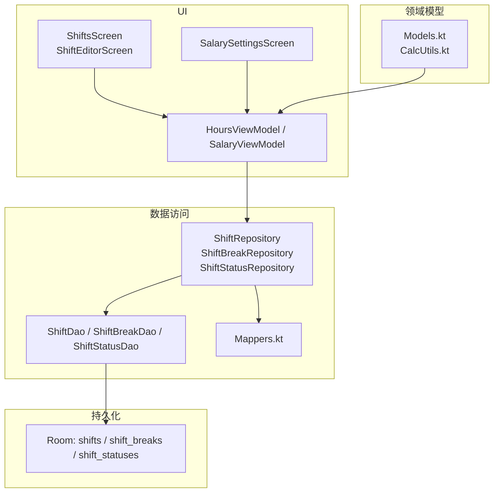
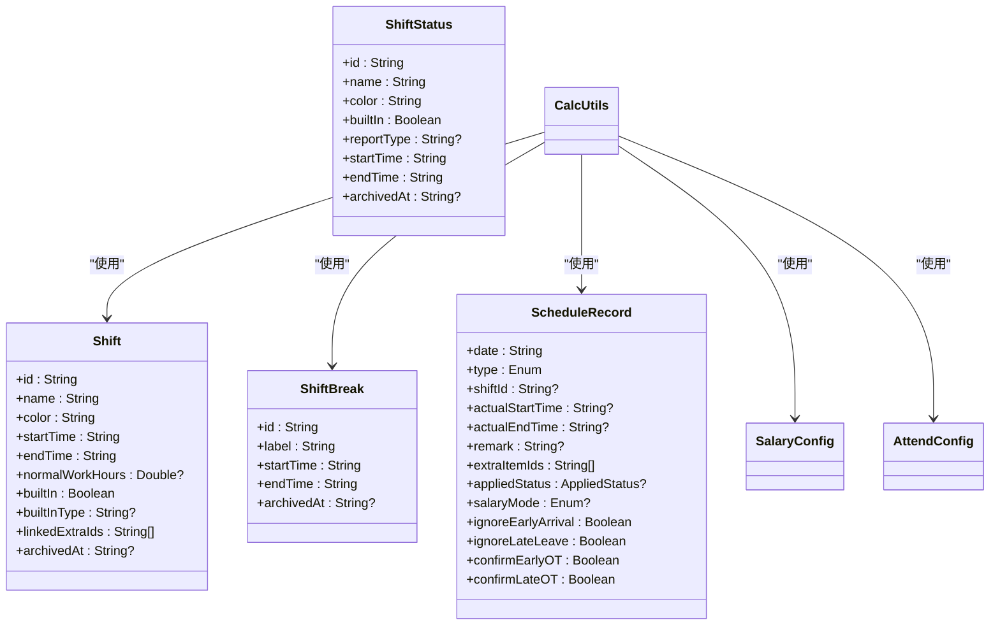
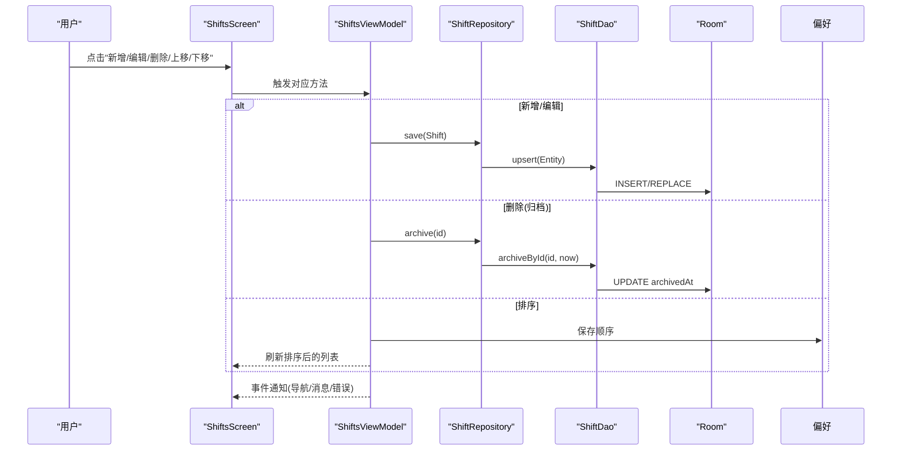
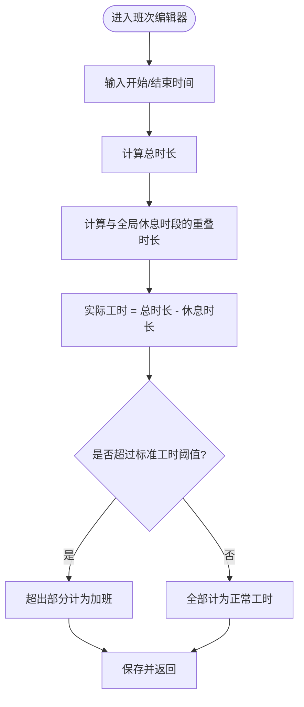
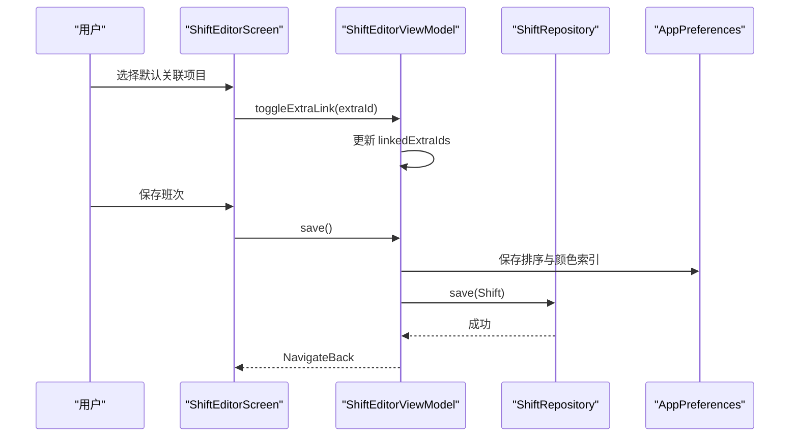
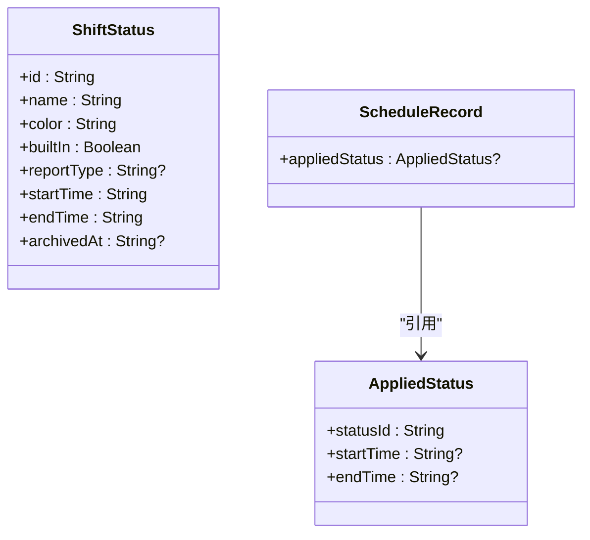
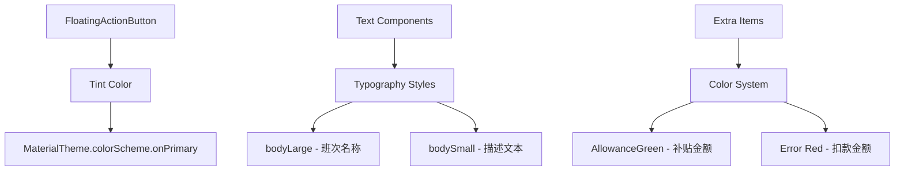
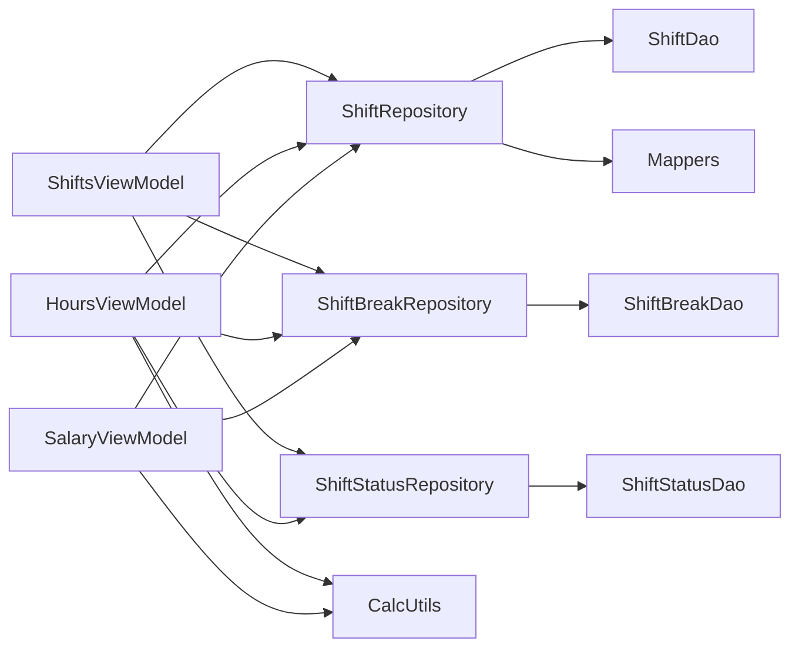

# 班次管理系统

<cite>
**本文引用的文件**   
- [ShiftEntity.kt](file://app/src/main/java/com/schedulecalendar/app/data/db/entity/ShiftEntity.kt)
- [ShiftBreakEntity.kt](file://app/src/main/java/com/schedulecalendar/app/data/db/entity/ShiftBreakEntity.kt)
- [ShiftStatusEntity.kt](file://app/src/main/java/com/schedulecalendar/app/data/db/entity/ShiftStatusEntity.kt)
- [Models.kt](file://app/src/main/java/com/schedulecalendar/app/domain/model/Models.kt)
- [CalcUtils.kt](file://app/src/main/java/com/schedulecalendar/app/domain/model/CalcUtils.kt)
- [Mappers.kt](file://app/src/main/java/com/schedulecalendar/app/data/repository/Mappers.kt)
- [ShiftRepository.kt](file://app/src/main/java/com/schedulecalendar/app/data/repository/ShiftRepository.kt)
- [ShiftDao.kt](file://app/src/main/java/com/schedulecalendar/app/data/db/dao/ShiftDao.kt)
- [ShiftBreakDao.kt](file://app/src/main/java/com/schedulecalendar/app/data/db/dao/ShiftBreakDao.kt)
- [ShiftStatusDao.kt](file://app/src/main/java/com/schedulecalendar/app/data/db/dao/ShiftStatusDao.kt)
- [ShiftsScreen.kt](file://app/src/main/java/com/schedulecalendar/app/ui/shifts/ShiftsScreen.kt)
- [ShiftEditorScreen.kt](file://app/src/main/java/com/schedulecalendar/app/ui/shifts/ShiftEditorScreen.kt)
- [ShiftsViewModel.kt](file://app/src/main/java/com/schedulecalendar/app/ui/shifts/ShiftsViewModel.kt)
- [SalarySettingsScreen.kt](file://app/src/main/java/com/schedulecalendar/app/ui/settings/SalarySettingsScreen.kt)
- [HoursViewModel.kt](file://app/src/main/java/com/schedulecalendar/app/ui/hours/HoursViewModel.kt)
- [SalaryViewModel.kt](file://app/src/main/java/com/schedulecalendar/app/ui/salary/SalaryViewModel.kt)
- [ExtraItemsScreen.kt](file://app/src/main/java/com/schedulecalendar/app/ui/detail/ExtraItemsScreen.kt)
- [Color.kt](file://app/src/main/java/com/schedulecalendar/app/ui/theme/Color.kt)
</cite>

## 更新摘要
**已完成的变更**   
- 更新了浮动操作按钮（FloatingActionButton）的颜色主题，从硬编码白色改为MaterialTheme.colorScheme.onPrimary
- 文本组件样式迁移到MaterialTheme.typography标准（班次名称使用bodyLarge，描述性文本使用bodySmall）
- 额外项目部分使用AllowanceGreen替代硬编码的绿色颜色
- 统一了UI组件的Material Design 3规范遵循

## 目录
1. [简介](#简介)
2. [项目结构](#项目结构)
3. [核心组件](#核心组件)
4. [架构总览](#架构总览)
5. [详细组件分析](#详细组件分析)
6. [依赖关系分析](#依赖关系分析)
7. [性能与扩展性](#性能与扩展性)
8. [故障排查指南](#故障排查指南)
9. [结论](#结论)
10. [附录：新增类型与规则示例路径](#附录新增类型与规则示例路径)

## 简介
本系统围绕"班次管理"展开，提供内置与自定义班次、全局休息时段、附加状态（请假/调休等）、补贴/扣款项的完整管理能力；同时提供工作时间配置、加班规则、计薪方式（正常/周末/节假日）以及按项目维度关联补贴/扣款的机制。系统支持班次的排序、归档与导入导出，具备完善的数据验证与业务规则校验，并通过计算工具统一处理工时与薪资统计。

**最新更新**：界面组件已全面采用Material Design 3设计规范，包括统一的色彩主题、字体排版和交互元素样式。

## 项目结构
- 领域模型层：定义班次、休息时段、状态类型、排班记录、薪资与考勤配置等核心数据结构与常量。
- 数据访问层：Room DAO + Repository，负责持久化、Flow 观察、内置数据合并与逻辑删除（归档）。
- UI 层：基于 Compose 的列表、编辑器与设置页，提供用户交互与即时反馈。
- 计算层：统一的工时与薪资计算工具，贯穿排班、工时、薪资页面。

**图表来源**
- [ShiftsScreen.kt:1-800](file://app/src/main/java/com/schedulecalendar/app/ui/shifts/ShiftsScreen.kt#L1-L800)
- [ShiftEditorScreen.kt:1-260](file://app/src/main/java/com/schedulecalendar/app/ui/shifts/ShiftEditorScreen.kt#L1-L260)
- [SalarySettingsScreen.kt:1-90](file://app/src/main/java/com/schedulecalendar/app/ui/settings/SalarySettingsScreen.kt#L1-L90)
- [HoursViewModel.kt:1-164](file://app/src/main/java/com/schedulecalendar/app/ui/hours/HoursViewModel.kt#L1-L164)
- [SalaryViewModel.kt:1-156](file://app/src/main/java/com/schedulecalendar/app/ui/salary/SalaryViewModel.kt#L1-L156)
- [Models.kt:1-277](file://app/src/main/java/com/schedulecalendar/app/domain/model/Models.kt#L1-L277)
- [CalcUtils.kt:1-536](file://app/src/main/java/com/schedulecalendar/app/domain/model/CalcUtils.kt#L1-L536)
- [ShiftRepository.kt:1-45](file://app/src/main/java/com/schedulecalendar/app/data/repository/ShiftRepository.kt#L1-L45)
- [ShiftDao.kt:1-42](file://app/src/main/java/com/schedulecalendar/app/data/db/dao/ShiftDao.kt#L1-L42)
- [ShiftBreakDao.kt:1-39](file://app/src/main/java/com/schedulecalendar/app/data/db/dao/ShiftBreakDao.kt#L1-L39)
- [ShiftStatusDao.kt:1-39](file://app/src/main/java/com/schedulecalendar/app/data/db/dao/ShiftStatusDao.kt#L1-L39)
- [Mappers.kt:1-134](file://app/src/main/java/com/schedulecalendar/app/data/repository/Mappers.kt#L1-L134)

## 核心组件
- 领域模型
  - 班次 Shift：包含名称、颜色、起止时间、标准工时阈值、是否内置、内置类型、默认关联的补贴/扣款 ID 列表、归档时间等。
  - 全局休息时段 ShiftBreak：标签、起止时间、归档时间。
  - 状态类型 ShiftStatus：名称、颜色、是否内置、报表映射（leave/swap）、可选起止时间、归档时间。
  - 排班记录 ScheduleRecord：日期、类型、关联班次、实际打卡时间、备注、额外项目、已应用状态、计薪模式、早到/晚退忽略与确认标志。
  - 薪资与考勤配置：SalaryConfig、AttendConfig。
- 数据访问
  - Repository 封装 Flow 观察、内置数据合并、归档与保存。
  - DAO 提供 Room 查询与写入接口。
  - Mappers 负责 Entity 与 Domain 的双向转换及 JSON 字段解析。
- UI 与 ViewModel
  - 班次管理页：列表、排序、编辑、删除（归档）、导入导出。
  - 班次编辑器：名称、时间、颜色、默认关联项目、时长预览。
  - 薪资设置页：时薪、底薪、绩效、社保公积金等。
  - 工时/薪资视图模型：聚合数据、调用 CalcUtils 计算并展示。

**章节来源**
- [Models.kt:1-277](file://app/src/main/java/com/schedulecalendar/app/domain/model/Models.kt#L1-L277)
- [ShiftRepository.kt:1-45](file://app/src/main/java/com/schedulecalendar/app/data/repository/ShiftRepository.kt#L1-L45)
- [ShiftDao.kt:1-42](file://app/src/main/java/com/schedulecalendar/app/data/db/dao/ShiftDao.kt#L1-L42)
- [ShiftBreakDao.kt:1-39](file://app/src/main/java/com/schedulecalendar/app/data/db/dao/ShiftBreakDao.kt#L1-L39)
- [ShiftStatusDao.kt:1-39](file://app/src/main/java/com/schedulecalendar/app/data/db/dao/ShiftStatusDao.kt#L1-L39)
- [Mappers.kt:1-134](file://app/src/main/java/com/schedulecalendar/app/data/repository/Mappers.kt#L1-L134)
- [ShiftsScreen.kt:1-800](file://app/src/main/java/com/schedulecalendar/app/ui/shifts/ShiftsScreen.kt#L1-L800)
- [ShiftEditorScreen.kt:1-260](file://app/src/main/java/com/schedulecalendar/app/ui/shifts/ShiftEditorScreen.kt#L1-L260)
- [SalarySettingsScreen.kt:1-90](file://app/src/main/java/com/schedulecalendar/app/ui/settings/SalarySettingsScreen.kt#L1-L90)
- [HoursViewModel.kt:1-164](file://app/src/main/java/com/schedulecalendar/app/ui/hours/HoursViewModel.kt#L1-L164)
- [SalaryViewModel.kt:1-156](file://app/src/main/java/com/schedulecalendar/app/ui/salary/SalaryViewModel.kt#L1-L156)

## 架构总览
系统采用分层架构：UI → ViewModel → Repository → DAO → Room 数据库；计算逻辑集中在 CalcUtils，供工时与薪资模块复用。

**图表来源**
- [Models.kt:1-277](file://app/src/main/java/com/schedulecalendar/app/domain/model/Models.kt#L1-L277)
- [CalcUtils.kt:1-536](file://app/src/main/java/com/schedulecalendar/app/domain/model/CalcUtils.kt#L1-L536)

## 详细组件分析

### 班次类型定义与管理机制
- 内置班次
  - 通过常量标识与固定列表提供"休息/调休/请假"等内置能力，参与排班选择与计算。
  - 内置类型用于在计算中识别特殊语义（如 REST/SWAP/LEAVE）。
- 自定义班次
  - 用户可创建、编辑、排序、归档；支持设置标准工时阈值以区分正常与加班。
  - 支持默认关联补贴/扣款项，便于快速为不同项目或场景预置计薪规则。
- 排序与归档
  - 排序顺序保存在偏好存储中，内存中即时生效；归档通过更新 archivedAt 实现逻辑删除。
- 模板与导入导出
  - 提供导出 JSON 与导入功能，支持覆盖/增量策略，便于在不同设备或项目间迁移配置。

**图表来源**
- [ShiftsScreen.kt:1-800](file://app/src/main/java/com/schedulecalendar/app/ui/shifts/ShiftsScreen.kt#L1-L800)
- [ShiftsViewModel.kt:1-455](file://app/src/main/java/com/schedulecalendar/app/ui/shifts/ShiftsViewModel.kt#L1-L455)
- [ShiftRepository.kt:1-45](file://app/src/main/java/com/schedulecalendar/app/data/repository/ShiftRepository.kt#L1-L45)
- [ShiftDao.kt:1-42](file://app/src/main/java/com/schedulecalendar/app/data/db/dao/ShiftDao.kt#L1-L42)

**章节来源**
- [Models.kt:1-277](file://app/src/main/java/com/schedulecalendar/app/domain/model/Models.kt#L1-L277)
- [ShiftsScreen.kt:1-800](file://app/src/main/java/com/schedulecalendar/app/ui/shifts/ShiftsScreen.kt#L1-L800)
- [ShiftsViewModel.kt:1-455](file://app/src/main/java/com/schedulecalendar/app/ui/shifts/ShiftsViewModel.kt#L1-L455)
- [ShiftRepository.kt:1-45](file://app/src/main/java/com/schedulecalendar/app/data/repository/ShiftRepository.kt#L1-L45)
- [ShiftDao.kt:1-42](file://app/src/main/java/com/schedulecalendar/app/data/db/dao/ShiftDao.kt#L1-L42)

### 工作时间配置系统
- 起止时间与时长预览
  - 编辑器实时计算总时长、扣除全局休息时段后得到实际工时，并在界面预览。
- 全局休息时段
  - 支持多段不计时段（午休、用餐等），跨天与重叠检测由编辑器完成，计算时按交集扣减。
- 加班规则
  - 粒度取整（分钟倍数）、迟到/早退容忍时长、忽略早到/晚退标记、确认加班计入标志等。
- 标准工时阈值
  - 优先使用班次自身 normalWorkHours，否则回退至考勤配置中的每日标准工时。

**图表来源**
- [ShiftEditorScreen.kt:1-260](file://app/src/main/java/com/schedulecalendar/app/ui/shifts/ShiftEditorScreen.kt#L1-L260)
- [CalcUtils.kt:1-536](file://app/src/main/java/com/schedulecalendar/app/domain/model/CalcUtils.kt#L1-L536)

**章节来源**
- [ShiftEditorScreen.kt:1-260](file://app/src/main/java/com/schedulecalendar/app/ui/shifts/ShiftEditorScreen.kt#L1-L260)
- [CalcUtils.kt:1-536](file://app/src/main/java/com/schedulecalendar/app/domain/model/CalcUtils.kt#L1-L536)

### 关联项目管理与计薪规则
- 默认关联补贴/扣款
  - 每个班次可预设多个补贴/扣款项 ID，排班时自动预选，便于为不同项目设置差异化计薪规则。
- 计薪方式
  - 支持手动指定或按日期自动判断（工作日/周末/法定节假日），影响工时分类与薪资计算。
- 薪资配置
  - 基础底薪、绩效、各类时薪、社保与公积金扣款等，统一在设置页维护。

**图表来源**
- [ShiftEditorScreen.kt:1-260](file://app/src/main/java/com/schedulecalendar/app/ui/shifts/ShiftEditorScreen.kt#L1-L260)
- [ShiftsViewModel.kt:330-455](file://app/src/main/java/com/schedulecalendar/app/ui/shifts/ShiftsViewModel.kt#L330-L455)
- [ShiftRepository.kt:1-45](file://app/src/main/java/com/schedulecalendar/app/data/repository/ShiftRepository.kt#L1-L45)

**章节来源**
- [Models.kt:1-277](file://app/src/main/java/com/schedulecalendar/app/domain/model/Models.kt#L1-L277)
- [ShiftEditorScreen.kt:1-260](file://app/src/main/java/com/schedulecalendar/app/ui/shifts/ShiftEditorScreen.kt#L1-L260)
- [ShiftsViewModel.kt:1-455](file://app/src/main/java/com/schedulecalendar/app/ui/shifts/ShiftsViewModel.kt#L1-L455)
- [SalarySettingsScreen.kt:1-90](file://app/src/main/java/com/schedulecalendar/app/ui/settings/SalarySettingsScreen.kt#L1-L90)

### 班次状态管理系统
- 内置状态
  - 请假、调休等内置状态，支持映射到报表类型（leave/swap）。
- 自定义状态
  - 用户可自定义名称、颜色、可选起止时间段；支持排序与归档。
- 应用状态
  - 排班记录可附加状态及其时间段，用于扣减工时或统计请假/调休小时。

**图表来源**
- [Models.kt:1-277](file://app/src/main/java/com/schedulecalendar/app/domain/model/Models.kt#L1-L277)

**章节来源**
- [Models.kt:1-277](file://app/src/main/java/com/schedulecalendar/app/domain/model/Models.kt#L1-L277)
- [ShiftsScreen.kt:1-800](file://app/src/main/java/com/schedulecalendar/app/ui/shifts/ShiftsScreen.kt#L1-L800)
- [ShiftsViewModel.kt:1-455](file://app/src/main/java/com/schedulecalendar/app/ui/shifts/ShiftsViewModel.kt#L1-L455)

### 数据验证与业务规则检查
- 名称唯一性与非空校验
  - 保存前对有效（未归档）记录进行重名检查，避免冲突。
- 时间完整性与重叠校验
  - 起止时间必填；全局休息时段新增/编辑时检测与其他时段的重叠。
- 归档一致性
  - 所有删除操作均为归档（逻辑删除），历史数据保持不变。
- 导入导出格式与容错
  - 导出包含版本与时间戳；导入支持覆盖/增量策略，失败时返回错误信息。

**章节来源**
- [ShiftsViewModel.kt:1-455](file://app/src/main/java/com/schedulecalendar/app/ui/shifts/ShiftsViewModel.kt#L1-L455)
- [ShiftsScreen.kt:1-800](file://app/src/main/java/com/schedulecalendar/app/ui/shifts/ShiftsScreen.kt#L1-L800)

### 界面设计与Material Design 3规范

**最新更新**：班次管理界面已全面采用Material Design 3设计规范，提升了视觉一致性和用户体验。

#### 浮动操作按钮（FloatingActionButton）主题化
- **变更内容**：将所有FloatingActionButton的tint颜色从硬编码的白色（`Color.White`）改为`MaterialTheme.colorScheme.onPrimary`
- **影响范围**：班次管理页面的新增按钮、状态类型按钮、补贴扣款按钮、休息时段按钮
- **设计优势**：确保按钮图标颜色与主题色保持一致，提供更好的视觉层次和可访问性

#### 文本组件样式标准化
- **变更内容**：班次名称文本使用`MaterialTheme.typography.bodyLarge`，描述性文本使用`MaterialTheme.typography.bodySmall`
- **影响范围**：班次列表项的名称显示、时间信息、关联项目数量等文本
- **设计优势**：统一的字体层级系统，提升可读性和视觉一致性

#### 额外项目颜色系统优化
- **变更内容**：补贴金额显示从硬编码绿色（`Color(0xFF059669)`）改为使用`AllowanceGreen`主题色
- **影响范围**：补贴项目的金额显示、状态指示器
- **设计优势**：通过主题色统一管理，支持深色模式和动态主题切换

**图表来源**
- [ShiftsScreen.kt:117-136](file://app/src/main/java/com/schedulecalendar/app/ui/shifts/ShiftsScreen.kt#L117-L136)
- [ShiftsScreen.kt:238-273](file://app/src/main/java/com/schedulecalendar/app/ui/shifts/ShiftsScreen.kt#L238-L273)
- [ShiftsScreen.kt:715-719](file://app/src/main/java/com/schedulecalendar/app/ui/shifts/ShiftsScreen.kt#L715-L719)
- [Color.kt:35](file://app/src/main/java/com/schedulecalendar/app/ui/theme/Color.kt#L35)

**章节来源**
- [ShiftsScreen.kt:117-136](file://app/src/main/java/com/schedulecalendar/app/ui/shifts/ShiftsScreen.kt#L117-L136)
- [ShiftsScreen.kt:238-273](file://app/src/main/java/com/schedulecalendar/app/ui/shifts/ShiftsScreen.kt#L238-L273)
- [ShiftsScreen.kt:715-719](file://app/src/main/java/com/schedulecalendar/app/ui/shifts/ShiftsScreen.kt#L715-L719)
- [Color.kt:35](file://app/src/main/java/com/schedulecalendar/app/ui/theme/Color.kt#L35)

## 依赖关系分析
- 低耦合高内聚
  - UI 仅依赖 ViewModel；ViewModel 通过 Repository 访问数据；DAO 专注 SQL；计算逻辑集中且无副作用。
- 直接依赖
  - ShiftsViewModel 依赖 ShiftRepository、ShiftBreakRepository、ShiftStatusRepository、偏好存储与备份管理器。
  - HoursViewModel/SalaryViewModel 依赖各 Repository 与 AppPreferences，调用 CalcUtils 进行计算。
- 间接依赖
  - Repository 通过 Mappers 将 Entity 转换为 Domain 对象，屏蔽 JSON 字段细节。

**图表来源**
- [ShiftsViewModel.kt:1-455](file://app/src/main/java/com/schedulecalendar/app/ui/shifts/ShiftsViewModel.kt#L1-L455)
- [HoursViewModel.kt:1-164](file://app/src/main/java/com/schedulecalendar/app/ui/hours/HoursViewModel.kt#L1-L164)
- [SalaryViewModel.kt:1-156](file://app/src/main/java/com/schedulecalendar/app/ui/salary/SalaryViewModel.kt#L1-L156)
- [ShiftRepository.kt:1-45](file://app/src/main/java/com/schedulecalendar/app/data/repository/ShiftRepository.kt#L1-L45)
- [ShiftDao.kt:1-42](file://app/src/main/java/com/schedulecalendar/app/data/db/dao/ShiftDao.kt#L1-L42)
- [ShiftBreakDao.kt:1-39](file://app/src/main/java/com/schedulecalendar/app/data/db/dao/ShiftBreakDao.kt#L1-L39)
- [ShiftStatusDao.kt:1-39](file://app/src/main/java/com/schedulecalendar/app/data/db/dao/ShiftStatusDao.kt#L1-L39)
- [Mappers.kt:1-134](file://app/src/main/java/com/schedulecalendar/app/data/repository/Mappers.kt#L1-L134)
- [CalcUtils.kt:1-536](file://app/src/main/java/com/schedulecalendar/app/domain/model/CalcUtils.kt#L1-L536)

**章节来源**
- [ShiftsViewModel.kt:1-455](file://app/src/main/java/com/schedulecalendar/app/ui/shifts/ShiftsViewModel.kt#L1-L455)
- [HoursViewModel.kt:1-164](file://app/src/main/java/com/schedulecalendar/app/ui/hours/HoursViewModel.kt#L1-L164)
- [SalaryViewModel.kt:1-156](file://app/src/main/java/com/schedulecalendar/app/ui/salary/SalaryViewModel.kt#L1-L156)
- [ShiftRepository.kt:1-45](file://app/src/main/java/com/schedulecalendar/app/data/repository/ShiftRepository.kt#L1-L45)
- [Mappers.kt:1-134](file://app/src/main/java/com/schedulecalendar/app/data/repository/Mappers.kt#L1-L134)
- [CalcUtils.kt:1-536](file://app/src/main/java/com/schedulecalendar/app/domain/model/CalcUtils.kt#L1-L536)

## 性能与扩展性
- 响应式更新
  - 使用 StateFlow 与 combine 实现排序与列表的即时响应，减少不必要的磁盘读取。
- 计算优化
  - 工时与薪资计算集中在 CalcUtils，避免重复逻辑；支持按日/月过滤与提前终止。
- 可扩展点
  - 新增内置/自定义班次类型：在 Models 中添加常量与列表项，或在编辑器中创建自定义班次。
  - 新增计薪规则：在 SalaryConfig 与 CalcUtils 中扩展费率与计算分支。
  - 新增状态类型：在 ShiftStatus 中增加新的 reportType 映射，并在计算中处理。

## 故障排查指南
- 保存失败
  - 检查名称是否为空或重复；确认起止时间是否完整；查看 ViewModel 的错误事件提示。
- 导入失败
  - 确认 JSON 结构与版本兼容；若覆盖失败，检查是否存在同名冲突或权限问题。
- 计算异常
  - 核对考勤配置（粒度、容忍时长）与班次标准工时阈值；检查全局休息时段是否与班次时间窗重叠。
- 归档与恢复
  - 删除操作为归档，不会物理删除；如需彻底清理，可使用"删除全部用户定义"类接口（谨慎使用）。

**章节来源**
- [ShiftsViewModel.kt:1-455](file://app/src/main/java/com/schedulecalendar/app/ui/shifts/ShiftsViewModel.kt#L1-L455)
- [ShiftsScreen.kt:1-800](file://app/src/main/java/com/schedulecalendar/app/ui/shifts/ShiftsScreen.kt#L1-L800)
- [CalcUtils.kt:1-536](file://app/src/main/java/com/schedulecalendar/app/domain/model/CalcUtils.kt#L1-L536)

## 结论
本系统以清晰的层次与职责划分，实现了从班次定义、工作时间配置、状态管理到工时与薪资计算的完整闭环。通过内置与自定义能力的结合、严格的验证与归档策略、以及灵活的导入导出机制，既满足日常排班需求，也为多项目差异化计薪提供了良好支撑。

**最新更新**：界面组件已全面采用Material Design 3设计规范，包括统一的色彩主题、字体排版和交互元素样式，显著提升了用户体验和视觉一致性。

## 附录：新增类型与规则示例路径
- 新增内置班次类型
  - 在领域模型中添加常量与内置列表项，参考：
    - [Models.kt:1-277](file://app/src/main/java/com/schedulecalendar/app/domain/model/Models.kt#L1-L277)
- 新增自定义班次
  - 使用编辑器创建并保存，参考：
    - [ShiftEditorScreen.kt:1-260](file://app/src/main/java/com/schedulecalendar/app/ui/shifts/ShiftEditorScreen.kt#L1-L260)
    - [ShiftsViewModel.kt:330-455](file://app/src/main/java/com/schedulecalendar/app/ui/shifts/ShiftsViewModel.kt#L330-L455)
- 新增计薪规则
  - 在薪资设置页配置费率，参考：
    - [SalarySettingsScreen.kt:1-90](file://app/src/main/java/com/schedulecalendar/app/ui/settings/SalarySettingsScreen.kt#L1-L90)
  - 在计算工具中扩展分类与汇总逻辑，参考：
    - [CalcUtils.kt:1-536](file://app/src/main/java/com/schedulecalendar/app/domain/model/CalcUtils.kt#L1-L536)
- 新增状态类型
  - 在状态类型页创建并保存，参考：
    - [ShiftsScreen.kt:1-800](file://app/src/main/java/com/schedulecalendar/app/ui/shifts/ShiftsScreen.kt#L1-L800)
    - [ShiftsViewModel.kt:1-455](file://app/src/main/java/com/schedulecalendar/app/ui/shifts/ShiftsViewModel.kt#L1-L455)
- 数据验证与归档
  - 保存前重名校验、时间重叠校验、归档逻辑，参考：
    - [ShiftsViewModel.kt:1-455](file://app/src/main/java/com/schedulecalendar/app/ui/shifts/ShiftsViewModel.kt#L1-L455)
    - [ShiftDao.kt:1-42](file://app/src/main/java/com/schedulecalendar/app/data/db/dao/ShiftDao.kt#L1-L42)
    - [ShiftBreakDao.kt:1-39](file://app/src/main/java/com/schedulecalendar/app/data/db/dao/ShiftBreakDao.kt#L1-L39)
    - [ShiftStatusDao.kt:1-39](file://app/src/main/java/com/schedulecalendar/app/data/db/dao/ShiftStatusDao.kt#L1-L39)
- 界面设计规范
  - Material Design 3主题应用，参考：
    - [ShiftsScreen.kt:117-136](file://app/src/main/java/com/schedulecalendar/app/ui/shifts/ShiftsScreen.kt#L117-L136)
    - [Color.kt:35](file://app/src/main/java/com/schedulecalendar/app/ui/theme/Color.kt#L35)