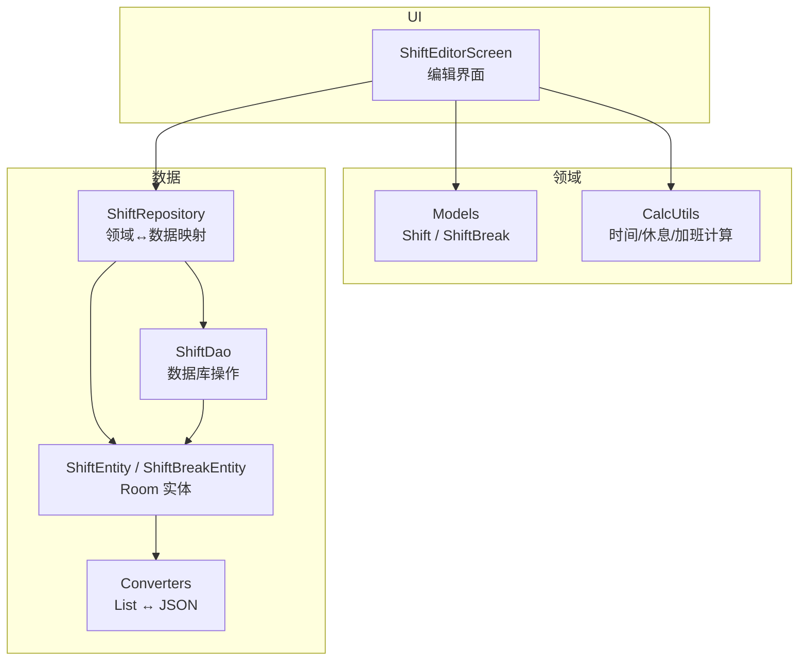
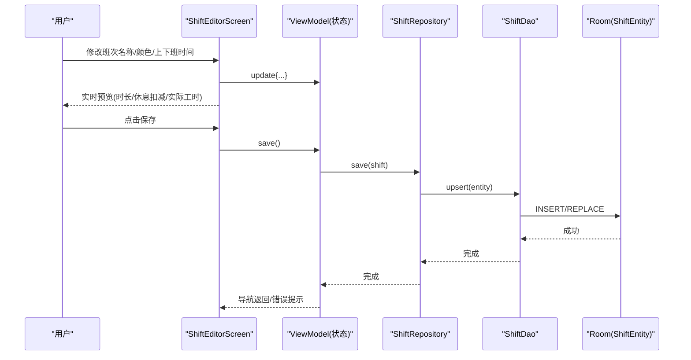
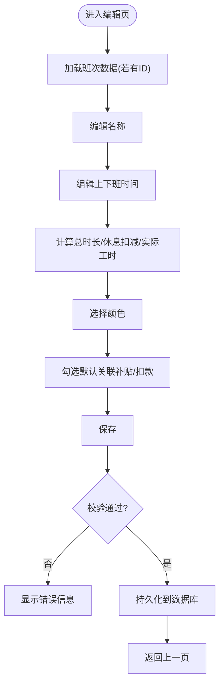
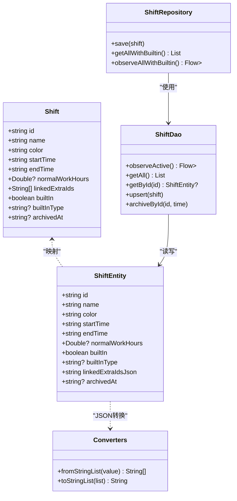
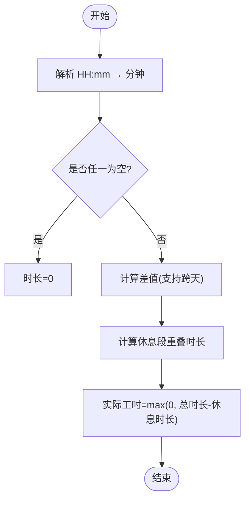
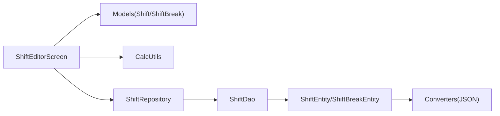

# 班次编辑器

<cite>
**本文引用的文件**   
- [ShiftEditorScreen.kt](file://app/src/main/java/com/schedulecalendar/app/ui/shifts/ShiftEditorScreen.kt)
- [Models.kt](file://app/src/main/java/com/schedulecalendar/app/domain/model/Models.kt)
- [CalcUtils.kt](file://app/src/main/java/com/schedulecalendar/app/domain/model/CalcUtils.kt)
- [ShiftEntity.kt](file://app/src/main/java/com/schedulecalendar/app/data/db/entity/ShiftEntity.kt)
- [ShiftBreakEntity.kt](file://app/src/main/java/com/schedulecalendar/app/data/db/entity/ShiftBreakEntity.kt)
- [ShiftDao.kt](file://app/src/main/java/com/schedulecalendar/app/data/db/dao/ShiftDao.kt)
- [ShiftRepository.kt](file://app/src/main/java/com/schedulecalendar/app/data/repository/ShiftRepository.kt)
- [Converters.kt](file://app/src/main/java/com/schedulecalendar/app/data/db/Converters.kt)
</cite>

## 目录
1. [简介](#简介)
2. [项目结构](#项目结构)
3. [核心组件](#核心组件)
4. [架构总览](#架构总览)
5. [详细组件分析](#详细组件分析)
6. [依赖关系分析](#依赖关系分析)
7. [性能与扩展性](#性能与扩展性)
8. [故障排查指南](#故障排查指南)
9. [结论](#结论)
10. [附录：扩展新属性的实现方案](#附录扩展新属性的实现方案)

## 简介
本文件围绕“班次编辑器”进行系统化文档化，覆盖以下关键能力：
- 班次名称、颜色设置、工作时间配置等核心字段的管理
- 开始时间与结束时间的输入校验与合理性检查
- 休息时段（全局不计入工时）的配置与计算
- 加班计算规则（正常班时长阈值）的自定义与联动
- 关联补贴/扣款项目的绑定机制
- 数据验证与业务规则检查的实现思路
- 如何扩展新的班次属性（以代码级路径指引为主）

## 项目结构
与班次编辑器直接相关的代码分布在 UI、领域模型、数据层三个层次：
- UI 层：ShiftEditorScreen 负责编辑界面交互与实时预览
- 领域层：Models 定义 Shift、ShiftBreak 等核心数据结构；CalcUtils 提供时间差、休息段扣减、加班阈值等计算
- 数据层：ShiftEntity/ShiftBreakEntity 为持久化实体；ShiftDao 提供数据库访问；ShiftRepository 封装领域对象与实体的转换与查询；Converters 处理复杂类型序列化

图表来源
- [ShiftEditorScreen.kt:1-260](file://app/src/main/java/com/schedulecalendar/app/ui/shifts/ShiftEditorScreen.kt#L1-L260)
- [Models.kt:51-65](file://app/src/main/java/com/schedulecalendar/app/domain/model/Models.kt#L51-L65)
- [CalcUtils.kt:40-47](file://app/src/main/java/com/schedulecalendar/app/domain/model/CalcUtils.kt#L40-L47)
- [ShiftEntity.kt:9-23](file://app/src/main/java/com/schedulecalendar/app/data/db/entity/ShiftEntity.kt#L9-L23)
- [ShiftBreakEntity.kt:9-15](file://app/src/main/java/com/schedulecalendar/app/data/db/entity/ShiftBreakEntity.kt#L9-L15)
- [ShiftDao.kt:8-41](file://app/src/main/java/com/schedulecalendar/app/data/db/dao/ShiftDao.kt#L8-L41)
- [ShiftRepository.kt:12-44](file://app/src/main/java/com/schedulecalendar/app/data/repository/ShiftRepository.kt#L12-L44)
- [Converters.kt:9-16](file://app/src/main/java/com/schedulecalendar/app/data/db/Converters.kt#L9-L16)

章节来源
- [ShiftEditorScreen.kt:1-260](file://app/src/main/java/com/schedulecalendar/app/ui/shifts/ShiftEditorScreen.kt#L1-L260)
- [Models.kt:51-65](file://app/src/main/java/com/schedulecalendar/app/domain/model/Models.kt#L51-L65)
- [CalcUtils.kt:121-134](file://app/src/main/java/com/schedulecalendar/app/domain/model/CalcUtils.kt#L121-L134)
- [ShiftEntity.kt:9-23](file://app/src/main/java/com/schedulecalendar/app/data/db/entity/ShiftEntity.kt#L9-L23)
- [ShiftBreakEntity.kt:9-15](file://app/src/main/java/com/schedulecalendar/app/data/db/entity/ShiftBreakEntity.kt#L9-L15)
- [ShiftDao.kt:8-41](file://app/src/main/java/com/schedulecalendar/app/data/db/dao/ShiftDao.kt#L8-L41)
- [ShiftRepository.kt:12-44](file://app/src/main/java/com/schedulecalendar/app/data/repository/ShiftRepository.kt#L12-L44)
- [Converters.kt:9-16](file://app/src/main/java/com/schedulecalendar/app/data/db/Converters.kt#L9-L16)

## 核心组件
- 班次模型（Shift）
  - 关键字段：id、name、color、startTime、endTime、normalWorkHours、linkedExtraIds、builtIn/builtInType、archivedAt
  - normalWorkHours 用于决定加班起始点：若为空则不限制加班分界；若大于0，则超出该阈值的工时计为加班
- 全局休息时段（ShiftBreak）
  - 对全部班次生效，表示不计入工时的时间段（如午休、用餐），支持跨天
- 计算工具（CalcUtils）
  - calcHourDiff：计算 HH:mm 时间差（支持跨天）
  - calcGlobalBreakHours：计算全局休息段与班次时间窗口的重叠时长
  - 其他：考勤粒度、周末/节假日判定、薪资汇总等（与加班计算相关）

章节来源
- [Models.kt:51-65](file://app/src/main/java/com/schedulecalendar/app/domain/model/Models.kt#L51-L65)
- [Models.kt:14-20](file://app/src/main/java/com/schedulecalendar/app/domain/model/Models.kt#L14-L20)
- [CalcUtils.kt:40-47](file://app/src/main/java/com/schedulecalendar/app/domain/model/CalcUtils.kt#L40-L47)
- [CalcUtils.kt:121-134](file://app/src/main/java/com/schedulecalendar/app/domain/model/CalcUtils.kt#L121-L134)

## 架构总览
班次编辑器的数据流遵循 MVVM + Repository 模式：
- UI 通过 ViewModel 暴露的状态驱动界面更新
- 保存时由 Repository 将领域对象转换为 Entity 并写入数据库
- 计算逻辑集中在 CalcUtils，保证可测试性与复用性

图表来源
- [ShiftEditorScreen.kt:222-228](file://app/src/main/java/com/schedulecalendar/app/ui/shifts/ShiftEditorScreen.kt#L222-L228)
- [ShiftRepository.kt:37-39](file://app/src/main/java/com/schedulecalendar/app/data/repository/ShiftRepository.kt#L37-L39)
- [ShiftDao.kt:23-27](file://app/src/main/java/com/schedulecalendar/app/data/db/dao/ShiftDao.kt#L23-L27)
- [ShiftEntity.kt:9-23](file://app/src/main/java/com/schedulecalendar/app/data/db/entity/ShiftEntity.kt#L9-L23)

## 详细组件分析

### 编辑界面与字段管理（ShiftEditorScreen）
- 班次名称
  - 必填校验与重复提示在界面层通过错误消息展示
- 上班时间/下班时间
  - 使用 TimePickerField 输入，即时触发状态更新
  - 长度与完整性校验失败时显示统一错误提示
- 时长预览
  - 总时长 = calcHourDiff(startTime, endTime)
  - 休息/用餐时长 = calcGlobalBreakHours(...)
  - 实际工时 = max(0, 总时长 - 休息时长)
- 颜色选择
  - 使用 ColorPicker 选择，并在标签上实时预览
- 默认关联补贴/扣款项
  - 以 FilterChip 形式多选，内部维护 linkedExtraIds 集合
- 保存
  - 调用 ViewModel 的保存方法，成功后导航返回或展示错误

图表来源
- [ShiftEditorScreen.kt:66-84](file://app/src/main/java/com/schedulecalendar/app/ui/shifts/ShiftEditorScreen.kt#L66-L84)
- [ShiftEditorScreen.kt:86-111](file://app/src/main/java/com/schedulecalendar/app/ui/shifts/ShiftEditorScreen.kt#L86-L111)
- [ShiftEditorScreen.kt:114-136](file://app/src/main/java/com/schedulecalendar/app/ui/shifts/ShiftEditorScreen.kt#L114-L136)
- [ShiftEditorScreen.kt:138-177](file://app/src/main/java/com/schedulecalendar/app/ui/shifts/ShiftEditorScreen.kt#L138-L177)
- [ShiftEditorScreen.kt:179-211](file://app/src/main/java/com/schedulecalendar/app/ui/shifts/ShiftEditorScreen.kt#L179-L211)
- [ShiftEditorScreen.kt:222-228](file://app/src/main/java/com/schedulecalendar/app/ui/shifts/ShiftEditorScreen.kt#L222-L228)

章节来源
- [ShiftEditorScreen.kt:1-260](file://app/src/main/java/com/schedulecalendar/app/ui/shifts/ShiftEditorScreen.kt#L1-L260)

### 数据模型与持久化（Models / Entities / DAO / Repository）
- 领域模型 Shift
  - 包含 name、color、startTime、endTime、normalWorkHours、linkedExtraIds 等
- 实体 ShiftEntity
  - 对应 Room 表字段，其中 linkedExtraIdsJson 存储 JSON 数组
- 转换器 Converters
  - List<String> 与 JSON String 互转
- 数据访问 ShiftDao
  - 提供 upsert、getAll、getById、archive 等操作
- 仓库 ShiftRepository
  - 负责领域对象与实体的双向转换，屏蔽内置/归档等细节

图表来源
- [Models.kt:51-65](file://app/src/main/java/com/schedulecalendar/app/domain/model/Models.kt#L51-L65)
- [ShiftEntity.kt:9-23](file://app/src/main/java/com/schedulecalendar/app/data/db/entity/ShiftEntity.kt#L9-L23)
- [ShiftDao.kt:8-41](file://app/src/main/java/com/schedulecalendar/app/data/db/dao/ShiftDao.kt#L8-L41)
- [ShiftRepository.kt:12-44](file://app/src/main/java/com/schedulecalendar/app/data/repository/ShiftRepository.kt#L12-L44)
- [Converters.kt:9-16](file://app/src/main/java/com/schedulecalendar/app/data/db/Converters.kt#L9-L16)

章节来源
- [Models.kt:51-65](file://app/src/main/java/com/schedulecalendar/app/domain/model/Models.kt#L51-L65)
- [ShiftEntity.kt:9-23](file://app/src/main/java/com/schedulecalendar/app/data/db/entity/ShiftEntity.kt#L9-L23)
- [ShiftDao.kt:8-41](file://app/src/main/java/com/schedulecalendar/app/data/db/dao/ShiftDao.kt#L8-L41)
- [ShiftRepository.kt:12-44](file://app/src/main/java/com/schedulecalendar/app/data/repository/ShiftRepository.kt#L12-L44)
- [Converters.kt:9-16](file://app/src/main/java/com/schedulecalendar/app/data/db/Converters.kt#L9-L16)

### 时间输入校验与合理性检查
- 格式校验
  - 采用 HH:mm 字符串，解析为分钟数后参与计算
- 合理性检查
  - 支持跨天：当结束时间小于开始时间时，自动按次日处理
  - 空值保护：任一时间为空则时长为 0
- 休息段扣减
  - 计算全局休息段与班次时间窗口的交集，累加后从总时长中扣除
- 实际工时
  - 取 max(0, 总时长 - 休息时长)，避免负值

图表来源
- [CalcUtils.kt:40-47](file://app/src/main/java/com/schedulecalendar/app/domain/model/CalcUtils.kt#L40-L47)
- [CalcUtils.kt:121-134](file://app/src/main/java/com/schedulecalendar/app/domain/model/CalcUtils.kt#L121-L134)
- [ShiftEditorScreen.kt:114-136](file://app/src/main/java/com/schedulecalendar/app/ui/shifts/ShiftEditorScreen.kt#L114-L136)

章节来源
- [CalcUtils.kt:40-47](file://app/src/main/java/com/schedulecalendar/app/domain/model/CalcUtils.kt#L40-L47)
- [CalcUtils.kt:121-134](file://app/src/main/java/com/schedulecalendar/app/domain/model/CalcUtils.kt#L121-L134)
- [ShiftEditorScreen.kt:114-136](file://app/src/main/java/com/schedulecalendar/app/ui/shifts/ShiftEditorScreen.kt#L114-L136)

### 休息时段配置与计算
- 休息时段为全局配置，对所有班次生效
- 支持跨天休息段与跨天班次的重叠计算
- 计算结果用于时长预览与实际工时推导

章节来源
- [Models.kt:14-20](file://app/src/main/java/com/schedulecalendar/app/domain/model/Models.kt#L14-L20)
- [ShiftBreakEntity.kt:9-15](file://app/src/main/java/com/schedulecalendar/app/data/db/entity/ShiftBreakEntity.kt#L9-L15)
- [CalcUtils.kt:121-134](file://app/src/main/java/com/schedulecalendar/app/domain/model/CalcUtils.kt#L121-L134)

### 加班计算规则与自定义配置
- 加班起始时间
  - 由 Shift.normalWorkHours 控制：若为空则不限制加班分界；若大于0，则超过该小时数的部分计为加班
- 倍率设置
  - 加班倍率属于薪资配置范畴，不在班次编辑器内直接设置；此处仅说明加班起始点的来源
- 与考勤粒度的联动
  - 考勤粒度影响实际打卡时间映射，进而影响加班时长（详见 CalcUtils 中的考勤处理）

章节来源
- [Models.kt:51-65](file://app/src/main/java/com/schedulecalendar/app/domain/model/Models.kt#L51-L65)
- [CalcUtils.kt:61-113](file://app/src/main/java/com/schedulecalendar/app/domain/model/CalcUtils.kt#L61-L113)

### 关联补贴/扣款项目的绑定机制
- 界面层以 FilterChip 多选方式维护 linkedExtraIds
- 保存时将列表序列化为 JSON 字符串存入数据库
- 读取时反序列化为 List<String>，供排班时预选默认项目

章节来源
- [ShiftEditorScreen.kt:179-211](file://app/src/main/java/com/schedulecalendar/app/ui/shifts/ShiftEditorScreen.kt#L179-L211)
- [ShiftEntity.kt:20-21](file://app/src/main/java/com/schedulecalendar/app/data/db/entity/ShiftEntity.kt#L20-L21)
- [Converters.kt:12-15](file://app/src/main/java/com/schedulecalendar/app/data/db/Converters.kt#L12-L15)

## 依赖关系分析
- UI 依赖领域模型与计算工具，不直接访问数据库
- Repository 作为边界，屏蔽内置/归档/转换等细节
- DAO 仅关注 SQL 与实体映射
- 转换器集中处理复杂类型的序列化

图表来源
- [ShiftEditorScreen.kt:1-260](file://app/src/main/java/com/schedulecalendar/app/ui/shifts/ShiftEditorScreen.kt#L1-L260)
- [Models.kt:51-65](file://app/src/main/java/com/schedulecalendar/app/domain/model/Models.kt#L51-L65)
- [CalcUtils.kt:40-47](file://app/src/main/java/com/schedulecalendar/app/domain/model/CalcUtils.kt#L40-L47)
- [ShiftRepository.kt:12-44](file://app/src/main/java/com/schedulecalendar/app/data/repository/ShiftRepository.kt#L12-L44)
- [ShiftDao.kt:8-41](file://app/src/main/java/com/schedulecalendar/app/data/db/dao/ShiftDao.kt#L8-L41)
- [ShiftEntity.kt:9-23](file://app/src/main/java/com/schedulecalendar/app/data/db/entity/ShiftEntity.kt#L9-L23)
- [Converters.kt:9-16](file://app/src/main/java/com/schedulecalendar/app/data/db/Converters.kt#L9-L16)

章节来源
- [ShiftEditorScreen.kt:1-260](file://app/src/main/java/com/schedulecalendar/app/ui/shifts/ShiftEditorScreen.kt#L1-L260)
- [ShiftRepository.kt:12-44](file://app/src/main/java/com/schedulecalendar/app/data/repository/ShiftRepository.kt#L12-L44)
- [ShiftDao.kt:8-41](file://app/src/main/java/com/schedulecalendar/app/data/db/dao/ShiftDao.kt#L8-L41)
- [ShiftEntity.kt:9-23](file://app/src/main/java/com/schedulecalendar/app/data/db/entity/ShiftEntity.kt#L9-L23)
- [Converters.kt:9-16](file://app/src/main/java/com/schedulecalendar/app/data/db/Converters.kt#L9-L16)

## 性能与扩展性
- 计算复杂度
  - 时长与休息段计算均为 O(n)（n 为休息段数量），单次编辑预览开销极低
- 渲染优化
  - 使用 Compose 状态驱动，局部重组，避免全量刷新
- 可扩展性
  - 新增班次属性建议优先在领域模型与实体同步扩展，并通过 Repository 的 toDomain/toEntity 映射保持一致
  - 如需引入更复杂的校验或计算，建议在 CalcUtils 中新增函数，保持 UI 无副作用

[本节为通用指导，无需源码引用]

## 故障排查指南
- 名称重复或为空
  - 界面层会显示相应错误提示，请根据提示修正
- 时间不完整
  - 若未完整输入上下班时间，将提示需要完整输入
- 时长异常
  - 检查是否存在跨天情况；确认休息段是否与班次窗口存在有效重叠
- 保存失败
  - 检查数据库权限与迁移脚本；确认 linkedExtraIds 是否为合法 JSON 数组

章节来源
- [ShiftEditorScreen.kt:66-84](file://app/src/main/java/com/schedulecalendar/app/ui/shifts/ShiftEditorScreen.kt#L66-L84)
- [ShiftEditorScreen.kt:86-111](file://app/src/main/java/com/schedulecalendar/app/ui/shifts/ShiftEditorScreen.kt#L86-L111)
- [ShiftEditorScreen.kt:114-136](file://app/src/main/java/com/schedulecalendar/app/ui/shifts/ShiftEditorScreen.kt#L114-L136)

## 结论
班次编辑器以清晰的 MVVM 分层组织，结合领域计算工具与数据仓库，实现了：
- 直观的字段编辑与实时预览
- 严谨的时间与休息段计算
- 灵活的加班阈值与补贴/扣款绑定
- 良好的可扩展性与可维护性

[本节为总结，无需源码引用]

## 附录：扩展新属性的实现方案
目标：为班次新增一个布尔型属性（例如“允许跨天标记”），并确保在编辑、保存、读取全流程可用。

步骤概览
- 领域模型
  - 在 Shift 中添加新字段，并提供合理的默认值
- 数据实体
  - 在 ShiftEntity 中添加对应列，保持命名一致
- 类型转换
  - 若为新类型，需在 Converters 中补充 TypeConverter
- 仓库映射
  - 在 Repository 的 toDomain/toEntity 中增加字段映射
- 数据访问
  - 确保 DAO 的 SQL 能读写新列（Room 会自动处理新增列）
- UI 编辑
  - 在 ShiftEditorScreen 中增加对应的输入控件与状态更新
- 计算与校验
  - 如有业务影响，将逻辑放入 CalcUtils 或专门的校验函数
- 迁移
  - 若已有数据库版本，需添加 Migration 以兼容旧数据

参考路径（仅列出关键位置，不包含具体代码）
- 领域模型定义：[Models.kt:51-65](file://app/src/main/java/com/schedulecalendar/app/domain/model/Models.kt#L51-L65)
- 数据实体定义：[ShiftEntity.kt:9-23](file://app/src/main/java/com/schedulecalendar/app/data/db/entity/ShiftEntity.kt#L9-L23)
- 类型转换器：[Converters.kt:9-16](file://app/src/main/java/com/schedulecalendar/app/data/db/Converters.kt#L9-L16)
- 仓库映射与保存：[ShiftRepository.kt:37-39](file://app/src/main/java/com/schedulecalendar/app/data/repository/ShiftRepository.kt#L37-L39)
- 数据库访问接口：[ShiftDao.kt:23-27](file://app/src/main/java/com/schedulecalendar/app/data/db/dao/ShiftDao.kt#L23-L27)
- 编辑界面集成：[ShiftEditorScreen.kt:66-84](file://app/src/main/java/com/schedulecalendar/app/ui/shifts/ShiftEditorScreen.kt#L66-L84)、[ShiftEditorScreen.kt:222-228](file://app/src/main/java/com/schedulecalendar/app/ui/shifts/ShiftEditorScreen.kt#L222-L228)

[本节为扩展指导，无需源码引用]