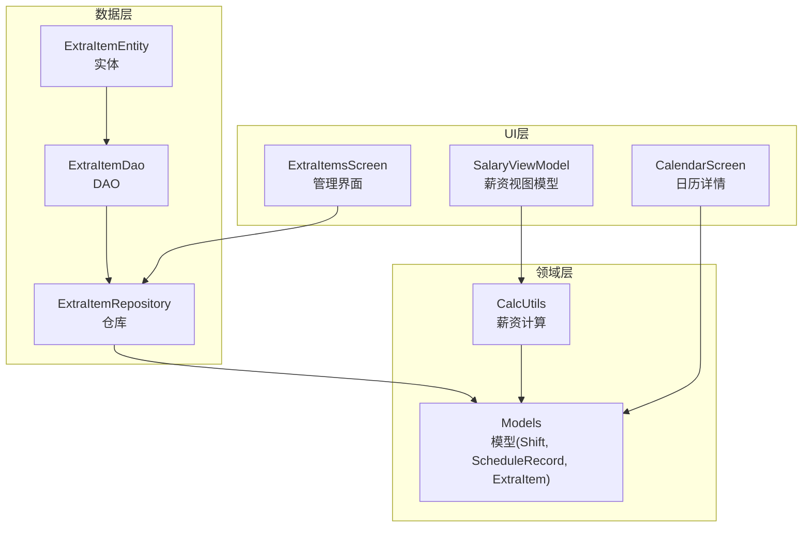
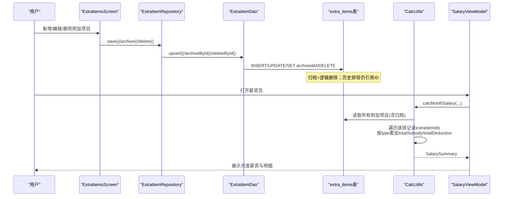
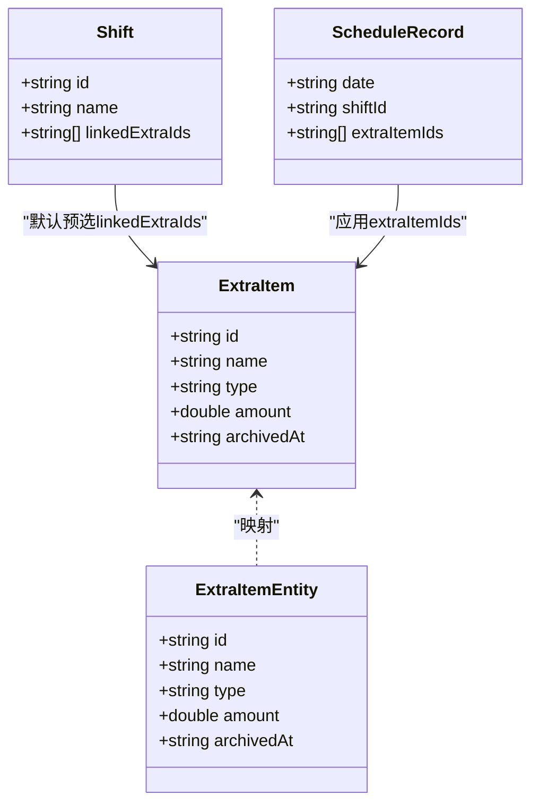
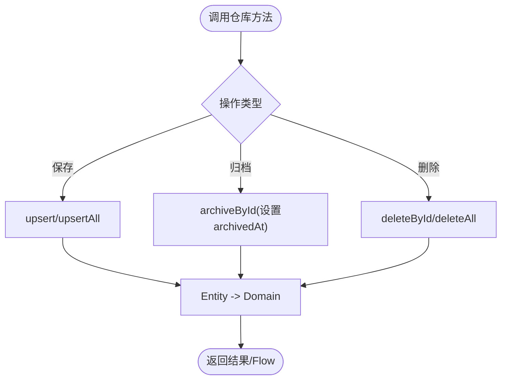
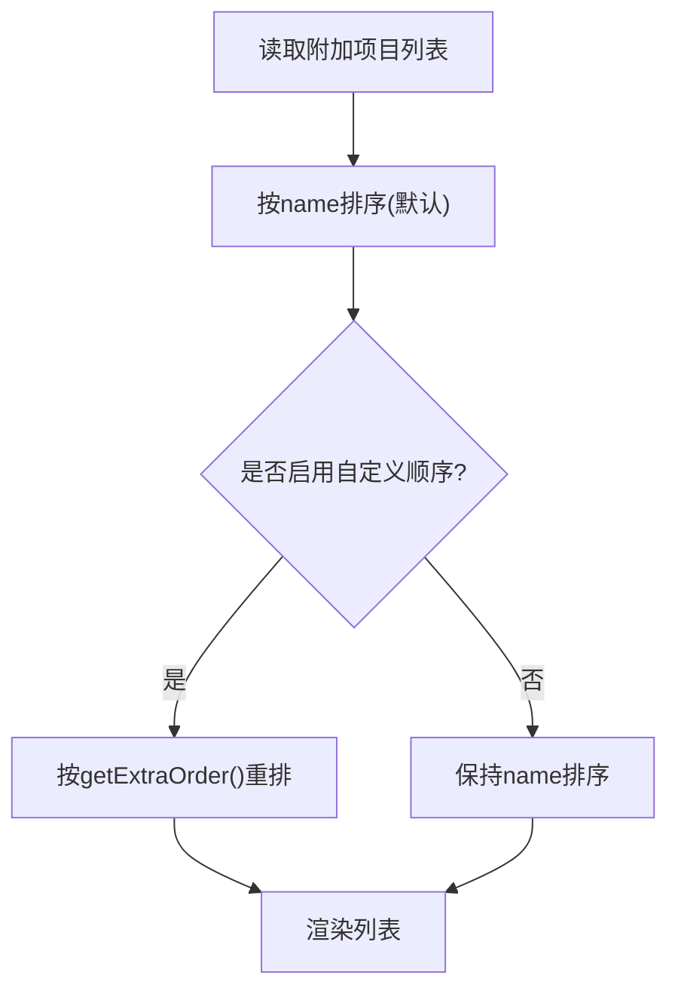
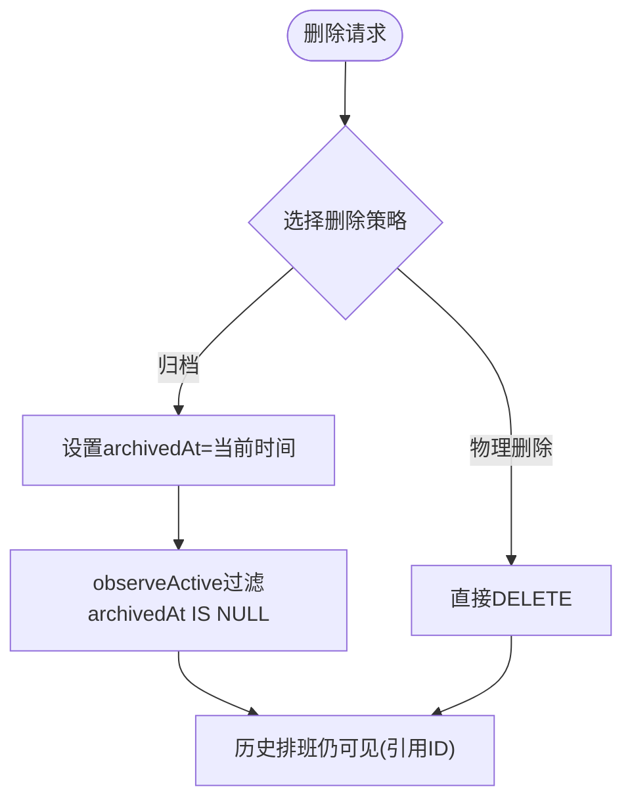
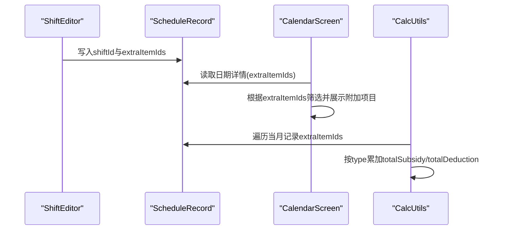
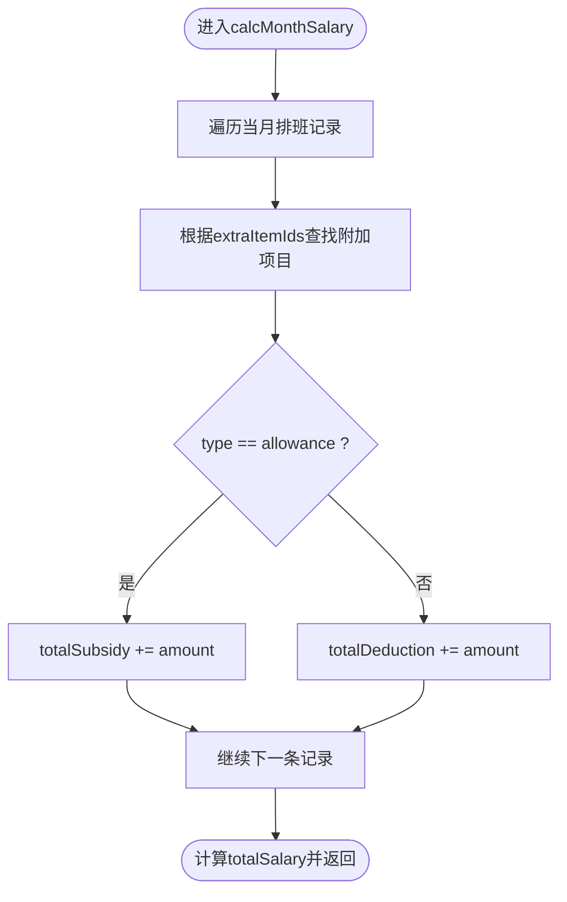
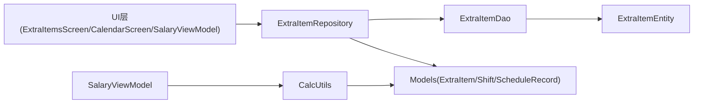
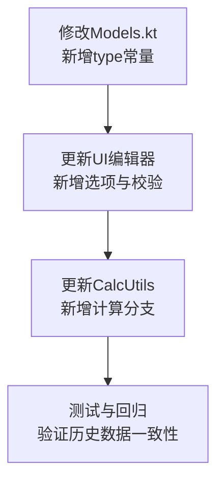

# 附加项目管理

<cite>
**本文引用的文件**   
- [ExtraItemEntity.kt](file://app/src/main/java/com/schedulecalendar/app/data/db/entity/ExtraItemEntity.kt)
- [ExtraItemDao.kt](file://app/src/main/java/com/schedulecalendar/app/data/db/dao/ExtraItemDao.kt)
- [ExtraItemRepository.kt](file://app/src/main/java/com/schedulecalendar/app/data/repository/ExtraItemRepository.kt)
- [Models.kt](file://app/src/main/java/com/schedulecalendar/app/domain/model/Models.kt)
- [CalcUtils.kt](file://app/src/main/java/com/schedulecalendar/app/domain/model/CalcUtils.kt)
- [ExtraItemsScreen.kt](file://app/src/main/java/com/schedulecalendar/app/ui/detail/ExtraItemsScreen.kt)
- [CalendarScreen.kt](file://app/src/main/java/com/schedulecalendar/app/ui/calendar/CalendarScreen.kt)
- [SalaryViewModel.kt](file://app/src/main/java/com/schedulecalendar/app/ui/salary/SalaryViewModel.kt)
- [AppPreferences.kt](file://app/src/main/java/com/schedulecalendar/app/data/prefs/AppPreferences.kt)
</cite>

## 目录
1. [简介](#简介)
2. [项目结构](#项目结构)
3. [核心组件](#核心组件)
4. [架构总览](#架构总览)
5. [详细组件分析](#详细组件分析)
6. [依赖关系分析](#依赖关系分析)
7. [性能与扩展性](#性能与扩展性)
8. [故障排查指南](#故障排查指南)
9. [结论](#结论)
10. [附录：扩展新附加项目类型与复杂薪资计算示例](#附录扩展新附加项目类型与复杂薪资计算示例)

## 简介
本文件围绕“附加项目管理”主题，系统性阐述补贴与扣款项目的定义、管理、排序与优先级、删除保护机制、与班次的关联绑定方式，以及在薪资计算中的应用规则与公式。文档同时提供面向扩展的参考路径，帮助开发者新增附加项目类型或实现更复杂的薪资计算逻辑。

## 项目结构
附加项目相关代码分布在数据层、领域层与UI层：
- 数据层：Room 实体与 DAO、仓库封装
- 领域层：模型定义与薪资计算工具
- UI层：附加项目管理界面、日历详情展示、薪资汇总与趋势

图表来源
- [ExtraItemEntity.kt:1-16](file://app/src/main/java/com/schedulecalendar/app/data/db/entity/ExtraItemEntity.kt#L1-L16)
- [ExtraItemDao.kt:1-41](file://app/src/main/java/com/schedulecalendar/app/data/db/dao/ExtraItemDao.kt#L1-L41)
- [ExtraItemRepository.kt:1-31](file://app/src/main/java/com/schedulecalendar/app/data/repository/ExtraItemRepository.kt#L1-L31)
- [Models.kt:102-109](file://app/src/main/java/com/schedulecalendar/app/domain/model/Models.kt#L102-L109)
- [CalcUtils.kt:344-423](file://app/src/main/java/com/schedulecalendar/app/domain/model/CalcUtils.kt#L344-L423)
- [ExtraItemsScreen.kt:32-113](file://app/src/main/java/com/schedulecalendar/app/ui/detail/ExtraItemsScreen.kt#L32-L113)
- [CalendarScreen.kt:2090-2104](file://app/src/main/java/com/schedulecalendar/app/ui/calendar/CalendarScreen.kt#L2090-L2104)
- [SalaryViewModel.kt:90-131](file://app/src/main/java/com/schedulecalendar/app/ui/salary/SalaryViewModel.kt#L90-L131)

章节来源
- [ExtraItemEntity.kt:1-16](file://app/src/main/java/com/schedulecalendar/app/data/db/entity/ExtraItemEntity.kt#L1-L16)
- [ExtraItemDao.kt:1-41](file://app/src/main/java/com/schedulecalendar/app/data/db/dao/ExtraItemDao.kt#L1-L41)
- [ExtraItemRepository.kt:1-31](file://app/src/main/java/com/schedulecalendar/app/data/repository/ExtraItemRepository.kt#L1-L31)
- [Models.kt:102-109](file://app/src/main/java/com/schedulecalendar/app/domain/model/Models.kt#L102-L109)
- [CalcUtils.kt:344-423](file://app/src/main/java/com/schedulecalendar/app/domain/model/CalcUtils.kt#L344-L423)
- [ExtraItemsScreen.kt:32-113](file://app/src/main/java/com/schedulecalendar/app/ui/detail/ExtraItemsScreen.kt#L32-L113)
- [CalendarScreen.kt:2090-2104](file://app/src/main/java/com/schedulecalendar/app/ui/calendar/CalendarScreen.kt#L2090-L2104)
- [SalaryViewModel.kt:90-131](file://app/src/main/java/com/schedulecalendar/app/ui/salary/SalaryViewModel.kt#L90-L131)

## 核心组件
- 附加项目模型与实体
  - 领域模型：包含 id、name、type（allowance/deduction）、amount、archivedAt
  - 数据库实体：与领域模型字段一致，用于 Room 持久化
- 数据访问层
  - DAO：提供观察有效/全部项目、插入/更新、归档（逻辑删除）与物理删除接口
  - 仓库：将 DAO 返回的实体映射为领域模型，并暴露 Flow 与 suspend API
- 薪资计算
  - 按月聚合时遍历排班记录的 extraItemIds，按 type 累加到 totalSubsidy 或 totalDeduction
  - 每日明细中根据记录中的附加项目列表计算当日额外收入/扣款
- UI 管理
  - 管理界面支持新增/编辑/删除；名称重复检测；金额输入过滤；显示顺序配置
  - 日历详情展示当天已绑定的附加项目
  - 薪资视图模型调用计算工具生成月度汇总与趋势

章节来源
- [Models.kt:102-109](file://app/src/main/java/com/schedulecalendar/app/domain/model/Models.kt#L102-L109)
- [ExtraItemEntity.kt:1-16](file://app/src/main/java/com/schedulecalendar/app/data/db/entity/ExtraItemEntity.kt#L1-L16)
- [ExtraItemDao.kt:1-41](file://app/src/main/java/com/schedulecalendar/app/data/db/dao/ExtraItemDao.kt#L1-L41)
- [ExtraItemRepository.kt:1-31](file://app/src/main/java/com/schedulecalendar/app/data/repository/ExtraItemRepository.kt#L1-L31)
- [CalcUtils.kt:344-423](file://app/src/main/java/com/schedulecalendar/app/domain/model/CalcUtils.kt#L344-L423)
- [ExtraItemsScreen.kt:32-113](file://app/src/main/java/com/schedulecalendar/app/ui/detail/ExtraItemsScreen.kt#L32-L113)
- [CalendarScreen.kt:2090-2104](file://app/src/main/java/com/schedulecalendar/app/ui/calendar/CalendarScreen.kt#L2090-L2104)
- [SalaryViewModel.kt:90-131](file://app/src/main/java/com/schedulecalendar/app/ui/salary/SalaryViewModel.kt#L90-L131)

## 架构总览
附加项目从创建到参与薪资计算的端到端流程如下：

图表来源
- [ExtraItemsScreen.kt:32-113](file://app/src/main/java/com/schedulecalendar/app/ui/detail/ExtraItemsScreen.kt#L32-L113)
- [ExtraItemRepository.kt:1-31](file://app/src/main/java/com/schedulecalendar/app/data/repository/ExtraItemRepository.kt#L1-L31)
- [ExtraItemDao.kt:1-41](file://app/src/main/java/com/schedulecalendar/app/data/db/dao/ExtraItemDao.kt#L1-L41)
- [CalcUtils.kt:344-423](file://app/src/main/java/com/schedulecalendar/app/domain/model/CalcUtils.kt#L344-L423)
- [SalaryViewModel.kt:90-131](file://app/src/main/java/com/schedulecalendar/app/ui/salary/SalaryViewModel.kt#L90-L131)

## 详细组件分析

### 数据模型与实体
- 领域模型 ExtraItem
  - 属性：id、name、type（"allowance"/"deduction"）、amount、archivedAt
  - 用途：在薪资计算与UI展示中使用
- 数据库实体 ExtraItemEntity
  - 与领域模型一一对应，使用 Room 注解持久化
- 班次与附加项目的关联
  - Shift 包含 linkedExtraIds（默认预选的附加项目ID列表）
  - ScheduleRecord 包含 extraItemIds（实际应用到该日期的附加项目ID列表）

图表来源
- [Models.kt:102-109](file://app/src/main/java/com/schedulecalendar/app/domain/model/Models.kt#L102-L109)
- [Models.kt:51-65](file://app/src/main/java/com/schedulecalendar/app/domain/model/Models.kt#L51-L65)
- [Models.kt:81-100](file://app/src/main/java/com/schedulecalendar/app/domain/model/Models.kt#L81-L100)
- [ExtraItemEntity.kt:1-16](file://app/src/main/java/com/schedulecalendar/app/data/db/entity/ExtraItemEntity.kt#L1-L16)

章节来源
- [Models.kt:51-65](file://app/src/main/java/com/schedulecalendar/app/domain/model/Models.kt#L51-L65)
- [Models.kt:81-100](file://app/src/main/java/com/schedulecalendar/app/domain/model/Models.kt#L81-L100)
- [Models.kt:102-109](file://app/src/main/java/com/schedulecalendar/app/domain/model/Models.kt#L102-L109)
- [ExtraItemEntity.kt:1-16](file://app/src/main/java/com/schedulecalendar/app/data/db/entity/ExtraItemEntity.kt#L1-L16)

### 数据访问与仓库
- DAO 能力
  - observeActive/observeAll：仅有效/全部（含归档）
  - getAll/getAllIncludingArchived：同步获取
  - upsert/upsertAll：插入或替换
  - archiveById：设置归档时间戳（逻辑删除）
  - deleteById/deleteAll：物理删除
- 仓库职责
  - 将 Entity 映射为 Domain Model
  - 暴露 Flow 给 UI 实时刷新
  - 统一保存/归档/删除操作

图表来源
- [ExtraItemDao.kt:1-41](file://app/src/main/java/com/schedulecalendar/app/data/db/dao/ExtraItemDao.kt#L1-L41)
- [ExtraItemRepository.kt:1-31](file://app/src/main/java/com/schedulecalendar/app/data/repository/ExtraItemRepository.kt#L1-L31)

章节来源
- [ExtraItemDao.kt:1-41](file://app/src/main/java/com/schedulecalendar/app/data/db/dao/ExtraItemDao.kt#L1-L41)
- [ExtraItemRepository.kt:1-31](file://app/src/main/java/com/schedulecalendar/app/data/repository/ExtraItemRepository.kt#L1-L31)

### 排序与优先级
- 默认排序
  - 查询时按 name ASC 排序，保证列表稳定
- 自定义显示顺序
  - 通过 AppPreferences 的 getExtraOrder/saveExtraOrder 维护 ID 序列
  - UI 可据此渲染自定义顺序（例如拖拽后保存）

图表来源
- [ExtraItemDao.kt:11-16](file://app/src/main/java/com/schedulecalendar/app/data/db/dao/ExtraItemDao.kt#L11-L16)
- [AppPreferences.kt:133-142](file://app/src/main/java/com/schedulecalendar/app/data/prefs/AppPreferences.kt#L133-L142)

章节来源
- [ExtraItemDao.kt:11-16](file://app/src/main/java/com/schedulecalendar/app/data/db/dao/ExtraItemDao.kt#L11-L16)
- [AppPreferences.kt:133-142](file://app/src/main/java/com/schedulecalendar/app/data/prefs/AppPreferences.kt#L133-L142)

### 删除保护机制
- 逻辑删除优先
  - archiveById 设置 archivedAt 为非空值，使 observeActive 不再返回该项目
  - 历史排班记录仍保留 extraItemIds 引用，确保历史数据完整性
- 物理删除
  - deleteById 直接移除记录，需谨慎使用（可能影响历史统计）

图表来源
- [ExtraItemDao.kt:31-36](file://app/src/main/java/com/schedulecalendar/app/data/db/dao/ExtraItemDao.kt#L31-L36)
- [ExtraItemRepository.kt:26-29](file://app/src/main/java/com/schedulecalendar/app/data/repository/ExtraItemRepository.kt#L26-L29)

章节来源
- [ExtraItemDao.kt:31-36](file://app/src/main/java/com/schedulecalendar/app/data/db/dao/ExtraItemDao.kt#L31-L36)
- [ExtraItemRepository.kt:26-29](file://app/src/main/java/com/schedulecalendar/app/data/repository/ExtraItemRepository.kt#L26-L29)

### 与班次的关联绑定
- 默认预选
  - Shift.linkedExtraIds 指定默认关联的附加项目ID（最多3个），在排班时自动预选
- 实际应用
  - ScheduleRecord.extraItemIds 记录当天实际应用的附加项目ID集合
  - 日历详情与薪资计算均基于此集合进行展示与汇总

图表来源
- [Models.kt:51-65](file://app/src/main/java/com/schedulecalendar/app/domain/model/Models.kt#L51-L65)
- [Models.kt:81-100](file://app/src/main/java/com/schedulecalendar/app/domain/model/Models.kt#L81-L100)
- [CalendarScreen.kt:2090-2104](file://app/src/main/java/com/schedulecalendar/app/ui/calendar/CalendarScreen.kt#L2090-L2104)
- [CalcUtils.kt:344-423](file://app/src/main/java/com/schedulecalendar/app/domain/model/CalcUtils.kt#L344-L423)

章节来源
- [Models.kt:51-65](file://app/src/main/java/com/schedulecalendar/app/domain/model/Models.kt#L51-L65)
- [Models.kt:81-100](file://app/src/main/java/com/schedulecalendar/app/domain/model/Models.kt#L81-L100)
- [CalendarScreen.kt:2090-2104](file://app/src/main/java/com/schedulecalendar/app/ui/calendar/CalendarScreen.kt#L2090-L2104)
- [CalcUtils.kt:344-423](file://app/src/main/java/com/schedulecalendar/app/domain/model/CalcUtils.kt#L344-L423)

### 薪资计算应用规则与公式
- 月薪资汇总
  - 遍历当月排班记录，对每条记录的 extraItemIds 查找对应附加项目
  - 若 type="allowance"，则累加至 totalSubsidy；若 type="deduction"，则累加至 totalDeduction
  - 最终 totalSalary = baseSalary + basePerformance + normalSalary + overtimeSalary + weekendSalary + holidaySalary + totalSubsidy - totalDeduction - socialInsurance - housingFundDeduction
- 每日明细
  - extrasTotal = sum(allowance.amount) - sum(deduction.amount)
  - salaryWithExtras = daySalary + extrasTotal

图表来源
- [CalcUtils.kt:344-423](file://app/src/main/java/com/schedulecalendar/app/domain/model/CalcUtils.kt#L344-L423)

章节来源
- [CalcUtils.kt:344-423](file://app/src/main/java/com/schedulecalendar/app/domain/model/CalcUtils.kt#L344-L423)

### UI 管理与验证
- 新增/编辑
  - 名称必填；重复检测（忽略大小写）
  - 金额只允许数字与小数点，IME自动填充保护
  - 类型选择：补贴/扣款
- 删除确认
  - 提示历史数据不受影响（因采用逻辑删除或引用ID）
- 展示
  - 补贴与扣款分区块显示；金额带正负号标识

章节来源
- [ExtraItemsScreen.kt:32-113](file://app/src/main/java/com/schedulecalendar/app/ui/detail/ExtraItemsScreen.kt#L32-L113)
- [ExtraItemsScreen.kt:140-219](file://app/src/main/java/com/schedulecalendar/app/ui/detail/ExtraItemsScreen.kt#L140-L219)

## 依赖关系分析
- 模块耦合
  - UI 依赖仓库；仓库依赖 DAO；DAO 依赖 Room 实体
  - 薪资计算依赖领域模型与考勤/薪资配置
- 外部依赖
  - Room 数据库
  - DataStore 偏好存储（附加项目显示顺序）
  - Hilt 注入（仓库、DAO等）

图表来源
- [ExtraItemsScreen.kt:32-113](file://app/src/main/java/com/schedulecalendar/app/ui/detail/ExtraItemsScreen.kt#L32-L113)
- [ExtraItemRepository.kt:1-31](file://app/src/main/java/com/schedulecalendar/app/data/repository/ExtraItemRepository.kt#L1-L31)
- [ExtraItemDao.kt:1-41](file://app/src/main/java/com/schedulecalendar/app/data/db/dao/ExtraItemDao.kt#L1-L41)
- [ExtraItemEntity.kt:1-16](file://app/src/main/java/com/schedulecalendar/app/data/db/entity/ExtraItemEntity.kt#L1-L16)
- [Models.kt:102-109](file://app/src/main/java/com/schedulecalendar/app/domain/model/Models.kt#L102-L109)
- [SalaryViewModel.kt:90-131](file://app/src/main/java/com/schedulecalendar/app/ui/salary/SalaryViewModel.kt#L90-L131)
- [CalcUtils.kt:344-423](file://app/src/main/java/com/schedulecalendar/app/domain/model/CalcUtils.kt#L344-L423)

章节来源
- [ExtraItemRepository.kt:1-31](file://app/src/main/java/com/schedulecalendar/app/data/repository/ExtraItemRepository.kt#L1-L31)
- [ExtraItemDao.kt:1-41](file://app/src/main/java/com/schedulecalendar/app/data/db/dao/ExtraItemDao.kt#L1-L41)
- [ExtraItemEntity.kt:1-16](file://app/src/main/java/com/schedulecalendar/app/data/db/entity/ExtraItemEntity.kt#L1-L16)
- [Models.kt:102-109](file://app/src/main/java/com/schedulecalendar/app/domain/model/Models.kt#L102-L109)
- [SalaryViewModel.kt:90-131](file://app/src/main/java/com/schedulecalendar/app/ui/salary/SalaryViewModel.kt#L90-L131)
- [CalcUtils.kt:344-423](file://app/src/main/java/com/schedulecalendar/app/domain/model/CalcUtils.kt#L344-L423)

## 性能与扩展性
- 性能
  - 使用 Flow 观察数据变化，避免频繁轮询
  - 查询时按 name 排序，减少内存排序开销
  - 薪资计算按月遍历，复杂度 O(N)，N 为当月排班记录数
- 扩展性
  - 新增附加项目类型：扩展 type 枚举并在 UI/计算处分支处理
  - 复杂薪资逻辑：在 CalcUtils 中增加新的计算分支，或在 UI 层叠加二次调整

[本节为通用指导，不直接分析具体文件]

## 故障排查指南
- 名称重复
  - 现象：保存时报错提示名称已存在
  - 排查：检查现有名称列表与输入名称（忽略大小写）
  - 参考路径：[ExtraItemsScreen.kt:206-208](file://app/src/main/java/com/schedulecalendar/app/ui/detail/ExtraItemsScreen.kt#L206-L208)
- 金额输入异常
  - 现象：粘贴货币符号导致解析失败
  - 排查：确认输入过滤逻辑仅保留数字与小数点
  - 参考路径：[ExtraItemsScreen.kt:161-174](file://app/src/main/java/com/schedulecalendar/app/ui/detail/ExtraItemsScreen.kt#L161-L174)
- 历史数据丢失
  - 现象：删除附加项目后历史薪资不一致
  - 排查：确认使用归档而非物理删除；检查历史记录的 extraItemIds 引用
  - 参考路径：[ExtraItemDao.kt:31-36](file://app/src/main/java/com/schedulecalendar/app/data/db/dao/ExtraItemDao.kt#L31-L36)、[CalcUtils.kt:382-386](file://app/src/main/java/com/schedulecalendar/app/domain/model/CalcUtils.kt#L382-L386)

章节来源
- [ExtraItemsScreen.kt:206-208](file://app/src/main/java/com/schedulecalendar/app/ui/detail/ExtraItemsScreen.kt#L206-L208)
- [ExtraItemsScreen.kt:161-174](file://app/src/main/java/com/schedulecalendar/app/ui/detail/ExtraItemsScreen.kt#L161-L174)
- [ExtraItemDao.kt:31-36](file://app/src/main/java/com/schedulecalendar/app/data/db/dao/ExtraItemDao.kt#L31-L36)
- [CalcUtils.kt:382-386](file://app/src/main/java/com/schedulecalendar/app/domain/model/CalcUtils.kt#L382-L386)

## 结论
附加项目管理以清晰的领域模型与数据层分离为基础，结合逻辑删除保障历史数据完整性，并通过班次默认预选与实际应用两级绑定实现灵活的薪资调整项配置。薪资计算遵循明确的累加规则，易于扩展新的项目类型与复杂计算逻辑。

[本节为总结，不直接分析具体文件]

## 附录：扩展新附加项目类型与复杂薪资计算示例

### 扩展步骤概览
- 领域模型
  - 在 Models.kt 的 ExtraItem.type 中新增类型常量（如 "bonus"）
  - 如需更多属性，可在模型中添加字段
- 数据层
  - 在 DAO 的查询与映射中兼容新类型
  - 仓库映射保持不变（类型作为字符串传递）
- UI层
  - 在编辑器中为新类型添加选项与校验
  - 在列表与详情中按类型展示不同样式
- 薪资计算
  - 在 CalcUtils.calcMonthSalary 与 getMonthScheduleDetails 中为新类型增加分支逻辑
  - 可按需区分计入 totalSubsidy 或其他汇总字段

图表来源
- [Models.kt:102-109](file://app/src/main/java/com/schedulecalendar/app/domain/model/Models.kt#L102-L109)
- [ExtraItemsScreen.kt:193-198](file://app/src/main/java/com/schedulecalendar/app/ui/detail/ExtraItemsScreen.kt#L193-L198)
- [CalcUtils.kt:344-423](file://app/src/main/java/com/schedulecalendar/app/domain/model/CalcUtils.kt#L344-L423)

### 复杂薪资计算逻辑示例（思路）
- 条件触发
  - 当某类附加项目存在且满足特定条件（如加班时长阈值）时，追加额外金额
- 计算公式
  - 新增字段 bonusRate 与 thresholdHours，在 CalcUtils 中判断并累加
- 展示与汇总
  - 在每日明细与月度汇总中分别展示 bonus 项及其合计

章节来源
- [Models.kt:102-109](file://app/src/main/java/com/schedulecalendar/app/domain/model/Models.kt#L102-L109)
- [ExtraItemsScreen.kt:193-198](file://app/src/main/java/com/schedulecalendar/app/ui/detail/ExtraItemsScreen.kt#L193-L198)
- [CalcUtils.kt:344-423](file://app/src/main/java/com/schedulecalendar/app/domain/model/CalcUtils.kt#L344-L423)