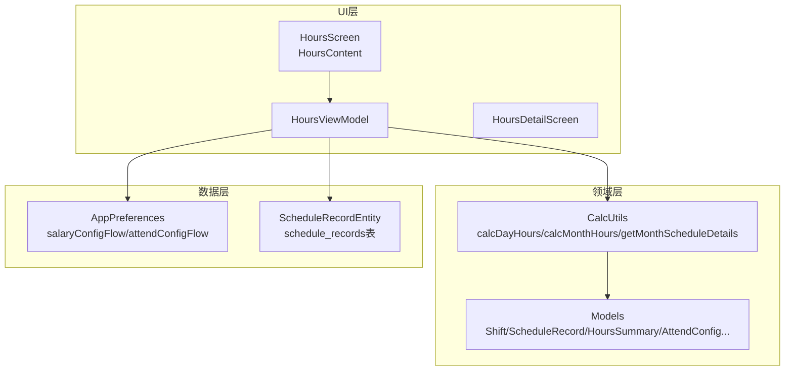
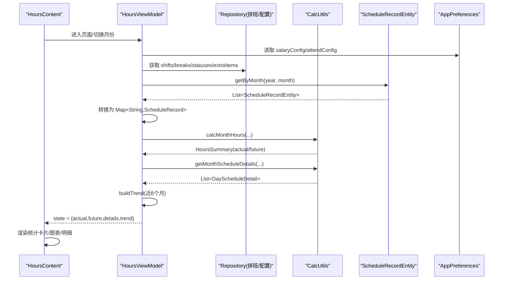
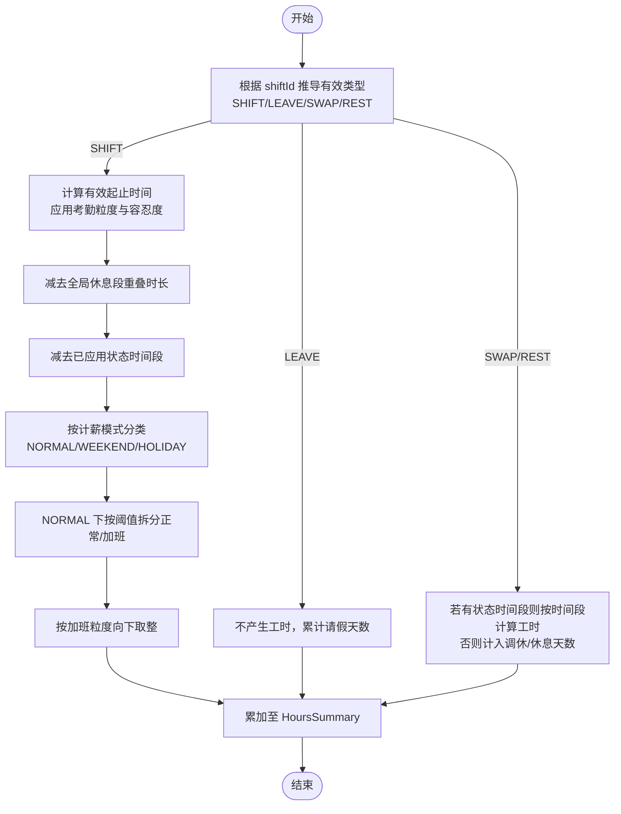
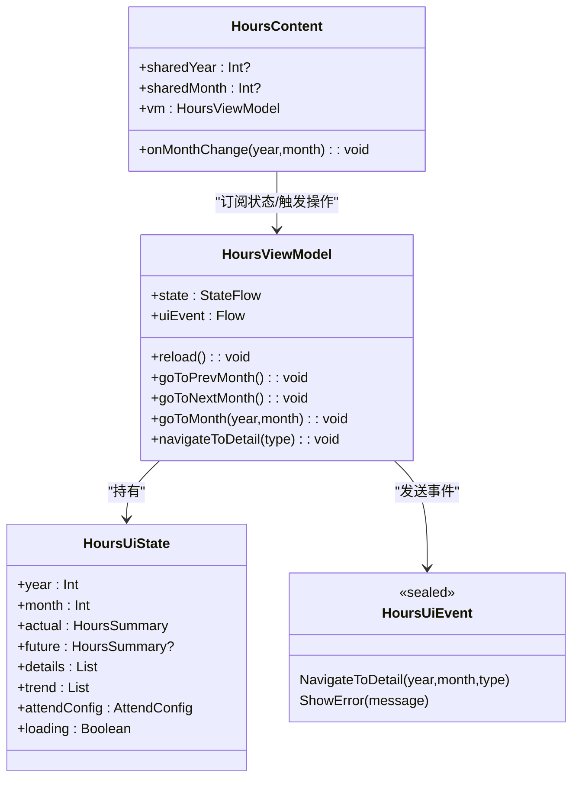
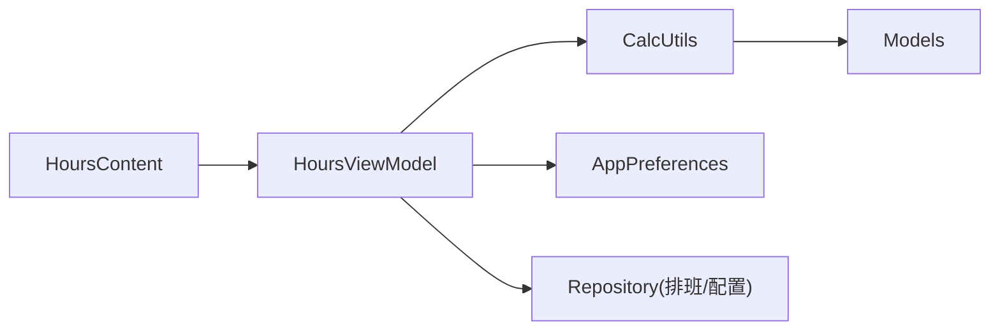

# 工时统计功能

<cite>
**本文引用的文件**   
- [CalcUtils.kt](file://app/src/main/java/com/schedulecalendar/app/domain/model/CalcUtils.kt)
- [Models.kt](file://app/src/main/java/com/schedulecalendar/app/domain/model/Models.kt)
- [HoursScreen.kt](file://app/src/main/java/com/schedulecalendar/app/ui/hours/HoursScreen.kt)
- [HoursViewModel.kt](file://app/src/main/java/com/schedulecalendar/app/ui/hours/HoursViewModel.kt)
- [ScheduleRecordEntity.kt](file://app/src/main/java/com/schedulecalendar/app/data/db/entity/ScheduleRecordEntity.kt)
- [AppPreferences.kt](file://app/src/main/java/com/schedulecalendar/app/data/prefs/AppPreferences.kt)
- [HoursDetailScreen.kt](file://app/src/main/java/com/schedulecalendar/app/ui/detail/HoursDetailScreen.kt)
</cite>

## 目录
1. [简介](#简介)
2. [项目结构](#项目结构)
3. [核心组件](#核心组件)
4. [架构总览](#架构总览)
5. [详细组件分析](#详细组件分析)
6. [依赖关系分析](#依赖关系分析)
7. [性能与大数据优化](#性能与大数据优化)
8. [故障排查指南](#故障排查指南)
9. [结论](#结论)
10. [附录：扩展新计算规则示例](#附录扩展新计算规则示例)

## 简介
本文件围绕“工时统计”能力，系统阐述正常工时、加班工时、缺勤工时的计算逻辑与算法实现；说明按日、周、月的聚合方式；详解 HoursContent 组件的 UI 布局、交互与状态管理；解释与排班数据的关联关系，以及如何从 ScheduleRecordEntity 提取工时信息；并提供扩展新计算规则的实践路径与大数据量处理优化建议。

## 项目结构
工时统计涉及领域模型、计算工具、UI 展示与数据源四大层次：
- 领域模型：班次、记录、配置、汇总等数据结构定义
- 计算工具：统一的工时/薪资计算与聚合方法
- UI 层：工时页（HoursContent）、工时明细页、图表与卡片
- 数据层：偏好设置（考勤/薪资配置）、数据库实体（排班记录）

图示来源
- [HoursScreen.kt:1-214](file://app/src/main/java/com/schedulecalendar/app/ui/hours/HoursScreen.kt#L1-L214)
- [HoursViewModel.kt:51-164](file://app/src/main/java/com/schedulecalendar/app/ui/hours/HoursViewModel.kt#L51-L164)
- [CalcUtils.kt:148-340](file://app/src/main/java/com/schedulecalendar/app/domain/model/CalcUtils.kt#L148-L340)
- [Models.kt:50-141](file://app/src/main/java/com/schedulecalendar/app/domain/model/Models.kt#L50-L141)
- [AppPreferences.kt:66-88](file://app/src/main/java/com/schedulecalendar/app/data/prefs/AppPreferences.kt#L66-L88)
- [ScheduleRecordEntity.kt:1-26](file://app/src/main/java/com/schedulecalendar/app/data/db/entity/ScheduleRecordEntity.kt#L1-L26)

章节来源
- [HoursScreen.kt:1-214](file://app/src/main/java/com/schedulecalendar/app/ui/hours/HoursScreen.kt#L1-L214)
- [HoursViewModel.kt:51-164](file://app/src/main/java/com/schedulecalendar/app/ui/hours/HoursViewModel.kt#L51-L164)
- [CalcUtils.kt:148-340](file://app/src/main/java/com/schedulecalendar/app/domain/model/CalcUtils.kt#L148-L340)
- [Models.kt:50-141](file://app/src/main/java/com/schedulecalendar/app/domain/model/Models.kt#L50-L141)
- [AppPreferences.kt:66-88](file://app/src/main/java/com/schedulecalendar/app/data/prefs/AppPreferences.kt#L66-L88)
- [ScheduleRecordEntity.kt:1-26](file://app/src/main/java/com/schedulecalendar/app/data/db/entity/ScheduleRecordEntity.kt#L1-L26)

## 核心组件
- 领域模型
  - Shift：班次定义，含标准时长 normalWorkHours、起止时间等
  - ScheduleRecord：每日排班记录，含实际打卡时间、附加状态、计薪模式等
  - AttendConfig：考勤规则（加班粒度、迟到/早退容忍度、标准日工时等）
  - SalaryConfig：薪资费率（正常/加班/周末/节假日时薪等）
  - HoursSummary：月维度汇总（正常/加班/周末/节假日工时、请假天数折算、调休/休息天数、迟到/早退次数等）
  - DayScheduleDetail：日维度明细（用于工时/薪资页逐日展示）

- 计算工具 CalcUtils
  - calcDayHours：单日工时分类（正常/加班/周末/节假日），考虑全局休息段、应用状态时间段、考勤粒度与容忍度
  - calcMonthHours：月度汇总，支持日期过滤（历史/当前/未来）
  - getMonthScheduleDetails：生成当月每日明细（含薪资映射）

- UI 组件
  - HoursContent：工时主页面，包含统计卡片、图表、每日明细列表
  - HoursViewModel：负责加载数据、调用 CalcUtils、维护状态与导航事件
  - HoursDetailScreen：针对迟到、早退、备注、补贴/扣款等维度的详情列表

章节来源
- [Models.kt:50-141](file://app/src/main/java/com/schedulecalendar/app/domain/model/Models.kt#L50-L141)
- [Models.kt:225-254](file://app/src/main/java/com/schedulecalendar/app/domain/model/Models.kt#L225-L254)
- [CalcUtils.kt:148-340](file://app/src/main/java/com/schedulecalendar/app/domain/model/CalcUtils.kt#L148-L340)
- [HoursScreen.kt:48-214](file://app/src/main/java/com/schedulecalendar/app/ui/hours/HoursScreen.kt#L48-L214)
- [HoursViewModel.kt:51-164](file://app/src/main/java/com/schedulecalendar/app/ui/hours/HoursViewModel.kt#L51-L164)
- [HoursDetailScreen.kt:24-87](file://app/src/main/java/com/schedulecalendar/app/ui/detail/HoursDetailScreen.kt#L24-L87)

## 架构总览
工时统计的数据流与控制流如下：

图示来源
- [HoursViewModel.kt:83-139](file://app/src/main/java/com/schedulecalendar/app/ui/hours/HoursViewModel.kt#L83-L139)
- [CalcUtils.kt:233-340](file://app/src/main/java/com/schedulecalendar/app/domain/model/CalcUtils.kt#L233-L340)
- [AppPreferences.kt:66-88](file://app/src/main/java/com/schedulecalendar/app/data/prefs/AppPreferences.kt#L66-L88)
- [ScheduleRecordEntity.kt:1-26](file://app/src/main/java/com/schedulecalendar/app/data/db/entity/ScheduleRecordEntity.kt#L1-L26)

## 详细组件分析

### 工时计算算法（正常/加班/缺勤）
- 正常工时
  - 以班次标准时长或考勤配置的标准日工时为阈值，未超过阈值的工时计入正常工时
  - 若班次设置了 normalWorkHours，优先使用；否则回退到 AttendConfig.normalWorkHoursPerDay
- 加班工时
  - 超出阈值的工时按考勤粒度（overtimeGranMin）向下取整后计入加班
  - 周末/法定节假日的工时在显示层面统一归入“加班工时”，但内部仍区分 weekend/holiday 字段
- 缺勤工时
  - 通过内置类型推导：__builtin_leave__ 视为请假；__builtin_rest__/__builtin_swap__ 视为休息/调休
  - 若存在附加状态时间段（appliedStatus.startTime/endTime），则按该时间段扣除相应工时并折算为请假小时
  - 请假折算：完整请假天 × 标准日工时 + 附加状态请假小时，再按标准日工时折算为“请假天数+剩余小时”

图示来源
- [CalcUtils.kt:148-230](file://app/src/main/java/com/schedulecalendar/app/domain/model/CalcUtils.kt#L148-L230)
- [CalcUtils.kt:233-340](file://app/src/main/java/com/schedulecalendar/app/domain/model/CalcUtils.kt#L233-L340)
- [Models.kt:50-141](file://app/src/main/java/com/schedulecalendar/app/domain/model/Models.kt#L50-L141)

章节来源
- [CalcUtils.kt:148-230](file://app/src/main/java/com/schedulecalendar/app/domain/model/CalcUtils.kt#L148-L230)
- [CalcUtils.kt:233-340](file://app/src/main/java/com/schedulecalendar/app/domain/model/CalcUtils.kt#L233-L340)
- [Models.kt:50-141](file://app/src/main/java/com/schedulecalendar/app/domain/model/Models.kt#L50-L141)

### 数据聚合方式（按日/周/月）
- 按日
  - getMonthScheduleDetails 遍历当月每一天，生成 DayScheduleDetail，包含当日正常/加班/周末/节假日工时及薪资映射
- 按周
  - 当前代码未提供独立“按周”聚合接口；可在 HoursViewModel 中基于 getMonthScheduleDetails 的结果进行二次分组聚合
- 按月
  - calcMonthHours 对当月所有记录进行汇总，输出 HoursSummary，支持日期过滤（历史/当前/未来）
  - 趋势图（近8个月）由 HoursViewModel.buildTrend 调用 calcMonthHours 生成

章节来源
- [CalcUtils.kt:426-465](file://app/src/main/java/com/schedulecalendar/app/domain/model/CalcUtils.kt#L426-L465)
- [HoursViewModel.kt:141-158](file://app/src/main/java/com/schedulecalendar/app/ui/hours/HoursViewModel.kt#L141-L158)

### HoursContent 组件（UI 实现）
- 数据展示布局
  - 统计卡片网格：正常/加班/周末/节假日/请假/调休/休息/迟到/早退/备注/补贴扣款
  - 总工时横幅：本月总工时与预计增量
  - 图表区：每日工时分布（Canvas 柱状图）与月工时分布（Canvas 柱状图）
  - 每日明细列表：显示班次标签、周末/节假日/请假/调休/休息标记、总工时与加班标注、打卡时间与备注
- 交互设计
  - 点击“迟到次数/早退次数/备注/补贴扣款”跳转至对应详情页（HoursDetailScreen）
  - 图表视图切换：每日/月工时
  - 月份导航：上一月/下一月
- 状态管理
  - HoursViewModel.state 暴露 actual/future/details/trend/attendConfig/loading
  - HoursContent 通过 collectAsStateWithLifecycle 订阅状态变化，并在生命周期恢复时触发 reload()
  - 外部共享月份同步：当作为嵌入内容时，接收 sharedYear/sharedMonth 并驱动 vm.goToMonth

图示来源
- [HoursScreen.kt:48-214](file://app/src/main/java/com/schedulecalendar/app/ui/hours/HoursScreen.kt#L48-L214)
- [HoursViewModel.kt:35-81](file://app/src/main/java/com/schedulecalendar/app/ui/hours/HoursViewModel.kt#L35-L81)

章节来源
- [HoursScreen.kt:48-214](file://app/src/main/java/com/schedulecalendar/app/ui/hours/HoursScreen.kt#L48-L214)
- [HoursViewModel.kt:35-81](file://app/src/main/java/com/schedulecalendar/app/ui/hours/HoursViewModel.kt#L35-L81)

### 与排班数据的关联关系与实体映射
- 数据来源
  - 排班记录：ScheduleRecordEntity（Room 表 schedule_records）
  - 配置：SalaryConfig/AttendConfig（DataStore，通过 AppPreferences 暴露 Flow）
- 映射流程
  - HoursViewModel 从 Repository 获取 shifts/breaks/statuses/extraItems 与当月 records
  - 将 ScheduleRecordEntity 转换为领域模型 ScheduleRecord（字段对齐：date/type/shiftId/actualStartTime/actualEndTime/remark/extraItemIds/appliedStatus/salaryMode/ignoreEarlyArrival/ignoreLateLeave/confirmEarlyOT/confirmLateOT）
  - 调用 CalcUtils 进行计算与聚合

章节来源
- [ScheduleRecordEntity.kt:1-26](file://app/src/main/java/com/schedulecalendar/app/data/db/entity/ScheduleRecordEntity.kt#L1-L26)
- [AppPreferences.kt:66-88](file://app/src/main/java/com/schedulecalendar/app/data/prefs/AppPreferences.kt#L66-L88)
- [HoursViewModel.kt:83-139](file://app/src/main/java/com/schedulecalendar/app/ui/hours/HoursViewModel.kt#L83-L139)

## 依赖关系分析
- 低耦合高内聚
  - CalcUtils 仅依赖 Models 中的数据结构，不包含 UI 与持久化细节
  - HoursViewModel 负责编排数据加载与计算，UI 仅消费状态
- 直接依赖
  - HoursViewModel → CalcUtils、AppPreferences、Repository（排班/配置）
  - HoursContent → HoursViewModel
- 潜在循环依赖
  - 无直接循环；CalcUtils 不反向依赖 ViewModel/UI

图示来源
- [HoursViewModel.kt:51-164](file://app/src/main/java/com/schedulecalendar/app/ui/hours/HoursViewModel.kt#L51-L164)
- [CalcUtils.kt:1-536](file://app/src/main/java/com/schedulecalendar/app/domain/model/CalcUtils.kt#L1-536)
- [Models.kt:1-277](file://app/src/main/java/com/schedulecalendar/app/domain/model/Models.kt#L1-L277)

## 性能与大数据优化
- 计算复杂度
  - calcMonthHours：O(N)，N 为当月记录数
  - getMonthScheduleDetails：O(D)，D 为当月天数（通常≤31）
  - buildTrend：O(M×N)，M 为回溯月数（默认8），N 为各月记录数
- 内存与对象创建
  - 避免在 Compose 重组中重复计算：使用 remember 缓存图表高度、最大值等
  - 尽量复用集合与中间结果，减少临时对象分配
- I/O 与并发
  - 使用协程与 Flow 异步加载，避免阻塞主线程
  - 首次加载才显示 loading，后续刷新保持现有内容，提升体验
- 大数据场景优化建议
  - 分页/增量加载：对跨月/跨年查询采用分页策略，按需加载
  - 预聚合：对高频查询（如近8个月趋势）可引入本地缓存或索引
  - 批量转换：将 Entity→Domain 的转换放在后台线程，合并为一次性更新
  - 图表渲染：对大量数据点采用降采样或分段绘制，避免 Canvas 重绘开销过大

[本节为通用指导，无需特定文件引用]

## 故障排查指南
- 常见问题
  - 工时为 0：检查班次起止时间是否为空、是否被全局休息段完全覆盖、是否忽略早到晚退
  - 加班未按粒度计算：确认 overtimeGranMin 配置是否正确
  - 请假折算异常：检查 appliedStatus 时间段是否与班次时间窗重叠
  - 周末/节假日识别错误：确认 HolidayData 节假日与补班数据是否正确
- 定位步骤
  - 查看 HoursViewModel 的日志与错误事件（ShowError）
  - 核对 AttendanceConfig 与 SalaryConfig 的配置值
  - 验证 ScheduleRecordEntity 的字段映射是否完整

章节来源
- [HoursViewModel.kt:134-139](file://app/src/main/java/com/schedulecalendar/app/ui/hours/HoursViewModel.kt#L134-L139)
- [Models.kt:124-141](file://app/src/main/java/com/schedulecalendar/app/domain/model/Models.kt#L124-L141)
- [CalcUtils.kt:148-230](file://app/src/main/java/com/schedulecalendar/app/domain/model/CalcUtils.kt#L148-L230)

## 结论
工时统计模块以 CalcUtils 为核心，结合清晰的领域模型与分层架构，实现了稳定可靠的正常/加班/缺勤工时计算与多维聚合。HoursContent 提供了直观的可视化与交互体验，并通过 HoursViewModel 高效管理与调度数据流。遵循本文的性能优化建议与扩展指南，可进一步支撑更大规模数据与更复杂的业务规则。

[本节为总结性内容，无需特定文件引用]

## 附录：扩展新计算规则示例
目标：新增一种“弹性时段”规则，允许在特定时间段内的工时不计入加班。

步骤概览
- 在 Models.kt 中扩展配置项（例如在 AttendConfig 中添加弹性时段列表）
- 在 CalcUtils.calcDayHours 中增加弹性时段判断逻辑，调整 worked 或分类
- 在 HoursViewModel 中确保新配置从 AppPreferences 正确加载
- 在 HoursContent 中展示相关提示或指标（可选）

参考路径
- 配置扩展位置：[Models.kt:124-141](file://app/src/main/java/com/schedulecalendar/app/domain/model/Models.kt#L124-L141)
- 核心计算入口：[CalcUtils.kt:148-230](file://app/src/main/java/com/schedulecalendar/app/domain/model/CalcUtils.kt#L148-L230)
- 配置加载：[AppPreferences.kt:66-88](file://app/src/main/java/com/schedulecalendar/app/data/prefs/AppPreferences.kt#L66-L88)
- 数据加载与调用：[HoursViewModel.kt:83-139](file://app/src/main/java/com/schedulecalendar/app/ui/hours/HoursViewModel.kt#L83-L139)

[本节为扩展指引，不直接展示代码内容]