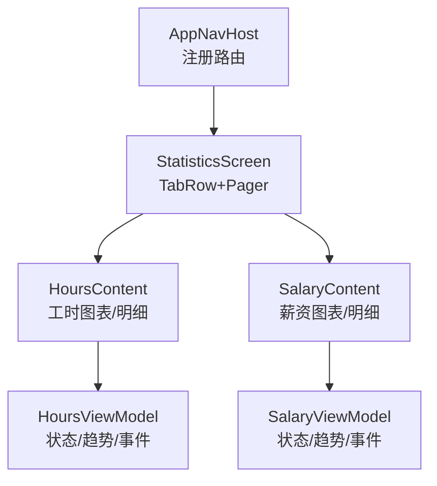
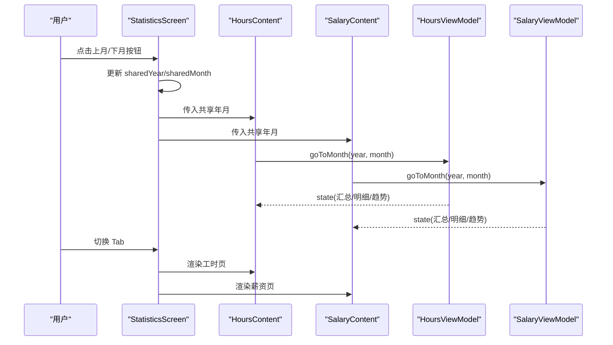
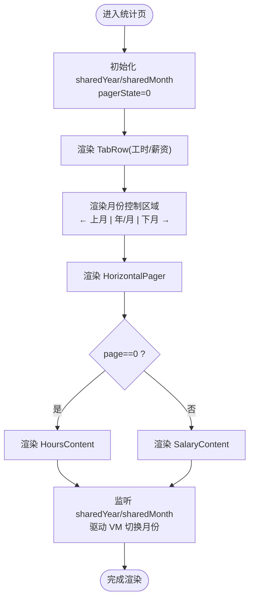
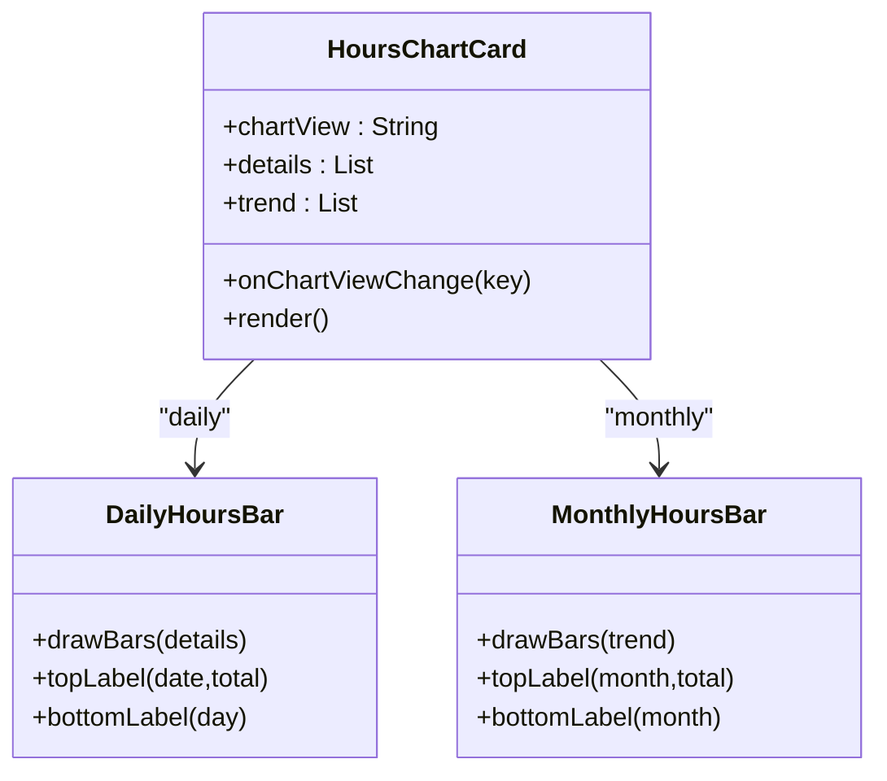
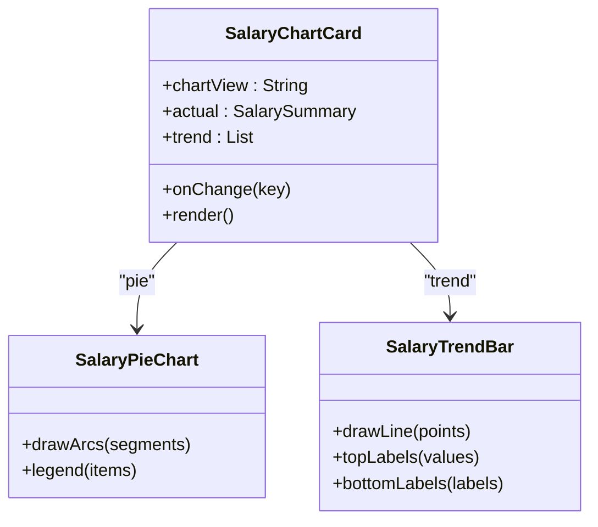
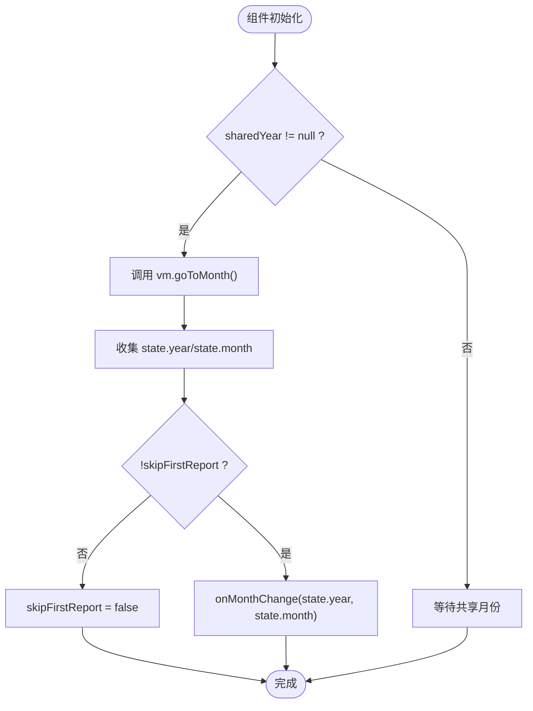
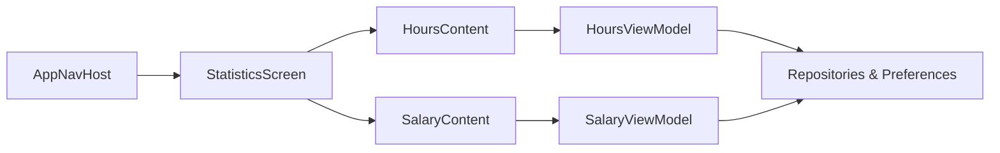

# 数据可视化展示

<cite>
**本文引用的文件**   
- [StatisticsScreen.kt](file://app/src/main/java/com/schedulecalendar/app/ui/statistics/StatisticsScreen.kt)
- [HoursScreen.kt](file://app/src/main/java/com/schedulecalendar/app/ui/hours/HoursScreen.kt)
- [SalaryScreen.kt](file://app/src/main/java/com/schedulecalendar/app/ui/salary/SalaryScreen.kt)
- [HoursViewModel.kt](file://app/src/main/java/com/schedulecalendar/app/ui/hours/HoursViewModel.kt)
- [SalaryViewModel.kt](file://app/src/main/java/com/schedulecalendar/app/ui/salary/SalaryViewModel.kt)
- [AppNavHost.kt](file://app/src/main/java/com/schedulecalendar/app/ui/navigation/AppNavHost.kt)
</cite>

## 更新摘要
**所做更改**   
- 更新了 StatisticsScreen 的 UI 架构，从 CenterAlignedTopAppBar 迁移到 TabRow 导航布局
- 添加了 ChevronLeft/ChevronRight 图标和 CalendarToday 图标以改进月份导航体验
- 增强了 HoursScreen 和 SalaryScreen 的月份同步机制，添加了 skipFirstReport 防止初始状态覆盖共享月份值
- 改进了用户交互设计，提供更直观的月份切换操作

## 目录
1. [简介](#简介)
2. [项目结构](#项目结构)
3. [核心组件](#核心组件)
4. [架构总览](#架构总览)
5. [详细组件分析](#详细组件分析)
6. [依赖关系分析](#依赖关系分析)
7. [性能考虑](#性能考虑)
8. [故障排查指南](#故障排查指南)
9. [结论](#结论)
10. [附录：扩展与示例](#附录扩展与示例)

## 简介
本文件围绕"统计页"的数据可视化能力进行系统化说明，重点覆盖以下方面：
- StatisticsScreen 的整体架构设计：TabRow 导航、HorizontalPager 页面切换、月份同步机制。
- 图表组件的选择与实现方案：基于 Compose Canvas 的自定义绘制（柱状图、折线图、饼图）。
- 数据到可视化的转换流程：数据格式化、颜色主题适配、响应式布局。
- 用户交互设计：时间范围选择、数据筛选、详情跳转。
- 扩展方法：如何新增图表类型与数据维度。
- 性能优化策略：懒加载、数据缓存、渲染优化。

## 项目结构
统计相关代码位于 ui 层，采用 MVVM + Compose 的组合方式：
- 视图层：StatisticsScreen 作为容器，承载工时与薪资两个子页面。
- 业务状态层：HoursViewModel 与 SalaryViewModel 负责数据加载、计算与趋势聚合。
- 导航层：AppNavHost 注册统计入口。

图示来源
- [AppNavHost.kt:89-103](file://app/src/main/java/com/schedulecalendar/app/ui/navigation/AppNavHost.kt#L89-L103)
- [StatisticsScreen.kt:31-154](file://app/src/main/java/com/schedulecalendar/app/ui/statistics/StatisticsScreen.kt#L31-L154)
- [HoursScreen.kt:47-214](file://app/src/main/java/com/schedulecalendar/app/ui/hours/HoursScreen.kt#L47-L214)
- [SalaryScreen.kt:37-186](file://app/src/main/java/com/schedulecalendar/app/ui/salary/SalaryScreen.kt#L37-L186)

章节来源
- [AppNavHost.kt:89-103](file://app/src/main/java/com/schedulecalendar/app/ui/navigation/AppNavHost.kt#L89-L103)
- [StatisticsScreen.kt:31-154](file://app/src/main/java/com/schedulecalendar/app/ui/statistics/StatisticsScreen.kt#L31-L154)

## 核心组件
- StatisticsScreen：提供统一的 TabRow 导航与 HorizontalPager，使用共享年份/月份实现联动。
- HoursContent/SalaryContent：分别封装工时与薪资的卡片、图表与明细列表；支持独立模式与嵌入模式。
- HoursViewModel/SalaryViewModel：从仓库读取排班、班次、休息、补贴等数据，结合配置计算当月实际/预计汇总与近8个月趋势，暴露给 UI 消费。

章节来源
- [StatisticsScreen.kt:31-154](file://app/src/main/java/com/schedulecalendar/app/ui/statistics/StatisticsScreen.kt#L31-L154)
- [HoursScreen.kt:47-214](file://app/src/main/java/com/schedulecalendar/app/ui/hours/HoursScreen.kt#L47-L214)
- [SalaryScreen.kt:37-186](file://app/src/main/java/com/schedulecalendar/app/ui/salary/SalaryScreen.kt#L37-L186)
- [HoursViewModel.kt:51-164](file://app/src/main/java/com/schedulecalendar/app/ui/hours/HoursViewModel.kt#L51-L164)
- [SalaryViewModel.kt:48-156](file://app/src/main/java/com/schedulecalendar/app/ui/salary/SalaryViewModel.kt#L48-L156)

## 架构总览
下图展示了统计页在运行时各组件之间的调用与数据流向。

图示来源
- [StatisticsScreen.kt:31-154](file://app/src/main/java/com/schedulecalendar/app/ui/statistics/StatisticsScreen.kt#L31-L154)
- [HoursScreen.kt:60-114](file://app/src/main/java/com/schedulecalendar/app/ui/hours/HoursScreen.kt#L60-L114)
- [SalaryScreen.kt:49-90](file://app/src/main/java/com/schedulecalendar/app/ui/salary/SalaryScreen.kt#L49-L90)
- [HoursViewModel.kt:160-163](file://app/src/main/java/com/schedulecalendar/app/ui/hours/HoursViewModel.kt#L160-L163)
- [SalaryViewModel.kt:152-155](file://app/src/main/java/com/schedulecalendar/app/ui/salary/SalaryViewModel.kt#L152-L155)

## 详细组件分析

### StatisticsScreen 整体架构

**已更新** 重大UI重构：将原有的 CenterAlignedTopAppBar 替换为现代化的 TabRow 导航布局，显著改进了用户体验。

- **顶部导航栏**：使用 Material3 的 TabRow 组件，包含"工时"和"薪资"两个标签，支持点击切换和滑动切换。
- **月份控制区域**：独立的 Row 布局，包含左右箭头按钮（ChevronLeft/ChevronRight）和当前年月显示，以及返回当月的 CalendarToday 按钮。
- **页面内容**：根据 page 索引渲染 HoursContent 或 SalaryContent，并将共享年月与回调 onMonthChange 传递下去，实现两页联动。

图示来源
- [StatisticsScreen.kt:31-154](file://app/src/main/java/com/schedulecalendar/app/ui/statistics/StatisticsScreen.kt#L31-L154)

章节来源
- [StatisticsScreen.kt:31-154](file://app/src/main/java/com/schedulecalendar/app/ui/statistics/StatisticsScreen.kt#L31-L154)

### 工时图表（HoursChartCard）
- 图表类型：
  - 每日工时分布：Canvas 堆叠柱状图（正常/加班），顶部显示当日合计，底部显示日期。
  - 月度工时分布：Canvas 堆叠柱状图（正常/加班），顶部显示月度合计，底部显示月份。
- 动态高度：根据数据最大值与参考满刻度计算统一图表高度，避免抖动。
- 颜色主题：使用 MaterialTheme.colorScheme 语义色，保证明暗主题一致。
- 交互：通过 chartView 状态切换"每日/月度"视图。

图示来源
- [HoursScreen.kt:358-436](file://app/src/main/java/com/schedulecalendar/app/ui/hours/HoursScreen.kt#L358-L436)
- [HoursScreen.kt:438-545](file://app/src/main/java/com/schedulecalendar/app/ui/hours/HoursScreen.kt#L438-L545)

章节来源
- [HoursScreen.kt:358-436](file://app/src/main/java/com/schedulecalendar/app/ui/hours/HoursScreen.kt#L358-L436)
- [HoursScreen.kt:438-545](file://app/src/main/java/com/schedulecalendar/app/ui/hours/HoursScreen.kt#L438-L545)

### 薪资图表（SalaryChartCard）
- 图表类型：
  - 薪资构成：Canvas 环形饼图（底薪/绩效/正常/加班/周末/节假日/补贴），右侧图例显示金额与占比。
  - 月薪趋势：Canvas 折线图（近8个月），顶部数值标签、底部月份标签。
- 颜色主题：扇形与折线均采用固定强调色，与主题色配合呈现对比度。
- 交互：通过 chartView 状态切换"构成/趋势"。

图示来源
- [SalaryScreen.kt:269-310](file://app/src/main/java/com/schedulecalendar/app/ui/salary/SalaryScreen.kt#L269-L310)
- [SalaryScreen.kt:312-358](file://app/src/main/java/com/schedulecalendar/app/ui/salary/SalaryScreen.kt#L312-L358)
- [SalaryScreen.kt:360-420](file://app/src/main/java/com/schedulecalendar/app/ui/salary/SalaryScreen.kt#L360-L420)

章节来源
- [SalaryScreen.kt:269-310](file://app/src/main/java/com/schedulecalendar/app/ui/salary/SalaryScreen.kt#L269-L310)
- [SalaryScreen.kt:312-358](file://app/src/main/java/com/schedulecalendar/app/ui/salary/SalaryScreen.kt#L312-L358)
- [SalaryScreen.kt:360-420](file://app/src/main/java/com/schedulecalendar/app/ui/salary/SalaryScreen.kt#L360-L420)

### 数据到可视化的转换过程
- 数据源：
  - 排班记录、班次、休息、额外项、薪资与考勤配置由 ViewModel 从仓库与偏好设置中获取。
- 计算逻辑：
  - 当月实际/预计汇总：按是否历史/当前/未来月区分时间边界，调用领域计算工具生成汇总。
  - 近8个月趋势：循环前8个月，逐月计算并聚合为趋势点。
- 格式化：
  - 工时小时数保留一位小数，整数去尾零；薪资金额保留两位小数。
  - 日期/月份标签截取与拼接，确保可读性。
- 主题适配：
  - 所有颜色来自 MaterialTheme.colorScheme，保证明暗主题一致性。
- 响应式布局：
  - 图表区域高度随数据最大值自适应，避免溢出或留白过多。
  - 列表使用 LazyColumn 仅渲染可见项，提升滚动性能。

章节来源
- [HoursViewModel.kt:83-158](file://app/src/main/java/com/schedulecalendar/app/ui/hours/HoursViewModel.kt#L83-L158)
- [SalaryViewModel.kt:74-150](file://app/src/main/java/com/schedulecalendar/app/ui/salary/SalaryViewModel.kt#L74-L150)
- [HoursScreen.kt:41-45](file://app/src/main/java/com/schedulecalendar/app/ui/hours/HoursScreen.kt#L41-L45)
- [SalaryScreen.kt:35](file://app/src/main/java/com/schedulecalendar/app/ui/salary/SalaryScreen.kt#L35)

### 用户交互设计

**已更新** 增强的月份导航交互体验：

- **时间范围选择**：
  - 顶部栏左右箭头按钮（ChevronLeft/ChevronRight）切换月份，同时驱动两个子页面的 ViewModel 切换到目标月份。
  - 新增 CalendarToday 按钮，快速返回当前月份。
  - 月份显示区域居中显示，提供更好的视觉平衡。
- **数据筛选**：
  - 工时页支持点击"迟到/早退/备注/补贴扣款"等卡片跳转到对应明细。
- **详情查看**：
  - 工时与薪资页均提供每日明细行，点击可进一步查看具体信息（由导航事件驱动）。

章节来源
- [StatisticsScreen.kt:41-102](file://app/src/main/java/com/schedulecalendar/app/ui/statistics/StatisticsScreen.kt#L41-L102)
- [HoursScreen.kt:122-131](file://app/src/main/java/com/schedulecalendar/app/ui/hours/HoursScreen.kt#L122-L131)
- [HoursScreen.kt:90-99](file://app/src/main/java/com/schedulecalendar/app/ui/hours/HoursScreen.kt#L90-L99)

### 月份同步机制增强

**已更新** 添加了 skipFirstReport 机制以防止初始状态覆盖共享月份值：

- **HoursContent 和 SalaryContent** 都实现了相同的月份同步逻辑：
  - 使用 `LaunchedEffect(sharedYear, sharedMonth)` 监听外部共享月份变化。
  - 添加 `skipFirstReport` 标志位，跳过首次组合时的月份上报。
  - 避免 ViewModel 初始状态覆盖父组件的共享月份值。

图示来源
- [HoursScreen.kt:78-92](file://app/src/main/java/com/schedulecalendar/app/ui/hours/HoursScreen.kt#L78-L92)
- [SalaryScreen.kt:68-82](file://app/src/main/java/com/schedulecalendar/app/ui/salary/SalaryScreen.kt#L68-L82)

章节来源
- [HoursScreen.kt:78-92](file://app/src/main/java/com/schedulecalendar/app/ui/hours/HoursScreen.kt#L78-L92)
- [SalaryScreen.kt:68-82](file://app/src/main/java/com/schedulecalendar/app/ui/salary/SalaryScreen.kt#L68-L82)

## 依赖关系分析
- 视图依赖 ViewModel：
  - HoursContent 依赖 HoursViewModel，SalaryContent 依赖 SalaryViewModel。
- ViewModel 依赖仓库与配置：
  - 两者均依赖 ShiftRepository、ScheduleRepository、ShiftBreakRepository、ExtraItemRepository 与 AppPreferences。
- 导航入口：
  - AppNavHost 将 RouteStatistics 映射到 StatisticsScreen。

图示来源
- [AppNavHost.kt:89-103](file://app/src/main/java/com/schedulecalendar/app/ui/navigation/AppNavHost.kt#L89-L103)
- [HoursViewModel.kt:51-74](file://app/src/main/java/com/schedulecalendar/app/ui/hours/HoursViewModel.kt#L51-L74)
- [SalaryViewModel.kt:48-70](file://app/src/main/java/com/schedulecalendar/app/ui/salary/SalaryViewModel.kt#L48-L70)

章节来源
- [AppNavHost.kt:89-103](file://app/src/main/java/com/schedulecalendar/app/ui/navigation/AppNavHost.kt#L89-L103)
- [HoursViewModel.kt:51-74](file://app/src/main/java/com/schedulecalendar/app/ui/hours/HoursViewModel.kt#L51-L74)
- [SalaryViewModel.kt:48-70](file://app/src/main/java/com/schedulecalendar/app/ui/salary/SalaryViewModel.kt#L48-L70)

## 性能考虑
- 懒加载与分页：
  - 明细列表使用 LazyColumn，仅渲染可见项，减少内存占用与重绘。
- 首次加载与后续刷新：
  - ViewModel 仅在首次加载时显示 loading，后续刷新保持现有内容，避免闪烁。
- 图表渲染优化：
  - 使用 remember 缓存计算结果（如最大高度、文本测量器），减少重复计算。
  - 图表高度自适应但限制最小/最大范围，避免极端值导致布局抖动。
- 协程与取消：
  - loadJob 在切换月份时取消上一次任务，避免并发冲突与资源浪费。
- 主题与颜色：
  - 使用主题色而非硬编码，减少多套样式维护成本，提高一致性。

章节来源
- [HoursScreen.kt:118-195](file://app/src/main/java/com/schedulecalendar/app/ui/hours/HoursScreen.kt#L118-L195)
- [SalaryScreen.kt:103-168](file://app/src/main/java/com/schedulecalendar/app/ui/salary/SalaryScreen.kt#L103-L168)
- [HoursViewModel.kt:83-139](file://app/src/main/java/com/schedulecalendar/app/ui/hours/HoursViewModel.kt#L83-L139)
- [SalaryViewModel.kt:74-132](file://app/src/main/java/com/schedulecalendar/app/ui/salary/SalaryViewModel.kt#L74-L132)

## 故障排查指南
- 月份不同步：
  - 检查 Shared Year/Month 是否在 LaunchedEffect 中正确触发 VM 的 goToMonth。
  - 确认 skipFirstReport 机制正常工作，避免初始状态覆盖。
- 图表不更新：
  - 确认 trend/details 状态已变更且 recomposition 被触发。
- 加载卡死：
  - 检查 loadJob 是否正确取消，异常分支是否关闭 loading 并上报错误。
- 主题不一致：
  - 确认所有颜色均来自 MaterialTheme.colorScheme，避免硬编码。

章节来源
- [HoursScreen.kt:78-88](file://app/src/main/java/com/schedulecalendar/app/ui/hours/HoursScreen.kt#L78-L88)
- [SalaryScreen.kt:68-77](file://app/src/main/java/com/schedulecalendar/app/ui/salary/SalaryScreen.kt#L68-L77)
- [HoursViewModel.kt:134-138](file://app/src/main/java/com/schedulecalendar/app/ui/hours/HoursViewModel.kt#L134-L138)
- [SalaryViewModel.kt:127-131](file://app/src/main/java/com/schedulecalendar/app/ui/salary/SalaryViewModel.kt#L127-L131)

## 结论
统计页以简洁的 MVVM + Compose 架构实现了工时与薪资的双页联动与丰富的可视化展示。通过最新的 UI 重构，采用了现代化的 TabRow 导航布局和增强的月份控制界面，显著提升了用户体验。通过自定义 Canvas 图表，避免了第三方库依赖，提升了可控性与性能。数据到可视化的转换清晰透明，主题与布局具备良好适应性。建议在后续迭代中继续完善交互细节与扩展更多图表类型。

## 附录：扩展与示例

### 新增图表类型（示例：面积图）
- 在 HoursChartCard 中添加新的 chartView 键值，并在 when 分支中渲染新图表。
- 新建 AreaChart 组件，使用 Canvas 绘制填充区域，复用文本测量器与高度自适应逻辑。
- 在 Legend 区域增加新图例项，保持与数据维度一致。

章节来源
- [HoursScreen.kt:358-436](file://app/src/main/java/com/schedulecalendar/app/ui/hours/HoursScreen.kt#L358-L436)
- [HoursScreen.kt:438-545](file://app/src/main/java/com/schedulecalendar/app/ui/hours/HoursScreen.kt#L438-L545)

### 新增数据维度（示例：新增"调休时长"）
- 在 MonthlyHoursTrend 或 SalarySummary 中扩展字段。
- 在 ViewModel 的趋势构建中累加该维度。
- 在图表绘制处增加对应分段或标注，并在图例中显示。

章节来源
- [HoursViewModel.kt:141-158](file://app/src/main/java/com/schedulecalendar/app/ui/hours/HoursViewModel.kt#L141-L158)
- [SalaryViewModel.kt:134-150](file://app/src/main/java/com/schedulecalendar/app/ui/salary/SalaryViewModel.kt#L134-L150)

### 新增月份导航功能
- 在 StatisticsScreen 中添加新的月份控制按钮或手势操作。
- 确保 skipFirstReport 机制与新功能的兼容性。
- 测试月份同步在不同场景下的行为。

章节来源
- [StatisticsScreen.kt:77-125](file://app/src/main/java/com/schedulecalendar/app/ui/statistics/StatisticsScreen.kt#L77-L125)
- [HoursScreen.kt:78-92](file://app/src/main/java/com/schedulecalendar/app/ui/hours/HoursScreen.kt#L78-L92)
- [SalaryScreen.kt:68-82](file://app/src/main/java/com/schedulecalendar/app/ui/salary/SalaryScreen.kt#L68-L82)