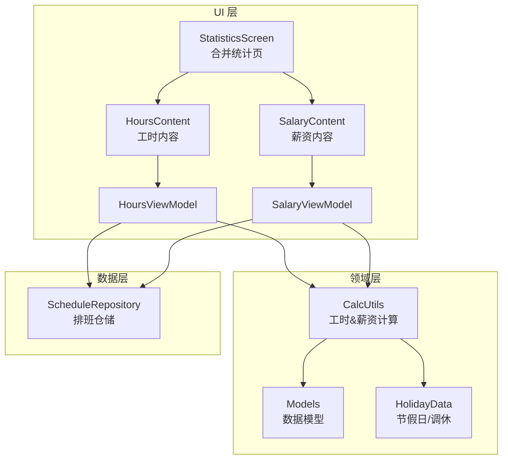
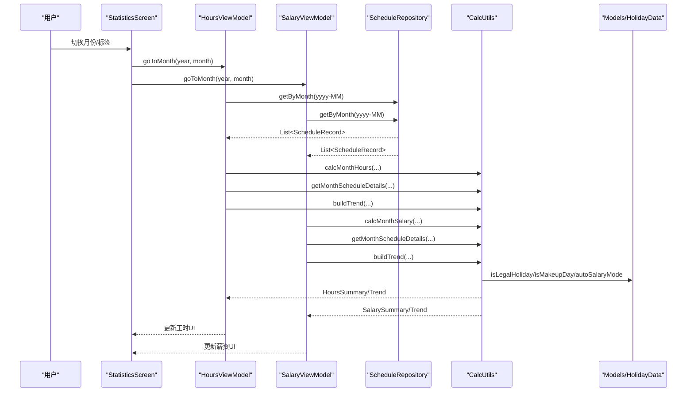
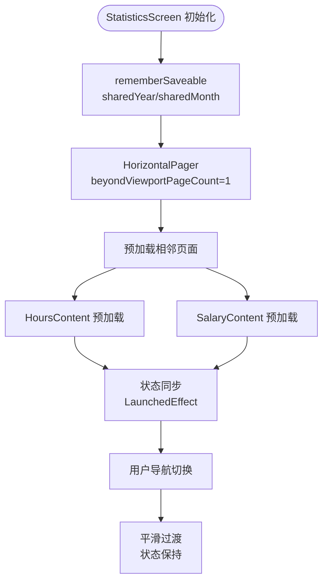
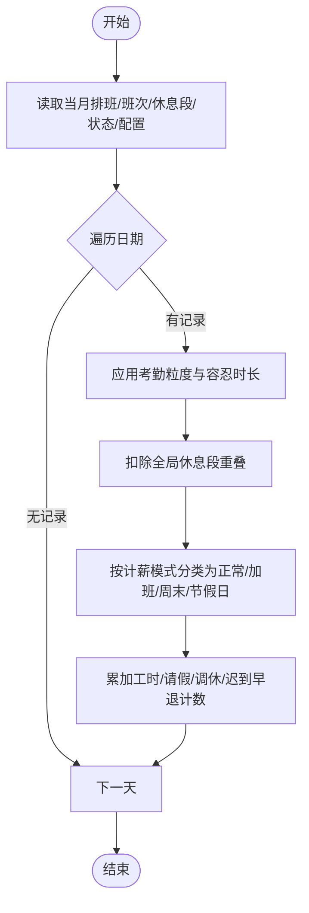
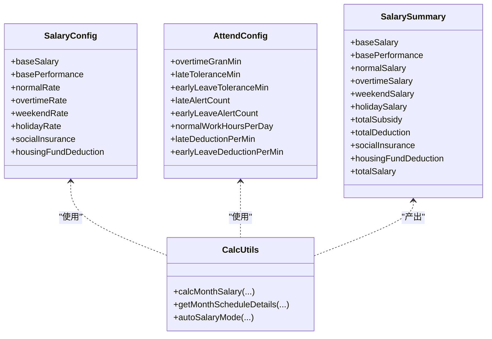
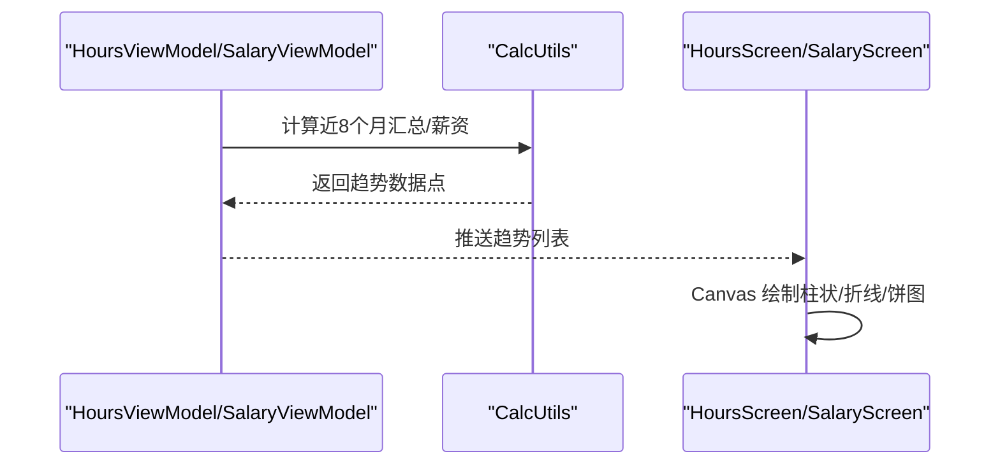
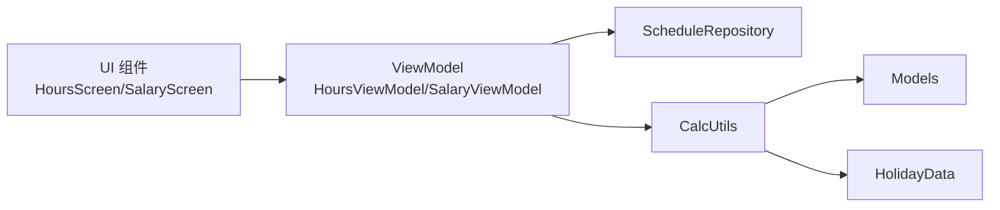

# 统计分析模块

<cite>
**本文引用的文件**   
- [StatisticsScreen.kt](file://app/src/main/java/com/schedulecalendar/app/ui/statistics/StatisticsScreen.kt)
- [HoursViewModel.kt](file://app/src/main/java/com/schedulecalendar/app/ui/hours/HoursViewModel.kt)
- [HoursScreen.kt](file://app/src/main/java/com/schedulecalendar/app/ui/hours/HoursScreen.kt)
- [SalaryViewModel.kt](file://app/src/main/java/com/schedulecalendar/app/ui/salary/SalaryViewModel.kt)
- [SalaryScreen.kt](file://app/src/main/java/com/schedulecalendar/app/ui/salary/SalaryScreen.kt)
- [CalcUtils.kt](file://app/src/main/java/com/schedulecalendar/app/domain/model/CalcUtils.kt)
- [Models.kt](file://app/src/main/java/com/schedulecalendar/app/domain/model/Models.kt)
- [HolidayData.kt](file://app/src/main/java/com/schedulecalendar/app/domain/model/HolidayData.kt)
- [ScheduleRepository.kt](file://app/src/main/java/com/schedulecalendar/app/data/repository/ScheduleRepository.kt)
</cite>

## 更新摘要
**变更内容**   
- **状态管理增强**：StatisticsScreen 中的 sharedYear 和 sharedMonth 状态现在使用 rememberSaveable 进行持久化，确保用户在统计页面间导航时保持月份选择状态
- **预加载机制优化**：通过 HorizontalPager 配置 beyondViewportPageCount = 1，显著改善不同统计视图间的导航体验
- **单向数据流实现**：实现了清晰的父→子数据流向，共享月份状态从 StatisticsScreen 流向 HoursContent 和 SalaryContent
- **生命周期管理优化**：嵌入模式下避免不必要的生命周期监听，减少资源消耗

## 目录
1. [简介](#简介)
2. [项目结构](#项目结构)
3. [核心组件](#核心组件)
4. [架构总览](#架构总览)
5. [详细组件分析](#详细组件分析)
6. [依赖关系分析](#依赖关系分析)
7. [性能与大数据量优化](#性能与大数据量优化)
8. [故障排查指南](#故障排查指南)
9. [结论](#结论)
10. [附录：扩展示例与最佳实践](#附录：扩展示例与最佳实践)

## 简介
本模块聚焦"工时统计报表"和"薪资计算引擎"，并提供趋势图表展示、数据导出能力以及多维度统计分析。文档将系统阐述：
- 正常工时、加班工时、缺勤工时的计算方法
- 薪资计算引擎的实现原理（基本工资、加班费、补贴扣款等）
- 趋势图表的可视化实现与自定义图表
- 数据导出功能（多种格式）
- 多维度统计分析（按部门、项目、时间段等）
- 扩展新指标与报表类型的代码级示例路径
- 大数据量处理的性能优化策略

## 项目结构
统计分析模块采用 MVVM + Compose UI 的分层组织方式，核心领域逻辑集中在 domain 层的工具类中，UI 层通过 ViewModel 聚合仓库数据并驱动状态更新。

图示来源
- [StatisticsScreen.kt:1-156](file://app/src/main/java/com/schedulecalendar/app/ui/statistics/StatisticsScreen.kt#L1-L156)
- [HoursViewModel.kt:1-208](file://app/src/main/java/com/schedulecalendar/app/ui/hours/HoursViewModel.kt#L1-L208)
- [SalaryViewModel.kt:1-168](file://app/src/main/java/com/schedulecalendar/app/ui/salary/SalaryViewModel.kt#L1-L168)
- [CalcUtils.kt:1-536](file://app/src/main/java/com/schedulecalendar/app/domain/model/CalcUtils.kt#L1-L536)
- [Models.kt:1-277](file://app/src/main/java/com/schedulecalendar/app/domain/model/Models.kt#L1-L277)
- [HolidayData.kt:1-636](file://app/src/main/java/com/schedulecalendar/app/domain/model/HolidayData.kt#L1-L636)
- [ScheduleRepository.kt:1-40](file://app/src/main/java/com/schedulecalendar/app/data/repository/ScheduleRepository.kt#L1-L40)

章节来源
- [StatisticsScreen.kt:1-156](file://app/src/main/java/com/schedulecalendar/app/ui/statistics/StatisticsScreen.kt#L1-L156)
- [HoursViewModel.kt:1-208](file://app/src/main/java/com/schedulecalendar/app/ui/hours/HoursViewModel.kt#L1-L208)
- [SalaryViewModel.kt:1-168](file://app/src/main/java/com/schedulecalendar/app/ui/salary/SalaryViewModel.kt#L1-L168)
- [CalcUtils.kt:1-536](file://app/src/main/java/com/schedulecalendar/app/domain/model/CalcUtils.kt#L1-L536)
- [Models.kt:1-277](file://app/src/main/java/com/schedulecalendar/app/domain/model/Models.kt#L1-L277)
- [HolidayData.kt:1-636](file://app/src/main/java/com/schedulecalendar/app/domain/model/HolidayData.kt#L1-L636)
- [ScheduleRepository.kt:1-40](file://app/src/main/java/com/schedulecalendar/app/data/repository/ScheduleRepository.kt#L1-L40)

## 核心组件
- 统计入口页面：提供"工时/薪资"双标签页，共享月份导航，联动刷新。
- 工时视图模型：负责加载当月排班、班次、休息段、状态、附加项及考勤配置，计算实际/预计工时与近8个月趋势。
- 薪资视图模型：在工时基础上叠加薪资规则，计算实际/预计薪资、全月估算、每日明细与近8个月薪资趋势。
- 计算引擎：统一封装时间处理、考勤粒度、休息段扣减、日工时分类、月汇总、薪资核算、周末/节假日判定等。
- 数据模型：定义班次、状态、记录、薪资配置、考勤配置、汇总结果等数据结构。
- 节假日工具：内置法定假日与调休补班数据，支持节气与传统节日查询。
- 排班仓储：提供按月查询、范围查询、变更信号等接口。

章节来源
- [StatisticsScreen.kt:1-156](file://app/src/main/java/com/schedulecalendar/app/ui/statistics/StatisticsScreen.kt#L1-L156)
- [HoursViewModel.kt:1-208](file://app/src/main/java/com/schedulecalendar/app/ui/hours/HoursViewModel.kt#L1-L208)
- [SalaryViewModel.kt:1-168](file://app/src/main/java/com/schedulecalendar/app/ui/salary/SalaryViewModel.kt#L1-L168)
- [CalcUtils.kt:1-536](file://app/src/main/java/com/schedulecalendar/app/domain/model/CalcUtils.kt#L1-L536)
- [Models.kt:1-277](file://app/src/main/java/com/schedulecalendar/app/domain/model/Models.kt#L1-L277)
- [HolidayData.kt:1-636](file://app/src/main/java/com/schedulecalendar/app/domain/model/HolidayData.kt#L1-L636)
- [ScheduleRepository.kt:1-40](file://app/src/main/java/com/schedulecalendar/app/data/repository/ScheduleRepository.kt#L1-L40)

## 架构总览
下图展示了从 UI 到领域计算的完整调用链，包括数据源、计算流程与输出。

图示来源
- [StatisticsScreen.kt:1-156](file://app/src/main/java/com/schedulecalendar/app/ui/statistics/StatisticsScreen.kt#L1-L156)
- [HoursViewModel.kt:1-208](file://app/src/main/java/com/schedulecalendar/app/ui/hours/HoursViewModel.kt#L1-L208)
- [SalaryViewModel.kt:1-168](file://app/src/main/java/com/schedulecalendar/app/ui/salary/SalaryViewModel.kt#L1-L168)
- [CalcUtils.kt:1-536](file://app/src/main/java/com/schedulecalendar/app/domain/model/CalcUtils.kt#L1-L536)
- [Models.kt:1-277](file://app/src/main/java/com/schedulecalendar/app/domain/model/Models.kt#L1-L277)
- [HolidayData.kt:1-636](file://app/src/main/java/com/schedulecalendar/app/domain/model/HolidayData.kt#L1-L636)
- [ScheduleRepository.kt:1-40](file://app/src/main/java/com/schedulecalendar/app/data/repository/ScheduleRepository.kt#L1-L40)

## 详细组件分析

### 状态管理与持久化机制
**已更新** StatisticsScreen 的状态管理得到了显著增强，sharedYear 和 sharedMonth 现在使用 rememberSaveable 进行持久化，确保用户在统计页面间导航时保持月份选择状态。

- **持久化状态**：使用 rememberSaveable 保存 sharedYear 和 sharedMonth，即使页面重建也能保持状态
- **预加载配置**：HorizontalPager 设置 beyondViewportPageCount = 1，确保当前页面的相邻页面预先加载
- **单向数据流**：实现了清晰的父→子数据流向，共享月份状态从 StatisticsScreen 流向 HoursContent 和 SalaryContent
- **生命周期优化**：嵌入模式下避免不必要的生命周期监听，减少资源消耗
- **状态同步**：通过 LaunchedEffect 实现外部共享月份的单向同步

图示来源
- [StatisticsScreen.kt:34-36](file://app/src/main/java/com/schedulecalendar/app/ui/statistics/StatisticsScreen.kt#L34-L36)
- [StatisticsScreen.kt:130-135](file://app/src/main/java/com/schedulecalendar/app/ui/statistics/StatisticsScreen.kt#L130-L135)
- [HoursScreen.kt:83-88](file://app/src/main/java/com/schedulecalendar/app/ui/hours/HoursScreen.kt#L83-L88)
- [SalaryScreen.kt:73-78](file://app/src/main/java/com/schedulecalendar/app/ui/salary/SalaryScreen.kt#L73-L78)

章节来源
- [StatisticsScreen.kt:1-156](file://app/src/main/java/com/schedulecalendar/app/ui/statistics/StatisticsScreen.kt#L1-L156)
- [HoursScreen.kt:1-200](file://app/src/main/java/com/schedulecalendar/app/ui/hours/HoursScreen.kt#L1-L200)
- [SalaryScreen.kt:1-200](file://app/src/main/java/com/schedulecalendar/app/ui/salary/SalaryScreen.kt#L1-L200)

### 工时统计报表生成逻辑
- 输入：当月排班记录、班次定义、全局休息段、状态列表、考勤配置、可选日期过滤。
- 关键步骤：
  - 应用考勤粒度与容忍时长，得到有效上下班时间。
  - 扣除全局休息段重叠时长，得到净工作时长。
  - 根据计薪模式（自动或手动）将工时归入正常/加班/周末/节假日。
  - 累计请假天数与剩余小时、调休/休息天数、迟到早退次数等。
- 输出：月度工时汇总、每日明细、近8个月趋势。

图示来源
- [CalcUtils.kt:136-230](file://app/src/main/java/com/schedulecalendar/app/domain/model/CalcUtils.kt#L136-L230)
- [CalcUtils.kt:232-340](file://app/src/main/java/com/schedulecalendar/app/domain/model/CalcUtils.kt#L232-L340)
- [Models.kt:224-239](file://app/src/main/java/com/schedulecalendar/app/domain/model/Models.kt#L224-L239)

章节来源
- [CalcUtils.kt:136-230](file://app/src/main/java/com/schedulecalendar/app/domain/model/CalcUtils.kt#L136-L230)
- [CalcUtils.kt:232-340](file://app/src/main/java/com/schedulecalendar/app/domain/model/CalcUtils.kt#L232-L340)
- [Models.kt:224-239](file://app/src/main/java/com/schedulecalendar/app/domain/model/Models.kt#L224-L239)

### 薪资计算引擎实现原理
- 基础项：底薪、绩效、社保、公积金。
- 工时转薪资：正常/加班/周末/节假日分别乘以对应时薪。
- 附加项：补贴与扣款按记录关联的额外项目汇总。
- 迟到/早退扣款：当配置了分钟费率时，按超出容忍时长的分钟数扣款。
- 实发工资：底薪+绩效+各类工时薪资+补贴合计-扣款合计-社保-公积金。

图示来源
- [Models.kt:111-141](file://app/src/main/java/com/schedulecalendar/app/domain/model/Models.kt#L111-L141)
- [Models.kt:256-269](file://app/src/main/java/com/schedulecalendar/app/domain/model/Models.kt#L256-L269)
- [CalcUtils.kt:342-423](file://app/src/main/java/com/schedulecalendar/app/domain/model/CalcUtils.kt#L342-L423)
- [CalcUtils.kt:425-491](file://app/src/main/java/com/schedulecalendar/app/domain/model/CalcUtils.kt#L425-L491)
- [CalcUtils.kt:493-522](file://app/src/main/java/com/schedulecalendar/app/domain/model/CalcUtils.kt#L493-L522)

章节来源
- [Models.kt:111-141](file://app/src/main/java/com/schedulecalendar/app/domain/model/Models.kt#L111-L141)
- [Models.kt:256-269](file://app/src/main/java/com/schedulecalendar/app/domain/model/Models.kt#L256-L269)
- [CalcUtils.kt:342-423](file://app/src/main/java/com/schedulecalendar/app/domain/model/CalcUtils.kt#L342-L423)
- [CalcUtils.kt:425-491](file://app/src/main/java/com/schedulecalendar/app/domain/model/CalcUtils.kt#L425-L491)
- [CalcUtils.kt:493-522](file://app/src/main/java/com/schedulecalendar/app/domain/model/CalcUtils.kt#L493-L522)

### 趋势图表展示功能
- 工时趋势：近8个月的正常工时、加班工时（含周末/节假日）、总工时柱状图；支持"每日分布"与"月分布"切换。
- 薪资趋势：近8个月总薪资折线/条形图；支持饼图展示薪资构成（底薪、绩效、正常、加班、周末、节假日、补贴）。
- 自定义绘制：基于 Canvas 自绘柱状图与折线图，动态高度与标签排版。

图示来源
- [HoursViewModel.kt:185-202](file://app/src/main/java/com/schedulecalendar/app/ui/hours/HoursViewModel.kt#L185-L202)
- [SalaryViewModel.kt:146-162](file://app/src/main/java/com/schedulecalendar/app/ui/salary/SalaryViewModel.kt#L146-L162)
- [HoursScreen.kt:358-545](file://app/src/main/java/com/schedulecalendar/app/ui/hours/HoursScreen.kt#L358-L545)
- [SalaryScreen.kt:312-386](file://app/src/main/java/com/schedulecalendar/app/ui/salary/SalaryScreen.kt#L312-L386)

章节来源
- [HoursViewModel.kt:185-202](file://app/src/main/java/com/schedulecalendar/app/ui/hours/HoursViewModel.kt#L185-L202)
- [SalaryViewModel.kt:146-162](file://app/src/main/java/com/schedulecalendar/app/ui/salary/SalaryViewModel.kt#L146-L162)
- [HoursScreen.kt:358-545](file://app/src/main/java/com/schedulecalendar/app/ui/hours/HoursScreen.kt#L358-L545)
- [SalaryScreen.kt:312-386](file://app/src/main/java/com/schedulecalendar/app/ui/salary/SalaryScreen.kt#L312-L386)

### 数据导出功能
- 当前仓库未包含直接的导出实现。建议在 ViewModel 或独立 Exporter 服务中新增方法，将汇总与明细序列化为 CSV/JSON/Excel 等格式，并通过系统分享或文件管理器保存。
- 建议导出字段：
  - 工时：日期、班次、正常工时、加班工时、周末工时、节假日工时、请假天数/小时、迟到/早退次数。
  - 薪资：日期、各项薪资明细、补贴/扣款、社保/公积金、实发工资。
- 多格式支持：
  - CSV：轻量通用，适合导入 Excel。
  - JSON：便于二次处理与 API 对接。
  - Excel：需要引入第三方库（如 Apache POI），适合复杂报表。

章节来源
- [HoursViewModel.kt:1-208](file://app/src/main/java/com/schedulecalendar/app/ui/hours/HoursViewModel.kt#L1-L208)
- [SalaryViewModel.kt:1-168](file://app/src/main/java/com/schedulecalendar/app/ui/salary/SalaryViewModel.kt#L1-L168)
- [Models.kt:224-269](file://app/src/main/java/com/schedulecalendar/app/domain/model/Models.kt#L224-L269)

### 多维度统计分析
- 当前维度：
  - 时间维度：按年/月/日（已实现近8个月趋势与每日明细）。
  - 类型维度：正常/加班/周末/节假日、请假/调休/休息。
- 可扩展维度（建议）：
  - 部门/项目：在 ScheduleRecord 或 Shift 中增加部门/项目标识，并在 CalcUtils 中新增按维度聚合方法。
  - 人员：若多用户场景，可在仓储层按 userId 过滤。
- 实现思路：
  - 在 CalcUtils 中新增 calcByDimension(...) 方法，接收维度键集合，对当月数据进行分组聚合。
  - 在 ViewModel 中暴露新的聚合结果供 UI 渲染。

章节来源
- [Models.kt:80-100](file://app/src/main/java/com/schedulecalendar/app/domain/model/Models.kt#L80-L100)
- [CalcUtils.kt:232-340](file://app/src/main/java/com/schedulecalendar/app/domain/model/CalcUtils.kt#L232-L340)

### 具体代码示例：扩展新统计指标与报表类型
- 新增指标示例（以"夜班津贴"为例）：
  - 在 Models 中扩展 ExtraItem 类型或新增字段，用于标记夜班津贴金额。
  - 在 CalcUtils.calcMonthSalary 中识别该类型并计入 totalSubsidy。
  - 在 UI 中新增卡片与趋势项，显示该项占比与历史趋势。
- 新增报表类型示例（以"按项目汇总"为例）：
  - 在 ScheduleRecord 或 Shift 中增加 projectId 字段。
  - 在 CalcUtils 中新增 calcProjectSummary(...)，按 projectId 分组汇总工时与薪资。
  - 在 ViewModel 中暴露新聚合结果，并在 UI 新增"项目报表"标签页。

章节来源
- [Models.kt:102-109](file://app/src/main/java/com/schedulecalendar/app/domain/model/Models.kt#L102-109)
- [CalcUtils.kt:342-423](file://app/src/main/java/com/schedulecalendar/app/domain/model/CalcUtils.kt#L342-423)
- [HoursViewModel.kt:1-208](file://app/src/main/java/com/schedulecalendar/app/ui/hours/HoursViewModel.kt#L1-L208)
- [SalaryViewModel.kt:1-168](file://app/src/main/java/com/schedulecalendar/app/ui/salary/SalaryViewModel.kt#L1-L168)

## 依赖关系分析
- UI 层依赖 ViewModel，ViewModel 依赖仓储与领域计算工具。
- 领域计算工具依赖数据模型与节假日工具。
- 仓储提供 Flow 与一次性查询，支持变更信号通知。

图示来源
- [HoursScreen.kt:1-200](file://app/src/main/java/com/schedulecalendar/app/ui/hours/HoursScreen.kt#L1-L200)
- [SalaryScreen.kt:1-200](file://app/src/main/java/com/schedulecalendar/app/ui/salary/SalaryScreen.kt#L1-L200)
- [HoursViewModel.kt:1-208](file://app/src/main/java/com/schedulecalendar/app/ui/hours/HoursViewModel.kt#L1-L208)
- [SalaryViewModel.kt:1-168](file://app/src/main/java/com/schedulecalendar/app/ui/salary/SalaryViewModel.kt#L1-L168)
- [ScheduleRepository.kt:1-40](file://app/src/main/java/com/schedulecalendar/app/data/repository/ScheduleRepository.kt#L1-L40)
- [CalcUtils.kt:1-536](file://app/src/main/java/com/schedulecalendar/app/domain/model/CalcUtils.kt#L1-L536)
- [Models.kt:1-277](file://app/src/main/java/com/schedulecalendar/app/domain/model/Models.kt#L1-L277)
- [HolidayData.kt:1-636](file://app/src/main/java/com/schedulecalendar/app/domain/model/HolidayData.kt#L1-L636)

章节来源
- [HoursScreen.kt:1-200](file://app/src/main/java/com/schedulecalendar/app/ui/hours/HoursScreen.kt#L1-L200)
- [SalaryScreen.kt:1-200](file://app/src/main/java/com/schedulecalendar/app/ui/salary/SalaryScreen.kt#L1-L200)
- [HoursViewModel.kt:1-208](file://app/src/main/java/com/schedulecalendar/app/ui/hours/HoursViewModel.kt#L1-L208)
- [SalaryViewModel.kt:1-168](file://app/src/main/java/com/schedulecalendar/app/ui/salary/SalaryViewModel.kt#L1-L168)
- [ScheduleRepository.kt:1-40](file://app/src/main/java/com/schedulecalendar/app/data/repository/ScheduleRepository.kt#L1-L40)
- [CalcUtils.kt:1-536](file://app/src/main/java/com/schedulecalendar/app/domain/model/CalcUtils.kt#L1-L536)
- [Models.kt:1-277](file://app/src/main/java/com/schedulecalendar/app/domain/model/Models.kt#L1-L277)
- [HolidayData.kt:1-636](file://app/src/main/java/com/schedulecalendar/app/domain/model/HolidayData.kt#L1-L636)

## 性能与大数据量优化
**已更新** 针对状态管理和预加载机制的性能优化得到了显著改善：

- **状态持久化优化**：
  - 使用 rememberSaveable 保存 sharedYear 和 sharedMonth，确保页面重建后状态不丢失
  - 提升用户体验，避免用户重新选择月份
  - 减少不必要的数据重新加载

- **预加载优化**：
  - HorizontalPager 配置 beyondViewportPageCount = 1，确保相邻页面预先加载
  - 减少用户切换视图时的等待时间和加载延迟
  - 提升整体用户体验的流畅度

- **数据访问优化**：
  - 使用仓储的按月/范围查询接口，避免全表扫描。
  - 利用 Flow 监听变更，减少重复加载。

- **计算优化**：
  - 仅在首次加载（actual/details为空）时显示 loading，后续刷新保持现有内容，提升交互体验。
  - 趋势计算限制窗口（近8个月），避免长周期遍历。

- **UI 渲染优化**：
  - 使用 LazyColumn 与 remember 缓存计算结果，减少重绘。
  - Canvas 绘图前预计算最大值与比例，避免每帧重复计算。
  - 嵌入模式下避免不必要的生命周期监听，减少资源消耗。

- **内存与并发**：
  - ViewModel 中使用协程 Job 管理异步任务，避免泄漏。
  - 大列表分页或虚拟滚动（如需多年数据）可考虑按需加载。

章节来源
- [StatisticsScreen.kt:34-36](file://app/src/main/java/com/schedulecalendar/app/ui/statistics/StatisticsScreen.kt#L34-L36)
- [StatisticsScreen.kt:130-135](file://app/src/main/java/com/schedulecalendar/app/ui/statistics/StatisticsScreen.kt#L130-L135)
- [HoursViewModel.kt:84-146](file://app/src/main/java/com/schedulecalendar/app/ui/hours/HoursViewModel.kt#L84-L146)
- [SalaryViewModel.kt:74-144](file://app/src/main/java/com/schedulecalendar/app/ui/salary/SalaryViewModel.kt#L74-L144)
- [HoursScreen.kt:71-81](file://app/src/main/java/com/schedulecalendar/app/ui/hours/HoursScreen.kt#L71-L81)
- [SalaryScreen.kt:61-71](file://app/src/main/java/com/schedulecalendar/app/ui/salary/SalaryScreen.kt#L61-L71)
- [ScheduleRepository.kt:22-39](file://app/src/main/java/com/schedulecalendar/app/data/repository/ScheduleRepository.kt#L22-L39)

## 故障排查指南
- **加载失败**：
  - 检查仓储是否成功返回当月数据。
  - 确认考勤配置与薪资配置是否正确初始化。

- **计算异常**：
  - 核对有效上下班时间是否跨天处理正确。
  - 检查全局休息段重叠计算是否覆盖跨天情况。
  - 验证周末/节假日判定是否与 HolidayData 一致。

- **UI 不更新**：
  - 确认 ViewModel 的 state 更新是否触发重组。
  - 检查外部共享月份同步逻辑是否生效。
  - 验证单向数据流模式（父→子）是否正确实现。

- **状态丢失问题**：
  - 检查 rememberSaveable 是否正确配置。
  - 确认 sharedYear 和 sharedMonth 的初始值设置。
  - 验证页面重建后的状态恢复机制。

- **预加载问题**：
  - 检查 beyondViewportPageCount 配置是否生效。
  - 确认相邻页面是否正确预加载。
  - 验证页面切换时的流畅性。

章节来源
- [HoursViewModel.kt:141-146](file://app/src/main/java/com/schedulecalendar/app/ui/hours/HoursViewModel.kt#L141-L146)
- [SalaryViewModel.kt:139-144](file://app/src/main/java/com/schedulecalendar/app/ui/salary/SalaryViewModel.kt#L139-L144)
- [CalcUtils.kt:115-134](file://app/src/main/java/com/schedulecalendar/app/domain/model/CalcUtils.kt#L115-L134)
- [HolidayData.kt:171-175](file://app/src/main/java/com/schedulecalendar/app/domain/model/HolidayData.kt#L171-L175)
- [StatisticsScreen.kt:34-36](file://app/src/main/java/com/schedulecalendar/app/ui/statistics/StatisticsScreen.kt#L34-L36)

## 结论
本模块通过清晰的 MVVM 分层与领域计算工具，实现了完整的工时与薪资统计、趋势可视化与可扩展的多维分析能力。最新的状态管理增强显著提升了用户体验，rememberSaveable 的使用确保了用户在页面间导航时的状态保持能力。预加载机制和单向数据流模式进一步改善了应用的响应性和可维护性。未来可在导出、多维聚合与大数据量场景下进一步增强性能与用户体验。

## 附录：扩展示例与最佳实践
- **扩展新指标**：
  - 在 Models 中新增字段或类型，确保 CalcUtils 能识别并参与计算。
  - 在 ViewModel 中暴露新聚合结果，并在 UI 新增展示项。

- **自定义图表**：
  - 复用 Canvas 绘制逻辑，统一高度与标签排版策略。
  - 为不同指标设置颜色与图例，保持一致性。

- **数据导出**：
  - 优先 CSV/JSON，必要时引入 Excel 库。
  - 提供选择器让用户选择导出范围与格式。

- **最佳实践**：
  - 所有数值保留两位小数，避免浮点误差。
  - 对跨天时间进行归一化处理，确保差值正确。
  - 使用 Flow 与协程管理异步与响应式更新。
  - 遵循单向数据流模式，确保数据一致性。
  - 合理使用 rememberSaveable 进行状态持久化。
  - 利用预加载机制提升用户体验。

章节来源
- [Models.kt:102-109](file://app/src/main/java/com/schedulecalendar/app/domain/model/Models.kt#L102-109)
- [CalcUtils.kt:526-533](file://app/src/main/java/com/schedulecalendar/app/domain/model/CalcUtils.kt#L526-L533)
- [HoursScreen.kt:358-545](file://app/src/main/java/com/schedulecalendar/app/ui/hours/HoursScreen.kt#L358-L545)
- [SalaryScreen.kt:312-386](file://app/src/main/java/com/schedulecalendar/app/ui/salary/SalaryScreen.kt#L312-L386)
- [StatisticsScreen.kt:34-36](file://app/src/main/java/com/schedulecalendar/app/ui/statistics/StatisticsScreen.kt#L34-L36)