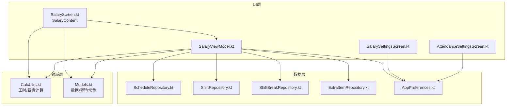
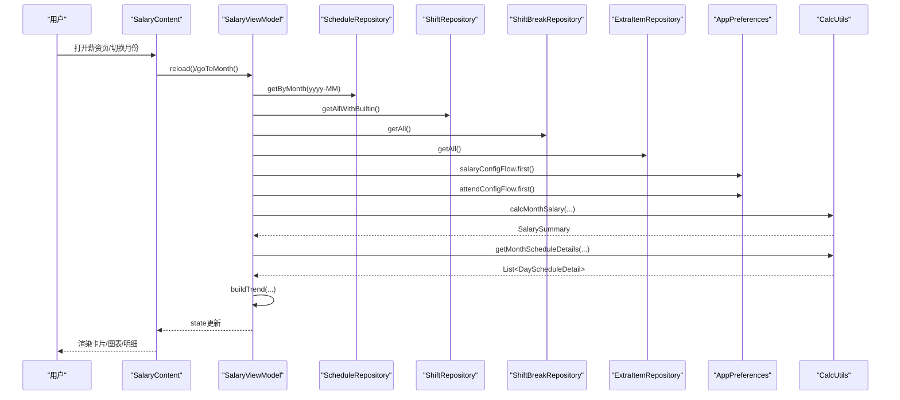
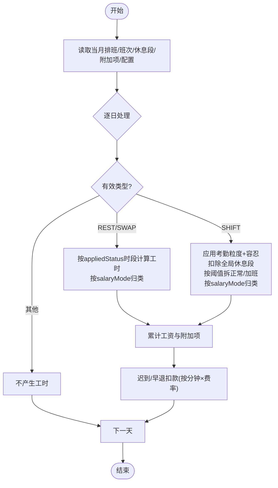
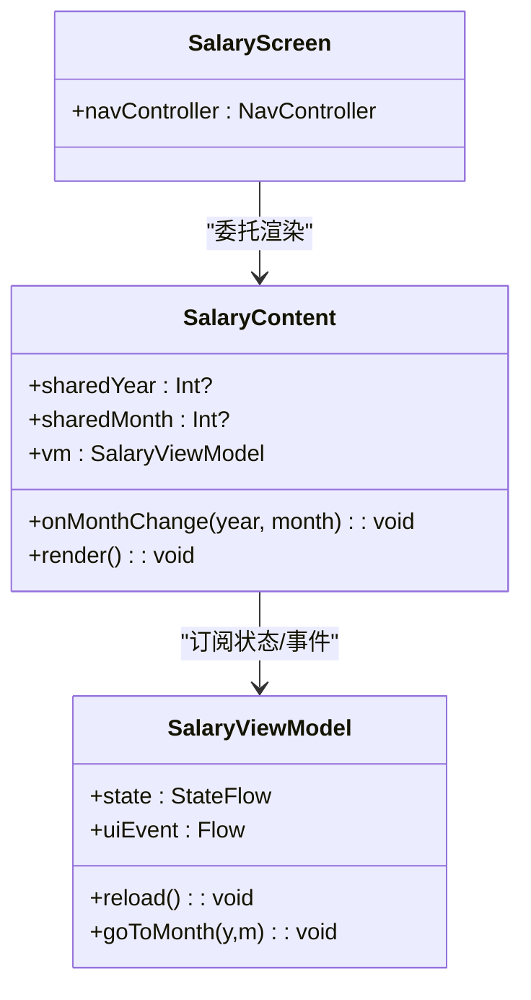
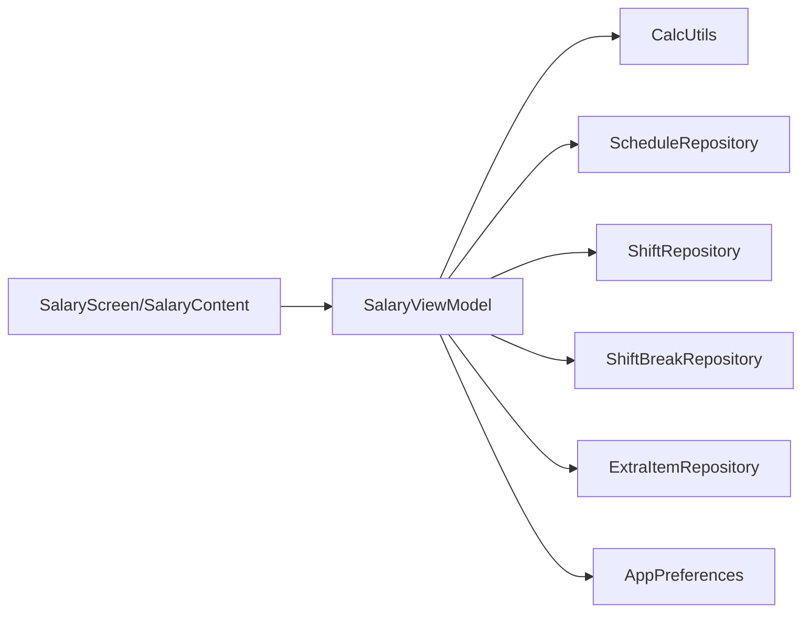

# 薪资计算引擎

<cite>
**本文引用的文件列表**
- [SalaryScreen.kt](file://app/src/main/java/com/schedulecalendar/app/ui/salary/SalaryScreen.kt)
- [SalaryViewModel.kt](file://app/src/main/java/com/schedulecalendar/app/ui/salary/SalaryViewModel.kt)
- [CalcUtils.kt](file://app/src/main/java/com/schedulecalendar/app/domain/model/CalcUtils.kt)
- [Models.kt](file://app/src/main/java/com/schedulecalendar/app/domain/model/Models.kt)
- [SalarySettingsScreen.kt](file://app/src/main/java/com/schedulecalendar/app/ui/settings/SalarySettingsScreen.kt)
- [AttendanceSettingsScreen.kt](file://app/src/main/java/com/schedulecalendar/app/ui/settings/AttendanceSettingsScreen.kt)
- [AppPreferences.kt](file://app/src/main/java/com/schedulecalendar/app/data/prefs/AppPreferences.kt)
- [ScheduleRepository.kt](file://app/src/main/java/com/schedulecalendar/app/data/repository/ScheduleRepository.kt)
- [ShiftRepository.kt](file://app/src/main/java/com/schedulecalendar/app/data/repository/ShiftRepository.kt)
- [ShiftBreakRepository.kt](file://app/src/main/java/com/schedulecalendar/app/data/repository/ShiftBreakRepository.kt)
- [ExtraItemRepository.kt](file://app/src/main/java/com/schedulecalendar/app/data/repository/ExtraItemRepository.kt)
</cite>

## 目录
1. [简介](#简介)
2. [项目结构](#项目结构)
3. [核心组件](#核心组件)
4. [架构总览](#架构总览)
5. [详细组件分析](#详细组件分析)
6. [依赖关系分析](#依赖关系分析)
7. [性能与可扩展性](#性能与可扩展性)
8. [故障排查指南](#故障排查指南)
9. [结论](#结论)
10. [附录：扩展与测试策略](#附录扩展与测试策略)

## 简介
本文件面向“薪资计算引擎”的完整实现，覆盖以下目标：
- 完整薪资计算流程：基本工资、加班费、周末/节假日工资、补贴、扣款（含迟到早退扣款、社保公积金）等核算规则。
- 薪资参数配置系统：支持自定义薪资标准与考勤规则，持久化到 DataStore。
- SalaryContent 组件：薪资报表生成与展示逻辑，包括月度汇总、构成饼图、趋势折线、每日明细。
- 与班次系统与考勤记录的集成：确保工时分类、粒度取整、休息段扣减、状态时间段处理等准确性。
- 新增薪资项目与计算规则的示例路径说明。
- 单元测试策略与边界条件处理建议。

## 项目结构
薪资相关代码主要分布在 UI、领域模型与数据仓库三层：
- UI 层：薪资页面与设置页（Compose），负责渲染与交互。
- 领域层：CalcUtils 提供纯函数式计算逻辑；Models 定义数据模型与常量。
- 数据层：Repository 聚合 DAO 与内置数据，提供查询与变更信号。

图表来源
- [SalaryScreen.kt:1-186](file://app/src/main/java/com/schedulecalendar/app/ui/salary/SalaryScreen.kt#L1-L186)
- [SalaryViewModel.kt:48-155](file://app/src/main/java/com/schedulecalendar/app/ui/salary/SalaryViewModel.kt#L48-L155)
- [CalcUtils.kt:149-536](file://app/src/main/java/com/schedulecalendar/app/domain/model/CalcUtils.kt#L149-L536)
- [Models.kt:112-141](file://app/src/main/java/com/schedulecalendar/app/domain/model/Models.kt#L112-L141)
- [SalarySettingsScreen.kt:37-89](file://app/src/main/java/com/schedulecalendar/app/ui/settings/SalarySettingsScreen.kt#L37-L89)
- [AttendanceSettingsScreen.kt:34-89](file://app/src/main/java/com/schedulecalendar/app/ui/settings/AttendanceSettingsScreen.kt#L34-L89)
- [AppPreferences.kt:66-88](file://app/src/main/java/com/schedulecalendar/app/data/prefs/AppPreferences.kt#L66-L88)
- [ScheduleRepository.kt:13-39](file://app/src/main/java/com/schedulecalendar/app/data/repository/ScheduleRepository.kt#L13-L39)
- [ShiftRepository.kt:12-44](file://app/src/main/java/com/schedulecalendar/app/data/repository/ShiftRepository.kt#L12-L44)
- [ShiftBreakRepository.kt:12-26](file://app/src/main/java/com/schedulecalendar/app/data/repository/ShiftBreakRepository.kt#L12-L26)
- [ExtraItemRepository.kt:11-30](file://app/src/main/java/com/schedulecalendar/app/data/repository/ExtraItemRepository.kt#L11-L30)

章节来源
- [SalaryScreen.kt:1-186](file://app/src/main/java/com/schedulecalendar/app/ui/salary/SalaryScreen.kt#L1-L186)
- [SalaryViewModel.kt:48-155](file://app/src/main/java/com/schedulecalendar/app/ui/salary/SalaryViewModel.kt#L48-L155)
- [CalcUtils.kt:149-536](file://app/src/main/java/com/schedulecalendar/app/domain/model/CalcUtils.kt#L149-L536)
- [Models.kt:112-141](file://app/src/main/java/com/schedulecalendar/app/domain/model/Models.kt#L112-L141)
- [SalarySettingsScreen.kt:37-89](file://app/src/main/java/com/schedulecalendar/app/ui/settings/SalarySettingsScreen.kt#L37-L89)
- [AttendanceSettingsScreen.kt:34-89](file://app/src/main/java/com/schedulecalendar/app/ui/settings/AttendanceSettingsScreen.kt#L34-L89)
- [AppPreferences.kt:66-88](file://app/src/main/java/com/schedulecalendar/app/data/prefs/AppPreferences.kt#L66-L88)
- [ScheduleRepository.kt:13-39](file://app/src/main/java/com/schedulecalendar/app/data/repository/ScheduleRepository.kt#L13-L39)
- [ShiftRepository.kt:12-44](file://app/src/main/java/com/schedulecalendar/app/data/repository/ShiftRepository.kt#L12-L44)
- [ShiftBreakRepository.kt:12-26](file://app/src/main/java/com/schedulecalendar/app/data/repository/ShiftBreakRepository.kt#L12-L26)
- [ExtraItemRepository.kt:11-30](file://app/src/main/java/com/schedulecalendar/app/data/repository/ExtraItemRepository.kt#L11-L30)

## 核心组件
- 薪资视图与内容
  - SalaryScreen：入口 Composable，委托给 SalaryContent。
  - SalaryContent：生命周期感知刷新、月份同步、加载态、错误提示、图表切换、每日明细渲染。
- 薪资视图模型
  - SalaryViewModel：聚合仓库与偏好配置，按年/月加载数据，调用 CalcUtils 计算实际/预计/全月估算与趋势，维护 UI 状态与事件流。
- 计算核心
  - CalcUtils：时间工具、考勤粒度映射、全局休息段扣减、日工时计算、月工时统计、月薪资统计、每日明细构建、自动计薪模式判断。
- 数据模型
  - Models：薪资配置、考勤配置、排班记录、附加项、内置常量等。
- 配置界面
  - SalarySettingsScreen：薪资标准输入与保存。
  - AttendanceSettingsScreen：考勤规则输入与保存。
- 数据仓库
  - ScheduleRepository、ShiftRepository、ShiftBreakRepository、ExtraItemRepository：封装 DAO 访问与内置数据合并，暴露 Flow 与 suspend API。
- 偏好存储
  - AppPreferences：DataStore 读写 SalaryConfig 与 AttendConfig。

章节来源
- [SalaryScreen.kt:1-186](file://app/src/main/java/com/schedulecalendar/app/ui/salary/SalaryScreen.kt#L1-L186)
- [SalaryViewModel.kt:48-155](file://app/src/main/java/com/schedulecalendar/app/ui/salary/SalaryViewModel.kt#L48-L155)
- [CalcUtils.kt:149-536](file://app/src/main/java/com/schedulecalendar/app/domain/model/CalcUtils.kt#L149-L536)
- [Models.kt:112-141](file://app/src/main/java/com/schedulecalendar/app/domain/model/Models.kt#L112-L141)
- [SalarySettingsScreen.kt:37-89](file://app/src/main/java/com/schedulecalendar/app/ui/settings/SalarySettingsScreen.kt#L37-L89)
- [AttendanceSettingsScreen.kt:34-89](file://app/src/main/java/com/schedulecalendar/app/ui/settings/AttendanceSettingsScreen.kt#L34-L89)
- [AppPreferences.kt:66-88](file://app/src/main/java/com/schedulecalendar/app/data/prefs/AppPreferences.kt#L66-L88)
- [ScheduleRepository.kt:13-39](file://app/src/main/java/com/schedulecalendar/app/data/repository/ScheduleRepository.kt#L13-L39)
- [ShiftRepository.kt:12-44](file://app/src/main/java/com/schedulecalendar/app/data/repository/ShiftRepository.kt#L12-L44)
- [ShiftBreakRepository.kt:12-26](file://app/src/main/java/com/schedulecalendar/app/data/repository/ShiftBreakRepository.kt#L12-L26)
- [ExtraItemRepository.kt:11-30](file://app/src/main/java/com/schedulecalendar/app/data/repository/ExtraItemRepository.kt#L11-L30)

## 架构总览
薪资计算采用 MVVM + Repository 分层：
- UI 层通过 ViewModel 订阅数据变化并触发计算。
- ViewModel 从多个仓库拉取当月排班、班次、休息段、附加项与配置，调用 CalcUtils 进行无副作用计算。
- 结果以 StateFlow 下发至 UI 渲染，同时通过 Channel 发送错误事件。

图表来源
- [SalaryViewModel.kt:74-132](file://app/src/main/java/com/schedulecalendar/app/ui/salary/SalaryViewModel.kt#L74-L132)
- [SalaryScreen.kt:50-186](file://app/src/main/java/com/schedulecalendar/app/ui/salary/SalaryScreen.kt#L50-L186)
- [CalcUtils.kt:344-423](file://app/src/main/java/com/schedulecalendar/app/domain/model/CalcUtils.kt#L344-L423)
- [CalcUtils.kt:427-465](file://app/src/main/java/com/schedulecalendar/app/domain/model/CalcUtils.kt#L427-L465)
- [AppPreferences.kt:66-88](file://app/src/main/java/com/schedulecalendar/app/data/prefs/AppPreferences.kt#L66-L88)
- [ScheduleRepository.kt:25-26](file://app/src/main/java/com/schedulecalendar/app/data/repository/ScheduleRepository.kt#L25-L26)
- [ShiftRepository.kt:26](file://app/src/main/java/com/schedulecalendar/app/data/repository/ShiftRepository.kt#L26)
- [ShiftBreakRepository.kt:18](file://app/src/main/java/com/schedulecalendar/app/data/repository/ShiftBreakRepository.kt#L18)
- [ExtraItemRepository.kt:22](file://app/src/main/java/com/schedulecalendar/app/data/repository/ExtraItemRepository.kt#L22)

## 详细组件分析

### 薪资计算流程与规则
- 日工时计算
  - 根据排班类型（SHIFT/REST/SWAP/LEAVE）与内置常量推导有效类型。
  - 对 REST/SWAP：若存在 appliedStatus 的时间段，则按该时段计算工时并按计薪方式归类。
  - 对 SHIFT：应用考勤粒度与容忍时长，计算有效起止时间；扣除全局休息段；再按 normalWorkHours 阈值拆分正常与加班；按日期自动或手动指定计薪方式（NORMAL/WEEKEND/HOLIDAY）。
- 月薪资统计
  - 遍历当月排班，累计正常/加班/周末/节假日工资；累加当日附加项（补贴/扣款）；按分钟计算迟到/早退扣款（当配置费率时）。
  - 最终合计 = 底薪 + 绩效 + 各类工资 + 补贴 - 扣款 - 社保 - 公积金。
- 每日明细
  - 为当月每一天生成 DayScheduleDetail，包含工时分类、当日薪资（含附加项）、以及显示用加班薪资（将周末/节假日统一归入加班显示）。

图表来源
- [CalcUtils.kt:149-230](file://app/src/main/java/com/schedulecalendar/app/domain/model/CalcUtils.kt#L149-L230)
- [CalcUtils.kt:344-423](file://app/src/main/java/com/schedulecalendar/app/domain/model/CalcUtils.kt#L344-L423)
- [Models.kt:112-141](file://app/src/main/java/com/schedulecalendar/app/domain/model/Models.kt#L112-L141)

章节来源
- [CalcUtils.kt:149-230](file://app/src/main/java/com/schedulecalendar/app/domain/model/CalcUtils.kt#L149-L230)
- [CalcUtils.kt:344-423](file://app/src/main/java/com/schedulecalendar/app/domain/model/CalcUtils.kt#L344-L423)
- [Models.kt:112-141](file://app/src/main/java/com/schedulecalendar/app/domain/model/Models.kt#L112-L141)

### SalaryContent 组件实现细节
- 生命周期与刷新
  - 在 ON_RESUME 时触发 reload，保证返回页面后数据最新。
  - 支持外部共享月份同步，进入 Statistics 嵌入场景时可联动月份。
- 数据展示
  - 顶部卡片：本月预计薪资（全月估算），当前月显示已到与预计再到。
  - 薪资明细网格：基础底薪/绩效、正常/加班/周末/节假日工资、补贴/扣款、社保/公积金（仅非零显示）。
  - 图表区：构成饼图（Canvas 绘制）与近8个月趋势折线图（Canvas 绘制）。
  - 每日明细：按工作日倒序展示，含班次标签、请假/调休/休息标记、附加项徽章、当日薪资与加班收入。
- 错误处理
  - 通过 vm.uiEvent 收集 ShowError 事件，使用 Snackbar 提示。

图表来源
- [SalaryScreen.kt:37-47](file://app/src/main/java/com/schedulecalendar/app/ui/salary/SalaryScreen.kt#L37-L47)
- [SalaryScreen.kt:50-186](file://app/src/main/java/com/schedulecalendar/app/ui/salary/SalaryScreen.kt#L50-L186)
- [SalaryViewModel.kt:48-155](file://app/src/main/java/com/schedulecalendar/app/ui/salary/SalaryViewModel.kt#L48-L155)

章节来源
- [SalaryScreen.kt:50-186](file://app/src/main/java/com/schedulecalendar/app/ui/salary/SalaryScreen.kt#L50-L186)
- [SalaryViewModel.kt:48-155](file://app/src/main/java/com/schedulecalendar/app/ui/salary/SalaryViewModel.kt#L48-L155)

### 薪资参数配置系统
- 薪资配置（SalaryConfig）
  - 字段：基础底薪、基础绩效、正常时薪、加班时薪、周末时薪、节假日时薪、社保扣款、公积金扣款。
  - 界面：SalarySettingsScreen 提供受保护的数值输入框，实时保存。
- 考勤配置（AttendConfig）
  - 字段：加班粒度、迟到/早退容忍、提醒阈值、日标准工时、迟到/早退扣款费率。
  - 界面：AttendanceSettingsScreen 提供单选粒度与数值输入，实时保存。
- 持久化
  - AppPreferences 通过 DataStore 提供 Flow 与 save 方法，供 UI 与 ViewModel 读写。

章节来源
- [Models.kt:112-141](file://app/src/main/java/com/schedulecalendar/app/domain/model/Models.kt#L112-L141)
- [SalarySettingsScreen.kt:37-89](file://app/src/main/java/com/schedulecalendar/app/ui/settings/SalarySettingsScreen.kt#L37-L89)
- [AttendanceSettingsScreen.kt:34-89](file://app/src/main/java/com/schedulecalendar/app/ui/settings/AttendanceSettingsScreen.kt#L34-L89)
- [AppPreferences.kt:66-88](file://app/src/main/java/com/schedulecalendar/app/data/prefs/AppPreferences.kt#L66-L88)

### 与班次系统与考勤记录的集成
- 数据来源
  - 排班记录：ScheduleRepository.getByMonth 获取当月记录。
  - 班次：ShiftRepository.getAllWithBuiltin 合并内置休息/调休/请假。
  - 休息段：ShiftBreakRepository.getAll 获取全局不计入时段。
  - 附加项：ExtraItemRepository.getAll 获取所有历史附加项（含归档）。
- 集成点
  - 有效类型推导：根据 record.shiftId 与内置常量确定 LEAVE/SWAP/REST/SHIFT。
  - 考勤规则：applyAttendGrain 将实际打卡映射为有效计算时间，考虑早到/迟到/晚退/早退与粒度取整。
  - 休息段扣减：calcGlobalBreakHours 计算与班次时间窗重叠的总时长。
  - 状态时间段：appliedStatus 可扣减工时或单独统计请假/调休小时。
  - 自动计薪模式：autoSalaryMode 依据法定假日与周末（考虑调休补班）决定 NORMAL/WEEKEND/HOLIDAY。

章节来源
- [ScheduleRepository.kt:25-26](file://app/src/main/java/com/schedulecalendar/app/data/repository/ScheduleRepository.kt#L25-L26)
- [ShiftRepository.kt:26](file://app/src/main/java/com/schedulecalendar/app/data/repository/ShiftRepository.kt#L26)
- [ShiftBreakRepository.kt:18](file://app/src/main/java/com/schedulecalendar/app/data/repository/ShiftBreakRepository.kt#L18)
- [ExtraItemRepository.kt:22](file://app/src/main/java/com/schedulecalendar/app/data/repository/ExtraItemRepository.kt#L22)
- [CalcUtils.kt:61-113](file://app/src/main/java/com/schedulecalendar/app/domain/model/CalcUtils.kt#L61-L113)
- [CalcUtils.kt:121-134](file://app/src/main/java/com/schedulecalendar/app/domain/model/CalcUtils.kt#L121-L134)
- [CalcUtils.kt:499-522](file://app/src/main/java/com/schedulecalendar/app/domain/model/CalcUtils.kt#L499-L522)

## 依赖关系分析
- 低耦合高内聚
  - CalcUtils 为纯函数集合，无外部依赖，便于单测与复用。
  - ViewModel 仅依赖仓库接口与偏好配置，职责清晰。
  - UI 层只消费 StateFlow 与事件，避免直接访问数据源。
- 潜在循环依赖
  - 未发现循环导入；Repository 之间相互独立。
- 外部依赖
  - DataStore（偏好）、Room DAO（通过 Repository 间接使用）、Hilt（依赖注入）。

图表来源
- [SalaryViewModel.kt:48-155](file://app/src/main/java/com/schedulecalendar/app/ui/salary/SalaryViewModel.kt#L48-L155)
- [SalaryScreen.kt:50-186](file://app/src/main/java/com/schedulecalendar/app/ui/salary/SalaryScreen.kt#L50-L186)

章节来源
- [SalaryViewModel.kt:48-155](file://app/src/main/java/com/schedulecalendar/app/ui/salary/SalaryViewModel.kt#L48-L155)
- [SalaryScreen.kt:50-186](file://app/src/main/java/com/schedulecalendar/app/ui/salary/SalaryScreen.kt#L50-L186)

## 性能与可扩展性
- 性能特性
  - 首次加载显示 loading，后续刷新保持现有内容，提升体验。
  - 使用 Flow 与协程并发拉取数据，避免阻塞主线程。
  - 图表使用 Canvas 绘制，轻量且无需第三方库。
- 优化建议
  - 大数据量下可对月度明细分页或懒加载。
  - 趋势计算可缓存最近 N 月的结果，减少重复 IO。
  - 对频繁解析的日期字符串可引入缓存键。

[本节为通用指导，不直接分析具体文件]

## 故障排查指南
- 常见问题定位
  - 薪资计算失败：查看 vm.uiEvent 的 ShowError 消息，确认仓库数据是否齐全、配置是否为空。
  - 加班未计入：检查考勤粒度与忽略标志（ignoreEarlyArrival/ignoreLateLeave）、appliedStatus 时间段是否正确。
  - 周末/节假日误判：核对 autoSalaryMode 与 HolidayData 的法定假日/调休补班数据。
- 调试手段
  - 在 loadMonth 中打印关键中间值（effectiveStart/effectiveEnd、breakHours、worked、mode）。
  - 对比 getMonthScheduleDetails 的 overtimeHours 与 overtimeSalary 一致性。

章节来源
- [SalaryViewModel.kt:127-130](file://app/src/main/java/com/schedulecalendar/app/ui/salary/SalaryViewModel.kt#L127-L130)
- [CalcUtils.kt:149-230](file://app/src/main/java/com/schedulecalendar/app/domain/model/CalcUtils.kt#L149-L230)
- [CalcUtils.kt:499-522](file://app/src/main/java/com/schedulecalendar/app/domain/model/CalcUtils.kt#L499-L522)

## 结论
本薪资计算引擎以清晰的 MVVM 分层与纯函数计算为核心，实现了从考勤到薪资的全链路核算，并通过 UI 提供直观的可视化报表。配置系统支持灵活定制，仓库层屏蔽底层存储细节，整体具备良好的可维护性与可扩展性。

[本节为总结，不直接分析具体文件]

## 附录：扩展与测试策略

### 添加新的薪资项目与计算规则（示例路径）
- 新增薪资字段
  - 在 Models.kt 的 SalarySummary 中添加新字段（如“交通补贴”）。
  - 在 CalcUtils.kt 的 calcMonthSalary 中累计新字段，并在 totalSalary 公式中纳入。
  - 在 SalarySettingsScreen.kt 中增加对应输入项，并在 AppPreferences 中持久化。
  - 在 SalaryScreen.kt 的 SalaryDetailGrid 中展示新字段。
- 新增扣款规则
  - 在 CalcUtils.kt 的 calcMonthSalary 中增加扣款分支（例如“夜班津贴扣款”）。
  - 在 AttendanceSettingsScreen.kt 中增加相应配置项。
- 参考路径
  - [Models.kt:256-269](file://app/src/main/java/com/schedulecalendar/app/domain/model/Models.kt#L256-L269)
  - [CalcUtils.kt:344-423](file://app/src/main/java/com/schedulecalendar/app/domain/model/CalcUtils.kt#L344-L423)
  - [SalarySettingsScreen.kt:37-89](file://app/src/main/java/com/schedulecalendar/app/ui/settings/SalarySettingsScreen.kt#L37-L89)
  - [SalaryScreen.kt:188-237](file://app/src/main/java/com/schedulecalendar/app/ui/salary/SalaryScreen.kt#L188-L237)

### 单元测试策略与边界条件
- 测试范围
  - 时间工具：timeToMin、minutesToTime、normRange、calcHourDiff。
  - 考勤规则：applyAttendGrain（早到/迟到/晚退/早退、粒度取整、跨天）。
  - 休息段扣减：calcGlobalBreakHours（跨天、完全包含、部分重叠）。
  - 日工时：calcDayHours（REST/SWAP 带时间段、SHIFT 阈值拆分、自动计薪模式）。
  - 月统计：calcMonthHours、calcMonthSalary（附加项、迟到早退扣款、社保公积金）。
  - 每日明细：getMonthScheduleDetails（overtimeHours 包含周末/节假日）。
- 边界条件
  - 空排班、空班次、空休息段、空附加项。
  - 跨天班次与跨天休息段。
  - 零标准工时、零加班粒度、零容忍时长。
  - 未来月份与实际月份差异（future 为空或仅工时部分）。
- 参考路径
  - [CalcUtils.kt:20-50](file://app/src/main/java/com/schedulecalendar/app/domain/model/CalcUtils.kt#L20-L50)
  - [CalcUtils.kt:61-113](file://app/src/main/java/com/schedulecalendar/app/domain/model/CalcUtils.kt#L61-L113)
  - [CalcUtils.kt:121-134](file://app/src/main/java/com/schedulecalendar/app/domain/model/CalcUtils.kt#L121-L134)
  - [CalcUtils.kt:149-230](file://app/src/main/java/com/schedulecalendar/app/domain/model/CalcUtils.kt#L149-L230)
  - [CalcUtils.kt:234-340](file://app/src/main/java/com/schedulecalendar/app/domain/model/CalcUtils.kt#L234-L340)
  - [CalcUtils.kt:344-423](file://app/src/main/java/com/schedulecalendar/app/domain/model/CalcUtils.kt#L344-L423)
  - [CalcUtils.kt:427-465](file://app/src/main/java/com/schedulecalendar/app/domain/model/CalcUtils.kt#L427-L465)