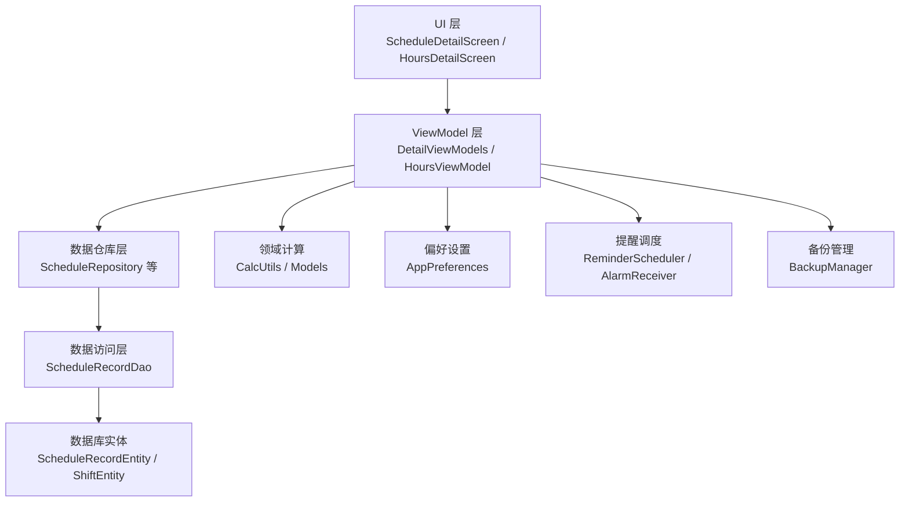
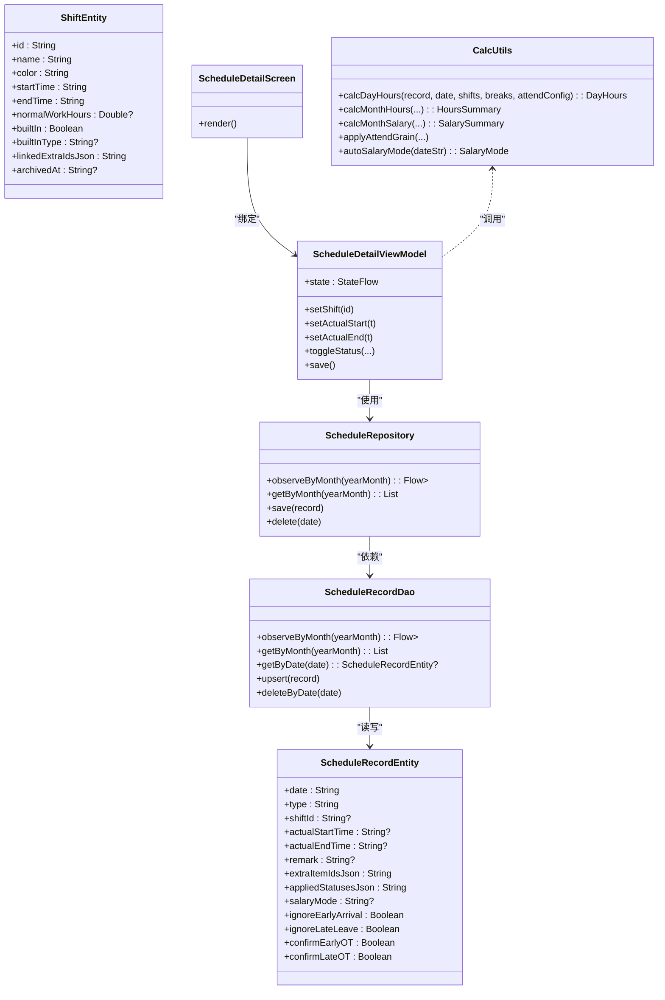
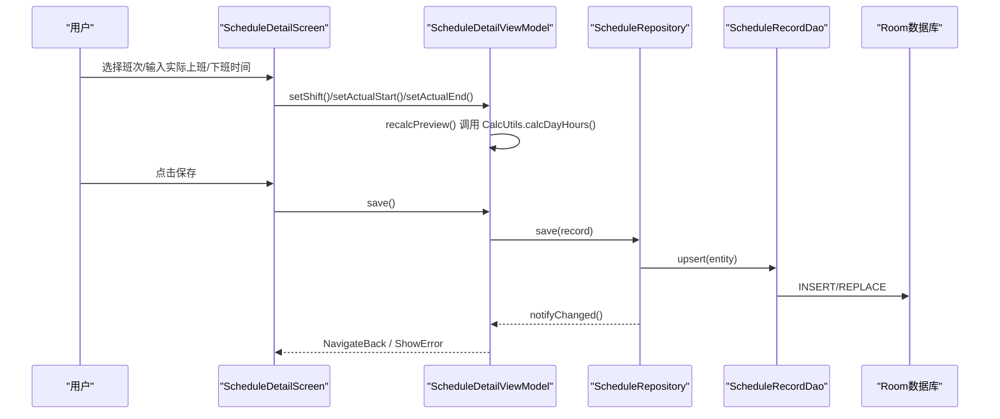
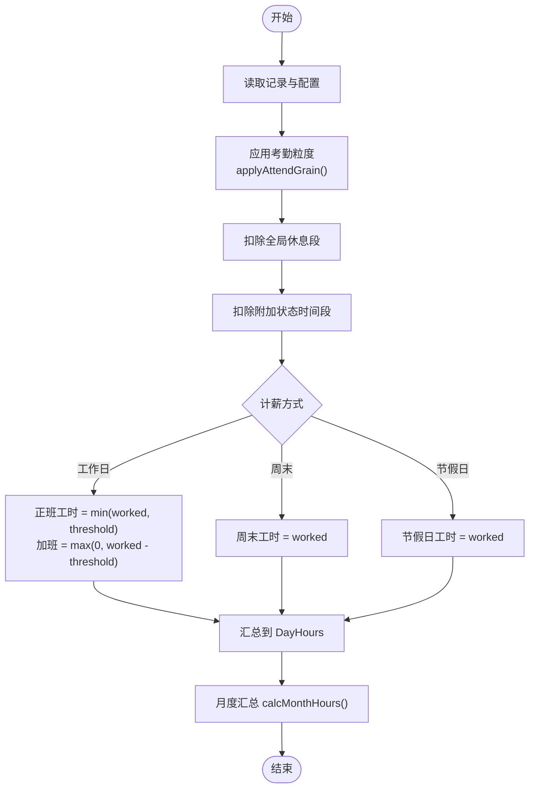
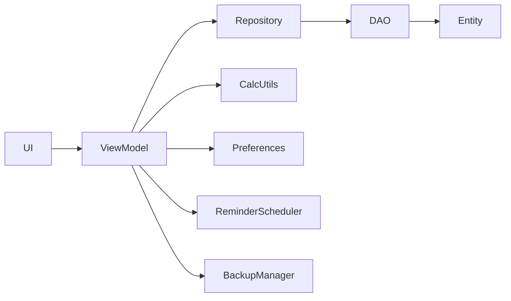

# 考勤打卡系统

<cite>
**本文引用的文件**   
- [ScheduleRecordEntity.kt](file://app/src/main/java/com/schedulecalendar/app/data/db/entity/ScheduleRecordEntity.kt)
- [ShiftEntity.kt](file://app/src/main/java/com/schedulecalendar/app/data/db/entity/ShiftEntity.kt)
- [Models.kt](file://app/src/main/java/com/schedulecalendar/app/domain/model/Models.kt)
- [CalcUtils.kt](file://app/src/main/java/com/schedulecalendar/app/domain/model/CalcUtils.kt)
- [ScheduleRecordDao.kt](file://app/src/main/java/com/schedulecalendar/app/data/db/dao/ScheduleRecordDao.kt)
- [ScheduleRepository.kt](file://app/src/main/java/com/schedulecalendar/app/data/repository/ScheduleRepository.kt)
- [DetailViewModels.kt](file://app/src/main/java/com/schedulecalendar/app/ui/detail/DetailViewModels.kt)
- [ScheduleDetailScreen.kt](file://app/src/main/java/com/schedulecalendar/app/ui/detail/ScheduleDetailScreen.kt)
- [HoursDetailScreen.kt](file://app/src/main/java/com/schedulecalendar/app/ui/detail/HoursDetailScreen.kt)
- [HoursViewModel.kt](file://app/src/main/java/com/schedulecalendar/app/ui/hours/HoursViewModel.kt)
- [ReminderScheduler.kt](file://app/src/main/java/com/schedulecalendar/app/reminder/ReminderScheduler.kt)
- [AlarmReceiver.kt](file://app/src/main/java/com/schedulecalendar/app/reminder/AlarmReceiver.kt)
- [BackupManager.kt](file://app/src/main/java/com/schedulecalendar/app/ui/settings/BackupManager.kt)
- [MainActivity.kt](file://app/src/main/java/com/schedulecalendar/app/MainActivity.kt)
</cite>

## 目录
1. [简介](#简介)
2. [项目结构](#项目结构)
3. [核心组件](#核心组件)
4. [架构总览](#架构总览)
5. [详细组件分析](#详细组件分析)
6. [依赖关系分析](#依赖关系分析)
7. [性能考量](#性能考量)
8. [故障排查指南](#故障排查指南)
9. [结论](#结论)
10. [附录](#附录)

## 简介
本技术文档围绕 Android 排班日历应用中的“考勤打卡系统”展开，重点解释：
- 手动打卡功能的实现原理（时间记录、状态判断、数据持久化）
- 迟到早退检测算法与工时计算逻辑
- 打卡历史记录管理与展示
- ScheduleDetailScreen 与 HoursDetailScreen 的数据展示与交互设计
- 自动打卡提醒、异常处理与统计报表生成
- 打卡数据的导入导出、备份恢复与同步机制
- 通过实际代码路径串联完整工作流程

## 项目结构
该模块采用典型的分层架构：UI（Compose）→ ViewModel → Repository → DAO/Room → 实体模型。业务计算集中在 domain 层工具类中，提醒与备份等横切能力由独立组件提供。

图表来源
- [ScheduleDetailScreen.kt:1-758](file://app/src/main/java/com/schedulecalendar/app/ui/detail/ScheduleDetailScreen.kt#L1-L758)
- [HoursDetailScreen.kt:1-165](file://app/src/main/java/com/schedulecalendar/app/ui/detail/HoursDetailScreen.kt#L1-L165)
- [DetailViewModels.kt:1-543](file://app/src/main/java/com/schedulecalendar/app/ui/detail/DetailViewModels.kt#L1-L543)
- [HoursViewModel.kt:1-208](file://app/src/main/java/com/schedulecalendar/app/ui/hours/HoursViewModel.kt#L1-L208)
- [ScheduleRepository.kt:1-40](file://app/src/main/java/com/schedulecalendar/app/data/repository/ScheduleRepository.kt#L1-L40)
- [ScheduleRecordDao.kt:1-40](file://app/src/main/java/com/schedulecalendar/app/data/db/dao/ScheduleRecordDao.kt#L1-L40)
- [ScheduleRecordEntity.kt:1-26](file://app/src/main/java/com/schedulecalendar/app/data/db/entity/ScheduleRecordEntity.kt#L1-L26)
- [ShiftEntity.kt:1-24](file://app/src/main/java/com/schedulecalendar/app/data/db/entity/ShiftEntity.kt#L1-L24)
- [CalcUtils.kt:1-557](file://app/src/main/java/com/schedulecalendar/app/domain/model/CalcUtils.kt#L1-L557)
- [ReminderScheduler.kt:1-497](file://app/src/main/java/com/schedulecalendar/app/reminder/ReminderScheduler.kt#L1-L497)
- [AlarmReceiver.kt:1-78](file://app/src/main/java/com/schedulecalendar/app/reminder/AlarmReceiver.kt#L1-L78)
- [BackupManager.kt:1-579](file://app/src/main/java/com/schedulecalendar/app/ui/settings/BackupManager.kt#L1-L579)

章节来源
- [ScheduleRecordEntity.kt:1-26](file://app/src/main/java/com/schedulecalendar/app/data/db/entity/ScheduleRecordEntity.kt#L1-L26)
- [ShiftEntity.kt:1-24](file://app/src/main/java/com/schedulecalendar/app/data/db/entity/ShiftEntity.kt#L1-L24)
- [Models.kt:1-278](file://app/src/main/java/com/schedulecalendar/app/domain/model/Models.kt#L1-L278)

## 核心组件
- 数据模型与实体
  - 排班记录：日期、类型、班次ID、实际上班/下班时间、备注、附加状态、薪资模式、加班确认开关等
  - 班次：名称、颜色、起止时间、正常工时阈值、内置类型（休息/调休/请假）、关联补贴扣款ID等
  - 领域模型：薪资配置、考勤规则、显示方案、月度汇总等
- 数据访问
  - Room DAO：按月份/范围查询、Upsert、删除等
  - Repository：封装 Flow 观察、Domain 转换、刷新信号
- 业务计算
  - CalcUtils：时间归一化、考勤粒度取整、迟到早退判定、工时分类（正班/加班/周末/节假日）、月统计、薪资计算、每日明细
- UI 与交互
  - ScheduleDetailScreen：选择班次、录入实际上班/下班、附加状态、补贴扣款、计薪方式、实时预览
  - HoursDetailScreen：按月展示各类明细（完整工时、迟到、早退、备注、漏打卡、补贴扣款）
- 提醒与备份
  - ReminderScheduler + AlarmReceiver：基于 AlarmManager 或系统日历的上下班提醒
  - BackupManager：应用数据与班次配置的自动/手动备份、恢复、裁剪策略

章节来源
- [Models.kt:1-278](file://app/src/main/java/com/schedulecalendar/app/domain/model/Models.kt#L1-L278)
- [CalcUtils.kt:1-557](file://app/src/main/java/com/schedulecalendar/app/domain/model/CalcUtils.kt#L1-L557)
- [ScheduleRecordDao.kt:1-40](file://app/src/main/java/com/schedulecalendar/app/data/db/dao/ScheduleRecordDao.kt#L1-L40)
- [ScheduleRepository.kt:1-40](file://app/src/main/java/com/schedulecalendar/app/data/repository/ScheduleRepository.kt#L1-L40)
- [DetailViewModels.kt:1-543](file://app/src/main/java/com/schedulecalendar/app/ui/detail/DetailViewModels.kt#L1-L543)
- [ScheduleDetailScreen.kt:1-758](file://app/src/main/java/com/schedulecalendar/app/ui/detail/ScheduleDetailScreen.kt#L1-L758)
- [HoursDetailScreen.kt:1-165](file://app/src/main/java/com/schedulecalendar/app/ui/detail/HoursDetailScreen.kt#L1-L165)
- [ReminderScheduler.kt:1-497](file://app/src/main/java/com/schedulecalendar/app/reminder/ReminderScheduler.kt#L1-L497)
- [AlarmReceiver.kt:1-78](file://app/src/main/java/com/schedulecalendar/app/reminder/AlarmReceiver.kt#L1-L78)
- [BackupManager.kt:1-579](file://app/src/main/java/com/schedulecalendar/app/ui/settings/BackupManager.kt#L1-L579)

## 架构总览
系统遵循 MVVM + Clean Architecture 思想：
- UI 层仅负责展示与用户交互，不直接读写数据库
- ViewModel 聚合多仓库数据，调用领域计算工具生成预览与报表
- Repository 屏蔽 DAO 细节，暴露 Flow 供 UI 响应式更新
- 领域层 CalcUtils 集中实现考勤与薪资算法，保证一致性
- 提醒与备份作为横切服务，通过依赖注入接入

图表来源
- [ScheduleRecordEntity.kt:1-26](file://app/src/main/java/com/schedulecalendar/app/data/db/entity/ScheduleRecordEntity.kt#L1-L26)
- [ShiftEntity.kt:1-24](file://app/src/main/java/com/schedulecalendar/app/data/db/entity/ShiftEntity.kt#L1-L24)
- [ScheduleRecordDao.kt:1-40](file://app/src/main/java/com/schedulecalendar/app/data/db/dao/ScheduleRecordDao.kt#L1-L40)
- [ScheduleRepository.kt:1-40](file://app/src/main/java/com/schedulecalendar/app/data/repository/ScheduleRepository.kt#L1-L40)
- [CalcUtils.kt:1-557](file://app/src/main/java/com/schedulecalendar/app/domain/model/CalcUtils.kt#L1-L557)
- [DetailViewModels.kt:1-543](file://app/src/main/java/com/schedulecalendar/app/ui/detail/DetailViewModels.kt#L1-L543)
- [ScheduleDetailScreen.kt:1-758](file://app/src/main/java/com/schedulecalendar/app/ui/detail/ScheduleDetailScreen.kt#L1-L758)

## 详细组件分析

### 手动打卡功能（时间记录、状态判断、数据持久化）
- 时间记录
  - 用户在 ScheduleDetailScreen 选择“实际上班/下班”时间，支持默认值与清除操作
  - 时间输入框集成 Material TimePicker，支持跨天与校验
- 状态判断
  - 根据是否选择休息/调休内置班次决定显示逻辑
  - 附加状态（请假/调休）可带时间段，影响工时扣减与提醒时间
- 数据持久化
  - ViewModel 维护当前日期的 ScheduleRecord 状态，变更时触发预览重算
  - 保存时将 Record 转换为 Entity 并通过 Repository 写入 Room 数据库
  - 写操作后发出 refreshSignal，驱动其他页面刷新

图表来源
- [ScheduleDetailScreen.kt:1-758](file://app/src/main/java/com/schedulecalendar/app/ui/detail/ScheduleDetailScreen.kt#L1-L758)
- [DetailViewModels.kt:1-543](file://app/src/main/java/com/schedulecalendar/app/ui/detail/DetailViewModels.kt#L1-L543)
- [ScheduleRepository.kt:1-40](file://app/src/main/java/com/schedulecalendar/app/data/repository/ScheduleRepository.kt#L1-L40)
- [ScheduleRecordDao.kt:1-40](file://app/src/main/java/com/schedulecalendar/app/data/db/dao/ScheduleRecordDao.kt#L1-L40)

章节来源
- [ScheduleDetailScreen.kt:1-758](file://app/src/main/java/com/schedulecalendar/app/ui/detail/ScheduleDetailScreen.kt#L1-L758)
- [DetailViewModels.kt:1-543](file://app/src/main/java/com/schedulecalendar/app/ui/detail/DetailViewModels.kt#L1-L543)
- [ScheduleRepository.kt:1-40](file://app/src/main/java/com/schedulecalendar/app/data/repository/ScheduleRepository.kt#L1-L40)
- [ScheduleRecordDao.kt:1-40](file://app/src/main/java/com/schedulecalendar/app/data/db/dao/ScheduleRecordDao.kt#L1-L40)

### 迟到早退检测算法与工时计算
- 迟到/早退判定
  - 比较实际打卡时间与计划时间的差值，考虑容忍时长（lateToleranceMin/earlyLeaveToleranceMin）
  - 超出容忍即记为迟到/早退，并用于统计与扣款
- 工时计算
  - 应用考勤粒度（overtimeGranMin）对早到/晚退进行向下取整
  - 扣除全局休息段（如午休）与附加状态时间段
  - 按计薪方式（工作日/周末/节假日）分类工时，超过正常班时长阈值的计入加班
- 月度统计
  - 汇总正班/加班/周末/节假日工时、请假天数折算、迟到早退次数、状态时段工时等

图表来源
- [CalcUtils.kt:1-557](file://app/src/main/java/com/schedulecalendar/app/domain/model/CalcUtils.kt#L1-L557)

章节来源
- [CalcUtils.kt:1-557](file://app/src/main/java/com/schedulecalendar/app/domain/model/CalcUtils.kt#L1-L557)
- [Models.kt:1-278](file://app/src/main/java/com/schedulecalendar/app/domain/model/Models.kt#L1-278)

### 打卡历史记录管理
- 历史列表
  - HoursDetailScreen 支持多种筛选：完整工时、迟到记录、早退记录、备注、漏打卡、补贴扣款
  - 每条记录包含日期、班次信息、主要文本、次要文本、高亮值（如迟到分钟数）
- 数据源
  - 从 ScheduleRepository 获取当月记录，结合 Shift/Break/Status/Extra 数据，通过 CalcUtils.getMonthScheduleDetails 生成明细
- 交互
  - 顶部标题显示年月与类型标签；空数据展示友好提示；加载态显示进度条

章节来源
- [HoursDetailScreen.kt:1-165](file://app/src/main/java/com/schedulecalendar/app/ui/detail/HoursDetailScreen.kt#L1-L165)
- [DetailViewModels.kt:1-543](file://app/src/main/java/com/schedulecalendar/app/ui/detail/DetailViewModels.kt#L1-L543)
- [HoursViewModel.kt:1-208](file://app/src/main/java/com/schedulecalendar/app/ui/hours/HoursViewModel.kt#L1-L208)

### ScheduleDetailScreen 与 HoursDetailScreen 的数据展示与交互设计
- ScheduleDetailScreen
  - 日期卡片：显示星期、农历、节假日、预计工时
  - 班次选择：底部弹窗，支持内置/自定义班次排序与颜色
  - 实际上班/下班：时间选择器，支持清除与默认值
  - 附加状态：单选切换，支持时间段编辑与约束校验
  - 补贴/扣款：多选勾选，自动合并班次默认关联项
  - 计薪方式：自动/工作日/周末/节假日，自动模式下显示标签
  - 工时与薪资明细：实时预览正班/加班工时与收入
- HoursDetailScreen
  - 列表展示：按类型过滤，突出关键指标（迟到/早退分钟、补贴扣款合计）
  - 空数据与加载态：清晰反馈，提升用户体验

章节来源
- [ScheduleDetailScreen.kt:1-758](file://app/src/main/java/com/schedulecalendar/app/ui/detail/ScheduleDetailScreen.kt#L1-L758)
- [HoursDetailScreen.kt:1-165](file://app/src/main/java/com/schedulecalendar/app/ui/detail/HoursDetailScreen.kt#L1-L165)

### 自动打卡提醒、异常处理与统计报表
- 自动打卡提醒
  - ReminderScheduler 支持两种模式：AlarmManager 精确闹钟与系统日历事件提醒
  - 针对内置请假/调休调整有效提醒时间，跨午夜班次下班提醒推后一天
  - AlarmReceiver 接收广播后创建通知，点击跳转主界面执行打卡动作
- 异常处理
  - ViewModel 保存/删除操作捕获异常并通过 Channel 发送 UI 事件（导航返回/错误提示）
  - 权限不足或系统限制时优雅降级（如无法设置精确闹钟则跳过）
- 统计报表
  - HoursViewModel 计算当月实际/预计工时、最近14天明细、近8个月趋势
  - CalcUtils 提供月度汇总与薪资计算，支持按日期过滤

章节来源
- [ReminderScheduler.kt:1-497](file://app/src/main/java/com/schedulecalendar/app/reminder/ReminderScheduler.kt#L1-L497)
- [AlarmReceiver.kt:1-78](file://app/src/main/java/com/schedulecalendar/app/reminder/AlarmReceiver.kt#L1-L78)
- [DetailViewModels.kt:1-543](file://app/src/main/java/com/schedulecalendar/app/ui/detail/DetailViewModels.kt#L1-L543)
- [HoursViewModel.kt:1-208](file://app/src/main/java/com/schedulecalendar/app/ui/hours/HoursViewModel.kt#L1-L208)
- [CalcUtils.kt:1-557](file://app/src/main/java/com/schedulecalendar/app/domain/model/CalcUtils.kt#L1-L557)

### 打卡数据的导入导出、备份恢复与同步机制
- 备份
  - BackupManager 支持应用数据与班次配置的自动/手动备份
  - 自动备份策略：应用数据每天只保留最新一条；班次配置每次修改生成新备份
  - 存储位置：私有目录与外部 SAF 路径统一处理，支持权限持久化
- 恢复
  - 从私有目录恢复应用数据或班次配置；支持 JSON 内容导入
  - 恢复过程覆盖相关表与偏好设置，确保一致性
- 同步机制
  - Repository 通过 Flow 与 refreshSignal 实现数据变更联动
  - 提醒调度在启动/设置变更时重新注册，保证状态一致

章节来源
- [BackupManager.kt:1-579](file://app/src/main/java/com/schedulecalendar/app/ui/settings/BackupManager.kt#L1-L579)
- [ScheduleRepository.kt:1-40](file://app/src/main/java/com/schedulecalendar/app/data/repository/ScheduleRepository.kt#L1-L40)
- [ReminderScheduler.kt:1-497](file://app/src/main/java/com/schedulecalendar/app/reminder/ReminderScheduler.kt#L1-L497)

## 依赖关系分析
- 组件耦合
  - UI 层仅依赖 ViewModel，ViewModel 依赖多个 Repository 与 Preferences
  - Repository 依赖 DAO，DAO 依赖 Room 实体
  - CalcUtils 为纯函数工具，无外部依赖，便于测试与复用
- 外部依赖
  - AlarmManager/NotificationManager 用于提醒
  - DocumentsContract/DocumentFile 用于 SAF 备份
  - Gson 用于 JSON 序列化/反序列化

图表来源
- [DetailViewModels.kt:1-543](file://app/src/main/java/com/schedulecalendar/app/ui/detail/DetailViewModels.kt#L1-L543)
- [HoursViewModel.kt:1-208](file://app/src/main/java/com/schedulecalendar/app/ui/hours/HoursViewModel.kt#L1-L208)
- [ScheduleRepository.kt:1-40](file://app/src/main/java/com/schedulecalendar/app/data/repository/ScheduleRepository.kt#L1-L40)
- [ScheduleRecordDao.kt:1-40](file://app/src/main/java/com/schedulecalendar/app/data/db/dao/ScheduleRecordDao.kt#L1-L40)
- [CalcUtils.kt:1-557](file://app/src/main/java/com/schedulecalendar/app/domain/model/CalcUtils.kt#L1-L557)
- [ReminderScheduler.kt:1-497](file://app/src/main/java/com/schedulecalendar/app/reminder/ReminderScheduler.kt#L1-L497)
- [BackupManager.kt:1-579](file://app/src/main/java/com/schedulecalendar/app/ui/settings/BackupManager.kt#L1-L579)

章节来源
- [DetailViewModels.kt:1-543](file://app/src/main/java/com/schedulecalendar/app/ui/detail/DetailViewModels.kt#L1-L543)
- [HoursViewModel.kt:1-208](file://app/src/main/java/com/schedulecalendar/app/ui/hours/HoursViewModel.kt#L1-L208)

## 性能考量
- 数据加载
  - HoursDetailViewModel 将耗时计算移至 IO 线程，避免阻塞主线程导致导航卡顿
  - Repository 使用 Flow 观察数据变化，减少重复查询
- 计算优化
  - CalcUtils 中对时间跨度与跨天场景进行归一化处理，避免多次解析
  - 月度统计采用一次性遍历与聚合，降低复杂度
- UI 渲染
  - Compose 状态驱动，按需重组；时间选择器对话框提升到滚动容器外部避免裁剪
- 提醒与备份
  - 提醒调度批量注册，避免频繁 I/O；备份列表通过单次 IPC 查询提升性能

[本节为通用指导，无需特定文件引用]

## 故障排查指南
- 保存失败
  - 检查 ViewModel 保存流程是否捕获异常并提示错误
  - 确认数据库连接与权限正常
- 提醒未触发
  - 检查系统是否允许精确闹钟（Android 12+）
  - 确认提醒方法（闹钟/日历）与开关设置
  - 查看 AlarmReceiver 是否正确创建通知渠道
- 备份恢复异常
  - 验证 JSON 格式与版本兼容
  - 检查 SAF 权限与路径解析是否正确
- 数据不同步
  - 确认 Repository 的 refreshSignal 是否被正确收集
  - 检查 ViewModel 是否在数据变更后触发预览重算

章节来源
- [DetailViewModels.kt:1-543](file://app/src/main/java/com/schedulecalendar/app/ui/detail/DetailViewModels.kt#L1-L543)
- [ReminderScheduler.kt:1-497](file://app/src/main/java/com/schedulecalendar/app/reminder/ReminderScheduler.kt#L1-L497)
- [AlarmReceiver.kt:1-78](file://app/src/main/java/com/schedulecalendar/app/reminder/AlarmReceiver.kt#L1-L78)
- [BackupManager.kt:1-579](file://app/src/main/java/com/schedulecalendar/app/ui/settings/BackupManager.kt#L1-L579)

## 结论
本考勤打卡系统以清晰的层次结构与领域计算为核心，实现了从手动打卡、工时计算、历史记录展示到自动提醒与备份恢复的完整闭环。通过 Flow 驱动的响应式更新与严格的异常处理，系统在易用性与稳定性之间取得良好平衡。未来可扩展更多统计维度与多端同步能力。

[本节为总结性内容，无需特定文件引用]

## 附录
- 关键数据流路径
  - 手动打卡：ScheduleDetailScreen → ScheduleDetailViewModel → ScheduleRepository → ScheduleRecordDao → Room
  - 工时计算：ScheduleDetailViewModel → CalcUtils → 返回预览数据
  - 月度统计：HoursViewModel → CalcUtils → HoursSummary/SalarySummary
  - 提醒触发：ReminderScheduler → AlarmReceiver → MainActivity 动作
  - 备份恢复：BackupManager → File/SAF → JSON 序列化/反序列化

章节来源
- [ScheduleDetailScreen.kt:1-758](file://app/src/main/java/com/schedulecalendar/app/ui/detail/ScheduleDetailScreen.kt#L1-L758)
- [DetailViewModels.kt:1-543](file://app/src/main/java/com/schedulecalendar/app/ui/detail/DetailViewModels.kt#L1-L543)
- [ScheduleRepository.kt:1-40](file://app/src/main/java/com/schedulecalendar/app/data/repository/ScheduleRepository.kt#L1-L40)
- [ScheduleRecordDao.kt:1-40](file://app/src/main/java/com/schedulecalendar/app/data/db/dao/ScheduleRecordDao.kt#L1-L40)
- [CalcUtils.kt:1-557](file://app/src/main/java/com/schedulecalendar/app/domain/model/CalcUtils.kt#L1-L557)
- [HoursViewModel.kt:1-208](file://app/src/main/java/com/schedulecalendar/app/ui/hours/HoursViewModel.kt#L1-L208)
- [ReminderScheduler.kt:1-497](file://app/src/main/java/com/schedulecalendar/app/reminder/ReminderScheduler.kt#L1-L497)
- [AlarmReceiver.kt:1-78](file://app/src/main/java/com/schedulecalendar/app/reminder/AlarmReceiver.kt#L1-L78)
- [BackupManager.kt:1-579](file://app/src/main/java/com/schedulecalendar/app/ui/settings/BackupManager.kt#L1-L579)
- [MainActivity.kt:1-322](file://app/src/main/java/com/schedulecalendar/app/MainActivity.kt#L1-L322)