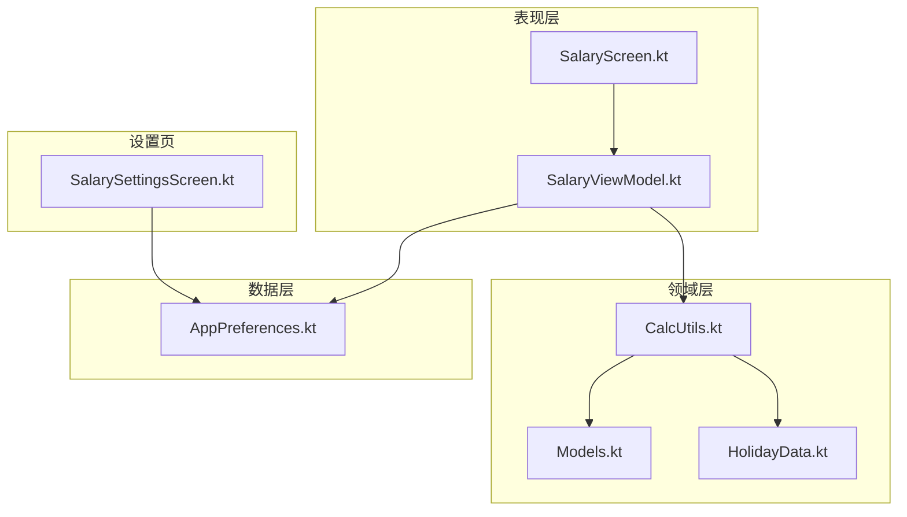
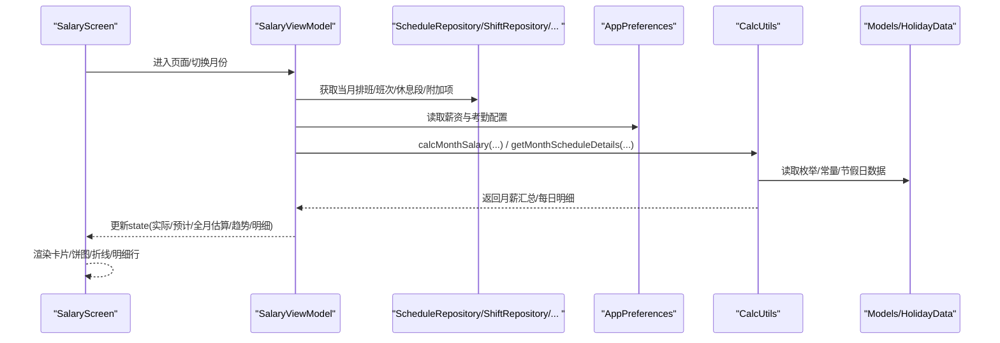
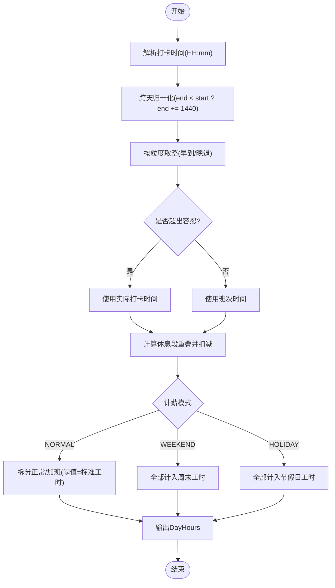
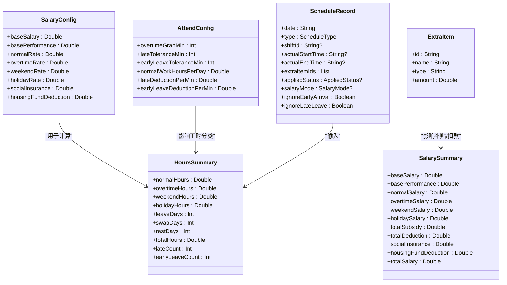
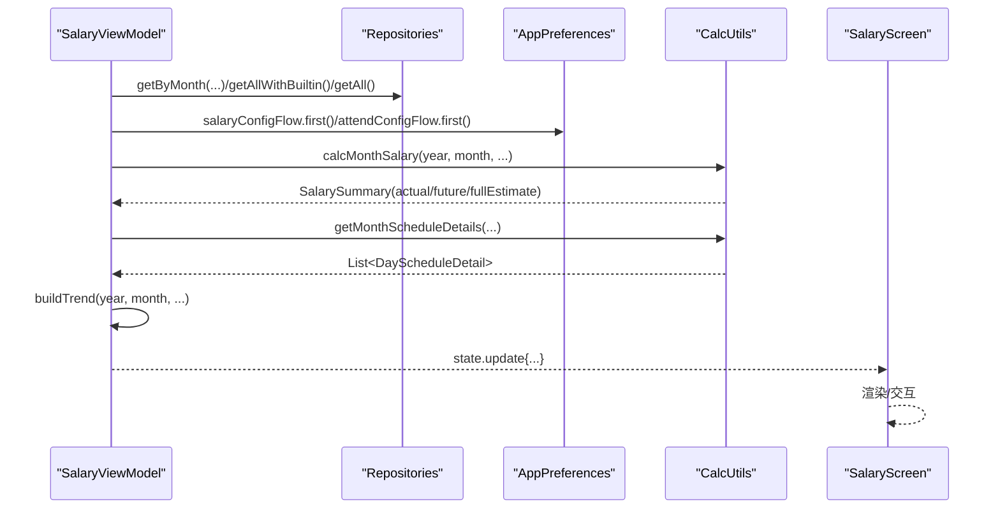
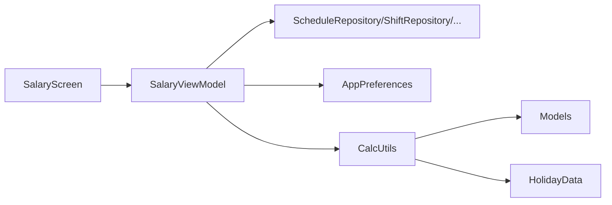

# 薪资计算引擎

<cite>
**本文引用的文件**   
- [CalcUtils.kt](file://app/src/main/java/com/schedulecalendar/app/domain/model/CalcUtils.kt)
- [Models.kt](file://app/src/main/java/com/schedulecalendar/app/domain/model/Models.kt)
- [HolidayData.kt](file://app/src/main/java/com/schedulecalendar/app/domain/model/HolidayData.kt)
- [SalaryScreen.kt](file://app/src/main/java/com/schedulecalendar/app/ui/salary/SalaryScreen.kt)
- [SalaryViewModel.kt](file://app/src/main/java/com/schedulecalendar/app/ui/salary/SalaryViewModel.kt)
- [AppPreferences.kt](file://app/src/main/java/com/schedulecalendar/app/data/prefs/AppPreferences.kt)
- [SalarySettingsScreen.kt](file://app/src/main/java/com/schedulecalendar/app/ui/settings/SalarySettingsScreen.kt)
</cite>

## 目录
1. [引言](#引言)
2. [项目结构](#项目结构)
3. [核心组件](#核心组件)
4. [架构总览](#架构总览)
5. [详细组件分析](#详细组件分析)
6. [依赖关系分析](#依赖关系分析)
7. [性能考量](#性能考量)
8. [故障排查指南](#故障排查指南)
9. [结论](#结论)
10. [附录](#附录)

## 引言
本技术文档围绕Android排班日历应用中的“薪资计算引擎”展开，重点阐述：
- 薪资配置的灵活性与可扩展性设计（底薪、绩效、正常/加班/周末/节假日时薪、补贴与扣款、社保与公积金）
- CalcUtils工具类的核心算法（工时转换、跨天处理、休息段扣减、考勤粒度取整、迟到早退容忍与扣款、节假日特殊计薪）
- SalaryScreen与SalaryViewModel的状态管理与数据流（月度报表、趋势图、可视化）
- 自定义薪资规则扩展点与性能优化建议
- 通过代码路径指引完整计算流程与最佳实践

## 项目结构
薪资计算引擎涉及领域模型、计算工具、UI展示与状态管理、配置持久化等模块。关键位置如下：
- 领域模型与常量：domain/model 下的 Models.kt、HolidayData.kt
- 计算核心：domain/model 下的 CalcUtils.kt
- UI与状态：ui/salary 下的 SalaryScreen.kt、SalaryViewModel.kt
- 配置存储：data/prefs 下的 AppPreferences.kt
- 设置界面：ui/settings 下的 SalarySettingsScreen.kt

**图表来源** 
- [CalcUtils.kt:1-557](file://app/src/main/java/com/schedulecalendar/app/domain/model/CalcUtils.kt#L1-L557)
- [Models.kt:1-278](file://app/src/main/java/com/schedulecalendar/app/domain/model/Models.kt#L1-L278)
- [HolidayData.kt:1-636](file://app/src/main/java/com/schedulecalendar/app/domain/model/HolidayData.kt#L1-L636)
- [SalaryScreen.kt:1-497](file://app/src/main/java/com/schedulecalendar/app/ui/salary/SalaryScreen.kt#L1-L497)
- [SalaryViewModel.kt:1-168](file://app/src/main/java/com/schedulecalendar/app/ui/salary/SalaryViewModel.kt#L1-L168)
- [AppPreferences.kt:1-313](file://app/src/main/java/com/schedulecalendar/app/data/prefs/AppPreferences.kt#L1-L313)
- [SalarySettingsScreen.kt:1-90](file://app/src/main/java/com/schedulecalendar/app/ui/settings/SalarySettingsScreen.kt#L1-L90)

**章节来源**
- [CalcUtils.kt:1-557](file://app/src/main/java/com/schedulecalendar/app/domain/model/CalcUtils.kt#L1-L557)
- [Models.kt:1-278](file://app/src/main/java/com/schedulecalendar/app/domain/model/Models.kt#L1-L278)
- [HolidayData.kt:1-636](file://app/src/main/java/com/schedulecalendar/app/domain/model/HolidayData.kt#L1-L636)
- [SalaryScreen.kt:1-497](file://app/src/main/java/com/schedulecalendar/app/ui/salary/SalaryScreen.kt#L1-L497)
- [SalaryViewModel.kt:1-168](file://app/src/main/java/com/schedulecalendar/app/ui/salary/SalaryViewModel.kt#L1-L168)
- [AppPreferences.kt:1-313](file://app/src/main/java/com/schedulecalendar/app/data/prefs/AppPreferences.kt#L1-L313)
- [SalarySettingsScreen.kt:1-90](file://app/src/main/java/com/schedulecalendar/app/ui/settings/SalarySettingsScreen.kt#L1-L90)

## 核心组件
- CalcUtils：纯函数式计算工具，封装时间转换、跨天归一化、考勤粒度取整、休息段扣减、日/月工时统计、月薪资汇总、每日明细生成、自动计薪模式判断等。
- Models：定义班次、排班记录、附加项、薪资配置、考勤配置、统计结果等数据结构。
- HolidayData：内置法定节假日与调休补班数据，提供日期类型判定与名称查询。
- SalaryViewModel：负责加载当月数据、调用CalcUtils计算、维护UI状态、构建近8个月趋势。
- SalaryScreen：Compose界面，展示月度预计薪资、明细网格、饼图构成、折线趋势、每日明细行。
- AppPreferences：基于DataStore的薪资与考勤配置持久化，暴露Flow供UI响应式消费。
- SalarySettingsScreen：薪资配置输入与保存入口。

**章节来源**
- [CalcUtils.kt:1-557](file://app/src/main/java/com/schedulecalendar/app/domain/model/CalcUtils.kt#L1-L557)
- [Models.kt:1-278](file://app/src/main/java/com/schedulecalendar/app/domain/model/Models.kt#L1-L278)
- [HolidayData.kt:1-636](file://app/src/main/java/com/schedulecalendar/app/domain/model/HolidayData.kt#L1-L636)
- [SalaryViewModel.kt:1-168](file://app/src/main/java/com/schedulecalendar/app/ui/salary/SalaryViewModel.kt#L1-L168)
- [SalaryScreen.kt:1-497](file://app/src/main/java/com/schedulecalendar/app/ui/salary/SalaryScreen.kt#L1-L497)
- [AppPreferences.kt:1-313](file://app/src/main/java/com/schedulecalendar/app/data/prefs/AppPreferences.kt#L1-L313)
- [SalarySettingsScreen.kt:1-90](file://app/src/main/java/com/schedulecalendar/app/ui/settings/SalarySettingsScreen.kt#L1-L90)

## 架构总览
薪资计算引擎采用“领域模型 + 工具类 + ViewModel + Compose UI + DataStore配置”的分层架构。数据流从Repository读取排班、班次、休息段、附加项，结合配置（薪资与考勤），由CalcUtils进行计算，最终由ViewModel聚合为UI状态，SalaryScreen渲染。

**图表来源** 
- [SalaryViewModel.kt:74-144](file://app/src/main/java/com/schedulecalendar/app/ui/salary/SalaryViewModel.kt#L74-L144)
- [SalaryScreen.kt:74-186](file://app/src/main/java/com/schedulecalendar/app/ui/salary/SalaryScreen.kt#L74-L186)
- [CalcUtils.kt:365-444](file://app/src/main/java/com/schedulecalendar/app/domain/model/CalcUtils.kt#L365-L444)
- [Models.kt:112-142](file://app/src/main/java/com/schedulecalendar/app/domain/model/Models.kt#L112-L142)
- [HolidayData.kt:171-175](file://app/src/main/java/com/schedulecalendar/app/domain/model/HolidayData.kt#L171-L175)

## 详细组件分析

### CalcUtils 工具类核心算法
- 时间工具
  - 时间字符串与分钟互转、跨天归一化、小时差计算
- 考勤粒度与容忍
  - applyAttendGrain：按粒度向下取整早到/晚退加班；在容忍范围内视为准点
- 全局休息段扣减
  - calcGlobalBreakHours：支持跨天，计算与班次时间窗重叠时长并扣减
- 日工时分类
  - calcDayHours：根据record.shiftId推导有效类型（休息/调休/请假），按salaryMode或autoSalaryMode分类为正常/加班/周末/节假日
- 月工时统计
  - calcMonthHours：累计正常/加班/周末/节假日工时，统计请假/调休/休息天数，迟到早退计数，请假折算天数
- 月薪资汇总
  - calcMonthSalary：按各工时×对应时薪，叠加补贴/扣款，扣除社保/公积金，得到totalSalary
- 每日明细
  - getMonthScheduleDetails：逐日生成normal/overtime/weekend/holiday工时与薪资，合并附加项合计
- 自动计薪模式
  - autoSalaryMode/isWeekend：依据HolidayData法定假日与调休补班判断HOLIDAY/WEEKEND/NORMAL

**图表来源** 
- [CalcUtils.kt:21-47](file://app/src/main/java/com/schedulecalendar/app/domain/model/CalcUtils.kt#L21-L47)
- [CalcUtils.kt:61-113](file://app/src/main/java/com/schedulecalendar/app/domain/model/CalcUtils.kt#L61-L113)
- [CalcUtils.kt:121-134](file://app/src/main/java/com/schedulecalendar/app/domain/model/CalcUtils.kt#L121-L134)
- [CalcUtils.kt:149-234](file://app/src/main/java/com/schedulecalendar/app/domain/model/CalcUtils.kt#L149-L234)
- [CalcUtils.kt:520-543](file://app/src/main/java/com/schedulecalendar/app/domain/model/CalcUtils.kt#L520-L543)

**章节来源**
- [CalcUtils.kt:1-557](file://app/src/main/java/com/schedulecalendar/app/domain/model/CalcUtils.kt#L1-L557)

### Models 数据模型与配置
- 薪资配置 SalaryConfig：底薪、绩效、正常/加班/周末/节假日时薪、社保、公积金
- 考勤配置 AttendConfig：加班粒度、迟到/早退容忍、标准工时、迟到/早退扣款费率
- 排班记录 ScheduleRecord：日期、类型、班次ID、实际打卡时间、附加项、已应用状态、计薪模式、忽略标志
- 附加项 ExtraItem：名称、类型（补贴/扣款）、金额
- 统计结果 HoursSummary/SalarySummary：工时与薪资汇总字段
- 内置常量与类型：BUILTIN_*、ScheduleType、SalaryMode、DisplayItemType等

**图表来源** 
- [Models.kt:112-142](file://app/src/main/java/com/schedulecalendar/app/domain/model/Models.kt#L112-L142)
- [Models.kt:82-111](file://app/src/main/java/com/schedulecalendar/app/domain/model/Models.kt#L82-L111)
- [Models.kt:226-270](file://app/src/main/java/com/schedulecalendar/app/domain/model/Models.kt#L226-L270)

**章节来源**
- [Models.kt:1-278](file://app/src/main/java/com/schedulecalendar/app/domain/model/Models.kt#L1-L278)

### HolidayData 节假日与调休
- 内置2024-2030年法定节假日与调休补班集合
- 提供 isLegalHoliday/isMakeupDay/getHolidayName 等方法
- 与自动计薪模式联动，决定HOLIDAY/WEEKEND/NORMAL

**章节来源**
- [HolidayData.kt:1-636](file://app/src/main/java/com/schedulecalendar/app/domain/model/HolidayData.kt#L1-L636)

### SalaryViewModel 状态管理与数据流
- 状态 SalaryUiState：year/month、actual/future/fullEstimate、details、trend、loading
- 数据加载：监听排班刷新信号，并发读取仓库与配置，调用CalcUtils计算
- 实际薪资 vs 预计薪资：当前月按今天分界，历史月=全月，未来月=仅基础项
- 趋势构建：近8个月 totalSalary 序列
- 错误处理：Channel发送ShowError事件，UI显示Snackbar

**图表来源** 
- [SalaryViewModel.kt:74-144](file://app/src/main/java/com/schedulecalendar/app/ui/salary/SalaryViewModel.kt#L74-L144)
- [SalaryViewModel.kt:146-162](file://app/src/main/java/com/schedulecalendar/app/ui/salary/SalaryViewModel.kt#L146-L162)
- [SalaryScreen.kt:74-186](file://app/src/main/java/com/schedulecalendar/app/ui/salary/SalaryScreen.kt#L74-L186)

**章节来源**
- [SalaryViewModel.kt:1-168](file://app/src/main/java/com/schedulecalendar/app/ui/salary/SalaryViewModel.kt#L1-L168)

### SalaryScreen 可视化与交互
- 顶部卡片：本月预计薪资、已到/预计再到
- 明细网格：底薪/绩效/正常/加班/周末/节假日/补贴/扣款/社保/公积金
- 图表区：薪资构成饼图、月薪趋势折线图
- 每日明细：日期、班次、状态标签、附加项、当日薪资与加班收入

**章节来源**
- [SalaryScreen.kt:1-497](file://app/src/main/java/com/schedulecalendar/app/ui/salary/SalaryScreen.kt#L1-L497)

### 薪资配置与持久化
- AppPreferences：DataStore存储SalaryConfig/AttendConfig，暴露Flow
- SalarySettingsScreen：输入框绑定配置字段，实时保存

**章节来源**
- [AppPreferences.kt:68-90](file://app/src/main/java/com/schedulecalendar/app/data/prefs/AppPreferences.kt#L68-L90)
- [SalarySettingsScreen.kt:1-90](file://app/src/main/java/com/schedulecalendar/app/ui/settings/SalarySettingsScreen.kt#L1-L90)

## 依赖关系分析
- CalcUtils依赖Models与HolidayData，不依赖UI与仓库，便于单元测试与复用
- SalaryViewModel依赖多个Repository与AppPreferences，承担编排职责
- SalaryScreen依赖ViewModel状态，无直接业务逻辑
- 配置变更通过Flow驱动UI与计算刷新

**图表来源** 
- [SalaryViewModel.kt:49-70](file://app/src/main/java/com/schedulecalendar/app/ui/salary/SalaryViewModel.kt#L49-L70)
- [CalcUtils.kt:1-16](file://app/src/main/java/com/schedulecalendar/app/domain/model/CalcUtils.kt#L1-L16)
- [Models.kt:1-11](file://app/src/main/java/com/schedulecalendar/app/domain/model/Models.kt#L1-L11)
- [HolidayData.kt:9-17](file://app/src/main/java/com/schedulecalendar/app/domain/model/HolidayData.kt#L9-L17)

**章节来源**
- [SalaryViewModel.kt:1-168](file://app/src/main/java/com/schedulecalendar/app/ui/salary/SalaryViewModel.kt#L1-L168)
- [CalcUtils.kt:1-557](file://app/src/main/java/com/schedulecalendar/app/domain/model/CalcUtils.kt#L1-L557)
- [Models.kt:1-278](file://app/src/main/java/com/schedulecalendar/app/domain/model/Models.kt#L1-L278)
- [HolidayData.kt:1-636](file://app/src/main/java/com/schedulecalendar/app/domain/model/HolidayData.kt#L1-L636)

## 性能考量
- 计算复杂度
  - 月工时/薪资：O(N)，N为当月排班记录数；每日明细同样线性遍历
  - 休息段扣减：对每个break求交集，整体仍线性
- I/O与并发
  - ViewModel中并行读取仓库与配置，减少阻塞
  - Flow响应式更新，避免重复请求
- 数值精度
  - roundD2统一保留两位小数，fmtHours格式化工时，避免浮点误差累积
- 内存与对象
  - DayHours/SalarySummary轻量数据类，按需构造
- 优化建议
  - 大数据量时可引入缓存（如当月Map缓存）
  - 趋势计算可延迟至可见区域再触发
  - 将复杂计算移至协程IO线程，避免主线程卡顿

[本节为通用指导，不直接分析具体文件]

## 故障排查指南
- 常见错误
  - 时间格式异常：确保HH:mm格式，空值处理返回0
  - 跨天边界：normRange与calcHourDiff需配合使用
  - 休息段未生效：检查startTime/endTime与班次窗口是否重叠
  - 考勤粒度：overtimeGranMin为0时不进行取整
  - 节假日误判：确认HolidayData数据与日期字符串一致
- 调试建议
  - 打印applyAttendGrain前后effectiveStart/effectiveEnd
  - 查看calcGlobalBreakHours返回值
  - 校验autoSalaryMode结果是否符合预期
  - 检查SalarySummary.totalSalary组成项

**章节来源**
- [CalcUtils.kt:21-47](file://app/src/main/java/com/schedulecalendar/app/domain/model/CalcUtils.kt#L21-L47)
- [CalcUtils.kt:61-113](file://app/src/main/java/com/schedulecalendar/app/domain/model/CalcUtils.kt#L61-L113)
- [CalcUtils.kt:121-134](file://app/src/main/java/com/schedulecalendar/app/domain/model/CalcUtils.kt#L121-L134)
- [CalcUtils.kt:520-543](file://app/src/main/java/com/schedulecalendar/app/domain/model/CalcUtils.kt#L520-L543)

## 结论
薪资计算引擎以CalcUtils为核心，结合清晰的领域模型与配置体系，实现了灵活的薪资要素与考勤规则。ViewModel与Compose UI形成响应式数据流，提供直观的月度报表与趋势可视化。通过模块化设计与扩展点（如SalaryMode、ExtraItem、AttendConfig），可便捷地定制薪资规则与计算公式，同时具备较好的性能与可维护性。

[本节为总结，不直接分析具体文件]

## 附录

### 薪资计算完整流程（代码路径指引）
- 读取配置与数据
  - [SalaryViewModel.kt:74-110](file://app/src/main/java/com/schedulecalendar/app/ui/salary/SalaryViewModel.kt#L74-L110)
- 月薪资汇总
  - [CalcUtils.kt:365-444](file://app/src/main/java/com/schedulecalendar/app/domain/model/CalcUtils.kt#L365-L444)
- 每日明细生成
  - [CalcUtils.kt:448-486](file://app/src/main/java/com/schedulecalendar/app/domain/model/CalcUtils.kt#L448-L486)
- 自动计薪模式判断
  - [CalcUtils.kt:520-543](file://app/src/main/java/com/schedulecalendar/app/domain/model/CalcUtils.kt#L520-L543)
- UI渲染与交互
  - [SalaryScreen.kt:108-186](file://app/src/main/java/com/schedulecalendar/app/ui/salary/SalaryScreen.kt#L108-L186)

### 自定义扩展点
- 新增薪资要素
  - 在SalarySummary中添加字段，并在calcMonthSalary中累加
- 扩展考勤规则
  - 在AttendConfig增加新字段，并在applyAttendGrain/calcMonthSalary中引用
- 自定义计薪模式
  - 扩展SalaryMode枚举，并在calcDayHours/autoSalaryMode中处理分支
- 附加项类型
  - 在ExtraItem.type中新增类型，并在getMonthScheduleDetails/calcMonthSalary中处理

[本节为概念性扩展说明，不直接分析具体文件]