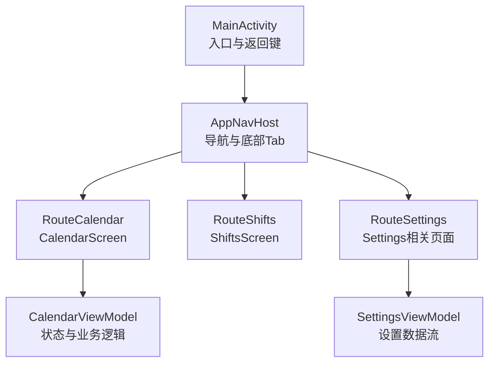
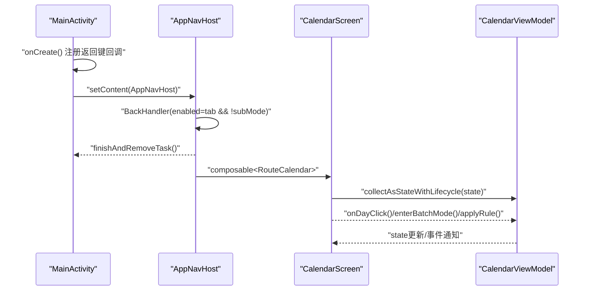
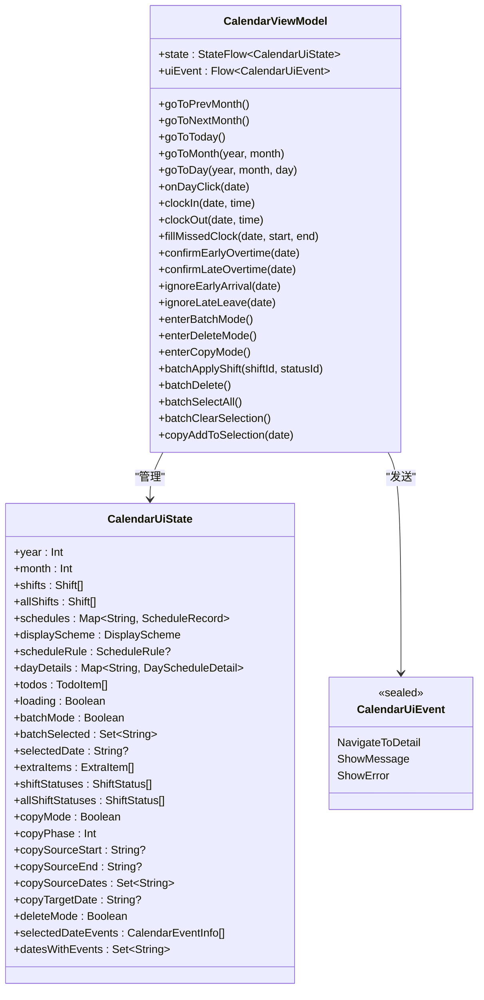
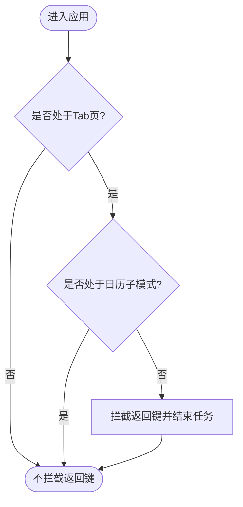
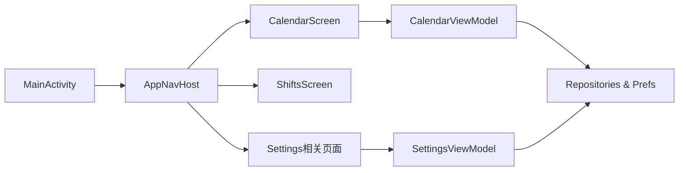

# UI测试

<cite>
**本文引用的文件**   
- [MainActivity.kt](file://app/src/main/java/com/schedulecalendar/app/MainActivity.kt)
- [ScheduleApp.kt](file://app/src/main/java/com/schedulecalendar/app/ScheduleApp.kt)
- [AppNavHost.kt](file://app/src/main/java/com/schedulecalendar/app/ui/navigation/AppNavHost.kt)
- [Screen.kt](file://app/src/main/java/com/schedulecalendar/app/ui/navigation/Screen.kt)
- [CalendarScreen.kt](file://app/src/main/java/com/schedulecalendar/app/ui/calendar/CalendarScreen.kt)
- [CalendarViewModel.kt](file://app/src/main/java/com/schedulecalendar/app/ui/calendar/CalendarViewModel.kt)
- [SettingsViewModel.kt](file://app/src/main/java/com/schedulecalendar/app/ui/settings/SettingsViewModel.kt)
- [build.gradle.kts](file://app/build.gradle.kts)
- [libs.versions.toml](file://gradle/libs.versions.toml)
</cite>

## 目录
1. [简介](#简介)
2. [项目结构](#项目结构)
3. [核心组件](#核心组件)
4. [架构总览](#架构总览)
5. [详细组件分析](#详细组件分析)
6. [依赖分析](#依赖分析)
7. [性能考虑](#性能考虑)
8. [故障排查指南](#故障排查指南)
9. [结论](#结论)
10. [附录](#附录)

## 简介
本文件面向Android排班日历应用的UI自动化与UI测试，重点覆盖：
- Jetpack Compose UI测试：规则、状态断言、用户交互模拟
- Espresso测试框架：传统View系统与Compose混合场景的测试策略
- 复杂界面测试：日历网格、排班编辑器、设置页等
- 跨页面导航与用户流程测试
- 视觉回归与截图对比
- 最佳实践与常见问题解决方案

## 项目结构
应用采用现代Android架构：
- Activity入口与系统级返回键处理（MainActivity）
- Compose导航与底部Tab（AppNavHost + Screen路由）
- 各功能模块以Composable实现（如CalendarScreen、ShiftsScreen、Settings相关页面）
- ViewModel通过Hilt注入，使用StateFlow管理UI状态
- 构建配置启用Compose与Navigation Compose

图表来源 
- [MainActivity.kt:141-220](file://app/src/main/java/com/schedulecalendar/app/MainActivity.kt#L141-L220)
- [AppNavHost.kt:57-172](file://app/src/main/java/com/schedulecalendar/app/ui/navigation/AppNavHost.kt#L57-L172)
- [Screen.kt:7-34](file://app/src/main/java/com/schedulecalendar/app/ui/navigation/Screen.kt#L7-L34)

章节来源
- [MainActivity.kt:141-220](file://app/src/main/java/com/schedulecalendar/app/MainActivity.kt#L141-L220)
- [AppNavHost.kt:57-172](file://app/src/main/java/com/schedulecalendar/app/ui/navigation/AppNavHost.kt#L57-L172)
- [Screen.kt:7-34](file://app/src/main/java/com/schedulecalendar/app/ui/navigation/Screen.kt#L7-L34)

## 核心组件
- MainActivity：权限弹窗、快捷方式处理、全局返回键拦截（含API 34+ Overlay回调）
- AppNavHost：类型安全路由、底部Tab、BackHandler统一处理
- CalendarScreen/CalendarViewModel：日历网格、批量操作、复制/删除模式、事件加载
- SettingsViewModel：设置项聚合、清空数据流程、错误提示

章节来源
- [MainActivity.kt:141-220](file://app/src/main/java/com/schedulecalendar/app/MainActivity.kt#L141-L220)
- [AppNavHost.kt:57-172](file://app/src/main/java/com/schedulecalendar/app/ui/navigation/AppNavHost.kt#L57-L172)
- [CalendarScreen.kt:227-250](file://app/src/main/java/com/schedulecalendar/app/ui/calendar/CalendarScreen.kt#L227-L250)
- [CalendarViewModel.kt:118-151](file://app/src/main/java/com/schedulecalendar/app/ui/calendar/CalendarViewModel.kt#L118-L151)
- [SettingsViewModel.kt:34-91](file://app/src/main/java/com/schedulecalendar/app/ui/settings/SettingsViewModel.kt#L34-L91)

## 架构总览
下图展示从Activity到Compose导航再到具体页面的调用链，以及返回键在不同层级的处理。

图表来源 
- [MainActivity.kt:141-157](file://app/src/main/java/com/schedulecalendar/app/MainActivity.kt#L141-L157)
- [AppNavHost.kt:161-170](file://app/src/main/java/com/schedulecalendar/app/ui/navigation/AppNavHost.kt#L161-L170)
- [CalendarScreen.kt:227-250](file://app/src/main/java/com/schedulecalendar/app/ui/calendar/CalendarScreen.kt#L227-L250)
- [CalendarViewModel.kt:345-398](file://app/src/main/java/com/schedulecalendar/app/ui/calendar/CalendarViewModel.kt#L345-L398)

## 详细组件分析

### 日历界面（CalendarScreen + CalendarViewModel）
- 状态驱动：通过StateFlow暴露year/month/schedules/dayDetails/todos等状态
- 交互：点击日期、切换月份、批量选择、复制/删除模式、打卡补录、加班确认/忽略
- 事件：NavigateToDetail、ShowMessage、ShowError由Channel分发

图表来源 
- [CalendarViewModel.kt:118-151](file://app/src/main/java/com/schedulecalendar/app/ui/calendar/CalendarViewModel.kt#L118-L151)
- [CalendarViewModel.kt:345-398](file://app/src/main/java/com/schedulecalendar/app/ui/calendar/CalendarViewModel.kt#L345-L398)
- [CalendarViewModel.kt:475-502](file://app/src/main/java/com/schedulecalendar/app/ui/calendar/CalendarViewModel.kt#L475-L502)
- [CalendarViewModel.kt:699-727](file://app/src/main/java/com/schedulecalendar/app/ui/calendar/CalendarViewModel.kt#L699-L727)
- [CalendarViewModel.kt:729-757](file://app/src/main/java/com/schedulecalendar/app/ui/calendar/CalendarViewModel.kt#L729-L757)
- [CalendarViewModel.kt:791-800](file://app/src/main/java/com/schedulecalendar/app/ui/calendar/CalendarViewModel.kt#L791-L800)

章节来源
- [CalendarScreen.kt:227-250](file://app/src/main/java/com/schedulecalendar/app/ui/calendar/CalendarScreen.kt#L227-L250)
- [CalendarViewModel.kt:118-151](file://app/src/main/java/com/schedulecalendar/app/ui/calendar/CalendarViewModel.kt#L118-L151)
- [CalendarViewModel.kt:345-398](file://app/src/main/java/com/schedulecalendar/app/ui/calendar/CalendarViewModel.kt#L345-L398)
- [CalendarViewModel.kt:475-502](file://app/src/main/java/com/schedulecalendar/app/ui/calendar/CalendarViewModel.kt#L475-L502)
- [CalendarViewModel.kt:699-727](file://app/src/main/java/com/schedulecalendar/app/ui/calendar/CalendarViewModel.kt#L699-L727)
- [CalendarViewModel.kt:729-757](file://app/src/main/java/com/schedulecalendar/app/ui/calendar/CalendarViewModel.kt#L729-L757)
- [CalendarViewModel.kt:791-800](file://app/src/main/java/com/schedulecalendar/app/ui/calendar/CalendarViewModel.kt#L791-L800)

### 排班编辑器（ShiftEditorScreen）
- 典型表单编辑：时间字段、颜色选择、关联附加项
- 与ViewModel交互：保存/撤销、校验输入、显示Snackbar
- 测试要点：输入验证、状态回显、导航返回

章节来源
- [AppNavHost.kt:145](file://app/src/main/java/com/schedulecalendar/app/ui/navigation/AppNavHost.kt#L145-L145)
- [Screen.kt:26](file://app/src/main/java/com/schedulecalendar/app/ui/navigation/Screen.kt#L26-L26)

### 设置页面（Settings相关 + SettingsViewModel）
- 设置项聚合：薪资配置、考勤配置、排班规则、显示方案
- 一次性事件：清空确认、数据清空成功、错误提示
- 测试要点：配置保存、清空流程、错误路径

章节来源
- [SettingsViewModel.kt:34-91](file://app/src/main/java/com/schedulecalendar/app/ui/settings/SettingsViewModel.kt#L34-L91)
- [AppNavHost.kt:138-142](file://app/src/main/java/com/schedulecalendar/app/ui/navigation/AppNavHost.kt#L138-L142)

### 导航与返回键（AppNavHost + MainActivity）
- 类型安全路由：object/data class定义路由参数
- BackHandler：在Tab页且非子模式时直接结束任务
- API 34+ Overlay回调：优先拦截返回键，兜底OnBackPressedDispatcher

图表来源 
- [AppNavHost.kt:161-170](file://app/src/main/java/com/schedulecalendar/app/ui/navigation/AppNavHost.kt#L161-L170)
- [MainActivity.kt:141-157](file://app/src/main/java/com/schedulecalendar/app/MainActivity.kt#L141-L157)

章节来源
- [AppNavHost.kt:57-172](file://app/src/main/java/com/schedulecalendar/app/ui/navigation/AppNavHost.kt#L57-L172)
- [Screen.kt:7-34](file://app/src/main/java/com/schedulecalendar/app/ui/navigation/Screen.kt#L7-L34)
- [MainActivity.kt:141-157](file://app/src/main/java/com/schedulecalendar/app/MainActivity.kt#L141-L157)

## 依赖分析
- Compose与Navigation Compose：UI声明式与类型安全路由
- Hilt：依赖注入（ViewModel、Repository、Preferences）
- Room/DataStore：本地数据与偏好存储
- Glance：桌面小组件（与UI测试无直接关系）

图表来源 
- [build.gradle.kts:81-141](file://app/build.gradle.kts#L81-L141)
- [libs.versions.toml:29-46](file://gradle/libs.versions.toml#L29-L46)

章节来源
- [build.gradle.kts:81-141](file://app/build.gradle.kts#L81-L141)
- [libs.versions.toml:29-46](file://gradle/libs.versions.toml#L29-L46)

## 性能考虑
- 首帧优化：延迟非关键初始化（备份、日历ID创建）
- 状态收集：collectAsStateWithLifecycle避免内存泄漏
- 导航防抖：底部Tab最小点击间隔，避免重组堆积
- 数据范围：相邻月份预加载，减少滑动卡顿

章节来源
- [CalendarViewModel.kt:140-151](file://app/src/main/java/com/schedulecalendar/app/ui/calendar/CalendarViewModel.kt#L140-L151)
- [AppNavHost.kt:76-110](file://app/src/main/java/com/schedulecalendar/app/ui/navigation/AppNavHost.kt#L76-L110)

## 故障排查指南
- 返回键行为异常：检查isOnTabPage与calendarSubModeActive同步；确认BackHandler与Overlay回调优先级
- 权限弹窗导致测试阻塞：在测试中跳过或自动授权（模拟器/Root）
- 导航跳转失败：确认路由定义与参数序列化；确保NavController可用
- Snackbar未显示：检查事件流订阅与生命周期绑定

章节来源
- [MainActivity.kt:82-124](file://app/src/main/java/com/schedulecalendar/app/MainActivity.kt#L82-L124)
- [AppNavHost.kt:161-170](file://app/src/main/java/com/schedulecalendar/app/ui/navigation/AppNavHost.kt#L161-L170)

## 结论
本项目基于Compose与Navigation构建现代化UI，具备清晰的MVVM分层与类型安全路由。针对UI测试，建议：
- 使用Compose Testing进行状态与交互验证
- 对复杂流程（日历批量操作、复制排班、设置清空）编写端到端用例
- 结合Espresso处理遗留View与对话框场景
- 引入截图对比保障视觉回归稳定性

## 附录

### Compose UI测试实施要点
- 测试规则与启动：使用createComposeRule或createAndroidComposeRule启动Compose环境
- 状态断言：通过Semantics匹配文本、内容描述、可组合项状态
- 用户交互：click、longClick、drag、swipe、typeText、scroll等
- 异步处理：runCurrentFrame、advanceUntilIdle、testScheduler控制协程与动画

章节来源
- [build.gradle.kts:50](file://app/build.gradle.kts#L50-L50)
- [libs.versions.toml:29-46](file://gradle/libs.versions.toml#L29-L46)

### Espresso测试策略（混合架构）
- 传统View：使用onView、perform、assertThat
- 对话框与系统权限：使用onData、onActivityResult、Instrumentation
- 与Compose共存：优先Compose测试；必要时用Espresso处理原生组件

章节来源
- [build.gradle.kts:81-141](file://app/build.gradle.kts#L81-L141)

### 用户流程与跨页面导航测试
- 日历→详情→返回：验证状态保持与BackHandler行为
- 设置→清空数据：验证数据清除与UI刷新
- 班次编辑→保存：验证输入校验与结果回显

章节来源
- [AppNavHost.kt:122-158](file://app/src/main/java/com/schedulecalendar/app/ui/navigation/AppNavHost.kt#L122-L158)
- [SettingsViewModel.kt:71-91](file://app/src/main/java/com/schedulecalendar/app/ui/settings/SettingsViewModel.kt#L71-L91)

### 视觉回归与截图对比
- 使用Compose screenshot工具生成基准图
- 对比阈值与容差设置，避免误报
- 定期更新基准图，记录变更原因

章节来源
- [.gitignore:18](file://app/.gitignore#L18-L18)