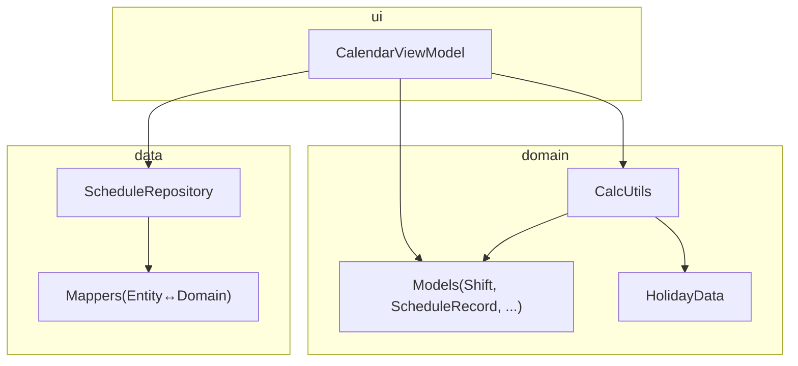
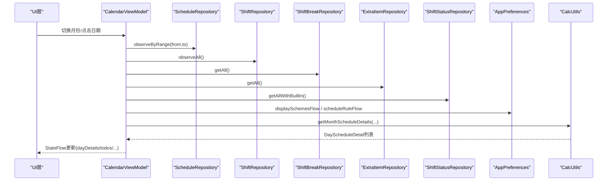
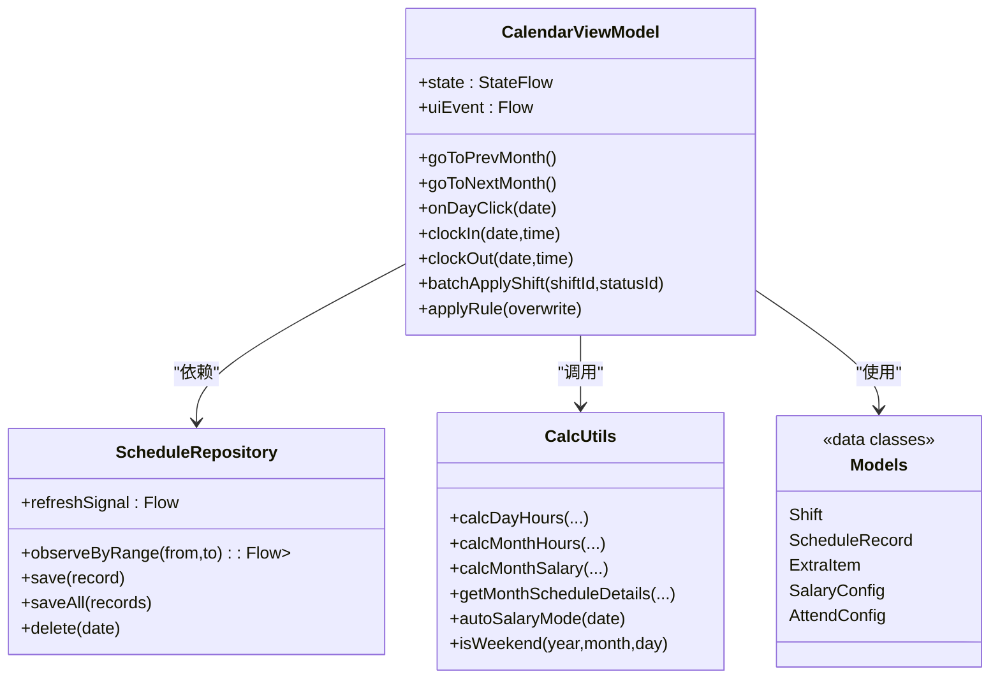

# 单元测试

<cite>
**本文引用的文件**   
- [app/build.gradle.kts](file://app/build.gradle.kts)
- [gradle/libs.versions.toml](file://gradle/libs.versions.toml)
- [CalcUtils.kt](file://app/src/main/java/com/schedulecalendar/app/domain/model/CalcUtils.kt)
- [Models.kt](file://app/src/main/java/com/schedulecalendar/app/domain/model/Models.kt)
- [HolidayData.kt](file://app/src/main/java/com/schedulecalendar/app/domain/model/HolidayData.kt)
- [CalendarViewModel.kt](file://app/src/main/java/com/schedulecalendar/app/ui/calendar/CalendarViewModel.kt)
- [ScheduleRepository.kt](file://app/src/main/java/com/schedulecalendar/app/data/repository/ScheduleRepository.kt)
- [Mappers.kt](file://app/src/main/java/com/schedulecalendar/app/data/repository/Mappers.kt)
</cite>

## 目录
1. [简介](#简介)
2. [项目结构](#项目结构)
3. [核心组件](#核心组件)
4. [架构总览](#架构总览)
5. [详细组件分析](#详细组件分析)
6. [依赖关系分析](#依赖关系分析)
7. [性能考量](#性能考量)
8. [故障排查指南](#故障排查指南)
9. [结论](#结论)
10. [附录](#附录)

## 简介
本文件面向Android排班日历应用的单元测试实践，聚焦以下目标：
- 使用JUnit 5与MockK框架进行单元测试的最佳实践
- 为业务逻辑类（如CalcUtils）编写边界条件、异常处理与性能测试
- 为ViewModel（如CalendarViewModel）实现StateFlow与协程测试，并模拟依赖注入
- 为Repository层设计数据库操作与网络请求的模拟策略
- 提供具体测试用例示例与断言方法
- 配置测试覆盖率工具与报告生成

## 项目结构
当前仓库采用模块化分层：
- domain层：纯Kotlin业务逻辑（CalcUtils、模型定义等）
- data层：Repository与DAO映射（ScheduleRepository、Mappers等）
- ui层：ViewModel与UI状态管理（CalendarViewModel等）
- 构建与依赖：Gradle + libs.versions.toml集中管理版本

图表来源
- [CalcUtils.kt:1-557](file://app/src/main/java/com/schedulecalendar/app/domain/model/CalcUtils.kt#L1-L557)
- [Models.kt:1-278](file://app/src/main/java/com/schedulecalendar/app/domain/model/Models.kt#L1-L278)
- [HolidayData.kt:1-636](file://app/src/main/java/com/schedulecalendar/app/domain/model/HolidayData.kt#L1-L636)
- [ScheduleRepository.kt:1-40](file://app/src/main/java/com/schedulecalendar/app/data/repository/ScheduleRepository.kt#L1-L40)
- [Mappers.kt:92-133](file://app/src/main/java/com/schedulecalendar/app/data/repository/Mappers.kt#L92-L133)
- [CalendarViewModel.kt:118-246](file://app/src/main/java/com/schedulecalendar/app/ui/calendar/CalendarViewModel.kt#L118-L246)

章节来源
- [app/build.gradle.kts:1-141](file://app/build.gradle.kts#L1-L141)
- [gradle/libs.versions.toml:1-86](file://gradle/libs.versions.toml#L1-L86)

## 核心组件
- CalcUtils：工时/薪资计算核心，包含时间转换、考勤粒度处理、休息段扣减、日/月统计、薪资汇总、周末/节假日判定等。
- CalendarViewModel：UI状态管理与业务编排，组合多个Repository与Preferences，通过StateFlow暴露状态，协程驱动异步任务。
- ScheduleRepository：对ScheduleRecord的CRUD与变更信号发布，封装DAO调用与领域对象映射。
- Models：领域数据模型（Shift、ScheduleRecord、ExtraItem、SalaryConfig、AttendConfig等）。
- HolidayData：法定节假日与调休数据、节气信息、节日名称查询等。

章节来源
- [CalcUtils.kt:1-557](file://app/src/main/java/com/schedulecalendar/app/domain/model/CalcUtils.kt#L1-L557)
- [CalendarViewModel.kt:118-246](file://app/src/main/java/com/schedulecalendar/app/ui/calendar/CalendarViewModel.kt#L118-L246)
- [ScheduleRepository.kt:1-40](file://app/src/main/java/com/schedulecalendar/app/data/repository/ScheduleRepository.kt#L1-L40)
- [Models.kt:1-278](file://app/src/main/java/com/schedulecalendar/app/domain/model/Models.kt#L1-L278)
- [HolidayData.kt:1-636](file://app/src/main/java/com/schedulecalendar/app/domain/model/HolidayData.kt#L1-L636)

## 架构总览
下图展示ViewModel如何组合Repository与业务逻辑，并通过StateFlow驱动UI。

图表来源
- [CalendarViewModel.kt:153-246](file://app/src/main/java/com/schedulecalendar/app/ui/calendar/CalendarViewModel.kt#L153-L246)
- [CalcUtils.kt:448-486](file://app/src/main/java/com/schedulecalendar/app/domain/model/CalcUtils.kt#L448-L486)
- [ScheduleRepository.kt:22-39](file://app/src/main/java/com/schedulecalendar/app/data/repository/ScheduleRepository.kt#L22-L39)

## 详细组件分析

### CalcUtils 单元测试策略
CalcUtils是纯函数式工具类，适合在JVM环境运行单元测试，无需Android运行时。建议覆盖：
- 边界条件：空字符串、跨天、负数时长、零时长、闰年/月末、整点/半点粒度对齐
- 异常处理：非法输入（非HH:mm）、空集合、空班次、空记录
- 性能测试：大月份数据聚合、批量计算耗时与内存占用

推荐测试分类与断言要点：
- 时间转换与归一化
  - timeToMin/minutesToTime/normRange/calcHourDiff
  - 断言：边界值（00:00、23:59）、跨天差值、空串返回0
- 考勤粒度与容忍度
  - applyAttendGrain
  - 断言：早到/迟到/晚退/早退在不同grain与tolerance下的有效起止时间
- 全局休息段扣减
  - calcGlobalBreakHours
  - 断言：重叠区间计算、跨天break、多break叠加
- 日工时与分类
  - calcDayHours
  - 断言：REST/SWAP/LEAVE分支、appliedStatus时间段扣减、salaryMode自动推断
- 月工时汇总
  - calcMonthHours
  - 断言：leaveDays折算、late/earlyLeave计数、totalHours一致性
- 月薪资汇总
  - calcMonthSalary
  - 断言：base+绩效+各类时薪+补贴-扣款-社保-公积金=totalSalary
- 每日明细
  - getMonthScheduleDetails
  - 断言：normal/overtime/weekend/holiday拆分、extras合计影响
- 周末/节假日判断
  - autoSalaryMode/isWeekend
  - 断言：法定假日、调休补班、周末判定

示例断言思路（不直接贴代码，仅给出路径参考）：
- 验证跨天加班粒度取整：[applyAttendGrain用法:61-113](file://app/src/main/java/com/schedulecalendar/app/domain/model/CalcUtils.kt#L61-L113)
- 验证请假全天无工时分派：[calcDayHours分支:149-234](file://app/src/main/java/com/schedulecalendar/app/domain/model/CalcUtils.kt#L149-L234)
- 验证迟到/早退扣款累计：[calcMonthSalary扣款逻辑:409-424](file://app/src/main/java/com/schedulecalendar/app/domain/model/CalcUtils.kt#L409-L424)

章节来源
- [CalcUtils.kt:1-557](file://app/src/main/java/com/schedulecalendar/app/domain/model/CalcUtils.kt#L1-L557)
- [Models.kt:1-278](file://app/src/main/java/com/schedulecalendar/app/domain/model/Models.kt#L1-L278)
- [HolidayData.kt:1-636](file://app/src/main/java/com/schedulecalendar/app/domain/model/HolidayData.kt#L1-L636)

### CalendarViewModel 单元测试策略
CalendarViewModel依赖多个Repository与Preferences，且大量使用协程与StateFlow。测试重点：
- StateFlow状态变化：切月、选择日期、批量操作后的state快照
- 协程行为：延迟初始化、取消旧Job、错误捕获与事件发送
- 依赖注入模拟：Hilt在单元测试中通常以手动构造或TestModule替换

推荐测试场景：
- loadCurrentMonth组合流触发后，dayDetails/todos/shifts等字段正确更新
- goToPrevMonth/goToNextMonth切换月份，collectJob被取消并重建
- onDayClick/selectDate事件触发selectedDateEvents加载
- clockIn/clockOut跨午夜修正逻辑
- batchApplyShift/batchDelete批量写入与消息提示
- applyRule应用排班规则生成记录

断言建议：
- 使用runTest或StandardTestDispatcher控制协程调度
- 使用testScheduler.advanceUntilIdle或advanceTimeBy推进时间
- 断言_state.value的字段变化与_uiEvent接收到的事件类型

章节来源
- [CalendarViewModel.kt:118-246](file://app/src/main/java/com/schedulecalendar/app/ui/calendar/CalendarViewModel.kt#L118-L246)
- [CalendarViewModel.kt:343-400](file://app/src/main/java/com/schedulecalendar/app/ui/calendar/CalendarViewModel.kt#L343-L400)
- [CalendarViewModel.kt:475-502](file://app/src/main/java/com/schedulecalendar/app/ui/calendar/CalendarViewModel.kt#L475-L502)
- [CalendarViewModel.kt:645-694](file://app/src/main/java/com/schedulecalendar/app/ui/calendar/CalendarViewModel.kt#L645-L694)

### Repository 层单元测试策略
ScheduleRepository封装DAO与领域映射，测试关注：
- Flow响应：observeByRange/observeByMonth返回的Flow是否按预期发射
- 写操作通知：save/saveAll/delete后refreshSignal是否发出
- 映射正确性：toEntity/toDomain转换（见Mappers）

推荐测试场景：
- 插入/更新/删除后，观察者收到新列表
- 范围查询过滤正确
- 并发写入不会丢失刷新信号

断言建议：
- 使用TestScope与TestDispatcher控制协程
- 使用Channel或SharedFlow收集器验证事件序列
- 断言实体与领域对象的字段一致性

章节来源
- [ScheduleRepository.kt:1-40](file://app/src/main/java/com/schedulecalendar/app/data/repository/ScheduleRepository.kt#L1-L40)
- [Mappers.kt:92-133](file://app/src/main/java/com/schedulecalendar/app/data/repository/Mappers.kt#L92-L133)

## 依赖关系分析
ViewModel依赖多个Repository与Preferences，业务逻辑集中在CalcUtils；数据层通过Mappers完成Entity与Domain的双向转换。

图表来源
- [CalendarViewModel.kt:118-246](file://app/src/main/java/com/schedulecalendar/app/ui/calendar/CalendarViewModel.kt#L118-L246)
- [ScheduleRepository.kt:1-40](file://app/src/main/java/com/schedulecalendar/app/data/repository/ScheduleRepository.kt#L1-L40)
- [CalcUtils.kt:1-557](file://app/src/main/java/com/schedulecalendar/app/domain/model/CalcUtils.kt#L1-L557)
- [Models.kt:1-278](file://app/src/main/java/com/schedulecalendar/app/domain/model/Models.kt#L1-L278)

章节来源
- [CalendarViewModel.kt:118-246](file://app/src/main/java/com/schedulecalendar/app/ui/calendar/CalendarViewModel.kt#L118-L246)
- [ScheduleRepository.kt:1-40](file://app/src/main/java/com/schedulecalendar/app/data/repository/ScheduleRepository.kt#L1-L40)
- [CalcUtils.kt:1-557](file://app/src/main/java/com/schedulecalendar/app/domain/model/CalcUtils.kt#L1-L557)
- [Models.kt:1-278](file://app/src/main/java/com/schedulecalendar/app/domain/model/Models.kt#L1-L278)

## 性能考量
- CalcUtils的月度聚合算法复杂度约为O(N)，N为当月排班记录数量；建议在大数据集下避免重复计算，缓存中间结果。
- ViewModel中loadCurrentMonth使用combine合并多个Flow，注意cancel旧Job防止泄漏。
- 批量操作saveAll减少IO次数，提升吞吐。
- 对于UI侧的StateFlow收集，确保生命周期感知（collectAsStateWithLifecycle），避免内存泄漏。

[本节为通用指导，不直接分析具体文件]

## 故障排查指南
- 协程未执行或卡住：检查TestDispatcher设置与runTest作用域；确认viewModelScope.launch中的withContext是否正确切换线程。
- StateFlow未更新：确认collectJob是否被正确取消与重建；检查update调用是否在正确的协程上下文中。
- 依赖注入失败：单元测试中需手动构造ViewModel并提供Mock的Repository与Preferences；或使用Hilt TestModule替换。
- 映射错误：核对Mappers.toDomain/toEntity字段映射，尤其是JSON序列化字段（extraItemIdsJson、appliedStatusesJson）。

章节来源
- [CalendarViewModel.kt:153-246](file://app/src/main/java/com/schedulecalendar/app/ui/calendar/CalendarViewModel.kt#L153-L246)
- [Mappers.kt:92-133](file://app/src/main/java/com/schedulecalendar/app/data/repository/Mappers.kt#L92-L133)

## 结论
本项目的单元测试应围绕三层展开：
- domain层（CalcUtils）：纯函数测试，覆盖边界、异常与性能
- ui层（CalendarViewModel）：StateFlow与协程测试，模拟依赖注入
- data层（Repository）：Flow与写操作通知测试，校验映射正确性

通过合理的测试策略与断言方法，可显著提升代码质量与稳定性。

[本节为总结，不直接分析具体文件]

## 附录

### JUnit 5与MockK最佳实践
- 使用JUnit 5注解组织测试类与方法
- MockK用于模拟外部依赖（Repository、Preferences、DAO等）
- 使用every{}和verify{}进行期望与验证
- 结合kotlinx-coroutines-test进行协程调度控制

章节来源
- [app/build.gradle.kts:1-141](file://app/build.gradle.kts#L1-L141)
- [gradle/libs.versions.toml:1-86](file://gradle/libs.versions.toml#L1-L86)

### ViewModel StateFlow与协程测试
- 使用runTest创建测试作用域
- 使用TestScheduler控制时间推进
- 断言_state.value的变化与_uiEvent的事件序列

章节来源
- [CalendarViewModel.kt:118-246](file://app/src/main/java/com/schedulecalendar/app/ui/calendar/CalendarViewModel.kt#L118-L246)

### Repository层测试策略
- 使用TestScope与TestDispatcher
- 验证Flow发射顺序与内容
- 断言refreshSignal在写操作后发出

章节来源
- [ScheduleRepository.kt:1-40](file://app/src/main/java/com/schedulecalendar/app/data/repository/ScheduleRepository.kt#L1-L40)

### 覆盖率工具配置与报告生成
- 在app/build.gradle.kts中添加JaCoCo插件与配置
- 运行测试命令生成覆盖率报告
- 查看HTML报告定位未覆盖代码

章节来源
- [app/build.gradle.kts:1-141](file://app/build.gradle.kts#L1-L141)