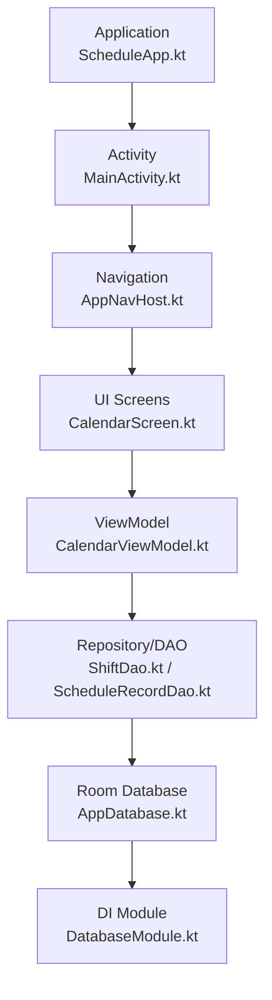
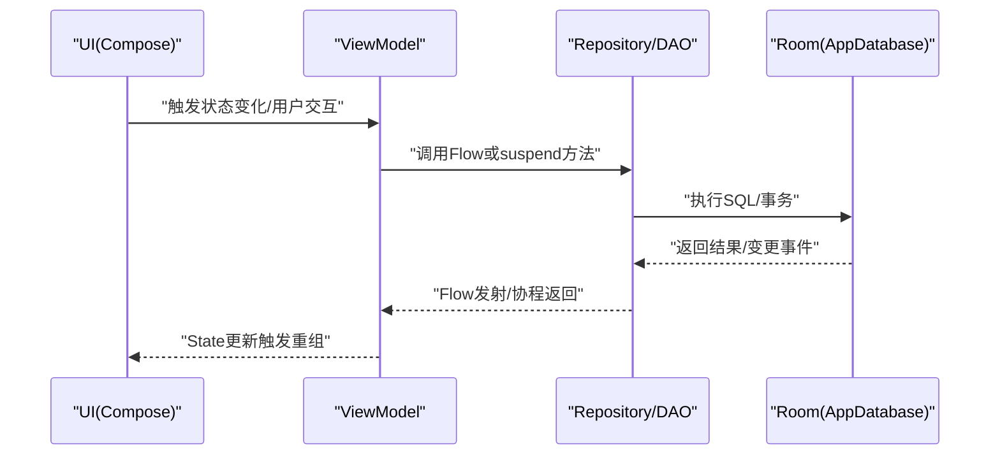
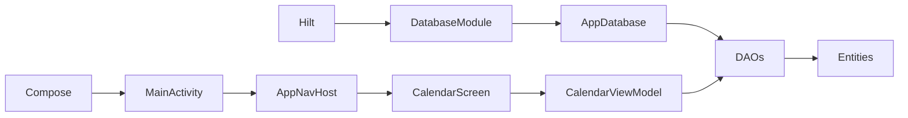

# 性能测试

<cite>
**本文引用的文件**   
- [app/build.gradle.kts](file://app/build.gradle.kts)
- [gradle/libs.versions.toml](file://gradle/libs.versions.toml)
- [app/src/main/java/com/schedulecalendar/app/ScheduleApp.kt](file://app/src/main/java/com/schedulecalendar/app/ScheduleApp.kt)
- [app/src/main/java/com/schedulecalendar/app/MainActivity.kt](file://app/src/main/java/com/schedulecalendar/app/MainActivity.kt)
- [app/src/main/java/com/schedulecalendar/app/ui/navigation/AppNavHost.kt](file://app/src/main/java/com/schedulecalendar/app/ui/navigation/AppNavHost.kt)
- [app/src/main/java/com/schedulecalendar/app/data/db/AppDatabase.kt](file://app/src/main/java/com/schedulecalendar/app/data/db/AppDatabase.kt)
- [app/src/main/java/com/schedulecalendar/app/di/DatabaseModule.kt](file://app/src/main/java/com/schedulecalendar/app/di/DatabaseModule.kt)
- [app/src/main/java/com/schedulecalendar/app/data/db/dao/ShiftDao.kt](file://app/src/main/java/com/schedulecalendar/app/data/db/dao/ShiftDao.kt)
- [app/src/main/java/com/schedulecalendar/app/data/db/dao/ScheduleRecordDao.kt](file://app/src/main/java/com/schedulecalendar/app/data/db/dao/ScheduleRecordDao.kt)
- [app/src/main/java/com/schedulecalendar/app/ui/calendar/CalendarScreen.kt](file://app/src/main/java/com/schedulecalendar/app/ui/calendar/CalendarScreen.kt)
- [app/src/main/java/com/schedulecalendar/app/ui/calendar/CalendarViewModel.kt](file://app/src/main/java/com/schedulecalendar/app/ui/calendar/CalendarViewModel.kt)
- [app/src/main/java/com/schedulecalendar/app/domain/model/CalcUtils.kt](file://app/src/main/java/com/schedulecalendar/app/domain/model/CalcUtils.kt)
</cite>

## 目录
1. [简介](#简介)
2. [项目结构](#项目结构)
3. [核心组件](#核心组件)
4. [架构总览](#架构总览)
5. [详细组件分析](#详细组件分析)
6. [依赖分析](#依赖分析)
7. [性能考虑](#性能考虑)
8. [故障排查指南](#故障排查指南)
9. [结论](#结论)
10. [附录](#附录)

## 简介
本文件面向Android排班日历应用的性能测试与优化，覆盖以下关键领域：
- 内存泄漏检测与优化（含LeakCanary集成方法与内存分析技巧）
- CPU性能分析与热点识别（方法耗时、调用链、CPU采样）
- 数据库性能测试（查询优化、索引建议、批量操作）
- UI渲染性能测试（Compose重组优化、布局与绘制）
- 电池使用优化与系统资源监控
- 压力测试与负载测试方案

说明：当前仓库未包含LeakCanary或任何性能测试库的依赖。文档提供在现有工程上集成的步骤与最佳实践，所有实现细节均基于仓库现有代码进行映射与分析。

## 项目结构
本项目采用模块化分层组织：
- Application层：Hilt初始化入口
- UI层：Compose + Navigation，主界面与导航
- 数据层：Room数据库、DAO、Repository、DataStore偏好
- 工具与领域模型：计算工具、业务模型

图表来源
- [app/src/main/java/com/schedulecalendar/app/ScheduleApp.kt:1-9](file://app/src/main/java/com/schedulecalendar/app/ScheduleApp.kt#L1-L9)
- [app/src/main/java/com/schedulecalendar/app/MainActivity.kt:1-322](file://app/src/main/java/com/schedulecalendar/app/MainActivity.kt#L1-L322)
- [app/src/main/java/com/schedulecalendar/app/ui/navigation/AppNavHost.kt:1-172](file://app/src/main/java/com/schedulecalendar/app/ui/navigation/AppNavHost.kt#L1-L172)
- [app/src/main/java/com/schedulecalendar/app/ui/calendar/CalendarScreen.kt:1-200](file://app/src/main/java/com/schedulecalendar/app/ui/calendar/CalendarScreen.kt#L1-L200)
- [app/src/main/java/com/schedulecalendar/app/ui/calendar/CalendarViewModel.kt:288-305](file://app/src/main/java/com/schedulecalendar/app/ui/calendar/CalendarViewModel.kt#L288-L305)
- [app/src/main/java/com/schedulecalendar/app/data/db/AppDatabase.kt:1-35](file://app/src/main/java/com/schedulecalendar/app/data/db/AppDatabase.kt#L1-L35)
- [app/src/main/java/com/schedulecalendar/app/di/DatabaseModule.kt:1-35](file://app/src/main/java/com/schedulecalendar/app/di/DatabaseModule.kt#L1-L35)
- [app/src/main/java/com/schedulecalendar/app/data/db/dao/ShiftDao.kt:1-42](file://app/src/main/java/com/schedulecalendar/app/data/db/dao/ShiftDao.kt#L1-L42)
- [app/src/main/java/com/schedulecalendar/app/data/db/dao/ScheduleRecordDao.kt:1-40](file://app/src/main/java/com/schedulecalendar/app/data/db/dao/ScheduleRecordDao.kt#L1-L40)

章节来源
- [app/build.gradle.kts:1-141](file://app/build.gradle.kts#L1-L141)
- [gradle/libs.versions.toml:1-86](file://gradle/libs.versions.toml#L1-L86)

## 核心组件
- Application与依赖注入
  - Hilt通过@HiltAndroidApp启用，便于后续注入性能相关工具（如LeakCanary、Tracing等）。
- Activity与导航
  - MainActivity负责权限、返回键处理、快捷方式；AppNavHost管理Tab与子页面，具备防抖与状态同步。
- 数据库与DAO
  - AppDatabase声明实体与版本；DatabaseModule提供单例DB与DAO；DAO定义Flow与协程接口，支持范围查询与批量upsert。
- UI与状态
  - CalendarScreen为复杂日历网格，大量重组与动画；CalendarViewModel负责业务逻辑与待办生成；CalcUtils提供时间计算。

章节来源
- [app/src/main/java/com/schedulecalendar/app/ScheduleApp.kt:1-9](file://app/src/main/java/com/schedulecalendar/app/ScheduleApp.kt#L1-L9)
- [app/src/main/java/com/schedulecalendar/app/MainActivity.kt:1-322](file://app/src/main/java/com/schedulecalendar/app/MainActivity.kt#L1-L322)
- [app/src/main/java/com/schedulecalendar/app/ui/navigation/AppNavHost.kt:1-172](file://app/src/main/java/com/schedulecalendar/app/ui/navigation/AppNavHost.kt#L1-L172)
- [app/src/main/java/com/schedulecalendar/app/data/db/AppDatabase.kt:1-35](file://app/src/main/java/com/schedulecalendar/app/data/db/AppDatabase.kt#L1-L35)
- [app/src/main/java/com/schedulecalendar/app/di/DatabaseModule.kt:1-35](file://app/src/main/java/com/schedulecalendar/app/di/DatabaseModule.kt#L1-L35)
- [app/src/main/java/com/schedulecalendar/app/data/db/dao/ShiftDao.kt:1-42](file://app/src/main/java/com/schedulecalendar/app/data/db/dao/ShiftDao.kt#L1-L42)
- [app/src/main/java/com/schedulecalendar/app/data/db/dao/ScheduleRecordDao.kt:1-40](file://app/src/main/java/com/schedulecalendar/app/data/db/dao/ScheduleRecordDao.kt#L1-L40)
- [app/src/main/java/com/schedulecalendar/app/ui/calendar/CalendarScreen.kt:1-200](file://app/src/main/java/com/schedulecalendar/app/ui/calendar/CalendarScreen.kt#L1-L200)
- [app/src/main/java/com/schedulecalendar/app/ui/calendar/CalendarViewModel.kt:288-305](file://app/src/main/java/com/schedulecalendar/app/ui/calendar/CalendarViewModel.kt#L288-L305)
- [app/src/main/java/com/schedulecalendar/app/domain/model/CalcUtils.kt:38-71](file://app/src/main/java/com/schedulecalendar/app/domain/model/CalcUtils.kt#L38-L71)

## 架构总览
下图展示从UI到数据的调用路径，以及可观测点（用于性能采集）：
- UI层：Compose重组、动画、滚动列表
- ViewModel：业务计算、状态聚合
- DAO/Repository：Flow流式更新、协程异步IO
- Room：SQL执行、事务、迁移

图表来源
- [app/src/main/java/com/schedulecalendar/app/ui/calendar/CalendarScreen.kt:1-200](file://app/src/main/java/com/schedulecalendar/app/ui/calendar/CalendarScreen.kt#L1-L200)
- [app/src/main/java/com/schedulecalendar/app/ui/calendar/CalendarViewModel.kt:288-305](file://app/src/main/java/com/schedulecalendar/app/ui/calendar/CalendarViewModel.kt#L288-L305)
- [app/src/main/java/com/schedulecalendar/app/data/db/dao/ShiftDao.kt:1-42](file://app/src/main/java/com/schedulecalendar/app/data/db/dao/ShiftDao.kt#L1-L42)
- [app/src/main/java/com/schedulecalendar/app/data/db/dao/ScheduleRecordDao.kt:1-40](file://app/src/main/java/com/schedulecalendar/app/data/db/dao/ScheduleRecordDao.kt#L1-L40)
- [app/src/main/java/com/schedulecalendar/app/data/db/AppDatabase.kt:1-35](file://app/src/main/java/com/schedulecalendar/app/data/db/AppDatabase.kt#L1-L35)

## 详细组件分析

### 内存泄漏检测与优化（LeakCanary集成与内存分析）
- 现状
  - 仓库未包含LeakCanary依赖。可通过Gradle在debug构建中引入，避免release包体积增加。
- 集成步骤（建议在debugImplementation中添加）
  - 在依赖配置中加入LeakCanary依赖（参考libs.versions.toml集中管理版本）
  - 在Application类中初始化LeakCanary（当前ScheduleApp为Hilt入口，适合初始化）
  - 运行debug版应用，观察内存泄漏报告
- 内存分析技巧
  - 使用Android Studio Profiler的Memory视图，结合GC与堆转储定位大对象
  - 关注Activity/Fragment持有长生命周期引用（如静态Map、全局回调）
  - 检查ViewModel是否意外持有Context或View引用
  - 对大型集合、Bitmap、数据库Cursor进行及时释放与复用
- 针对本项目的建议
  - MainActivity中的回调与反射注册需确保在onDestroy前清理
  - Compose侧注意remember与LaunchedEffect的生命周期，避免闭包捕获大对象
  - DAO的Flow订阅应在合适的生命周期内取消，避免后台持有引用

章节来源
- [app/build.gradle.kts:81-141](file://app/build.gradle.kts#L81-L141)
- [gradle/libs.versions.toml:1-86](file://gradle/libs.versions.toml#L1-L86)
- [app/src/main/java/com/schedulecalendar/app/ScheduleApp.kt:1-9](file://app/src/main/java/com/schedulecalendar/app/ScheduleApp.kt#L1-L9)
- [app/src/main/java/com/schedulecalendar/app/MainActivity.kt:1-322](file://app/src/main/java/com/schedulecalendar/app/MainActivity.kt#L1-L322)

### CPU性能分析与热点识别
- 分析方法
  - Android Studio Profiler的CPU采样，记录帧率、方法耗时、线程占用
  - 使用Traceview或Systrace抓取系统级调用链，识别阻塞与锁竞争
- 热点定位策略
  - 聚焦UI线程上的长时间任务（如复杂计算、I/O）
  - 检查Compose重组热点：频繁状态变化导致的重复计算
  - 数据库密集查询与事务边界过大导致的主线程卡顿
- 本项目热点建议
  - CalendarScreen的网格渲染与动画可能引发多次重组，应拆分可组合项、减少不必要的状态提升
  - CalcUtils的时间计算在循环中调用时，注意避免重复解析字符串
  - DAO的Flow订阅与协程调度器选择（IO vs Main）

章节来源
- [app/src/main/java/com/schedulecalendar/app/ui/calendar/CalendarScreen.kt:1-200](file://app/src/main/java/com/schedulecalendar/app/ui/calendar/CalendarScreen.kt#L1-L200)
- [app/src/main/java/com/schedulecalendar/app/domain/model/CalcUtils.kt:38-71](file://app/src/main/java/com/schedulecalendar/app/domain/model/CalcUtils.kt#L38-L71)

### 数据库性能测试（查询优化、索引、批量操作）
- 现状与能力
  - Room已启用KSP与schema导出，便于追踪迁移
  - DAO提供Flow与suspend方法，支持范围查询与批量upsert
- 测试要点
  - 查询复杂度：LIKE前缀匹配、ORDER BY、范围过滤的执行计划
  - 索引设计：对高频过滤字段（如date、shiftId）建立索引
  - 批量操作：upsertAll与事务合并，减少磁盘IO次数
  - Flow订阅：避免在主线程执行重查询，使用Dispatchers.IO
- 优化建议
  - 将日期格式统一为可排序字符串，便于范围查询
  - 对archivedAt字段建立索引以加速有效数据筛选
  - 使用Room的事务API包裹批量写入，保证一致性与性能

章节来源
- [app/src/main/java/com/schedulecalendar/app/data/db/AppDatabase.kt:1-35](file://app/src/main/java/com/schedulecalendar/app/data/db/AppDatabase.kt#L1-L35)
- [app/src/main/java/com/schedulecalendar/app/di/DatabaseModule.kt:1-35](file://app/src/main/java/com/schedulecalendar/app/di/DatabaseModule.kt#L1-L35)
- [app/src/main/java/com/schedulecalendar/app/data/db/dao/ShiftDao.kt:1-42](file://app/src/main/java/com/schedulecalendar/app/data/db/dao/ShiftDao.kt#L1-L42)
- [app/src/main/java/com/schedulecalendar/app/data/db/dao/ScheduleRecordDao.kt:1-40](file://app/src/main/java/com/schedulecalendar/app/data/db/dao/ScheduleRecordDao.kt#L1-L40)

### UI渲染性能测试（Compose重组与布局）
- 重组优化
  - 使用remember与derivedStateOf缓存中间结果
  - 拆分可组合项，减少重组范围
  - 避免在重组中执行I/O或重型计算
- 布局与绘制
  - 使用LazyColumn/LazyRow虚拟化列表
  - 减少嵌套层级与过度绘制
  - 动画与过渡效果按需启用
- 本项目建议
  - CalendarScreen的网格渲染应拆分为DayCell独立组件，避免全表重组
  - 状态提升尽量局部化，减少父级状态变化引发的子树重组
  - 使用Modifier的点击与手势处理时，避免创建新对象

章节来源
- [app/src/main/java/com/schedulecalendar/app/ui/calendar/CalendarScreen.kt:1-200](file://app/src/main/java/com/schedulecalendar/app/ui/calendar/CalendarScreen.kt#L1-L200)
- [app/src/main/java/com/schedulecalendar/app/ui/navigation/AppNavHost.kt:1-172](file://app/src/main/java/com/schedulecalendar/app/ui/navigation/AppNavHost.kt#L1-L172)

### 电池使用优化与系统资源监控
- 电池优化
  - 减少前台服务与频繁唤醒，使用WorkManager替代
  - 合理设置协程超时与取消，避免无效计算
  - 降低屏幕刷新频率与动画复杂度
- 资源监控
  - 使用Profiler监控CPU、内存、网络、电量
  - 监控数据库连接数与事务时长
  - 检查广播接收器与后台任务的执行频率

章节来源
- [app/src/main/java/com/schedulecalendar/app/MainActivity.kt:1-322](file://app/src/main/java/com/schedulecalendar/app/MainActivity.kt#L1-L322)

### 压力测试与负载测试方案
- 目标
  - 验证大数据量下的UI流畅度与数据库响应
  - 模拟高并发操作（如批量导入、多用户同时访问）
- 实施
  - 使用JUnit+Espresso编写UI自动化测试，模拟用户操作序列
  - 使用Robolectric进行单元测试，快速验证逻辑
  - 使用JMeter或自定义脚本模拟后端请求（如有）
  - 使用Perfetto或Systrace录制长时间运行场景
- 指标
  - FPS、ANR率、内存峰值、CPU占用、数据库事务耗时

章节来源
- [app/build.gradle.kts:1-141](file://app/build.gradle.kts#L1-L141)

## 依赖分析
当前依赖关系如下：
- Hilt用于依赖注入
- Room用于本地存储
- Compose与Navigation用于UI
- Coroutines用于异步处理

图表来源
- [app/build.gradle.kts:81-141](file://app/build.gradle.kts#L81-L141)
- [gradle/libs.versions.toml:1-86](file://gradle/libs.versions.toml#L1-L86)
- [app/src/main/java/com/schedulecalendar/app/di/DatabaseModule.kt:1-35](file://app/src/main/java/com/schedulecalendar/app/di/DatabaseModule.kt#L1-L35)
- [app/src/main/java/com/schedulecalendar/app/data/db/AppDatabase.kt:1-35](file://app/src/main/java/com/schedulecalendar/app/data/db/AppDatabase.kt#L1-L35)
- [app/src/main/java/com/schedulecalendar/app/ui/calendar/CalendarScreen.kt:1-200](file://app/src/main/java/com/schedulecalendar/app/ui/calendar/CalendarScreen.kt#L1-L200)

## 性能考虑
- 内存
  - 避免在Activity/Fragment中持有长生命周期引用
  - 使用ViewModel保存状态，避免重建开销
  - 及时释放Bitmap、Cursor等大对象
- CPU
  - 将耗时操作移至后台线程
  - 优化算法复杂度，避免O(n^2)循环
  - 合理使用缓存与懒加载
- 数据库
  - 使用索引优化查询
  - 批量操作减少事务开销
  - 避免在主线程执行数据库操作
- UI
  - 减少重组与绘制开销
  - 使用虚拟化列表
  - 优化动画与过渡效果

## 故障排查指南
- 内存泄漏
  - 使用LeakCanary定位泄漏点
  - 检查静态变量与全局引用
  - 验证生命周期管理
- 卡顿与ANR
  - 使用Profiler分析主线程阻塞
  - 检查数据库查询与网络请求
  - 优化UI渲染路径
- 数据库问题
  - 检查SQL语句执行计划
  - 验证索引有效性
  - 监控事务时长与锁竞争

## 结论
本性能测试文档基于现有代码结构与依赖，提供了全面的性能测试与优化指导。通过集成LeakCanary、使用Profiler分析、优化数据库查询与UI渲染，可显著提升应用性能与用户体验。建议在实际开发中持续监控与优化，确保应用在高负载下保持稳定与流畅。

## 附录
- 常用工具
  - Android Studio Profiler
  - LeakCanary
  - Perfetto
  - Systrace
- 最佳实践
  - 分层架构与依赖注入
  - 异步编程与协程
  - 响应式数据流与状态管理
  - 性能监控与持续优化