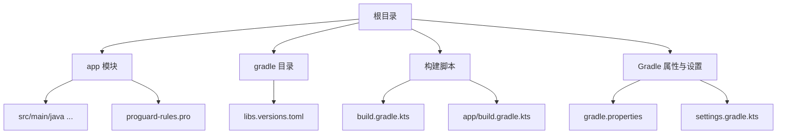
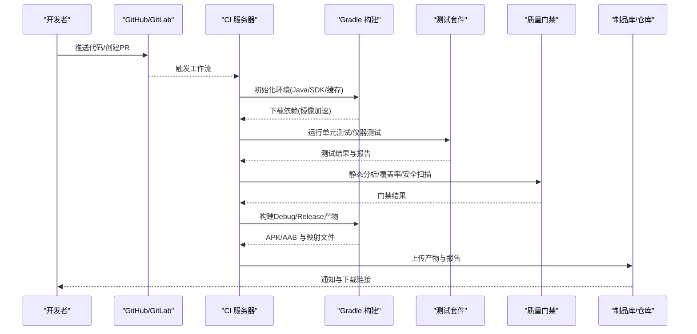
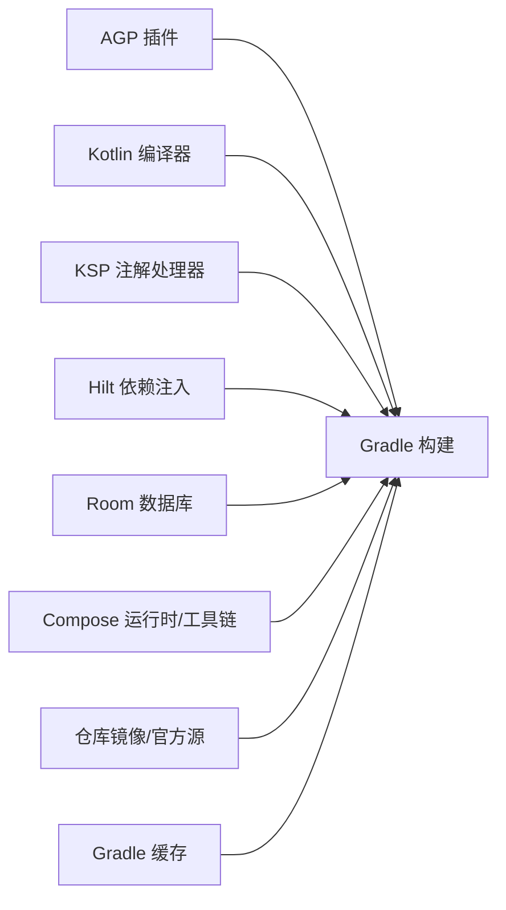

# 持续集成

<cite>
**本文引用的文件**   
- [build.gradle.kts](file://build.gradle.kts)
- [app/build.gradle.kts](file://app/build.gradle.kts)
- [gradle.properties](file://gradle.properties)
- [settings.gradle.kts](file://settings.gradle.kts)
- [gradle/libs.versions.toml](file://gradle/libs.versions.toml)
- [app/proguard-rules.pro](file://app/proguard-rules.pro)
</cite>

## 目录
1. [简介](#简介)
2. [项目结构](#项目结构)
3. [核心组件](#核心组件)
4. [架构总览](#架构总览)
5. [详细组件分析](#详细组件分析)
6. [依赖分析](#依赖分析)
7. [性能考虑](#性能考虑)
8. [故障排查指南](#故障排查指南)
9. [结论](#结论)
10. [附录](#附录)

## 简介
本文件面向Android排班日历应用的持续集成（CI/CD）实践，覆盖GitHub Actions与Jenkins两种主流平台的配置方法。内容包含：
- 自动化构建、测试执行与代码质量检查流水线设计
- 单元测试、集成测试与UI测试的自动化策略
- 静态代码分析、覆盖率与安全扫描门禁
- Debug/Release构建、签名管理与发布渠道配置
- 构建优化与缓存策略
- 常见故障排查与日志分析方法

本项目基于Kotlin + Compose，使用AGP 8.x、KSP、Hilt、Room等现代Android技术栈，Gradle版本与插件通过版本目录集中管理，便于在CI中稳定复现构建环境。

## 项目结构
仓库采用单模块应用结构，关键构建与依赖定义集中在以下文件：
- 顶层构建脚本：声明插件别名与全局约束
- 应用模块构建脚本：编译选项、构建类型、签名、Lint、依赖
- Gradle属性：JVM参数、配置缓存、并行构建、AndroidX开关、Java路径
- 设置脚本：仓库镜像源、工具链解析、模块包含
- 版本目录：统一版本与依赖声明
- ProGuard规则：混淆与裁剪策略

**图表来源**
- [build.gradle.kts:1-10](file://build.gradle.kts#L1-L10)
- [app/build.gradle.kts:10-79](file://app/build.gradle.kts#L10-L79)
- [gradle.properties:1-8](file://gradle.properties#L1-L8)
- [settings.gradle.kts:1-37](file://settings.gradle.kts#L1-L37)
- [gradle/libs.versions.toml:1-86](file://gradle/libs.versions.toml#L1-L86)

**章节来源**
- [build.gradle.kts:1-10](file://build.gradle.kts#L1-L10)
- [app/build.gradle.kts:10-79](file://app/build.gradle.kts#L10-L79)
- [gradle.properties:1-8](file://gradle.properties#L1-L8)
- [settings.gradle.kts:1-37](file://settings.gradle.kts#L1-L37)
- [gradle/libs.versions.toml:1-86](file://gradle/libs.versions.toml#L1-L86)

## 核心组件
- 构建系统：AGP + Kotlin + KSP + Hilt + Room + Compose
- 依赖管理：版本目录集中化，仓库镜像加速
- 构建类型：Debug可调试；Release启用混淆、资源压缩与签名
- Lint：关闭部分非关键告警，避免IDE干扰CI稳定性
- 打包：JNI库使用兼容模式，排除冗余META-INF条目

这些能力为CI流水线提供稳定的构建基础，确保本地与云端一致。

**章节来源**
- [app/build.gradle.kts:10-79](file://app/build.gradle.kts#L10-L79)
- [app/build.gradle.kts:81-141](file://app/build.gradle.kts#L81-L141)
- [gradle/libs.versions.toml:1-86](file://gradle/libs.versions.toml#L1-L86)
- [settings.gradle.kts:1-37](file://settings.gradle.kts#L1-L37)

## 架构总览
下图展示CI流水线从代码提交到产物产出的端到端流程，涵盖构建、测试、质量门禁与产物归档。

[无图表来源：该图为概念性流程示意]

## 详细组件分析

### 构建与签名配置
- 编译目标：Java/Kotlin 17
- 构建类型：
  - Debug：可调试
  - Release：开启混淆与资源压缩，应用签名配置
- 签名：当前使用明文密钥路径与密码，建议在CI中以环境变量或密钥管理服务注入
- Lint：禁用若干告警以避免IDE与CI冲突

建议：
- 将签名信息迁移至CI密钥存储（如GitHub Secrets、Jenkins Credentials）
- 使用独立keystore文件并通过环境变量引用

**章节来源**
- [app/build.gradle.kts:31-41](file://app/build.gradle.kts#L31-L41)
- [app/build.gradle.kts:22-29](file://app/build.gradle.kts#L22-L29)
- [app/build.gradle.kts:69-78](file://app/build.gradle.kts#L69-L78)

### 依赖与版本管理
- 版本目录统一管理AGP、Kotlin、Compose、Hilt、Room等版本
- 仓库镜像优先阿里云与华为云，兜底官方源，提升CI拉取速度
- 第三方库通过JitPack引入

建议：
- 固定AGP与Kotlin版本，避免CI漂移
- 定期更新依赖并验证兼容性

**章节来源**
- [gradle/libs.versions.toml:1-86](file://gradle/libs.versions.toml#L1-L86)
- [settings.gradle.kts:1-37](file://settings.gradle.kts#L1-L37)

### 混淆与裁剪
- ProGuard规则保留Hilt、Room、Gson、Glance、Navigation路由等必要类与方法
- 针对MainActivity状态字段与回调进行保护，防止R8内联导致行为异常

建议：
- 在CI中生成并归档mapping.txt以便崩溃定位
- 结合Play Console或自建后端收集混淆堆栈

**章节来源**
- [app/proguard-rules.pro:1-78](file://app/proguard-rules.pro#L1-L78)

### Gradle性能与缓存
- JVM内存与GC调优
- 启用配置缓存与构建缓存
- AndroidX启用，Jetifier关闭
- 指定Java Home指向Android Studio内置JBR

建议：
- 在CI中缓存Gradle用户目录与构建缓存
- 合理设置并行度与线程数

**章节来源**
- [gradle.properties:1-8](file://gradle.properties#L1-L8)

### 顶层插件与模块包含
- 顶层仅声明插件别名，不应用到root
- settings中配置插件与依赖仓库，包含app模块

建议：
- 保持顶层最小化，避免污染子模块构建上下文

**章节来源**
- [build.gradle.kts:1-10](file://build.gradle.kts#L1-L10)
- [settings.gradle.kts:1-37](file://settings.gradle.kts#L1-L37)

## 依赖分析
下图展示构建阶段的关键依赖关系与外部服务交互。

**图表来源**
- [gradle/libs.versions.toml:1-86](file://gradle/libs.versions.toml#L1-L86)
- [settings.gradle.kts:1-37](file://settings.gradle.kts#L1-L37)

**章节来源**
- [gradle/libs.versions.toml:1-86](file://gradle/libs.versions.toml#L1-L86)
- [settings.gradle.kts:1-37](file://settings.gradle.kts#L1-L37)

## 性能考虑
- 启用Gradle配置缓存与构建缓存，减少重复任务耗时
- 使用多仓库镜像加速依赖下载
- 合理分配JVM内存与并行度，避免CI节点OOM
- 按需运行测试与质量任务，避免全量执行
- 对大型依赖（Compose BOM、Room/Hilt）利用缓存命中

[本节为通用指导，无需特定文件来源]

## 故障排查指南
- 构建失败
  - 检查Java版本与路径是否与gradle.properties一致
  - 确认仓库镜像可达，必要时切换备用源
  - 查看Gradle输出中的依赖解析错误与版本冲突
- 测试失败
  - 区分单元测试与仪器测试，分别定位问题
  - 检查模拟器/真机环境、权限与网络依赖
- 签名问题
  - 校验keystore路径、密码与别名是否匹配
  - 在CI中使用受保护的凭据而非明文
- 混淆后崩溃
  - 使用mapping.txt还原堆栈
  - 核对ProGuard规则是否遗漏必要类或成员

**章节来源**
- [gradle.properties:1-8](file://gradle.properties#L1-L8)
- [app/build.gradle.kts:22-41](file://app/build.gradle.kts#L22-L41)
- [app/proguard-rules.pro:1-78](file://app/proguard-rules.pro#L1-L78)

## 结论
通过统一的版本管理、镜像加速与缓存策略，配合严格的构建类型与签名管理，可为排班日历应用提供稳定高效的CI/CD流水线。建议在CI中补齐测试与质量门禁，实现从代码提交到产物发布的闭环自动化。

[本节为总结性内容，无需特定文件来源]

## 附录

### GitHub Actions 流水线示例（要点）
- 触发条件：push到主分支与PR事件
- 环境准备：安装Java 17、Android SDK、命令行工具
- 缓存：Gradle用户目录与构建缓存
- 任务：
  - 构建Debug与Release
  - 运行单元测试与仪器测试（可选）
  - 静态分析（lint/ktlint）、覆盖率（JaCoCo）、安全扫描（Dependabot/SonarQube）
  - 上传APK/AAB与测试报告
- 签名：从Secrets读取keystore与密码，动态传入构建命令

[本节为概念性说明，无需特定文件来源]

### Jenkins 流水线示例（要点）
- 节点要求：预装Java 17、Android SDK、命令行工具
- 凭据：使用Credentials管理keystore与密码
- 缓存：共享Gradle缓存目录
- 任务：
  - 构建Debug/Release
  - 执行测试与质量门禁
  - 归档产物与报告
  - 可选：自动发布到内部仓库或分发平台

[本节为概念性说明，无需特定文件来源]

### 测试自动化策略
- 单元测试：聚焦业务逻辑与数据层，快速反馈
- 集成测试：验证Repository与数据库交互
- UI测试：关键用户路径冒烟测试，控制用例数量与稳定性
- 覆盖率阈值：建议最低行覆盖率与分支覆盖率门槛，未达标阻断合并

[本节为概念性说明，无需特定文件来源]

### 代码质量门禁
- 静态分析：lint、ktlint、detekt
- 覆盖率：JaCoCo聚合报告，设定阈值
- 安全扫描：依赖漏洞扫描、敏感信息检测
- 门禁策略：失败即阻断合并或发布

[本节为概念性说明，无需特定文件来源]

### 构建优化与缓存配置
- Gradle配置缓存与构建缓存
- 仓库镜像优先，降低拉取延迟
- 合理JVM参数与并行度
- 按需执行任务，避免全量构建

**章节来源**
- [gradle.properties:1-8](file://gradle.properties#L1-L8)
- [settings.gradle.kts:1-37](file://settings.gradle.kts#L1-L37)

### 发布渠道配置
- Debug包：直接分发给测试人员
- Release包：签名后上传至应用商店或企业分发平台
- 元数据：版本号、变更日志、构建产物哈希

[本节为概念性说明，无需特定文件来源]