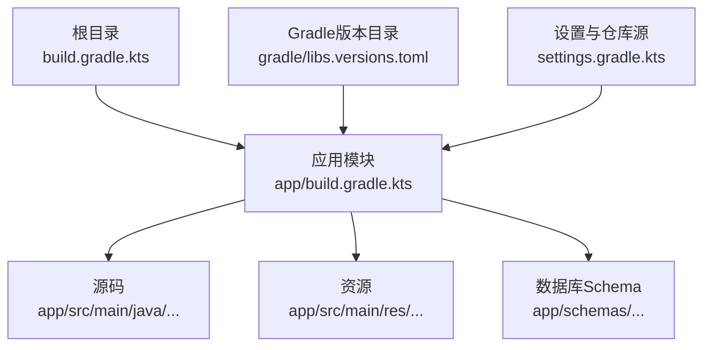
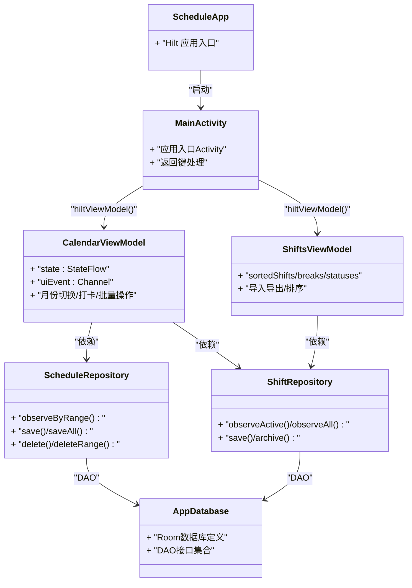
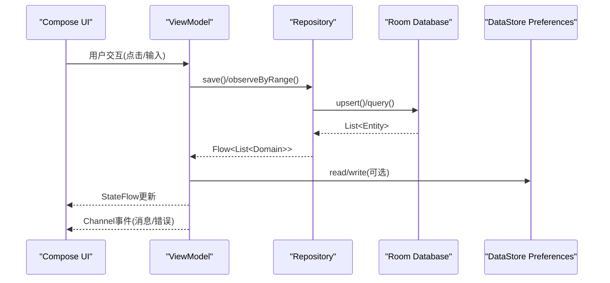
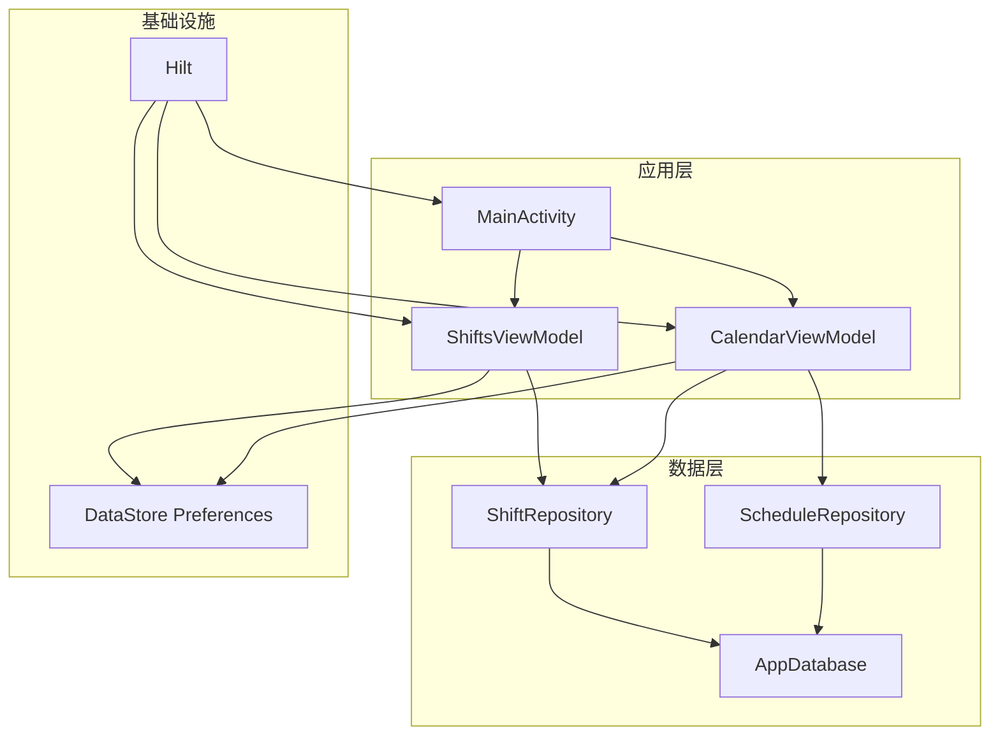

# 测试策略

<cite>
**本文引用的文件**   
- [app/build.gradle.kts](file://app/build.gradle.kts)
- [build.gradle.kts](file://build.gradle.kts)
- [gradle/libs.versions.toml](file://gradle/libs.versions.toml)
- [settings.gradle.kts](file://settings.gradle.kts)
- [gradle.properties](file://gradle.properties)
- [gradle/wrapper/gradle-wrapper.properties](file://gradle/wrapper/gradle-wrapper.properties)
- [app/src/main/java/com/schedulecalendar/app/ScheduleApp.kt](file://app/src/main/java/com/schedulecalendar/app/ScheduleApp.kt)
- [app/src/main/java/com/schedulecalendar/app/MainActivity.kt](file://app/src/main/java/com/schedulecalendar/app/MainActivity.kt)
- [app/src/main/java/com/schedulecalendar/app/data/db/AppDatabase.kt](file://app/src/main/java/com/schedulecalendar/app/data/db/AppDatabase.kt)
- [app/src/main/java/com/schedulecalendar/app/data/repository/ScheduleRepository.kt](file://app/src/main/java/com/schedulecalendar/app/data/repository/ScheduleRepository.kt)
- [app/src/main/java/com/schedulecalendar/app/data/repository/ShiftRepository.kt](file://app/src/main/java/com/schedulecalendar/app/data/repository/ShiftRepository.kt)
- [app/src/main/java/com/schedulecalendar/app/ui/calendar/CalendarViewModel.kt](file://app/src/main/java/com/schedulecalendar/app/ui/calendar/CalendarViewModel.kt)
- [app/src/main/java/com/schedulecalendar/app/ui/shifts/ShiftsViewModel.kt](file://app/src/main/java/com/schedulecalendar/app/ui/shifts/ShiftsViewModel.kt)
</cite>

## 目录
1. [引言](#引言)
2. [项目结构](#项目结构)
3. [核心组件](#核心组件)
4. [架构总览](#架构总览)
5. [详细组件分析](#详细组件分析)
6. [依赖分析](#依赖分析)
7. [性能考虑](#性能考虑)
8. [故障排查指南](#故障排查指南)
9. [结论](#结论)
10. [附录](#附录)

## 引言
本测试策略面向“排班日历”Android应用，覆盖单元测试、集成测试、UI测试、数据与模拟策略、持续集成与自动化、覆盖率与质量门禁、以及性能与压力测试。目标是为团队提供可执行的测试规范，确保在现有架构（Hilt + Room + DataStore + Compose + Coroutines）下实现高质量、可维护的测试体系。

## 项目结构
当前仓库采用单模块 Android Application 工程，核心代码位于 app 模块；构建配置集中在 gradle 版本目录与模块 build.gradle.kts；数据库 schema 导出至 app/schemas 便于迁移追踪。

**图示来源** 
- [build.gradle.kts:1-10](file://build.gradle.kts#L1-L10)
- [app/build.gradle.kts:1-80](file://app/build.gradle.kts#L1-L80)
- [gradle/libs.versions.toml:1-86](file://gradle/libs.versions.toml#L1-L86)
- [settings.gradle.kts:1-36](file://settings.gradle.kts#L1-L36)

**章节来源**
- [app/build.gradle.kts:1-80](file://app/build.gradle.kts#L1-L80)
- [gradle/libs.versions.toml:1-86](file://gradle/libs.versions.toml#L1-L86)
- [settings.gradle.kts:1-36](file://settings.gradle.kts#L1-L36)

## 核心组件
- Hilt 应用入口：ScheduleApp 使用 @HiltAndroidApp 初始化依赖注入。
- Activity 与导航：MainActivity 作为入口，承载 Compose UI 与返回键逻辑。
- 数据层：Room 数据库 AppDatabase 暴露多个 DAO；Repository 封装数据访问并对外暴露 Flow。
- 业务层：ViewModel（CalendarViewModel、ShiftsViewModel）组合 Repository、Preferences、BackupManager 等，管理状态与协程流程。
- UI层：Compose Screen 通过 hiltViewModel() 获取 ViewModel，使用 collectAsStateWithLifecycle 订阅 StateFlow。

**图示来源** 
- [app/src/main/java/com/schedulecalendar/app/ScheduleApp.kt:1-8](file://app/src/main/java/com/schedulecalendar/app/ScheduleApp.kt#L1-L8)
- [app/src/main/java/com/schedulecalendar/app/MainActivity.kt:1-67](file://app/src/main/java/com/schedulecalendar/app/MainActivity.kt#L1-L67)
- [app/src/main/java/com/schedulecalendar/app/data/db/AppDatabase.kt:1-35](file://app/src/main/java/com/schedulecalendar/app/data/db/AppDatabase.kt#L1-L35)
- [app/src/main/java/com/schedulecalendar/app/data/repository/ScheduleRepository.kt:1-40](file://app/src/main/java/com/schedulecalendar/app/data/repository/ScheduleRepository.kt#L1-L40)
- [app/src/main/java/com/schedulecalendar/app/data/repository/ShiftRepository.kt:1-45](file://app/src/main/java/com/schedulecalendar/app/data/repository/ShiftRepository.kt#L1-L45)
- [app/src/main/java/com/schedulecalendar/app/ui/calendar/CalendarViewModel.kt:1-120](file://app/src/main/java/com/schedulecalendar/app/ui/calendar/CalendarViewModel.kt#L1-L120)
- [app/src/main/java/com/schedulecalendar/app/ui/shifts/ShiftsViewModel.kt:1-60](file://app/src/main/java/com/schedulecalendar/app/ui/shifts/ShiftsViewModel.kt#L1-L60)

**章节来源**
- [app/src/main/java/com/schedulecalendar/app/ScheduleApp.kt:1-8](file://app/src/main/java/com/schedulecalendar/app/ScheduleApp.kt#L1-L8)
- [app/src/main/java/com/schedulecalendar/app/MainActivity.kt:1-67](file://app/src/main/java/com/schedulecalendar/app/MainActivity.kt#L1-L67)
- [app/src/main/java/com/schedulecalendar/app/data/db/AppDatabase.kt:1-35](file://app/src/main/java/com/schedulecalendar/app/data/db/AppDatabase.kt#L1-L35)
- [app/src/main/java/com/schedulecalendar/app/data/repository/ScheduleRepository.kt:1-40](file://app/src/main/java/com/schedulecalendar/app/data/repository/ScheduleRepository.kt#L1-L40)
- [app/src/main/java/com/schedulecalendar/app/data/repository/ShiftRepository.kt:1-45](file://app/src/main/java/com/schedulecalendar/app/data/repository/ShiftRepository.kt#L1-L45)
- [app/src/main/java/com/schedulecalendar/app/ui/calendar/CalendarViewModel.kt:1-120](file://app/src/main/java/com/schedulecalendar/app/ui/calendar/CalendarViewModel.kt#L1-L120)
- [app/src/main/java/com/schedulecalendar/app/ui/shifts/ShiftsViewModel.kt:1-60](file://app/src/main/java/com/schedulecalendar/app/ui/shifts/ShiftsViewModel.kt#L1-L60)

## 架构总览
应用采用 MVVM + Hilt 依赖注入 + Room 持久化 + DataStore 偏好存储 + Compose UI 的现代架构。ViewModel 通过 Repository 访问数据，UI 层以 StateFlow 驱动重组，事件通过 Channel 或 StateFlow 传递。

**图示来源** 
- [app/src/main/java/com/schedulecalendar/app/ui/calendar/CalendarViewModel.kt:120-250](file://app/src/main/java/com/schedulecalendar/app/ui/calendar/CalendarViewModel.kt#L120-L250)
- [app/src/main/java/com/schedulecalendar/app/data/repository/ScheduleRepository.kt:20-40](file://app/src/main/java/com/schedulecalendar/app/data/repository/ScheduleRepository.kt#L20-L40)
- [app/src/main/java/com/schedulecalendar/app/data/db/AppDatabase.kt:17-35](file://app/src/main/java/com/schedulecalendar/app/data/db/AppDatabase.kt#L17-L35)

## 详细组件分析

### 单元测试策略（JUnit + MockK + Turbine）
- 框架选择
  - JUnit 5：编写用例组织与断言。
  - MockK：对 Repository、Preferences、BackupManager 等进行轻量级 mock。
  - Turbine：验证 Flow/StateFlow 序列，确保异步流按预期发射。
- 适用场景
  - ViewModel 行为：状态变更、事件发送、协程调度。
  - 纯函数工具类：CalcUtils、日期/时间计算等。
  - Repository 的映射与转换逻辑（可结合内存 DAO 或 In-Memory Room）。
- 实践要点
  - 使用 runTest 控制协程调度器，避免真实 IO。
  - 用 Turbine.test 收集 Flow，断言发射顺序与最终值。
  - 对 Hilt 依赖进行隔离：在单元测试中直接构造 ViewModel 并传入 Mock 对象。
- 示例路径参考
  - ViewModel 测试：[CalendarViewModel.kt:118-152](file://app/src/main/java/com/schedulecalendar/app/ui/calendar/CalendarViewModel.kt#L118-L152)、[ShiftsViewModel.kt:47-76](file://app/src/main/java/com/schedulecalendar/app/ui/shifts/ShiftsViewModel.kt#L47-L76)
  - Repository 测试：[ScheduleRepository.kt:13-39](file://app/src/main/java/com/schedulecalendar/app/data/repository/ScheduleRepository.kt#L13-L39)、[ShiftRepository.kt:12-44](file://app/src/main/java/com/schedulecalendar/app/data/repository/ShiftRepository.kt#L12-L44)

**章节来源**
- [app/src/main/java/com/schedulecalendar/app/ui/calendar/CalendarViewModel.kt:118-152](file://app/src/main/java/com/schedulecalendar/app/ui/calendar/CalendarViewModel.kt#L118-L152)
- [app/src/main/java/com/schedulecalendar/app/ui/shifts/ShiftsViewModel.kt:47-76](file://app/src/main/java/com/schedulecalendar/app/ui/shifts/ShiftsViewModel.kt#L47-L76)
- [app/src/main/java/com/schedulecalendar/app/data/repository/ScheduleRepository.kt:13-39](file://app/src/main/java/com/schedulecalendar/app/data/repository/ScheduleRepository.kt#L13-L39)
- [app/src/main/java/com/schedulecalendar/app/data/repository/ShiftRepository.kt:12-44](file://app/src/main/java/com/schedulecalendar/app/data/repository/ShiftRepository.kt#L12-L44)

### 集成测试策略（数据库 + Repository + ViewModel）
- 数据库测试
  - 使用 Room In-Memory Database 或导出 Schema 校验迁移正确性。
  - 针对 DAO 的 observeByRange、upsert、delete 等操作进行端到端验证。
- Repository 测试
  - 结合内存数据库验证 Flow 的响应式更新（如 refreshSignal、observeByRange）。
  - 验证 Domain 与 Entity 的映射一致性。
- ViewModel 集成测试
  - 使用真实或半真实 Repository（In-Memory），验证 state 变化与 uiEvent 事件。
  - 使用 Turbine 断言 Flow 序列，确保协程生命周期安全。
- 关键路径参考
  - Room 定义：[AppDatabase.kt:17-35](file://app/src/main/java/com/schedulecalendar/app/data/db/AppDatabase.kt#L17-L35)
  - Repository 接口与 Flow：[ScheduleRepository.kt:22-39](file://app/src/main/java/com/schedulecalendar/app/data/repository/ScheduleRepository.kt#L22-L39)、[ShiftRepository.kt:17-32](file://app/src/main/java/com/schedulecalendar/app/data/repository/ShiftRepository.kt#L17-L32)
  - ViewModel 状态与事件：[CalendarViewModel.kt:131-151](file://app/src/main/java/com/schedulecalendar/app/ui/calendar/CalendarViewModel.kt#L131-L151)、[ShiftsViewModel.kt:57-86](file://app/src/main/java/com/schedulecalendar/app/ui/shifts/ShiftsViewModel.kt#L57-L86)

**章节来源**
- [app/src/main/java/com/schedulecalendar/app/data/db/AppDatabase.kt:17-35](file://app/src/main/java/com/schedulecalendar/app/data/db/AppDatabase.kt#L17-L35)
- [app/src/main/java/com/schedulecalendar/app/data/repository/ScheduleRepository.kt:22-39](file://app/src/main/java/com/schedulecalendar/app/data/repository/ScheduleRepository.kt#L22-L39)
- [app/src/main/java/com/schedulecalendar/app/data/repository/ShiftRepository.kt:17-32](file://app/src/main/java/com/schedulecalendar/app/data/repository/ShiftRepository.kt#L17-L32)
- [app/src/main/java/com/schedulecalendar/app/ui/calendar/CalendarViewModel.kt:131-151](file://app/src/main/java/com/schedulecalendar/app/ui/calendar/CalendarViewModel.kt#L131-L151)
- [app/src/main/java/com/schedulecalendar/app/ui/shifts/ShiftsViewModel.kt:57-86](file://app/src/main/java/com/schedulecalendar/app/ui/shifts/ShiftsViewModel.kt#L57-L86)

### UI 测试策略（Compose UI + Espresso）
- Compose UI 测试
  - 使用 createComposeRule 或 createAndroidComposeRule 启动 Compose 环境。
  - 通过 hiltViewModel() 注入测试用 ViewModel（可替换为 Fake/Mock）。
  - 使用 Semantics 匹配文本、按钮、列表项，断言界面状态与交互结果。
- Espresso 测试
  - 针对传统 View 或混合场景，使用 onView、onData 进行交互与断言。
  - 与 Compose 混用时，注意生命周期与线程调度。
- 关键路径参考
  - Activity 入口与导航：[MainActivity.kt:33-67](file://app/src/main/java/com/schedulecalendar/app/MainActivity.kt#L33-L67)
  - Compose 屏幕与 ViewModel 绑定：[CalendarScreen.kt:229-250](file://app/src/main/java/com/schedulecalendar/app/ui/calendar/CalendarScreen.kt#L229-L250)、[ShiftsScreen.kt:54-56](file://app/src/main/java/com/schedulecalendar/app/ui/shifts/ShiftsScreen.kt#L54-L56)

**章节来源**
- [app/src/main/java/com/schedulecalendar/app/MainActivity.kt:33-67](file://app/src/main/java/com/schedulecalendar/app/MainActivity.kt#L33-L67)
- [app/src/main/java/com/schedulecalendar/app/ui/calendar/CalendarScreen.kt:229-250](file://app/src/main/java/com/schedulecalendar/app/ui/calendar/CalendarScreen.kt#L229-L250)
- [app/src/main/java/com/schedulecalendar/app/ui/shifts/ShiftsScreen.kt:54-56](file://app/src/main/java/com/schedulecalendar/app/ui/shifts/ShiftsScreen.kt#L54-L56)

### 测试数据管理与模拟策略
- 数据生成
  - 使用工厂方法或数据生成库创建稳定的测试数据（Shift、ScheduleRecord、ExtraItem 等）。
  - 对日期范围、班次类型、附加状态等边界条件进行覆盖。
- 模拟策略
  - Repository：MockK 模拟 Flow 发射与异常场景。
  - Preferences：MockK 模拟读取/写入，保证测试隔离。
  - BackupManager：MockK 跳过实际备份，聚焦业务逻辑。
- 数据库测试数据
  - 使用 In-Memory Room 预置数据，验证查询与更新。
  - 利用 app/schemas 校验迁移脚本的正确性。

**章节来源**
- [app/src/main/java/com/schedulecalendar/app/data/repository/ScheduleRepository.kt:22-39](file://app/src/main/java/com/schedulecalendar/app/data/repository/ScheduleRepository.kt#L22-L39)
- [app/src/main/java/com/schedulecalendar/app/data/repository/ShiftRepository.kt:17-32](file://app/src/main/java/com/schedulecalendar/app/data/repository/ShiftRepository.kt#L17-L32)
- [app/src/main/java/com/schedulecalendar/app/data/db/AppDatabase.kt:17-35](file://app/src/main/java/com/schedulecalendar/app/data/db/AppDatabase.kt#L17-L35)

### 持续集成与自动化测试流程配置
- Gradle 任务
  - 单元测试：./gradlew test
  - 设备端测试：./gradlew connectedAndroidTest
  - 构建缓存与配置缓存：已在 gradle.properties 启用。
- 仓库镜像
  - settings.gradle.kts 配置阿里云/华为云镜像，加速依赖下载。
- 建议 CI 步骤
  - 拉取代码 → 解析依赖 → 运行单元测试 → 运行设备测试 → 生成覆盖率报告 → 上传报告 → 质量门禁检查。

**章节来源**
- [gradle.properties:1-7](file://gradle.properties#L1-L7)
- [settings.gradle.kts:1-36](file://settings.gradle.kts#L1-L36)
- [gradle/wrapper/gradle-wrapper.properties:1-6](file://gradle/wrapper/gradle-wrapper.properties#L1-L6)

### 测试覆盖率分析与质量门禁设置
- 覆盖率工具
  - JaCoCo：生成单元测试覆盖率报告。
  - 设备测试覆盖率：可使用 AndroidX Test 的覆盖率支持或第三方方案。
- 质量门禁
  - 设置最低覆盖率阈值（如行覆盖率≥80%，分支覆盖率≥70%）。
  - 在 CI 中失败阻断合并请求。
- 报告输出
  - 将 HTML/XML 报告归档，便于回溯与分析。

[本节为通用指导，不直接分析具体文件]

### 性能测试与压力测试实施方法
- 性能测试
  - 使用 Android Studio Profiler 监控 CPU、内存、网络、电池。
  - 针对大数据量（月历网格、大量日程记录）进行渲染与滚动性能测试。
- 压力测试
  - 并发写操作：批量保存 ScheduleRecord，观察数据库锁与 Flow 更新。
  - 长时间运行：模拟用户连续切换月份、批量操作，检测内存泄漏与状态一致性。
- 指标与基线
  - FPS、首帧时间、内存峰值、GC 次数、数据库读写耗时。

[本节为通用指导，不直接分析具体文件]

## 依赖分析
项目依赖关系清晰，Hilt 负责依赖注入，Room 与 DataStore 分别承担持久化与偏好存储，ViewModel 组合 Repository 与外部服务。

**图示来源** 
- [app/src/main/java/com/schedulecalendar/app/MainActivity.kt:33-67](file://app/src/main/java/com/schedulecalendar/app/MainActivity.kt#L33-L67)
- [app/src/main/java/com/schedulecalendar/app/ui/calendar/CalendarViewModel.kt:118-151](file://app/src/main/java/com/schedulecalendar/app/ui/calendar/CalendarViewModel.kt#L118-L151)
- [app/src/main/java/com/schedulecalendar/app/ui/shifts/ShiftsViewModel.kt:47-86](file://app/src/main/java/com/schedulecalendar/app/ui/shifts/ShiftsViewModel.kt#L47-L86)
- [app/src/main/java/com/schedulecalendar/app/data/repository/ScheduleRepository.kt:13-39](file://app/src/main/java/com/schedulecalendar/app/data/repository/ScheduleRepository.kt#L13-L39)
- [app/src/main/java/com/schedulecalendar/app/data/repository/ShiftRepository.kt:12-44](file://app/src/main/java/com/schedulecalendar/app/data/repository/ShiftRepository.kt#L12-L44)
- [app/src/main/java/com/schedulecalendar/app/data/db/AppDatabase.kt:17-35](file://app/src/main/java/com/schedulecalendar/app/data/db/AppDatabase.kt#L17-L35)

**章节来源**
- [app/src/main/java/com/schedulecalendar/app/MainActivity.kt:33-67](file://app/src/main/java/com/schedulecalendar/app/MainActivity.kt#L33-L67)
- [app/src/main/java/com/schedulecalendar/app/ui/calendar/CalendarViewModel.kt:118-151](file://app/src/main/java/com/schedulecalendar/app/ui/calendar/CalendarViewModel.kt#L118-L151)
- [app/src/main/java/com/schedulecalendar/app/ui/shifts/ShiftsViewModel.kt:47-86](file://app/src/main/java/com/schedulecalendar/app/ui/shifts/ShiftsViewModel.kt#L47-L86)
- [app/src/main/java/com/schedulecalendar/app/data/repository/ScheduleRepository.kt:13-39](file://app/src/main/java/com/schedulecalendar/app/data/repository/ScheduleRepository.kt#L13-L39)
- [app/src/main/java/com/schedulecalendar/app/data/repository/ShiftRepository.kt:12-44](file://app/src/main/java/com/schedulecalendar/app/data/repository/ShiftRepository.kt#L12-L44)
- [app/src/main/java/com/schedulecalendar/app/data/db/AppDatabase.kt:17-35](file://app/src/main/java/com/schedulecalendar/app/data/db/AppDatabase.kt#L17-L35)

## 性能考虑
- 首帧优化：延迟非关键初始化（如自动备份、日历ID初始化），避免阻塞主线程。
- 数据加载：使用 combine 聚合多 Flow，减少重复查询；分页与范围查询优化 UI 渲染。
- 协程管理：及时取消旧 Job，防止 collector 累积泄漏；使用 viewModelScope 管理生命周期。
- 内存占用：避免在 StateFlow 中持有大对象；按需加载历史数据。

**章节来源**
- [app/src/main/java/com/schedulecalendar/app/ui/calendar/CalendarViewModel.kt:140-151](file://app/src/main/java/com/schedulecalendar/app/ui/calendar/CalendarViewModel.kt#L140-L151)
- [app/src/main/java/com/schedulecalendar/app/ui/calendar/CalendarViewModel.kt:153-246](file://app/src/main/java/com/schedulecalendar/app/ui/calendar/CalendarViewModel.kt#L153-L246)

## 故障排查指南
- 常见问题
  - Flow 未更新：检查 Repository 是否发出刷新信号；确认 DAO 查询范围正确。
  - 协程泄漏：确保 collectJob 在切月时取消；避免在 ViewModel 外持有引用。
  - Hilt 注入失败：确认 @AndroidEntryPoint 与 @HiltViewModel 注解；检查 Module 配置。
- 调试技巧
  - 使用 Log 打印关键状态变化；在 CI 中保留日志与崩溃堆栈。
  - 使用 Profiler 定位卡顿与内存问题。

**章节来源**
- [app/src/main/java/com/schedulecalendar/app/ui/calendar/CalendarViewModel.kt:153-246](file://app/src/main/java/com/schedulecalendar/app/ui/calendar/CalendarViewModel.kt#L153-L246)
- [app/src/main/java/com/schedulecalendar/app/MainActivity.kt:54-67](file://app/src/main/java/com/schedulecalendar/app/MainActivity.kt#L54-L67)

## 结论
本测试策略围绕现有架构设计，明确了单元测试、集成测试、UI测试的实施方法与工具链，提供了数据与模拟策略、CI 自动化、覆盖率与质量门禁、以及性能与压力测试的指导。建议在迭代中逐步完善测试用例，确保代码质量与稳定性。

[本节为总结性内容，不直接分析具体文件]

## 附录
- 构建与依赖版本
  - AGP、Kotlin、Compose BOM、Room、DataStore、Coroutines 等版本集中于 libs.versions.toml。
- 仓库源与镜像
  - settings.gradle.kts 配置多源镜像，提升依赖解析速度。
- 构建缓存
  - gradle.properties 启用配置缓存与构建缓存，加速 CI 执行。

**章节来源**
- [gradle/libs.versions.toml:1-86](file://gradle/libs.versions.toml#L1-L86)
- [settings.gradle.kts:1-36](file://settings.gradle.kts#L1-L36)
- [gradle.properties:1-7](file://gradle.properties#L1-L7)