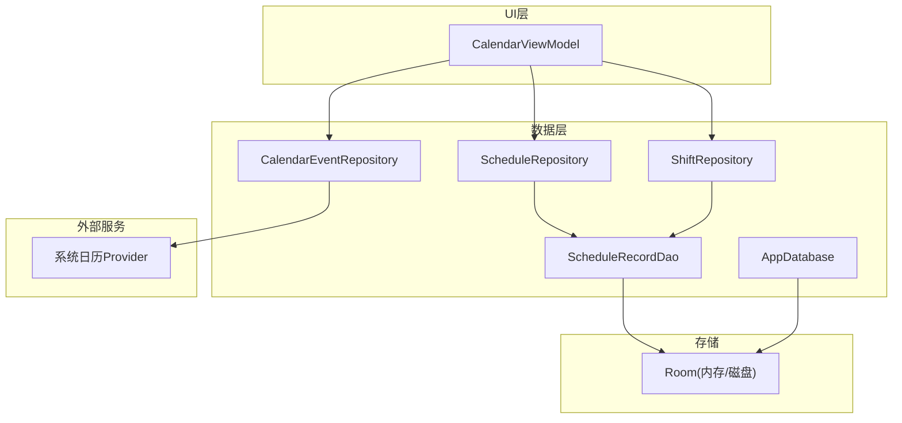
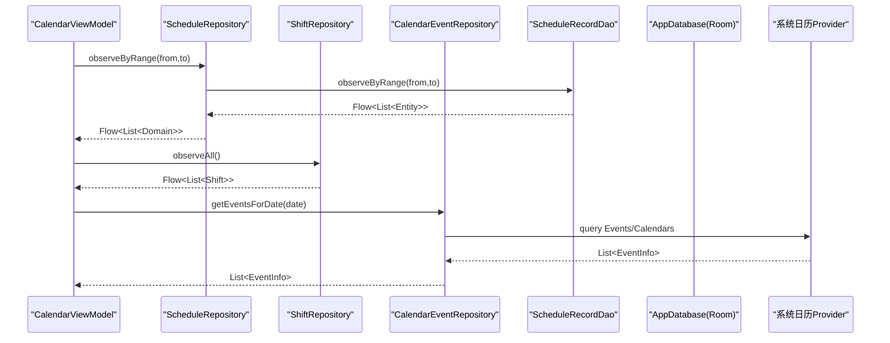
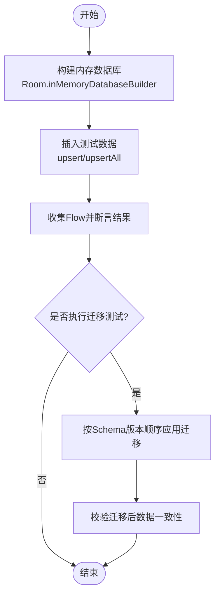
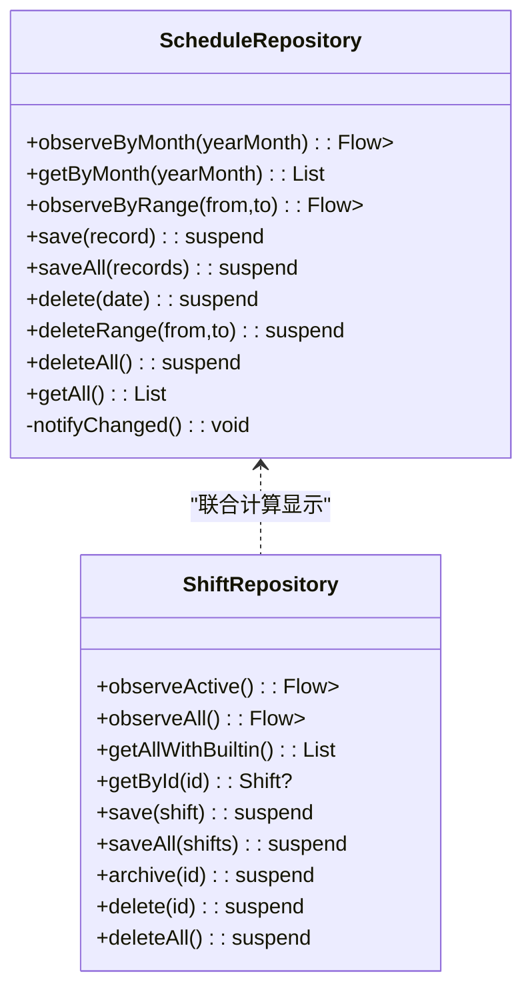
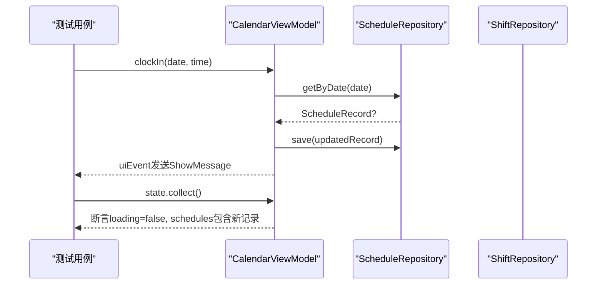
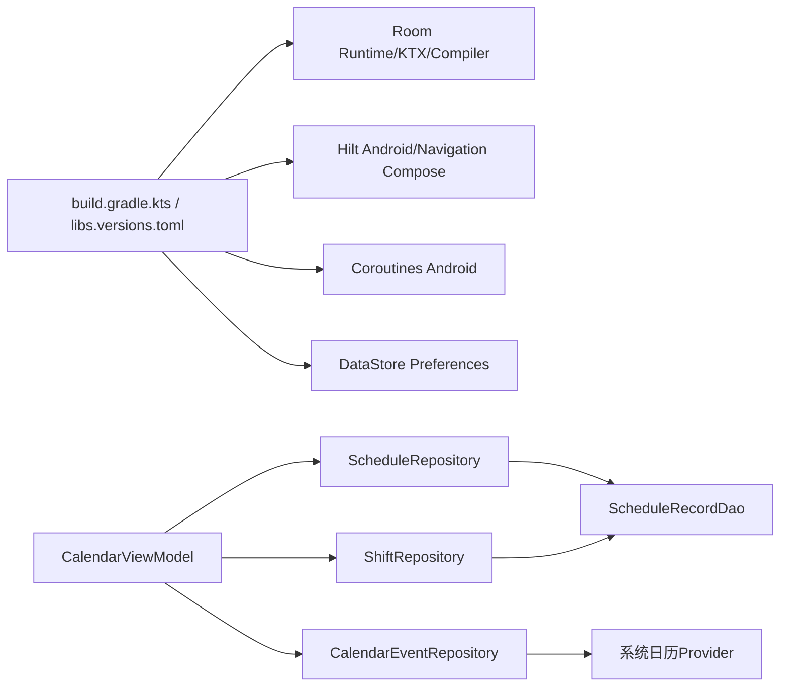

# 集成测试

<cite>
**本文引用的文件**   
- [AppDatabase.kt](file://app/src/main/java/com/schedulecalendar/app/data/db/AppDatabase.kt)
- [DatabaseModule.kt](file://app/src/main/java/com/schedulecalendar/app/di/DatabaseModule.kt)
- [ScheduleRecordDao.kt](file://app/src/main/java/com/schedulecalendar/app/data/db/dao/ScheduleRecordDao.kt)
- [ScheduleRepository.kt](file://app/src/main/java/com/schedulecalendar/app/data/repository/ScheduleRepository.kt)
- [ShiftRepository.kt](file://app/src/main/java/com/schedulecalendar/app/data/repository/ShiftRepository.kt)
- [CalendarEventRepository.kt](file://app/src/main/java/com/schedulecalendar/app/data/calendar/CalendarEventRepository.kt)
- [CalendarViewModel.kt](file://app/src/main/java/com/schedulecalendar/app/ui/calendar/CalendarViewModel.kt)
- [Converters.kt](file://app/src/main/java/com/schedulecalendar/app/data/db/Converters.kt)
- [ScheduleRecordEntity.kt](file://app/src/main/java/com/schedulecalendar/app/data/db/entity/ScheduleRecordEntity.kt)
- [build.gradle.kts](file://app/build.gradle.kts)
- [libs.versions.toml](file://gradle/libs.versions.toml)
</cite>

## 目录
1. [简介](#简介)
2. [项目结构](#项目结构)
3. [核心组件](#核心组件)
4. [架构总览](#架构总览)
5. [详细组件分析](#详细组件分析)
6. [依赖关系分析](#依赖关系分析)
7. [性能考量](#性能考量)
8. [故障排查指南](#故障排查指南)
9. [结论](#结论)
10. [附录](#附录)

## 简介
本文件面向Android排班日历应用的集成测试，聚焦以下目标：
- Room数据库集成测试：内存数据库、数据迁移与事务测试策略
- Repository层集成测试：多数据源协调与一致性验证
- ViewModel与Repository集成测试：异步操作与状态更新验证
- Hilt依赖注入在测试环境中的配置与使用
- 数据库测试夹具与测试数据管理方案
- API接口集成测试与第三方服务模拟（系统日历Provider）

## 项目结构
应用采用分层架构：UI层（Compose + ViewModel）、数据层（Repository + DAO + Room）、外部服务（系统日历Provider）。Room通过Hilt提供单例数据库实例，DAO暴露Flow与suspend方法，Repository封装领域模型转换与协程流。

图表来源 
- [CalendarViewModel.kt](file://app/src/main/java/com/schedulecalendar/app/ui/calendar/CalendarViewModel.kt)
- [ScheduleRepository.kt](file://app/src/main/java/com/schedulecalendar/app/data/repository/ScheduleRepository.kt)
- [ShiftRepository.kt](file://app/src/main/java/com/schedulecalendar/app/data/repository/ShiftRepository.kt)
- [CalendarEventRepository.kt](file://app/src/main/java/com/schedulecalendar/app/data/calendar/CalendarEventRepository.kt)
- [ScheduleRecordDao.kt](file://app/src/main/java/com/schedulecalendar/app/data/db/dao/ScheduleRecordDao.kt)
- [AppDatabase.kt](file://app/src/main/java/com/schedulecalendar/app/data/db/AppDatabase.kt)

章节来源
- [AppDatabase.kt:17-34](file://app/src/main/java/com/schedulecalendar/app/data/db/AppDatabase.kt#L17-L34)
- [DatabaseModule.kt:23-34](file://app/src/main/java/com/schedulecalendar/app/di/DatabaseModule.kt#L23-L34)
- [ScheduleRecordDao.kt:8-39](file://app/src/main/java/com/schedulecalendar/app/data/db/dao/ScheduleRecordDao.kt#L8-L39)
- [ScheduleRepository.kt:13-39](file://app/src/main/java/com/schedulecalendar/app/data/repository/ScheduleRepository.kt#L13-L39)
- [ShiftRepository.kt:12-44](file://app/src/main/java/com/schedulecalendar/app/data/repository/ShiftRepository.kt#L12-L44)
- [CalendarEventRepository.kt:46-800](file://app/src/main/java/com/schedulecalendar/app/data/calendar/CalendarEventRepository.kt#L46-L800)

## 核心组件
- AppDatabase：Room数据库入口，声明实体与版本，导出Schema用于迁移追踪
- DatabaseModule：Hilt模块，提供AppDatabase及所有DAO的单例
- ScheduleRecordDao：排班记录的CRUD与范围查询、Flow观察
- ScheduleRepository：将Entity映射为Domain模型，暴露Flow与suspend方法，写操作后发出刷新信号
- ShiftRepository：班次数据访问，合并内置班次，支持归档与删除
- CalendarEventRepository：系统日历Provider的读写封装，含账户/日历创建、事件CRUD与批量操作
- CalendarViewModel：组合多个Repository，驱动UI状态与事件流

章节来源
- [AppDatabase.kt:17-34](file://app/src/main/java/com/schedulecalendar/app/data/db/AppDatabase.kt#L17-L34)
- [DatabaseModule.kt:23-34](file://app/src/main/java/com/schedulecalendar/app/di/DatabaseModule.kt#L23-L34)
- [ScheduleRecordDao.kt:8-39](file://app/src/main/java/com/schedulecalendar/app/data/db/dao/ScheduleRecordDao.kt#L8-L39)
- [ScheduleRepository.kt:13-39](file://app/src/main/java/com/schedulecalendar/app/data/repository/ScheduleRepository.kt#L13-L39)
- [ShiftRepository.kt:12-44](file://app/src/main/java/com/schedulecalendar/app/data/repository/ShiftRepository.kt#L12-L44)
- [CalendarEventRepository.kt:46-800](file://app/src/main/java/com/schedulecalendar/app/data/calendar/CalendarEventRepository.kt#L46-L800)
- [CalendarViewModel.kt:118-151](file://app/src/main/java/com/schedulecalendar/app/ui/calendar/CalendarViewModel.kt#L118-L151)

## 架构总览
下图展示从UI到数据层再到外部服务的调用链，以及Room与Hilt的装配关系。

图表来源 
- [CalendarViewModel.kt:173-244](file://app/src/main/java/com/schedulecalendar/app/ui/calendar/CalendarViewModel.kt#L173-L244)
- [ScheduleRepository.kt:22-39](file://app/src/main/java/com/schedulecalendar/app/data/repository/ScheduleRepository.kt#L22-L39)
- [ScheduleRecordDao.kt:10-21](file://app/src/main/java/com/schedulecalendar/app/data/db/dao/ScheduleRecordDao.kt#L10-L21)
- [CalendarEventRepository.kt:774-800](file://app/src/main/java/com/schedulecalendar/app/data/calendar/CalendarEventRepository.kt#L774-L800)

## 详细组件分析

### Room数据库集成测试
- 内存数据库测试
  - 使用Room.inMemoryDatabaseBuilder构建内存数据库，避免磁盘IO，提升测试速度
  - 通过@TypeConverter处理复杂字段（如JSON列表），确保写入/读取一致
  - 针对DAO的Flow进行收集与断言，验证数据变更传播
- 数据迁移测试
  - 利用app/schemas下的JSON Schema文件，校验v2→v5迁移路径
  - 使用fallbackToDestructiveMigration仅用于开发阶段；测试中应显式定义Migration并验证数据完整性
- 事务测试
  - 对upsertAll/deleteByRange等批量操作，使用Room的事务边界验证原子性
  - 结合Repository的saveAll与refreshSignal，验证写操作后的流式刷新

图表来源 
- [AppDatabase.kt:17-34](file://app/src/main/java/com/schedulecalendar/app/data/db/AppDatabase.kt#L17-L34)
- [Converters.kt:9-16](file://app/src/main/java/com/schedulecalendar/app/data/db/Converters.kt#L9-L16)
- [ScheduleRecordDao.kt:22-38](file://app/src/main/java/com/schedulecalendar/app/data/db/dao/ScheduleRecordDao.kt#L22-L38)

章节来源
- [AppDatabase.kt:17-34](file://app/src/main/java/com/schedulecalendar/app/data/db/AppDatabase.kt#L17-L34)
- [Converters.kt:9-16](file://app/src/main/java/com/schedulecalendar/app/data/db/Converters.kt#L9-L16)
- [ScheduleRecordDao.kt:22-38](file://app/src/main/java/com/schedulecalendar/app/data/db/dao/ScheduleRecordDao.kt#L22-L38)

### Repository层集成测试
- 多数据源协调
  - ScheduleRepository与ShiftRepository共同影响CalendarViewModel的状态计算
  - 通过combine合并多个Flow，验证跨源数据的一致性
- 数据一致性验证
  - 写操作后触发refreshSignal，确保下游观察者收到最新数据
  - 对内置班次与用户自定义班次的合并逻辑进行断言

图表来源 
- [ScheduleRepository.kt:13-39](file://app/src/main/java/com/schedulecalendar/app/data/repository/ScheduleRepository.kt#L13-L39)
- [ShiftRepository.kt:12-44](file://app/src/main/java/com/schedulecalendar/app/data/repository/ShiftRepository.kt#L12-L44)

章节来源
- [ScheduleRepository.kt:13-39](file://app/src/main/java/com/schedulecalendar/app/data/repository/ScheduleRepository.kt#L13-L39)
- [ShiftRepository.kt:12-44](file://app/src/main/java/com/schedulecalendar/app/data/repository/ShiftRepository.kt#L12-L44)

### ViewModel与Repository集成测试
- 异步操作测试
  - 使用runTest或TestDispatcher调度协程，验证clockIn/clockOut等操作
  - 监听uiEvent通道，断言消息类型与内容
- 状态更新验证
  - 订阅state Flow，断言loading、schedules、todos等字段变化
  - 验证applyRule、batchApplyShift等批量操作的最终状态

图表来源 
- [CalendarViewModel.kt:475-502](file://app/src/main/java/com/schedulecalendar/app/ui/calendar/CalendarViewModel.kt#L475-L502)
- [ScheduleRepository.kt:25-36](file://app/src/main/java/com/schedulecalendar/app/data/repository/ScheduleRepository.kt#L25-L36)

章节来源
- [CalendarViewModel.kt:475-502](file://app/src/main/java/com/schedulecalendar/app/ui/calendar/CalendarViewModel.kt#L475-L502)
- [ScheduleRepository.kt:25-36](file://app/src/main/java/com/schedulecalendar/app/data/repository/ScheduleRepository.kt#L25-L36)

### Hilt依赖注入在测试环境中的配置与使用
- 生产环境
  - DatabaseModule提供AppDatabase与DAO单例，使用@Singleton与@InstallIn(SingletonComponent::class)
- 测试环境
  - 通过Hilt测试注解替换DatabaseModule，提供内存数据库与Mock DAO
  - 使用@HiltAndroidRun、@UninstallModules卸载生产模块，安装测试模块
  - 对于无Context依赖的组件，可直接构造；需要Context时使用Robolectric或Instrumentation

章节来源
- [DatabaseModule.kt:23-34](file://app/src/main/java/com/schedulecalendar/app/di/DatabaseModule.kt#L23-L34)

### 数据库测试夹具与测试数据管理
- 实体与转换器
  - ScheduleRecordEntity定义表结构与字段类型
  - Converters处理List<String>与JSON字符串互转
- 测试数据生成
  - 工厂方法生成不同状态的排班记录（已打卡/未打卡/加班确认等）
  - 批量插入用于验证事务与Flow响应

章节来源
- [ScheduleRecordEntity.kt:8-25](file://app/src/main/java/com/schedulecalendar/app/data/db/entity/ScheduleRecordEntity.kt#L8-L25)
- [Converters.kt:9-16](file://app/src/main/java/com/schedulecalendar/app/data/db/Converters.kt#L9-L16)

### API接口集成测试与第三方服务模拟
- 系统日历Provider
  - CalendarEventRepository封装ContentResolver调用，提供事件CRUD与账户管理
  - 测试中需Mock ContentResolver或使用Robolectric模拟系统服务
- 权限与异常处理
  - 检查WRITE_CALENDAR权限，捕获异常返回空列表或默认值
  - 国产ROM兼容扩展属性写入，测试覆盖异常分支

章节来源
- [CalendarEventRepository.kt:46-800](file://app/src/main/java/com/schedulecalendar/app/data/calendar/CalendarEventRepository.kt#L46-L800)

## 依赖关系分析
- 构建依赖
  - Room、Hilt、Coroutines、DataStore等通过Gradle版本目录统一管理
- 模块内依赖
  - ViewModel依赖多个Repository，Repository依赖DAO与领域模型
  - CalendarEventRepository依赖Android系统API

图表来源 
- [build.gradle.kts:108-136](file://app/build.gradle.kts#L108-L136)
- [libs.versions.toml:48-68](file://gradle/libs.versions.toml#L48-L68)

章节来源
- [build.gradle.kts:108-136](file://app/build.gradle.kts#L108-L136)
- [libs.versions.toml:48-68](file://gradle/libs.versions.toml#L48-L68)

## 性能考量
- Room查询优化
  - 使用Flow懒加载与范围查询减少不必要的数据加载
  - 批量upsertAll降低多次插入开销
- 协程与线程
  - ViewModel中使用viewModelScope管理生命周期，避免泄漏
  - IO密集型操作（如Provider查询）切换到Dispatchers.IO
- 内存占用
  - 内存数据库测试快速但需注意大数据集场景
  - 合理分页与缓存策略，避免一次性加载过多数据

## 故障排查指南
- 数据库迁移失败
  - 检查Schema JSON与实体字段一致性
  - 验证Migration脚本是否正确处理列新增/删除
- Flow未触发更新
  - 确认Repository在写操作后调用notifyChanged
  - 检查ViewModel是否正确collect Flow
- 系统日历权限问题
  - 运行时请求WRITE_CALENDAR权限
  - 检查AccountManager与ContentResolver调用是否成功

章节来源
- [ScheduleRepository.kt:32-36](file://app/src/main/java/com/schedulecalendar/app/data/repository/ScheduleRepository.kt#L32-L36)
- [CalendarEventRepository.kt:432-445](file://app/src/main/java/com/schedulecalendar/app/data/calendar/CalendarEventRepository.kt#L432-L445)

## 结论
通过Room内存数据库、Hilt测试模块、Repository与ViewModel的集成测试，可全面验证排班日历应用的数据流、异步操作与第三方服务交互。建议持续完善迁移测试与Mock策略，确保代码质量与稳定性。

## 附录
- 测试工具推荐
  - JUnit 5、Kotlinx Coroutines Test、Robolectric、Mockk
- 最佳实践
  - 每个测试用例独立数据库实例，避免状态污染
  - 明确断言Flow发射序列与最终状态
  - 对外部服务调用进行Mock，隔离系统差异