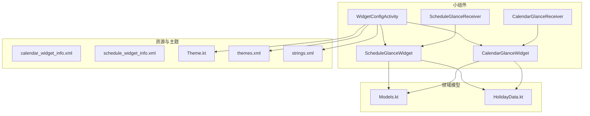
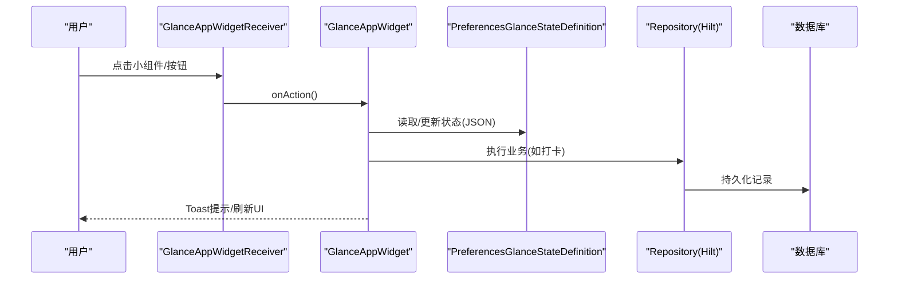
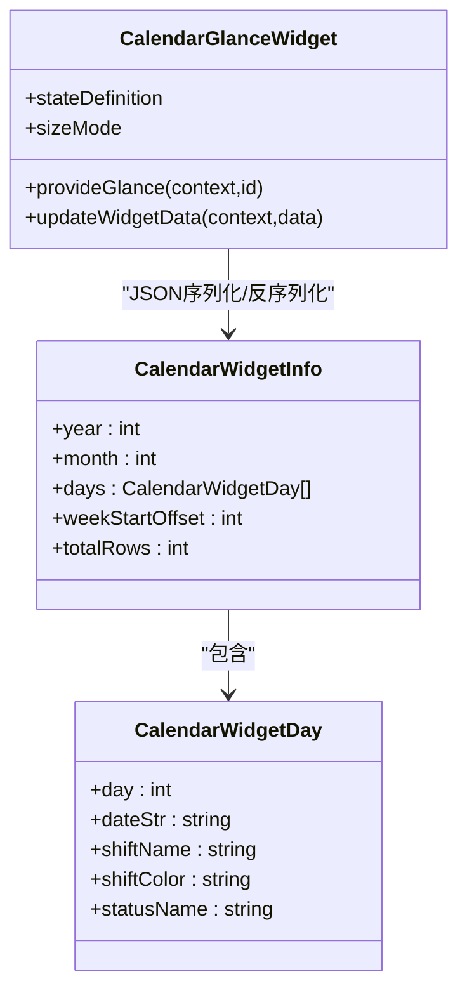
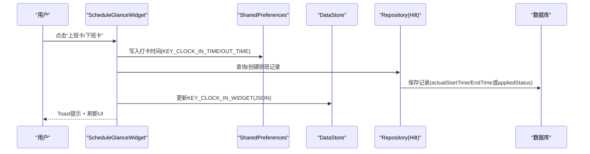
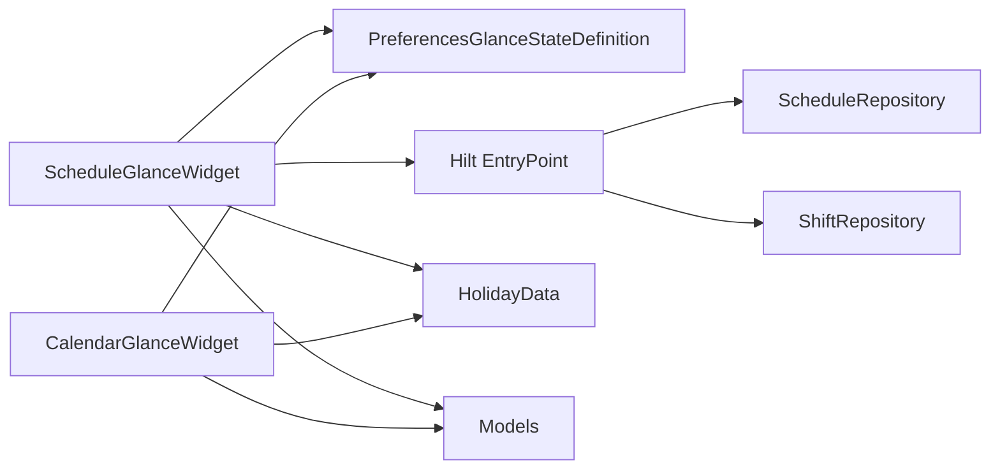

# Glance桌面小组件

<cite>
**本文引用的文件**   
- [CalendarGlanceWidget.kt](file://app/src/main/java/com/schedulecalendar/app/widget/CalendarGlanceWidget.kt)
- [ScheduleGlanceWidget.kt](file://app/src/main/java/com/schedulecalendar/app/widget/ScheduleGlanceWidget.kt)
- [CalendarGlanceReceiver.kt](file://app/src/main/java/com/schedulecalendar/app/widget/CalendarGlanceReceiver.kt)
- [ScheduleGlanceReceiver.kt](file://app/src/main/java/com/schedulecalendar/app/widget/ScheduleGlanceReceiver.kt)
- [WidgetConfigActivity.kt](file://app/src/main/java/com/schedulecalendar/app/widget/WidgetConfigActivity.kt)
- [calendar_widget_info.xml](file://app/src/main/res/xml/calendar_widget_info.xml)
- [schedule_widget_info.xml](file://app/src/main/res/xml/schedule_widget_info.xml)
- [Theme.kt](file://app/src/main/java/com/schedulecalendar/app/ui/theme/Theme.kt)
- [themes.xml](file://app/src/main/res/values/themes.xml)
- [strings.xml](file://app/src/main/res/values/strings.xml)
- [Models.kt](file://app/src/main/java/com/schedulecalendar/app/domain/model/Models.kt)
- [HolidayData.kt](file://app/src/main/java/com/schedulecalendar/app/domain/model/HolidayData.kt)
</cite>

## 目录
1. [简介](#简介)
2. [项目结构](#项目结构)
3. [核心组件](#核心组件)
4. [架构总览](#架构总览)
5. [详细组件分析](#详细组件分析)
6. [依赖关系分析](#依赖关系分析)
7. [性能与内存优化](#性能与内存优化)
8. [故障排查指南](#故障排查指南)
9. [结论](#结论)
10. [附录：配置项与尺寸适配](#附录配置项与尺寸适配)

## 简介
本仓库实现了基于 Android Glance 的桌面小组件，包含两类小组件：
- 日历网格小组件（CalendarGlanceWidget）：展示当月日期、班次名称、附加状态、农历/节假日信息，支持点击跳转主界面指定日期。
- 快捷打卡小组件（ScheduleGlanceWidget）：展示当日班次、上下班时间、打卡按钮，支持上班/下班打卡并同步到数据库，同时联动刷新日历小组件。

文档将深入解析 UI 布局、数据绑定、状态更新机制、生命周期管理、事件处理、主题与尺寸适配、动画效果、配置选项、性能优化与常见问题解决方案。

## 项目结构
小组件相关代码集中在 widget 包，配合资源 xml 声明小组件属性，以及主题与字符串资源。

图表来源
- [CalendarGlanceReceiver.kt:1-14](file://app/src/main/java/com/schedulecalendar/app/widget/CalendarGlanceReceiver.kt#L1-L14)
- [CalendarGlanceWidget.kt:54-73](file://app/src/main/java/com/schedulecalendar/app/widget/CalendarGlanceWidget.kt#L54-L73)
- [ScheduleGlanceReceiver.kt:1-14](file://app/src/main/java/com/schedulecalendar/app/widget/ScheduleGlanceReceiver.kt#L1-L14)
- [ScheduleGlanceWidget.kt:85-111](file://app/src/main/java/com/schedulecalendar/app/widget/ScheduleGlanceWidget.kt#L85-L111)
- [WidgetConfigActivity.kt:56-115](file://app/src/main/java/com/schedulecalendar/app/widget/WidgetConfigActivity.kt#L56-L115)
- [calendar_widget_info.xml:1-19](file://app/src/main/res/xml/calendar_widget_info.xml#L1-L19)
- [schedule_widget_info.xml:1-17](file://app/src/main/res/xml/schedule_widget_info.xml#L1-L17)
- [Theme.kt:53-80](file://app/src/main/java/com/schedulecalendar/app/ui/theme/Theme.kt#L53-L80)
- [themes.xml:7-13](file://app/src/main/res/values/themes.xml#L7-L13)
- [strings.xml:1-13](file://app/src/main/res/values/strings.xml#L1-L13)

章节来源
- [CalendarGlanceWidget.kt:54-73](file://app/src/main/java/com/schedulecalendar/app/widget/CalendarGlanceWidget.kt#L54-L73)
- [ScheduleGlanceWidget.kt:85-111](file://app/src/main/java/com/schedulecalendar/app/widget/ScheduleGlanceWidget.kt#L85-L111)
- [WidgetConfigActivity.kt:56-115](file://app/src/main/java/com/schedulecalendar/app/widget/WidgetConfigActivity.kt#L56-L115)
- [calendar_widget_info.xml:1-19](file://app/src/main/res/xml/calendar_widget_info.xml#L1-L19)
- [schedule_widget_info.xml:1-17](file://app/src/main/res/xml/schedule_widget_info.xml#L1-L17)

## 核心组件
- CalendarGlanceWidget：提供日历网格 UI，使用 Compose for Glance；通过 PreferencesGlanceStateDefinition 持久化 JSON 数据；提供“打开日期”和“刷新”动作回调。
- ScheduleGlanceWidget：提供快捷打卡 UI；通过 SharedPreferences 与 DataStore 双写保证即时刷新与持久化；通过 Hilt EntryPoint 访问 Repository 完成打卡逻辑。
- CalendarGlanceReceiver / ScheduleGlanceReceiver：GlanceAppWidgetReceiver 桥接系统调用与具体 GlanceAppWidget。
- WidgetConfigActivity：统一配置界面，支持背景透明度、显示模式等设置，保存后触发两个小组件刷新。

章节来源
- [CalendarGlanceWidget.kt:54-73](file://app/src/main/java/com/schedulecalendar/app/widget/CalendarGlanceWidget.kt#L54-L73)
- [ScheduleGlanceWidget.kt:85-111](file://app/src/main/java/com/schedulecalendar/app/widget/ScheduleGlanceWidget.kt#L85-L111)
- [CalendarGlanceReceiver.kt:1-14](file://app/src/main/java/com/schedulecalendar/app/widget/CalendarGlanceReceiver.kt#L1-L14)
- [ScheduleGlanceReceiver.kt:1-14](file://app/src/main/java/com/schedulecalendar/app/widget/ScheduleGlanceReceiver.kt#L1-L14)
- [WidgetConfigActivity.kt:56-115](file://app/src/main/java/com/schedulecalendar/app/widget/WidgetConfigActivity.kt#L56-L115)

## 架构总览
小组件采用 Glance + Compose 架构，数据通过 DataStore/SharedPreferences 持久化，UI 由 provideContent 渲染；ActionCallback 处理用户交互；Hilt EntryPoint 在 ActionCallback 中注入 Repository 进行数据写入。

图表来源
- [ScheduleGlanceWidget.kt:115-194](file://app/src/main/java/com/schedulecalendar/app/widget/ScheduleGlanceWidget.kt#L115-L194)
- [ScheduleGlanceWidget.kt:218-299](file://app/src/main/java/com/schedulecalendar/app/widget/ScheduleGlanceWidget.kt#L218-L299)
- [ScheduleGlanceWidget.kt:626-632](file://app/src/main/java/com/schedulecalendar/app/widget/ScheduleGlanceWidget.kt#L626-L632)

章节来源
- [ScheduleGlanceWidget.kt:115-194](file://app/src/main/java/com/schedulecalendar/app/widget/ScheduleGlanceWidget.kt#L115-L194)
- [ScheduleGlanceWidget.kt:218-299](file://app/src/main/java/com/schedulecalendar/app/widget/ScheduleGlanceWidget.kt#L218-L299)
- [ScheduleGlanceWidget.kt:626-632](file://app/src/main/java/com/schedulecalendar/app/widget/ScheduleGlanceWidget.kt#L626-L632)

## 详细组件分析

### CalendarGlanceWidget（日历网格）
- UI 布局
  - 顶部标题行：年月 + 刷新按钮（圆形图标）。
  - 星期标签行：周一至周日。
  - 日期网格：按 totalRows 行 x 7 列渲染，支持今日高亮、班次背景色、农历/节假日文本、附加状态文本。
  - 深色模式自适应：根据系统夜间模式切换文字颜色与背景透明度。
- 数据绑定
  - 使用 currentState 读取 DataStore 中的 JSON 字符串，反序列化为 CalendarWidgetInfo。
  - 从 WIDGET_CONFIG_PREFS 读取文本颜色、背景颜色及透明度，计算 ColorProvider。
- 状态更新机制
  - updateWidgetData(context, data) 遍历所有实例 ID，写入 DataStore 并调用 update 触发重渲染。
  - RefreshWidgetAction 仅触发 UI 重渲染，数据同步由应用层 ViewModel 负责。
- 点击事件
  - OpenDateAction：跳转到 MainActivity 并携带目标日期参数。
- 尺寸适配与动画
  - SizeMode.Exact，固定尺寸；根据 LocalSize 判断 isLarge，动态调整字号与圆角。
  - 无显式动画，但通过透明度和圆角实现视觉过渡。

图表来源
- [CalendarGlanceWidget.kt:41-51](file://app/src/main/java/com/schedulecalendar/app/widget/CalendarGlanceWidget.kt#L41-L51)
- [CalendarGlanceWidget.kt:54-73](file://app/src/main/java/com/schedulecalendar/app/widget/CalendarGlanceWidget.kt#L54-L73)

章节来源
- [CalendarGlanceWidget.kt:100-207](file://app/src/main/java/com/schedulecalendar/app/widget/CalendarGlanceWidget.kt#L100-L207)
- [CalendarGlanceWidget.kt:209-295](file://app/src/main/java/com/schedulecalendar/app/widget/CalendarGlanceWidget.kt#L209-L295)
- [CalendarGlanceWidget.kt:75-97](file://app/src/main/java/com/schedulecalendar/app/widget/CalendarGlanceWidget.kt#L75-L97)

### ScheduleGlanceWidget（快捷打卡）
- UI 布局
  - 左侧：班次名 + 附加状态（同一行），上下班时间（已打卡显示实际时间，否则显示计划时间），第三行根据显示模式展示“明天班次”或“法定节假日倒计时”。
  - 右侧：打卡按钮（上班卡/下班卡），根据 hasClockIn/hasClockOut 控制可见性与样式。
- 数据绑定
  - 从 DataStore 读取 KEY_CLOCK_IN_WIDGET JSON，反序列化为 ClockInWidgetData。
  - 从 CLOCK_IN_PREFS 读取当天打卡时间，决定显示状态。
  - 从 WIDGET_CONFIG_PREFS 读取显示模式、颜色与透明度。
- 状态更新机制
  - updateWidgetData(context, data) 同时写入 SharedPreferences 与 DataStore，并遍历所有实例 ID 调用 update。
  - refreshWidgets(context, glanceId) 在打卡后刷新当前小组件与日历小组件。
- 事件处理
  - WidgetClockInAction / WidgetClockOutAction：读取 widget 数据，先写 SharedPreferences 再写数据库（通过 Hilt EntryPoint 获取 Repository），最后刷新 UI 并 Toast。
  - OpenAppAction：启动应用。
- 内置规则
  - 内置班次+自定义附加状态：打卡时间写入附加状态的 startTime/endTime。
  - 普通班次：写入实际上班/下班时间；若为内置状态且迟到/早退，自动填充附加状态时间段。

图表来源
- [ScheduleGlanceWidget.kt:115-194](file://app/src/main/java/com/schedulecalendar/app/widget/ScheduleGlanceWidget.kt#L115-L194)
- [ScheduleGlanceWidget.kt:218-299](file://app/src/main/java/com/schedulecalendar/app/widget/ScheduleGlanceWidget.kt#L218-L299)
- [ScheduleGlanceWidget.kt:318-325](file://app/src/main/java/com/schedulecalendar/app/widget/ScheduleGlanceWidget.kt#L318-L325)

章节来源
- [ScheduleGlanceWidget.kt:369-591](file://app/src/main/java/com/schedulecalendar/app/widget/ScheduleGlanceWidget.kt#L369-L591)
- [ScheduleGlanceWidget.kt:115-194](file://app/src/main/java/com/schedulecalendar/app/widget/ScheduleGlanceWidget.kt#L115-L194)
- [ScheduleGlanceWidget.kt:218-299](file://app/src/main/java/com/schedulecalendar/app/widget/ScheduleGlanceWidget.kt#L218-L299)
- [ScheduleGlanceWidget.kt:318-325](file://app/src/main/java/com/schedulecalendar/app/widget/ScheduleGlanceWidget.kt#L318-L325)

### CalendarGlanceReceiver / ScheduleGlanceReceiver
- 职责：作为系统入口，将小组件生命周期事件转发给对应的 GlanceAppWidget。
- 特点：纯桥接类，无额外逻辑。

章节来源
- [CalendarGlanceReceiver.kt:1-14](file://app/src/main/java/com/schedulecalendar/app/widget/CalendarGlanceReceiver.kt#L1-L14)
- [ScheduleGlanceReceiver.kt:1-14](file://app/src/main/java/com/schedulecalendar/app/widget/ScheduleGlanceReceiver.kt#L1-L14)

### WidgetConfigActivity（配置界面）
- 功能
  - 支持两种小组件类型的配置入口（从设置页或添加小组件时传入类型）。
  - 提供背景透明度滑块（分别针对日历与打卡小组件）、显示模式选择（仅打卡小组件）。
  - 保存配置后，同步刷新两个小组件实例。
- 用户交互
  - 底部“保存配置”按钮，写入 WIDGET_CONFIG_PREFS，并调用 GlanceAppWidgetManager 更新所有实例。
  - 返回结果：若来自添加小组件流程，返回 RESULT_OK 并附带 appWidgetId；否则 RESULT_CANCELED。

章节来源
- [WidgetConfigActivity.kt:56-115](file://app/src/main/java/com/schedulecalendar/app/widget/WidgetConfigActivity.kt#L56-L115)
- [WidgetConfigActivity.kt:119-325](file://app/src/main/java/com/schedulecalendar/app/widget/WidgetConfigActivity.kt#L119-L325)

## 依赖关系分析
- 组件耦合
  - CalendarGlanceWidget 与 ScheduleGlanceWidget 均依赖 PreferencesGlanceStateDefinition 进行状态持久化。
  - ScheduleGlanceWidget 通过 Hilt EntryPoint 访问 Repository，避免在 ActionCallback 中直接依赖 DI 容器。
  - 两者共享配置键（WIDGET_CONFIG_PREFS），确保主题与透明度一致。
- 外部依赖
  - HolidayData 提供节假日与节气信息，用于日历与倒计时显示。
  - Models 定义班次、状态、排班记录等数据结构。
- 潜在循环依赖
  - 无直接循环依赖；WidgetConfigActivity 仅触发刷新，不反向依赖 Widget 内部逻辑。

图表来源
- [CalendarGlanceWidget.kt:54-73](file://app/src/main/java/com/schedulecalendar/app/widget/CalendarGlanceWidget.kt#L54-L73)
- [ScheduleGlanceWidget.kt:85-111](file://app/src/main/java/com/schedulecalendar/app/widget/ScheduleGlanceWidget.kt#L85-L111)
- [ScheduleGlanceWidget.kt:626-632](file://app/src/main/java/com/schedulecalendar/app/widget/ScheduleGlanceWidget.kt#L626-L632)
- [HolidayData.kt:1-636](file://app/src/main/java/com/schedulecalendar/app/domain/model/HolidayData.kt#L1-L636)
- [Models.kt:1-278](file://app/src/main/java/com/schedulecalendar/app/domain/model/Models.kt#L1-L278)

章节来源
- [ScheduleGlanceWidget.kt:626-632](file://app/src/main/java/com/schedulecalendar/app/widget/ScheduleGlanceWidget.kt#L626-L632)
- [HolidayData.kt:1-636](file://app/src/main/java/com/schedulecalendar/app/domain/model/HolidayData.kt#L1-L636)
- [Models.kt:1-278](file://app/src/main/java/com/schedulecalendar/app/domain/model/Models.kt#L1-L278)

## 性能与内存优化
- 状态存储策略
  - CalendarGlanceWidget：使用 DataStore 存储 JSON，减少 IO 频率；updateWidgetData 批量更新所有实例。
  - ScheduleGlanceWidget：SharedPreferences 用于即时读取（ActionCallback 中），DataStore 用于状态持久化；双重写入保证一致性。
- 渲染优化
  - 使用 GlanceModifier.fillMaxSize 与按需 padding，避免过度嵌套。
  - 深色模式通过 ColorProvider 一次性计算，避免重复分支。
- 刷新策略
  - 仅在必要操作（打卡、刷新按钮、配置保存）后调用 update，避免频繁全量刷新。
  - refreshWidgets 同时刷新两个小组件，减少系统调用次数。
- 内存优化
  - 使用 runCatching 包裹 JSON 解析，失败回退默认对象，避免异常堆栈占用。
  - 大尺寸判断与字体缩放减少不必要的绘制开销。

章节来源
- [CalendarGlanceWidget.kt:61-73](file://app/src/main/java/com/schedulecalendar/app/widget/CalendarGlanceWidget.kt#L61-L73)
- [ScheduleGlanceWidget.kt:94-111](file://app/src/main/java/com/schedulecalendar/app/widget/ScheduleGlanceWidget.kt#L94-L111)
- [ScheduleGlanceWidget.kt:318-325](file://app/src/main/java/com/schedulecalendar/app/widget/ScheduleGlanceWidget.kt#L318-L325)

## 故障排查指南
- 小组件不刷新
  - 检查是否调用 update 或 updateAppWidgetState；确认 GlanceAppWidgetManager.getGlanceIds 返回非空。
  - 确认 DataStore/SharedPreferences 写入成功。
- 打卡无效
  - 检查 Hilt EntryPoint 是否正确注入 Repository。
  - 确认数据库写入未抛异常；查看 Toast 是否出现。
- 主题/颜色异常
  - 检查 WIDGET_CONFIG_PREFS 的颜色键值格式（十六进制含 alpha）。
  - 深色模式下 ColorProvider 是否正确切换。
- 尺寸适配问题
  - 确认 SizeMode 与 xml 配置的 minWidth/minHeight/targetCellWidth/Height 匹配。
  - 检查 isLarge 判断逻辑与字体缩放。

章节来源
- [ScheduleGlanceWidget.kt:115-194](file://app/src/main/java/com/schedulecalendar/app/widget/ScheduleGlanceWidget.kt#L115-L194)
- [CalendarGlanceWidget.kt:61-73](file://app/src/main/java/com/schedulecalendar/app/widget/CalendarGlanceWidget.kt#L61-L73)
- [WidgetConfigActivity.kt:92-115](file://app/src/main/java/com/schedulecalendar/app/widget/WidgetConfigActivity.kt#L92-L115)

## 结论
本项目通过 Glance + Compose 实现了高性能、可配置的桌面小组件。CalendarGlanceWidget 与 ScheduleGlanceWidget 分别满足日历展示与快捷打卡需求，结合 Hilt 与 DataStore/SharedPreferences 保证了数据一致性与响应速度。WidgetConfigActivity 提供了统一的配置入口，支持主题与显示模式定制。整体架构清晰、扩展性强，适合进一步增加更多小组件类型或复杂交互。

## 附录：配置项与尺寸适配
- 配置项（WIDGET_CONFIG_PREFS）
  - KEY_CFG_TEXT_COLOR：文本颜色（十六进制，含 alpha）
  - KEY_CFG_BG_COLOR：背景颜色（十六进制，含 alpha）
  - KEY_CFG_CALENDAR_BG_TRANSPARENCY：日历背景透明度（0.0=不透明，1.0=全透明）
  - KEY_CFG_SCHEDULE_BG_TRANSPARENCY：打卡背景透明度
  - KEY_CFG_DISPLAY_MODE：打卡小组件显示模式（shift_tomorrow / shift_holiday）
- 尺寸适配
  - 日历小组件：minWidth=180dp, minHeight=180dp, targetCellWidth=3, targetCellHeight=3，支持水平/垂直拉伸。
  - 打卡小组件：minWidth=110dp, minHeight=30dp, targetCellWidth=2, targetCellHeight=1，不支持拉伸。
- 主题支持
  - 使用 Material3 主题，支持动态取色（Android 12+）与深色模式。
  - Activity 主题启用 edge-to-edge，状态栏/导航栏透明。

章节来源
- [WidgetConfigActivity.kt:36-53](file://app/src/main/java/com/schedulecalendar/app/widget/WidgetConfigActivity.kt#L36-L53)
- [calendar_widget_info.xml:1-19](file://app/src/main/res/xml/calendar_widget_info.xml#L1-L19)
- [schedule_widget_info.xml:1-17](file://app/src/main/res/xml/schedule_widget_info.xml#L1-L17)
- [Theme.kt:53-80](file://app/src/main/java/com/schedulecalendar/app/ui/theme/Theme.kt#L53-L80)
- [themes.xml:7-13](file://app/src/main/res/values/themes.xml#L7-L13)