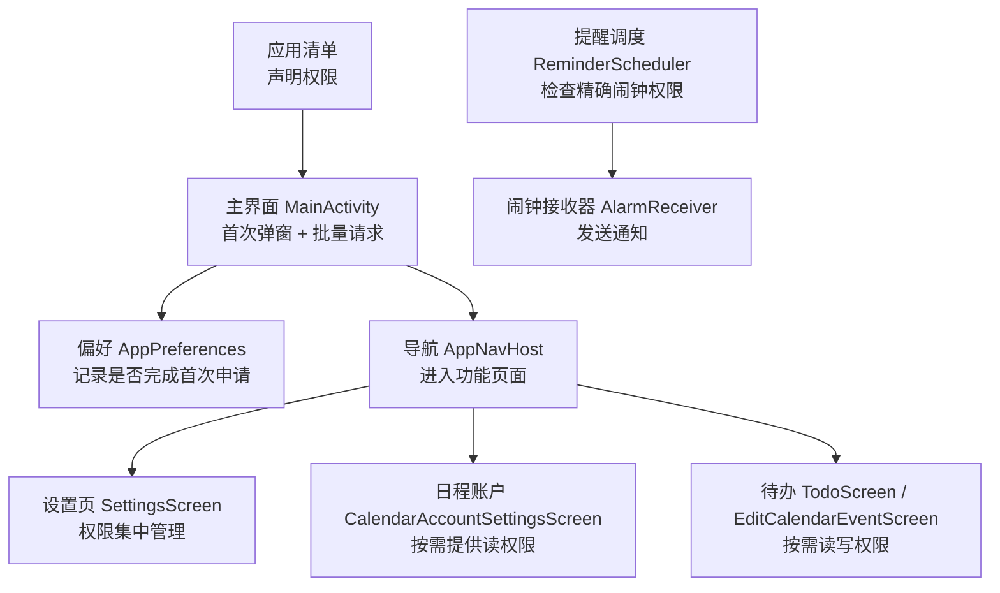
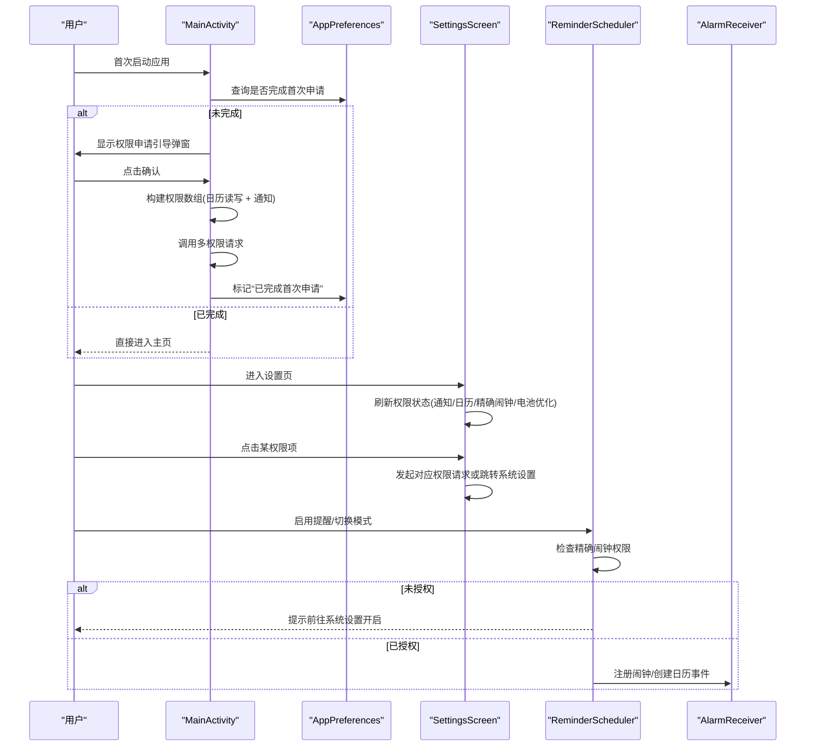
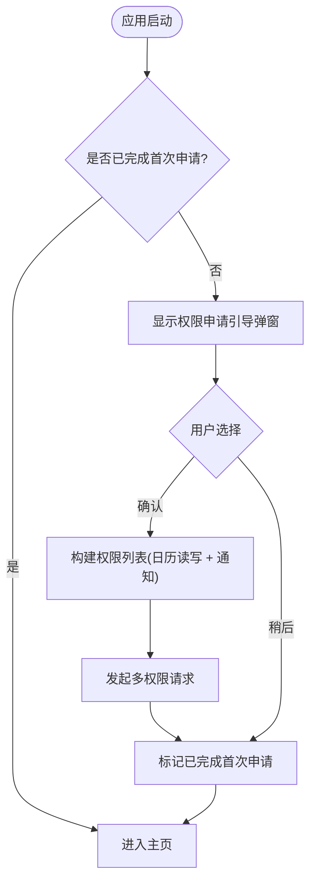
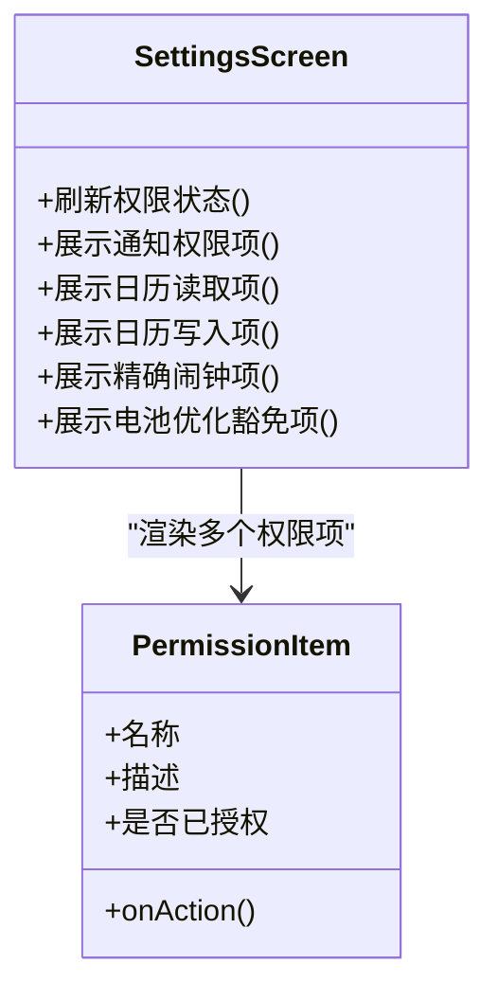
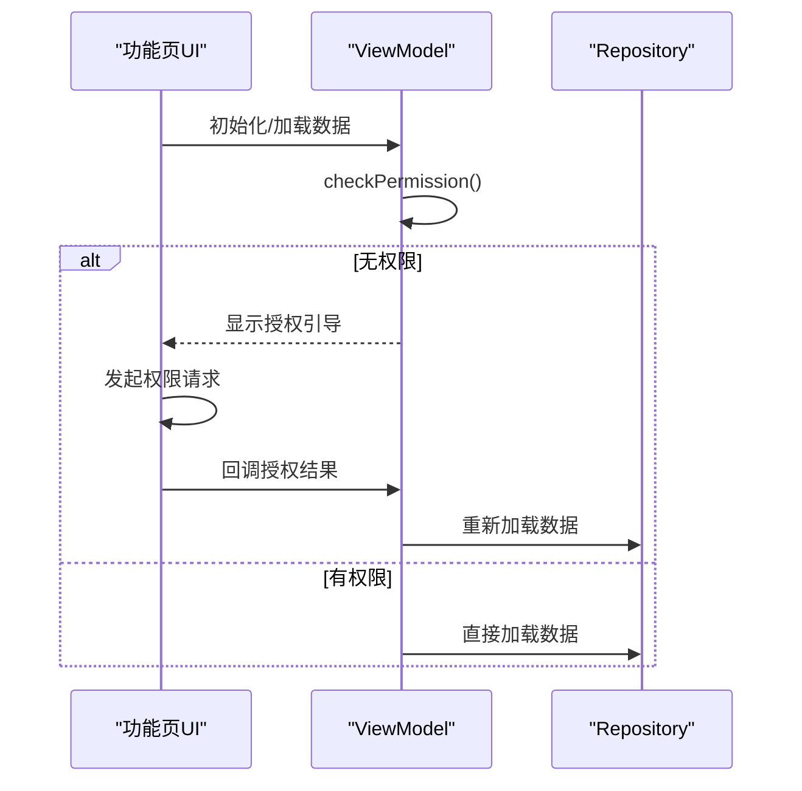
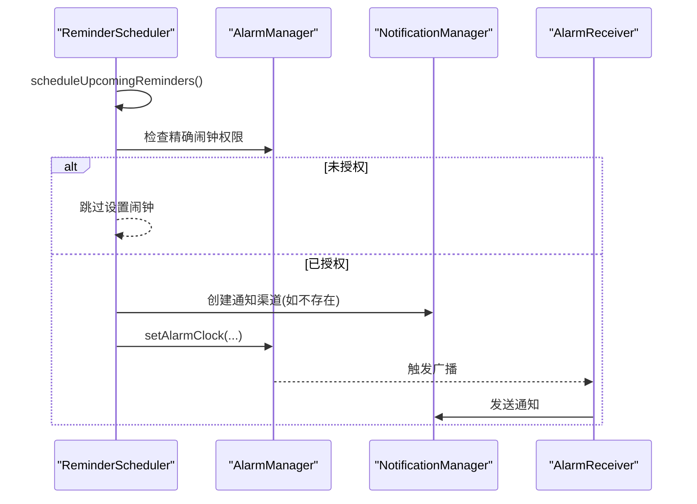
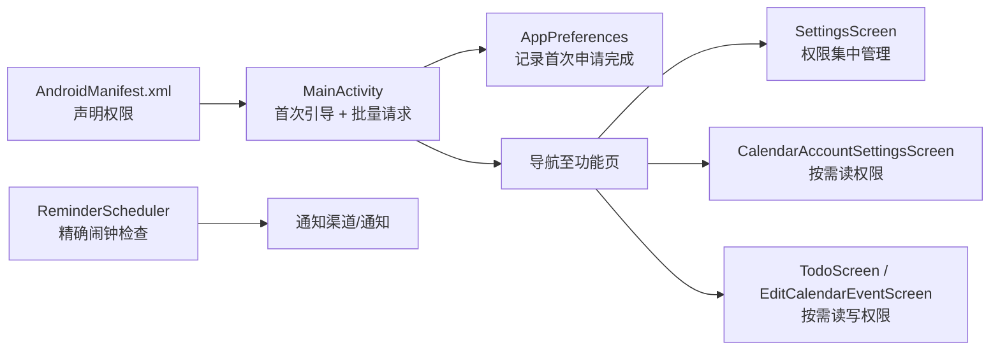

# 初始权限管理系统

<cite>
**本文引用的文件**
- [AndroidManifest.xml](file://app/src/main/AndroidManifest.xml)
- [MainActivity.kt](file://app/src/main/java/com/schedulecalendar/app/MainActivity.kt)
- [AppPreferences.kt](file://app/src/main/java/com/schedulecalendar/app/data/prefs/AppPreferences.kt)
- [SettingsScreen.kt](file://app/src/main/java/com/schedulecalendar/app/ui/settings/SettingsScreen.kt)
- [ReminderScheduler.kt](file://app/src/main/java/com/schedulecalendar/app/reminder/ReminderScheduler.kt)
- [AlarmReceiver.kt](file://app/src/main/java/com/schedulecalendar/app/reminder/AlarmReceiver.kt)
- [CalendarAccountSettingsScreen.kt](file://app/src/main/java/com/schedulecalendar/app/ui/settings/CalendarAccountSettingsScreen.kt)
- [TodoScreen.kt](file://app/src/main/java/com/schedulecalendar/app/ui/todo/TodoScreen.kt)
- [EditCalendarEventScreen.kt](file://app/src/main/java/com/schedulecalendar/app/ui/todo/EditCalendarEventScreen.kt)
- [CalendarEventViewModel.kt](file://app/src/main/java/com/schedulecalendar/app/ui/todo/CalendarEventViewModel.kt)
</cite>

## 目录
1. [简介](#简介)
2. [项目结构](#项目结构)
3. [核心组件](#核心组件)
4. [架构总览](#架构总览)
5. [详细组件分析](#详细组件分析)
6. [依赖关系分析](#依赖关系分析)
7. [性能与兼容性考虑](#性能与兼容性考虑)
8. [故障排查指南](#故障排查指南)
9. [结论](#结论)

## 简介
本文件聚焦于应用“初始权限管理”的设计与实现，覆盖首次启动引导、运行时权限请求、权限状态持久化、设置页集中管理与各功能模块的按需授权流程。系统围绕以下关键权限展开：
- 日历读取/写入（READ_CALENDAR / WRITE_CALENDAR）
- 通知（POST_NOTIFICATIONS，Android 13+）
- 精确闹钟（USE_EXACT_ALARM 安装时自动授予；Android 12 需 SCHEDULE_EXACT_ALARM 手动授权）
- 电池优化豁免（后台运行保障）

## 项目结构
权限相关代码分布在入口 Activity、设置界面、偏好存储与提醒调度等位置，形成“引导—请求—持久化—展示—按需触发”的闭环。

图表来源
- [AndroidManifest.xml:1-126](file://app/src/main/AndroidManifest.xml#L1-L126)
- [MainActivity.kt:50-121](file://app/src/main/java/com/schedulecalendar/app/MainActivity.kt#L50-L121)
- [AppPreferences.kt:271-277](file://app/src/main/java/com/schedulecalendar/app/data/prefs/AppPreferences.kt#L271-L277)
- [SettingsScreen.kt:217-416](file://app/src/main/java/com/schedulecalendar/app/ui/settings/SettingsScreen.kt#L217-L416)
- [ReminderScheduler.kt:209-246](file://app/src/main/java/com/schedulecalendar/app/reminder/ReminderScheduler.kt#L209-L246)
- [AlarmReceiver.kt:40-77](file://app/src/main/java/com/schedulecalendar/app/reminder/AlarmReceiver.kt#L40-L77)

章节来源
- [AndroidManifest.xml:1-126](file://app/src/main/AndroidManifest.xml#L1-L126)
- [MainActivity.kt:50-121](file://app/src/main/java/com/schedulecalendar/app/MainActivity.kt#L50-L121)
- [AppPreferences.kt:271-277](file://app/src/main/java/com/schedulecalendar/app/data/prefs/AppPreferences.kt#L271-L277)
- [SettingsScreen.kt:217-416](file://app/src/main/java/com/schedulecalendar/app/ui/settings/SettingsScreen.kt#L217-L416)
- [ReminderScheduler.kt:209-246](file://app/src/main/java/com/schedulecalendar/app/reminder/ReminderScheduler.kt#L209-L246)
- [AlarmReceiver.kt:40-77](file://app/src/main/java/com/schedulecalendar/app/reminder/AlarmReceiver.kt#L40-L77)

## 核心组件
- 首次启动引导与批量请求：在应用首次打开时弹出说明对话框，用户确认后一次性请求日历读写与通知权限，并标记“已完成首次申请”。
- 偏好持久化：使用 DataStore 保存“是否完成首次申请”，避免重复弹窗。
- 设置页权限管理：集中展示各项权限状态，支持一键跳转系统设置或发起请求。
- 功能页按需授权：在需要访问日历或写入事件的页面，在进入时检查并请求相应权限。
- 提醒调度器：在设置精确闹钟前校验权限，确保 Android 12 下具备 SCHEDULE_EXACT_ALARM。

章节来源
- [MainActivity.kt:74-121](file://app/src/main/java/com/schedulecalendar/app/MainActivity.kt#L74-L121)
- [AppPreferences.kt:271-277](file://app/src/main/java/com/schedulecalendar/app/data/prefs/AppPreferences.kt#L271-L277)
- [SettingsScreen.kt:217-416](file://app/src/main/java/com/schedulecalendar/app/ui/settings/SettingsScreen.kt#L217-L416)
- [CalendarAccountSettingsScreen.kt:38-58](file://app/src/main/java/com/schedulecalendar/app/ui/settings/CalendarAccountSettingsScreen.kt#L38-L58)
- [TodoScreen.kt:810-840](file://app/src/main/java/com/schedulecalendar/app/ui/todo/TodoScreen.kt#L810-L840)
- [EditCalendarEventScreen.kt:93-123](file://app/src/main/java/com/schedulecalendar/app/ui/todo/EditCalendarEventScreen.kt#L93-L123)
- [ReminderScheduler.kt:209-246](file://app/src/main/java/com/schedulecalendar/app/reminder/ReminderScheduler.kt#L209-L246)

## 架构总览
下图展示了从首次启动到权限申请、状态持久化、设置页管理以及功能页按需授权的完整流程。

图表来源
- [MainActivity.kt:74-121](file://app/src/main/java/com/schedulecalendar/app/MainActivity.kt#L74-L121)
- [AppPreferences.kt:271-277](file://app/src/main/java/com/schedulecalendar/app/data/prefs/AppPreferences.kt#L271-L277)
- [SettingsScreen.kt:217-416](file://app/src/main/java/com/schedulecalendar/app/ui/settings/SettingsScreen.kt#L217-L416)
- [ReminderScheduler.kt:209-246](file://app/src/main/java/com/schedulecalendar/app/reminder/ReminderScheduler.kt#L209-L246)
- [AlarmReceiver.kt:40-77](file://app/src/main/java/com/schedulecalendar/app/reminder/AlarmReceiver.kt#L40-L77)

## 详细组件分析

### 首次启动权限引导与批量请求
- 行为要点
  - 首次启动检测：通过偏好判断是否已完成首次申请，若未完成则弹出引导对话框。
  - 批量请求：确认后一次性请求日历读写与通知权限（Android 13+）。
  - 结果处理：无论同意或跳过，均标记“已完成首次申请”，避免重复弹窗。
- 用户体验
  - 明确说明所需权限用途，并提供“稍后再说”选项。
  - 后续可在设置页中统一查看与管理。

图表来源
- [MainActivity.kt:74-121](file://app/src/main/java/com/schedulecalendar/app/MainActivity.kt#L74-L121)
- [AppPreferences.kt:271-277](file://app/src/main/java/com/schedulecalendar/app/data/prefs/AppPreferences.kt#L271-L277)

章节来源
- [MainActivity.kt:74-121](file://app/src/main/java/com/schedulecalendar/app/MainActivity.kt#L74-L121)
- [AppPreferences.kt:271-277](file://app/src/main/java/com/schedulecalendar/app/data/prefs/AppPreferences.kt#L271-L277)

### 设置页权限管理中心
- 能力概览
  - 实时刷新：基于生命周期恢复时刷新权限状态。
  - 分类展示：通知、日历读取、日历写入、精确闹钟、电池优化豁免。
  - 快捷操作：对未授权项提供“前往设置”或直接发起请求。
- 版本兼容
  - 通知权限：仅在 Android 13+ 需要用户授权。
  - 精确闹钟：Android 13+ 自动授予；Android 12 需跳转到系统设置手动开启。
  - 国产 ROM 提示：针对特定厂商给出后台运行保障建议。

图表来源
- [SettingsScreen.kt:217-416](file://app/src/main/java/com/schedulecalendar/app/ui/settings/SettingsScreen.kt#L217-L416)

章节来源
- [SettingsScreen.kt:217-416](file://app/src/main/java/com/schedulecalendar/app/ui/settings/SettingsScreen.kt#L217-L416)

### 功能页按需授权
- 日程账户设置
  - 进入即检查 READ_CALENDAR，未授权则引导用户授权。
- 待办与日历事件编辑
  - 读取事件：需要 READ_CALENDAR。
  - 写入事件：需要 WRITE_CALENDAR。
- ViewModel 层防护
  - 在加载数据前进行权限检查，避免 SecurityException 导致崩溃。

图表来源
- [CalendarAccountSettingsScreen.kt:38-58](file://app/src/main/java/com/schedulecalendar/app/ui/settings/CalendarAccountSettingsScreen.kt#L38-L58)
- [TodoScreen.kt:810-840](file://app/src/main/java/com/schedulecalendar/app/ui/todo/TodoScreen.kt#L810-L840)
- [EditCalendarEventScreen.kt:93-123](file://app/src/main/java/com/schedulecalendar/app/ui/todo/EditCalendarEventScreen.kt#L93-L123)
- [CalendarEventViewModel.kt:213-253](file://app/src/main/java/com/schedulecalendar/app/ui/todo/CalendarEventViewModel.kt#L213-L253)

章节来源
- [CalendarAccountSettingsScreen.kt:38-58](file://app/src/main/java/com/schedulecalendar/app/ui/settings/CalendarAccountSettingsScreen.kt#L38-L58)
- [TodoScreen.kt:810-840](file://app/src/main/java/com/schedulecalendar/app/ui/todo/TodoScreen.kt#L810-L840)
- [EditCalendarEventScreen.kt:93-123](file://app/src/main/java/com/schedulecalendar/app/ui/todo/EditCalendarEventScreen.kt#L93-L123)
- [CalendarEventViewModel.kt:213-253](file://app/src/main/java/com/schedulecalendar/app/ui/todo/CalendarEventViewModel.kt#L213-L253)

### 精确闹钟与通知通道
- 精确闹钟
  - 设置闹钟前检查 canScheduleExactAlarms，未授权则跳过并提示。
  - Android 13+ 使用 USE_EXACT_ALARM 安装时自动授予；Android 12 需用户手动授权。
- 通知渠道
  - 创建高优先级通知渠道，保证提醒可见性与可交互性。
  - 点击通知可打开应用并触发打卡动作。

图表来源
- [ReminderScheduler.kt:209-246](file://app/src/main/java/com/schedulecalendar/app/reminder/ReminderScheduler.kt#L209-L246)
- [AlarmReceiver.kt:40-77](file://app/src/main/java/com/schedulecalendar/app/reminder/AlarmReceiver.kt#L40-L77)

章节来源
- [ReminderScheduler.kt:209-246](file://app/src/main/java/com/schedulecalendar/app/reminder/ReminderScheduler.kt#L209-L246)
- [AlarmReceiver.kt:40-77](file://app/src/main/java/com/schedulecalendar/app/reminder/AlarmReceiver.kt#L40-L77)

## 依赖关系分析
- 清单声明
  - 应用清单集中声明所有需要的权限，包括日历、通知、精确闹钟、开机自启、账户认证等。
- 运行时控制
  - 主界面负责首次引导与批量请求；设置页负责集中管理与跳转；功能页按需请求。
- 状态持久化
  - 偏好存储仅用于“是否完成首次申请”，不存储具体授权结果，授权状态由系统维护。

图表来源
- [AndroidManifest.xml:1-126](file://app/src/main/AndroidManifest.xml#L1-L126)
- [MainActivity.kt:74-121](file://app/src/main/java/com/schedulecalendar/app/MainActivity.kt#L74-L121)
- [AppPreferences.kt:271-277](file://app/src/main/java/com/schedulecalendar/app/data/prefs/AppPreferences.kt#L271-L277)
- [SettingsScreen.kt:217-416](file://app/src/main/java/com/schedulecalendar/app/ui/settings/SettingsScreen.kt#L217-L416)
- [CalendarAccountSettingsScreen.kt:38-58](file://app/src/main/java/com/schedulecalendar/app/ui/settings/CalendarAccountSettingsScreen.kt#L38-L58)
- [TodoScreen.kt:810-840](file://app/src/main/java/com/schedulecalendar/app/ui/todo/TodoScreen.kt#L810-L840)
- [EditCalendarEventScreen.kt:93-123](file://app/src/main/java/com/schedulecalendar/app/ui/todo/EditCalendarEventScreen.kt#L93-L123)
- [ReminderScheduler.kt:209-246](file://app/src/main/java/com/schedulecalendar/app/reminder/ReminderScheduler.kt#L209-L246)

章节来源
- [AndroidManifest.xml:1-126](file://app/src/main/AndroidManifest.xml#L1-L126)
- [MainActivity.kt:74-121](file://app/src/main/java/com/schedulecalendar/app/MainActivity.kt#L74-L121)
- [AppPreferences.kt:271-277](file://app/src/main/java/com/schedulecalendar/app/data/prefs/AppPreferences.kt#L271-L277)
- [SettingsScreen.kt:217-416](file://app/src/main/java/com/schedulecalendar/app/ui/settings/SettingsScreen.kt#L217-L416)
- [CalendarAccountSettingsScreen.kt:38-58](file://app/src/main/java/com/schedulecalendar/app/ui/settings/CalendarAccountSettingsScreen.kt#L38-L58)
- [TodoScreen.kt:810-840](file://app/src/main/java/com/schedulecalendar/app/ui/todo/TodoScreen.kt#L810-L840)
- [EditCalendarEventScreen.kt:93-123](file://app/src/main/java/com/schedulecalendar/app/ui/todo/EditCalendarEventScreen.kt#L93-L123)
- [ReminderScheduler.kt:209-246](file://app/src/main/java/com/schedulecalendar/app/reminder/ReminderScheduler.kt#L209-L246)

## 性能与兼容性考虑
- 最小化权限请求次数：首次引导采用批量请求，减少多次弹窗对用户造成的打扰。
- 延迟与异步：权限结果处理在 IO 线程更新偏好，避免阻塞主线程。
- 版本分支：
  - Android 13+ 通知权限需用户授权；Android 12 精确闹钟需手动授权；Android 13+ 精确闹钟自动授予。
- 资源占用：设置页权限状态在页面恢复时刷新，避免频繁轮询。

[本节为通用指导，无需源码引用]

## 故障排查指南
- 首次弹窗反复出现
  - 检查偏好键“是否完成首次申请”是否被正确写入。
  - 参考路径：[AppPreferences.kt:271-277](file://app/src/main/java/com/schedulecalendar/app/data/prefs/AppPreferences.kt#L271-L277)
- 通知无法显示（Android 13+）
  - 确认 POST_NOTIFICATIONS 是否已授权；在设置页中点击“通知权限”项进行跳转授权。
  - 参考路径：[SettingsScreen.kt:273-280](file://app/src/main/java/com/schedulecalendar/app/ui/settings/SettingsScreen.kt#L273-L280)
- 闹钟不响（Android 12）
  - 检查 SCHEDULE_EXACT_ALARM 是否已授权；在设置页“精确闹钟”项中跳转系统设置开启。
  - 参考路径：[SettingsScreen.kt:249-265](file://app/src/main/java/com/schedulecalendar/app/ui/settings/SettingsScreen.kt#L249-L265), [ReminderScheduler.kt:229-233](file://app/src/main/java/com/schedulecalendar/app/reminder/ReminderScheduler.kt#L229-L233)
- 日历事件无法读取/写入
  - 分别检查 READ_CALENDAR / WRITE_CALENDAR 授权状态；在对应功能页会引导授权。
  - 参考路径：[CalendarAccountSettingsScreen.kt:38-58](file://app/src/main/java/com/schedulecalendar/app/ui/settings/CalendarAccountSettingsScreen.kt#L38-L58), [EditCalendarEventScreen.kt:112-123](file://app/src/main/java/com/schedulecalendar/app/ui/todo/EditCalendarEventScreen.kt#L112-L123)

章节来源
- [AppPreferences.kt:271-277](file://app/src/main/java/com/schedulecalendar/app/data/prefs/AppPreferences.kt#L271-L277)
- [SettingsScreen.kt:249-280](file://app/src/main/java/com/schedulecalendar/app/ui/settings/SettingsScreen.kt#L249-L280)
- [ReminderScheduler.kt:229-233](file://app/src/main/java/com/schedulecalendar/app/reminder/ReminderScheduler.kt#L229-L233)
- [CalendarAccountSettingsScreen.kt:38-58](file://app/src/main/java/com/schedulecalendar/app/ui/settings/CalendarAccountSettingsScreen.kt#L38-L58)
- [EditCalendarEventScreen.kt:112-123](file://app/src/main/java/com/schedulecalendar/app/ui/todo/EditCalendarEventScreen.kt#L112-L123)

## 结论
该权限管理系统以“首次引导 + 集中管理 + 按需授权”为核心策略，兼顾用户体验与系统兼容性。通过清晰的职责划分与健壮的错误处理，确保在多种系统与厂商环境下稳定运行。建议在后续迭代中持续完善权限失败时的降级体验与更细粒度的用户反馈。