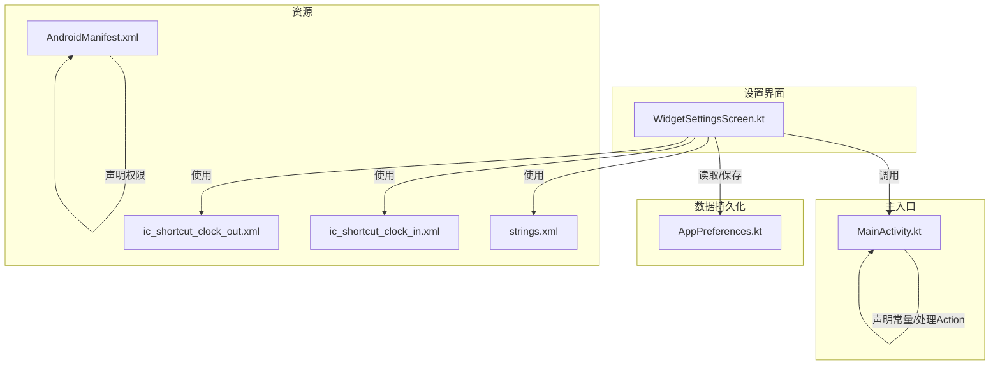
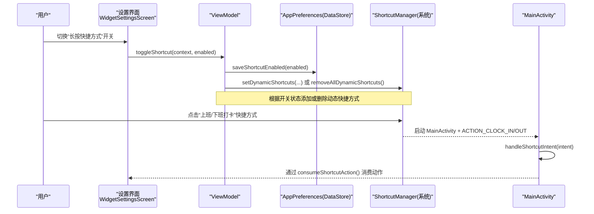
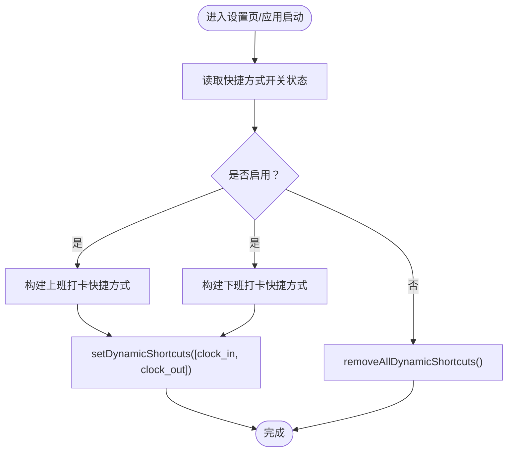
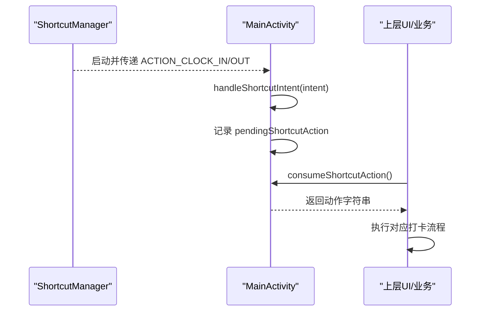
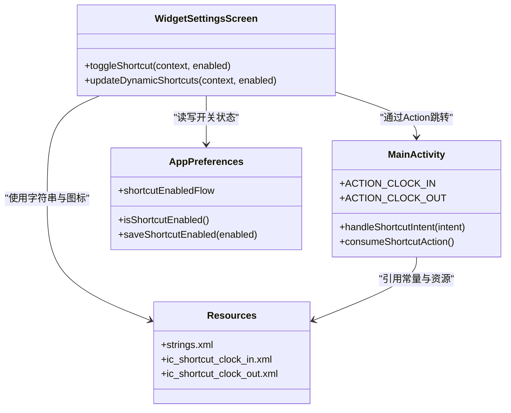

# 快捷方式配置

<cite>
**本文引用的文件**   
- [WidgetSettingsScreen.kt](file://app/src/main/java/com/schedulecalendar/app/ui/settings/WidgetSettingsScreen.kt)
- [MainActivity.kt](file://app/src/main/java/com/schedulecalendar/app/MainActivity.kt)
- [AppPreferences.kt](file://app/src/main/java/com/schedulecalendar/app/data/prefs/AppPreferences.kt)
- [strings.xml](file://app/src/main/res/values/strings.xml)
- [ic_shortcut_clock_in.xml](file://app/src/main/res/drawable/ic_shortcut_clock_in.xml)
- [ic_shortcut_clock_out.xml](file://app/src/main/res/drawable/ic_shortcut_clock_out.xml)
- [AndroidManifest.xml](file://app/src/main/AndroidManifest.xml)
</cite>

## 目录
1. [简介](#简介)
2. [项目结构](#项目结构)
3. [核心组件](#核心组件)
4. [架构总览](#架构总览)
5. [详细组件分析](#详细组件分析)
6. [依赖关系分析](#依赖关系分析)
7. [性能与兼容性](#性能与兼容性)
8. [故障排查指南](#故障排查指南)
9. [结论](#结论)
10. [附录：最佳实践与测试建议](#附录最佳实践与测试建议)

## 简介
本文件围绕“动态快捷方式”在应用中的完整实现进行说明，重点覆盖以下方面：
- 动态快捷方式的创建、更新与删除流程
- 打卡快捷方式（上班打卡、下班打卡）的快速访问能力
- 图标设计、标签文案与点击行为处理
- Android 版本差异与兼容性策略
- 权限要求、用户交互流程与错误处理机制
- 最佳实践、用户体验优化与测试方法

## 项目结构
与快捷方式相关的代码主要分布在设置界面、主入口 Activity 以及偏好存储中；资源包括字符串与矢量图标。

图表来源
- [WidgetSettingsScreen.kt:200-236](file://app/src/main/java/com/schedulecalendar/app/ui/settings/WidgetSettingsScreen.kt#L200-L236)
- [MainActivity.kt:38-48](file://app/src/main/java/com/schedulecalendar/app/MainActivity.kt#L38-L48)
- [AppPreferences.kt:279-288](file://app/src/main/java/com/schedulecalendar/app/data/prefs/AppPreferences.kt#L279-L288)
- [strings.xml:9-12](file://app/src/main/res/values/strings.xml#L9-L12)
- [ic_shortcut_clock_in.xml:1-15](file://app/src/main/res/drawable/ic_shortcut_clock_in.xml#L1-L15)
- [ic_shortcut_clock_out.xml:1-15](file://app/src/main/res/drawable/ic_shortcut_clock_out.xml#L1-L15)
- [AndroidManifest.xml:1-22](file://app/src/main/AndroidManifest.xml#L1-L22)

章节来源
- [WidgetSettingsScreen.kt:1-239](file://app/src/main/java/com/schedulecalendar/app/ui/settings/WidgetSettingsScreen.kt#L1-L239)
- [MainActivity.kt:1-322](file://app/src/main/java/com/schedulecalendar/app/MainActivity.kt#L1-L322)
- [AppPreferences.kt:270-313](file://app/src/main/java/com/schedulecalendar/app/data/prefs/AppPreferences.kt#L270-L313)
- [strings.xml:1-13](file://app/src/main/res/values/strings.xml#L1-L13)
- [ic_shortcut_clock_in.xml:1-15](file://app/src/main/res/drawable/ic_shortcut_clock_in.xml#L1-L15)
- [ic_shortcut_clock_out.xml:1-15](file://app/src/main/res/drawable/ic_shortcut_clock_out.xml#L1-L15)
- [AndroidManifest.xml:1-22](file://app/src/main/AndroidManifest.xml#L1-L22)

## 核心组件
- 设置界面与 ViewModel：负责开关控制、持久化与动态快捷方式的增删
- 主 Activity：负责解析来自快捷方式的 Intent 并分发到具体业务逻辑
- 偏好存储：以 DataStore 保存“长按快捷方式”开关状态
- 资源：字符串与矢量图标用于快捷方式展示

章节来源
- [WidgetSettingsScreen.kt:184-238](file://app/src/main/java/com/schedulecalendar/app/ui/settings/WidgetSettingsScreen.kt#L184-L238)
- [MainActivity.kt:38-48](file://app/src/main/java/com/schedulecalendar/app/MainActivity.kt#L38-L48)
- [AppPreferences.kt:279-288](file://app/src/main/java/com/schedulecalendar/app/data/prefs/AppPreferences.kt#L279-L288)

## 架构总览
下图展示了从用户操作到系统级快捷方式更新的完整链路，以及点击后的意图分发流程。

图表来源
- [WidgetSettingsScreen.kt:200-236](file://app/src/main/java/com/schedulecalendar/app/ui/settings/WidgetSettingsScreen.kt#L200-L236)
- [MainActivity.kt:229-249](file://app/src/main/java/com/schedulecalendar/app/MainActivity.kt#L229-L249)
- [AppPreferences.kt:283-285](file://app/src/main/java/com/schedulecalendar/app/data/prefs/AppPreferences.kt#L283-L285)

## 详细组件分析

### 动态快捷方式：创建、更新与删除
- 创建/更新：当开关为开启时，构建两个 ShortcutInfo（上班打卡、下班打卡），分别绑定对应的 Action 与图标，并通过 ShortcutManager.setDynamicShortcuts 一次性设置。
- 删除：当开关关闭时，调用 removeAllDynamicShortcuts 清空所有动态快捷方式。
- 触发时机：
  - 设置页切换开关时立即生效
  - 应用启动时若已启用，则自动恢复动态快捷方式

图表来源
- [WidgetSettingsScreen.kt:209-236](file://app/src/main/java/com/schedulecalendar/app/ui/settings/WidgetSettingsScreen.kt#L209-L236)
- [MainActivity.kt:161-165](file://app/src/main/java/com/schedulecalendar/app/MainActivity.kt#L161-L165)

章节来源
- [WidgetSettingsScreen.kt:200-236](file://app/src/main/java/com/schedulecalendar/app/ui/settings/WidgetSettingsScreen.kt#L200-L236)
- [MainActivity.kt:161-165](file://app/src/main/java/com/schedulecalendar/app/MainActivity.kt#L161-L165)

### 打卡快捷方式：快速访问功能
- 上班打卡：快捷方式 Action 为自定义常量，点击后由 MainActivity 识别并标记待处理动作，后续由上层逻辑消费执行打卡。
- 下班打卡：同理，使用另一个自定义 Action。
- 意图标志：使用 NEW_TASK 与 CLEAR_TASK 确保从桌面快捷方式进入时能正确重建任务栈。

章节来源
- [MainActivity.kt:38-48](file://app/src/main/java/com/schedulecalendar/app/MainActivity.kt#L38-L48)
- [MainActivity.kt:234-249](file://app/src/main/java/com/schedulecalendar/app/MainActivity.kt#L234-L249)
- [WidgetSettingsScreen.kt:213-220](file://app/src/main/java/com/schedulecalendar/app/ui/settings/WidgetSettingsScreen.kt#L213-L220)

### 图标设计与标签配置
- 图标：
  - 上班打卡：绿色圆形背景 + 向右箭头（表示进入/开始）
  - 下班打卡：橙色圆形背景 + 向右退出箭头（表示离开/结束）
- 标签：
  - 短标签分别为“上班打卡”“下班打卡”，来源于 strings.xml
- 资源位置：
  - 矢量图标位于 res/drawable
  - 字符串位于 res/values/strings.xml

章节来源
- [ic_shortcut_clock_in.xml:1-15](file://app/src/main/res/drawable/ic_shortcut_clock_in.xml#L1-L15)
- [ic_shortcut_clock_out.xml:1-15](file://app/src/main/res/drawable/ic_shortcut_clock_out.xml#L1-L15)
- [strings.xml:9-12](file://app/src/main/res/values/strings.xml#L9-L12)
- [WidgetSettingsScreen.kt:221-230](file://app/src/main/java/com/schedulecalendar/app/ui/settings/WidgetSettingsScreen.kt#L221-L230)

### 点击行为处理流程
- MainActivity 在 onCreate/onNewIntent 中解析 Intent，识别 ACTION_CLOCK_IN/ACTION_CLOCK_OUT，并将动作暂存至 pendingShortcutAction。
- 上层 UI 通过 consumeShortcutAction() 获取并消费该动作，随后执行相应打卡逻辑。
- 同时支持携带日期参数导航（EXTRA_NAVIGATE_DATE），便于从快捷方式跳转到指定日期页面。

图表来源
- [MainActivity.kt:229-249](file://app/src/main/java/com/schedulecalendar/app/MainActivity.kt#L229-L249)
- [MainActivity.kt:251-261](file://app/src/main/java/com/schedulecalendar/app/MainActivity.kt#L251-L261)

章节来源
- [MainActivity.kt:229-261](file://app/src/main/java/com/schedulecalendar/app/MainActivity.kt#L229-L261)

### 不同 Android 版本的兼容性与支持差异
- 动态快捷方式 API：
  - 使用 ShortcutManager 的 setDynamicShortcuts/removeAllDynamicShortcuts
  - 当前实现未显式做版本分支判断，但使用了 try-catch 包裹异常，避免崩溃
- 返回键处理（API 34+）：
  - 使用 OnBackInvokedDispatcher 的 overlay 回调，保证在 Tab 一级页面按返回键直接退出任务栈
- 通知权限（Android 13+）：
  - 首次启动弹窗引导申请 POST_NOTIFICATIONS 等权限

章节来源
- [WidgetSettingsScreen.kt:209-236](file://app/src/main/java/com/schedulecalendar/app/ui/settings/WidgetSettingsScreen.kt#L209-L236)
- [MainActivity.kt:85-124](file://app/src/main/java/com/schedulecalendar/app/MainActivity.kt#L85-L124)
- [MainActivity.kt:176-214](file://app/src/main/java/com/schedulecalendar/app/MainActivity.kt#L176-L214)

### 权限要求
- 清单权限：
  - 通知、日历读写、精确闹钟、开机广播、账户认证等
- 运行时权限：
  - 首次启动弹窗引导申请日历与通知权限
- 快捷方式本身不额外需要特殊权限，但相关功能（如通知、日历写入）需具备相应权限

章节来源
- [AndroidManifest.xml:1-22](file://app/src/main/AndroidManifest.xml#L1-L22)
- [MainActivity.kt:176-214](file://app/src/main/java/com/schedulecalendar/app/MainActivity.kt#L176-L214)

### 用户交互流程
- 设置页：
  - “长按快捷方式”开关控制动态快捷方式的显示与否
  - 切换后立即生效（新增或删除）
- 桌面快捷方式：
  - 点击后直接进入应用并标记待处理动作
  - 上层 UI 消费动作并执行打卡流程

章节来源
- [WidgetSettingsScreen.kt:86-123](file://app/src/main/java/com/schedulecalendar/app/ui/settings/WidgetSettingsScreen.kt#L86-L123)
- [MainActivity.kt:229-249](file://app/src/main/java/com/schedulecalendar/app/MainActivity.kt#L229-L249)

### 错误处理机制
- 快捷方式更新：
  - 使用 try-catch 捕获异常，避免影响主流程
- 权限申请：
  - 提供“稍后再说”选项，允许用户延迟授权
- 返回键处理：
  - 多版本兜底方案，确保在不同 API 下均有合理行为

章节来源
- [WidgetSettingsScreen.kt:209-236](file://app/src/main/java/com/schedulecalendar/app/ui/settings/WidgetSettingsScreen.kt#L209-L236)
- [MainActivity.kt:176-214](file://app/src/main/java/com/schedulecalendar/app/MainActivity.kt#L176-L214)
- [MainActivity.kt:85-124](file://app/src/main/java/com/schedulecalendar/app/MainActivity.kt#L85-L124)

## 依赖关系分析
- WidgetSettingsScreen 依赖 AppPreferences 进行状态持久化，并依赖系统 ShortcutManager 管理动态快捷方式
- MainActivity 依赖自定义 Action 常量与 Intent 参数解析，向上层暴露消费接口
- 资源文件为 UI 展示提供必要素材

图表来源
- [WidgetSettingsScreen.kt:200-236](file://app/src/main/java/com/schedulecalendar/app/ui/settings/WidgetSettingsScreen.kt#L200-L236)
- [MainActivity.kt:38-48](file://app/src/main/java/com/schedulecalendar/app/MainActivity.kt#L38-L48)
- [AppPreferences.kt:279-288](file://app/src/main/java/com/schedulecalendar/app/data/prefs/AppPreferences.kt#L279-L288)
- [strings.xml:9-12](file://app/src/main/res/values/strings.xml#L9-L12)
- [ic_shortcut_clock_in.xml:1-15](file://app/src/main/res/drawable/ic_shortcut_clock_in.xml#L1-L15)
- [ic_shortcut_clock_out.xml:1-15](file://app/src/main/res/drawable/ic_shortcut_clock_out.xml#L1-L15)

章节来源
- [WidgetSettingsScreen.kt:184-238](file://app/src/main/java/com/schedulecalendar/app/ui/settings/WidgetSettingsScreen.kt#L184-L238)
- [MainActivity.kt:38-48](file://app/src/main/java/com/schedulecalendar/app/MainActivity.kt#L38-L48)
- [AppPreferences.kt:279-288](file://app/src/main/java/com/schedulecalendar/app/data/prefs/AppPreferences.kt#L279-L288)

## 性能与兼容性
- 性能：
  - 动态快捷方式批量设置，减少系统调用次数
  - 使用 Flow 监听偏好变化，避免频繁轮询
- 兼容性：
  - 对旧设备使用 try-catch 保护，避免崩溃
  - 针对 API 34+ 的返回键处理采用 overlay 回调，提升一致性
  - 通知权限在 Android 13+ 单独处理

章节来源
- [WidgetSettingsScreen.kt:209-236](file://app/src/main/java/com/schedulecalendar/app/ui/settings/WidgetSettingsScreen.kt#L209-L236)
- [MainActivity.kt:85-124](file://app/src/main/java/com/schedulecalendar/app/MainActivity.kt#L85-L124)
- [MainActivity.kt:176-214](file://app/src/main/java/com/schedulecalendar/app/MainActivity.kt#L176-L214)

## 故障排查指南
- 快捷方式不显示：
  - 检查“长按快捷方式”开关是否开启
  - 确认应用启动时是否调用了 updateDynamicShortcuts
- 点击无响应：
  - 检查 MainActivity 是否正确解析 ACTION_CLOCK_IN/ACTION_CLOCK_OUT
  - 确认上层是否消费了 consumeShortcutAction()
- 权限问题：
  - 检查首次启动弹窗是否引导申请必要权限
  - 确认清单中已声明所需权限

章节来源
- [WidgetSettingsScreen.kt:200-236](file://app/src/main/java/com/schedulecalendar/app/ui/settings/WidgetSettingsScreen.kt#L200-L236)
- [MainActivity.kt:229-249](file://app/src/main/java/com/schedulecalendar/app/MainActivity.kt#L229-L249)
- [AndroidManifest.xml:1-22](file://app/src/main/AndroidManifest.xml#L1-L22)

## 结论
本项目通过设置界面开关控制动态快捷方式的创建与删除，结合主 Activity 的意图解析实现了“上班/下班打卡”的快速访问。整体实现简洁可靠，具备基本的兼容性处理与错误防护。建议在后续迭代中进一步完善版本分支判断与更细粒度的错误提示，以提升用户体验与可维护性。

## 附录：最佳实践与测试建议
- 最佳实践
  - 将动态快捷方式与用户偏好解耦，通过 Flow 驱动 UI 与系统同步
  - 使用统一的 Action 常量与清晰的 Intent 参数约定，降低耦合
  - 图标与文案集中管理，便于国际化与主题适配
- 用户体验优化
  - 在首次启动时明确告知权限用途，并提供“稍后再说”选项
  - 针对不同 API 级别提供一致的返回键行为
- 测试方法
  - 单元测试：验证偏好读写与 Flow 状态流转
  - 集成测试：模拟点击桌面快捷方式，校验 MainActivity 的动作解析与上层消费
  - 兼容性测试：覆盖 Android 13+ 的通知权限与 API 34+ 的返回键处理

[本节为通用指导，不直接分析具体文件]