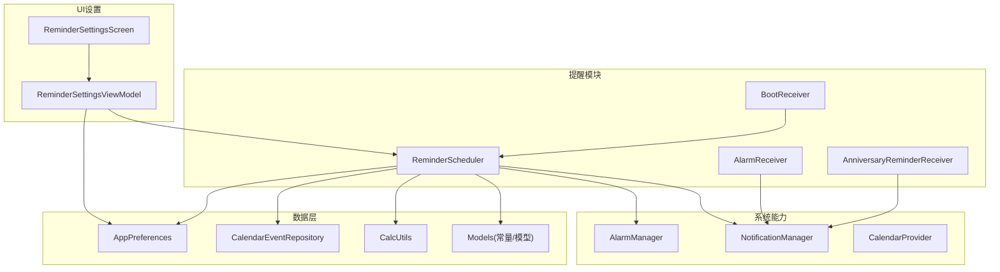
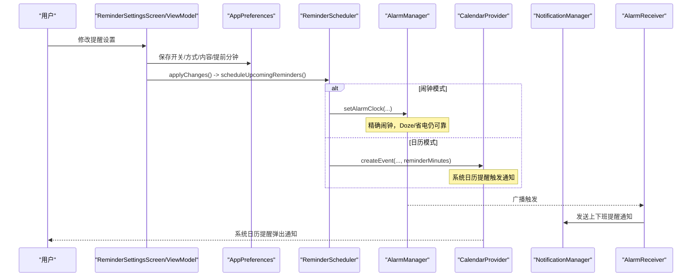
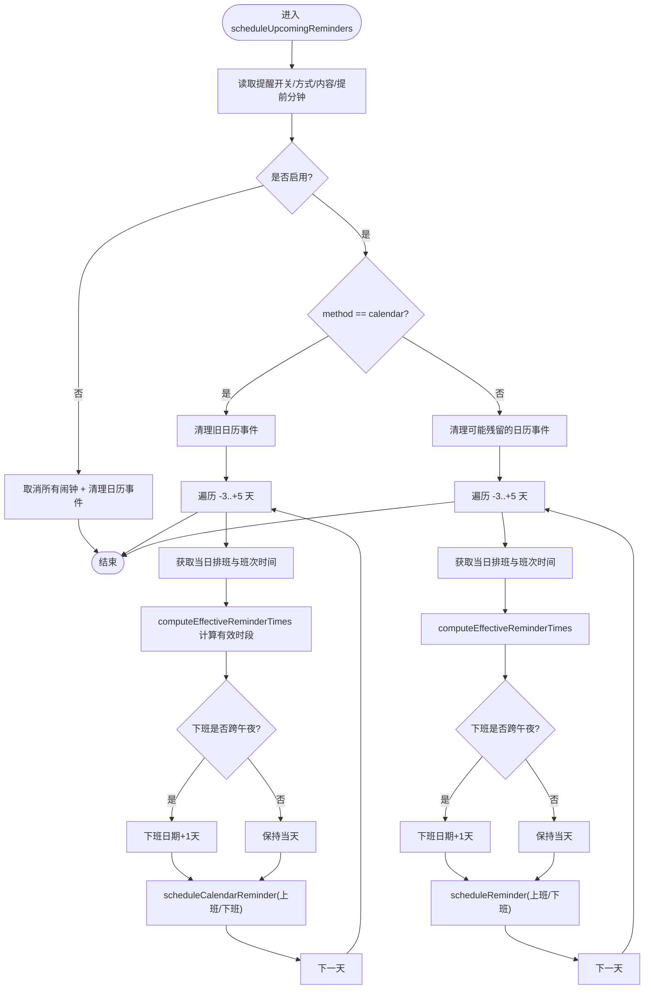
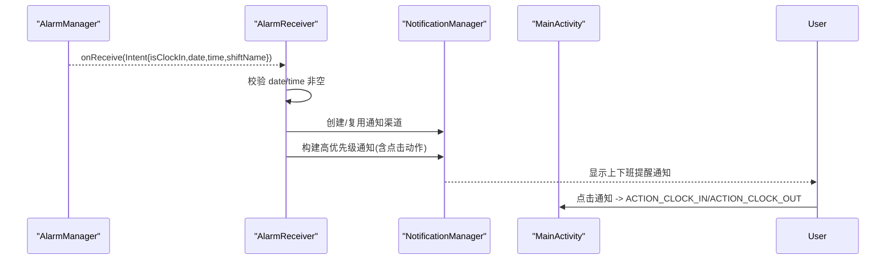
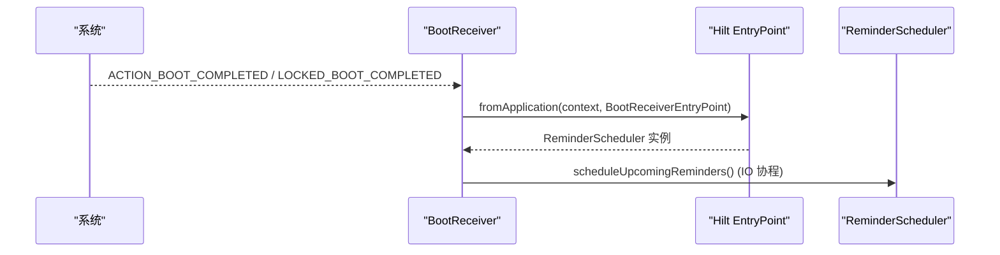
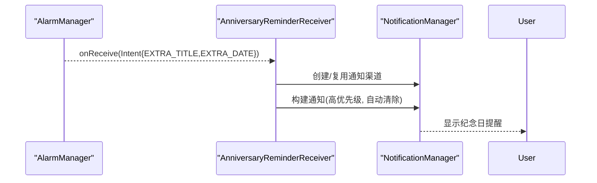
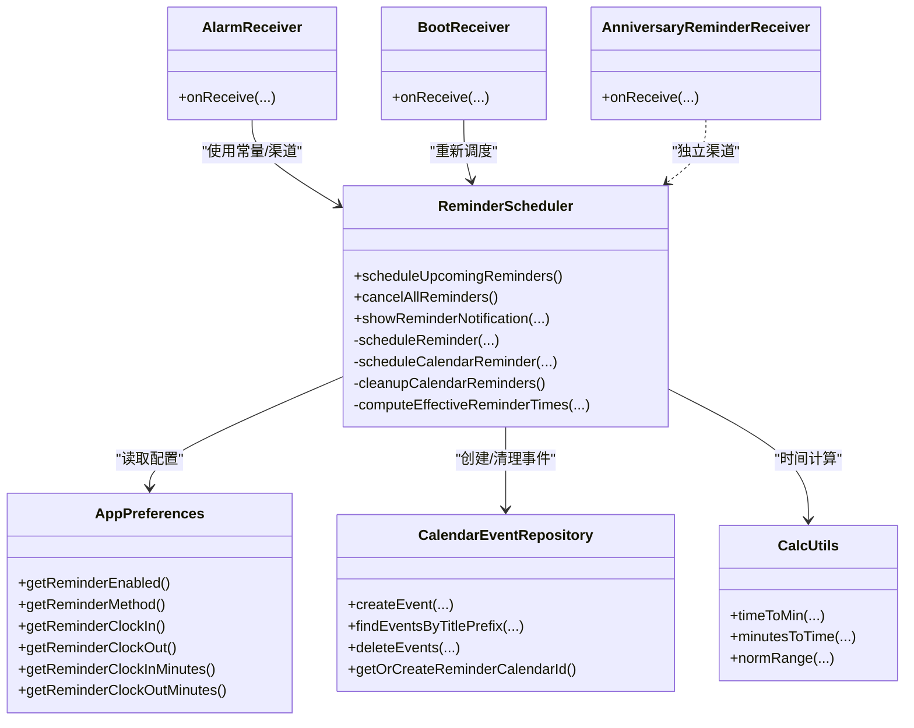

# 提醒调度系统

<cite>
**本文引用的文件**   
- [ReminderScheduler.kt](file://app/src/main/java/com/schedulecalendar/app/reminder/ReminderScheduler.kt)
- [AlarmReceiver.kt](file://app/src/main/java/com/schedulecalendar/app/reminder/AlarmReceiver.kt)
- [BootReceiver.kt](file://app/src/main/java/com/schedulecalendar/app/reminder/BootReceiver.kt)
- [AnniversaryReminderReceiver.kt](file://app/src/main/java/com/schedulecalendar/app/reminder/AnniversaryReminderReceiver.kt)
- [AppPreferences.kt](file://app/src/main/java/com/schedulecalendar/app/data/prefs/AppPreferences.kt)
- [CalendarEventRepository.kt](file://app/src/main/java/com/schedulecalendar/app/data/calendar/CalendarEventRepository.kt)
- [CalcUtils.kt](file://app/src/main/java/com/schedulecalendar/app/domain/model/CalcUtils.kt)
- [Models.kt](file://app/src/main/java/com/schedulecalendar/app/domain/model/Models.kt)
- [ReminderSettingsScreen.kt](file://app/src/main/java/com/schedulecalendar/app/ui/settings/ReminderSettingsScreen.kt)
- [ReminderSettingsViewModel.kt](file://app/src/main/java/com/schedulecalendar/app/ui/settings/ReminderSettingsViewModel.kt)
- [AndroidManifest.xml](file://app/src/main/AndroidManifest.xml)
</cite>

## 目录
1. [简介](#简介)
2. [项目结构](#项目结构)
3. [核心组件](#核心组件)
4. [架构总览](#架构总览)
5. [详细组件分析](#详细组件分析)
6. [依赖关系分析](#依赖关系分析)
7. [性能与可靠性](#性能与可靠性)
8. [配置选项说明](#配置选项说明)
9. [调试与故障排除](#调试与故障排除)
10. [结论](#结论)

## 简介
本文件面向提醒调度系统的实现与使用，重点覆盖以下目标：
- 深入解释 ReminderScheduler 的实现，包括闹钟提醒与日历事件提醒两种方式的切换逻辑。
- 详细说明 AlarmReceiver 的处理流程，涵盖打卡上班/下班等通知的展示与交互。
- 解释 BootReceiver 的开机自启动机制，确保设备重启后提醒服务能自动恢复。
- 说明 AnniversaryReminderReceiver 对纪念日提醒的特殊处理。
- 阐述提醒时间的计算、重复提醒的配置与提醒状态的同步策略。
- 提供提醒系统的配置项、调试方法与故障排除指南。

## 项目结构
提醒调度系统位于 reminder 包中，配合数据层（偏好设置、日历仓库）与 UI 设置页共同完成“配置—调度—触发—通知”的闭环。

图表来源
- [ReminderScheduler.kt:101-203](file://app/src/main/java/com/schedulecalendar/app/reminder/ReminderScheduler.kt#L101-L203)
- [AlarmReceiver.kt:19-62](file://app/src/main/java/com/schedulecalendar/app/reminder/AlarmReceiver.kt#L19-L62)
- [BootReceiver.kt:31-44](file://app/src/main/java/com/schedulecalendar/app/reminder/BootReceiver.kt#L31-L44)
- [AnniversaryReminderReceiver.kt:24-41](file://app/src/main/java/com/schedulecalendar/app/reminder/AnniversaryReminderReceiver.kt#L24-L41)
- [AppPreferences.kt:202-248](file://app/src/main/java/com/schedulecalendar/app/data/prefs/AppPreferences.kt#L202-L248)
- [CalendarEventRepository.kt:283-337](file://app/src/main/java/com/schedulecalendar/app/data/calendar/CalendarEventRepository.kt#L283-L337)
- [CalcUtils.kt:21-34](file://app/src/main/java/com/schedulecalendar/app/domain/model/CalcUtils.kt#L21-L34)
- [ReminderSettingsScreen.kt:35-76](file://app/src/main/java/com/schedulecalendar/app/ui/settings/ReminderSettingsScreen.kt#L35-L76)
- [ReminderSettingsViewModel.kt:43-76](file://app/src/main/java/com/schedulecalendar/app/ui/settings/ReminderSettingsViewModel.kt#L43-L76)

章节来源
- [ReminderScheduler.kt:101-203](file://app/src/main/java/com/schedulecalendar/app/reminder/ReminderScheduler.kt#L101-L203)
- [AndroidManifest.xml:92-110](file://app/src/main/AndroidManifest.xml#L92-L110)

## 核心组件
- ReminderScheduler：负责读取用户设置与排班数据，计算提醒时间，按模式（闹钟/日历）注册提醒或创建日历事件；同时提供通知显示与清理逻辑。
- AlarmReceiver：接收闹钟广播，构建并发送上下班提醒通知，点击可跳转应用执行对应动作。
- BootReceiver：监听开机广播，通过 Hilt EntryPoint 获取 ReminderScheduler 单例，重新调度未来多天的提醒。
- AnniversaryReminderReceiver：纪念日提醒专用接收器，独立通知渠道与 ID 策略。
- AppPreferences：集中管理提醒开关、方式、内容、提前分钟数等配置。
- CalendarEventRepository：封装系统日历 Provider 操作，支持创建/查询/删除事件与扩展属性，兼容国产 ROM。
- CalcUtils：时间工具类，提供 HH:mm 与分钟转换、跨天归一化等，用于提醒时间与有效时段计算。
- Models：内置班次/状态常量与领域模型，支撑提醒时间调整与过滤。

章节来源
- [ReminderScheduler.kt:28-65](file://app/src/main/java/com/schedulecalendar/app/reminder/ReminderScheduler.kt#L28-L65)
- [AppPreferences.kt:202-248](file://app/src/main/java/com/schedulecalendar/app/data/prefs/AppPreferences.kt#L202-L248)
- [CalendarEventRepository.kt:283-337](file://app/src/main/java/com/schedulecalendar/app/data/calendar/CalendarEventRepository.kt#L283-L337)
- [CalcUtils.kt:21-34](file://app/src/main/java/com/schedulecalendar/app/domain/model/CalcUtils.kt#L21-L34)
- [Models.kt:5-11](file://app/src/main/java/com/schedulecalendar/app/domain/model/Models.kt#L5-L11)

## 架构总览
提醒调度系统采用“配置驱动 + 双通道触发”的架构：
- 配置层：ReminderSettingsScreen/ViewModel 读写 AppPreferences。
- 调度层：ReminderScheduler 根据 method 选择 AlarmManager 或 CalendarProvider。
- 触发层：AlarmReceiver 与系统日历提醒分别负责通知展示。
- 持久化与资源：AppPreferences 存储配置，CalendarEventRepository 管理日历事件。

图表来源
- [ReminderSettingsViewModel.kt:161-175](file://app/src/main/java/com/schedulecalendar/app/ui/settings/ReminderSettingsViewModel.kt#L161-L175)
- [ReminderScheduler.kt:101-203](file://app/src/main/java/com/schedulecalendar/app/reminder/ReminderScheduler.kt#L101-L203)
- [AlarmReceiver.kt:19-62](file://app/src/main/java/com/schedulecalendar/app/reminder/AlarmReceiver.kt#L19-L62)
- [CalendarEventRepository.kt:283-337](file://app/src/main/java/com/schedulecalendar/app/data/calendar/CalendarEventRepository.kt#L283-L337)

## 详细组件分析

### ReminderScheduler 分析与流程
- 功能要点
  - 支持两种提醒方式："alarm"（AlarmManager.setAlarmClock）与 "calendar"（系统日历事件+提醒）。
  - 默认窗口为前 3 天到后 5 天，避免污染系统日历。
  - 支持跨午夜下班提醒日期顺延。
  - 支持内置请假/调休状态的时间段扣除，动态计算有效提醒时段。
  - 统一通知渠道与高优先级通知。

- 关键流程
  - scheduleUpcomingReminders：读取配置与排班，按方法分支调用 scheduleReminder 或 scheduleCalendarReminder。
  - computeEffectiveReminderTimes：基于 AppliedStatus 与 CalcUtils 计算有效工作段，返回最终上下班提醒时间。
  - scheduleReminder：校验权限、计算触发时间、构造 PendingIntent、setAlarmClock。
  - scheduleCalendarReminder：去重检查、创建事件、设置 Reminders 与 ExtendedProperties。
  - cleanupCalendarReminders / forceCleanupCalendarReminders：按标题前缀批量删除旧事件。
  - showReminderNotification：构建通知并展示，点击跳转 MainActivity 执行打卡动作。

图表来源
- [ReminderScheduler.kt:101-203](file://app/src/main/java/com/schedulecalendar/app/reminder/ReminderScheduler.kt#L101-L203)
- [ReminderScheduler.kt:244-287](file://app/src/main/java/com/schedulecalendar/app/reminder/ReminderScheduler.kt#L244-L287)
- [ReminderScheduler.kt:301-353](file://app/src/main/java/com/schedulecalendar/app/reminder/ReminderScheduler.kt#L301-L353)
- [ReminderScheduler.kt:385-430](file://app/src/main/java/com/schedulecalendar/app/reminder/ReminderScheduler.kt#L385-L430)
- [ReminderScheduler.kt:439-456](file://app/src/main/java/com/schedulecalendar/app/reminder/ReminderScheduler.kt#L439-L456)

章节来源
- [ReminderScheduler.kt:101-203](file://app/src/main/java/com/schedulecalendar/app/reminder/ReminderScheduler.kt#L101-L203)
- [ReminderScheduler.kt:244-287](file://app/src/main/java/com/schedulecalendar/app/reminder/ReminderScheduler.kt#L244-L287)
- [ReminderScheduler.kt:301-353](file://app/src/main/java/com/schedulecalendar/app/reminder/ReminderScheduler.kt#L301-L353)
- [ReminderScheduler.kt:385-430](file://app/src/main/java/com/schedulecalendar/app/reminder/ReminderScheduler.kt#L385-L430)
- [ReminderScheduler.kt:439-456](file://app/src/main/java/com/schedulecalendar/app/reminder/ReminderScheduler.kt#L439-L456)

### AlarmReceiver 处理流程
- 职责：解析广播参数，构建通知并展示；点击通知打开应用并执行对应打卡动作。
- 关键点：
  - 从 Intent 提取 isClockIn、date、time、shiftName。
  - 确保通知渠道存在（兼容性保障）。
  - 使用高优先级通知与自动清除。
  - 点击 PendingIntent 跳转到 MainActivity 并携带 ACTION_CLOCK_IN/ACTION_CLOCK_OUT。

图表来源
- [AlarmReceiver.kt:19-62](file://app/src/main/java/com/schedulecalendar/app/reminder/AlarmReceiver.kt#L19-L62)
- [AndroidManifest.xml:35-40](file://app/src/main/AndroidManifest.xml#L35-L40)

章节来源
- [AlarmReceiver.kt:19-62](file://app/src/main/java/com/schedulecalendar/app/reminder/AlarmReceiver.kt#L19-L62)

### BootReceiver 开机自启动机制
- 职责：监听 BOOT_COMPLETED/LOCKED_BOOT_COMPLETED，通过 Hilt EntryPoint 获取 ReminderScheduler，在 IO 协程中重新调度未来 7 天的提醒。
- 关键点：
  - BroadcastReceiver 无法直接注入依赖，使用 @EntryPoint 暴露 ReminderScheduler。
  - 使用 Dispatchers.IO 执行调度，避免阻塞主线程。

图表来源
- [BootReceiver.kt:23-44](file://app/src/main/java/com/schedulecalendar/app/reminder/BootReceiver.kt#L23-L44)

章节来源
- [BootReceiver.kt:31-44](file://app/src/main/java/com/schedulecalendar/app/reminder/BootReceiver.kt#L31-L44)

### AnniversaryReminderReceiver 纪念日提醒
- 职责：接收纪念日提醒广播，展示独立通知渠道的通知。
- 关键点：
  - 独立 CHANNEL_ID 与 BASE_NOTIFICATION_ID。
  - 通知标题来自 EXTRA_TITLE，日期来自 EXTRA_DATE。
  - 通知 ID 基于标题哈希取模，避免冲突。

图表来源
- [AnniversaryReminderReceiver.kt:14-41](file://app/src/main/java/com/schedulecalendar/app/reminder/AnniversaryReminderReceiver.kt#L14-L41)

章节来源
- [AnniversaryReminderReceiver.kt:24-41](file://app/src/main/java/com/schedulecalendar/app/reminder/AnniversaryReminderReceiver.kt#L24-L41)

### 提醒时间计算与重复提醒配置
- 时间计算
  - 基础：HH:mm 与分钟互转、跨天归一化（CalcUtils.timeToMin/minutesToTime/normRange）。
  - 生效时段：内置请假/调休状态时间段扣除，取最长有效段作为提醒时间（computeEffectiveReminderTimes）。
  - 跨午夜：下班时间早于上班时间时，将下班日期延后一天。
- 重复提醒
  - 闹钟模式：通过 setAlarmClock 精确触发，无需重复规则。
  - 日历模式：通过 CalendarProvider 创建事件与 Reminders，支持 rrule（当前提醒场景未使用），由系统日历负责重复触发。

章节来源
- [CalcUtils.kt:21-34](file://app/src/main/java/com/schedulecalendar/app/domain/model/CalcUtils.kt#L21-L34)
- [ReminderScheduler.kt:244-287](file://app/src/main/java/com/schedulecalendar/app/reminder/ReminderScheduler.kt#L244-L287)
- [CalendarEventRepository.kt:283-337](file://app/src/main/java/com/schedulecalendar/app/data/calendar/CalendarEventRepository.kt#L283-L337)

### 提醒状态同步
- 配置变更：ReminderSettingsViewModel.applyChanges 根据当前设置执行一次调度（关闭则取消全部，闹钟模式清理日历事件再调度，日历模式直接调度）。
- 开机恢复：BootReceiver 在开机后重新调度，保证与最新配置一致。
- 日历事件清理：forceCleanupCalendarReminders 按标题前缀批量删除，避免旧事件残留。

章节来源
- [ReminderSettingsViewModel.kt:161-175](file://app/src/main/java/com/schedulecalendar/app/ui/settings/ReminderSettingsViewModel.kt#L161-L175)
- [BootReceiver.kt:31-44](file://app/src/main/java/com/schedulecalendar/app/reminder/BootReceiver.kt#L31-L44)
- [ReminderScheduler.kt:439-456](file://app/src/main/java/com/schedulecalendar/app/reminder/ReminderScheduler.kt#L439-L456)

## 依赖关系分析
- 组件耦合
  - ReminderScheduler 依赖 AppPreferences（配置）、ScheduleRepository/ShiftRepository（排班数据）、CalendarEventRepository（日历事件）、CalcUtils（时间计算）。
  - AlarmReceiver 仅依赖 NotificationManager 与 MainActivity 动作。
  - BootReceiver 通过 Hilt EntryPoint 解耦 ReminderScheduler 注入。
  - AnniversaryReminderReceiver 独立运行，不依赖其他业务组件。
- 外部依赖
  - Android 系统：AlarmManager、NotificationManager、CalendarProvider、AccountManager。
  - 权限：POST_NOTIFICATIONS、USE_EXACT_ALARM、READ/WRITE_CALENDAR、RECEIVE_BOOT_COMPLETED。

图表来源
- [ReminderScheduler.kt:101-203](file://app/src/main/java/com/schedulecalendar/app/reminder/ReminderScheduler.kt#L101-L203)
- [AlarmReceiver.kt:19-62](file://app/src/main/java/com/schedulecalendar/app/reminder/AlarmReceiver.kt#L19-L62)
- [BootReceiver.kt:31-44](file://app/src/main/java/com/schedulecalendar/app/reminder/BootReceiver.kt#L31-L44)
- [AnniversaryReminderReceiver.kt:24-41](file://app/src/main/java/com/schedulecalendar/app/reminder/AnniversaryReminderReceiver.kt#L24-L41)
- [AppPreferences.kt:202-248](file://app/src/main/java/com/schedulecalendar/app/data/prefs/AppPreferences.kt#L202-L248)
- [CalendarEventRepository.kt:283-337](file://app/src/main/java/com/schedulecalendar/app/data/calendar/CalendarEventRepository.kt#L283-L337)
- [CalcUtils.kt:21-34](file://app/src/main/java/com/schedulecalendar/app/domain/model/CalcUtils.kt#L21-L34)

章节来源
- [ReminderScheduler.kt:101-203](file://app/src/main/java/com/schedulecalendar/app/reminder/ReminderScheduler.kt#L101-L203)
- [AndroidManifest.xml:92-110](file://app/src/main/AndroidManifest.xml#L92-L110)

## 性能与可靠性
- 可靠性
  - 闹钟模式使用 setAlarmClock，被视为用户闹钟，能在 Doze/省电模式下准时触发。
  - 日历模式利用系统日历提醒，兼容性强，但受系统日历应用行为影响。
- 性能
  - 窗口限制（-3..+5 天）控制事件数量，减少系统负担。
  - 日历事件去重（日期+标题匹配）避免重复创建。
  - 批量清理（按标题前缀）降低维护成本。
- 权限与兼容性
  - USE_EXACT_ALARM 安装即授权，满足精确闹钟需求。
  - 国产 ROM 通过 ExtendedProperties 设置 need_alarm 标志提升兼容性。

[本节为通用指导，不直接分析具体文件]

## 配置选项说明
- 提醒总开关：enabled（布尔）
- 提醒方式：method（"alarm" 或 "calendar"）
- 提醒内容：clock_in/clock_out（布尔）
- 提前提醒分钟：clock_in_minutes/clock_out_minutes（整数）
- 日历账户分类与禁用列表：account_categories/disabled_account_ids（字符串/集合）
- 首次权限申请标记：initial_permissions_done（布尔）
- 快捷方式开关：shortcut_enabled（布尔）

章节来源
- [AppPreferences.kt:202-248](file://app/src/main/java/com/schedulecalendar/app/data/prefs/AppPreferences.kt#L202-L248)
- [ReminderSettingsScreen.kt:127-168](file://app/src/main/java/com/schedulecalendar/app/ui/settings/ReminderSettingsScreen.kt#L127-L168)
- [ReminderSettingsViewModel.kt:86-116](file://app/src/main/java/com/schedulecalendar/app/ui/settings/ReminderSettingsViewModel.kt#L86-L116)

## 调试与故障排除
- 常见问题
  - 无通知：检查 POST_NOTIFICATIONS 权限与通知渠道是否存在。
  - 闹钟不触发：确认 USE_EXACT_ALARM 权限可用（canScheduleExactAlarms），并确保 setAlarmClock 成功。
  - 日历提醒无效：检查 READ/WRITE_CALENDAR 权限，确认已创建提醒专用日历且事件包含 Reminders 与 ExtendedProperties。
  - 开机后无提醒：确认 BootReceiver 已注册并收到 BOOT_COMPLETED/LOCKED_BOOT_COMPLETED。
- 调试建议
  - 在 ReminderSettingsViewModel.applyChanges 处断点，观察调度分支与参数。
  - 在 AlarmReceiver.onReceive 打印 Intent 字段，验证 isClockIn/date/time/shiftName。
  - 使用系统日志查看 NotificationManager 与 AlarmManager 调用结果。
  - 检查系统日历账户与事件列表，确认标题前缀 "[上下班提醒]" 的事件是否存在。
- 快速修复
  - 切换提醒方式后，先执行 forceCleanupCalendarReminders 再重新调度。
  - 若跨午夜下班提醒异常，确认日期顺延逻辑与本地时区设置。

章节来源
- [AlarmReceiver.kt:19-62](file://app/src/main/java/com/schedulecalendar/app/reminder/AlarmReceiver.kt#L19-L62)
- [ReminderScheduler.kt:301-353](file://app/src/main/java/com/schedulecalendar/app/reminder/ReminderScheduler.kt#L301-L353)
- [CalendarEventRepository.kt:283-337](file://app/src/main/java/com/schedulecalendar/app/data/calendar/CalendarEventRepository.kt#L283-L337)
- [BootReceiver.kt:31-44](file://app/src/main/java/com/schedulecalendar/app/reminder/BootReceiver.kt#L31-L44)

## 结论
提醒调度系统通过“配置—调度—触发—通知”的清晰分层，结合闹钟与日历双通道，兼顾可靠性与兼容性。ReminderScheduler 的核心在于时间计算与模式切换，AlarmReceiver 与 AnniversaryReminderReceiver 专注通知呈现，BootReceiver 确保系统重启后的自恢复。合理的窗口控制、去重与清理策略保障了系统稳定性与用户体验。

[本节为总结性内容，不直接分析具体文件]